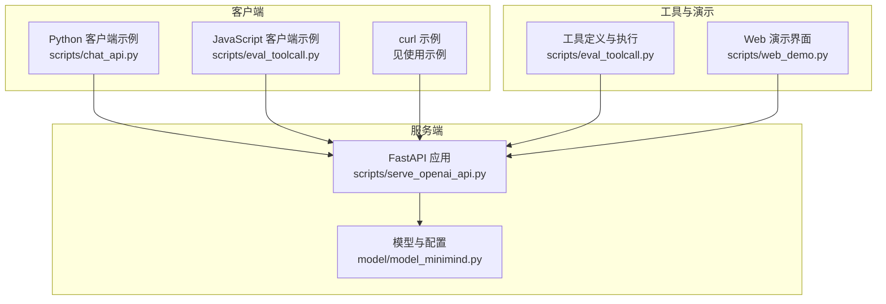
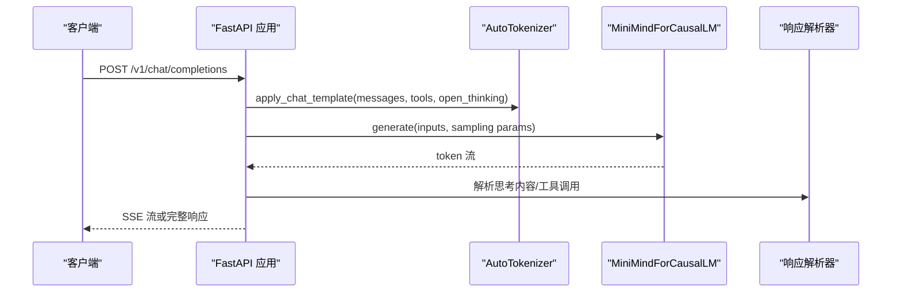

# API 参考文档

<cite>
**本文档引用的文件**
- [README.md](file://README.md)
- [requirements.txt](file://requirements.txt)
- [scripts/serve_openai_api.py](file://scripts/serve_openai_api.py)
- [scripts/chat_api.py](file://scripts/chat_api.py)
- [scripts/eval_toolcall.py](file://scripts/eval_toolcall.py)
- [model/model_minimind.py](file://model/model_minimind.py)
- [scripts/web_demo.py](file://scripts/web_demo.py)
</cite>

## 目录
1. [简介](#简介)
2. [项目结构](#项目结构)
3. [核心组件](#核心组件)
4. [架构概览](#架构概览)
5. [详细组件分析](#详细组件分析)
6. [依赖关系分析](#依赖关系分析)
7. [性能考量](#性能考量)
8. [故障排除指南](#故障排除指南)
9. [结论](#结论)
10. [附录](#附录)

## 简介
本文件为 MiniMind 的 OpenAI API 兼容接口参考文档，覆盖聊天完成（Chat Completions）端点的完整规范，包括 HTTP 方法、URL 模式、请求/响应结构、参数说明、认证方式、错误处理机制、速率限制策略、使用示例与客户端实现指南（Python、JavaScript、curl），以及 API 版本管理与向后兼容性说明。MiniMind 通过内置的 FastAPI 服务提供 OpenAI 协议兼容的推理接口，支持流式与非流式响应、工具调用（Tool Call）、思考内容（Reasoning Content）等高级特性。

## 项目结构
- 服务端入口：scripts/serve_openai_api.py
- 客户端示例：scripts/chat_api.py、scripts/eval_toolcall.py
- 模型与配置：model/model_minimind.py
- Web 演示：scripts/web_demo.py
- 依赖声明：requirements.txt
- 项目说明与特性：README.md

图表来源
- [scripts/serve_openai_api.py:1-246](file://scripts/serve_openai_api.py#L1-L246)
- [model/model_minimind.py:1-200](file://model/model_minimind.py#L1-L200)
- [scripts/chat_api.py:1-40](file://scripts/chat_api.py#L1-L40)
- [scripts/eval_toolcall.py:1-200](file://scripts/eval_toolcall.py#L1-L200)
- [scripts/web_demo.py:1-200](file://scripts/web_demo.py#L1-L200)

章节来源
- [README.md:95-96](file://README.md#L95-L96)
- [requirements.txt:1-32](file://requirements.txt#L1-L32)

## 核心组件
- OpenAI 兼容聊天完成端点：/v1/chat/completions
- 请求模型：ChatRequest（包含模型名、消息数组、采样参数、流式标志、工具列表、思考开关等）
- 响应模型：标准 OpenAI ChatCompletion 结构（支持流式 SSE）
- 工具调用解析：从生成文本中提取工具调用 JSON 并注入响应
- 思考内容解析：从生成文本中提取思考标记并分段返回
- 错误处理：异常捕获并返回 JSON 错误对象或 HTTP 500

章节来源
- [scripts/serve_openai_api.py:50-228](file://scripts/serve_openai_api.py#L50-L228)

## 架构概览
MiniMind 的 OpenAI 兼容服务采用 FastAPI + Uvicorn，基于 Transformers 的 AutoTokenizer 与 MiniMindForCausalLM 模型进行推理。服务支持：
- 流式与非流式生成
- 工具调用（Tool Call）与思考内容（Reasoning Content）
- 自适应思考开关（open_thinking）
- SSE 流式事件传输

图表来源
- [scripts/serve_openai_api.py:171-228](file://scripts/serve_openai_api.py#L171-L228)
- [scripts/serve_openai_api.py:105-169](file://scripts/serve_openai_api.py#L105-L169)

## 详细组件分析

### 端点：/v1/chat/completions
- HTTP 方法：POST
- URL 模式：/v1/chat/completions
- 功能：生成聊天回复，支持流式与非流式，支持工具调用与思考内容
- 认证：未实现鉴权中间件（示例中使用本地端口 8998）
- 速率限制：未实现全局速率限制（可在上游网关或容器中配置）

请求体（JSON）字段
- model: 字符串，模型标识（示例返回 "minimind"）
- messages: 数组，消息对象数组（role: user/assistant/system/tool）
- temperature: 浮点数，采样温度（默认 0.7）
- top_p: 浮点数，核采样概率（默认 0.92）
- max_tokens: 整数，最大生成长度（默认 8192）
- stream: 布尔值，是否启用流式（默认 true）
- tools: 数组，工具定义（可选）
- open_thinking: 布尔值，是否启用自适应思考（可选）
- chat_template_kwargs: 对象，模板参数（可包含 open_thinking 或 enable_thinking）

响应体（JSON）字段
- id: 字符串，请求唯一标识
- object: 字符串，对象类型（chat.completion）
- created: 整数，时间戳
- model: 字符串，模型名
- choices: 数组，包含一个元素
  - index: 整数，索引
  - message: 对象
    - role: 字符串，assistant
    - content: 字符串，回复内容
    - reasoning_content: 字符串，思考内容（可选）
    - tool_calls: 数组，工具调用列表（可选）
  - finish_reason: 字符串，停止原因（tool_calls 或 stop）

流式响应（SSE）
- data: JSON 字符串，包含 delta 字段
  - delta.content: 字符串，增量内容
  - delta.reasoning_content: 字符串，增量思考内容
  - delta.tool_calls: 数组，增量工具调用片段
  - delta.finish_reason: 字符串，结束原因

章节来源
- [scripts/serve_openai_api.py:50-228](file://scripts/serve_openai_api.py#L50-L228)

### 请求模型：ChatRequest
- 字段定义与默认值
  - model: 字符串
  - messages: 数组
  - temperature: 0.7
  - top_p: 0.92
  - max_tokens: 8192
  - stream: true
  - tools: []
  - open_thinking: false
  - chat_template_kwargs: null
- 辅助方法
  - get_open_thinking(): 兼容多种开启思考的方式（open_thinking、chat_template_kwargs 中的 open_thinking 或 enable_thinking）

章节来源
- [scripts/serve_openai_api.py:50-69](file://scripts/serve_openai_api.py#L50-L69)

### 响应解析与工具调用
- 思考内容解析：从生成文本中提取思考标记（