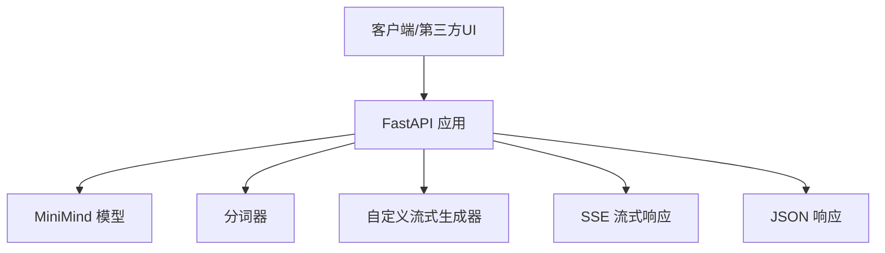
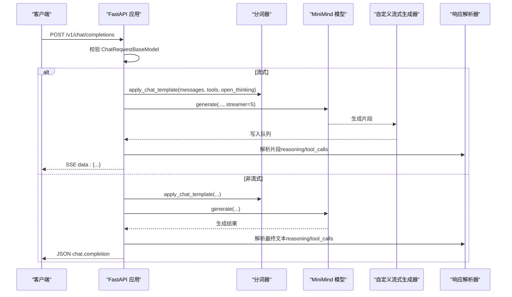
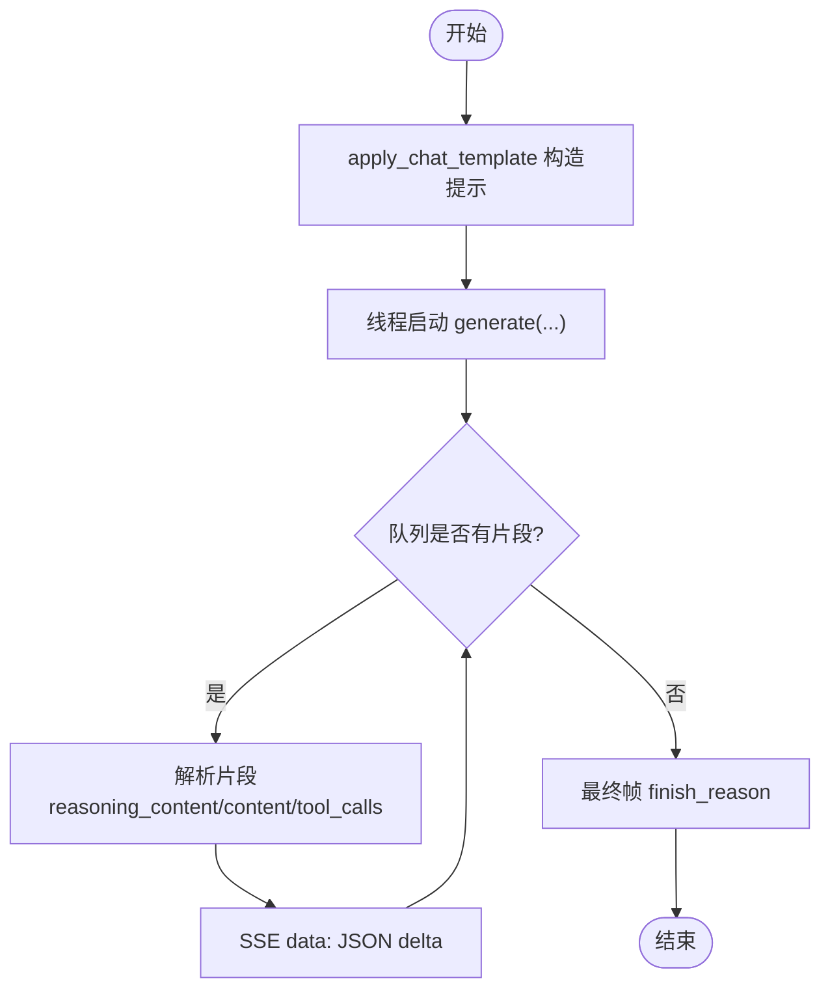
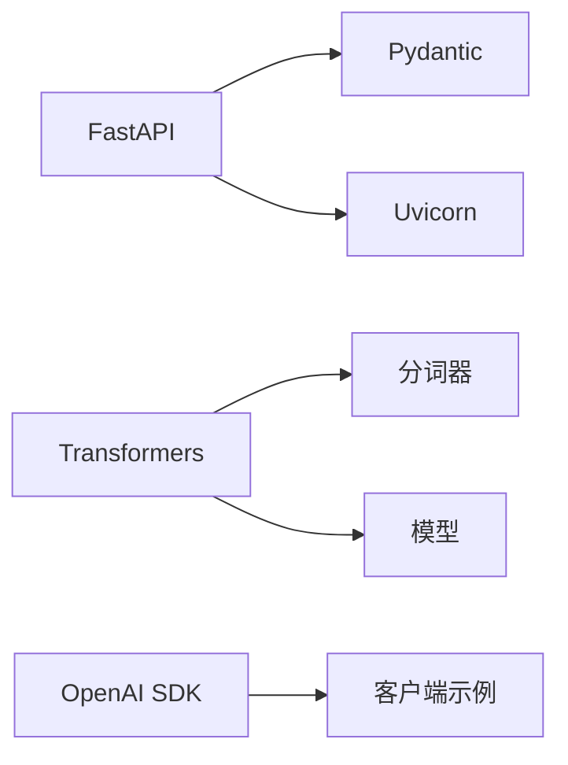

# HTTP 端点规范

<cite>
**本文引用的文件**
- [serve_openai_api.py](file://scripts/serve_openai_api.py)
- [chat_api.py](file://scripts/chat_api.py)
- [model_minimind.py](file://model/model_minimind.py)
- [web_demo.py](file://scripts/web_demo.py)
- [README.md](file://README.md)
- [requirements.txt](file://requirements.txt)
</cite>

## 目录
1. [简介](#简介)
2. [项目结构](#项目结构)
3. [核心组件](#核心组件)
4. [架构总览](#架构总览)
5. [详细组件分析](#详细组件分析)
6. [依赖关系分析](#依赖关系分析)
7. [性能考量](#性能考量)
8. [故障排查指南](#故障排查指南)
9. [结论](#结论)
10. [附录](#附录)

## 简介
本规范文档面向 MiniMind 的 HTTP API，聚焦于 /v1/chat/completions 端点，系统性说明：
- 请求与响应模式（含流式与非流式）
- FastAPI 框架使用（BaseModel 验证、异常处理、响应格式标准化）
- 参数详解与状态码含义
- 版本管理、向后兼容性与迁移指南
- 客户端示例与最佳实践

本项目提供兼容 OpenAI API 协议的服务端，便于接入 FastGPT、Open-WebUI 等第三方 Chat UI，并支持 reasoning_content、tool_calls、open_thinking 等增强特性。

## 项目结构
与 HTTP API 直接相关的文件与职责概览：
- scripts/serve_openai_api.py：FastAPI 应用入口，定义 /v1/chat/completions 端点、请求模型、流式生成与响应格式
- scripts/chat_api.py：客户端示例，演示如何调用 /v1/chat/completions（非流式/流式）
- model/model_minimind.py：MiniMind 模型与配置，为推理提供 generate 接口
- scripts/web_demo.py：Web UI 示例，展示工具调用与思考标记的渲染逻辑
- README.md：项目背景、特性与兼容性说明
- requirements.txt：依赖版本（包含 FastAPI、Pydantic、Transformers 等）

图表来源
- [serve_openai_api.py:171-227](file://scripts/serve_openai_api.py#L171-L227)
- [model_minimind.py:229-280](file://model/model_minimind.py#L229-L280)

章节来源
- [serve_openai_api.py:1-246](file://scripts/serve_openai_api.py#L1-L246)
- [model_minimind.py:1-280](file://model/model_minimind.py#L1-L280)
- [README.md:95-96](file://README.md#L95-L96)

## 核心组件
- FastAPI 应用与路由
  - 应用实例、中间件与路由装饰器
  - /v1/chat/completions 路由定义与请求处理
- 请求模型（BaseModel）
  - ChatRequest：定义请求字段、默认值与辅助方法
- 流式生成器
  - 自定义 TextStreamer 子类，将生成片段写入队列
  - generate_stream_response：组装 SSE 数据帧
- 响应解析与格式化
  - parse_response：提取 reasoning_content、tool_calls
  - 非流式响应：标准化 OpenAI 风格的 chat.completion
- 异常处理
  - try-catch 包裹，HTTPException 标准化错误返回

章节来源
- [serve_openai_api.py:25-25](file://scripts/serve_openai_api.py#L25-L25)
- [serve_openai_api.py:50-68](file://scripts/serve_openai_api.py#L50-L68)
- [serve_openai_api.py:71-81](file://scripts/serve_openai_api.py#L71-L81)
- [serve_openai_api.py:83-102](file://scripts/serve_openai_api.py#L83-L102)
- [serve_openai_api.py:105-168](file://scripts/serve_openai_api.py#L105-L168)
- [serve_openai_api.py:171-227](file://scripts/serve_openai_api.py#L171-L227)

## 架构总览
下图展示 /v1/chat/completions 的端到端调用链路与数据流。

图表来源
- [serve_openai_api.py:171-227](file://scripts/serve_openai_api.py#L171-L227)
- [serve_openai_api.py:105-168](file://scripts/serve_openai_api.py#L105-L168)
- [serve_openai_api.py:83-102](file://scripts/serve_openai_api.py#L83-L102)
- [model_minimind.py:249-280](file://model/model_minimind.py#L249-L280)

## 详细组件分析

### /v1/chat/completions 端点
- 方法与路径
  - POST /v1/chat/completions
- 请求体（JSON）
  - model: 字符串，模型标识（兼容 OpenAI 风格）
  - messages: 数组，对话消息列表（role/content/system/tool 等）
  - temperature: 浮点数，默认 0.7
  - top_p: 浮点数，默认 0.92
  - max_tokens: 整数，默认 8192
  - stream: 布尔，默认 true
  - tools: 数组，默认 []
  - open_thinking: 布尔，默认 false
  - chat_template_kwargs: 对象，默认 null
- 响应
  - 非流式：标准 OpenAI 风格 chat.completion
  - 流式：SSE，data: 前缀，逐帧推送 delta
- 错误处理
  - 服务器内部错误：HTTP 500，返回 error 字段

章节来源
- [serve_openai_api.py:171-227](file://scripts/serve_openai_api.py#L171-L227)
- [serve_openai_api.py:50-68](file://scripts/serve_openai_api.py#L50-L68)

### 请求模型与验证（BaseModel）
- ChatRequest 字段与默认值
  - model: 字符串
  - messages: 列表
  - temperature: 0.7
  - top_p: 0.92
  - max_tokens: 8192
  - stream: true
  - tools: []
  - open_thinking: false
  - chat_template_kwargs: null
- 辅助方法
  - get_open_thinking：兼容多种开启思考的方式（open_thinking、chat_template_kwargs 中的 open_thinking 或 enable_thinking）

章节来源
- [serve_openai_api.py:50-68](file://scripts/serve_openai_api.py#L50-L68)

### 流式生成与 SSE 响应
- 生成流程
  - apply_chat_template 构造提示词
  - 启动线程执行 model.generate，TextIteratorStreamer 将片段写入队列
  - 逐帧解析：reasoning_content、content、tool_calls
- SSE 数据帧
  - 每帧为 JSON 对象，包含 choices[].delta
  - 最终帧包含 finish_reason（stop 或 tool_calls）
- 错误帧
  - 出错时返回包含 error 字段的 JSON

图表来源
- [serve_openai_api.py:105-168](file://scripts/serve_openai_api.py#L105-L168)
- [serve_openai_api.py:71-81](file://scripts/serve_openai_api.py#L71-L81)

章节来源
- [serve_openai_api.py:105-168](file://scripts/serve_openai_api.py#L105-L168)

### 非流式响应与 OpenAI 兼容
- 生成策略
  - apply_chat_template 构造提示词，截断到 max_tokens
  - 调用 model.generate 获取 token，解码为文本
- 响应结构
  - 标准 OpenAI chat.completion：id、object、created、model、choices[]
  - choices[].message 支持 content、reasoning_content、tool_calls
  - finish_reason：stop 或 tool_calls

章节来源
- [serve_openai_api.py:186-225](file://scripts/serve_openai_api.py#L186-L225)
- [serve_openai_api.py:83-102](file://scripts/serve_openai_api.py#L83-L102)

### 客户端示例（非流式与流式）
- 非流式
  - 直接读取 choices[0].message.content
- 流式
  - 逐帧读取 choices[0].delta.content 与 choices[0].delta.reasoning_content
  - 若出现 tool_calls，按顺序处理工具调用

章节来源
- [chat_api.py:14-40](file://scripts/chat_api.py#L14-L40)

### 工具调用与思考标记
- 工具调用
  - 通过 chat_template_kwargs.tools 传入工具定义
  - 生成文本中包含特定标记，parse_response 抽取 tool_calls
- 思考标记
  - open_thinking 控制是否输出思考内容
  - 生成文本中包含特定标记，parse_response 抽取 reasoning_content

章节来源
- [serve_openai_api.py:83-102](file://scripts/serve_openai_api.py#L83-L102)
- [web_demo.py:107-116](file://scripts/web_demo.py#L107-L116)

## 依赖关系分析
- 框架与库
  - FastAPI、Pydantic：Web 框架与请求模型验证
  - Transformers：分词器与模型加载
  - Uvicorn：ASGI 服务器
  - OpenAI SDK：客户端示例
- 版本与兼容
  - 依赖版本在 requirements.txt 中声明
  - README 指出与第三方推理框架的兼容性与迁移成本

图表来源
- [requirements.txt:15-21](file://requirements.txt#L15-L21)
- [requirements.txt:12](file://requirements.txt#L12)
- [serve_openai_api.py:16-21](file://scripts/serve_openai_api.py#L16-L21)

章节来源
- [requirements.txt:1-32](file://requirements.txt#L1-L32)
- [README.md:95](file://README.md#L95)

## 性能考量
- 流式生成
  - 使用 TextIteratorStreamer 与队列，避免阻塞主线程
  - SSE 推送粒度细，延迟低
- 生成参数
  - temperature、top_p、max_tokens 影响生成质量与吞吐
  - 建议根据场景调整，避免过长上下文导致内存压力
- 设备与精度
  - 模型加载为半精度（half），建议在 GPU 上运行以获得最佳性能

[本节为通用指导，不直接分析具体文件]

## 故障排查指南
- 常见错误与处理
  - 服务器内部错误：HTTP 500，响应包含 error 字段
  - 请求参数缺失或类型不符：BaseModel 校验失败，返回 422（由 FastAPI 默认处理）
- 定位问题
  - 查看服务端日志与异常栈
  - 确认分词器与模型加载路径正确
  - 检查 chat_template_kwargs 与 tools 的格式
- 建议
  - 在生产环境使用 HTTPS 与限流
  - 对长上下文进行截断与校验

章节来源
- [serve_openai_api.py:226-227](file://scripts/serve_openai_api.py#L226-L227)

## 结论
本规范系统梳理了 MiniMind 的 /v1/chat/completions 端点，覆盖请求/响应模式、FastAPI 使用方式、流式与非流式实现、错误处理与兼容性要点。结合客户端示例与工具调用/思考标记能力，可快速对接第三方 UI 与应用。

[本节为总结性内容，不直接分析具体文件]

## 附录

### API 定义与参数说明
- 端点：POST /v1/chat/completions
- 请求体字段
  - model: 字符串
  - messages: 数组
  - temperature: 浮点数，默认 0.7
  - top_p: 浮点数，默认 0.92
  - max_tokens: 整数，默认 8192
  - stream: 布尔，默认 true
  - tools: 数组，默认 []
  - open_thinking: 布尔，默认 false
  - chat_template_kwargs: 对象，默认 null
- 响应
  - 非流式：chat.completion
  - 流式：SSE，逐帧 delta
- 状态码
  - 200：成功
  - 422：请求参数校验失败（由 FastAPI 默认处理）
  - 500：服务器内部错误

章节来源
- [serve_openai_api.py:50-68](file://scripts/serve_openai_api.py#L50-L68)
- [serve_openai_api.py:171-227](file://scripts/serve_openai_api.py#L171-L227)

### 请求与响应示例（路径指引）
- 非流式请求示例
  - [serve_openai_api.py:186-193](file://scripts/serve_openai_api.py#L186-L193)
- 非流式响应示例
  - [serve_openai_api.py:213-225](file://scripts/serve_openai_api.py#L213-L225)
- 流式请求示例
  - [chat_api.py:14-22](file://scripts/chat_api.py#L14-L22)
- 流式响应示例（SSE）
  - [serve_openai_api.py:174-185](file://scripts/serve_openai_api.py#L174-L185)

### 版本管理与兼容性
- 兼容性说明
  - README 明确指出与第三方推理框架（llama.cpp、vllm）的兼容性与迁移成本
  - 旧版本模型加载策略变更，维护策略调整
- 迁移建议
  - 优先使用 Transformers 格式模型
  - 若需兼容旧生态，评估迁移成本与风险
  - 关注 README 的更新日志与迁移指引

章节来源
- [README.md:95-96](file://README.md#L95-L96)
- [README.md:160-167](file://README.md#L160-L167)