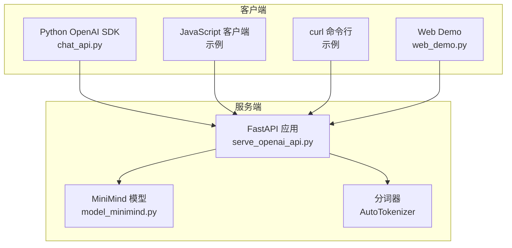
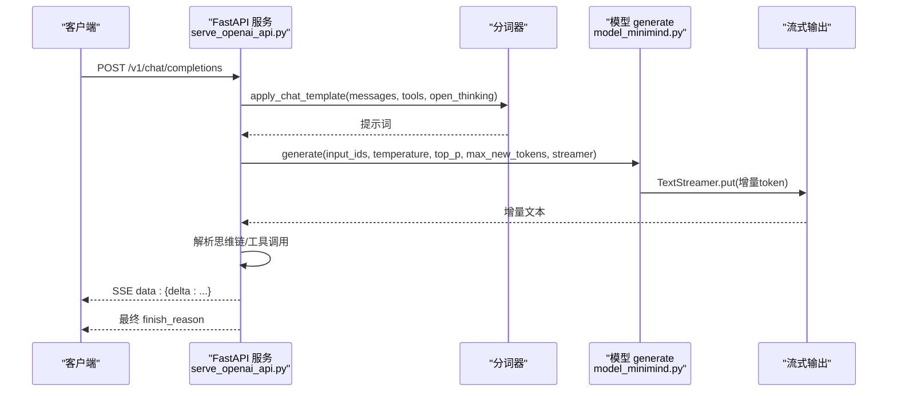
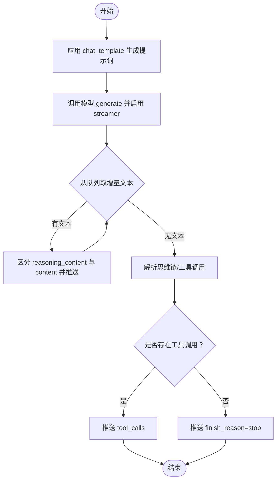
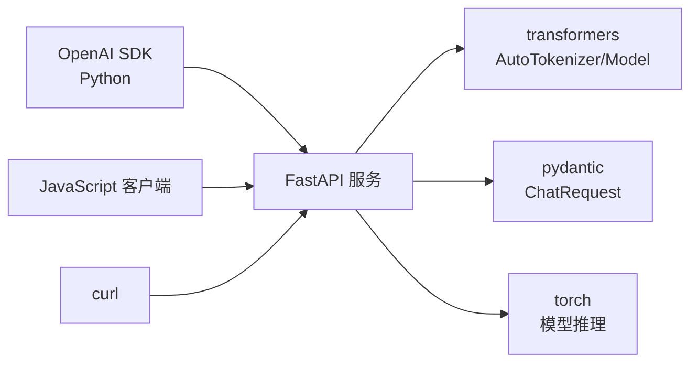

# OpenAI 兼容接口

<cite>
**本文引用的文件**
- [README.md](file://README.md)
- [serve_openai_api.py](file://scripts/serve_openai_api.py)
- [chat_api.py](file://scripts/chat_api.py)
- [eval_toolcall.py](file://scripts/eval_toolcall.py)
- [web_demo.py](file://scripts/web_demo.py)
- [model_minimind.py](file://model/model_minimind.py)
- [lm_dataset.py](file://dataset/lm_dataset.py)
- [requirements.txt](file://requirements.txt)
</cite>

## 目录
1. [简介](#简介)
2. [项目结构](#项目结构)
3. [核心组件](#核心组件)
4. [架构总览](#架构总览)
5. [详细组件分析](#详细组件分析)
6. [依赖分析](#依赖分析)
7. [性能考量](#性能考量)
8. [故障排查指南](#故障排查指南)
9. [结论](#结论)
10. [附录](#附录)

## 简介
本文件为 MiniMind 的 OpenAI 兼容 API 接口参考文档，聚焦 /v1/chat/completions 端点的完整规范，涵盖：
- 请求参数（messages、temperature、top_p、max_tokens、stream、tools、open_thinking、chat_template_kwargs 等）
- 响应格式与 SSE 流式传输机制
- ChatRequest 模型字段定义与验证规则
- 思维链（thinking）与工具调用（tool_calls）的特殊处理机制
- 错误处理、状态码说明与常见问题解决方案
- Python、JavaScript、curl 等多语言调用示例（以路径与片段形式呈现）

MiniMind 通过内置 FastAPI 服务提供 OpenAI 兼容接口，支持本地推理与流式输出，并在生成文本中内嵌思维链与工具调用标记，便于客户端解析与展示。

## 项目结构
与 OpenAI 兼容接口直接相关的文件与职责概览：
- scripts/serve_openai_api.py：FastAPI 应用与 /v1/chat/completions 实现，包含 ChatRequest 定义、流式生成与 SSE 输出、思维链与工具调用解析
- scripts/chat_api.py：OpenAI SDK 示例，演示如何以 extra_body 传入 chat_template_kwargs 与 reasoning_effort
- scripts/eval_toolcall.py：工具调用解析与执行示例，展示如何从文本中提取工具调用并执行
- scripts/web_demo.py：Streamlit Web Demo，展示如何在前端渲染思维链与工具调用
- model/model_minimind.py：MiniMind 模型与 GenerationMixin，提供 generate 方法与流式输出支持
- dataset/lm_dataset.py：训练数据处理与 chat_template 使用示例
- README.md：项目总体说明，包含兼容 OpenAI API 的描述与特性

图表来源
- [serve_openai_api.py:1-246](file://scripts/serve_openai_api.py#L1-L246)
- [model_minimind.py:229-280](file://model/model_minimind.py#L229-L280)

章节来源
- [README.md:95-96](file://README.md#L95-L96)
- [requirements.txt:12-21](file://requirements.txt#L12-L21)

## 核心组件
- ChatRequest（请求模型）
  - 字段：model、messages、temperature、top_p、max_tokens、stream、tools、open_thinking、chat_template_kwargs
  - 验证与兼容：open_thinking 可通过 chat_template_kwargs 的 enable_thinking/open_thinking 兼容开启
- 流式生成与 SSE
  - 使用 TextStreamer/Queue 与自定义 CustomStreamer 实现增量文本推送
  - SSE 格式：data: {...}\n\n
- 思维链（Thinking）与工具调用（Tool Calls）
  - 思维链：使用特定标记包裹思考内容，服务端在流式输出中优先发送 reasoning_content，随后发送正文 content
  - 工具调用：使用特定标记包裹 JSON 调用，服务端解析为 OpenAI 格式的 tool_calls，并在流结束时返回 finish_reason=tool_calls 或 stop

章节来源
- [serve_openai_api.py:50-69](file://scripts/serve_openai_api.py#L50-L69)
- [serve_openai_api.py:71-81](file://scripts/serve_openai_api.py#L71-L81)
- [serve_openai_api.py:83-102](file://scripts/serve_openai_api.py#L83-L102)
- [serve_openai_api.py:105-169](file://scripts/serve_openai_api.py#L105-L169)
- [serve_openai_api.py:171-228](file://scripts/serve_openai_api.py#L171-L228)

## 架构总览
OpenAI 兼容接口的端到端流程如下：
- 客户端发起 /v1/chat/completions 请求（支持流式与非流式）
- 服务端将 messages 应用 chat_template，生成提示词
- 调用模型 generate 方法，按 temperature/top_p/max_tokens 控制采样与长度
- 流式模式下，通过 TextStreamer/Queue 逐步产出增量文本
- 服务端解析文本中的思维链与工具调用，按 SSE 推送 delta
- 非流式模式下，一次性解析并返回完整响应

图表来源
- [serve_openai_api.py:105-169](file://scripts/serve_openai_api.py#L105-L169)
- [model_minimind.py:249-280](file://model/model_minimind.py#L249-L280)

## 详细组件分析

### /v1/chat/completions 端点规范
- HTTP 方法与路径
  - POST /v1/chat/completions
- 请求体（JSON）
  - model: 字符串，固定为 "minimind"
  - messages: 数组，每项包含 role（user/assistant/system/tool）与 content
  - temperature: 浮点数，采样温度（默认 0.7）
  - top_p: 浮点数，核采样阈值（默认 0.92）
  - max_tokens: 整数，最大生成长度（默认 8192）
  - stream: 布尔值，是否启用流式输出（默认 true）
  - tools: 数组，工具定义（可选）
  - open_thinking: 布尔值，是否开启自适应思考（默认 false）
  - chat_template_kwargs: 字典，透传给 chat_template 的额外参数（可选）
- 响应体（JSON）
  - 非流式：完整 chat.completion 响应
  - 流式：SSE，逐块返回 delta，最后返回 finish_reason
- 特殊字段
  - reasoning_content：在开启 open_thinking 时，服务端优先推送该字段
  - tool_calls：在生成文本中包含工具调用标记时，解析为 OpenAI 格式并随 delta 返回
  - finish_reason：tool_calls 或 stop

章节来源
- [serve_openai_api.py:171-228](file://scripts/serve_openai_api.py#L171-L228)
- [serve_openai_api.py:187-225](file://scripts/serve_openai_api.py#L187-L225)

### ChatRequest 模型与验证规则
- 字段定义
  - model: 字符串
  - messages: 列表
  - temperature: 浮点数，默认 0.7
  - top_p: 浮点数，默认 0.92
  - max_tokens: 整数，默认 8192
  - stream: 布尔值，默认 true
  - tools: 列表，默认 []
  - open_thinking: 布尔值，默认 false
  - chat_template_kwargs: 字典，默认 None
- 验证与兼容
  - get_open_thinking：兼容 open_thinking 与 chat_template_kwargs.enable_thinking/open_thinking
- 注意
  - 未在代码中显式校验字段类型与范围，建议客户端确保类型正确

章节来源
- [serve_openai_api.py:50-69](file://scripts/serve_openai_api.py#L50-L69)
- [serve_openai_api.py:61-68](file://scripts/serve_openai_api.py#L61-L68)

### 流式传输机制（SSE）
- 生成流程
  - 使用自定义 CustomStreamer 将模型生成的增量 token 放入队列
  - 服务端循环从队列取出文本，按思维链标记区分 reasoning_content 与 content
  - 逐块返回 data: {"choices":[{"delta":{...}}]}\n\n
- 思维链与正文的顺序
  - 若开启 open_thinking，先推送 reasoning_content，遇到思维链结束标记后，再推送正文 content
- 工具调用
  - 在流结束时，解析并返回 tool_calls 与 finish_reason

图表来源
- [serve_openai_api.py:105-169](file://scripts/serve_openai_api.py#L105-L169)

章节来源
- [serve_openai_api.py:71-81](file://scripts/serve_openai_api.py#L71-L81)
- [serve_openai_api.py:105-169](file://scripts/serve_openai_api.py#L105-L169)

### 思维链（Thinking）与工具调用（Tool Calls）处理
- 思维链
  - 服务端通过正则匹配思维链起止标记，提取 reasoning_content
  - 在流式输出中优先发送 reasoning_content，随后发送正文
- 工具调用
  - 服务端通过正则匹配工具调用标记，解析为 JSON 并组装为 OpenAI 格式 tool_calls
  - 在流结束时返回 finish_reason=tool_calls；否则为 stop
- Web Demo 与 Eval 工具调用
  - Web Demo 与 eval_toolcall.py 展示了如何在前端渲染工具调用与执行结果

章节来源
- [serve_openai_api.py:83-102](file://scripts/serve_openai_api.py#L83-L102)
- [web_demo.py:149-195](file://scripts/web_demo.py#L149-L195)
- [eval_toolcall.py:70-96](file://scripts/eval_toolcall.py#L70-L96)

### 请求与响应示例（路径与片段）
- Python（OpenAI SDK）
  - 示例路径：[chat_api.py:14-39](file://scripts/chat_api.py#L14-L39)
  - 关键点：使用 extra_body 传入 chat_template_kwargs 与 reasoning_effort
- JavaScript（OpenAI.js）
  - 示例路径：[chat_api.py:3-6](file://scripts/chat_api.py#L3-L6)
  - 关键点：base_url 指向本地服务，model 名称与 MiniMind 兼容
- curl
  - 示例路径：[serve_openai_api.py:171-228](file://scripts/serve_openai_api.py#L171-L228)
  - 关键点：POST /v1/chat/completions，Content-Type: application/json

章节来源
- [chat_api.py:3-39](file://scripts/chat_api.py#L3-L39)
- [serve_openai_api.py:171-228](file://scripts/serve_openai_api.py#L171-L228)

## 依赖分析
- 服务端依赖
  - FastAPI、uvicorn：提供 HTTP 服务与 SSE
  - transformers：AutoTokenizer、AutoModelForCausalLM、GenerationMixin
  - pydantic：ChatRequest 模型定义
- 客户端依赖
  - openai：Python SDK
  - streamlit：Web Demo
- 运行时
  - torch：模型推理
  - CUDA 可选（GPU 加速）

图表来源
- [requirements.txt:12-21](file://requirements.txt#L12-L21)
- [serve_openai_api.py:16-21](file://scripts/serve_openai_api.py#L16-L21)

章节来源
- [requirements.txt:12-21](file://requirements.txt#L12-L21)
- [serve_openai_api.py:16-21](file://scripts/serve_openai_api.py#L16-L21)

## 性能考量
- 采样参数
  - temperature 与 top_p 控制生成多样性与稳定性
  - top_k 与 repetition_penalty 在模型 generate 中使用，可按需调整
- 流式输出
  - 启用 stream=true 可降低首屏延迟，改善用户体验
- 上下文截断
  - 服务端对提示词进行截断，避免超出 max_tokens 限制
- 推理设备
  - 优先使用 CUDA，可在 GPU 上显著提升吞吐

章节来源
- [model_minimind.py:249-280](file://model/model_minimind.py#L249-L280)
- [serve_openai_api.py:107-107](file://scripts/serve_openai_api.py#L107-L107)

## 故障排查指南
- 500 内部错误
  - 服务端捕获异常并返回 HTTP 500，detail 为异常字符串
  - 常见原因：模型加载失败、tokenizer 未初始化、生成异常
- 400/404 状态码
  - 代码中未显式抛出 400/404，若出现此类状态码，可能是中间代理或上游网关返回
- 常见问题
  - 思维链不稳定：在多轮对话或 Tool Call 共存时，open_thinking 可能不稳定
  - 工具调用解析失败：工具调用标记格式不正确或 JSON 不合法
  - 流式输出乱码：确保客户端正确解析 SSE，忽略非 data 行
  - 超时或 OOM：适当降低 max_tokens、temperature 或 top_p

章节来源
- [serve_openai_api.py:226-227](file://scripts/serve_openai_api.py#L226-L227)
- [README.md:141-142](file://README.md#L141-L142)

## 结论
MiniMind 的 OpenAI 兼容接口在保持与 OpenAI API 高度一致的同时，提供了思维链与工具调用的原生支持。通过流式输出与 SSE，客户端可获得低延迟的交互体验。建议在生产环境中结合合理的采样参数与上下文截断策略，以获得最佳的性能与稳定性。

## 附录

### /v1/chat/completions 请求参数一览
- model: 字符串，固定为 "minimind"
- messages: 数组，role/content
- temperature: 浮点数，默认 0.7
- top_p: 浮点数，默认 0.92
- max_tokens: 整数，默认 8192
- stream: 布尔值，默认 true
- tools: 数组，工具定义（可选）
- open_thinking: 布尔值，默认 false
- chat_template_kwargs: 字典，透传给 chat_template 的额外参数（可选）

章节来源
- [serve_openai_api.py:50-69](file://scripts/serve_openai_api.py#L50-L69)

### /v1/chat/completions 响应字段说明
- 非流式
  - id、object、created、model、choices[].message.content、choices[].finish_reason
  - 若存在思维链：choices[].message.reasoning_content
  - 若存在工具调用：choices[].message.tool_calls
- 流式（SSE）
  - 每块 delta 中包含 reasoning_content、content、tool_calls
  - 最后一块包含 finish_reason

章节来源
- [serve_openai_api.py:187-225](file://scripts/serve_openai_api.py#L187-L225)

### 思维链与工具调用标记
- 思维链起止标记：用于包裹思考内容
- 工具调用标记：用于包裹 JSON 调用，服务端解析为 OpenAI 格式

章节来源
- [serve_openai_api.py:83-102](file://scripts/serve_openai_api.py#L83-L102)

### 多语言调用示例（路径）
- Python（OpenAI SDK）
  - [chat_api.py:14-39](file://scripts/chat_api.py#L14-L39)
- JavaScript（OpenAI.js）
  - [chat_api.py:3-6](file://scripts/chat_api.py#L3-L6)
- curl
  - [serve_openai_api.py:171-228](file://scripts/serve_openai_api.py#L171-L228)