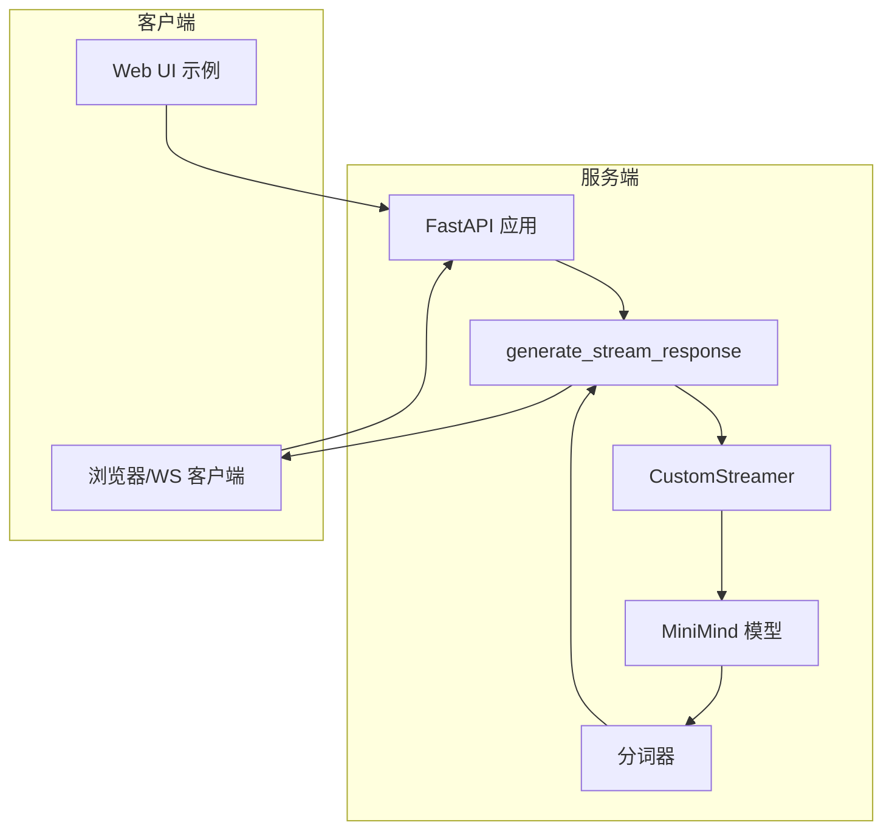
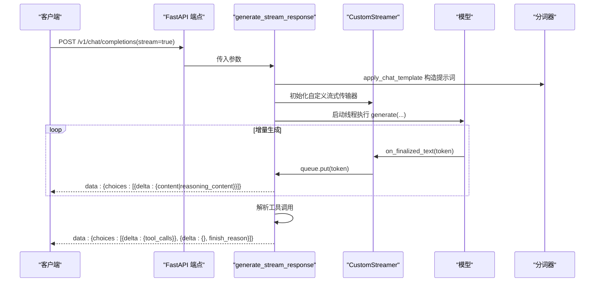
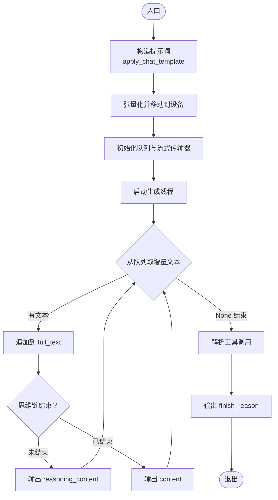
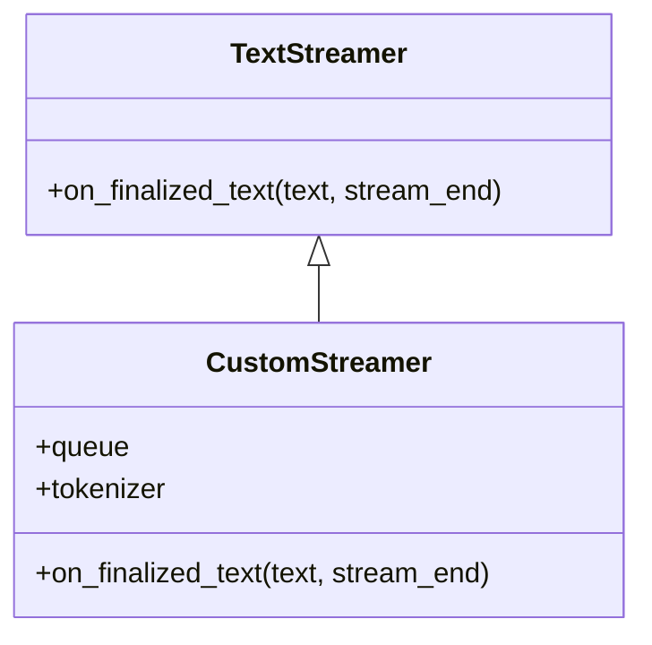
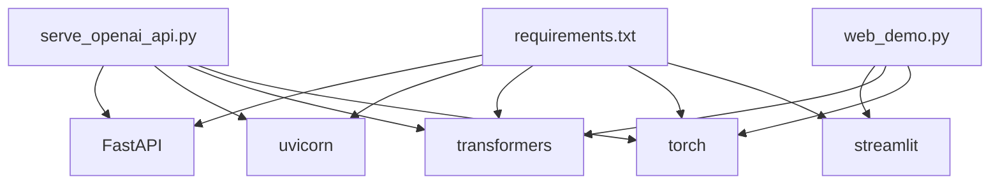

# WebSocket 实时接口

<cite>
**本文引用的文件**
- [README.md](file://README.md)
- [serve_openai_api.py](file://scripts/serve_openai_api.py)
- [web_demo.py](file://scripts/web_demo.py)
- [model_minimind.py](file://model/model_minimind.py)
- [requirements.txt](file://requirements.txt)
</cite>

## 目录
1. [引言](#引言)
2. [项目结构](#项目结构)
3. [核心组件](#核心组件)
4. [架构概览](#架构概览)
5. [详细组件分析](#详细组件分析)
6. [依赖关系分析](#依赖关系分析)
7. [性能考量](#性能考量)
8. [故障排查指南](#故障排查指南)
9. [结论](#结论)

## 引言
本文件聚焦 MiniMind 的实时通信接口，系统性阐述基于 SSE（Server-Sent Events）的流式响应机制，涵盖连接建立、消息格式、事件类型与断开处理。文档详细解析 generate_stream_response 函数的工作原理，包括队列管理、线程同步与流式文本生成过程，并提供 WebSocket 客户端实现示例，展示如何处理增量响应、思维链内容与工具调用结果。最后总结流式传输的性能优化与错误恢复策略。

## 项目结构
MiniMind 项目采用脚本驱动的服务端与前端演示相结合的结构：
- 服务端：基于 FastAPI 的 OpenAI 兼容 API，提供 SSE 流式响应
- 前端演示：Streamlit Web UI，展示工具调用与思考链渲染
- 模型与分词器：自研 MiniMind 模型与分词器，支持思维链与工具调用标记

图表来源
- [serve_openai_api.py:171-185](file://scripts/serve_openai_api.py#L171-L185)
- [serve_openai_api.py:105-169](file://scripts/serve_openai_api.py#L105-L169)
- [serve_openai_api.py:71-81](file://scripts/serve_openai_api.py#L71-L81)
- [model_minimind.py:10-45](file://model/model_minimind.py#L10-L45)

章节来源
- [README.md:95-96](file://README.md#L95-L96)
- [requirements.txt:1-32](file://requirements.txt#L1-L32)

## 核心组件
- SSE 流式响应端点：/v1/chat/completions，返回 text/event-stream
- 流式生成器：generate_stream_response，负责提示词构造、模型生成、增量输出与工具调用解析
- 自定义流式传输器：CustomStreamer，将模型生成的 token 写入队列，供 SSE 端点消费
- 模型与分词器：MiniMindForCausalLM 与 AutoTokenizer，支持思维链与工具调用标记
- 前端演示：web_demo.py，展示工具调用与思考链渲染

章节来源
- [serve_openai_api.py:171-185](file://scripts/serve_openai_api.py#L171-L185)
- [serve_openai_api.py:105-169](file://scripts/serve_openai_api.py#L105-L169)
- [serve_openai_api.py:71-81](file://scripts/serve_openai_api.py#L71-L81)
- [web_demo.py:149-195](file://scripts/web_demo.py#L149-L195)

## 架构概览
SSE 流式响应的关键流程：
- 客户端请求 /v1/chat/completions，携带 messages、temperature、top_p、max_tokens、tools、open_thinking 等参数
- 服务端使用分词器构造提示词，限制最大长度
- 启动线程执行模型生成，生成器通过 CustomStreamer 将增量 token 写入队列
- 主线程循环从队列取出增量文本，按思维链与内容分段输出
- 生成结束时解析工具调用，输出 finish_reason

图表来源
- [serve_openai_api.py:171-185](file://scripts/serve_openai_api.py#L171-L185)
- [serve_openai_api.py:105-169](file://scripts/serve_openai_api.py#L105-L169)
- [serve_openai_api.py:71-81](file://scripts/serve_openai_api.py#L71-L81)

## 详细组件分析

### SSE 端点与消息格式
- 端点：/v1/chat/completions
- 请求体：ChatRequest，包含 messages、temperature、top_p、max_tokens、stream、tools、open_thinking、chat_template_kwargs
- 响应：text/event-stream，每条数据以 data: 前缀，末尾双换行分隔
- delta 字段：
  - content：增量文本
  - reasoning_content：思维链内容
  - tool_calls：工具调用结果
- finish_reason：stop 或 tool_calls

章节来源
- [serve_openai_api.py:50-68](file://scripts/serve_openai_api.py#L50-L68)
- [serve_openai_api.py:171-185](file://scripts/serve_openai_api.py#L171-L185)
- [serve_openai_api.py:162-165](file://scripts/serve_openai_api.py#L162-L165)

### generate_stream_response 工作原理
- 提示词构造：apply_chat_template，支持 tools 与 open_thinking
- 输入张量化：返回 tensors 并移动到设备
- 流式生成：
  - 初始化队列与 CustomStreamer
  - 启动线程执行 model.generate，将增量 token 写入队列
  - 主线程循环从队列取出文本，维护 emitted 指针与思维链状态
  - 思维链处理：遇到结束标记后，将思维链与正文分段输出
- 结束处理：
  - 解析工具调用，输出 tool_calls
  - 输出 finish_reason

图表来源
- [serve_openai_api.py:105-169](file://scripts/serve_openai_api.py#L105-L169)

章节来源
- [serve_openai_api.py:105-169](file://scripts/serve_openai_api.py#L105-L169)

### CustomStreamer 与队列管理
- 继承 TextStreamer，skip_prompt 与 skip_special_tokens
- on_finalized_text 将增量文本写入队列，结束时写入 None
- 队列作为生产者-消费者缓冲，避免主线程阻塞

图表来源
- [serve_openai_api.py:71-81](file://scripts/serve_openai_api.py#L71-L81)

章节来源
- [serve_openai_api.py:71-81](file://scripts/serve_openai_api.py#L71-L81)

### 思维链与工具调用解析
- 思维链：使用特殊标记包裹，解析时先提取思维链，再清理标记
- 工具调用：JSON 格式嵌入在特殊标记中，解析为 OpenAI 兼容格式
- 输出：delta 中的 reasoning_content、content、tool_calls

章节来源
- [serve_openai_api.py:83-102](file://scripts/serve_openai_api.py#L83-L102)
- [serve_openai_api.py:142-160](file://scripts/serve_openai_api.py#L142-L160)

### WebSocket 客户端实现示例
以下为基于浏览器 WebSocket 的客户端实现要点（示意）：
- 连接建立：ws://host:port/path（需服务端支持 WS）
- 消息格式：服务端 SSE 输出 data: 前缀，客户端需解析为 JSON
- 增量处理：逐条解析 delta.content 与 delta.reasoning_content
- 工具调用：解析 delta.tool_calls，发起工具调用并回传结果
- 断开处理：监听 close/error 事件，触发重连与状态恢复

章节来源
- [serve_openai_api.py:171-185](file://scripts/serve_openai_api.py#L171-L185)

### 前端 Web UI 与工具调用
- web_demo.py 展示工具调用与思考链渲染逻辑
- 流式生成时，将思维链与正文分别渲染
- 工具调用后，将工具结果插入消息流并继续生成

章节来源
- [web_demo.py:149-195](file://scripts/web_demo.py#L149-L195)
- [web_demo.py:384-412](file://scripts/web_demo.py#L384-L412)

## 依赖关系分析
- 服务端依赖：FastAPI、uvicorn、transformers、torch
- 模型与分词器：MiniMindForCausalLM、AutoTokenizer
- 前端依赖：Streamlit（用于演示）

图表来源
- [requirements.txt:1-32](file://requirements.txt#L1-L32)
- [serve_openai_api.py:14-21](file://scripts/serve_openai_api.py#L14-L21)
- [web_demo.py:10](file://scripts/web_demo.py#L10)

章节来源
- [requirements.txt:1-32](file://requirements.txt#L1-L32)
- [serve_openai_api.py:14-21](file://scripts/serve_openai_api.py#L14-L21)
- [web_demo.py:10](file://scripts/web_demo.py#L10)

## 性能考量
- 线程与队列：生成线程与主循环分离，避免阻塞 IO；队列作为缓冲，需合理设置队列长度与消费节奏
- 模型生成：使用 TextStreamer 与自定义流式传输器，减少一次性解码开销
- 提示词裁剪：对提示词进行长度裁剪，避免超出 max_tokens
- 缓存与复用：可考虑 KV 缓存与会话复用，减少重复计算
- 网络传输：SSE 以文本传输，注意编码与字符边界；WebSocket 可降低延迟与提高吞吐

## 故障排查指南
- 生成异常：generate_stream_response 捕获异常并返回 error 字段，客户端应检查响应中的 error
- 思维链不完整：确认 open_thinking 开关与标记使用；解析时注意思维链结束标记
- 工具调用失败：检查工具调用 JSON 格式与参数；前端需正确回传工具结果
- 断开重连：WebSocket 客户端需实现重连与状态恢复逻辑，避免丢失中间结果

章节来源
- [serve_openai_api.py:167-168](file://scripts/serve_openai_api.py#L167-L168)
- [serve_openai_api.py:142-160](file://scripts/serve_openai_api.py#L142-L160)

## 结论
MiniMind 的 SSE 实时接口通过 generate_stream_response 与 CustomStreamer 实现了高效的流式文本生成，支持思维链与工具调用的增量输出。结合 FastAPI 的 SSE 响应与前端 Web UI，可满足多轮对话与工具协作场景。WebSocket 客户端可按本文提供的要点进行实现，以获得更低延迟与更稳定的实时体验。