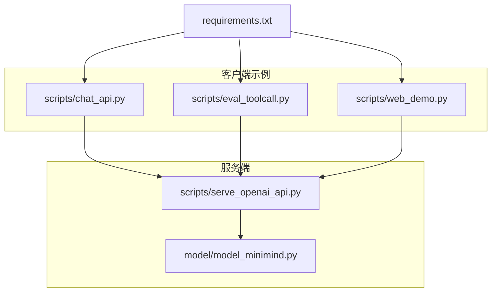
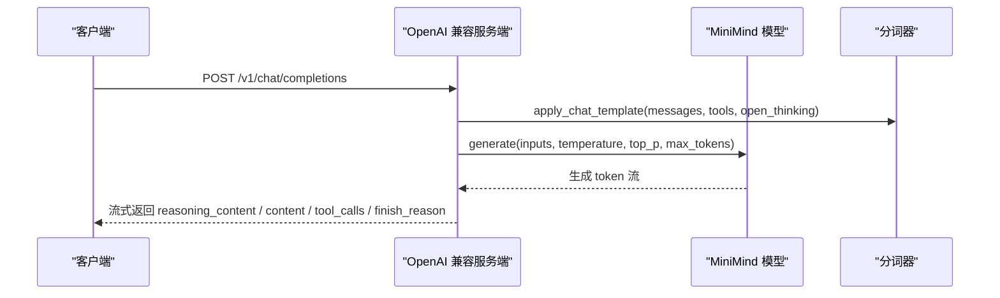
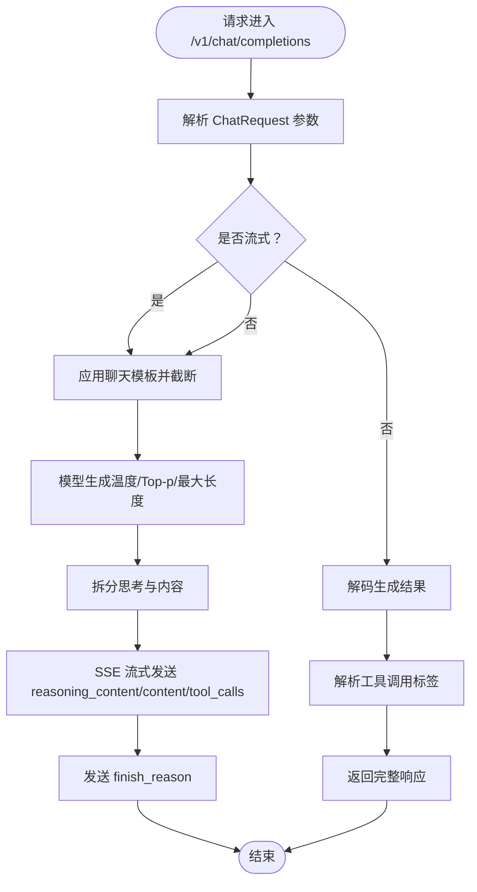
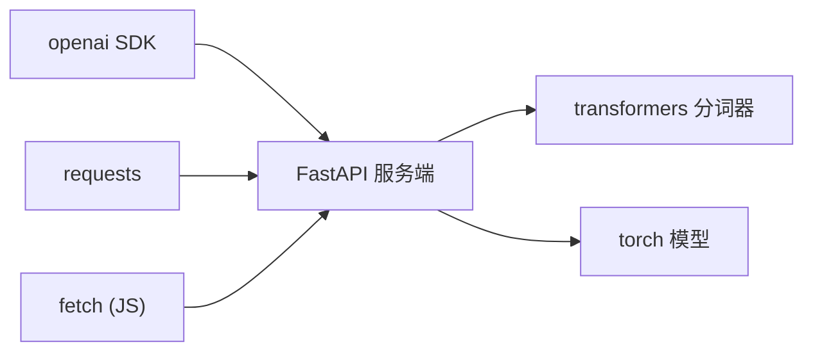

# 客户端集成指南

<cite>
**本文引用的文件**
- [README.md](file://README.md)
- [README_en.md](file://README_en.md)
- [requirements.txt](file://requirements.txt)
- [scripts/serve_openai_api.py](file://scripts/serve_openai_api.py)
- [scripts/chat_api.py](file://scripts/chat_api.py)
- [scripts/eval_toolcall.py](file://scripts/eval_toolcall.py)
- [scripts/web_demo.py](file://scripts/web_demo.py)
- [model/model_minimind.py](file://model/model_minimind.py)
</cite>

## 目录
1. [简介](#简介)
2. [项目结构](#项目结构)
3. [核心组件](#核心组件)
4. [架构总览](#架构总览)
5. [详细组件分析](#详细组件分析)
6. [依赖关系分析](#依赖关系分析)
7. [性能考量](#性能考量)
8. [故障排查指南](#故障排查指南)
9. [结论](#结论)
10. [附录](#附录)

## 简介
本指南面向希望在多种编程语言环境中集成 MiniMind API 的开发者，提供从 Python requests、JavaScript fetch、curl 命令行到 OpenAI 兼容客户端的完整集成路径。文档涵盖认证机制、错误处理策略、重试逻辑与超时设置、性能优化（连接池、批量请求、缓存策略）、与现有 OpenAI 客户端库的兼容性与迁移步骤，并给出客户端 SDK 设计模式与最佳实践。

MiniMind 提供兼容 OpenAI API 协议的服务端，便于接入 FastGPT、Open-WebUI 等第三方 Chat UI，并支持思考内容（reasoning_content）、工具调用（tool_calls）、自适应思考（open_thinking）等特性。服务端基于 FastAPI + Uvicorn，提供 /v1/chat/completions 接口，支持流式与非流式响应。

## 项目结构
- 服务端入口：scripts/serve_openai_api.py
- 示例客户端：
  - Python OpenAI 客户端：scripts/chat_api.py
  - OpenAI 兼容客户端测试：scripts/eval_toolcall.py
  - Web UI：scripts/web_demo.py
- 模型与配置：model/model_minimind.py
- 依赖声明：requirements.txt
- 项目说明：README.md、README_en.md

图表来源
- [scripts/serve_openai_api.py:171-227](file://scripts/serve_openai_api.py#L171-L227)
- [scripts/chat_api.py:1-40](file://scripts/chat_api.py#L1-L40)
- [scripts/eval_toolcall.py:133-174](file://scripts/eval_toolcall.py#L133-L174)
- [scripts/web_demo.py:312-420](file://scripts/web_demo.py#L312-L420)
- [model/model_minimind.py:10-45](file://model/model_minimind.py#L10-L45)
- [requirements.txt:1-32](file://requirements.txt#L1-L32)

章节来源
- [README.md:95-96](file://README.md#L95-L96)
- [scripts/serve_openai_api.py:171-227](file://scripts/serve_openai_api.py#L171-L227)
- [requirements.txt:1-32](file://requirements.txt#L1-L32)

## 核心组件
- OpenAI 兼容服务端：提供 /v1/chat/completions，支持流式 SSE 返回，解析思考与工具调用标签，返回 reasoning_content、tool_calls、finish_reason。
- Python OpenAI 客户端示例：演示如何使用 OpenAI SDK 连接本地或远程 OpenAI 兼容服务，设置温度、最大生成长度、工具列表与思考开关。
- OpenAI 兼容客户端测试：封装 chat.completions 调用，支持流式与非流式，自动解析工具调用。
- Web UI：Streamlit 前端，展示思考与工具调用结果，支持多轮对话与工具执行。
- 模型配置：MiniMindConfig、Attention、FeedForward、MOEFeedForward 等，支撑推理与生成。

章节来源
- [scripts/serve_openai_api.py:50-102](file://scripts/serve_openai_api.py#L50-L102)
- [scripts/chat_api.py:1-40](file://scripts/chat_api.py#L1-L40)
- [scripts/eval_toolcall.py:133-174](file://scripts/eval_toolcall.py#L133-L174)
- [scripts/web_demo.py:106-147](file://scripts/web_demo.py#L106-L147)
- [model/model_minimind.py:10-45](file://model/model_minimind.py#L10-L45)

## 架构总览
MiniMind 的客户端集成遵循 OpenAI 兼容协议，服务端以 FastAPI 提供 /v1/chat/completions，客户端通过 OpenAI SDK 或 HTTP 客户端发起请求，服务端加载模型与分词器，应用聊天模板，生成文本并按需返回思考内容与工具调用。

图表来源
- [scripts/serve_openai_api.py:171-227](file://scripts/serve_openai_api.py#L171-L227)
- [scripts/serve_openai_api.py:105-168](file://scripts/serve_openai_api.py#L105-L168)
- [model/model_minimind.py:10-45](file://model/model_minimind.py#L10-L45)

## 详细组件分析

### OpenAI 兼容服务端（FastAPI）
- 路由与请求模型：/v1/chat/completions，接收 messages、temperature、top_p、max_tokens、stream、tools、open_thinking 等参数。
- 流式与非流式：支持 SSE 流式返回与一次性返回；流式时按思考结束边界拆分输出，先发送 reasoning_content，再发送 content，并在末尾发送 finish_reason。
- 工具调用解析：从生成文本中提取工具调用标签，构造 tool_calls 并随流返回。
- 错误处理：捕获异常并返回 JSON 错误对象。

图表来源
- [scripts/serve_openai_api.py:50-102](file://scripts/serve_openai_api.py#L50-L102)
- [scripts/serve_openai_api.py:105-168](file://scripts/serve_openai_api.py#L105-L168)
- [scripts/serve_openai_api.py:171-227](file://scripts/serve_openai_api.py#L171-L227)

章节来源
- [scripts/serve_openai_api.py:50-102](file://scripts/serve_openai_api.py#L50-L102)
- [scripts/serve_openai_api.py:105-168](file://scripts/serve_openai_api.py#L105-L168)
- [scripts/serve_openai_api.py:171-227](file://scripts/serve_openai_api.py#L171-L227)

### Python OpenAI 客户端示例
- 使用 OpenAI SDK 初始化客户端，设置 base_url 指向服务端，api_key 可设为任意值（服务端未强制鉴权）。
- 支持流式与非流式；流式时逐块打印 content 与 reasoning_content。
- 支持 extra_body 传入 chat_template_kwargs（如 open_thinking）与 reasoning_effort。

章节来源
- [scripts/chat_api.py:1-40](file://scripts/chat_api.py#L1-L40)

### OpenAI 兼容客户端测试（Python）
- 封装 chat_api 函数，统一处理流式与非流式响应，自动解析 content 与 tool_calls。
- 支持从 content 中提取工具调用标签，兼容服务端未直接返回 tool_calls 的情形。
- 支持本地模型与 OpenAI 兼容 API 两种后端切换。

章节来源
- [scripts/eval_toolcall.py:133-174](file://scripts/eval_toolcall.py#L133-L174)
- [scripts/eval_toolcall.py:177-236](file://scripts/eval_toolcall.py#L177-L236)

### Web UI（Streamlit）
- 支持多轮对话、工具选择、思考展示与工具执行。
- 通过 apply_chat_template 生成提示词，TextIteratorStreamer 实现流式输出。
- 支持工具调用标签解析与结果展示。

章节来源
- [scripts/web_demo.py:106-147](file://scripts/web_demo.py#L106-L147)
- [scripts/web_demo.py:312-420](file://scripts/web_demo.py#L312-L420)

### 模型与配置
- MiniMindConfig：定义隐藏维度、层数、注意力头数、MoE 参数、RoPE 缩放等。
- Attention、FeedForward、MOEFeedForward：实现注意力、前馈与 MoE 前馈。
- 位置编码：YaRN 外推支持，可配置推理时的 RoPE 缩放。

章节来源
- [model/model_minimind.py:10-45](file://model/model_minimind.py#L10-L45)
- [model/model_minimind.py:90-133](file://model/model_minimind.py#L90-L133)
- [model/model_minimind.py:135-175](file://model/model_minimind.py#L135-L175)

## 依赖关系分析
- 服务端依赖：FastAPI、uvicorn、transformers、torch、pydantic。
- 客户端依赖：openai、requests（可选）、JavaScript fetch（浏览器/Node）。
- 项目依赖：requirements.txt 中声明了 openai、transformers、pydantic、ujson、streamlit 等。

图表来源
- [requirements.txt:1-32](file://requirements.txt#L1-L32)
- [scripts/serve_openai_api.py:1-25](file://scripts/serve_openai_api.py#L1-L25)

章节来源
- [requirements.txt:1-32](file://requirements.txt#L1-L32)
- [scripts/serve_openai_api.py:1-25](file://scripts/serve_openai_api.py#L1-L25)

## 性能考量
- 连接池与并发
  - Python：使用 httpx.AsyncClient 或 requests.Session（在多请求场景下复用连接）以减少 TCP 握手开销。
  - JavaScript：在 Node.js 使用 keep-alive 选项，浏览器 fetch 默认复用连接。
  - curl：使用 --keepalive-time 控制保活时间，配合 --no-keepalive 可关闭以避免连接复用导致的阻塞。
- 批量请求
  - 合并多个小请求为单次批量调用（若服务端支持），减少往返次数。
  - 对于工具调用密集场景，优先在服务端侧聚合工具调用，减少多次往返。
- 缓存策略
  - 对于相同提示词的重复请求，可在客户端缓存响应（带 TTL），注意区分 temperature、top_p 等参数影响。
  - 对于工具调用结果，可缓存工具执行结果，避免重复调用外部服务。
- 超时与背压
  - 设置合理的 connect_timeout 与 read_timeout，避免长时间阻塞。
  - 对流式响应，及时消费数据，避免缓冲区溢出。
- 推理优化
  - 服务端可启用 Flash Attention（若硬件与驱动支持）以提升吞吐。
  - 合理设置 max_tokens 与 max_seq_len，避免过长上下文导致内存压力。
  - 使用 KV 缓存与分页生成（若服务端支持）以降低重复计算。

[本节为通用性能建议，不直接分析具体文件]

## 故障排查指南
- 认证与鉴权
  - 服务端默认未强制鉴权，api_key 可设为任意值；若部署在公网，建议在网关层或反向代理处增加鉴权。
- 流式输出异常
  - 确认客户端正确处理 SSE 数据帧，逐行解析 data: 前缀。
  - 若服务端抛出异常，会返回 JSON 错误对象，客户端应捕获并解析。
- 工具调用未返回
  - 服务端会尝试从生成文本中解析工具调用标签；若未返回 tool_calls，客户端可从 content 中提取工具调用并补全。
- 思考内容显示异常
  - open_thinking 开启后，服务端会优先输出 reasoning_content，随后输出正文；客户端需按顺序拼接。
- 超时与重试
  - 建议在客户端实现指数退避重试（如 1s、2s、4s），对 5xx、网络超时、连接异常进行重试。
  - 对 4xx 错误（如参数错误）不建议重试，应立即失败并上报。

章节来源
- [scripts/serve_openai_api.py:167-168](file://scripts/serve_openai_api.py#L167-L168)
- [scripts/eval_toolcall.py:133-174](file://scripts/eval_toolcall.py#L133-L174)

## 结论
MiniMind 提供了与 OpenAI 兼容的 API 接口，便于在多语言环境中快速集成。通过服务端的流式输出、思考内容与工具调用支持，客户端可实现丰富的交互体验。建议在生产环境中结合连接池、批量请求、缓存与重试策略，以获得更稳定的性能与用户体验。

[本节为总结性内容，不直接分析具体文件]

## 附录

### 认证机制
- 服务端默认未强制鉴权，api_key 可设为任意值；若部署在公网，建议在网关层或反向代理处增加鉴权。
- 客户端示例中使用 OpenAI SDK 初始化时设置 base_url 指向服务端，api_key 可为任意字符串。

章节来源
- [scripts/chat_api.py:3-6](file://scripts/chat_api.py#L3-L6)
- [scripts/eval_toolcall.py:216-224](file://scripts/eval_toolcall.py#L216-L224)

### 错误处理策略
- 服务端捕获异常并返回 JSON 错误对象，客户端应统一解析并记录。
- 对于工具调用缺失的情况，客户端可从 content 中提取工具调用标签并补全。

章节来源
- [scripts/serve_openai_api.py:167-168](file://scripts/serve_openai_api.py#L167-L168)
- [scripts/eval_toolcall.py:139-146](file://scripts/eval_toolcall.py#L139-L146)

### 重试逻辑与超时设置
- 建议在客户端实现指数退避重试（如 1s、2s、4s），对 5xx、网络超时、连接异常进行重试。
- 对 4xx 错误（如参数错误）不建议重试，应立即失败并上报。
- 设置合理的 connect_timeout 与 read_timeout，避免长时间阻塞。

[本节为通用建议，不直接分析具体文件]

### 性能优化建议
- 连接池：复用 HTTP 连接，减少握手开销。
- 批量请求：合并小请求，减少往返。
- 缓存：对相同提示词的重复请求进行缓存（带 TTL）。
- 推理优化：合理设置 max_tokens 与 max_seq_len，启用 Flash Attention（若支持）。

[本节为通用建议，不直接分析具体文件]

### 与现有 OpenAI 客户端库的兼容性与迁移步骤
- 兼容性
  - 服务端提供 /v1/chat/completions，参数与 OpenAI 兼容，支持流式与非流式。
  - 支持 tools、open_thinking、reasoning_content、tool_calls 等扩展字段。
- 迁移步骤
  - 将 OpenAI SDK 的 base_url 指向 MiniMind 服务端地址。
  - 保持 messages、temperature、top_p、max_tokens 等参数不变。
  - 对 extra_body 中的 chat_template_kwargs（如 open_thinking）进行透传。
  - 处理流式响应中的 reasoning_content 与 tool_calls 字段。

章节来源
- [scripts/serve_openai_api.py:50-102](file://scripts/serve_openai_api.py#L50-L102)
- [scripts/serve_openai_api.py:171-227](file://scripts/serve_openai_api.py#L171-L227)
- [scripts/chat_api.py:21-22](file://scripts/chat_api.py#L21-L22)

### 客户端 SDK 设计模式与最佳实践
- 设计模式
  - 工厂模式：根据后端类型（本地/远程）创建不同的客户端实例。
  - 观察者模式：监听流式响应，实时渲染思考内容与工具调用。
  - 策略模式：针对不同错误类型（网络、参数、业务）采用不同处理策略。
- 最佳实践
  - 统一错误处理与日志记录。
  - 对工具调用进行幂等处理，避免重复执行。
  - 对流式输出进行缓冲与去抖，提升用户体验。
  - 对长上下文进行截断与摘要，避免内存压力。

[本节为通用建议，不直接分析具体文件]

### 多语言集成示例（路径指引）
- Python requests
  - 参考 OpenAI 兼容客户端测试中的 chat_api 函数，将 OpenAI SDK 替换为 requests，构造 JSON 请求体并解析响应。
  - 路径参考：[scripts/eval_toolcall.py:133-174](file://scripts/eval_toolcall.py#L133-L174)
- JavaScript fetch
  - 使用 fetch 发起 POST 请求到 /v1/chat/completions，解析流式响应（SSE）并拼接 reasoning_content 与 content。
  - 参考服务端流式实现以正确解析数据帧。
  - 路径参考：[scripts/serve_openai_api.py:171-185](file://scripts/serve_openai_api.py#L171-L185)
- curl 命令行
  - 使用 curl -X POST -H "Content-Type: application/json" -d '{"model":"...","messages":[],"stream":true}' http://localhost:8998/v1/chat/completions。
  - 注意解析 SSE 数据帧（data: 前缀）。
  - 路径参考：[scripts/serve_openai_api.py:171-185](file://scripts/serve_openai_api.py#L171-L185)