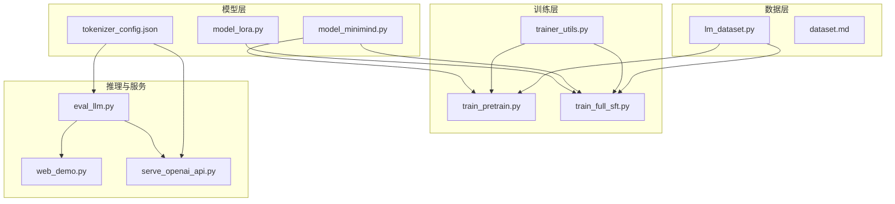
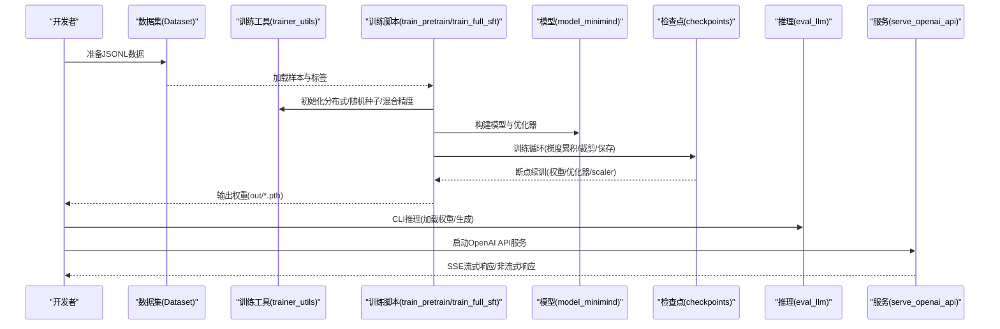
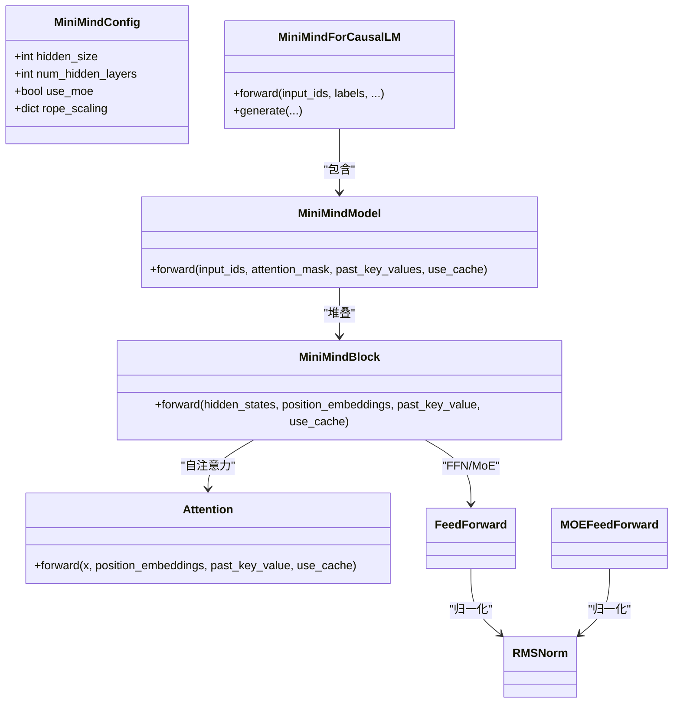
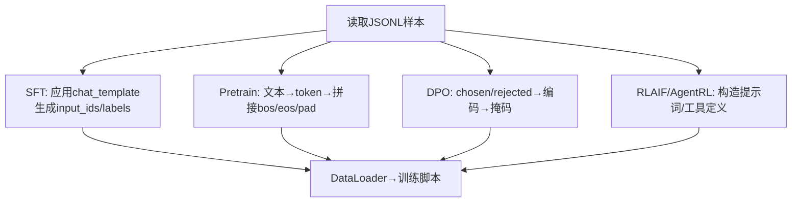
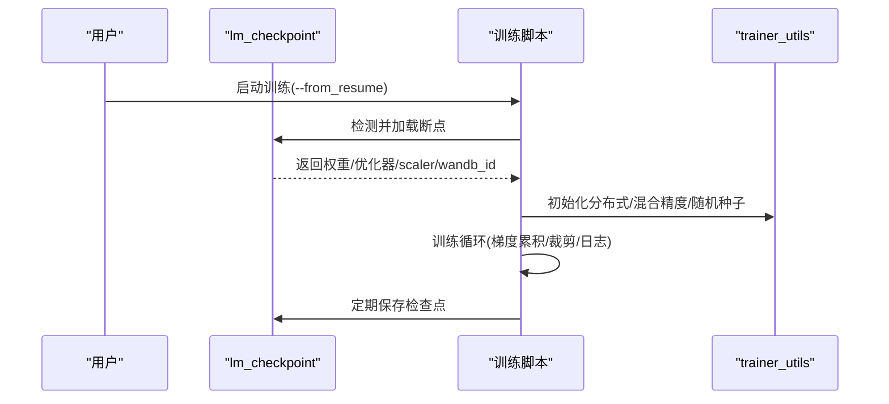
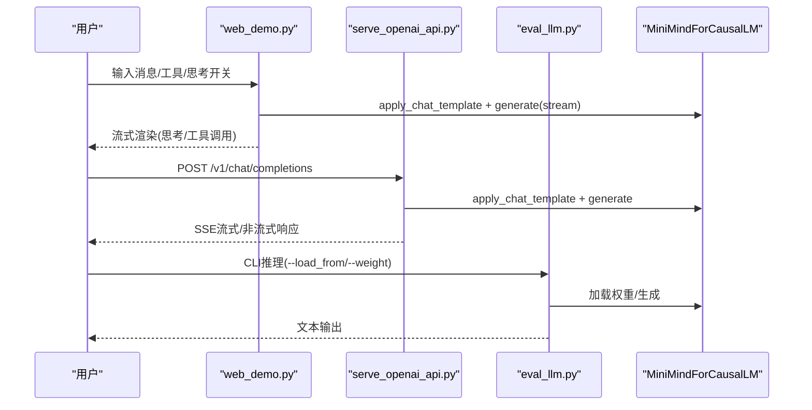

# 开发者指南

<cite>
**本文引用的文件**
- [README.md](file://README.md)
- [README_en.md](file://README_en.md)
- [requirements.txt](file://requirements.txt)
- [CODE_OF_CONDUCT.md](file://CODE_OF_CONDUCT.md)
- [model/model_minimind.py](file://model/model_minimind.py)
- [model/model_lora.py](file://model/model_lora.py)
- [model/tokenizer_config.json](file://model/tokenizer_config.json)
- [dataset/lm_dataset.py](file://dataset/lm_dataset.py)
- [dataset/dataset.md](file://dataset/dataset.md)
- [trainer/trainer_utils.py](file://trainer/trainer_utils.py)
- [trainer/train_pretrain.py](file://trainer/train_pretrain.py)
- [trainer/train_full_sft.py](file://trainer/train_full_sft.py)
- [eval_llm.py](file://eval_llm.py)
- [scripts/web_demo.py](file://scripts/web_demo.py)
- [scripts/serve_openai_api.py](file://scripts/serve_openai_api.py)
</cite>

## 目录
1. [引言](#引言)
2. [项目结构](#项目结构)
3. [核心组件](#核心组件)
4. [架构总览](#架构总览)
5. [详细组件分析](#详细组件分析)
6. [依赖分析](#依赖分析)
7. [性能考量](#性能考量)
8. [故障排查指南](#故障排查指南)
9. [结论](#结论)
10. [附录](#附录)

## 引言
本指南面向希望参与 MiniMind 项目的开发者，提供从环境搭建、代码贡献、测试与调试到扩展开发的完整指引。项目以 PyTorch 原生实现为核心，覆盖预训练、监督微调、知识蒸馏、LoRA、RLHF（DPO）、RLAIF（PPO/GRPO/CISPO）、工具调用、代理强化学习、自适应思考与模型蒸馏等全流程训练链路。文档将帮助新贡献者快速理解模块组织、数据流与控制流，并提供扩展开发与最佳实践建议。

## 项目结构
项目采用按功能域划分的模块化组织方式：
- model：模型定义与 LoRA 扩展、分词器配置
- dataset：数据集加载与预处理
- trainer：训练脚本与工具函数
- scripts：推理与服务端脚本（OpenAI API 兼容）
- 根目录：README、贡献者公约、依赖清单

图表来源
- [model/model_minimind.py:1-280](file://model/model_minimind.py#L1-L280)
- [model/model_lora.py:1-66](file://model/model_lora.py#L1-L66)
- [model/tokenizer_config.json:1-335](file://model/tokenizer_config.json#L1-L335)
- [dataset/lm_dataset.py:1-256](file://dataset/lm_dataset.py#L1-L256)
- [dataset/dataset.md:1-5](file://dataset/dataset.md#L1-L5)
- [trainer/trainer_utils.py:1-177](file://trainer/trainer_utils.py#L1-L177)
- [trainer/train_pretrain.py:1-170](file://trainer/train_pretrain.py#L1-L170)
- [trainer/train_full_sft.py:1-171](file://trainer/train_full_sft.py#L1-L171)
- [eval_llm.py:1-94](file://eval_llm.py#L1-L94)
- [scripts/web_demo.py:1-421](file://scripts/web_demo.py#L1-L421)
- [scripts/serve_openai_api.py:1-246](file://scripts/serve_openai_api.py#L1-L246)

章节来源
- [README.md:215-367](file://README.md#L215-L367)
- [README_en.md:215-366](file://README_en.md#L215-L366)

## 核心组件
- 模型定义与生成：MiniMindConfig、MiniMindForCausalLM、Attention、FeedForward/MOEFeedForward、RMSNorm、RoPE/YaRN 位置编码与推理生成逻辑
- 数据集与模板：PretrainDataset/SFTDataset/DPODataset/RLAIFDataset/AgentRLDataset，支持 chat_template、工具调用与思考标签
- 训练工具：分布式初始化、学习率调度、断点续训、混合精度、梯度累积、采样器跳过等
- 推理与服务：CLI 推理、Streamlit WebUI、OpenAI API 兼容服务端

章节来源
- [model/model_minimind.py:10-280](file://model/model_minimind.py#L10-L280)
- [dataset/lm_dataset.py:37-256](file://dataset/lm_dataset.py#L37-L256)
- [trainer/trainer_utils.py:18-177](file://trainer/trainer_utils.py#L18-L177)
- [eval_llm.py:12-94](file://eval_llm.py#L12-L94)
- [scripts/web_demo.py:198-421](file://scripts/web_demo.py#L198-L421)
- [scripts/serve_openai_api.py:28-246](file://scripts/serve_openai_api.py#L28-L246)

## 架构总览
MiniMind 的训练与推理遵循“数据 → 模型 → 训练/推理 → 服务”的清晰流水线。训练脚本通过统一的工具函数完成分布式、混合精度、断点续训与日志记录；推理脚本与服务端脚本共享分词器模板与生成参数，支持工具调用与自适应思考。

图表来源
- [trainer/train_pretrain.py:23-170](file://trainer/train_pretrain.py#L23-L170)
- [trainer/train_full_sft.py:23-171](file://trainer/train_full_sft.py#L23-L171)
- [trainer/trainer_utils.py:44-177](file://trainer/trainer_utils.py#L44-L177)
- [model/model_minimind.py:195-280](file://model/model_minimind.py#L195-L280)
- [eval_llm.py:12-94](file://eval_llm.py#L12-L94)
- [scripts/serve_openai_api.py:28-246](file://scripts/serve_openai_api.py#L28-L246)

## 详细组件分析

### 模型与生成组件
- MiniMindConfig：集中管理模型超参（维度、层数、注意力头、MoE、RoPE/YaRN 等）
- MiniMindForCausalLM：前向返回交叉熵与辅助损失（MoE router loss），生成接口支持温度、top-k/top-p、重复惩罚、流式输出
- Attention/RMSNorm/FFN/MoE：注意力、归一化、前馈与 MoE 前馈，支持 KV 缓存与 Flash Attention
- RoPE/YaRN：位置编码与长序列外推

图表来源
- [model/model_minimind.py:10-280](file://model/model_minimind.py#L10-L280)

章节来源
- [model/model_minimind.py:10-280](file://model/model_minimind.py#L10-L280)

### 数据与模板组件
- PretrainDataset：将文本转为“文本→下一项预测”的格式，自动填充 bos/eos/pad
- SFTDataset：解析多轮对话，应用 chat_template，生成标签掩码（仅对 assistant 内容反向传播）
- DPODataset：偏好学习格式（chosen/rejected），生成损失掩码
- RLAIFDataset/AgentRLDataset：为强化学习准备提示词与工具定义
- tokenizer_config.json：包含特殊标记、chat_template、buffer token 等，支持 thinking 与 tool_call

图表来源
- [dataset/lm_dataset.py:37-256](file://dataset/lm_dataset.py#L37-L256)
- [model/tokenizer_config.json:295-335](file://model/tokenizer_config.json#L295-L335)

章节来源
- [dataset/lm_dataset.py:37-256](file://dataset/lm_dataset.py#L37-L256)
- [model/tokenizer_config.json:1-335](file://model/tokenizer_config.json#L1-L335)
- [dataset/dataset.md:1-5](file://dataset/dataset.md#L1-L5)

### 训练组件与工具
- 分布式与随机种子：DDP 初始化、本地 rank 设置、全局随机种子
- 学习率：余弦退火调度
- 混合精度：bfloat16/float16，GradScaler
- 断点续训：保存/加载模型、优化器、scaler、wandb run、跨 GPU 数量步数转换
- 采样器跳过：支持从断点处跳过若干批次
- 训练脚本：train_pretrain.py、train_full_sft.py 共用上述工具

图表来源
- [trainer/trainer_utils.py:63-117](file://trainer/trainer_utils.py#L63-L117)
- [trainer/train_pretrain.py:116-170](file://trainer/train_pretrain.py#L116-L170)
- [trainer/train_full_sft.py:117-171](file://trainer/train_full_sft.py#L117-L171)

章节来源
- [trainer/trainer_utils.py:18-177](file://trainer/trainer_utils.py#L18-L177)
- [trainer/train_pretrain.py:82-170](file://trainer/train_pretrain.py#L82-L170)
- [trainer/train_full_sft.py:83-171](file://trainer/train_full_sft.py#L83-L171)

### 推理与服务组件
- CLI 推理：eval_llm.py 支持 Transformers/原生权重加载、LoRA 合并、生成参数控制、历史对话截断
- WebUI：web_demo.py 基于 Streamlit，支持工具选择、思考折叠、流式输出
- OpenAI API：serve_openai_api.py 提供 /v1/chat/completions，支持 reasoning_content/tool_calls/open_thinking

图表来源
- [scripts/web_demo.py:312-421](file://scripts/web_demo.py#L312-L421)
- [scripts/serve_openai_api.py:171-246](file://scripts/serve_openai_api.py#L171-L246)
- [eval_llm.py:32-94](file://eval_llm.py#L32-L94)
- [model/model_minimind.py:229-280](file://model/model_minimind.py#L229-L280)

章节来源
- [scripts/web_demo.py:198-421](file://scripts/web_demo.py#L198-L421)
- [scripts/serve_openai_api.py:28-246](file://scripts/serve_openai_api.py#L28-L246)
- [eval_llm.py:12-94](file://eval_llm.py#L12-L94)

## 依赖分析
- 运行时依赖：PyTorch、transformers、datasets、accelerate、uvicorn/fastapi、streamlit、swanlab/wandb、tiktoken、jieba、nltk、einops 等
- 训练脚本依赖：torch.distributed、DistributedDataParallel、GradScaler、SkipBatchSampler
- 推理与服务：AutoTokenizer/AutoModelForCausalLM、TextStreamer、TextIteratorStreamer

章节来源
- [requirements.txt:1-32](file://requirements.txt#L1-L32)
- [trainer/trainer_utils.py:14-17](file://trainer/trainer_utils.py#L14-L17)
- [scripts/serve_openai_api.py:16-23](file://scripts/serve_openai_api.py#L16-L23)

## 性能考量
- 混合精度：bfloat16/float16 显著降低显存占用并提升吞吐
- Flash Attention：在满足条件时使用 scaled_dot_product_attention
- 梯度累积：在显存受限时提升有效 batch size
- 分布式：DDP 多卡训练，支持跨 GPU 数量恢复
- YaRN：长上下文外推，结合推理时的 RoPE 缩放
- 采样器跳过：断点续训时跳过已完成批次，减少重复计算

章节来源
- [trainer/train_pretrain.py:118-155](file://trainer/train_pretrain.py#L118-L155)
- [trainer/train_full_sft.py:119-155](file://trainer/train_full_sft.py#L119-L155)
- [model/model_minimind.py:108-133](file://model/model_minimind.py#L108-L133)

## 故障排查指南
- CUDA 不可用：确认 torch.cuda.is_available()，必要时切换 CPU/MPS
- 分布式初始化失败：检查 LOCAL_RANK/RANK 环境变量与 NCCL 后端
- 检查点不匹配：跨 GPU 数量恢复会自动转换 step；确认 world_size 与 resume 文件
- LoRA 合并不生效：确认 apply_lora/load_lora 调用顺序与权重路径
- WebUI/服务端模型未发现：确保模型目录包含权重文件或模型文件索引
- 生成异常或卡死：检查 attention_mask/past_key_values/use_cache 传参，适当降低 max_new_tokens

章节来源
- [README.md:278-291](file://README.md#L278-L291)
- [trainer/trainer_utils.py:44-117](file://trainer/trainer_utils.py#L44-L117)
- [model/model_lora.py:21-66](file://model/model_lora.py#L21-L66)
- [scripts/web_demo.py:239-249](file://scripts/web_demo.py#L239-L249)
- [scripts/serve_openai_api.py:230-246](file://scripts/serve_openai_api.py#L230-L246)

## 结论
MiniMind 以“从零实现、可复现、可扩展”为目标，提供从预训练到强化学习的完整链路与原生 PyTorch 实现。通过模块化的数据、模型、训练与服务组件，开发者可以快速定位问题、扩展算法并集成到现有生态。建议在贡献前熟悉训练脚本与工具函数，遵循断点续训与分布式训练的最佳实践，并在 PR 前完成本地测试与性能验证。

## 附录

### 开发环境搭建
- 克隆仓库与安装依赖
- 确认 CUDA 可用性
- 下载数据集至 ./dataset/
- 运行训练脚本（支持 torchrun 多卡）

章节来源
- [README.md:230-367](file://README.md#L230-L367)
- [README_en.md:230-366](file://README_en.md#L230-L366)

### 代码贡献规范
- 遵循项目贡献者公约，保持尊重与包容
- 提交前确保通过本地测试（训练/推理/服务）
- 为新增训练算法/数据处理/模型扩展补充必要的参数与文档
- 使用断点续训与分布式训练验证稳定性

章节来源
- [CODE_OF_CONDUCT.md:1-129](file://CODE_OF_CONDUCT.md#L1-L129)

### 测试策略与调试技巧
- 使用 eval_llm.py 验证推理效果与生成参数
- 使用 web_demo.py 进行交互式调试与工具调用演示
- 使用 serve_openai_api.py 模拟第三方集成
- 通过 SkipBatchSampler 与断点续训定位数据/显存问题
- 使用 SwanLab/W&B 记录训练曲线，定位过拟合/欠拟合

章节来源
- [eval_llm.py:32-94](file://eval_llm.py#L32-L94)
- [scripts/web_demo.py:312-421](file://scripts/web_demo.py#L312-L421)
- [scripts/serve_openai_api.py:171-246](file://scripts/serve_openai_api.py#L171-L246)
- [trainer/trainer_utils.py:134-158](file://trainer/trainer_utils.py#L134-L158)

### 扩展开发指南
- 新增训练算法：在 trainer 目录新增脚本，复用 trainer_utils 的分布式/混合精度/断点逻辑
- 模型扩展：在 model_minimind.py 中扩展层或激活函数，确保与 tokenizer_config.json 的模板兼容
- 数据处理：在 dataset/lm_dataset.py 中新增 Dataset 类，遵循现有标签/掩码生成逻辑
- 服务端扩展：在 scripts/serve_openai_api.py 中扩展请求解析与响应格式，保持与 chat_template 的一致性

章节来源
- [trainer/train_pretrain.py:82-170](file://trainer/train_pretrain.py#L82-L170)
- [trainer/train_full_sft.py:83-171](file://trainer/train_full_sft.py#L83-L171)
- [model/model_minimind.py:10-280](file://model/model_minimind.py#L10-L280)
- [dataset/lm_dataset.py:37-256](file://dataset/lm_dataset.py#L37-L256)
- [scripts/serve_openai_api.py:50-246](file://scripts/serve_openai_api.py#L50-L246)