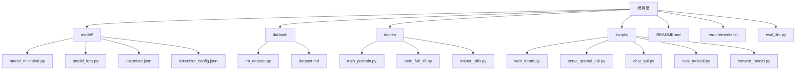
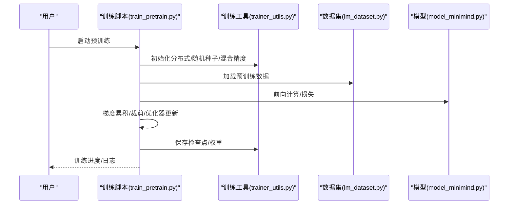
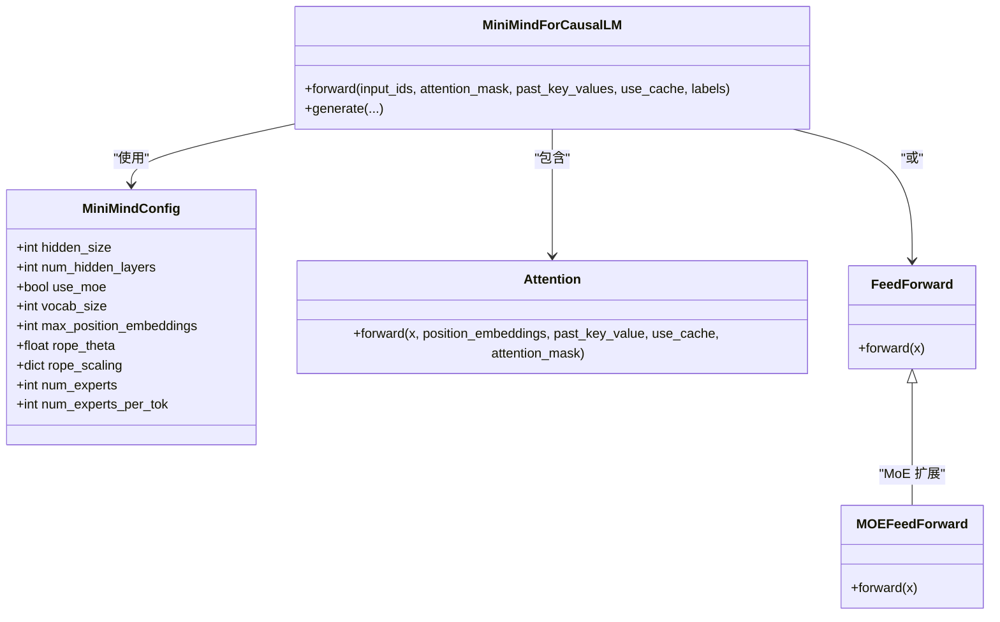
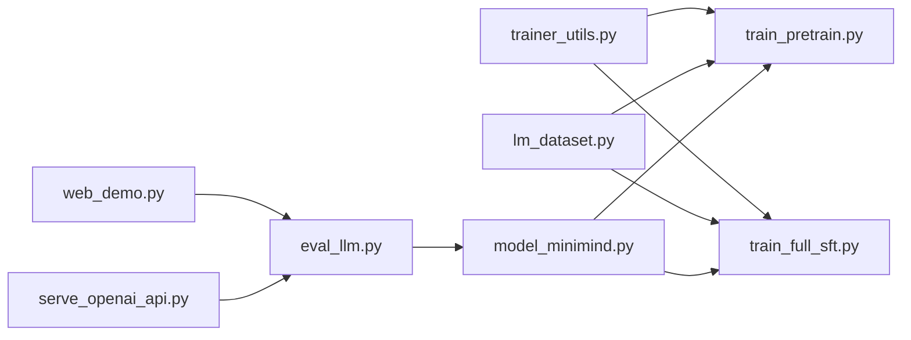

# 快速开始

<cite>
**本文引用的文件**
- [README.md](file://README.md)
- [requirements.txt](file://requirements.txt)
- [dataset.md](file://dataset/dataset.md)
- [model_minimind.py](file://model/model_minimind.py)
- [lm_dataset.py](file://dataset/lm_dataset.py)
- [trainer_utils.py](file://trainer/trainer_utils.py)
- [train_pretrain.py](file://trainer/train_pretrain.py)
- [train_full_sft.py](file://trainer/train_full_sft.py)
- [eval_llm.py](file://eval_llm.py)
- [web_demo.py](file://scripts/web_demo.py)
- [serve_openai_api.py](file://scripts/serve_openai_api.py)
</cite>

## 目录
1. [简介](#简介)
2. [项目结构](#项目结构)
3. [核心组件](#核心组件)
4. [架构总览](#架构总览)
5. [详细组件分析](#详细组件分析)
6. [依赖关系分析](#依赖关系分析)
7. [性能与资源](#性能与资源)
8. [故障排查指南](#故障排查指南)
9. [结论](#结论)
10. [附录](#附录)

## 简介
本指南面向希望在 2 小时内从零完成 MiniMind 训练体验的新手。内容涵盖：
- 环境与前置条件（Python、PyTorch、CUDA）
- 依赖安装与版本说明
- 数据准备与下载
- 完整训练流程（预训练、监督微调、可选测试）
- 推理与服务（CLI、WebUI、OpenAI 兼容 API）
- 常见问题与排障

## 项目结构
项目采用按功能域划分的目录结构，核心模块包括：
- model：模型定义与 LoRA 实现
- dataset：数据集加载与预处理
- trainer：训练脚本与工具
- scripts：推理与服务脚本
- 根目录：README、依赖清单、评估脚本

图表来源
- [README.md](file://README.md)
- [requirements.txt](file://requirements.txt)
- [model_minimind.py](file://model/model_minimind.py)
- [lm_dataset.py](file://dataset/lm_dataset.py)
- [trainer_utils.py](file://trainer/trainer_utils.py)
- [train_pretrain.py](file://trainer/train_pretrain.py)
- [train_full_sft.py](file://trainer/train_full_sft.py)
- [eval_llm.py](file://eval_llm.py)
- [web_demo.py](file://scripts/web_demo.py)
- [serve_openai_api.py](file://scripts/serve_openai_api.py)

章节来源
- [README.md](file://README.md)
- [requirements.txt](file://requirements.txt)

## 核心组件
- 模型定义：MiniMindConfig、MiniMindForCausalLM、Attention、FeedForward、MOEFeedForward 等
- 数据集：PretrainDataset、SFTDataset、DPODataset、RLAIFDataset、AgentRLDataset
- 训练工具：分布式初始化、断点续训、LR 调度、混合精度、模型保存
- 训练脚本：train_pretrain.py、train_full_sft.py
- 推理与服务：eval_llm.py、web_demo.py、serve_openai_api.py

章节来源
- [model_minimind.py](file://model/model_minimind.py)
- [lm_dataset.py](file://dataset/lm_dataset.py)
- [trainer_utils.py](file://trainer/trainer_utils.py)
- [train_pretrain.py](file://trainer/train_pretrain.py)
- [train_full_sft.py](file://trainer/train_full_sft.py)
- [eval_llm.py](file://eval_llm.py)
- [web_demo.py](file://scripts/web_demo.py)
- [serve_openai_api.py](file://scripts/serve_openai_api.py)

## 架构总览
MiniMind 的训练与推理链路如下：
- 训练阶段：数据加载 → 模型前向/反向 → 梯度累积/裁剪 → 优化器更新 → 断点保存
- 推理阶段：加载权重 → 应用 chat_template → 生成/流式输出 → 可选工具调用
- 服务阶段：FastAPI 暴露 OpenAI 兼容接口，支持流式 SSE

图表来源
- [train_pretrain.py](file://trainer/train_pretrain.py)
- [trainer_utils.py](file://trainer/trainer_utils.py)
- [lm_dataset.py](file://dataset/lm_dataset.py)
- [model_minimind.py](file://model/model_minimind.py)

## 详细组件分析

### 环境与前置条件
- Python 版本：建议 3.10+
- PyTorch：建议使用与 CUDA 版本匹配的 torch 与 torchvision
- CUDA：若使用 GPU 训练，确保 CUDA 可用
- 显存：单卡 3090 可满足 2 小时快速复现；多卡可显著缩短时间
- 可视化：默认使用 SwanLab（兼容 WandB）

章节来源
- [README.md](file://README.md)

### 依赖安装与版本说明
- 使用 requirements.txt 安装依赖
- 注意：PyTorch 与 torchvision 的版本需与 CUDA 版本匹配
- 若网络受限，可使用镜像源安装

章节来源
- [requirements.txt](file://requirements.txt)

### 数据准备与下载
- 数据集放置于 ./dataset/
- 快速复现推荐使用 pretrain_t2t_mini.jsonl 与 sft_t2t_mini.jsonl
- 数据格式与字段说明见 README 的数据章节

章节来源
- [dataset.md](file://dataset/dataset.md)
- [README.md](file://README.md)

### 训练流程（从零到一）
- 预训练（必须）
  - 进入 trainer 目录，执行 train_pretrain.py
  - 常用参数：hidden_size、num_hidden_layers、max_seq_len、batch_size、epochs、use_moe、from_resume
  - 输出：out/pretrain_*.pth
- 监督微调（必须）
  - 进入 trainer 目录，执行 train_full_sft.py
  - 常用参数：data_path、max_seq_len、batch_size、epochs、learning_rate、from_weight
  - 输出：out/full_sft_*.pth
- 可选：断点续训
  - 任意训练脚本添加 --from_resume 1 即可自动检测并恢复

章节来源
- [train_pretrain.py](file://trainer/train_pretrain.py)
- [train_full_sft.py](file://trainer/train_full_sft.py)
- [README.md](file://README.md)

### 推理与服务
- CLI 推理
  - eval_llm.py 支持加载 Transformers 格式或原生权重
  - 常用参数：load_from、weight、hidden_size、num_hidden_layers、use_moe、open_thinking、historys
- WebUI
  - streamlit 运行 web_demo.py，自动扫描 ./scripts/ 下的模型目录
- OpenAI 兼容 API
  - serve_openai_api.py 暴露 /v1/chat/completions，支持流式返回与工具调用解析

章节来源
- [eval_llm.py](file://eval_llm.py)
- [web_demo.py](file://scripts/web_demo.py)
- [serve_openai_api.py](file://scripts/serve_openai_api.py)

### 关键训练脚本与参数说明
- train_pretrain.py
  - 关键参数：save_dir、save_weight、epochs、batch_size、learning_rate、device、dtype、num_workers、accumulation_steps、grad_clip、log_interval、save_interval、hidden_size、num_hidden_layers、max_seq_len、use_moe、data_path、from_weight、from_resume、use_wandb、wandb_project、use_compile
- train_full_sft.py
  - 关键参数：save_dir、save_weight、epochs、batch_size、learning_rate、device、dtype、num_workers、accumulation_steps、grad_clip、log_interval、save_interval、hidden_size、num_hidden_layers、max_seq_len、use_moe、data_path、from_weight、from_resume、use_wandb、wandb_project、use_compile

章节来源
- [train_pretrain.py](file://trainer/train_pretrain.py)
- [train_full_sft.py](file://trainer/train_full_sft.py)

### 模型与数据结构
- 模型结构
  - MiniMindConfig：隐藏维度、层数、注意力头数、RoPE 参数、MoE 配置等
  - MiniMindForCausalLM：解码器结构、RMSNorm、SwiGLU、注意力与 FFN
- 数据集
  - PretrainDataset：将文本转为 input_ids/labels
  - SFTDataset：应用 chat_template，生成 labels（仅对 assistant 区域计算 loss）

图表来源
- [model_minimind.py](file://model/model_minimind.py)

章节来源
- [model_minimind.py](file://model/model_minimind.py)
- [lm_dataset.py](file://dataset/lm_dataset.py)

## 依赖关系分析
- 训练脚本依赖模型与数据集模块，通过 trainer_utils 提供的工具函数完成分布式、断点、混合精度等
- 推理脚本与服务脚本依赖模型权重与分词器，支持 Transformers 格式与原生权重

图表来源
- [trainer_utils.py](file://trainer/trainer_utils.py)
- [train_pretrain.py](file://trainer/train_pretrain.py)
- [train_full_sft.py](file://trainer/train_full_sft.py)
- [lm_dataset.py](file://dataset/lm_dataset.py)
- [model_minimind.py](file://model/model_minimind.py)
- [eval_llm.py](file://eval_llm.py)
- [web_demo.py](file://scripts/web_demo.py)
- [serve_openai_api.py](file://scripts/serve_openai_api.py)

章节来源
- [trainer_utils.py](file://trainer/trainer_utils.py)
- [train_pretrain.py](file://trainer/train_pretrain.py)
- [train_full_sft.py](file://trainer/train_full_sft.py)
- [lm_dataset.py](file://dataset/lm_dataset.py)
- [model_minimind.py](file://model/model_minimind.py)
- [eval_llm.py](file://eval_llm.py)
- [web_demo.py](file://scripts/web_demo.py)
- [serve_openai_api.py](file://scripts/serve_openai_api.py)

## 性能与资源
- 单卡 3090：预训练 + SFT 约 2 小时
- 多卡可显著缩短时间；可使用 torchrun 多卡训练
- 混合精度（bfloat16/float16）与 torch.compile 可提升吞吐
- SwanLab 替代 WandB，国内网络更友好

章节来源
- [README.md](file://README.md)
- [train_pretrain.py](file://trainer/train_pretrain.py)
- [train_full_sft.py](file://trainer/train_full_sft.py)

## 故障排查指南
- CUDA 不可用
  - 检查 torch.cuda.is_available()，必要时更换 PyTorch 版本或驱动
- 显存不足
  - 降低 batch_size、max_seq_len，或使用更小的 hidden_size
- 断点续训异常
  - 确认 checkpoints 目录存在对应 .pth 文件；跨 GPU 数量恢复会自动调整 step
- 数据路径错误
  - 确保数据文件位于 ./dataset/ 且文件名与脚本参数一致
- 推理报错
  - 检查权重路径与 --weight 前缀；WebUI 需将模型复制到 ./scripts/ 目录下
- 服务端口冲突
  - 修改 serve_openai_api.py 的端口参数

章节来源
- [README.md](file://README.md)
- [trainer_utils.py](file://trainer/trainer_utils.py)
- [lm_dataset.py](file://dataset/lm_dataset.py)
- [eval_llm.py](file://eval_llm.py)
- [web_demo.py](file://scripts/web_demo.py)
- [serve_openai_api.py](file://scripts/serve_openai_api.py)

## 结论
通过本指南，您可以在 2 小时内完成 MiniMind 的环境搭建、数据准备、预训练与监督微调，并进行推理与服务部署。建议新手优先使用 mini 数据集快速验证链路，再逐步扩展到完整数据集与更复杂的训练策略。

## 附录
- 常用命令速查
  - 克隆与安装：git clone --depth 1 仓库地址 && pip install -r requirements.txt
  - 预训练：cd trainer && python train_pretrain.py
  - SFT：cd trainer && python train_full_sft.py
  - CLI 推理：python eval_llm.py --weight full_sft
  - WebUI：cd scripts && streamlit run web_demo.py
  - OpenAI API：python scripts/serve_openai_api.py

章节来源
- [README.md](file://README.md)
- [requirements.txt](file://requirements.txt)
- [eval_llm.py](file://eval_llm.py)
- [web_demo.py](file://scripts/web_demo.py)
- [serve_openai_api.py](file://scripts/serve_openai_api.py)