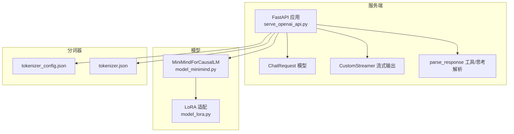
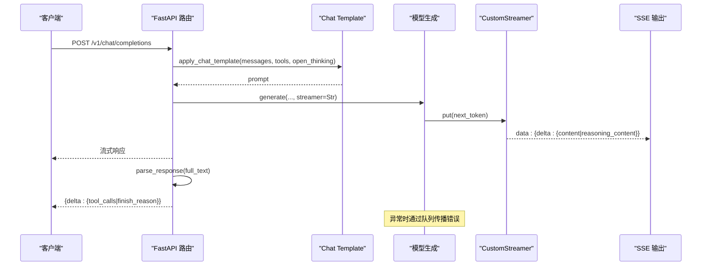
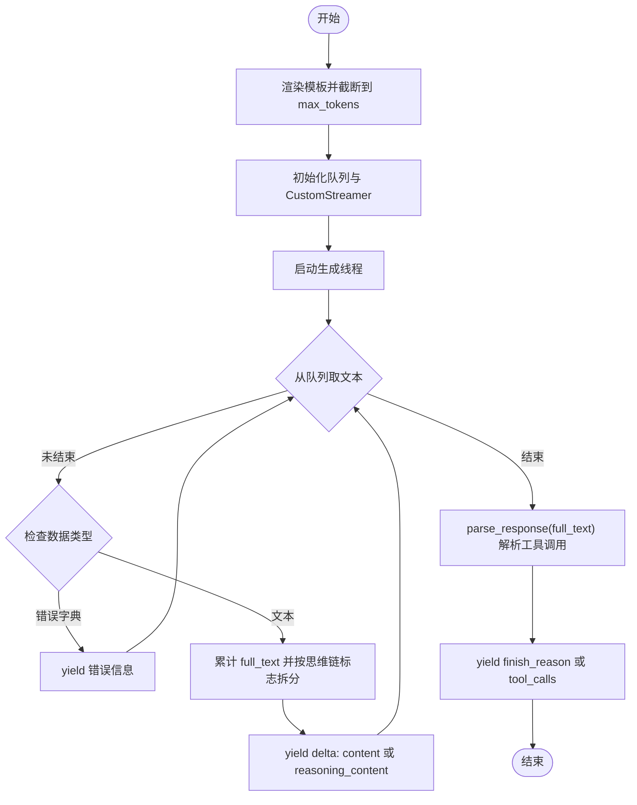
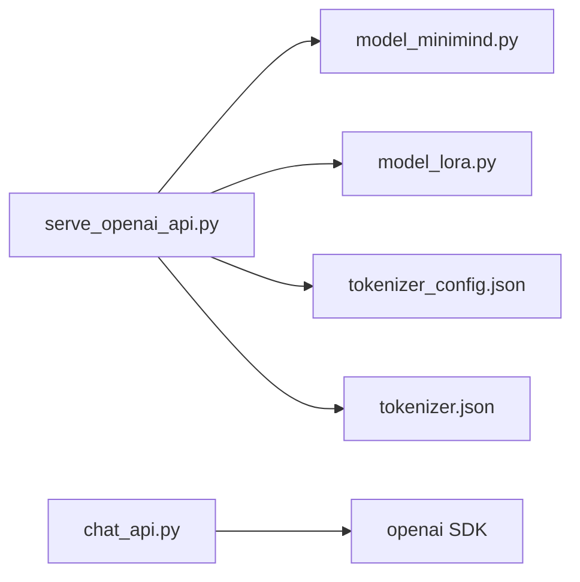

# OpenAI API 服务

<cite>
**本文引用的文件**
- [serve_openai_api.py](file://scripts/serve_openai_api.py)
- [chat_api.py](file://scripts/chat_api.py)
- [model_minimind.py](file://model/model_minimind.py)
- [model_lora.py](file://model/model_lora.py)
- [tokenizer_config.json](file://model/tokenizer_config.json)
- [tokenizer.json](file://model/tokenizer.json)
- [eval_toolcall.py](file://scripts/eval_toolcall.py)
- [web_demo.py](file://scripts/web_demo.py)
- [README.md](file://README.md)
- [requirements.txt](file://requirements.txt)
</cite>

## 更新摘要
**所做更改**
- 增强了API健壮性，改进了对空响应和过滤响应的错误处理
- 改进了流式响应处理，增加了对缺失chunk choices和None delta对象的检查
- 在生成线程中增加了异常处理，通过队列机制正确传播错误
- 更新了客户端示例以更好地处理边界情况

## 目录
1. [简介](#简介)
2. [项目结构](#项目结构)
3. [核心组件](#核心组件)
4. [架构总览](#架构总览)
5. [详细组件分析](#详细组件分析)
6. [依赖关系分析](#依赖关系分析)
7. [性能考量](#性能考量)
8. [故障排除指南](#故障排除指南)
9. [结论](#结论)
10. [附录](#附录)

## 简介
本项目提供了一个与 OpenAI API 兼容的 FastAPI 服务，实现了 /v1/chat/completions 端点，支持：
- 流式传输（SSE）
- 思维链（Thinking）与工具调用（Tool Call）的特殊处理
- 自适应思考开关
- JSON 工具调用格式解析
- 基于 Transformers 的本地推理与可选 LoRA 微调

该服务可用于对接 FastGPT、Open-WebUI 等第三方前端，或通过 Python 客户端直接调用。

**更新** 增强了API健壮性，改进了错误处理和流式响应处理机制。

## 项目结构
- scripts：服务端与客户端示例
  - serve_openai_api.py：FastAPI 服务端实现
  - chat_api.py：OpenAI SDK 客户端示例
  - eval_toolcall.py：工具调用解析与演示
  - web_demo.py：Streamlit Web UI（含工具与思考展示）
- model：模型与分词器
  - model_minimind.py：MiniMind 模型实现（Attention、FFN、MoE、GenerationMixin）
  - model_lora.py：LoRA 低秩适配实现
  - tokenizer.json / tokenizer_config.json：分词器与模板配置
- 其他：README、requirements.txt 等



图表来源
- [serve_openai_api.py:171-227](file://scripts/serve_openai_api.py#L171-L227)
- [model_minimind.py:229-280](file://model/model_minimind.py#L229-L280)
- [model_lora.py:21-43](file://model/model_lora.py#L21-L43)
- [tokenizer_config.json:333](file://model/tokenizer_config.json#L333)
- [tokenizer.json:1](file://model/tokenizer.json#L1)

章节来源
- [serve_openai_api.py:1-253](file://scripts/serve_openai_api.py#L1-L253)
- [model_minimind.py:1-280](file://model/model_minimind.py#L1-L280)
- [model_lora.py:1-66](file://model/model_lora.py#L1-L66)
- [tokenizer_config.json:1-335](file://model/tokenizer_config.json#L1-L335)
- [tokenizer.json:1-200](file://model/tokenizer.json#L1-L200)

## 核心组件
- FastAPI 应用与路由
  - /v1/chat/completions：POST，返回流式或非流式的聊天补全
- ChatRequest 模型
  - 字段：model、messages、temperature、top_p、max_tokens、stream、tools、open_thinking、chat_template_kwargs
  - 辅助方法：get_open_thinking，兼容多种开启思考的方式
- CustomStreamer
  - 基于 transformers.TextStreamer，将生成片段放入队列，供流式响应使用
- parse_response
  - 解析思维链与工具调用：提取 reasoning_content、JSON 工具调用块
- generate_stream_response
  - 构造提示词、调用模型生成、分片产出 delta 内容、结束时发送 finish_reason/tool_calls

**更新** 增强了错误处理机制，包括生成线程中的异常捕获和队列错误传播。

章节来源
- [serve_openai_api.py:50-68](file://scripts/serve_openai_api.py#L50-L68)
- [serve_openai_api.py:71-81](file://scripts/serve_openai_api.py#L71-L81)
- [serve_openai_api.py:83-102](file://scripts/serve_openai_api.py#L83-L102)
- [serve_openai_api.py:105-176](file://scripts/serve_openai_api.py#L105-L176)
- [serve_openai_api.py:178-235](file://scripts/serve_openai_api.py#L178-L235)

## 架构总览
OpenAI 兼容服务的整体流程如下：
- 客户端发送 /v1/chat/completions 请求（支持流式）
- 服务端将 messages 渲染为 chat template，截断到 max_tokens
- 非流式：一次性生成并解析思维链/工具调用
- 流式：通过 TextStreamer 与队列，边生成边输出 delta，直至结束

**更新** 增强了错误处理机制，确保异常情况能够正确传播到客户端。



图表来源
- [serve_openai_api.py:178-235](file://scripts/serve_openai_api.py#L178-L235)
- [serve_openai_api.py:105-176](file://scripts/serve_openai_api.py#L105-L176)
- [serve_openai_api.py:71-81](file://scripts/serve_openai_api.py#L71-L81)

## 详细组件分析

### /v1/chat/completions 端点
- HTTP 方法：POST
- 请求体：ChatRequest
- 响应：
  - 非流式：一次返回完整消息与 finish_reason
  - 流式：SSE，逐块返回 delta，最后发送 finish_reason/tool_calls

**更新** 增强了异常处理，确保HTTP级别的错误能够正确返回给客户端。

章节来源
- [serve_openai_api.py:178-235](file://scripts/serve_openai_api.py#L178-L235)

### ChatRequest 模型与参数
- 字段与默认值
  - model: 字符串
  - messages: 列表
  - temperature: 0.7
  - top_p: 0.92
  - max_tokens: 8192
  - stream: True
  - tools: []
  - open_thinking: False
  - chat_template_kwargs: dict
- get_open_thinking
  - 支持通过 open_thinking 或 chat_template_kwargs.enable_thinking/open_thinking 开启思考

章节来源
- [serve_openai_api.py:50-68](file://scripts/serve_openai_api.py#L50-L68)

### 流式传输机制（SSE + CustomStreamer）
- CustomStreamer
  - 继承 transformers.TextStreamer
  - on_finalized_text 将文本片段放入队列；结束时放入 None
- generate_stream_response
  - 使用 tokenizer.apply_chat_template 生成 prompt
  - 启动线程调用 model.generate，传入 streamer
  - 主线程从队列取文本，按思维链结束标志拆分 content/reasoning_content
  - 逐块输出 delta，结束后解析工具调用并发送 finish_reason

**更新** 增强了流式传输的错误处理：
- 生成线程中的异常被捕获并通过队列传播
- 主线程正确处理错误字典类型的队列项
- 确保异常情况下仍能正常结束流式传输



图表来源
- [serve_openai_api.py:105-176](file://scripts/serve_openai_api.py#L105-L176)
- [serve_openai_api.py:71-81](file://scripts/serve_openai_api.py#L71-L81)
- [serve_openai_api.py:83-102](file://scripts/serve_openai_api.py#L83-L102)

章节来源
- [serve_openai_api.py:71-81](file://scripts/serve_openai_api.py#L71-L81)
- [serve_openai_api.py:105-176](file://scripts/serve_openai_api.py#L105-L176)

### 思维链（Thinking）与工具调用（Tool Call）处理
- 思维链
  - 使用 XML 风格标记：起始与结束标记包裹思考内容
  - 服务端在流式输出中优先发送 reasoning_content，随后发送正文 content
- 工具调用
  - 使用 JSON 块包裹工具调用，格式为 {"name": "...", "arguments": {...}}
  - 服务端解析 JSON 块，组装为 OpenAI 格式的 tool_calls
- 解析逻辑
  - parse_response：提取思考内容与工具调用，清理标记
  - 生成结束时，若存在工具调用，追加 delta 并设置 finish_reason 为 tool_calls

章节来源
- [serve_openai_api.py:83-102](file://scripts/serve_openai_api.py#L83-L102)
- [serve_openai_api.py:169-172](file://scripts/serve_openai_api.py#L169-L172)
- [eval_toolcall.py:70-96](file://scripts/eval_toolcall.py#L70-L96)

### 模型与分词器
- MiniMindForCausalLM
  - 继承 PreTrainedModel 与 GenerationMixin
  - 实现 generate，支持温度、top_p、top_k、重复惩罚等采样参数
- LoRA 适配
  - apply_lora：为线性层注入低秩增量
  - load_lora/save_lora/merge_lora：权重加载与合并
- 分词器
  - tokenizer_config.json 提供 chat_template 与特殊 token
  - tokenizer.json 定义特殊标记，包括思维链与工具调用相关的 XML 风格标记

章节来源
- [model_minimind.py:229-280](file://model/model_minimind.py#L229-L280)
- [model_lora.py:21-66](file://model/model_lora.py#L21-L66)
- [tokenizer_config.json:333](file://model/tokenizer_config.json#L333)
- [tokenizer.json:1](file://model/tokenizer.json#L1)

### 客户端与第三方集成
- Python 客户端示例
  - 使用 openai.OpenAI，base_url 指向本服务
  - 支持 stream=True，逐块读取 delta.content 与 delta.tool_calls
  - **更新** 增强了对空响应和过滤响应的检查
  - **更新** 增加了对缺失 chunk choices 和 None delta 对象的处理
- Web UI
  - Streamlit demo 展示工具与思考内容的格式化显示
  - 支持多轮对话、工具选择与思考折叠

**更新** 客户端示例现在包含更健壮的边界情况处理：
- 检查 response.choices 是否存在且不为空
- 检查 message 是否为 None
- 在处理流式响应时检查 chunk.choices 是否存在
- 检查 delta 对象是否为 None

章节来源
- [chat_api.py:1-47](file://scripts/chat_api.py#L1-L47)
- [web_demo.py:106-195](file://scripts/web_demo.py#L106-L195)

## 依赖关系分析
- 运行时依赖
  - FastAPI、uvicorn、pydantic、transformers、torch
- 服务端依赖
  - serve_openai_api.py 依赖 model_minimind.py、model_lora.py、tokenizer_config.json/tokenizer.json
- 客户端依赖
  - chat_api.py 依赖 openai SDK



图表来源
- [serve_openai_api.py:16-21](file://scripts/serve_openai_api.py#L16-L21)
- [model_minimind.py:1-6](file://model/model_minimind.py#L1-L6)
- [model_lora.py:1-3](file://model/model_lora.py#L1-L3)
- [tokenizer_config.json:1-335](file://model/tokenizer_config.json#L1-L335)
- [tokenizer.json:1-200](file://model/tokenizer.json#L1-L200)
- [chat_api.py:1](file://scripts/chat_api.py#L1)

章节来源
- [requirements.txt:1-32](file://requirements.txt#L1-L32)
- [serve_openai_api.py:16-21](file://scripts/serve_openai_api.py#L16-L21)

## 性能考量
- 采样参数
  - temperature、top_p 控制生成多样性与稳定性
  - top_k 与重复惩罚可减少重复输出
- 推理优化
  - 使用 half() 减少显存占用
  - Flash Attention 可在满足条件时加速注意力计算
- 流式输出
  - 通过 TextStreamer 与队列实现边生成边输出，降低首字延迟
- 模型规模
  - 支持 MoE 与 Dense 两种结构，MoE 在更大容量与更高激活开销间折中

章节来源
- [model_minimind.py:249-280](file://model/model_minimind.py#L249-L280)
- [serve_openai_api.py:244](file://scripts/serve_openai_api.py#L244)

## 故障排除指南
- 500 错误
  - 服务端捕获异常并返回错误信息，检查日志定位具体异常
  - **更新** 现在包括生成线程中的异常处理和HTTP级别的错误处理
- 流式输出为空
  - 确认 CustomStreamer 是否正确 put 文本，队列是否被提前关闭
  - **更新** 检查是否有错误字典类型的队列项被正确处理
- 工具调用未识别
  - 确认 JSON 工具调用块格式正确，且包含 name 与 arguments
- 思维链未显示
  - 确认 chat_template_kwargs.enable_thinking/open_thinking 已开启
- 分词器不兼容
  - 确认使用与服务端一致的 tokenizer_config.json/tokenizer.json
- 客户端连接问题
  - **更新** 客户端现在更好地处理空响应和过滤响应
  - **更新** 增加了对缺失 chunk choices 和 None delta 的检查

**更新** 新增故障排除项：
- 生成线程异常：检查队列中是否有错误字典类型的项
- 流式传输中断：确认异常情况下队列是否正常结束
- 客户端崩溃：检查客户端是否正确处理边界情况

章节来源
- [serve_openai_api.py:174-176](file://scripts/serve_openai_api.py#L174-L176)
- [serve_openai_api.py:233-235](file://scripts/serve_openai_api.py#L233-L235)
- [chat_api.py:23-47](file://scripts/chat_api.py#L23-L47)

## 结论
本项目提供了一个与 OpenAI API 兼容的 FastAPI 服务，支持流式传输、思维链与工具调用，具备良好的可扩展性与易用性。通过 Transformers 与自研模型结合，既满足本地推理需求，又可对接第三方前端与 SDK。

**更新** 最新的增强功能包括：
- 增强的API健壮性和错误处理机制
- 改进的流式响应处理，支持缺失数据和边界情况
- 完善的异常传播机制，确保错误能够正确传递到客户端
- 更健壮的客户端示例，能够更好地处理各种异常情况

## 附录

### API 使用示例

- curl 示例（非流式）
  - POST http://localhost:8998/v1/chat/completions
  - Content-Type: application/json
  - Body:
    ```json
    {
      "model": "minimind",
      "messages": [
        {"role": "user", "content": "你好"}
      ],
      "temperature": 0.7,
      "top_p": 0.92,
      "max_tokens": 2048,
      "stream": false
    }
    ```

- curl 示例（流式）
  - GET http://localhost:8998/v1/chat/completions
  - Accept: text/event-stream
  - Body 同上，但 stream: true

- Python 客户端（OpenAI SDK）
  - 参考 [chat_api.py:1-47](file://scripts/chat_api.py#L1-L47)

- 第三方 SDK 集成
  - 通过 base_url 指向本服务，其余 OpenAI SDK 使用方式一致

**更新** 客户端示例现在包含更好的错误处理和边界情况检查。

章节来源
- [chat_api.py:1-47](file://scripts/chat_api.py#L1-L47)

### 参数说明与取值范围
- temperature：采样温度，越小越确定
- top_p：核采样阈值，0~1
- max_tokens：最大生成长度
- stream：是否流式输出
- tools：工具定义列表
- open_thinking：是否开启思维链
- chat_template_kwargs：模板参数（支持 enable_thinking/open_thinking）

章节来源
- [serve_openai_api.py:50-68](file://scripts/serve_openai_api.py#L50-L68)

### 思维链与工具调用格式
- 思维链
  - 使用 XML 风格标记包裹思考内容
- 工具调用
  - JSON 块格式：{"name": "...", "arguments": {...}}
  - 服务端解析为 OpenAI 格式 tool_calls

章节来源
- [serve_openai_api.py:83-102](file://scripts/serve_openai_api.py#L83-L102)
- [eval_toolcall.py:70-96](file://scripts/eval_toolcall.py#L70-L96)

### 错误处理机制
**新增章节** 详细说明系统的错误处理机制：

- 生成线程异常处理
  - 在 _generate 函数中使用 try-except 捕获所有异常
  - 异常信息通过队列以字典形式 {"error": str(e)} 传播
  - 确保异常不会导致程序崩溃

- 主线程错误处理
  - 检查队列项类型，区分文本和错误字典
  - 正确处理错误字典并传递给客户端
  - 确保异常情况下仍能正常结束流式传输

- HTTP级别错误处理
  - 在路由函数中使用 try-except 捕获所有异常
  - 使用 HTTPException 返回适当的HTTP状态码
  - 提供详细的错误信息给客户端

- 客户端健壮性
  - 检查 response.choices 是否存在且不为空
  - 检查 message 是否为 None
  - 在处理流式响应时检查 chunk.choices 是否存在
  - 检查 delta 对象是否为 None

章节来源
- [serve_openai_api.py:113-129](file://scripts/serve_openai_api.py#L113-L129)
- [serve_openai_api.py:136-143](file://scripts/serve_openai_api.py#L136-L143)
- [serve_openai_api.py:174-176](file://scripts/serve_openai_api.py#L174-L176)
- [serve_openai_api.py:233-235](file://scripts/serve_openai_api.py#L233-L235)
- [chat_api.py:23-47](file://scripts/chat_api.py#L23-L47)