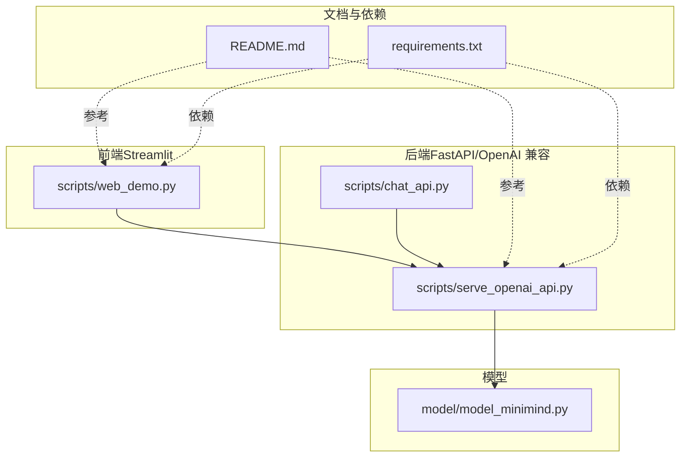
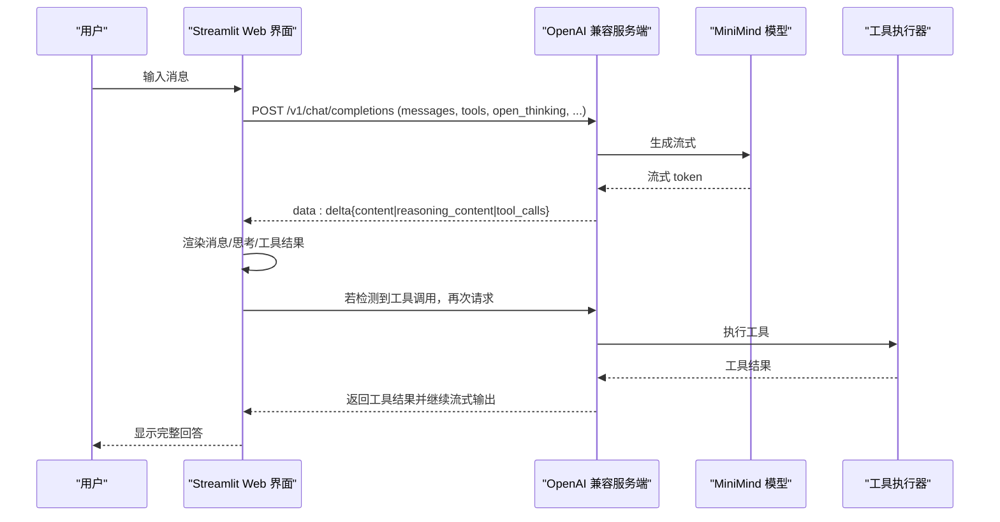
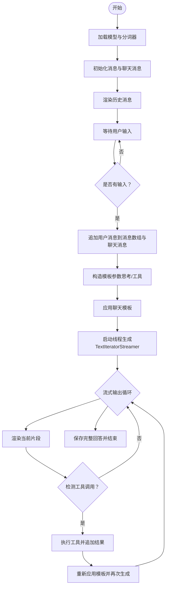
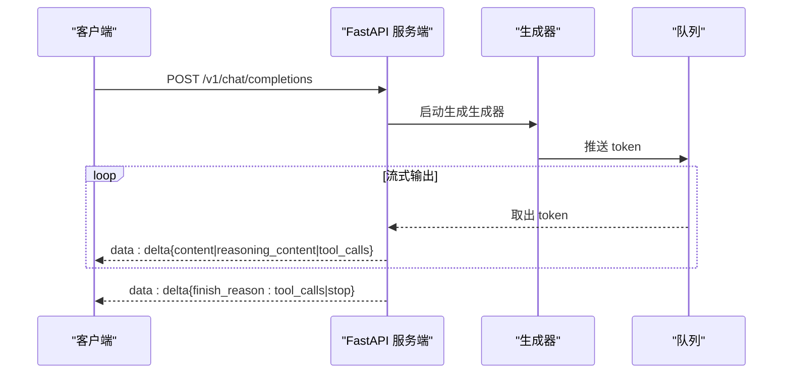
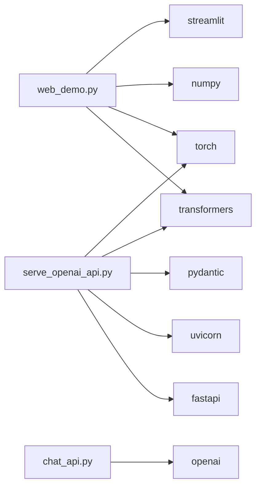

# Web 界面演示

<cite>
**本文引用的文件**
- [scripts/web_demo.py](file://scripts/web_demo.py)
- [scripts/serve_openai_api.py](file://scripts/serve_openai_api.py)
- [scripts/chat_api.py](file://scripts/chat_api.py)
- [model/model_minimind.py](file://model/model_minimind.py)
- [README.md](file://README.md)
- [requirements.txt](file://requirements.txt)
</cite>

## 目录
1. [简介](#简介)
2. [项目结构](#项目结构)
3. [核心组件](#核心组件)
4. [架构总览](#架构总览)
5. [详细组件分析](#详细组件分析)
6. [依赖关系分析](#依赖关系分析)
7. [性能考量](#性能考量)
8. [故障排查指南](#故障排查指南)
9. [结论](#结论)
10. [附录](#附录)

## 简介
本文件面向基于 Streamlit 的 Web 界面演示系统，系统以 MiniMind 大语言模型为核心，提供多轮对话、工具调用、思考链展示与流式输出等能力。文档涵盖界面布局与交互流程、会话管理机制、界面定制选项、与后端 API 的集成方式、浏览器与移动端适配、无障碍支持、部署与性能优化建议等内容，帮助读者从零理解并使用该 Web 演示系统。

## 项目结构
该项目采用“脚本驱动 + 模型定义 + 文档说明”的组织方式：
- scripts：包含 Web 界面演示、OpenAI 兼容服务端、CLI 调用示例等
- model：包含 MiniMind 模型结构与配置定义
- dataset：数据集说明
- README 与 requirements：项目说明与依赖清单

图表来源
- [scripts/web_demo.py:12-420](file://scripts/web_demo.py#L12-L420)
- [scripts/serve_openai_api.py:1-246](file://scripts/serve_openai_api.py#L1-L246)
- [scripts/chat_api.py:1-40](file://scripts/chat_api.py#L1-L40)
- [model/model_minimind.py:1-200](file://model/model_minimind.py#L1-L200)
- [README.md:260-276](file://README.md#L260-L276)
- [requirements.txt:1-32](file://requirements.txt#L1-L32)

章节来源
- [scripts/web_demo.py:12-420](file://scripts/web_demo.py#L12-L420)
- [scripts/serve_openai_api.py:1-246](file://scripts/serve_openai_api.py#L1-L246)
- [README.md:260-276](file://README.md#L260-L276)

## 核心组件
- Streamlit Web 界面：负责页面布局、侧边栏参数与工具选择、消息渲染、输入与发送、清空历史、多轮对话与工具调用循环、思考链展示与流式输出。
- OpenAI 兼容服务端：提供 /v1/chat/completions 接口，支持流式返回、思考内容与工具调用解析、推理开关与模板参数透传。
- 模型定义：MiniMind 模型结构与配置，支撑推理与生成。
- CLI 示例：本地 OpenAI 客户端示例，便于验证服务端与模板能力。

章节来源
- [scripts/web_demo.py:198-420](file://scripts/web_demo.py#L198-L420)
- [scripts/serve_openai_api.py:50-227](file://scripts/serve_openai_api.py#L50-L227)
- [model/model_minimind.py:10-200](file://model/model_minimind.py#L10-L200)
- [scripts/chat_api.py:1-40](file://scripts/chat_api.py#L1-L40)

## 架构总览
Web 界面通过 Streamlit 与后端服务端进行交互，后端服务端基于 FastAPI 提供 OpenAI 兼容接口，内部调用 MiniMind 模型进行推理与流式输出。工具调用与思考链通过模板标记与正则解析实现。

图表来源
- [scripts/web_demo.py:338-416](file://scripts/web_demo.py#L338-L416)
- [scripts/serve_openai_api.py:171-227](file://scripts/serve_openai_api.py#L171-L227)

## 详细组件分析

### Streamlit Web 界面（web_demo.py）
- 页面与布局
  - 设置页面标题与侧边栏初始状态
  - 内联样式美化按钮与主容器间距
  - 顶部展示模型标语与免责声明
- 多语言支持
  - 通过 session_state 控制语言，支持中文/英文
- 模型与工具
  - 动态扫描 scripts 目录下包含权重文件的子目录，作为可选模型
  - 内置工具集合与短名映射，最多选择 4 个工具
- 会话管理
  - 初始化消息数组与聊天消息数组
  - 清空历史：删除 session_state 中的消息与聊天消息
  - 重新生成：弹出最后一条用户消息并重新生成
- 参数与开关
  - 历史对话轮次滑块（0~8，步长2）
  - 最大生成长度滑块（256~8192，步长1）
  - 温度滑块（0.6~1.2，步长0.01）
  - 思考开关：开启后在流式生成时将“思考”内容折叠展示
  - 工具选择：最多4个，勾选后注入到模板参数
- 输入与发送
  - 使用 chat_input 获取用户输入
  - 将用户消息追加到消息数组与聊天消息数组
  - 构造模板参数（是否开启思考、是否注入工具）
  - 调用模型生成，使用 TextIteratorStreamer 实现流式输出
  - 渲染过程中动态处理“思考”与“工具调用”标记
- 工具调用循环
  - 从流式输出中提取工具调用 JSON，执行工具并追加到聊天消息
  - 重新应用模板并再次生成，直至无工具调用
- 渲染与格式化
  - 用户消息右对齐圆角气泡
  - 助手消息通过 HTML 渲染，支持“思考”折叠与“工具调用”卡片
  - 工具调用结果以卡片形式插入，便于区分

图表来源
- [scripts/web_demo.py:312-416](file://scripts/web_demo.py#L312-L416)

章节来源
- [scripts/web_demo.py:12-420](file://scripts/web_demo.py#L12-L420)

### OpenAI 兼容服务端（serve_openai_api.py）
- FastAPI 接口
  - /v1/chat/completions：支持流式与非流式
  - 请求体包含模型、消息、温度、top_p、max_tokens、stream、tools、open_thinking、chat_template_kwargs 等
  - 兼容多种开启“思考”的方式（open_thinking 或 chat_template_kwargs 中的 enable_thinking）
- 流式输出
  - 自定义 TextStreamer 将 token 写入队列
  - SSE 格式输出 delta：reasoning_content/content/tool_calls
  - 思考内容与回答内容分离输出，直至思考结束
- 工具调用解析
  - 从生成文本中解析工具调用 JSON，构造 tool_calls 并从文本中剔除
- 错误处理
  - 异常捕获并返回 JSON 错误

图表来源
- [scripts/serve_openai_api.py:105-165](file://scripts/serve_openai_api.py#L105-L165)

章节来源
- [scripts/serve_openai_api.py:50-227](file://scripts/serve_openai_api.py#L50-L227)

### 模型定义（model_minimind.py）
- 配置类：MiniMindConfig，包含隐藏维度、层数、注意力头数、最大位置、RoPE 参数、MoE 配置等
- 注意力与前馈：RMSNorm、RoPE 旋转位置编码、KV 重复、注意力与 SwiGLU 前馈
- Block 与 Model：MiniMindBlock 与 MiniMindModel，支持缓存与 Flash Attention
- 与服务端配合：服务端通过 apply_chat_template 与 open_thinking/tools 参数控制模板与工具注入

章节来源
- [model/model_minimind.py:10-200](file://model/model_minimind.py#L10-L200)

### CLI 示例（chat_api.py）
- 使用 OpenAI SDK 连接本地服务端（默认 http://localhost:11434/v1）
- 支持流式输出与“思考内容”打印
- 可设置历史对话轮数、温度、最大 token 等参数

章节来源
- [scripts/chat_api.py:1-40](file://scripts/chat_api.py#L1-L40)

## 依赖关系分析
- Streamlit Web 界面依赖：
  - transformers（AutoModelForCausalLM、AutoTokenizer、TextIteratorStreamer）
  - torch、numpy、streamlit
- OpenAI 兼容服务端依赖：
  - fastapi、uvicorn、pydantic、transformers、torch
- CLI 示例依赖：
  - openai
- 项目依赖清单（requirements.txt）中包含上述库

图表来源
- [requirements.txt:1-32](file://requirements.txt#L1-L32)
- [scripts/web_demo.py:9-10](file://scripts/web_demo.py#L9-L10)
- [scripts/serve_openai_api.py:16-21](file://scripts/serve_openai_api.py#L16-L21)
- [scripts/chat_api.py:1-6](file://scripts/chat_api.py#L1-L6)

章节来源
- [requirements.txt:1-32](file://requirements.txt#L1-L32)

## 性能考量
- 流式输出
  - Web 界面与服务端均采用流式生成与 SSE 输出，降低首屏延迟，提升交互体验
- 模板与上下文
  - 通过 chat_template 与历史轮次限制，控制输入长度，避免显存溢出
- 设备与精度
  - 模型加载为半精度（half），推理在 GPU 上执行，条件允许时使用 Flash Attention
- 工具调用循环
  - 检测到工具调用后自动追加工具结果并再次生成，最多循环若干次，避免无限循环
- 生成参数
  - 温度与 top_p 控制多样性与稳定性；最大生成长度限制输出长度

章节来源
- [scripts/web_demo.py:362-376](file://scripts/web_demo.py#L362-L376)
- [scripts/serve_openai_api.py:105-165](file://scripts/serve_openai_api.py#L105-L165)
- [model/model_minimind.py:108-133](file://model/model_minimind.py#L108-L133)

## 故障排查指南
- 无法加载模型
  - 确认模型目录存在于 scripts 目录下，且包含权重文件（.bin/.safetensors/.pt 或 model.safetensors.index.json）
  - 检查 transformers 与 trust_remote_code 配置
- 服务端未启动或连接失败
  - 确认服务端监听地址与端口（默认 8998），CLI 示例默认连接 http://localhost:11434/v1
  - 检查依赖安装与 Python 版本
- 流式输出异常
  - 确认服务端返回 SSE 格式，客户端正确解析 delta 字段
  - 检查 open_thinking 与 tools 参数是否正确传递
- 工具调用未生效
  - 确认工具已在侧边栏勾选且不超过 4 个
  - 检查工具调用 JSON 是否符合预期格式
- 思考内容未显示
  - 确认已勾选“思考”开关，且服务端正确解析思考标记

章节来源
- [scripts/web_demo.py:239-248](file://scripts/web_demo.py#L239-L248)
- [scripts/serve_openai_api.py:171-227](file://scripts/serve_openai_api.py#L171-L227)
- [scripts/chat_api.py:14-22](file://scripts/chat_api.py#L14-L22)

## 结论
本 Web 界面演示系统以 Streamlit 为前端，结合 OpenAI 兼容服务端与 MiniMind 模型，实现了多轮对话、工具调用、思考链展示与流式输出。系统通过会话状态管理、模板参数控制与工具循环机制，提供了较为完整的交互体验。配合合理的性能优化与错误处理策略，可在本地或内网环境中快速部署与使用。

## 附录

### 部署指南
- 安装依赖
  - 使用 requirements.txt 安装所需库
- 准备模型
  - 将 Transformers 格式模型复制到 scripts 目录下，以便 Web 界面自动扫描
- 启动服务端
  - 运行服务端脚本，默认监听 0.0.0.0:8998
- 启动 Web 界面
  - 在 scripts 目录下运行 streamlit run web_demo.py
- CLI 验证
  - 使用 chat_api.py 连接本地服务端，验证流式输出与思考内容

章节来源
- [README.md:260-276](file://README.md#L260-L276)
- [requirements.txt:1-32](file://requirements.txt#L1-L32)
- [scripts/serve_openai_api.py:230-246](file://scripts/serve_openai_api.py#L230-L246)
- [scripts/web_demo.py:262-266](file://scripts/web_demo.py#L262-L266)

### 浏览器与移动端适配
- 浏览器兼容性
  - 依赖 Streamlit 与现代浏览器的 SSE 支持，建议使用最新版 Chrome/Firefox/Safari
- 移动端适配
  - Streamlit 默认布局在移动端可滚动，建议在侧边栏参数与工具选择上使用横向布局与紧凑控件
- 无障碍支持
  - 建议为按钮与输入框添加 aria-label 与键盘快捷键支持，当前代码未包含无障碍属性，可按需扩展

章节来源
- [scripts/web_demo.py:14-68](file://scripts/web_demo.py#L14-L68)

### 界面定制选项
- 主题与样式
  - 通过内联样式控制按钮形状、颜色与间距，可按需调整主题色与圆角
- 字体大小与排版
  - 可在 Markdown 渲染处调整字号与行高，以适配不同屏幕分辨率
- 响应速度设置
  - 通过温度、top_p、最大生成长度等参数调节生成速度与稳定性
- 语言与提示
  - 通过多语言文本映射与占位符，支持中英文切换

章节来源
- [scripts/web_demo.py:73-104](file://scripts/web_demo.py#L73-L104)
- [scripts/web_demo.py:268-271](file://scripts/web_demo.py#L268-L271)