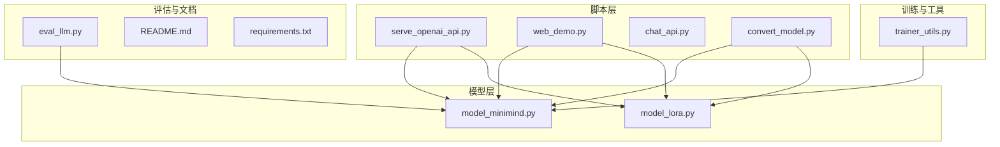
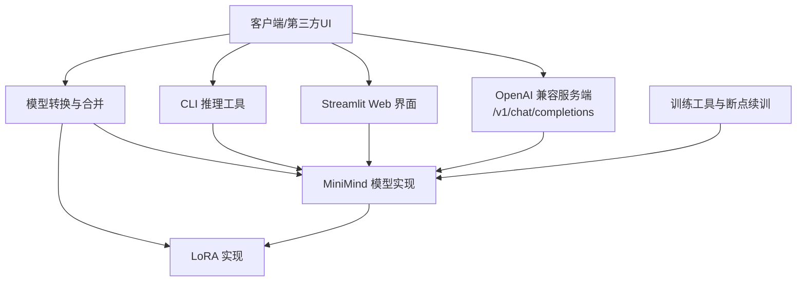
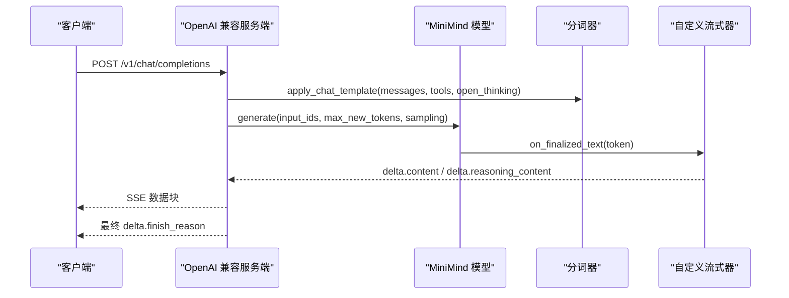
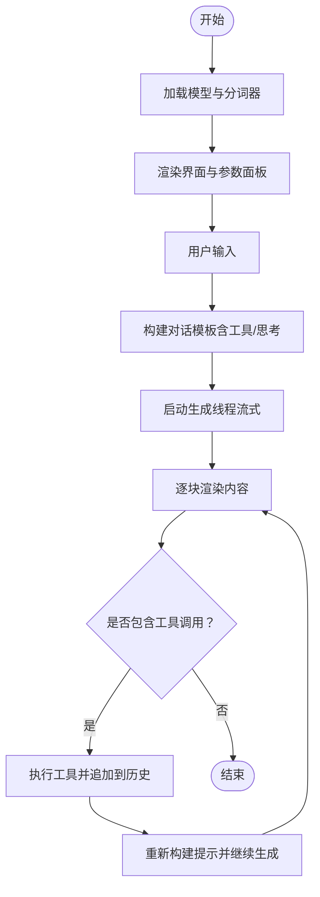
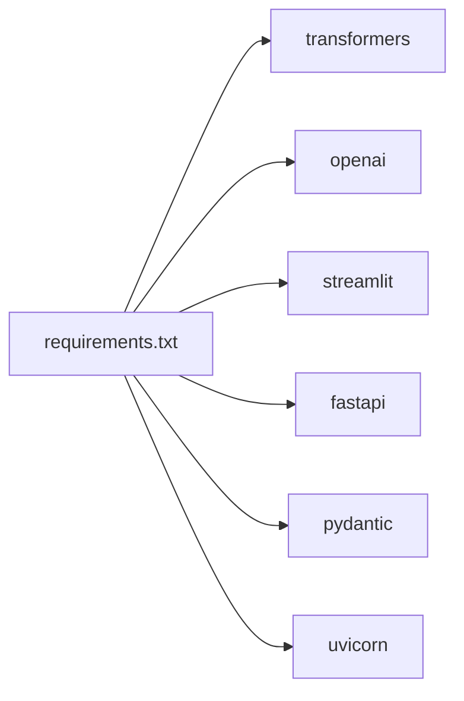

# 推理服务系统

<cite>
**本文引用的文件**
- [README.md](file://README.md)
- [requirements.txt](file://requirements.txt)
- [scripts/serve_openai_api.py](file://scripts/serve_openai_api.py)
- [scripts/web_demo.py](file://scripts/web_demo.py)
- [scripts/chat_api.py](file://scripts/chat_api.py)
- [scripts/convert_model.py](file://scripts/convert_model.py)
- [eval_llm.py](file://eval_llm.py)
- [model/model_minimind.py](file://model/model_minimind.py)
- [model/model_lora.py](file://model/model_lora.py)
- [trainer/trainer_utils.py](file://trainer/trainer_utils.py)
</cite>

## 目录
1. [简介](#简介)
2. [项目结构](#项目结构)
3. [核心组件](#核心组件)
4. [架构总览](#架构总览)
5. [详细组件分析](#详细组件分析)
6. [依赖关系分析](#依赖关系分析)
7. [性能考量](#性能考量)
8. [故障排查指南](#故障排查指南)
9. [结论](#结论)
10. [附录](#附录)

## 简介
本文件面向 MiniMind 推理服务系统，系统提供：
- OpenAI API 兼容接口，支持流式与非流式响应，包含思考内容与工具调用的解析与透传。
- 基于 Streamlit 的 Web 界面，支持多轮对话、工具选择、思考展示与流式渲染。
- CLI 推理工具，支持 Transformers 格式与原生 PyTorch 权重加载，参数丰富，便于本地快速验证。
- 模型转换与合并工具，兼容 Qwen3/Qwen3-MoE 生态，便于接入 llama.cpp、vLLM、Ollama 等第三方推理框架。
- 训练与评估辅助工具，涵盖断点续训、LoRA 参数高效微调、权重合并等。

本系统强调从零实现的可复现性与可移植性，同时兼容主流生态，便于在不同部署环境中快速落地。

## 项目结构
- scripts：推理与演示脚本（OpenAI API 服务、Web Demo、CLI 示例）
- model：模型定义与 LoRA 实现
- trainer：训练工具与断点续训支持
- dataset：数据集说明与格式
- 其他：README、requirements、评估脚本等

图表来源
- [scripts/serve_openai_api.py:1-246](file://scripts/serve_openai_api.py#L1-246)
- [scripts/web_demo.py:1-421](file://scripts/web_demo.py#L1-421)
- [scripts/chat_api.py:1-40](file://scripts/chat_api.py#L1-40)
- [scripts/convert_model.py:1-145](file://scripts/convert_model.py#L1-145)
- [model/model_minimind.py:1-280](file://model/model_minimind.py#L1-280)
- [model/model_lora.py:1-66](file://model/model_lora.py#L1-66)
- [trainer/trainer_utils.py:1-177](file://trainer/trainer_utils.py#L1-177)
- [eval_llm.py:1-94](file://eval_llm.py#L1-94)
- [README.md:1-1987](file://README.md#L1-L1987)
- [requirements.txt:1-32](file://requirements.txt#L1-L32)

章节来源
- [README.md:216-276](file://README.md#L216-L276)
- [requirements.txt:1-32](file://requirements.txt#L1-L32)

## 核心组件
- OpenAI 兼容服务端：提供 /v1/chat/completions，支持流式 SSE 返回，解析思考内容与工具调用，兼容多种开启思考的方式。
- Streamlit Web 界面：支持多轮对话、工具选择、思考展示、流式渲染与多模型动态扫描。
- CLI 推理：支持 Transformers 与原生 PyTorch 权重加载，参数丰富，便于本地测试与性能评估。
- 模型转换与合并：将原生权重转换为 Transformers/Qwen3 格式，或合并 LoRA 权重，便于第三方框架使用。
- 训练工具：断点续训、分布式训练、LoRA 参数高效微调、权重保存与恢复。

章节来源
- [scripts/serve_openai_api.py:171-228](file://scripts/serve_openai_api.py#L171-L228)
- [scripts/web_demo.py:198-417](file://scripts/web_demo.py#L198-L417)
- [eval_llm.py:32-94](file://eval_llm.py#L32-L94)
- [scripts/convert_model.py:16-96](file://scripts/convert_model.py#L16-L96)
- [trainer/trainer_utils.py:63-117](file://trainer/trainer_utils.py#L63-L117)

## 架构总览
系统采用“脚本层-模型层-训练与工具层”的分层设计，OpenAI 服务端与 Web Demo 均依赖模型层的 MiniMind 实现；CLI 与转换工具贯穿模型层与训练工具层，形成闭环。

图表来源
- [scripts/serve_openai_api.py:171-228](file://scripts/serve_openai_api.py#L171-L228)
- [scripts/web_demo.py:312-417](file://scripts/web_demo.py#L312-L417)
- [eval_llm.py:32-94](file://eval_llm.py#L32-L94)
- [scripts/convert_model.py:16-96](file://scripts/convert_model.py#L16-L96)
- [model/model_minimind.py:229-280](file://model/model_minimind.py#L229-L280)
- [model/model_lora.py:21-66](file://model/model_lora.py#L21-L66)
- [trainer/trainer_utils.py:63-117](file://trainer/trainer_utils.py#L63-L117)

## 详细组件分析

### OpenAI 兼容服务端
- 接口规范
  - 端点：POST /v1/chat/completions
  - 请求体字段：model、messages、temperature、top_p、max_tokens、stream、tools、open_thinking、chat_template_kwargs
  - 响应：非流式返回完整消息；流式返回 SSE，逐块输出 delta，包含 content、reasoning_content、tool_calls 与 finish_reason
- 流式传输机制
  - 使用 TextStreamer 与自定义队列，将生成的 token 逐块推送
  - 思考内容与工具调用解析：通过正则匹配与 JSON 解析，分别透传到 delta.reasoning_content 与 delta.tool_calls
- 思考与工具调用
  - 支持 open_thinking 与 chat_template_kwargs 中的 enable_thinking/open_thinking 开关
  - 工具调用 JSON 位于特定标记内，解析后以 OpenAI 格式透传
- 设备与精度
  - 默认半精度推理，支持 CUDA/CPU，可配置设备

图表来源
- [scripts/serve_openai_api.py:105-169](file://scripts/serve_openai_api.py#L105-L169)
- [scripts/serve_openai_api.py:171-228](file://scripts/serve_openai_api.py#L171-L228)
- [model/model_minimind.py:248-280](file://model/model_minimind.py#L248-L280)

章节来源
- [scripts/serve_openai_api.py:50-228](file://scripts/serve_openai_api.py#L50-L228)

### Streamlit Web 界面
- 多模型动态扫描：自动发现 scripts 目录下包含权重文件的子目录作为模型源
- 交互设计
  - 语言切换（中/英）
  - 历史轮次滑杆、最大生成长度、温度等参数
  - 工具选择（最多4个），系统提示与工具注入
  - 思考展示：支持“思考中/已思考”折叠面板
- 多轮对话与工具调用
  - 流式渲染：TextIteratorStreamer 逐块渲染
  - 工具调用：解析 assistant 内的工具调用标记，执行本地工具并追加到对话历史，再次生成直至无工具调用
- 渲染与排版
  - 用户消息右对齐，助手消息左对齐，工具调用与思考内容以卡片/折叠面板展示

图表来源
- [scripts/web_demo.py:312-417](file://scripts/web_demo.py#L312-L417)

章节来源
- [scripts/web_demo.py:198-417](file://scripts/web_demo.py#L198-L417)

### CLI 推理工具
- 支持两种加载路径
  - Transformers 格式：直接 from_pretrained
  - 原生 PyTorch 权重：MiniMindConfig + state_dict 加载
- 参数丰富
  - 权重前缀、LoRA 权重、隐藏维度、层数、MoE 开关、RoPE 外推、最大生成长度、采样温度与 top_p、历史轮次、是否显示速度等
- 流式输出
  - 使用 TextStreamer 实现流式打印，便于观察生成过程与速度统计

章节来源
- [eval_llm.py:32-94](file://eval_llm.py#L32-L94)
- [model/model_minimind.py:229-280](file://model/model_minimind.py#L229-L280)

### 模型转换与合并
- 原生权重转 Transformers/Qwen3
  - 生成 Qwen3/Qwen3Moe 配置，加载 state_dict，保存为 Transformers 格式
  - 处理 MoE 专家权重映射与版本兼容
- 原生权重转 PyTorch
  - 从 Transformers 加载后保存为 PyTorch 权重
- LoRA 合并
  - 将 LoRA 增量合并到基模权重，生成新的完整权重文件
- Jinja/JSON 模板互转
  - 支持将聊天模板在 Jinja 与 JSON 间互转，便于生态对接

章节来源
- [scripts/convert_model.py:16-145](file://scripts/convert_model.py#L16-L145)
- [model/model_lora.py:21-66](file://model/model_lora.py#L21-L66)

### 训练工具与断点续训
- 断点续训
  - 保存完整检查点（模型、优化器、epoch、step、world_size、wandb_id 等）
  - 支持跨 GPU 数量恢复，自动转换 step
- 分布式训练
  - DDP 初始化与本地 GPU 设置
- 采样器与评分
  - SkipBatchSampler 跳过若干批次
  - 奖励模型评分封装

章节来源
- [trainer/trainer_utils.py:63-117](file://trainer/trainer_utils.py#L63-L117)
- [trainer/trainer_utils.py:134-158](file://trainer/trainer_utils.py#L134-L158)
- [trainer/trainer_utils.py:160-177](file://trainer/trainer_utils.py#L160-L177)

## 依赖关系分析
- 运行时依赖
  - transformers、pydantic、fastapi、uvicorn、streamlit、openai 等
- 模块依赖
  - 服务端与 Web Demo 依赖模型层（MiniMindForCausalLM、Attention、RMSNorm 等）
  - CLI 与转换工具依赖模型层与 LoRA 实现
  - 训练工具依赖模型层与分词器

图表来源
- [requirements.txt:1-32](file://requirements.txt#L1-L32)

章节来源
- [requirements.txt:1-32](file://requirements.txt#L1-L32)

## 性能考量
- 推理性能
  - 半精度（FP16）推理，优先使用 CUDA 设备
  - 生成参数：temperature、top_p、max_new_tokens、repetition_penalty 等影响吞吐与质量
  - 流式生成：TextStreamer/TextIteratorStreamer 降低首 token 延迟，提升交互体验
- 模型结构
  - MiniMind 采用预规范化 + RMSNorm、SwiGLU 激活、RoPE 位置编码与 YaRN 外推
  - 注意力实现支持 scaled_dot_product_attention（SDPA）以提升效率
- KV 缓存与外推
  - 支持 use_cache 与 past_key_values，结合 YaRN 外推提升长序列能力
- 批处理与量化
  - 本仓库未内置批处理与量化实现；可在上游框架（如 vLLM、llama.cpp）中启用相应优化
- 训练与评估
  - 断点续训与分布式训练可提升大规模训练效率；LoRA 参数高效微调降低显存占用

章节来源
- [model/model_minimind.py:108-133](file://model/model_minimind.py#L108-L133)
- [model/model_minimind.py:248-280](file://model/model_minimind.py#L248-L280)
- [trainer/trainer_utils.py:63-117](file://trainer/trainer_utils.py#L63-L117)
- [eval_llm.py:42-87](file://eval_llm.py#L42-L87)

## 故障排查指南
- 服务端启动失败
  - 检查模型路径与权重前缀是否正确，确认 save_dir 与 weight 参数
  - 若使用 LoRA，确保 lora_weight 与 save_dir/lora/ 路径一致
  - 确认设备可用性与半精度支持
- 流式输出异常
  - 确认 TextStreamer/TextIteratorStreamer 使用正确，避免阻塞
  - 检查队列与线程同步，避免死锁
- 工具调用解析失败
  - 确认工具调用标记与 JSON 格式正确
  - 检查正则匹配与 JSON 解析逻辑
- Web 界面模型扫描为空
  - 确认模型目录包含权重文件（.bin/.safetensors/.pt 或 model.safetensors.index.json）
- CLI 推理卡顿
  - 调整 max_new_tokens、temperature、top_p
  - 检查设备与显存占用，必要时切换 CPU

章节来源
- [scripts/serve_openai_api.py:28-47](file://scripts/serve_openai_api.py#L28-L47)
- [scripts/web_demo.py:239-248](file://scripts/web_demo.py#L239-L248)
- [eval_llm.py:32-49](file://eval_llm.py#L32-L49)

## 结论
MiniMind 推理服务系统以“从零实现 + 生态兼容”为核心理念，提供 OpenAI 兼容接口、Streamlit Web 界面与 CLI 工具，覆盖思考内容与工具调用两大关键特性。通过模型转换与合并工具，系统可无缝对接 llama.cpp、vLLM、Ollama 等第三方推理框架。配合断点续训与 LoRA 参数高效微调，满足从小规模到中等规模部署的多样化需求。

## 附录
- 第三方框架集成要点
  - llama.cpp：可直接加载转换后的 Transformers/Qwen3 权重
  - vLLM：可加载转换后的 Qwen3/Qwen3Moe 权重，启用相应优化
  - Ollama：可将权重打包为 Ollama 模型镜像，便于本地运行
- 使用建议
  - 推理阶段优先使用半精度与 CUDA 设备
  - 多轮对话与工具调用场景建议开启 open_thinking 与工具注入
  - 长序列场景启用 YaRN 外推与 KV 缓存

章节来源
- [README.md:92-97](file://README.md#L92-L97)
- [scripts/convert_model.py:16-96](file://scripts/convert_model.py#L16-L96)