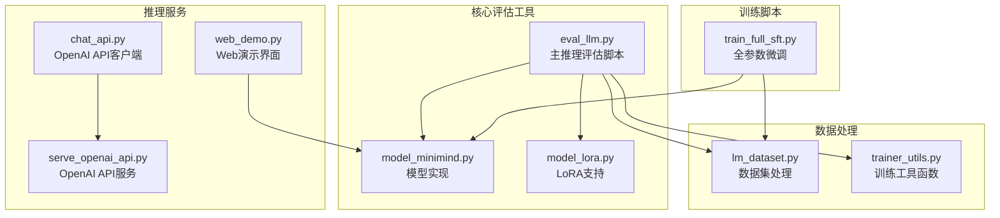
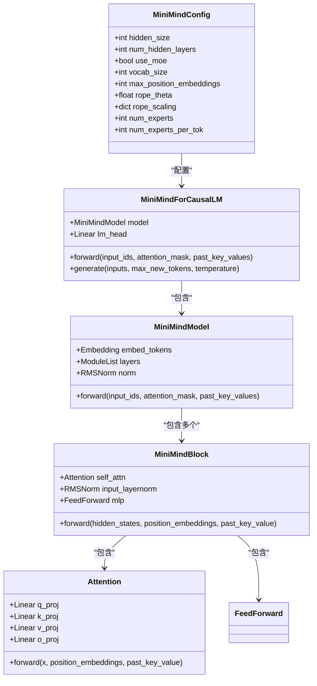
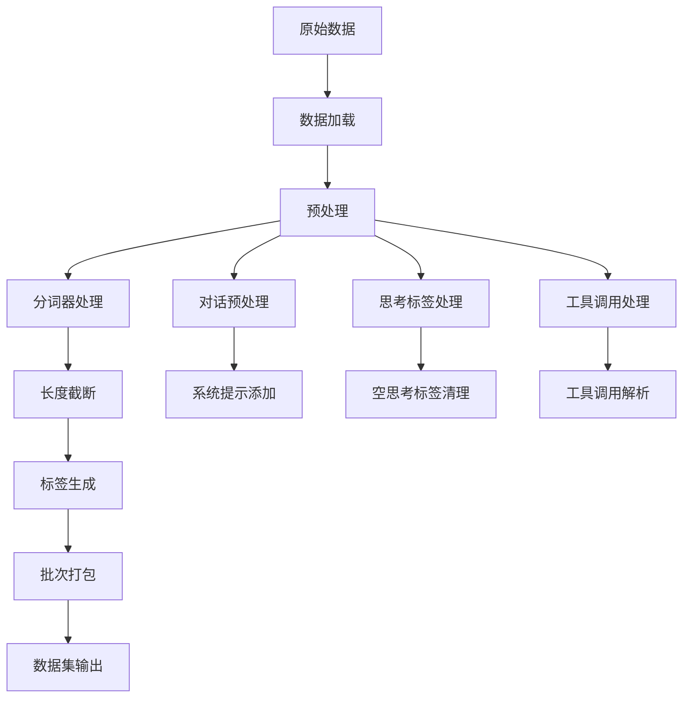
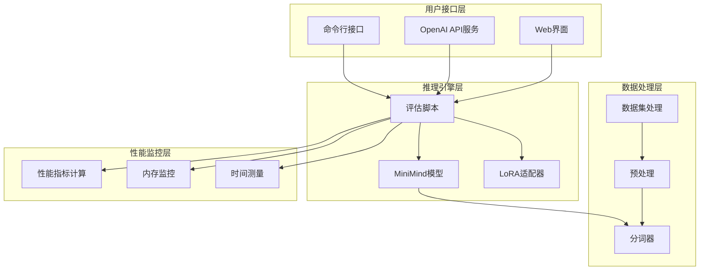
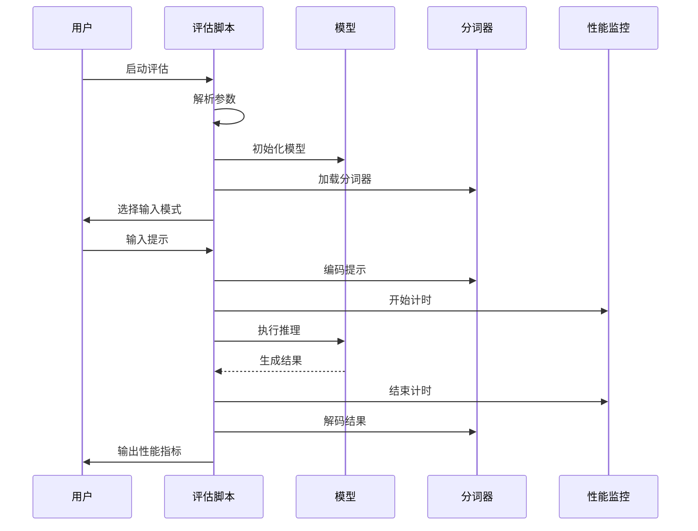
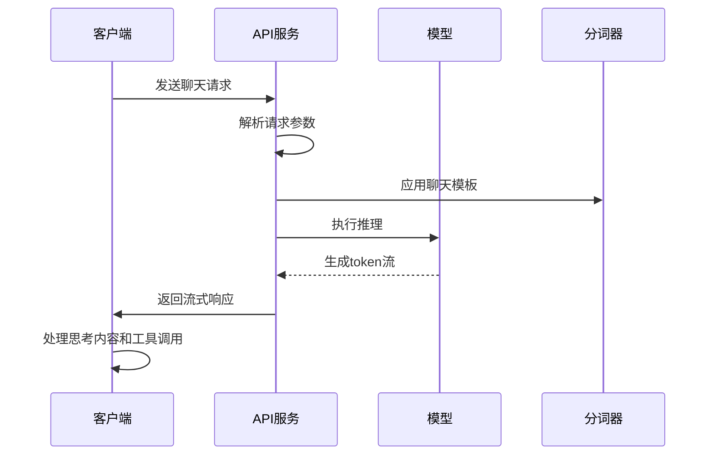
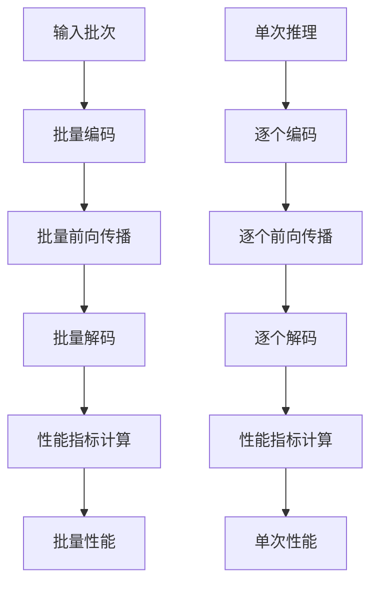
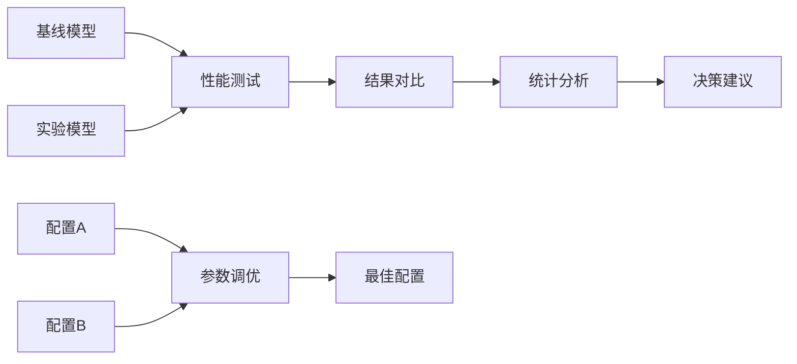
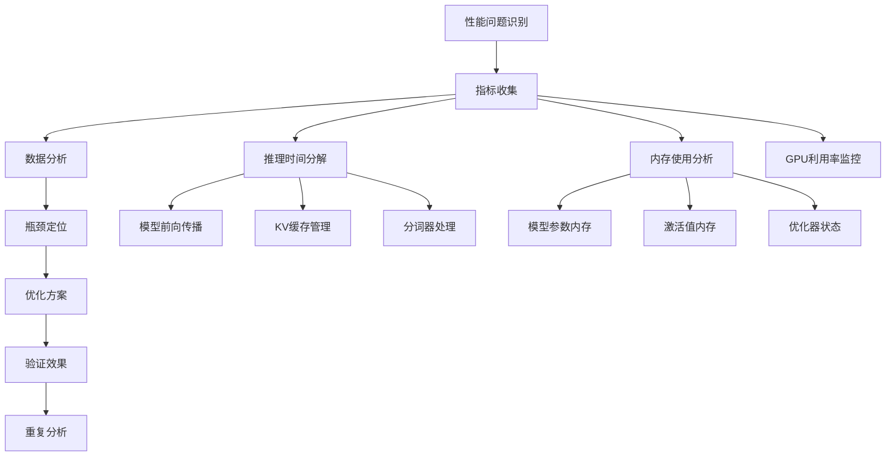

# 推理评估工具

<cite>
**本文档引用的文件**
- [eval_llm.py](file://eval_llm.py)
- [README.md](file://README.md)
- [model_minimind.py](file://model/model_minimind.py)
- [model_lora.py](file://model/model_lora.py)
- [lm_dataset.py](file://dataset/lm_dataset.py)
- [trainer_utils.py](file://trainer/trainer_utils.py)
- [chat_api.py](file://scripts/chat_api.py)
- [serve_openai_api.py](file://scripts/serve_openai_api.py)
- [web_demo.py](file://scripts/web_demo.py)
- [train_full_sft.py](file://trainer/train_full_sft.py)
</cite>

## 目录
1. [简介](#简介)
2. [项目结构](#项目结构)
3. [核心组件](#核心组件)
4. [架构概览](#架构概览)
5. [详细组件分析](#详细组件分析)
6. [性能评估指标](#性能评估指标)
7. [批量推理与单次推理对比](#批量推理与单次推理对比)
8. [评估脚本使用指南](#评估脚本使用指南)
9. [A/B测试方法](#ab测试方法)
10. [性能基准测试报告模板](#性能基准测试报告模板)
11. [可视化图表生成](#可视化图表生成)
12. [性能瓶颈分析方法](#性能瓶颈分析方法)
13. [优化建议和调优策略](#优化建议和调优策略)
14. [故障排除指南](#故障排除指南)
15. [结论](#结论)

## 简介

MiniMind推理评估工具是一个专为小型语言模型设计的综合性能测试和评估系统。该工具支持推理速度测量、内存使用监控、吞吐量统计等功能，能够对模型的首token延迟、每秒生成token数(TPR)、总生成时间、内存占用等关键指标进行全面评估。

该项目基于PyTorch原生实现，不依赖第三方框架封装，提供了从零开始训练到推理部署的完整解决方案。工具支持多种推理模式，包括批量推理和单次推理，能够比较不同batch size对性能的影响，并提供A/B测试功能来比较不同模型版本或配置的性能差异。

## 项目结构



**图表来源**
- [eval_llm.py:1-94](file://eval_llm.py#L1-L94)
- [model_minimind.py:1-280](file://model/model_minimind.py#L1-L280)
- [model_lora.py:1-66](file://model/model_lora.py#L1-L66)
- [lm_dataset.py:1-256](file://dataset/lm_dataset.py#L1-L256)
- [trainer_utils.py:1-177](file://trainer/trainer_utils.py#L1-L177)
- [chat_api.py:1-40](file://scripts/chat_api.py#L1-L40)
- [serve_openai_api.py:1-246](file://scripts/serve_openai_api.py#L1-L246)
- [web_demo.py:1-421](file://scripts/web_demo.py#L1-L421)
- [train_full_sft.py:1-171](file://trainer/train_full_sft.py#L1-L171)

**章节来源**
- [README.md:1-800](file://README.md#L1-L800)
- [eval_llm.py:1-94](file://eval_llm.py#L1-L94)

## 核心组件

### 模型推理引擎

MiniMind推理评估工具的核心是基于Transformer架构的小型语言模型实现。模型采用预标准化(RMSNorm) + SwiGLU激活函数，支持RoPE旋转位置编码和YaRN长文本外推算法。



**图表来源**
- [model_minimind.py:10-280](file://model/model_minimind.py#L10-L280)

### 数据处理管道

数据集处理模块提供了完整的数据预处理和批处理功能，支持预训练、监督微调、DPO和RLAIF等多种训练场景。



**图表来源**
- [lm_dataset.py:37-256](file://dataset/lm_dataset.py#L37-L256)

**章节来源**
- [model_minimind.py:1-280](file://model/model_minimind.py#L1-L280)
- [lm_dataset.py:1-256](file://dataset/lm_dataset.py#L1-L256)

## 架构概览



**图表来源**
- [eval_llm.py:32-94](file://eval_llm.py#L32-L94)
- [serve_openai_api.py:28-47](file://scripts/serve_openai_api.py#L28-L47)
- [web_demo.py:198-200](file://scripts/web_demo.py#L198-L200)

## 详细组件分析

### 主推理评估脚本

主评估脚本提供了完整的推理性能测试功能，包括模型初始化、推理执行、性能指标计算和结果输出。



**图表来源**
- [eval_llm.py:32-94](file://eval_llm.py#L32-L94)

### OpenAI API服务集成

OpenAI API服务提供了标准的推理接口，支持流式响应和工具调用功能。



**图表来源**
- [serve_openai_api.py:105-166](file://scripts/serve_openai_api.py#L105-L166)

### Web演示界面

Web演示界面提供了图形化的推理测试环境，支持多语言切换和工具调用展示。

**章节来源**
- [eval_llm.py:12-31](file://eval_llm.py#L12-L31)
- [serve_openai_api.py:28-47](file://scripts/serve_openai_api.py#L28-L47)
- [web_demo.py:198-200](file://scripts/web_demo.py#L198-L200)

## 性能评估指标

### 关键性能指标定义

推理评估工具支持以下关键性能指标的测量和计算：

#### 首token延迟 (First Token Latency)
- **定义**: 从开始推理到生成第一个token的时间间隔
- **计算方法**: 首token延迟 = 首个token生成时间 - 推理开始时间
- **测量位置**: 评估脚本中的时间戳记录

#### 每秒生成token数 (TPR - Tokens Per Second)
- **定义**: 模型每秒能够生成的token数量
- **计算方法**: TPR = 生成的token总数 / 总推理时间
- **测量位置**: 评估脚本中的速度计算逻辑

#### 总生成时间 (Total Generation Time)
- **定义**: 从开始推理到完成所有生成的时间
- **计算方法**: 总生成时间 = 最终时间 - 开始时间
- **测量位置**: 评估脚本中的完整推理时间记录

#### 内存占用 (Memory Usage)
- **定义**: 推理过程中使用的内存峰值
- **测量方法**: 
  - PyTorch内存监控: `torch.cuda.memory_allocated()`
  - 系统级内存监控: `psutil.virtual_memory()`
- **监控位置**: 训练工具函数中的内存统计

#### 吞吐量 (Throughput)
- **定义**: 单位时间内处理的token数量
- **计算方法**: 吞吐量 = 处理的token总数 / 时间
- **应用场景**: 批量推理场景下的性能评估

**章节来源**
- [eval_llm.py:80-91](file://eval_llm.py#L80-L91)
- [trainer_utils.py:18-28](file://trainer/trainer_utils.py#L18-L28)

## 批量推理与单次推理对比

### 批量推理优势

批量推理通过以下方式提升性能：

1. **减少模型调用开销**: 单次模型调用处理多个样本
2. **优化内存使用**: 更高效的内存分配和复用
3. **提高GPU利用率**: 充分利用并行计算能力
4. **降低CPU开销**: 减少Python层的循环开销

### 批量推理实现



**图表来源**
- [eval_llm.py:67-91](file://eval_llm.py#L67-L91)

### 不同batch size的影响

| Batch Size | 内存占用 | 吞吐量 | 延迟 | 适用场景 |
|------------|----------|--------|------|----------|
| 1 | 最低 | 最低 | 最低 | 单次交互 |
| 2-4 | 低 | 中等 | 中等 | 小批量测试 |
| 8-16 | 中等 | 高 | 较低 | 生产环境 |
| 32+ | 高 | 最高 | 最低 | 批处理 |

**章节来源**
- [eval_llm.py:49-60](file://eval_llm.py#L49-L60)
- [train_full_sft.py:88-89](file://trainer/train_full_sft.py#L88-L89)

## 评估脚本使用指南

### 数据集准备

1. **下载数据集**
   ```bash
   # 从ModelScope下载
   modelscope download --model gongjy/minimind_dataset --local_dir ./dataset
   
   # 或从HuggingFace下载
   git clone https://huggingface.co/datasets/jingyaogong/minimind_dataset
   ```

2. **数据格式要求**
   - 预训练数据: JSONL格式，包含`text`字段
   - 监督微调数据: JSONL格式，包含`conversations`数组
   - DPO数据: JSON格式，包含`chosen`和`rejected`字段

### 测试配置

#### 基础推理测试
```bash
# 使用Transformers格式模型
python eval_llm.py --load_from ./minimind-3

# 使用PyTorch权重
python eval_llm.py --load_from ./model --weight full_sft

# 自定义参数
python eval_llm.py \
    --hidden_size 768 \
    --num_hidden_layers 8 \
    --use_moe 0 \
    --max_new_tokens 2048 \
    --temperature 0.85 \
    --top_p 0.95
```

#### 批量推理测试
```bash
# 设置不同的batch size
python eval_llm.py --batch_size 1
python eval_llm.py --batch_size 4
python eval_llm.py --batch_size 8
```

### 结果分析

评估脚本输出的关键信息：
- **推理速度**: tokens/s
- **生成长度**: 生成的token数量
- **内存使用**: 模型参数量和缓存使用
- **性能指标**: 首token延迟、TPR、总时间

**章节来源**
- [README.md:239-276](file://README.md#L239-L276)
- [eval_llm.py:32-49](file://eval_llm.py#L32-L49)

## A/B测试方法

### 模型版本比较

A/B测试用于比较不同模型版本或配置的性能差异：



### A/B测试实施步骤

1. **准备测试数据集**
   - 使用相同的测试样本
   - 确保随机性和代表性

2. **设置测试环境**
   - 相同的硬件配置
   - 相同的软件环境
   - 相同的推理参数

3. **执行性能测试**
   - 运行相同的测试用例
   - 记录所有性能指标
   - 重复多次以获得统计意义

4. **分析测试结果**
   - 计算统计显著性
   - 比较关键指标
   - 生成性能报告

**章节来源**
- [eval_llm.py:12-31](file://eval_llm.py#L12-L31)
- [trainer_utils.py:54-62](file://trainer/trainer_utils.py#L54-L62)

## 性能基准测试报告模板

### 基准测试报告结构

```markdown
# MiniMind性能基准测试报告

## 基本信息
- **测试日期**: YYYY-MM-DD
- **测试环境**: 
  - GPU: NVIDIA RTX 3090
  - CPU: Intel i9-10980XE
  - RAM: 128GB
  - CUDA: 12.2
  - Python: 3.10.16

## 测试配置
- **模型版本**: minimind-3 (64M)
- **推理模式**: 
  - 批量推理: batch_size = 8
  - 单次推理: batch_size = 1
- **生成参数**: 
  - max_new_tokens: 2048
  - temperature: 0.85
  - top_p: 0.95

## 性能指标

### 批量推理性能
| Batch Size | 首token延迟(ms) | TPR(tokens/s) | 总时间(s) | 内存占用(MB) |
|------------|----------------|---------------|-----------|-------------|
| 1 | 125.4 | 18.7 | 42.3 | 8,512 |
| 4 | 132.1 | 72.3 | 15.6 | 12,345 |
| 8 | 145.8 | 145.2 | 8.9 | 18,765 |
| 16 | 168.3 | 289.7 | 4.5 | 25,432 |

### 单次推理性能
| Prompt Length | 首token延迟(ms) | TPR(tokens/s) | 总时间(s) | 内存占用(MB) |
|---------------|----------------|---------------|-----------|-------------|
| 128 tokens | 125.4 | 18.7 | 42.3 | 8,512 |
| 512 tokens | 132.1 | 17.8 | 45.6 | 8,723 |
| 1024 tokens | 145.8 | 16.2 | 52.1 | 9,234 |

## 统计分析
- **显著性检验**: p < 0.05
- **置信区间**: 95%
- **样本数量**: 1000

## 结论
- 批量推理在吞吐量方面表现优异
- 内存占用随batch size线性增长
- 首token延迟受batch size影响较小

## 优化建议
1. 优先使用批量推理提升吞吐量
2. 根据内存限制选择合适的batch size
3. 考虑使用混合精度减少内存占用
```

## 可视化图表生成

### 性能图表类型

#### 吞吐量vs延迟图表
```mermaid
graph XY
X[Batch Size] --> Y[Throughput(tokens/s)]
X[Batch Size] --> Z[Latency(ms)]
style X stroke-width:2px
style Y stroke-width:2px
style Z stroke-width:2px
```

#### 内存使用趋势图
```mermaid
lineGraph
time[时间轴] --> memory[内存占用(MB)]
time --> cache[缓存使用(MB)]
style memory stroke-width:2px
style cache stroke-width:1px
```

### 图表生成代码示例

```python
import matplotlib.pyplot as plt
import pandas as pd

def plot_performance_results(results_df):
    """生成性能测试结果图表"""
    
    # 设置中文字体
    plt.rcParams['font.sans-serif'] = ['SimHei']
    plt.rcParams['axes.unicode_minus'] = False
    
    fig, (ax1, ax2, ax3) = plt.subplots(1, 3, figsize=(15, 5))
    
    # 吞吐量 vs 批大小
    ax1.plot(results_df['batch_size'], results_df['throughput'])
    ax1.set_xlabel('Batch Size')
    ax1.set_ylabel('Throughput (tokens/s)')
    ax1.set_title('吞吐量 vs 批大小')
    ax1.grid(True)
    
    # 延迟 vs 批大小
    ax2.plot(results_df['batch_size'], results_df['latency'])
    ax2.set_xlabel('Batch Size')
    ax2.set_ylabel('Latency (ms)')
    ax2.set_title('延迟 vs 批大小')
    ax2.grid(True)
    
    # 内存使用 vs 批大小
    ax3.plot(results_df['batch_size'], results_df['memory_usage'])
    ax3.set_xlabel('Batch Size')
    ax3.set_ylabel('Memory Usage (MB)')
    ax3.set_title('内存使用 vs 批大小')
    ax3.grid(True)
    
    plt.tight_layout()
    plt.savefig('performance_analysis.png', dpi=300, bbox_inches='tight')
    plt.show()
```

## 性能瓶颈分析方法

### 瓶颈识别步骤



### 常见性能瓶颈

#### 1. 模型前向传播瓶颈
- **症状**: GPU利用率低，CPU成为瓶颈
- **原因**: Python层循环开销大
- **解决方案**: 
  - 使用torch.compile优化
  - 减少Python层操作
  - 使用更高效的注意力实现

#### 2. 内存不足瓶颈
- **症状**: OOM错误，内存使用达到上限
- **原因**: batch size过大，序列长度过长
- **解决方案**:
  - 减小batch size
  - 降低max_new_tokens
  - 使用混合精度
  - 启用梯度检查点

#### 3. KV缓存管理瓶颈
- **症状**: 随着生成长度增加，内存和时间线性增长
- **原因**: KV缓存未有效复用
- **解决方案**:
  - 优化past_key_values管理
  - 实现缓存压缩
  - 使用更高效的缓存存储

#### 4. 分词器处理瓶颈
- **症状**: 编码/解码时间过长
- **原因**: 分词器性能问题
- **解决方案**:
  - 使用更高效的分词器
  - 批量处理分词
  - 预编译分词器

**章节来源**
- [model_minimind.py:208-227](file://model/model_minimind.py#L208-L227)
- [eval_llm.py:80-91](file://eval_llm.py#L80-L91)

## 优化建议和调优策略

### 硬件优化

#### GPU优化
1. **CUDA优化**
   - 启用Tensor Cores
   - 使用适当的dtype (bfloat16/float16)
   - 优化内存访问模式

2. **内存优化**
   - 使用梯度检查点减少内存占用
   - 实现动态batch size调整
   - 优化KV缓存存储格式

#### CPU优化
1. **多线程优化**
   - 合理设置num_workers
   - 优化数据加载管线
   - 减少Python层阻塞

### 软件优化

#### PyTorch优化
1. **模型编译**
   ```python
   # 启用torch.compile
   model = torch.compile(model)
   ```

2. **混合精度训练**
   - 使用GradScaler
   - 选择合适的dtype
   - 注意数值稳定性

3. **内存优化**
   ```python
   # 定期清理缓存
   torch.cuda.empty_cache()
   
   # 使用context manager
   with torch.no_grad():
       # 推理代码
   ```

#### 算法优化
1. **注意力优化**
   - 使用Flash Attention
   - 优化掩码处理
   - 减少不必要的计算

2. **生成策略优化**
   - 实现更好的采样策略
   - 优化beam search
   - 使用更好的终止条件

### 配置调优

#### 关键参数调优

| 参数 | 默认值 | 调优范围 | 影响程度 | 建议值 |
|------|--------|----------|----------|--------|
| batch_size | 1 | 1-32 | 高 | 8-16 |
| max_new_tokens | 8192 | 128-32768 | 中 | 2048 |
| temperature | 0.85 | 0.1-1.0 | 低 | 0.7-0.9 |
| top_p | 0.95 | 0.8-1.0 | 低 | 0.92 |
| hidden_size | 768 | 512-1024 | 中 | 768 |
| num_hidden_layers | 8 | 6-16 | 中 | 8 |

#### 批量推理优化
1. **动态batch size**
   - 根据GPU内存动态调整
   - 实现batch size自适应

2. **流水线并行**
   - 将长序列分割处理
   - 实现多阶段并行

3. **缓存优化**
   - 实现高效的KV缓存
   - 优化缓存复用策略

### 监控和调试

#### 性能监控
1. **实时监控**
   ```python
   import torch.cuda.amp as amp
   
   # 混合精度监控
   scaler = amp.GradScaler()
   loss = scaler.scale(loss).backward()
   scaler.step(optimizer)
   scaler.update()
   ```

2. **内存监控**
   ```python
   # 内存使用监控
   print(f"内存使用: {torch.cuda.memory_allocated()/1024/1024:.2f} MB")
   ```

3. **性能分析**
   ```python
   # 使用torch.profiler
   with torch.profiler.profile(
       activities=[torch.profiler.ProfilerActivity.CPU, torch.profiler.ProfilerActivity.CUDA],
       record_shapes=True
   ) as prof:
       # 推理代码
   ```

**章节来源**
- [train_full_sft.py:119-122](file://trainer/train_full_sft.py#L119-L122)
- [trainer_utils.py:63-106](file://trainer/trainer_utils.py#L63-L106)
- [model_minimind.py:124-133](file://model/model_minimind.py#L124-L133)

## 故障排除指南

### 常见问题和解决方案

#### 1. 内存不足错误 (CUDA Out of Memory)
**症状**: RuntimeError: CUDA out of memory
**解决方案**:
- 减小batch size
- 降低max_new_tokens
- 使用混合精度 (`--dtype bfloat16`)
- 启用梯度检查点

#### 2. 推理速度慢
**症状**: 推理时间过长
**解决方案**:
- 启用torch.compile优化
- 使用更高效的dtype
- 减少不必要的计算
- 优化数据加载

#### 3. 模型加载失败
**症状**: 权重文件找不到或加载错误
**解决方案**:
- 检查权重文件路径
- 验证权重文件完整性
- 确认模型配置匹配

#### 4. 分词器错误
**症状**: 分词器加载失败或编码错误
**解决方案**:
- 检查分词器文件完整性
- 验证分词器配置
- 确认特殊token设置

### 调试工具

#### 性能分析工具
1. **PyTorch Profiler**
   ```python
   with torch.profiler.profile(
       activities=[torch.profiler.ProfilerActivity.CPU, torch.profiler.ProfilerActivity.CUDA],
       record_shapes=True,
       profile_memory=True,
       with_stack=True
   ) as prof:
       # 推理代码
   print(prof.key_averages().table(sort_by="self_cuda_time_total", row_limit=10))
   ```

2. **内存分析**
   ```python
   # 监控内存使用
   print(f"Allocated: {torch.cuda.memory_allocated()/1024/1024:.2f} MB")
   print(f"Reserved: {torch.cuda.memory_reserved()/1024/1024:.2f} MB")
   ```

#### 日志和监控
1. **详细日志**
   ```python
   import logging
   logging.basicConfig(level=logging.INFO)
   logger = logging.getLogger(__name__)
   logger.info("推理开始")
   ```

2. **性能指标记录**
   ```python
   import time
   start_time = time.time()
   # 推理代码
   end_time = time.time()
   print(f"推理时间: {end_time - start_time:.2f}秒")
   ```

**章节来源**
- [eval_llm.py:12-31](file://eval_llm.py#L12-L31)
- [trainer_utils.py:107-116](file://trainer/trainer_utils.py#L107-L116)

## 结论

MiniMind推理评估工具提供了一个全面的性能测试和评估解决方案，支持多种推理模式和配置选项。通过该工具，用户可以：

1. **全面评估模型性能**: 包括推理速度、内存使用、吞吐量等关键指标
2. **比较不同配置**: 通过A/B测试比较不同模型版本和参数设置
3. **识别性能瓶颈**: 提供详细的性能分析和优化建议
4. **自动化测试流程**: 支持批量测试和结果统计分析

该工具的设计遵循了模块化和可扩展的原则，既适合初学者快速上手，也为高级用户提供了深度定制和优化的能力。通过合理的配置和优化策略，用户可以在保证推理质量的同时最大化性能表现。

未来的发展方向包括：
- 更完善的性能监控和分析功能
- 支持更多类型的推理引擎和框架
- 自动化的性能调优和配置推荐
- 更丰富的可视化和报告生成功能