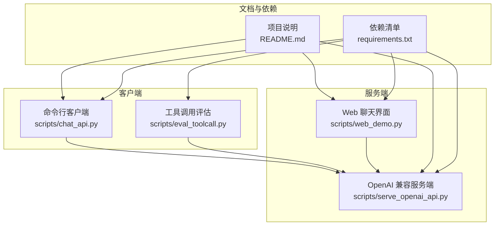
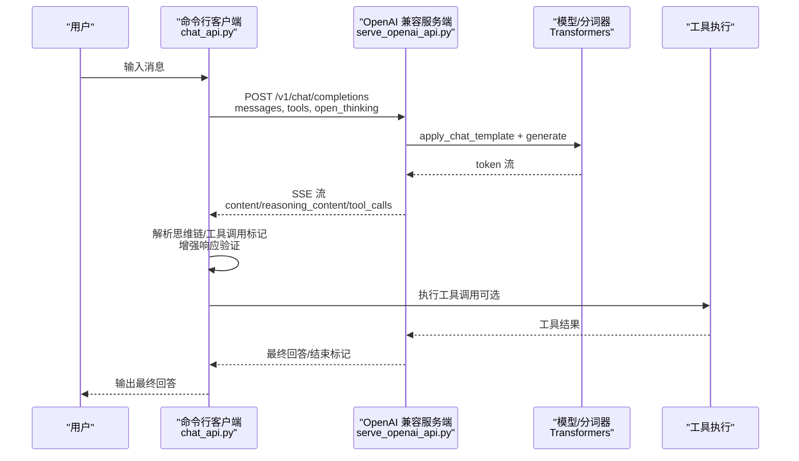
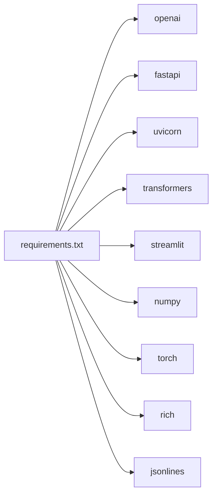

# 聊天 API 客户端

<cite>
**本文引用的文件**
- [scripts/chat_api.py](file://scripts/chat_api.py)
- [scripts/serve_openai_api.py](file://scripts/serve_openai_api.py)
- [scripts/eval_toolcall.py](file://scripts/eval_toolcall.py)
- [scripts/web_demo.py](file://scripts/web_demo.py)
- [README.md](file://README.md)
- [requirements.txt](file://requirements.txt)
</cite>

## 更新摘要
**所做更改**
- 增强了聊天 API 客户端对空响应和过滤响应的验证机制
- 改进了对 None choices 和消息对象的处理
- 提升了流式响应处理的健壮性
- 更新了错误处理和异常处理逻辑

## 目录
1. [简介](#简介)
2. [项目结构](#项目结构)
3. [核心组件](#核心组件)
4. [架构总览](#架构总览)
5. [详细组件分析](#详细组件分析)
6. [依赖分析](#依赖分析)
7. [性能考量](#性能考量)
8. [故障排查指南](#故障排查指南)
9. [结论](#结论)
10. [附录](#附录)

## 简介
本文件为 MiniMind 项目中的聊天 API 客户端工具的详细文档，聚焦于命令行客户端的实现与使用，涵盖参数解析、连接建立、消息发送、响应处理、错误处理、配置管理、代理与日志等主题。文档同时说明了客户端支持的聊天模式（普通对话、思维链模式、工具调用模式），并提供使用示例与与其他工具的集成方案建议。

**更新** 本次更新重点改进了聊天 API 客户端的健壮性，增强了对空响应和过滤响应的验证，改进了对 None choices 和消息对象的处理，以及更稳健的流式响应处理机制。

## 项目结构
本项目采用脚本化的工具组织方式，核心聊天客户端与服务端均以 Python 脚本形式提供：
- 命令行聊天客户端：scripts/chat_api.py
- OpenAI 兼容服务端：scripts/serve_openai_api.py
- 工具调用评估与流式处理：scripts/eval_toolcall.py
- Web 聊天界面：scripts/web_demo.py
- 项目说明与使用指南：README.md
- 依赖清单：requirements.txt

图表来源
- [scripts/chat_api.py:1-47](file://scripts/chat_api.py#L1-L47)
- [scripts/serve_openai_api.py:1-253](file://scripts/serve_openai_api.py#L1-L253)
- [scripts/eval_toolcall.py:1-241](file://scripts/eval_toolcall.py#L1-L241)
- [scripts/web_demo.py:1-421](file://scripts/web_demo.py#L1-L421)
- [README.md:1-800](file://README.md#L1-L800)
- [requirements.txt:1-32](file://requirements.txt#L1-L32)

章节来源
- [scripts/chat_api.py:1-47](file://scripts/chat_api.py#L1-L47)
- [scripts/serve_openai_api.py:1-253](file://scripts/serve_openai_api.py#L1-L253)
- [scripts/eval_toolcall.py:1-241](file://scripts/eval_toolcall.py#L1-L241)
- [scripts/web_demo.py:1-421](file://scripts/web_demo.py#L1-L421)
- [README.md:1-800](file://README.md#L1-L800)
- [requirements.txt:1-32](file://requirements.txt#L1-L32)

## 核心组件
- 命令行聊天客户端：基于 OpenAI SDK，支持流式与非流式响应，内置思维链与工具调用标记解析，**已增强响应验证和错误处理**。
- OpenAI 兼容服务端：FastAPI + Transformers，提供 /v1/chat/completions 接口，支持思维链与工具调用的 SSE 流式输出。
- 工具调用评估脚本：演示 OpenAI 风格的工具调用 API 调用与流式处理，包含工具解析与执行逻辑。
- Web 聊天界面：Streamlit 应用，支持思维链与工具调用的前端展示与交互。

**更新** 命令行聊天客户端现已具备更强的响应验证能力，能够检测和处理空响应、过滤响应以及 None choices 的情况。

章节来源
- [scripts/chat_api.py:1-47](file://scripts/chat_api.py#L1-L47)
- [scripts/serve_openai_api.py:1-253](file://scripts/serve_openai_api.py#L1-L253)
- [scripts/eval_toolcall.py:1-241](file://scripts/eval_toolcall.py#L1-L241)
- [scripts/web_demo.py:1-421](file://scripts/web_demo.py#L1-L421)

## 架构总览
客户端与服务端通过 OpenAI 兼容接口通信，支持：
- 普通对话：标准消息流式输出
- 思维链模式：通过特殊标记输出推理内容，随后输出最终回答
- 工具调用模式：在回答中嵌入工具调用标记，客户端/服务端解析并执行工具

图表来源
- [scripts/chat_api.py:14-47](file://scripts/chat_api.py#L14-L47)
- [scripts/serve_openai_api.py:105-176](file://scripts/serve_openai_api.py#L105-L176)
- [scripts/eval_toolcall.py:133-174](file://scripts/eval_toolcall.py#L133-L174)

## 详细组件分析

### 命令行聊天客户端（chat_api.py）
- 功能要点
  - 初始化 OpenAI 客户端，设置 base_url 与 api_key
  - 维护对话历史，支持历史轮次裁剪
  - 发送消息时可启用思维链与推理强度参数
  - 支持流式与非流式响应，流式模式下解析思维链与回答内容
  - **新增增强响应验证**：检查空响应、过滤响应和 None choices
  - 将助手回答追加到历史，支持多轮对话

- 关键参数与行为
  - 模型名称：minimind-local:latest
  - 温度、最大令牌、top_p 等生成参数
  - extra_body：启用 open_thinking，设置 reasoning_effort
  - 历史轮次 history_messages_num：偶数轮次，为 0 不携带历史

- **增强的错误处理**
  - 非流式模式：检查 response.choices 是否存在且 response.choices[0].message 不为 None
  - 流式模式：检查 chunk.choices 是否存在且 delta 不为 None
  - 对空响应和过滤响应抛出明确的 ValueError 异常

- 使用示例
  - 基本聊天：循环输入消息，查看流式回答
  - 批量消息：在脚本外层循环批量发送消息
  - 自动化脚本：将输入消息写入文件，读取并循环调用

**更新** 客户端现在具备更强的健壮性，能够处理各种异常情况，包括空响应、过滤响应和 None choices。

章节来源
- [scripts/chat_api.py:14-47](file://scripts/chat_api.py#L14-L47)

### OpenAI 兼容服务端（serve_openai_api.py）
- 功能要点
  - FastAPI 提供 /v1/chat/completions 接口
  - 支持流式与非流式响应
  - 思维链：通过特殊标记解析推理内容与最终回答
  - 工具调用：解析回答中的工具调用标记，输出工具调用片段
  - 参数模型：ChatRequest，支持 temperature、top_p、max_tokens、tools、open_thinking、chat_template_kwargs

- 关键实现
  - apply_chat_template：应用聊天模板，支持 tools 与 open_thinking
  - CustomStreamer：将生成 token 放入队列，供 SSE 返回
  - generate_stream_response：生成流式响应，区分思维链与回答内容
  - parse_response：解析最终文本、思维链内容与工具调用

- 参数与配置
  - 命令行参数：模型加载路径、权重、MoE 开关、设备、最大序列长度等
  - 请求参数：temperature、top_p、max_tokens、tools、open_thinking、chat_template_kwargs

- 错误处理
  - 生成异常时返回 JSON 错误对象
  - 流式生成过程中捕获异常并安全地终止流

章节来源
- [scripts/serve_openai_api.py:1-253](file://scripts/serve_openai_api.py#L1-L253)
- [scripts/serve_openai_api.py:105-176](file://scripts/serve_openai_api.py#L105-L176)
- [scripts/serve_openai_api.py:238-253](file://scripts/serve_openai_api.py#L238-L253)

### 工具调用评估脚本（eval_toolcall.py）
- 功能要点
  - 定义工具集合与模拟结果
  - 解析回答中的工具调用标记，支持流式增量拼接
  - 支持本地模型与 OpenAI API 两种后端
  - 执行工具并追加到消息历史，支持多轮工具调用

- 关键实现
  - parse_tool_calls：从回答中提取工具调用
  - parse_tool_call_from_text：从文本中解析工具调用
  - chat_api：OpenAI 风格的工具调用 API 调用与流式处理
  - execute_tool：执行工具并返回结果

- 使用示例
  - 本地模型：通过 Transformers 生成回答，解析工具调用并执行
  - OpenAI API：通过 OpenAI SDK 调用 /v1/chat/completions，解析工具调用并执行

章节来源
- [scripts/eval_toolcall.py:1-241](file://scripts/eval_toolcall.py#L1-L241)

### Web 聊天界面（web_demo.py）
- 功能要点
  - Streamlit 界面，支持多语言、工具选择、思维链展示
  - 解析回答中的工具调用与思维链标记，进行前端格式化
  - 执行工具并展示结果

- 关键实现
  - TOOLS：工具定义
  - execute_tool：工具执行
  - process_assistant_content：格式化工具调用与思维链内容
  - 多轮对话与工具调用循环

章节来源
- [scripts/web_demo.py:1-421](file://scripts/web_demo.py#L1-L421)

## 依赖分析
- OpenAI SDK：用于命令行客户端与工具调用评估脚本的 OpenAI 兼容 API 调用
- FastAPI/uvicorn：服务端框架与 ASGI 服务器
- Transformers：模型与分词器加载、聊天模板应用、生成
- Streamlit：Web 聊天界面
- 其他：jsonlines、rich、numpy、torch 等

图表来源
- [requirements.txt:1-32](file://requirements.txt#L1-L32)

章节来源
- [requirements.txt:1-32](file://requirements.txt#L1-L32)

## 性能考量
- 流式输出：服务端与客户端均支持流式输出，降低首字延迟，提升交互体验
- 生成参数：temperature、top_p、max_tokens 等参数影响生成质量与速度
- 思维链与工具调用：解析标记会增加处理开销，建议在需要时启用
- 设备与精度：服务端默认使用半精度（half）推理，可提升吞吐量
- **响应验证开销**：新增的响应验证逻辑增加了少量处理开销，但显著提高了稳定性

## 故障排查指南
- 网络异常
  - 确认 base_url 与端口可达
  - 检查防火墙与代理设置
  - 建议在客户端调用处增加异常捕获与重试策略

- 服务器错误
  - 查看服务端日志输出
  - 确认模型加载成功与设备可用
  - 检查请求参数（temperature、top_p、max_tokens、tools、open_thinking）

- 超时处理
  - 客户端与服务端均未显式设置超时参数，建议在生产环境中增加超时与重试逻辑

- **响应验证问题**
  - 如果遇到空响应或过滤响应，检查服务器的内容过滤器设置
  - 确认模型配置是否正确启用了思维链或工具调用功能
  - 检查网络连接是否稳定，避免流式传输中断

- 思维链与工具调用解析
  - 确认回答中包含正确的思维链与工具调用标记
  - 检查解析逻辑是否正确处理增量拼接

**更新** 新增了针对响应验证问题的故障排查指导，帮助用户诊断空响应和过滤响应的问题。

章节来源
- [scripts/chat_api.py:24-47](file://scripts/chat_api.py#L24-L47)
- [scripts/serve_openai_api.py:105-176](file://scripts/serve_openai_api.py#L105-L176)
- [scripts/eval_toolcall.py:133-174](file://scripts/eval_toolcall.py#L133-L174)

## 结论
本客户端工具提供了从命令行到服务端的完整聊天体验，支持思维链与工具调用两大特性。通过 OpenAI 兼容接口，用户可在本地或远程部署的服务上进行高效对话。**最新的更新显著增强了客户端的健壮性和错误处理能力**，使其能够更好地应对各种异常情况，包括空响应、过滤响应和 None choices。建议在生产环境中增加超时与重试、代理与日志等机制，以提升稳定性与可观测性。

## 附录

### 命令行参数与配置
- 命令行客户端（chat_api.py）
  - 服务器地址与端口：通过 base_url 设置
  - SSL 证书验证：OpenAI SDK 默认启用，如需禁用请参考 SDK 文档
  - 超时设置：未显式设置，建议在调用处增加超时参数
  - 历史轮次：history_messages_num 控制历史对话轮数（偶数）

- 服务端（serve_openai_api.py）
  - 模型加载路径：--load_from
  - 权重名称：--weight
  - MoE 开关：--use_moe
  - 推理设备：--device
  - 最大序列长度：--max_seq_len
  - 推理 RoPE 外推：--inference_rope_scaling
  - 监听地址与端口：uvicorn.run(host="0.0.0.0", port=8998)

- 工具调用评估（eval_toolcall.py）
  - 后端选择：--backend local|api
  - 模型加载路径：--load_from
  - 生成参数：--temperature、--top_p、--max_new_tokens
  - 流式输出：--stream
  - 显示速度：--show_speed

章节来源
- [scripts/chat_api.py:1-47](file://scripts/chat_api.py#L1-L47)
- [scripts/serve_openai_api.py:238-253](file://scripts/serve_openai_api.py#L238-L253)
- [scripts/eval_toolcall.py:1-241](file://scripts/eval_toolcall.py#L1-L241)

### 聊天模式说明
- 普通对话
  - 直接发送消息，接收标准回答
- 思维链模式
  - 通过 open_thinking 与 reasoning_effort 控制推理内容输出
  - 客户端/服务端解析思维链标记，先输出推理内容，再输出最终回答
- 工具调用模式
  - 在回答中嵌入工具调用标记，客户端/服务端解析并执行工具，将结果追加到对话历史

章节来源
- [scripts/chat_api.py:14-47](file://scripts/chat_api.py#L14-L47)
- [scripts/serve_openai_api.py:105-176](file://scripts/serve_openai_api.py#L105-L176)
- [scripts/eval_toolcall.py:133-174](file://scripts/eval_toolcall.py#L133-L174)

### 使用示例
- 基本聊天
  - 启动服务端：python scripts/serve_openai_api.py --load_from <模型路径> --weight <权重名> --device cuda
  - 启动客户端：python scripts/chat_api.py
- 批量消息处理
  - 在脚本外层循环批量发送消息，或编写外部脚本读取消息文件并调用客户端
- 自动化脚本集成
  - 使用 OpenAI SDK 的 chat.completions 接口，传入 tools 与 open_thinking 参数
  - 解析工具调用并执行，将结果追加到消息历史

**更新** 由于客户端现在具有更好的错误处理，自动化脚本可以更可靠地处理各种异常情况。

章节来源
- [scripts/serve_openai_api.py:238-253](file://scripts/serve_openai_api.py#L238-L253)
- [scripts/chat_api.py:14-47](file://scripts/chat_api.py#L14-L47)
- [scripts/eval_toolcall.py:133-174](file://scripts/eval_toolcall.py#L133-L174)

### 配置文件管理、代理设置、日志记录
- 配置文件管理
  - 服务端通过命令行参数加载模型与权重，建议将常用参数写入启动脚本或环境变量
- 代理设置
  - OpenAI SDK 支持通过环境变量设置代理，建议在部署环境中配置 http_proxy/https_proxy
- 日志记录
  - 服务端在生成异常时返回 JSON 错误对象，建议结合 uvicorn 日志与业务日志进行统一记录

章节来源
- [scripts/serve_openai_api.py:105-176](file://scripts/serve_openai_api.py#L105-L176)
- [requirements.txt:1-32](file://requirements.txt#L1-L32)

### 与其他工具的集成方案与最佳实践
- 与 Web 界面集成
  - 使用 Streamlit（web_demo.py）作为前端，后端对接服务端
- 与自动化脚本集成
  - 使用 OpenAI SDK（eval_toolcall.py）进行工具调用与流式处理
- 最佳实践
  - 在生产环境中增加超时与重试、代理与日志
  - 合理设置生成参数，平衡质量与性能
  - 仅在需要时启用思维链与工具调用，避免不必要的解析开销
  - **利用增强的响应验证功能**，确保应用程序的稳定性

**更新** 建议使用新的响应验证功能来提高应用程序的鲁棒性，特别是在生产环境中。

章节来源
- [scripts/web_demo.py:1-421](file://scripts/web_demo.py#L1-L421)
- [scripts/eval_toolcall.py:1-241](file://scripts/eval_toolcall.py#L1-L241)
- [README.md:1-800](file://README.md#L1-L800)