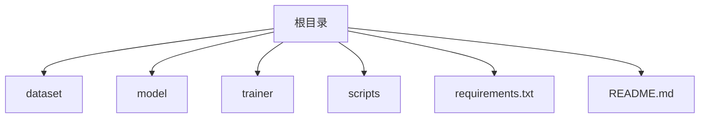
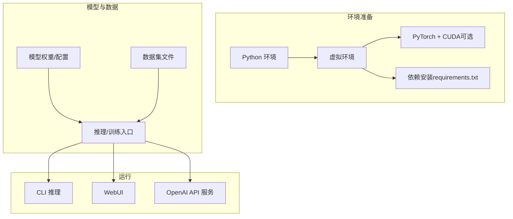
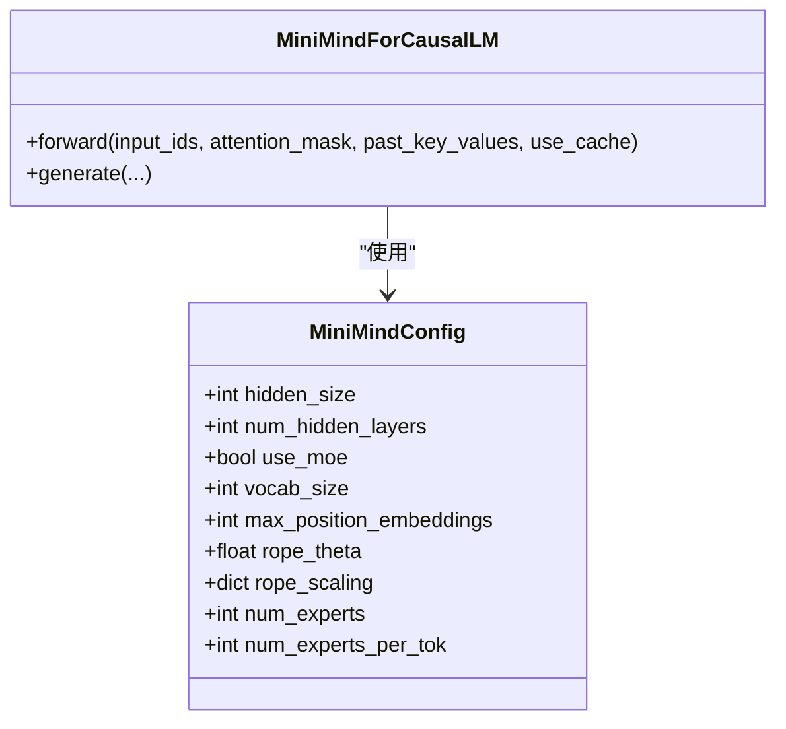
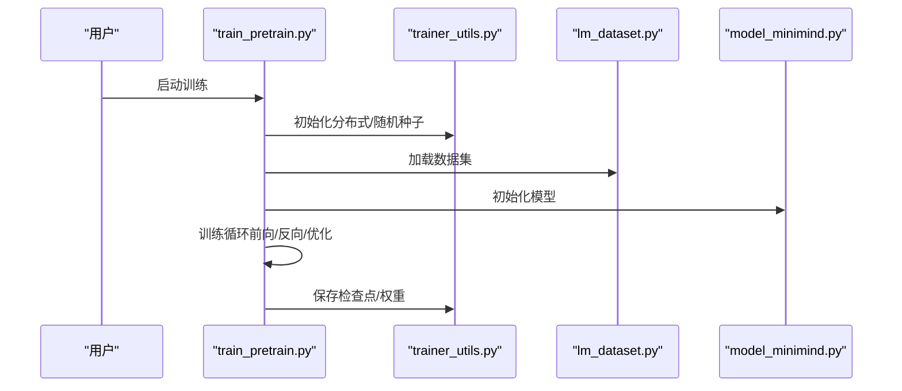
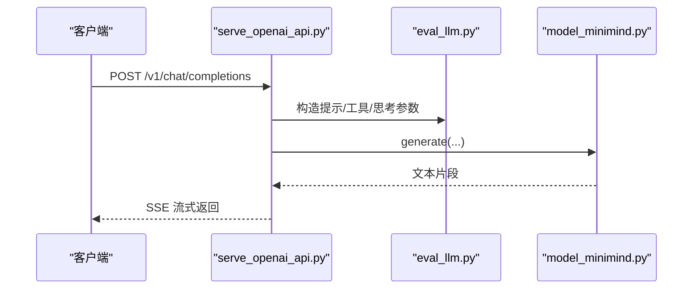
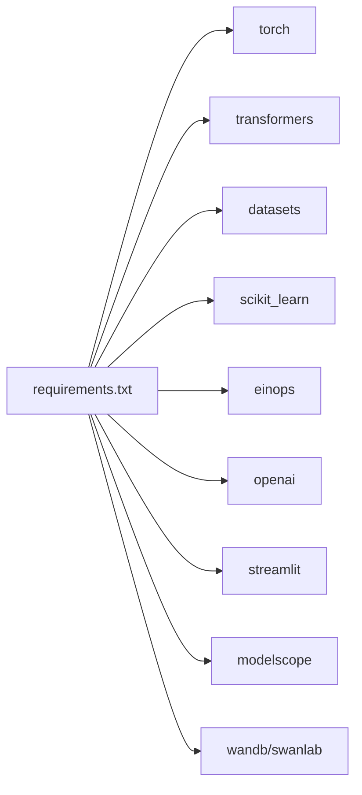

# 安装与环境问题

<cite>
**本文引用的文件**
- [README.md](file://README.md)
- [README_en.md](file://README_en.md)
- [requirements.txt](file://requirements.txt)
- [eval_llm.py](file://eval_llm.py)
- [model/model_minimind.py](file://model/model_minimind.py)
- [trainer/train_pretrain.py](file://trainer/train_pretrain.py)
- [trainer/train_full_sft.py](file://trainer/train_full_sft.py)
- [trainer/trainer_utils.py](file://trainer/trainer_utils.py)
- [dataset/lm_dataset.py](file://dataset/lm_dataset.py)
- [scripts/web_demo.py](file://scripts/web_demo.py)
- [scripts/serve_openai_api.py](file://scripts/serve_openai_api.py)
</cite>

## 目录
1. [引言](#引言)
2. [项目结构](#项目结构)
3. [核心组件](#核心组件)
4. [架构总览](#架构总览)
5. [详细组件分析](#详细组件分析)
6. [依赖关系分析](#依赖关系分析)
7. [性能考量](#性能考量)
8. [故障排除指南](#故障排除指南)
9. [结论](#结论)
10. [附录](#附录)

## 引言
本文件聚焦 MiniMind 项目的安装与环境配置问题，提供系统化的故障排除指南。内容涵盖：
- Python 版本与依赖兼容性
- PyTorch 与 CUDA 安装与版本匹配
- 不同操作系统（Windows、Linux、macOS）的安装要点
- 依赖安装顺序与版本要求
- 虚拟环境最佳实践
- 权限与网络代理配置
- 硬件要求验证与 GPU/CPU 选择建议

## 项目结构
MiniMind 采用模块化组织，核心目录与职责如下：
- dataset：数据集加载与预处理
- model：模型定义与推理
- trainer：训练脚本与工具
- scripts：推理与服务脚本（CLI/Web/OpenAI API）
- 根目录：安装与使用说明、依赖清单

**图表来源**
- [README.md](file://README.md)
- [requirements.txt](file://requirements.txt)

**章节来源**
- [README.md](file://README.md)
- [requirements.txt](file://requirements.txt)

## 核心组件
- 模型定义与推理：模型配置、注意力与前馈实现、推理生成逻辑
- 训练流水线：预训练、监督微调等训练脚本
- 数据集：预训练与 SFT 数据集加载与标签构造
- 推理与服务：CLI 推理、Streamlit WebUI、OpenAI 兼容 API 服务

**章节来源**
- [model/model_minimind.py](file://model/model_minimind.py)
- [trainer/train_pretrain.py](file://trainer/train_pretrain.py)
- [trainer/train_full_sft.py](file://trainer/train_full_sft.py)
- [dataset/lm_dataset.py](file://dataset/lm_dataset.py)
- [eval_llm.py](file://eval_llm.py)
- [scripts/web_demo.py](file://scripts/web_demo.py)
- [scripts/serve_openai_api.py](file://scripts/serve_openai_api.py)

## 架构总览
MiniMind 的安装与运行涉及以下关键环节：
- Python 环境与虚拟环境
- PyTorch 与 CUDA（可选）
- 依赖安装（requirements.txt）
- 模型与数据准备
- 推理与训练执行

[本图为概念性架构示意，不直接映射具体源码文件]

## 详细组件分析

### 模型与推理组件
- 模型配置与结构：定义注意力头数、隐藏维度、RoPE 参数、MoE 配置等
- 推理生成：支持温度、top-p、最大生成长度、思考标签与工具调用
- 设备选择：优先使用 CUDA，否则回退到 CPU

**图表来源**
- [model/model_minimind.py](file://model/model_minimind.py)

**章节来源**
- [model/model_minimind.py](file://model/model_minimind.py)
- [eval_llm.py](file://eval_llm.py)

### 训练组件
- 训练脚本：预训练与 SFT，支持分布式训练、混合精度、断点续训
- 数据集：预训练与 SFT 数据集加载、标签构造
- 工具函数：分布式初始化、LR 调度、检查点保存与恢复

**图表来源**
- [trainer/train_pretrain.py](file://trainer/train_pretrain.py)
- [trainer/trainer_utils.py](file://trainer/trainer_utils.py)
- [dataset/lm_dataset.py](file://dataset/lm_dataset.py)
- [model/model_minimind.py](file://model/model_minimind.py)

**章节来源**
- [trainer/train_pretrain.py](file://trainer/train_pretrain.py)
- [trainer/train_full_sft.py](file://trainer/train_full_sft.py)
- [trainer/trainer_utils.py](file://trainer/trainer_utils.py)
- [dataset/lm_dataset.py](file://dataset/lm_dataset.py)

### 推理与服务组件
- CLI 推理：支持 Transformers 格式与原生 PyTorch 权重
- WebUI：Streamlit 应用，支持思考标签与工具调用
- OpenAI 兼容 API：FastAPI 服务，支持流式响应

**图表来源**
- [scripts/serve_openai_api.py](file://scripts/serve_openai_api.py)
- [eval_llm.py](file://eval_llm.py)
- [model/model_minimind.py](file://model/model_minimind.py)

**章节来源**
- [scripts/web_demo.py](file://scripts/web_demo.py)
- [scripts/serve_openai_api.py](file://scripts/serve_openai_api.py)
- [eval_llm.py](file://eval_llm.py)

## 依赖关系分析
- 依赖清单：requirements.txt 明确列出各组件版本
- 关键依赖：PyTorch（未锁定版本）、transformers、datasets、trl、peft（注释）、wandb/swanlab、streamlit、modelscope 等
- 训练与推理的共同依赖：torch、transformers、datasets、numpy、einops、scikit_learn、openai、flask 等

**图表来源**
- [requirements.txt](file://requirements.txt)

**章节来源**
- [requirements.txt](file://requirements.txt)

## 性能考量
- 混合精度：训练脚本支持 bfloat16/float16，提升吞吐与显存利用率
- 分布式训练：支持 DDP，可扩展至多卡
- 推理优化：支持 KV 缓存、生成参数调节（温度、top-p、最大长度）

[本节为通用指导，不直接分析具体文件]

## 故障排除指南

### 一、Python 版本不兼容
- 现象
  - 安装依赖时报错，或运行时报错找不到模块
  - Streamlit 报错（需 Python>=3.10）
- 排查与解决
  - 确认 Python 版本满足要求（README 与 WebUI 要求）
  - 使用虚拟环境隔离项目依赖
  - 若系统自带多个 Python 版本，明确使用目标版本创建与激活虚拟环境
- 参考
  - README 快速开始与依赖安装命令
  - WebUI 对 Python 版本的要求

**章节来源**
- [README.md](file://README.md)
- [scripts/web_demo.py](file://scripts/web_demo.py)

### 二、PyTorch 安装失败或 CUDA 版本冲突
- 现象
  - pip 安装 torch 失败或安装后 import torch 报错
  - CUDA/cuDNN 版本与 PyTorch 不匹配导致 import torch.cuda 失败
- 排查与解决
  - 使用官方推荐的安装源（如清华镜像）加速安装
  - 根据 CUDA 版本选择对应 PyTorch whl（参考 README 的 PyTorch 安装链接）
  - 验证 CUDA 可用性：在 Python 中执行 torch.cuda.is_available()
  - 若无 GPU 或 CUDA 不可用，程序仍可使用 CPU/MPS 运行，但速度与兼容性差异较大
- 参考
  - README 的 PyTorch 安装与验证说明

**章节来源**
- [README.md](file://README.md)
- [README_en.md](file://README_en.md)
- [trainer/train_pretrain.py](file://trainer/train_pretrain.py)

### 三、依赖安装顺序与版本冲突
- 现象
  - 安装顺序不当导致部分依赖安装失败
  - 版本冲突引发运行时异常
- 排查与解决
  - 严格按 requirements.txt 安装，避免手动升级/降级
  - 若需替换可视化工具，将 wandb 替换为 swanlab（项目已内置兼容）
  - 若安装缓慢，使用国内镜像源（README 示例中已提供镜像源）
- 参考
  - requirements.txt 中各组件版本
  - 训练脚本中对 swanlab/wandb 的使用

**章节来源**
- [requirements.txt](file://requirements.txt)
- [trainer/train_pretrain.py](file://trainer/train_pretrain.py)
- [trainer/train_full_sft.py](file://trainer/train_full_sft.py)

### 四、虚拟环境创建与管理
- 最佳实践
  - 使用 venv 或 conda 创建隔离环境
  - 在虚拟环境中安装依赖，避免污染系统 Python
  - 激活环境后再执行安装与运行命令
- 参考
  - README 快速开始中的安装命令

**章节来源**
- [README.md](file://README.md)

### 五、权限与网络代理配置
- 权限问题
  - Windows/macOS/Linux 上 pip 安装可能需要管理员权限或使用用户级安装
  - Linux 上建议使用虚拟环境避免权限问题
- 网络代理
  - 使用国内镜像源（如阿里云镜像）提高安装速度
  - 若需代理，配置 pip 的代理参数
- 参考
  - README 中的安装命令示例

**章节来源**
- [README.md](file://README.md)

### 六、操作系统差异与注意事项
- Windows
  - 注意路径分隔符与环境变量设置
  - CUDA 安装与驱动版本需与 PyTorch 匹配
- Linux
  - 建议使用发行版自带包管理器安装基础依赖
  - 注意 CUDA 驱动与容器环境（如 Docker）的兼容性
- macOS
  - 若无 M1/M2 芯片，PyTorch 可能默认走 CPU；如需 MPS，需使用支持的 PyTorch 版本
- 参考
  - README 的系统与 CUDA 版本示例

**章节来源**
- [README.md](file://README.md)

### 七、硬件要求验证与 GPU/CPU 选择
- 验证 GPU 可用性
  - 在 Python 中执行 torch.cuda.is_available() 检查
- GPU/CPU 选择建议
  - 有 GPU 且 CUDA 可用时优先使用 CUDA，速度与稳定性更佳
  - 无 GPU 或 CUDA 不可用时可使用 CPU/MPS，但速度差异较大
- 参考
  - README 的 PyTorch 可用性检查说明

**章节来源**
- [README.md](file://README.md)
- [trainer/train_pretrain.py](file://trainer/train_pretrain.py)

### 八、常见安装错误与定位方法
- 依赖缺失
  - 现象：import 某模块报错
  - 方法：核对 requirements.txt 是否完整安装
- 版本不匹配
  - 现象：运行时报错或警告
  - 方法：锁定版本，避免手动升级
- CUDA 冲突
  - 现象：import torch 后无法使用 CUDA
  - 方法：核对 CUDA 版本与 PyTorch 对应关系，必要时重装 PyTorch
- WebUI 启动失败
  - 现象：Streamlit 报错或找不到模型
  - 方法：确认已将 Transformers 格式模型复制到 scripts 目录并满足版本要求

**章节来源**
- [requirements.txt](file://requirements.txt)
- [scripts/web_demo.py](file://scripts/web_demo.py)
- [README.md](file://README.md)

## 结论
通过遵循本指南，可有效规避 MiniMind 项目在安装与环境配置阶段的常见问题。建议优先满足 Python 与 PyTorch 版本要求，使用虚拟环境隔离依赖，结合 requirements.txt 严格安装，并在遇到问题时依据本指南的定位方法逐一排查。

## 附录

### A. 依赖安装顺序与版本要求
- 依赖清单与版本：参见 requirements.txt
- 安装顺序建议：先安装 PyTorch（匹配 CUDA），再安装其他依赖
- 可视化工具：默认使用 SwanLab（兼容 WandB），可按需切换

**章节来源**
- [requirements.txt](file://requirements.txt)
- [trainer/train_pretrain.py](file://trainer/train_pretrain.py)
- [trainer/train_full_sft.py](file://trainer/train_full_sft.py)

### B. 推理与训练入口参数要点
- CLI 推理：支持 Transformers 格式与原生 PyTorch 权重
- WebUI：需将模型复制到 scripts 目录，满足文件结构要求
- OpenAI API：支持流式响应与工具调用

**章节来源**
- [eval_llm.py](file://eval_llm.py)
- [scripts/web_demo.py](file://scripts/web_demo.py)
- [scripts/serve_openai_api.py](file://scripts/serve_openai_api.py)