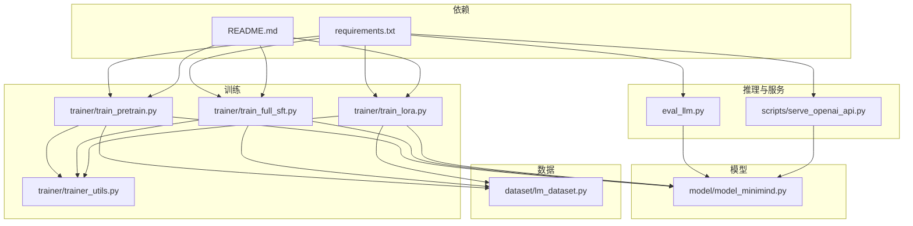
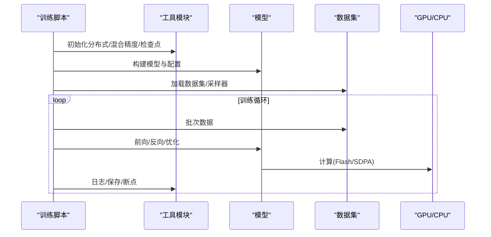
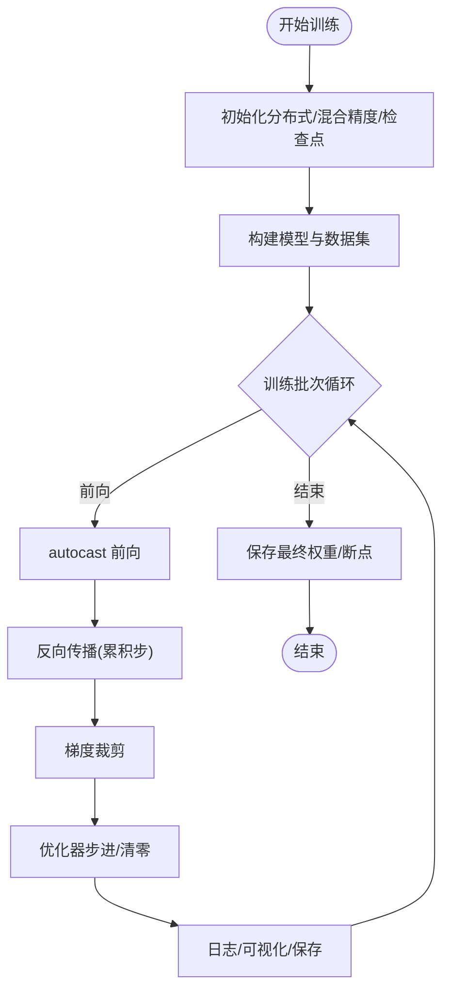
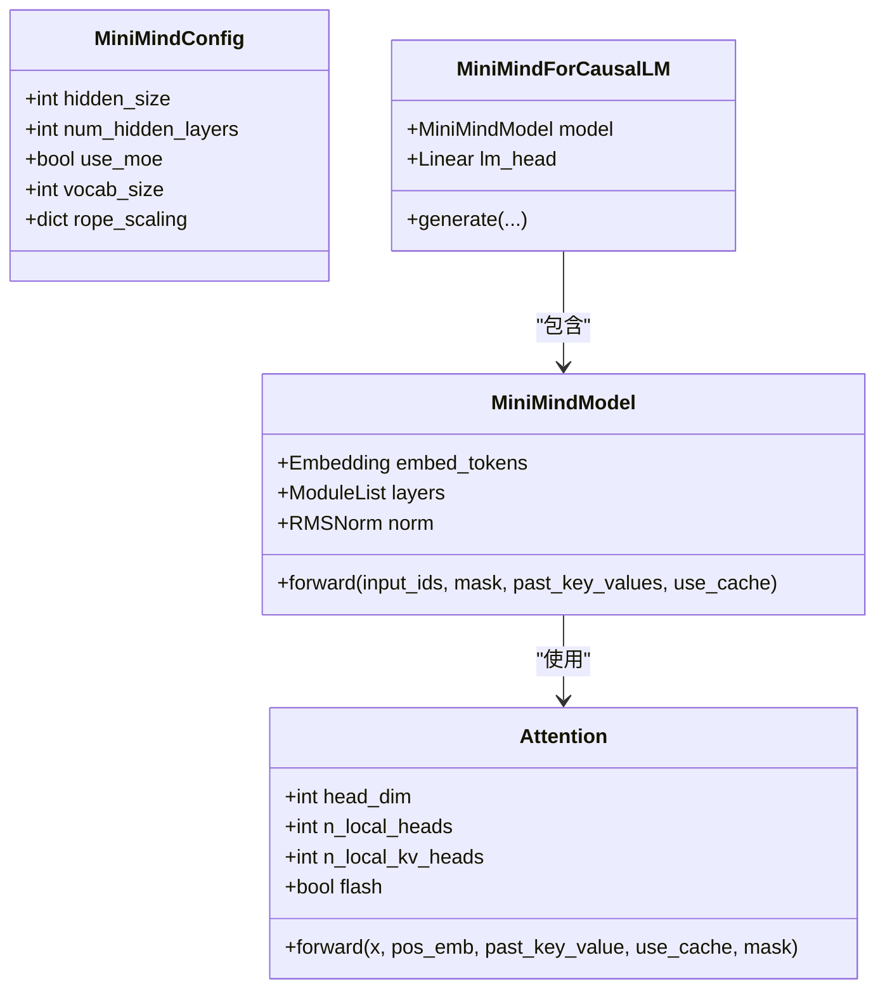
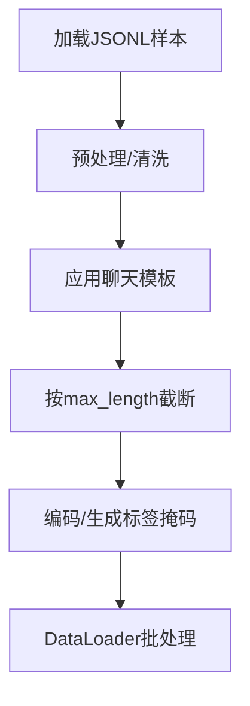
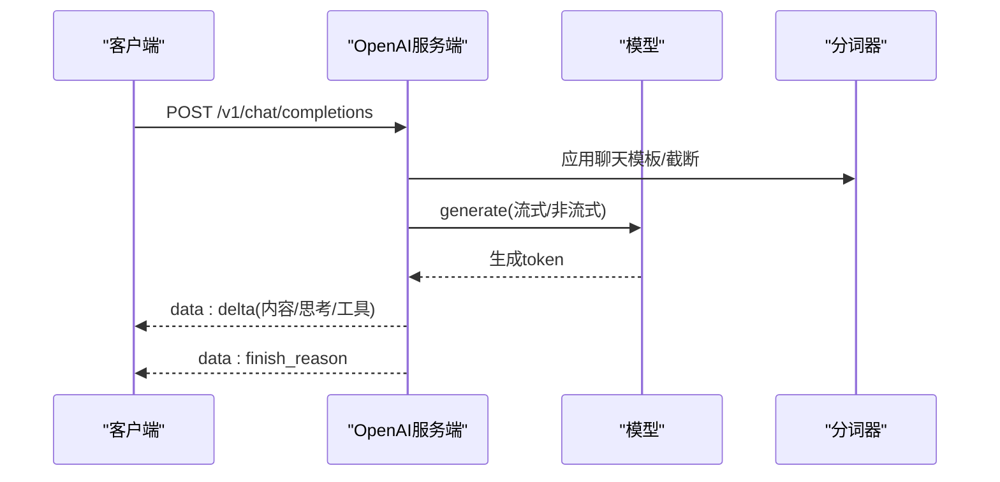
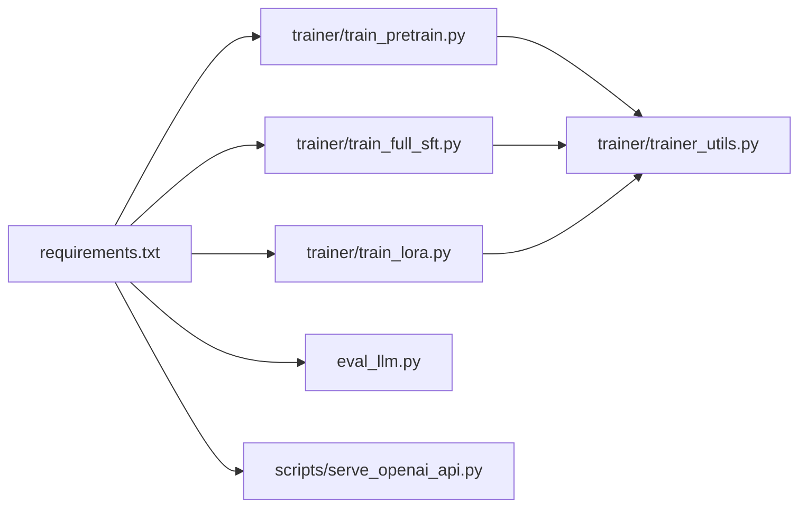

# 性能与资源问题

<cite>
**本文引用的文件**
- [README.md](file://README.md)
- [requirements.txt](file://requirements.txt)
- [model/model_minimind.py](file://model/model_minimind.py)
- [trainer/train_pretrain.py](file://trainer/train_pretrain.py)
- [trainer/train_full_sft.py](file://trainer/train_full_sft.py)
- [trainer/train_lora.py](file://trainer/train_lora.py)
- [trainer/trainer_utils.py](file://trainer/trainer_utils.py)
- [dataset/lm_dataset.py](file://dataset/lm_dataset.py)
- [eval_llm.py](file://eval_llm.py)
- [scripts/serve_openai_api.py](file://scripts/serve_openai_api.py)
</cite>

## 目录
1. [引言](#引言)
2. [项目结构](#项目结构)
3. [核心组件](#核心组件)
4. [架构总览](#架构总览)
5. [详细组件分析](#详细组件分析)
6. [依赖分析](#依赖分析)
7. [性能注意事项](#性能注意事项)
8. [故障排除指南](#故障排除指南)
9. [结论](#结论)
10. [附录](#附录)

## 引言
本文件聚焦 MiniMind 在训练与推理过程中的性能与资源管理问题，围绕 GPU 显存不足、CPU 使用率过高、磁盘空间不足等资源限制，提供系统化的诊断与优化策略。内容涵盖：
- 训练与推理的性能监控方法（内存使用、计算效率、瓶颈识别）
- 针对不同硬件配置的优化策略（batch size、混合精度、梯度累积、编译加速）
- 高级优化（长序列处理、批量推理、缓存与流式输出）
- 基准测试与对比分析方法

## 项目结构
MiniMind 采用清晰的功能模块划分：模型定义、训练脚本、数据集、推理与服务端、评估脚本与依赖声明。训练脚本统一通过工具模块初始化分布式、混合精度、断点续训与日志记录。

**图表来源**
- [model/model_minimind.py:1-280](file://model/model_minimind.py#L1-L280)
- [trainer/train_pretrain.py:1-170](file://trainer/train_pretrain.py#L1-L170)
- [trainer/train_full_sft.py:1-171](file://trainer/train_full_sft.py#L1-L171)
- [trainer/train_lora.py:1-184](file://trainer/train_lora.py#L1-L184)
- [trainer/trainer_utils.py:1-177](file://trainer/trainer_utils.py#L1-L177)
- [dataset/lm_dataset.py:1-256](file://dataset/lm_dataset.py#L1-L256)
- [eval_llm.py:1-94](file://eval_llm.py#L1-L94)
- [scripts/serve_openai_api.py:1-246](file://scripts/serve_openai_api.py#L1-L246)
- [requirements.txt:1-32](file://requirements.txt#L1-L32)
- [README.md:1-120](file://README.md#L1-L120)

**章节来源**
- [README.md:1-120](file://README.md#L1-L120)
- [requirements.txt:1-32](file://requirements.txt#L1-L32)

## 核心组件
- 模型与注意力实现：MiniMindConfig、Attention、RMSNorm、FFN/MoE 前馈、生成接口等，支持 Flash Attention 与 YaRN 外推。
- 训练脚本：预训练、SFT、LoRA，统一使用混合精度、梯度累积、断点续训、分布式训练与可视化。
- 数据集：SFT/Pretrain/DPO/RLAIF 等数据集封装，支持截断与标签生成。
- 推理与服务：CLI 推理与 OpenAI 兼容服务端，支持流式输出、思考与工具调用解析。
- 工具模块：分布式初始化、LR 调度、检查点、参数统计、采样器等。

**章节来源**
- [model/model_minimind.py:1-280](file://model/model_minimind.py#L1-L280)
- [trainer/train_pretrain.py:1-170](file://trainer/train_pretrain.py#L1-L170)
- [trainer/train_full_sft.py:1-171](file://trainer/train_full_sft.py#L1-L171)
- [trainer/train_lora.py:1-184](file://trainer/train_lora.py#L1-L184)
- [trainer/trainer_utils.py:1-177](file://trainer/trainer_utils.py#L1-L177)
- [dataset/lm_dataset.py:1-256](file://dataset/lm_dataset.py#L1-L256)
- [eval_llm.py:1-94](file://eval_llm.py#L1-L94)
- [scripts/serve_openai_api.py:1-246](file://scripts/serve_openai_api.py#L1-L246)

## 架构总览
MiniMind 的训练与推理路径遵循“脚本 → 工具模块 → 模型 → 数据集”的分层设计。训练脚本通过工具模块完成分布式、混合精度、断点续训与日志；模型实现注意力与前馈结构，支持 Flash Attention 与 YaRN；推理脚本与服务端提供流式生成与工具/思考解析。

**图表来源**
- [trainer/train_full_sft.py:108-171](file://trainer/train_full_sft.py#L108-L171)
- [trainer/trainer_utils.py:44-131](file://trainer/trainer_utils.py#L44-L131)
- [model/model_minimind.py:90-133](file://model/model_minimind.py#L90-L133)
- [dataset/lm_dataset.py:58-119](file://dataset/lm_dataset.py#L58-L119)

## 详细组件分析

### 训练脚本与混合精度、梯度累积
- 预训练与 SFT：统一使用混合精度（bfloat16/fp16），GradScaler 控制数值稳定；支持梯度累积以降低显存占用；断点续训保存完整状态。
- LoRA：仅训练 LoRA 参数，冻结主干权重，显著降低显存与计算；脚本内明确提示 torch.compile 与 LoRA 的兼容性限制。

**图表来源**
- [trainer/train_full_sft.py:23-81](file://trainer/train_full_sft.py#L23-L81)
- [trainer/train_pretrain.py:23-80](file://trainer/train_pretrain.py#L23-L80)
- [trainer/train_lora.py:24-76](file://trainer/train_lora.py#L24-L76)

**章节来源**
- [trainer/train_pretrain.py:82-170](file://trainer/train_pretrain.py#L82-L170)
- [trainer/train_full_sft.py:83-171](file://trainer/train_full_sft.py#L83-L171)
- [trainer/train_lora.py:77-184](file://trainer/train_lora.py#L77-L184)

### 模型与注意力实现（显存与吞吐权衡）
- Attention 支持 Flash Attention（scaled_dot_product_attention）在满足条件时自动启用，否则回退到常规注意力；支持 KV 重用与 past_key_values 缓存。
- YaRN 位置编码外推，可在推理时扩展上下文长度；RoPE 缩放参数可配置。
- RMSNorm 与 SwiGLU 激活，MoE 前馈层按专家路由，训练时引入辅助 router loss。

**图表来源**
- [model/model_minimind.py:10-45](file://model/model_minimind.py#L10-L45)
- [model/model_minimind.py:90-133](file://model/model_minimind.py#L90-L133)
- [model/model_minimind.py:195-227](file://model/model_minimind.py#L195-L227)
- [model/model_minimind.py:229-280](file://model/model_minimind.py#L229-L280)

**章节来源**
- [model/model_minimind.py:61-83](file://model/model_minimind.py#L61-L83)
- [model/model_minimind.py:90-133](file://model/model_minimind.py#L90-L133)
- [model/model_minimind.py:195-227](file://model/model_minimind.py#L195-L227)

### 数据集与批处理（截断与标签生成）
- SFTDataset：应用聊天模板，生成标签掩码，支持工具调用与思考标签；按 max_length 截断与填充。
- PretrainDataset：文本到下一个 token 的预测任务，添加 bos/eos 并忽略 pad 标签。
- DPO/RLAIF/AgentRL：针对偏好学习与强化学习的数据格式封装。

**图表来源**
- [dataset/lm_dataset.py:58-119](file://dataset/lm_dataset.py#L58-L119)
- [dataset/lm_dataset.py:37-55](file://dataset/lm_dataset.py#L37-L55)
- [dataset/lm_dataset.py:122-192](file://dataset/lm_dataset.py#L122-L192)

**章节来源**
- [dataset/lm_dataset.py:58-119](file://dataset/lm_dataset.py#L58-L119)
- [dataset/lm_dataset.py:195-252](file://dataset/lm_dataset.py#L195-L252)

### 推理与服务端（流式输出与工具/思考解析）
- CLI 推理：支持温度、top_p、最大生成长度、历史对话长度、显示生成速度。
- OpenAI 兼容服务：支持流式 SSE 输出，解析思考与工具调用片段，按 delta 返回。

**图表来源**
- [scripts/serve_openai_api.py:105-166](file://scripts/serve_openai_api.py#L105-L166)
- [eval_llm.py:82-91](file://eval_llm.py#L82-L91)

**章节来源**
- [eval_llm.py:32-94](file://eval_llm.py#L32-L94)
- [scripts/serve_openai_api.py:1-246](file://scripts/serve_openai_api.py#L1-L246)

## 依赖分析
- 训练与推理均依赖 PyTorch、Transformers、Datasets 等；可视化默认使用 SwanLab（兼容 WandB）。
- 训练脚本统一通过工具模块完成分布式初始化、混合精度、断点续训与日志记录。

**图表来源**
- [requirements.txt:1-32](file://requirements.txt#L1-L32)
- [trainer/train_pretrain.py:1-20](file://trainer/train_pretrain.py#L1-L20)
- [trainer/train_full_sft.py:1-20](file://trainer/train_full_sft.py#L1-L20)
- [trainer/train_lora.py:1-21](file://trainer/train_lora.py#L1-L21)
- [trainer/trainer_utils.py:1-17](file://trainer/trainer_utils.py#L1-L17)
- [eval_llm.py:1-10](file://eval_llm.py#L1-L10)
- [scripts/serve_openai_api.py:1-23](file://scripts/serve_openai_api.py#L1-L23)

**章节来源**
- [requirements.txt:1-32](file://requirements.txt#L1-L32)
- [trainer/trainer_utils.py:1-17](file://trainer/trainer_utils.py#L1-L17)

## 性能注意事项
- 混合精度与梯度累积
  - 预训练/SFT 默认使用 bfloat16；LoRA 使用 bfloat16/fp16 由 dtype 控制；GradScaler 提升数值稳定性。
  - 通过增大 accumulation_steps 减少每步显存占用，但会增加总步数与通信开销。
- Flash Attention 与注意力掩码
  - Attention 在满足条件时使用 scaled_dot_product_attention；注意 causal 与 mask 的一致性，避免不必要的回退。
- 分布式与编译
  - DDP 训练时忽略静态缓冲（freqs_cos/freqs_sin）；torch.compile 可加速，但与 LoRA 的 monkey-patch 不兼容。
- 数据加载与批处理
  - DataLoader 使用 pin_memory；SkipBatchSampler 支持断点续训跳过已完成批次。
- 推理缓存与流式输出
  - 使用 use_cache 与 past_key_values 缓存 KV；服务端按 delta 流式返回，降低首 token 延迟。

**章节来源**
- [trainer/train_pretrain.py:118-121](file://trainer/train_pretrain.py#L118-L121)
- [trainer/train_full_sft.py:119-122](file://trainer/train_full_sft.py#L119-L122)
- [trainer/train_lora.py:163-166](file://trainer/train_lora.py#L163-L166)
- [model/model_minimind.py:108-133](file://model/model_minimind.py#L108-L133)
- [trainer/trainer_utils.py:134-157](file://trainer/trainer_utils.py#L134-L157)
- [scripts/serve_openai_api.py:113-166](file://scripts/serve_openai_api.py#L113-L166)

## 故障排除指南

### GPU 显存不足
- 降低 batch size 或增大 accumulation_steps，以降低每步显存峰值。
- 使用 bfloat16（预训练/SFT 默认）或 fp16（LoRA），并确保 GradScaler 正常工作。
- 关闭 torch.compile 或在 LoRA 场景禁用编译（与 monkey-patch 不兼容）。
- 减少 max_seq_len，避免过长序列导致 OOM。
- 在推理时启用 use_cache 与 past_key_values，减少重复计算。
- 断点续训：检查 checkpoints 目录，确认 resume 文件存在且 world_size 与当前一致。

**章节来源**
- [trainer/train_pretrain.py:87-98](file://trainer/train_pretrain.py#L87-L98)
- [trainer/train_full_sft.py:88-99](file://trainer/train_full_sft.py#L88-L99)
- [trainer/train_lora.py:82-93](file://trainer/train_lora.py#L82-L93)
- [model/model_minimind.py:108-133](file://model/model_minimind.py#L108-L133)
- [trainer/trainer_utils.py:63-116](file://trainer/trainer_utils.py#L63-L116)

### CPU 使用率过高
- 降低 DataLoader 的 num_workers 或关闭 pin_memory，减少 CPU 与 GPU 间搬运压力。
- 减少日志频率（log_interval），避免频繁 I/O。
- 在非 CUDA 环境使用 CPU/MPS，但注意训练速度与兼容性差异。

**章节来源**
- [trainer/train_full_sft.py:92-92](file://trainer/train_full_sft.py#L92-L92)
- [trainer/train_pretrain.py:91-91](file://trainer/train_pretrain.py#L91-L91)

### 磁盘空间不足
- 合理设置 save_interval，避免频繁保存中间权重。
- 使用断点续训，仅保存 resume 文件，必要时清理 out 目录中临时文件。
- 检查数据集文件大小与 max_seq_len，避免过大 JSONL 导致磁盘压力。

**章节来源**
- [trainer/train_full_sft.py:96-96](file://trainer/train_full_sft.py#L96-L96)
- [trainer/trainer_utils.py:63-105](file://trainer/trainer_utils.py#L63-L105)
- [README.md:497-536](file://README.md#L497-L536)

### 长序列处理与上下文扩展
- YaRN 推理外推：在推理时启用 inference_rope_scaling，扩展有效上下文长度。
- 注意：YaRN 主要解决位置编码外推问题，不代表模型内在长程记忆能力无限增长。

**章节来源**
- [model/model_minimind.py:31-38](file://model/model_minimind.py#L31-L38)
- [eval_llm.py:41-41](file://eval_llm.py#L41-L41)
- [scripts/serve_openai_api.py:36-38](file://scripts/serve_openai_api.py#L36-L38)

### 批量推理优化
- 使用 use_cache 与 past_key_values，结合批量输入，减少重复 KV 计算。
- 服务端按 delta 流式输出，降低首 token 延迟并改善用户体验。

**章节来源**
- [model/model_minimind.py:249-280](file://model/model_minimind.py#L249-L280)
- [scripts/serve_openai_api.py:113-166](file://scripts/serve_openai_api.py#L113-L166)

### 缓存策略
- 推理时启用 use_cache，配合 past_key_values 缓存，显著降低重复计算。
- 训练时注意 KV 缓存与注意力掩码的兼容性，避免错误的因果掩码。

**章节来源**
- [model/model_minimind.py:119-122](file://model/model_minimind.py#L119-L122)
- [model/model_minimind.py:124-130](file://model/model_minimind.py#L124-L130)

### 性能监控与瓶颈识别
- 训练日志：loss、logits_loss、aux_loss、学习率、epoch_time，结合可视化工具记录。
- 推理速度：通过生成 token 数与耗时计算 tokens/s，定位吞吐瓶颈。
- 分布式同步：注意 DDP 中的 all_reduce 与 early stop，避免死锁与卡顿。

**章节来源**
- [trainer/train_full_sft.py:50-58](file://trainer/train_full_sft.py#L50-L58)
- [trainer/train_pretrain.py:50-58](file://trainer/train_pretrain.py#L50-L58)
- [eval_llm.py:81-91](file://eval_llm.py#L81-L91)
- [trainer/train_ppo.py:190-196](file://trainer/train_ppo.py#L190-L196)

### 不同硬件配置下的优化策略
- 单卡/多卡：使用 torchrun 启动多卡训练；DDP 忽略静态缓冲；跨 GPU 数量恢复时自动转换 step。
- batch size 调整：结合显存与吞吐，逐步扩大 batch 以提升利用率。
- 混合精度：bfloat16 优先，fp16 用于 LoRA；GradScaler 保持数值稳定。
- 梯度累积：在显存受限时提高累积步数，平衡步数与通信成本。
- 编译加速：torch.compile 可提升吞吐，但与 LoRA monkey-patch 不兼容。

**章节来源**
- [trainer/train_full_sft.py:106-106](file://trainer/train_full_sft.py#L106-L106)
- [trainer/trainer_utils.py:44-51](file://trainer/trainer_utils.py#L44-L51)
- [trainer/train_lora.py:163-166](file://trainer/train_lora.py#L163-L166)

### 基准测试与对比分析
- 训练基准：记录每个阶段的 epoch_time、loss 曲线与保存间隔，对比不同 batch size、dtype、accumulation_steps 的吞吐与显存占用。
- 推理基准：在相同 prompt 与 max_new_tokens 下测量 tokens/s，对比 use_cache 与流式输出的延迟与吞吐。
- 可视化：使用 SwanLab（兼容 WandB）记录指标，便于跨实验对比。

**章节来源**
- [trainer/train_full_sft.py:125-131](file://trainer/train_full_sft.py#L125-L131)
- [trainer/train_pretrain.py:124-130](file://trainer/train_pretrain.py#L124-L130)
- [eval_llm.py:81-91](file://eval_llm.py#L81-L91)

## 结论
MiniMind 在训练与推理层面提供了完善的性能优化工具链：混合精度、梯度累积、断点续训、分布式训练与编译加速；在模型侧支持 Flash Attention 与 YaRN 外推；在服务端提供流式输出与工具/思考解析。针对资源限制问题，建议从 batch size、dtype、累积步数、KV 缓存与序列长度入手，结合日志与可视化进行系统性优化与基准对比。

## 附录
- 数据集大小与推荐 max_seq_len 参考见 README 的数据集说明。
- 训练开销与成本估算可用于快速感知硬件门槛。

**章节来源**
- [README.md:497-536](file://README.md#L497-L536)
- [README.md:618-647](file://README.md#L618-L647)