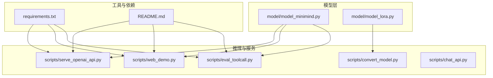
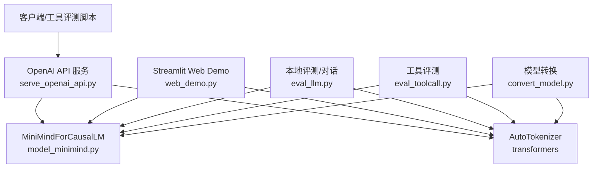
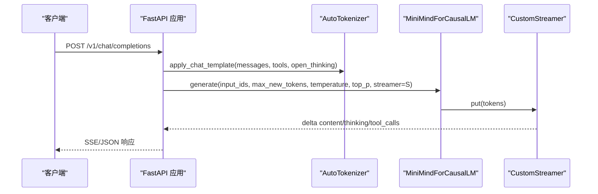
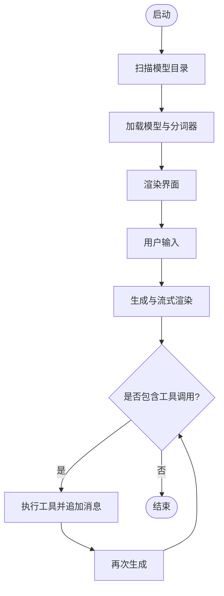
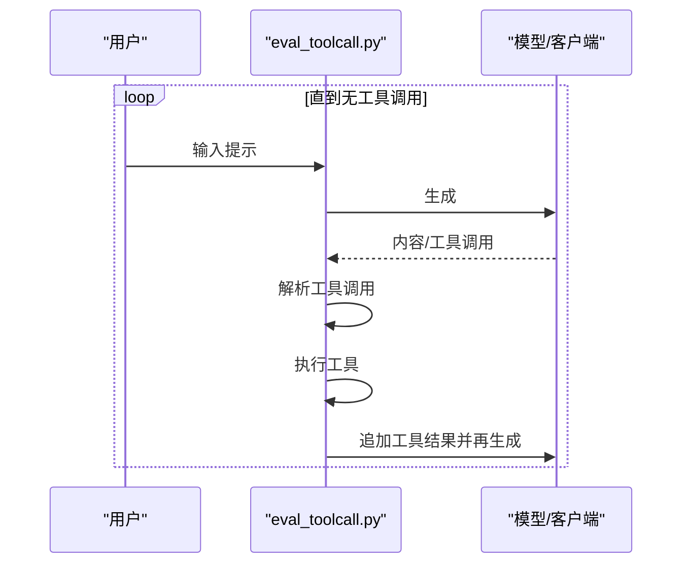
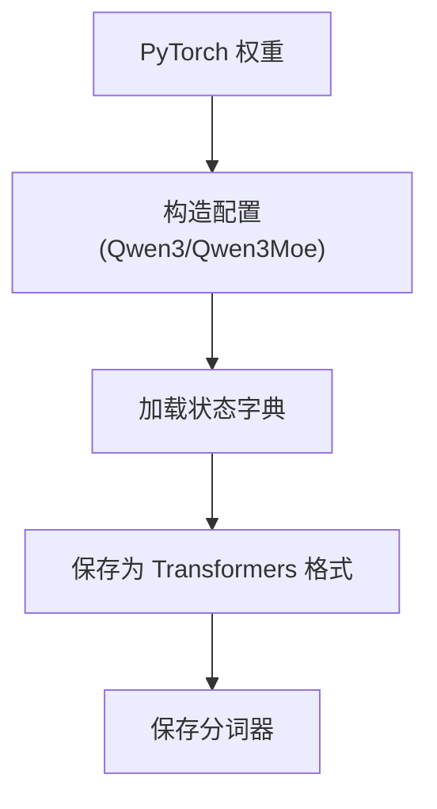
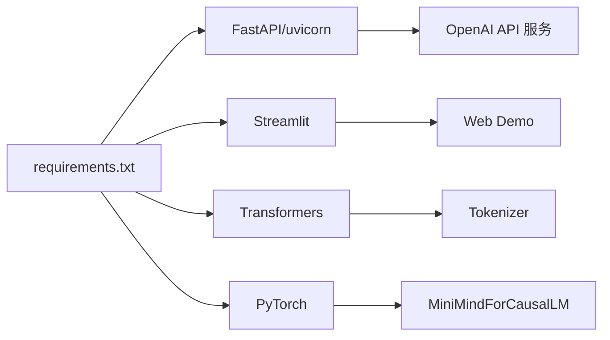

# 推理与服务问题

<cite>
**本文引用的文件**
- [README.md](file://README.md)
- [requirements.txt](file://requirements.txt)
- [model/model_minimind.py](file://model/model_minimind.py)
- [model/model_lora.py](file://model/model_lora.py)
- [eval_llm.py](file://eval_llm.py)
- [scripts/serve_openai_api.py](file://scripts/serve_openai_api.py)
- [scripts/web_demo.py](file://scripts/web_demo.py)
- [scripts/eval_toolcall.py](file://scripts/eval_toolcall.py)
- [scripts/convert_model.py](file://scripts/convert_model.py)
- [scripts/chat_api.py](file://scripts/chat_api.py)
</cite>

## 目录
1. [简介](#简介)
2. [项目结构](#项目结构)
3. [核心组件](#核心组件)
4. [架构总览](#架构总览)
5. [详细组件分析](#详细组件分析)
6. [依赖关系分析](#依赖关系分析)
7. [性能考量](#性能考量)
8. [故障排除指南](#故障排除指南)
9. [结论](#结论)
10. [附录](#附录)

## 简介
本文件聚焦 MiniMind 的推理与推理服务相关问题的系统化故障排除指南，覆盖以下方面：
- 模型加载失败、权重文件缺失、推理结果异常的诊断与修复
- OpenAI API 服务启动失败、端口占用、请求处理错误的定位与解决
- Web 界面无法访问、界面显示异常、工具调用失败的排查
- 不同推理引擎（Transformers、llama.cpp、vLLM、Ollama）的集成与兼容性处理
- 性能优化建议与资源使用监控方法

## 项目结构
MiniMind 采用“模型实现 + 推理脚本 + 服务与Web界面 + 训练与评估工具”的分层组织：
- model：模型定义与LoRA实现
- scripts：推理服务、Web演示、工具评测、模型转换等
- trainer：训练脚本（与推理问题关联较少）
- dataset：数据集（与推理问题关联较少）

图表来源
- [model/model_minimind.py](file://model/model_minimind.py)
- [model/model_lora.py](file://model/model_lora.py)
- [scripts/serve_openai_api.py](file://scripts/serve_openai_api.py)
- [scripts/web_demo.py](file://scripts/web_demo.py)
- [scripts/eval_toolcall.py](file://scripts/eval_toolcall.py)
- [scripts/convert_model.py](file://scripts/convert_model.py)
- [scripts/chat_api.py](file://scripts/chat_api.py)
- [requirements.txt](file://requirements.txt)
- [README.md](file://README.md)

章节来源
- [README.md](file://README.md)
- [requirements.txt](file://requirements.txt)

## 核心组件
- 模型实现：MiniMindConfig、MiniMindForCausalLM、Attention、FeedForward、MOEFeedForward、RMSNorm 等，支持推理与生成
- 推理服务：OpenAI API 兼容服务，支持流式与非流式响应、思考内容与工具调用解析
- Web 界面：Streamlit 聊天界面，支持工具调用、思考展示、多轮对话
- 工具评测：OpenAI 兼容接口与本地模型两种后端的工具调用评测
- 模型转换：将 PyTorch 权重转换为 Transformers/Qwen3 结构，便于对接 Ollama/vLLM 等生态
- LoRA：参数高效微调与合并

章节来源
- [model/model_minimind.py](file://model/model_minimind.py)
- [model/model_lora.py](file://model/model_lora.py)
- [scripts/serve_openai_api.py](file://scripts/serve_openai_api.py)
- [scripts/web_demo.py](file://scripts/web_demo.py)
- [scripts/eval_toolcall.py](file://scripts/eval_toolcall.py)
- [scripts/convert_model.py](file://scripts/convert_model.py)

## 架构总览
MiniMind 的推理与服务架构包含两条主线：
- 本地推理：eval_llm.py、web_demo.py 直接加载模型与分词器，进行本地生成与工具调用
- OpenAI API 服务：serve_openai_api.py 提供 /v1/chat/completions 接口，兼容思考内容与工具调用

图表来源
- [scripts/serve_openai_api.py](file://scripts/serve_openai_api.py)
- [scripts/web_demo.py](file://scripts/web_demo.py)
- [eval_llm.py](file://eval_llm.py)
- [scripts/eval_toolcall.py](file://scripts/eval_toolcall.py)
- [scripts/convert_model.py](file://scripts/convert_model.py)
- [model/model_minimind.py](file://model/model_minimind.py)

## 详细组件分析

### OpenAI API 服务（serve_openai_api.py）
- 功能要点
  - 初始化模型与分词器，支持 Transformers 格式与原生 PyTorch 权重
  - 提供 /v1/chat/completions 接口，支持流式与非流式
  - 解析思考内容与工具调用，返回 OpenAI 兼容格式
- 关键流程
  - 模型初始化：根据 load_from 决定 AutoModelForCausalLM 或自定义 MiniMindForCausalLM
  - 请求处理：apply_chat_template 生成提示，调用 generate，解析输出中的思考与工具调用
  - 流式输出：TextIteratorStreamer + 自定义队列，按 delta 返回

图表来源
- [scripts/serve_openai_api.py](file://scripts/serve_openai_api.py)
- [model/model_minimind.py](file://model/model_minimind.py)

章节来源
- [scripts/serve_openai_api.py](file://scripts/serve_openai_api.py)

### Web 界面（web_demo.py）
- 功能要点
  - Streamlit 聊天界面，动态扫描 scripts 目录下的模型文件夹
  - 支持工具选择、思考开关、历史轮次、最大生成长度、温度等参数
  - 本地加载模型与分词器，生成与工具调用循环
- 关键流程
  - 动态扫描模型目录，过滤包含权重文件的子目录
  - 生成：TextIteratorStreamer 流式渲染，工具调用后再次生成

图表来源
- [scripts/web_demo.py](file://scripts/web_demo.py)

章节来源
- [scripts/web_demo.py](file://scripts/web_demo.py)

### 工具评测（eval_toolcall.py）
- 功能要点
  - 支持本地模型与 OpenAI 兼容 API 两种后端
  - 解析工具调用 JSON，执行模拟工具并追加消息，循环直到无工具调用
- 关键流程
  - 生成 -> 解析工具调用 -> 执行工具 -> 追加消息 -> 再生成

图表来源
- [scripts/eval_toolcall.py](file://scripts/eval_toolcall.py)

章节来源
- [scripts/eval_toolcall.py](file://scripts/eval_toolcall.py)

### 模型转换（convert_model.py）
- 功能要点
  - 将 PyTorch 权重转换为 Transformers/Qwen3 结构，便于 Ollama/vLLM 等生态使用
  - 支持 LoRA 合并为基模权重
- 关键流程
  - 读取 PyTorch 权重 -> 构造 Qwen3/Qwen3Moe 配置 -> 保存为 Transformers 格式

图表来源
- [scripts/convert_model.py](file://scripts/convert_model.py)

章节来源
- [scripts/convert_model.py](file://scripts/convert_model.py)

### 本地推理（eval_llm.py）
- 功能要点
  - 本地命令行推理，支持思考开关、历史对话轮数、温度与采样参数
- 关键流程
  - 初始化模型与分词器 -> 生成 -> 解码 -> 输出

章节来源
- [eval_llm.py](file://eval_llm.py)

## 依赖关系分析
- 运行时依赖：transformers、pydantic、uvicorn、fastapi、streamlit、torch 等
- 服务端口：默认 8998（OpenAI API 服务）
- 推理后端：支持 Transformers 格式与原生 PyTorch 权重；通过 convert_model.py 可转换为 Qwen3/Qwen3Moe 结构

图表来源
- [requirements.txt](file://requirements.txt)
- [scripts/serve_openai_api.py](file://scripts/serve_openai_api.py)
- [scripts/web_demo.py](file://scripts/web_demo.py)
- [model/model_minimind.py](file://model/model_minimind.py)

章节来源
- [requirements.txt](file://requirements.txt)

## 性能考量
- 推理加速
  - 使用 Flash Attention（若可用）与半精度（.half()）推理
  - 控制 max_new_tokens 与 temperature/top_p，避免过度生成
- 显存与吞吐
  - 合理设置 max_new_tokens，避免长序列导致显存不足
  - 使用 use_cache 与 KV 缓存（模型内部已支持 past_key_values）
- 端到端延迟
  - 流式输出可降低首 token 延迟
  - 减少工具调用次数与复杂度，避免多次生成循环

章节来源
- [model/model_minimind.py](file://model/model_minimind.py)
- [scripts/serve_openai_api.py](file://scripts/serve_openai_api.py)
- [scripts/web_demo.py](file://scripts/web_demo.py)

## 故障排除指南

### 一、模型加载失败
- 症状
  - 报错找不到模型或权重文件
  - 加载 Transformers 格式时报错 trust_remote_code
- 诊断与修复
  - 确认 load_from 路径正确，包含权重文件（.bin/.safetensors/.pt）
  - 若为原生 PyTorch 权重，确保 save_dir 与 weight 前缀匹配
  - 若为 Transformers 格式，确认 tokenizer 与 config 存在
  - 若为 Ollama/vLLM 等生态，先通过 convert_model.py 转换为 Qwen3/Qwen3Moe 结构
- 相关实现参考
  - 模型初始化逻辑与权重加载路径
  - 转换脚本的配置与保存流程

章节来源
- [eval_llm.py](file://eval_llm.py)
- [scripts/serve_openai_api.py](file://scripts/serve_openai_api.py)
- [scripts/convert_model.py](file://scripts/convert_model.py)

### 二、权重文件缺失
- 症状
  - 加载失败，提示找不到权重文件
- 诊断与修复
  - 检查 out/ 目录是否存在对应权重文件（如 full_sft_768.pth）
  - 若使用 Ollama/vLLM，先执行 convert_model.py 生成 Transformers 格式权重
  - 确保分词器文件（tokenizer.json、tokenizer_config.json）存在

章节来源
- [scripts/convert_model.py](file://scripts/convert_model.py)
- [README.md](file://README.md)

### 三、推理结果异常
- 症状
  - 输出为空、重复、无意义
  - 工具调用未触发或解析失败
  - 思考内容未正确展示
- 诊断与修复
  - 调整 temperature、top_p、max_new_tokens
  - 确认 chat_template_kwargs 中 open_thinking 开关
  - 检查工具定义与调用 JSON 格式
  - 在 OpenAI API 服务中确认 parse_response 是否正确提取思考与工具调用
- 相关实现参考
  - 流式生成与 delta 输出
  - 工具调用解析与执行

章节来源
- [scripts/serve_openai_api.py](file://scripts/serve_openai_api.py)
- [scripts/web_demo.py](file://scripts/web_demo.py)
- [scripts/eval_toolcall.py](file://scripts/eval_toolcall.py)

### 四、OpenAI API 服务启动失败
- 症状
  - 服务无法启动或立即退出
  - 端口占用（默认 8998）
- 诊断与修复
  - 检查端口占用：netstat -ano | findstr :8998
  - 修改端口或释放占用进程
  - 确认依赖安装：requirements.txt
  - 检查模型初始化参数（device、权重路径、LoRA 权重）
- 相关实现参考
  - uvicorn.run(host, port)
  - 模型初始化与设备选择

章节来源
- [scripts/serve_openai_api.py](file://scripts/serve_openai_api.py)
- [requirements.txt](file://requirements.txt)

### 五、请求处理错误
- 症状
  - /v1/chat/completions 返回 500 错误
  - 流式输出中断
- 诊断与修复
  - 捕获异常并返回 JSON 错误
  - 检查输入消息格式与 tools/open_thinking 参数
  - 确认分词器 apply_chat_template 的调用与截断策略
- 相关实现参考
  - 异常捕获与 HTTPException
  - 流式生成与队列通信

章节来源
- [scripts/serve_openai_api.py](file://scripts/serve_openai_api.py)

### 六、Web 界面无法访问/显示异常
- 症状
  - 无法打开页面或页面空白
  - 工具调用显示异常
- 诊断与修复
  - 确认 Streamlit 安装与版本兼容
  - 检查 scripts 目录下是否存在包含权重文件的模型子目录
  - 确认模型路径扫描逻辑与分词器加载
  - 检查工具调用解析与 HTML 渲染
- 相关实现参考
  - 动态扫描模型目录
  - 流式渲染与工具调用格式化

章节来源
- [scripts/web_demo.py](file://scripts/web_demo.py)
- [requirements.txt](file://requirements.txt)

### 七、工具调用失败
- 症状
  - 工具调用未被识别
  - 工具执行报错
- 诊断与修复
  - 确认 chat_template 中 tools 参数传入
  - 检查工具 JSON 格式与名称一致性
  - 在本地模式下，确认 parse_tool_calls 与 execute_tool 的调用链
  - 在 API 模式下，确认 OpenAI 兼容客户端配置与流式处理
- 相关实现参考
  - 工具定义与执行
  - 工具调用解析与追加消息

章节来源
- [scripts/eval_toolcall.py](file://scripts/eval_toolcall.py)
- [scripts/web_demo.py](file://scripts/web_demo.py)
- [scripts/chat_api.py](file://scripts/chat_api.py)

### 八、不同推理引擎集成与兼容性
- Transformers
  - 直接加载 Transformers 格式模型与分词器
- llama.cpp
  - 先通过 convert_model.py 转换为 Qwen3/Qwen3Moe 结构，再使用 llama.cpp 推理
- vLLM
  - 使用 vLLM serve 启动，模型路径指向转换后的 Transformers 目录
- Ollama
  - 使用 ollama run 指定转换后的模型镜像或本地目录
- 注意事项
  - README 中明确指出为兼容第三方生态，需要付出一定代价
  - 旧模型权重可能不兼容，需重新转换

章节来源
- [README.md](file://README.md)
- [scripts/convert_model.py](file://scripts/convert_model.py)

### 九、性能优化与资源监控
- 优化建议
  - 启用半精度推理（.half()）
  - 合理设置 max_new_tokens，避免过长序列
  - 调整 temperature 与 top_p，平衡多样性与稳定性
  - 使用流式输出降低首 token 延迟
- 资源监控
  - 使用 psutil 获取系统资源使用情况
  - 结合日志记录生成速度（tokens/s）与内存占用

章节来源
- [requirements.txt](file://requirements.txt)
- [eval_llm.py](file://eval_llm.py)

## 结论
本指南从模型加载、服务启动、请求处理、界面访问、工具调用到多引擎兼容与性能优化，系统梳理了 MiniMind 推理与服务的常见问题与解决路径。建议在生产环境中：
- 使用 convert_model.py 将 PyTorch 权重转换为 Qwen3/Qwen3Moe 结构，提升与 Ollama/vLLM 等生态的兼容性
- 通过 OpenAI API 服务与 Web 界面进行端到端验证
- 结合日志与资源监控，持续优化推理性能与稳定性

## 附录
- 常用命令与路径
  - 本地推理：python eval_llm.py --load_from ../model --weight full_sft
  - Web 界面：cd scripts && streamlit run web_demo.py
  - OpenAI API 服务：python scripts/serve_openai_api.py
  - 模型转换：python scripts/convert_model.py
- 依赖安装：pip install -r requirements.txt

章节来源
- [README.md](file://README.md)
- [requirements.txt](file://requirements.txt)