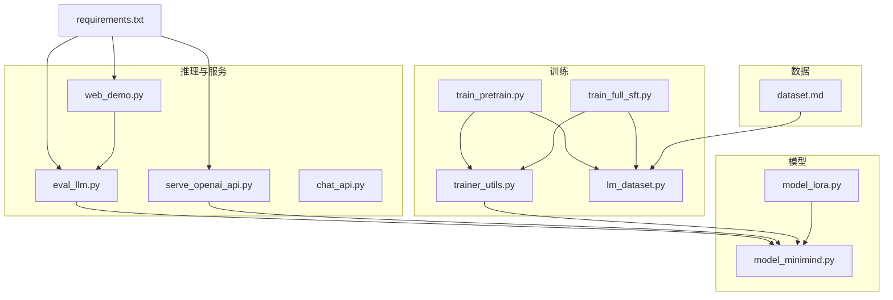
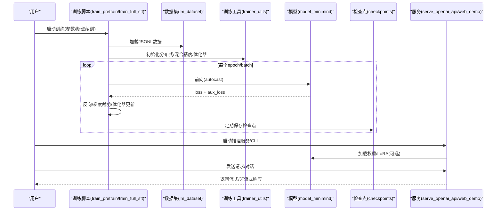
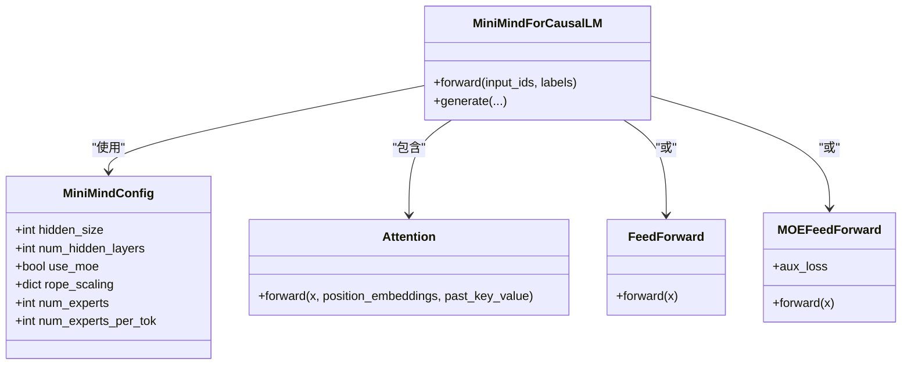
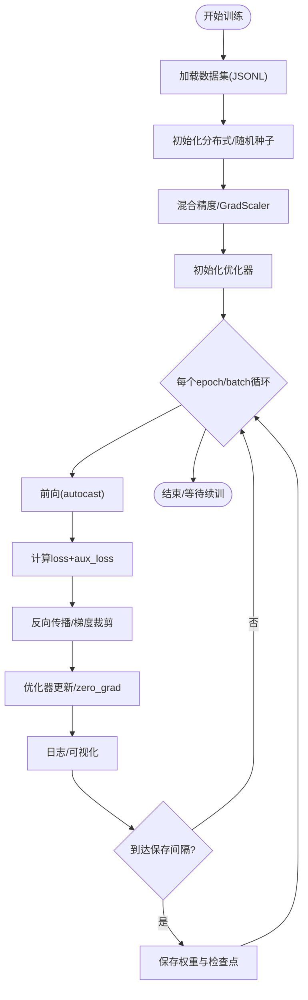
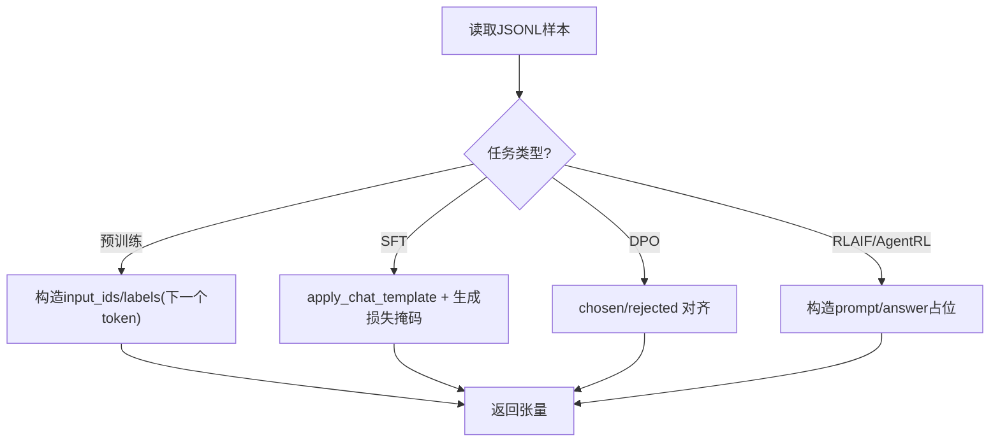
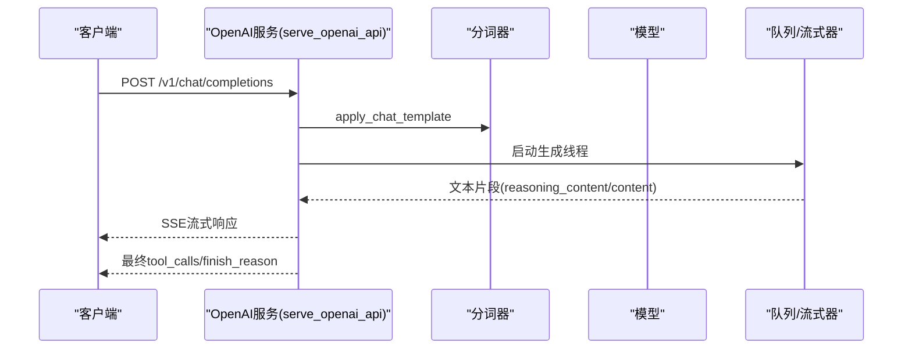
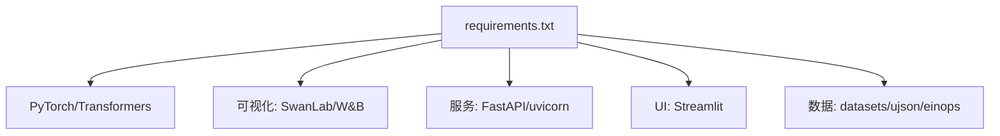

# 故障排除与常见问题

<cite>
**本文引用的文件**
- [README.md](file://README.md)
- [requirements.txt](file://requirements.txt)
- [eval_llm.py](file://eval_llm.py)
- [model_minimind.py](file://model/model_minimind.py)
- [model_lora.py](file://model/model_lora.py)
- [chat_api.py](file://scripts/chat_api.py)
- [serve_openai_api.py](file://scripts/serve_openai_api.py)
- [web_demo.py](file://scripts/web_demo.py)
- [train_pretrain.py](file://trainer/train_pretrain.py)
- [train_full_sft.py](file://trainer/train_full_sft.py)
- [trainer_utils.py](file://trainer/trainer_utils.py)
- [lm_dataset.py](file://dataset/lm_dataset.py)
- [dataset.md](file://dataset/dataset.md)
</cite>

## 目录
1. [引言](#引言)
2. [项目结构](#项目结构)
3. [核心组件](#核心组件)
4. [架构总览](#架构总览)
5. [详细组件分析](#详细组件分析)
6. [依赖分析](#依赖分析)
7. [性能注意事项](#性能注意事项)
8. [故障排除指南](#故障排除指南)
9. [结论](#结论)
10. [附录](#附录)

## 引言
本文件面向 MiniMind 用户，提供覆盖安装、配置、训练、推理等环节的系统性故障排除与常见问题解答。内容涵盖日志分析、性能监控、内存管理、资源使用优化、社区支持渠道、版本兼容与迁移指引等，帮助您快速定位并解决使用中的问题。

## 项目结构
MiniMind 采用按功能域划分的目录结构，核心模块包括模型定义、训练脚本、数据集与工具、推理服务与演示界面等。下图展示关键文件与模块的关系：

图表来源
- [requirements.txt](file://requirements.txt)
- [eval_llm.py](file://eval_llm.py)
- [model_minimind.py](file://model/model_minimind.py)
- [model_lora.py](file://model/model_lora.py)
- [serve_openai_api.py](file://scripts/serve_openai_api.py)
- [chat_api.py](file://scripts/chat_api.py)
- [web_demo.py](file://scripts/web_demo.py)
- [train_pretrain.py](file://trainer/train_pretrain.py)
- [train_full_sft.py](file://trainer/train_full_sft.py)
- [trainer_utils.py](file://trainer/trainer_utils.py)
- [lm_dataset.py](file://dataset/lm_dataset.py)
- [dataset.md](file://dataset/dataset.md)

章节来源
- [README.md](file://README.md)
- [requirements.txt](file://requirements.txt)

## 核心组件
- 模型与配置：MiniMindConfig、MiniMindForCausalLM、Attention、FeedForward、MOEFeedForward 等，支持 Dense 与 MoE 架构，内置 YaRN RoPE 外推与 RMSNorm。
- 训练工具：分布式初始化、学习率调度、混合精度、梯度累积、断点续训、日志与可视化集成。
- 数据集：预训练、SFT、DPO、RLAIF、AgentRL 等数据集适配与标签处理。
- 推理与服务：CLI 推理、OpenAI 兼容服务、Streamlit WebUI、本地 Chat API 示例。
- LoRA：参数高效微调，支持加载、保存与权重合并。

章节来源
- [model_minimind.py](file://model/model_minimind.py)
- [trainer_utils.py](file://trainer/trainer_utils.py)
- [lm_dataset.py](file://dataset/lm_dataset.py)
- [eval_llm.py](file://eval_llm.py)
- [serve_openai_api.py](file://scripts/serve_openai_api.py)
- [web_demo.py](file://scripts/web_demo.py)
- [model_lora.py](file://model/model_lora.py)

## 架构总览
MiniMind 的训练与推理路径如下所示，涵盖数据加载、模型前向、损失计算、优化器更新、断点保存与服务暴露等关键节点。

图表来源
- [train_pretrain.py](file://trainer/train_pretrain.py)
- [train_full_sft.py](file://trainer/train_full_sft.py)
- [lm_dataset.py](file://dataset/lm_dataset.py)
- [trainer_utils.py](file://trainer/trainer_utils.py)
- [model_minimind.py](file://model/model_minimind.py)
- [serve_openai_api.py](file://scripts/serve_openai_api.py)
- [web_demo.py](file://scripts/web_demo.py)

## 详细组件分析

### 模型与配置（MiniMind）
- 支持 Dense 与 MoE 前馈，MoE 默认 4 experts / top-1 路由，辅助损失可配置。
- 注意力与 RoPE：支持 YaRN 外推，位置编码可按需启用。
- 生成接口：内置 generate，支持温度、top-p、eos 控制、流式输出。

图表来源
- [model_minimind.py](file://model/model_minimind.py)

章节来源
- [model_minimind.py](file://model/model_minimind.py)

### 训练流水线（预训练/全量SFT）
- 预训练：文本到下一个 token 的自回归目标，支持断点续训、混合精度、分布式。
- 全量 SFT：多轮对话与工具调用模板，支持断点续训、学习率余弦衰减、日志与可视化。
- 关键参数：batch size、accumulation steps、grad clip、max_seq_len、dtype 等。

图表来源
- [train_pretrain.py](file://trainer/train_pretrain.py)
- [train_full_sft.py](file://trainer/train_full_sft.py)
- [trainer_utils.py](file://trainer/trainer_utils.py)

章节来源
- [train_pretrain.py](file://trainer/train_pretrain.py)
- [train_full_sft.py](file://trainer/train_full_sft.py)
- [trainer_utils.py](file://trainer/trainer_utils.py)

### 数据集与标签处理
- 预训练：将 text 转为 token 序列，构造 next-token 预测标签。
- SFT：应用 chat_template，生成损失掩码，支持工具调用与思考标签。
- DPO/RLAIF/AgentRL：按任务格式解析对话与标签。

图表来源
- [lm_dataset.py](file://dataset/lm_dataset.py)

章节来源
- [lm_dataset.py](file://dataset/lm_dataset.py)
- [dataset.md](file://dataset/dataset.md)

### 推理与服务
- CLI 推理：支持 Transformers 与原生权重加载，可选 LoRA，支持历史对话与思考开关。
- OpenAI 兼容服务：FastAPI + SSE 流式输出，支持 reasoning_content/tool_calls。
- WebUI：Streamlit，支持工具选择、思考展示、多轮对话与流式生成。

图表来源
- [serve_openai_api.py](file://scripts/serve_openai_api.py)
- [eval_llm.py](file://eval_llm.py)
- [web_demo.py](file://scripts/web_demo.py)

章节来源
- [eval_llm.py](file://eval_llm.py)
- [serve_openai_api.py](file://scripts/serve_openai_api.py)
- [web_demo.py](file://scripts/web_demo.py)
- [chat_api.py](file://scripts/chat_api.py)

## 依赖分析
- Python 与核心库：PyTorch、Transformers、Triton/Flash-Attn（可选）、SwanLab/W&B、FastAPI、Streamlit、datasets、ujson、einops 等。
- 训练与推理：CUDA 可用性、混合精度 dtype、分布式后端 NCCL、DDP。
- 数据：JSONL 数据集、分词器权重、模型权重。

图表来源
- [requirements.txt](file://requirements.txt)

章节来源
- [requirements.txt](file://requirements.txt)

## 性能注意事项
- 显存与吞吐
  - 使用混合精度（bfloat16/float16）与 GradScaler，合理设置 accumulation steps 与 batch size。
  - 启用 torch.compile（可选）与分布式训练（DDP/DeepSpeed）以提升吞吐。
  - 控制 max_seq_len，避免过长序列导致 OOM。
- 生成性能
  - 使用 KV 缓存与流式输出，降低首 token 延迟。
  - 调整 temperature/top_p，平衡多样性与稳定性。
- 训练稳定性
  - 学习率余弦退火、梯度裁剪、断点续训，避免训练中断与精度波动。
- 可视化与日志
  - 使用 SwanLab/W&B 记录 loss、学习率、ETA 等指标，便于定位异常。

[本节为通用指导，无需引用具体文件]

## 故障排除指南

### 一、安装与环境
- 症状：安装依赖时报错或版本冲突
  - 排查要点：确认 Python 版本、CUDA/驱动与 PyTorch 版本匹配；优先使用 requirements.txt 指定版本。
  - 参考路径：[requirements.txt](file://requirements.txt)
- 症状：CUDA 不可用或 GPU 内存不足
  - 排查要点：检查 torch.cuda.is_available()；确认显存占用；必要时降低 batch size、max_seq_len 或 dtype。
  - 参考路径：[README.md](file://README.md)
- 症状：分布式训练初始化失败
  - 排查要点：NCCL 环境变量、LOCAL_RANK/RANK、后端初始化；确保同一节点内网互通。
  - 参考路径：[trainer_utils.py](file://trainer/trainer_utils.py)

章节来源
- [requirements.txt](file://requirements.txt)
- [README.md](file://README.md)
- [trainer_utils.py](file://trainer/trainer_utils.py)

### 二、数据与配置
- 症状：数据集未找到或格式错误
  - 排查要点：将数据集文件放入 dataset/ 目录；核对 JSONL 格式与字段；参考数据说明。
  - 参考路径：[dataset.md](file://dataset/dataset.md)，[lm_dataset.py](file://dataset/lm_dataset.py)
- 症状：max_seq_len 导致截断过多或显存不足
  - 排查要点：根据中文 token 比例（约 1.5~1.7 chars/token）估算；适当降低 max_seq_len 或增大 batch size。
  - 参考路径：[README.md](file://README.md)，[lm_dataset.py](file://dataset/lm_dataset.py)
- 症状：SFT 数据中工具调用/思考标签未生效
  - 排查要点：确认 chat_template 是否传入 tools/open_thinking；检查标签格式与 JSON。
  - 参考路径：[lm_dataset.py](file://dataset/lm_dataset.py)，[serve_openai_api.py](file://scripts/serve_openai_api.py)

章节来源
- [dataset.md](file://dataset/dataset.md)
- [lm_dataset.py](file://dataset/lm_dataset.py)
- [README.md](file://README.md)
- [serve_openai_api.py](file://scripts/serve_openai_api.py)

### 三、训练问题
- 症状：OOM 或显存溢出
  - 排查要点：降低 batch size、max_seq_len；关闭 torch.compile；减少 experts 或禁用 MoE。
  - 参考路径：[train_pretrain.py](file://trainer/train_pretrain.py)，[train_full_sft.py](file://trainer/train_full_sft.py)
- 症状：训练中断后无法续训
  - 排查要点：确认 checkpoints/ 存在；检查 resume 文件与 world_size；使用 --from_resume 1。
  - 参考路径：[trainer_utils.py](file://trainer/trainer_utils.py)
- 症状：学习率不下降或 loss 不降
  - 排查要点：检查学习率调度函数；确认 accumulation steps 与 grad clip；核对数据分布。
  - 参考路径：[trainer_utils.py](file://trainer/trainer_utils.py)，[train_pretrain.py](file://trainer/train_pretrain.py)
- 症状：分布式训练不同 GPU 数量恢复步数异常
  - 排查要点：系统会自动转换 step；若不一致，检查保存时的 world_size。
  - 参考路径：[trainer_utils.py](file://trainer/trainer_utils.py)

章节来源
- [train_pretrain.py](file://trainer/train_pretrain.py)
- [train_full_sft.py](file://trainer/train_full_sft.py)
- [trainer_utils.py](file://trainer/trainer_utils.py)

### 四、推理与服务问题
- 症状：CLI 推理报错或无输出
  - 排查要点：确认 --load_from 指向正确权重；检查设备（cuda/cpu）；验证 tokenizer 是否加载成功。
  - 参考路径：[eval_llm.py](file://eval_llm.py)，[model_minimind.py](file://model/model_minimind.py)
- 症状：OpenAI 服务无法接收请求或无流式输出
  - 排查要点：确认服务端口开放；检查 chat_template 与 reasoning_content/tool_calls 解析；核对 SSE 格式。
  - 参考路径：[serve_openai_api.py](file://scripts/serve_openai_api.py)
- 症状：WebUI 无法加载模型或显示空白
  - 排查要点：确认 ./scripts/ 下存在包含权重的子目录；检查模型路径扫描逻辑与权限。
  - 参考路径：[web_demo.py](file://scripts/web_demo.py)
- 症状：思考/工具调用显示异常
  - 排查要点：检查标签格式<think>/<tool_call>...<tool_call>；确认前端渲染与正则替换逻辑。
  - 参考路径：[web_demo.py](file://scripts/web_demo.py)，[serve_openai_api.py](file://scripts/serve_openai_api.py)

章节来源
- [eval_llm.py](file://eval_llm.py)
- [model_minimind.py](file://model/model_minimind.py)
- [serve_openai_api.py](file://scripts/serve_openai_api.py)
- [web_demo.py](file://scripts/web_demo.py)

### 五、LoRA 与权重合并
- 症状：LoRA 权重未生效
  - 排查要点：确认加载路径与 rank；检查 apply_lora 是否在模型上注入；核对保存/加载键名。
  - 参考路径：[model_lora.py](file://model/model_lora.py)
- 症状：合并 LoRA 后权重过大或不兼容
  - 排查要点：合并时会将 A·B 项加回到主权重；确保保存为半精度；验证下游加载。
  - 参考路径：[model_lora.py](file://model/model_lora.py)

章节来源
- [model_lora.py](file://model/model_lora.py)

### 六、日志分析与性能监控
- 日志与可视化
  - 使用 SwanLab/W&B 记录 loss、aux_loss、学习率、ETA；断点续训自动恢复 run。
  - 参考路径：[train_pretrain.py](file://trainer/train_pretrain.py)，[train_full_sft.py](file://trainer/train_full_sft.py)
- 生成速度与延迟
  - CLI 推理支持显示 tokens/s；服务端流式输出可降低首 token 延迟。
  - 参考路径：[eval_llm.py](file://eval_llm.py)，[serve_openai_api.py](file://scripts/serve_openai_api.py)
- 内存与显存
  - 通过降低 dtype、batch size、max_seq_len、禁用 MoE 或减少 experts 优化显存。
  - 参考路径：[README.md](file://README.md)，[model_minimind.py](file://model/model_minimind.py)

章节来源
- [train_pretrain.py](file://trainer/train_pretrain.py)
- [train_full_sft.py](file://trainer/train_full_sft.py)
- [eval_llm.py](file://eval_llm.py)
- [serve_openai_api.py](file://scripts/serve_openai_api.py)
- [README.md](file://README.md)
- [model_minimind.py](file://model/model_minimind.py)

### 七、版本兼容与迁移
- 兼容性说明
  - 2025-04-26 更新后不再支持「直接」加载旧模型；需映射/校准或迁移至新格式。
  - 参考路径：[README.md](file://README.md)
- 迁移建议
  - 使用新格式模型（transformers 兼容）；如需旧权重，先进行权重映射与校准。
  - 参考路径：[README.md](file://README.md)
- 第三方生态
  - 支持 llama.cpp、vLLM、Ollama、OpenAI API 协议；注意分词器与位置编码差异。
  - 参考路径：[README.md](file://README.md)，[serve_openai_api.py](file://scripts/serve_openai_api.py)

章节来源
- [README.md](file://README.md)
- [serve_openai_api.py](file://scripts/serve_openai_api.py)

## 结论
通过系统化的故障排除流程与资源优化策略，您可以稳定地完成 MiniMind 的安装、训练与推理。建议优先从日志与可视化入手定位问题，结合显存/吞吐调优与断点续训机制，提升训练可靠性与效率。遇到复杂问题时，可借助社区渠道获取帮助。

[本节为总结，无需引用具体文件]

## 附录

### A. 常用命令与参数速查
- 安装依赖
  - 参考路径：[requirements.txt](file://requirements.txt)
- CLI 推理
  - 参考路径：[eval_llm.py](file://eval_llm.py)
- OpenAI 服务
  - 参考路径：[serve_openai_api.py](file://scripts/serve_openai_api.py)
- WebUI
  - 参考路径：[web_demo.py](file://scripts/web_demo.py)
- 训练脚本
  - 参考路径：[train_pretrain.py](file://trainer/train_pretrain.py)，[train_full_sft.py](file://trainer/train_full_sft.py)

### B. 社区支持与获取帮助
- 项目主页与讨论区：[README.md](file://README.md)
- 数据集与模型下载：[README.md](file://README.md)
- 问题反馈与交流：参考项目说明中的社区链接与讨论区入口。

章节来源
- [README.md](file://README.md)