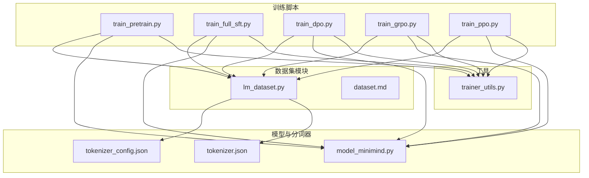
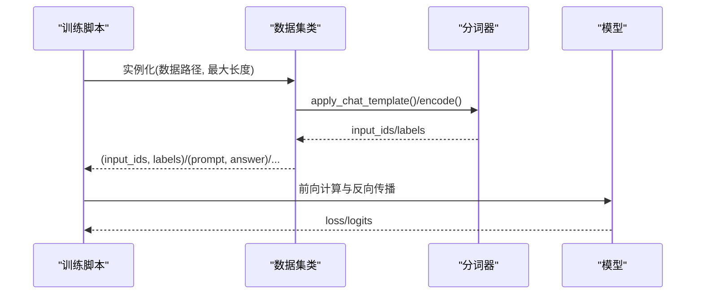
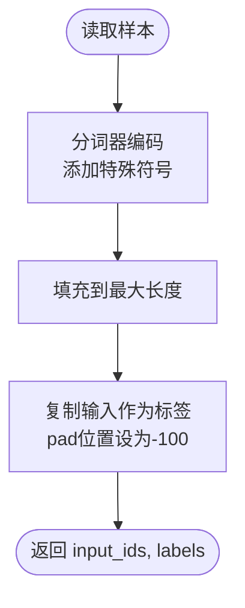
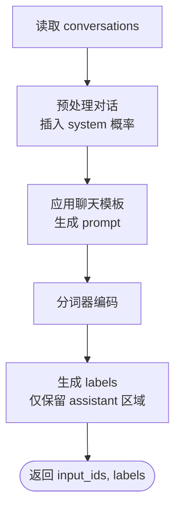
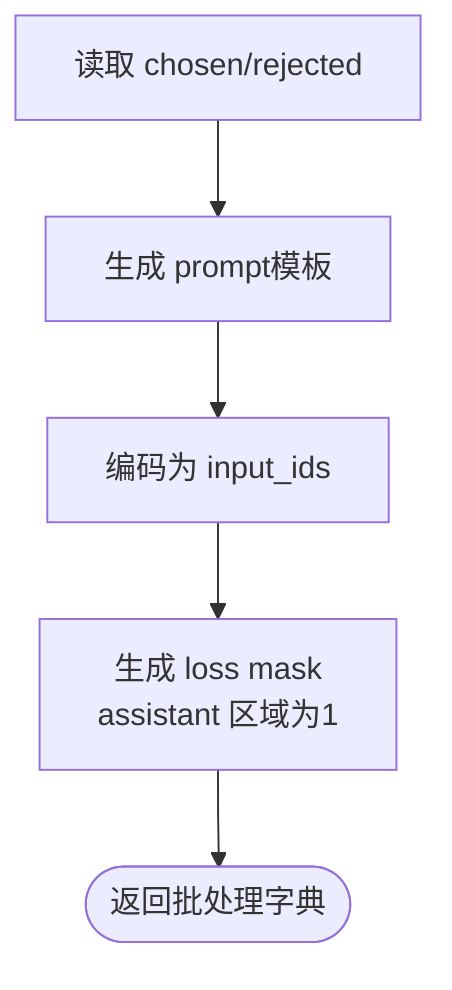
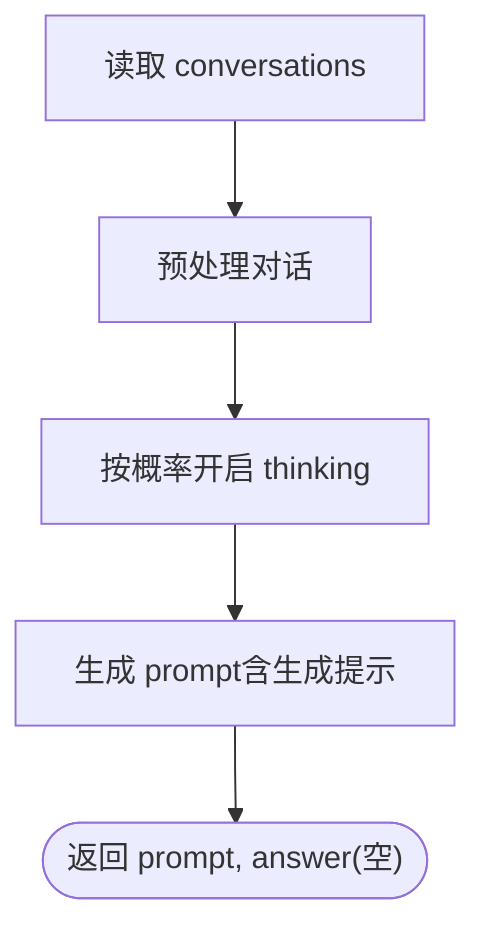
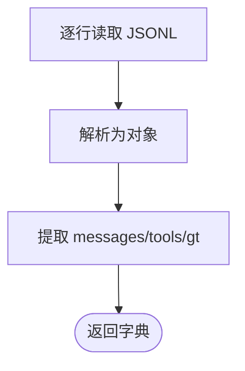
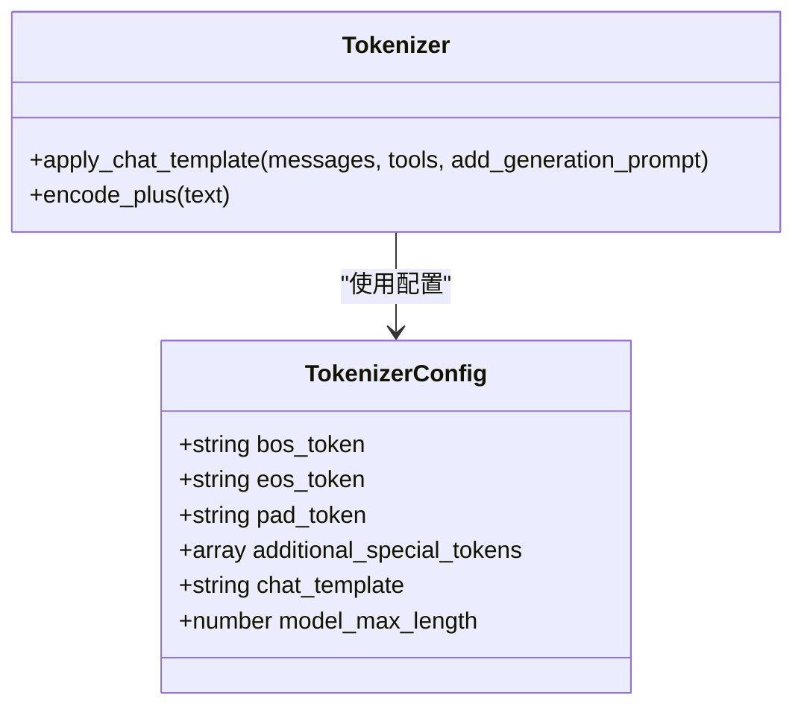
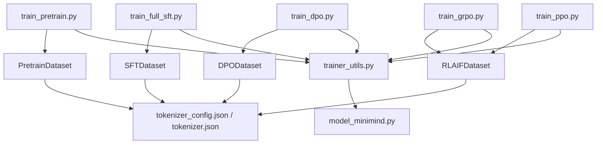

# 数据处理问题

<cite>
**本文引用的文件**
- [dataset/lm_dataset.py](file://dataset/lm_dataset.py)
- [dataset/dataset.md](file://dataset/dataset.md)
- [trainer/train_pretrain.py](file://trainer/train_pretrain.py)
- [trainer/train_full_sft.py](file://trainer/train_full_sft.py)
- [trainer/train_dpo.py](file://trainer/train_dpo.py)
- [trainer/train_grpo.py](file://trainer/train_grpo.py)
- [trainer/train_ppo.py](file://trainer/train_ppo.py)
- [trainer/trainer_utils.py](file://trainer/trainer_utils.py)
- [model/model_minimind.py](file://model/model_minimind.py)
- [model/tokenizer_config.json](file://model/tokenizer_config.json)
- [model/tokenizer.json](file://model/tokenizer.json)
</cite>

## 目录
1. [简介](#简介)
2. [项目结构](#项目结构)
3. [核心组件](#核心组件)
4. [架构总览](#架构总览)
5. [详细组件分析](#详细组件分析)
6. [依赖分析](#依赖分析)
7. [性能考量](#性能考量)
8. [故障排除指南](#故障排除指南)
9. [结论](#结论)
10. [附录](#附录)

## 简介
本文件聚焦 MiniMind 项目在数据处理与数据集相关问题上的故障排除与最佳实践，覆盖以下方面：
- 数据格式错误、JSONL 解析失败、数据预处理异常的诊断与修复
- 不同数据集格式（预训练、SFT、DPO、RLAIF、Agent RL）的加载与验证方法
- 数据质量检查与清洗的最佳实践
- 数据路径配置错误、文件权限问题、编码格式不兼容等常见问题的解决方案
- 数据集下载与存储优化策略，以及大规模数据集的内存管理建议

## 项目结构
MiniMind 的数据处理主要集中在 dataset 模块与多个训练脚本中，训练脚本通过统一的 Dataset 类加载 JSONL 数据，并结合分词器进行格式化与标签生成。核心文件如下：
- 数据集加载与预处理：dataset/lm_dataset.py
- 训练入口与参数配置：trainer/train_pretrain.py、trainer/train_full_sft.py、trainer/train_dpo.py、trainer/train_grpo.py、trainer/train_ppo.py
- 训练工具与模型初始化：trainer/trainer_utils.py、model/model_minimind.py
- 分词器配置与词表：model/tokenizer_config.json、model/tokenizer.json
- 数据集放置说明：dataset/dataset.md

**图表来源**
- [dataset/lm_dataset.py:1-256](file://dataset/lm_dataset.py#L1-L256)
- [dataset/dataset.md:1-5](file://dataset/dataset.md#L1-L5)
- [trainer/train_pretrain.py:1-170](file://trainer/train_pretrain.py#L1-L170)
- [trainer/train_full_sft.py:1-171](file://trainer/train_full_sft.py#L1-L171)
- [trainer/train_dpo.py:1-226](file://trainer/train_dpo.py#L1-L226)
- [trainer/train_grpo.py:1-332](file://trainer/train_grpo.py#L1-L332)
- [trainer/train_ppo.py:1-444](file://trainer/train_ppo.py#L1-L444)
- [trainer/trainer_utils.py:1-177](file://trainer/trainer_utils.py#L1-L177)
- [model/model_minimind.py:1-280](file://model/model_minimind.py#L1-L280)
- [model/tokenizer_config.json:1-335](file://model/tokenizer_config.json#L1-L335)
- [model/tokenizer.json:1-335](file://model/tokenizer.json#L1-L335)

**章节来源**
- [dataset/lm_dataset.py:1-256](file://dataset/lm_dataset.py#L1-L256)
- [dataset/dataset.md:1-5](file://dataset/dataset.md#L1-L5)

## 核心组件
- 数据集类族
  - PretrainDataset：面向纯文本预训练，读取 JSONL 中的 text 字段，使用分词器编码并构造语言建模标签
  - SFTDataset：面向指令微调，读取 conversations 数组，应用聊天模板生成输入与标签
  - DPODataset：面向直接偏好优化，读取 chosen/rejected 对话序列，生成损失掩码
  - RLAIFDataset：面向强化学习的提示生成，按概率决定是否开启思考标签
  - AgentRLDataset：面向智能体 RL 的 JSONL 解析，提取 messages、tools、gt
- 训练脚本
  - 各训练脚本通过参数指定 data_path，实例化对应 Dataset 并构建 DataLoader
- 训练工具
  - 初始化分词器、模型、分布式与检查点管理
- 模型与分词器
  - 模型定义与前向逻辑，分词器配置与聊天模板

**章节来源**
- [dataset/lm_dataset.py:37-256](file://dataset/lm_dataset.py#L37-L256)
- [trainer/train_pretrain.py:134-134](file://trainer/train_pretrain.py#L134-L134)
- [trainer/train_full_sft.py:135-135](file://trainer/train_full_sft.py#L135-L135)
- [trainer/train_dpo.py:190-190](file://trainer/train_dpo.py#L190-L190)
- [trainer/train_grpo.py:291-291](file://trainer/train_grpo.py#L291-L291)
- [trainer/train_ppo.py:396-396](file://trainer/train_ppo.py#L396-L396)
- [trainer/trainer_utils.py:119-131](file://trainer/trainer_utils.py#L119-L131)
- [model/model_minimind.py:229-246](file://model/model_minimind.py#L229-L246)
- [model/tokenizer_config.json:317-333](file://model/tokenizer_config.json#L317-L333)

## 架构总览
下面的顺序图展示了典型训练流程中数据加载与预处理的关键步骤。

**图表来源**
- [trainer/train_full_sft.py:134-135](file://trainer/train_full_sft.py#L134-L135)
- [trainer/train_dpo.py:190-190](file://trainer/train_dpo.py#L190-L190)
- [trainer/train_grpo.py:291-291](file://trainer/train_grpo.py#L291-L291)
- [trainer/train_ppo.py:396-396](file://trainer/train_ppo.py#L396-L396)
- [dataset/lm_dataset.py:106-119](file://dataset/lm_dataset.py#L106-L119)
- [model/model_minimind.py:238-246](file://model/model_minimind.py#L238-L246)

## 详细组件分析

### 预训练数据集（PretrainDataset）
- 输入：JSONL 文件，每行包含字段 text
- 处理：将 text 转字符串，使用分词器编码，添加 BOS/EOS，填充至最大长度，构造标签（pad 位置设为忽略）
- 关键点：max_length 控制截断；pad_token_id 用于填充；标签对 pad 位置设置为 -100

**图表来源**
- [dataset/lm_dataset.py:37-55](file://dataset/lm_dataset.py#L37-L55)

**章节来源**
- [dataset/lm_dataset.py:37-55](file://dataset/lm_dataset.py#L37-L55)

### SFT 数据集（SFTDataset）
- 输入：JSONL 文件，每行包含 conversations 数组，元素为 {role, content, reasoning_content, tools, tool_calls}
- 处理：预处理对话（可能插入 system），应用聊天模板生成 prompt；生成 labels 时，仅对 assistant 回复部分保留标签
- 关键点：Features 显式声明字段类型；tool_calls 可能为字符串需 JSON 解析；generate_labels 通过固定前后缀标识定位回复区域

**图表来源**
- [dataset/lm_dataset.py:58-119](file://dataset/lm_dataset.py#L58-L119)

**章节来源**
- [dataset/lm_dataset.py:58-119](file://dataset/lm_dataset.py#L58-L119)

### DPO 数据集（DPODataset）
- 输入：JSONL 文件，每行包含 chosen/rejected，均为对话数组
- 处理：分别应用聊天模板生成 prompt，再编码；generate_loss_mask 仅对 assistant 区域标记为 1
- 关键点：返回 x_chosen/y_chosen/mask_chosen 与 x_rejected/y_rejected/mask_rejected，便于后续对比学习

**图表来源**
- [dataset/lm_dataset.py:122-174](file://dataset/lm_dataset.py#L122-L174)

**章节来源**
- [dataset/lm_dataset.py:122-174](file://dataset/lm_dataset.py#L122-L174)

### RLAIF 数据集（RLAIFDataset）
- 输入：JSONL 文件，每行 conversations 数组
- 处理：按概率开启 thinking 标签，生成带占位生成提示的 prompt
- 关键点：max_length 通常较大；thinking_ratio 控制是否开启思考

**图表来源**
- [dataset/lm_dataset.py:195-224](file://dataset/lm_dataset.py#L195-L224)

**章节来源**
- [dataset/lm_dataset.py:195-224](file://dataset/lm_dataset.py#L195-L224)

### Agent RL 数据集（AgentRLDataset）
- 输入：JSONL 文件，逐行解析为 Python 对象
- 处理：解析 conversations，提取 messages、tools、gt；不进行编码，直接返回
- 关键点：open_thinking 由上层控制；适合工具调用与目标对齐任务

**图表来源**
- [dataset/lm_dataset.py:226-252](file://dataset/lm_dataset.py#L226-L252)

**章节来源**
- [dataset/lm_dataset.py:226-252](file://dataset/lm_dataset.py#L226-L252)

### 分词器与聊天模板
- 分词器配置包含特殊 token、chat_template、最大长度等
- chat_template 支持 tools 与 thinking 标签，确保生成与标注一致

**图表来源**
- [model/tokenizer_config.json:317-333](file://model/tokenizer_config.json#L317-L333)
- [model/tokenizer.json:1-335](file://model/tokenizer.json#L1-L335)

**章节来源**
- [model/tokenizer_config.json:1-335](file://model/tokenizer_config.json#L1-L335)
- [model/tokenizer.json:1-335](file://model/tokenizer.json#L1-L335)

## 依赖分析
- 训练脚本依赖对应的 Dataset 类与分词器配置
- Dataset 类依赖 datasets.load_dataset 与 transformers 分词器
- 训练工具负责模型初始化、分布式与检查点管理

**图表来源**
- [trainer/train_pretrain.py:134-134](file://trainer/train_pretrain.py#L134-L134)
- [trainer/train_full_sft.py:135-135](file://trainer/train_full_sft.py#L135-L135)
- [trainer/train_dpo.py:190-190](file://trainer/train_dpo.py#L190-L190)
- [trainer/train_grpo.py:291-291](file://trainer/train_grpo.py#L291-L291)
- [trainer/train_ppo.py:396-396](file://trainer/train_ppo.py#L396-L396)
- [dataset/lm_dataset.py:1-256](file://dataset/lm_dataset.py#L1-L256)
- [trainer/trainer_utils.py:119-131](file://trainer/trainer_utils.py#L119-L131)
- [model/model_minimind.py:1-280](file://model/model_minimind.py#L1-L280)
- [model/tokenizer_config.json:1-335](file://model/tokenizer_config.json#L1-L335)
- [model/tokenizer.json:1-335](file://model/tokenizer.json#L1-L335)

**章节来源**
- [trainer/train_pretrain.py:1-170](file://trainer/train_pretrain.py#L1-L170)
- [trainer/train_full_sft.py:1-171](file://trainer/train_full_sft.py#L1-L171)
- [trainer/train_dpo.py:1-226](file://trainer/train_dpo.py#L1-L226)
- [trainer/train_grpo.py:1-332](file://trainer/train_grpo.py#L1-L332)
- [trainer/train_ppo.py:1-444](file://trainer/train_ppo.py#L1-L444)
- [dataset/lm_dataset.py:1-256](file://dataset/lm_dataset.py#L1-L256)
- [trainer/trainer_utils.py:1-177](file://trainer/trainer_utils.py#L1-L177)
- [model/model_minimind.py:1-280](file://model/model_minimind.py#L1-L280)
- [model/tokenizer_config.json:1-335](file://model/tokenizer_config.json#L1-L335)
- [model/tokenizer.json:1-335](file://model/tokenizer.json#L1-L335)

## 性能考量
- 批处理与 DataLoader
  - num_workers 与 pin_memory 可提升吞吐；注意 CPU 内存占用
  - SkipBatchSampler 支持跳过已完成 step，提高续训效率
- 混合精度与编译
  - autocast 与 torch.compile 可加速训练（CPU 上 autocast 降级）
- 分布式训练
  - DistributedSampler 保障数据均匀切分；注意世界规模变化时的续训步数转换
- 内存管理
  - 大规模数据集建议使用流式读取或分片加载；及时释放中间张量与缓存

[本节为通用指导，无需特定文件来源]

## 故障排除指南

### 一、数据格式错误与 JSONL 解析失败
- 症状
  - 训练启动即报错，提示 JSON 解析异常或字段缺失
- 常见原因
  - JSONL 行不是合法 JSON 对象
  - 字段缺失：text（预训练）、conversations（SFT/DPO/RLAIF）、chosen/rejected（DPO）
  - tool_calls 或 tools 为字符串但非合法 JSON
- 诊断步骤
  - 使用最小样本验证：仅保留几行数据到独立文件，确认能否被 datasets.load_dataset 正常加载
  - 检查字段类型：确保 conversations 为数组，每项包含 role/content；DPO 的 chosen/rejected 亦为数组
  - 对于工具调用：确认 tool_calls 为 JSON 对象或合法 JSON 字符串
- 修复建议
  - 修正非法字符与转义；补齐缺失字段
  - 对字符串类型的 tool_calls 执行 JSON 解析后再进入训练流程
  - 使用严格模式校验 JSONL 文件

**章节来源**
- [dataset/lm_dataset.py:63-64](file://dataset/lm_dataset.py#L63-L64)
- [dataset/lm_dataset.py:76-79](file://dataset/lm_dataset.py#L76-L79)
- [dataset/lm_dataset.py:137-138](file://dataset/lm_dataset.py#L137-L138)

### 二、数据预处理异常
- 症状
  - 标签生成不符合预期，或出现越界
- 常见原因
  - assistant 区域前后缀不匹配，导致 generate_labels 无法正确识别
  - 未启用 thinking 导致模板与实际内容不一致
- 诊断步骤
  - 打印应用模板后的 prompt，核对 bos/eos 前缀是否与生成逻辑一致
  - 检查 generate_labels 的匹配逻辑是否覆盖所有情况
- 修复建议
  - 统一使用分词器的 apply_chat_template 并保持 add_generation_prompt 与 open_thinking 一致性
  - 对空思考标签按比例剔除，避免影响训练稳定性

**章节来源**
- [dataset/lm_dataset.py:81-86](file://dataset/lm_dataset.py#L81-L86)
- [dataset/lm_dataset.py:88-104](file://dataset/lm_dataset.py#L88-L104)
- [dataset/lm_dataset.py:176-192](file://dataset/lm_dataset.py#L176-L192)

### 三、数据集格式加载与验证
- 预训练（Pretrain）
  - 确认每行包含 text 字段；max_length 合理设置，避免截断过多信息
- SFT（Full SFT）
  - conversations 必须为数组；role 为 system/user/assistant/tool；assistant 可包含 reasoning_content 与 tool_calls
- DPO
  - chosen/rejected 均为对话数组；模板生成后应能被编码且长度合理
- RLAIF
  - conversations 为对话数组；根据 thinking_ratio 决定是否开启思考标签
- Agent RL
  - messages、tools、gt 字段齐全；不进行编码，直接传递给上层

**章节来源**
- [dataset/lm_dataset.py:37-55](file://dataset/lm_dataset.py#L37-L55)
- [dataset/lm_dataset.py:58-119](file://dataset/lm_dataset.py#L58-L119)
- [dataset/lm_dataset.py:122-174](file://dataset/lm_dataset.py#L122-L174)
- [dataset/lm_dataset.py:195-224](file://dataset/lm_dataset.py#L195-L224)
- [dataset/lm_dataset.py:226-252](file://dataset/lm_dataset.py#L226-L252)

### 四、数据质量检查与清洗最佳实践
- 字段完整性
  - 预训练：text 存在且非空
  - SFT/DPO/RLAIF：conversations 或 chosen/rejected 结构完整
- 文本质量
  - 去除超长或异常空白；过滤极短回复
- 工具调用
  - 校验 tool_calls 的 JSON 结构；缺失或无效时回退或剔除样本
- 标签一致性
  - 确保 bos/eos 前缀与 generate_labels 匹配；避免跨样本污染

**章节来源**
- [dataset/lm_dataset.py:76-79](file://dataset/lm_dataset.py#L76-L79)
- [dataset/lm_dataset.py:137-138](file://dataset/lm_dataset.py#L137-L138)

### 五、数据路径配置错误
- 症状
  - FileNotFoundError 或找不到数据文件
- 诊断步骤
  - 确认 data_path 指向正确文件；相对路径相对于训练脚本工作目录
  - 检查 dataset/ 下是否放置了数据文件
- 修复建议
  - 使用绝对路径或确保相对路径正确
  - 在启动前打印当前工作目录与 data_path 组合结果进行核对

**章节来源**
- [dataset/dataset.md:1-5](file://dataset/dataset.md#L1-L5)
- [trainer/train_pretrain.py:100-100](file://trainer/train_pretrain.py#L100-L100)
- [trainer/train_full_sft.py:101-101](file://trainer/train_full_sft.py#L101-L101)
- [trainer/train_dpo.py:148-148](file://trainer/train_dpo.py#L148-L148)
- [trainer/train_grpo.py:224-224](file://trainer/train_grpo.py#L224-L224)
- [trainer/train_ppo.py:323-323](file://trainer/train_ppo.py#L323-L323)

### 六、文件权限问题
- 症状
  - 读取失败或权限不足
- 修复建议
  - 确保运行用户对数据文件具有读取权限
  - 若使用网络挂载盘，检查挂载状态与只读属性

[本小节为通用指导，无需特定文件来源]

### 七、编码格式不兼容
- 症状
  - UnicodeDecodeError 或乱码
- 修复建议
  - 确保 JSONL 文件为 UTF-8 编码
  - 分词器配置中 pad_token、additional_special_tokens 等应与文件一致

**章节来源**
- [model/tokenizer_config.json:317-333](file://model/tokenizer_config.json#L317-L333)

### 八、大规模数据集的内存管理
- 症状
  - OOM、CPU 内存飙升、加载缓慢
- 优化策略
  - 减少 num_workers 或关闭 pin_memory 以降低内存峰值
  - 使用 SkipBatchSampler 跳过已完成 step，减少重复加载
  - 分片加载或流式读取（如 AgentRLDataset 已采用逐行读取）
  - 合理设置 max_length 与 batch_size
  - 分布式场景下注意世界规模变化导致的 step 转换

**章节来源**
- [trainer/trainer_utils.py:134-157](file://trainer/trainer_utils.py#L134-L157)
- [trainer/train_pretrain.py:162-162](file://trainer/train_pretrain.py#L162-L162)
- [trainer/train_full_sft.py:163-163](file://trainer/train_full_sft.py#L163-L163)
- [trainer/train_dpo.py:218-218](file://trainer/train_dpo.py#L218-L218)
- [trainer/train_grpo.py:324-324](file://trainer/train_grpo.py#L324-L324)
- [trainer/train_ppo.py:436-436](file://trainer/train_ppo.py#L436-L436)

### 九、数据集下载与存储优化
- 建议
  - 将下载好的数据集文件放置在 dataset/ 目录下，避免路径漂移
  - 使用压缩或分片存储，按需解压/加载
  - 利用缓存与索引机制减少重复解析

**章节来源**
- [dataset/dataset.md:1-5](file://dataset/dataset.md#L1-L5)

## 结论
MiniMind 的数据处理围绕统一的 JSONL 格式与分词器模板展开，通过多种 Dataset 类适配不同训练范式。针对常见问题，建议优先从数据格式完整性、字段类型与编码一致性入手排查，并结合训练工具提供的参数与工具函数进行验证与优化。对于大规模数据集，应重点关注内存与 I/O 优化，配合分布式与跳步续训策略提升训练效率与稳定性。

[本节为总结，无需特定文件来源]

## 附录
- 训练脚本参数要点
  - data_path：数据文件路径
  - max_seq_len：最大序列长度
  - batch_size/accumulation_steps：批大小与梯度累积
  - num_workers/pin_memory：数据加载线程与内存优化
  - from_weight/from_resume：权重加载与续训开关
- 模型与分词器
  - tokenizer_config.json 定义了 chat_template、特殊 token 与最大长度
  - model_minimind.py 提供模型前向与损失计算接口

**章节来源**
- [trainer/train_pretrain.py:82-106](file://trainer/train_pretrain.py#L82-L106)
- [trainer/train_full_sft.py:83-106](file://trainer/train_full_sft.py#L83-L106)
- [trainer/train_dpo.py:130-154](file://trainer/train_dpo.py#L130-L154)
- [trainer/train_grpo.py:205-238](file://trainer/train_grpo.py#L205-L238)
- [trainer/train_ppo.py:303-341](file://trainer/train_ppo.py#L303-L341)
- [model/tokenizer_config.json:317-333](file://model/tokenizer_config.json#L317-L333)
- [model/model_minimind.py:238-246](file://model/model_minimind.py#L238-L246)