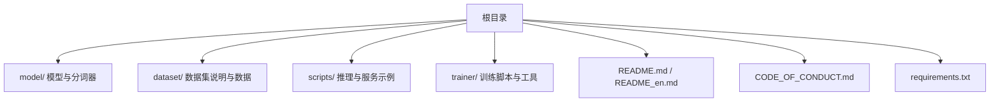
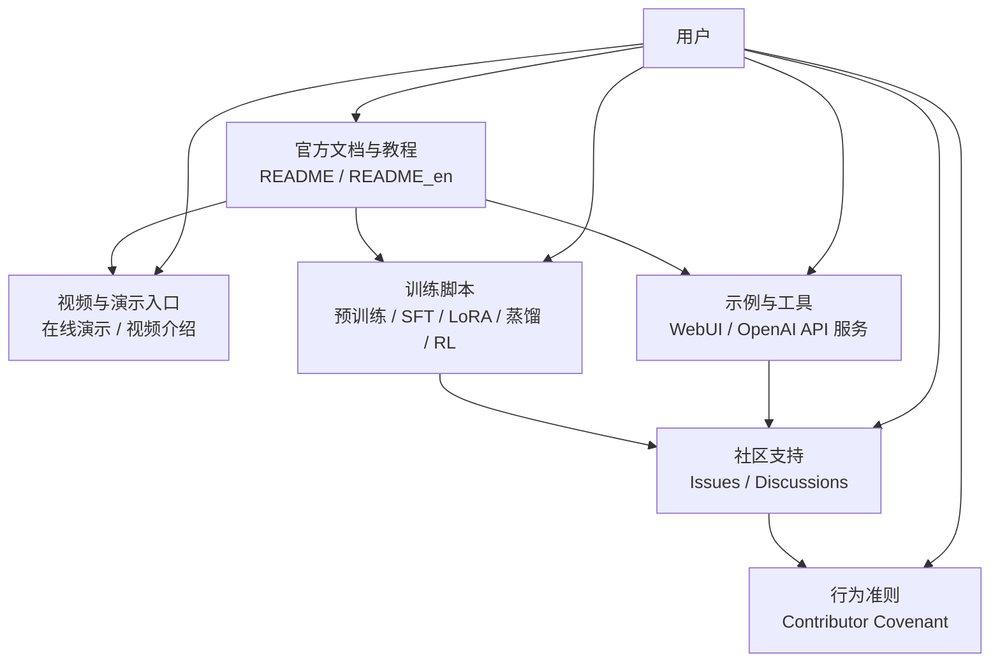
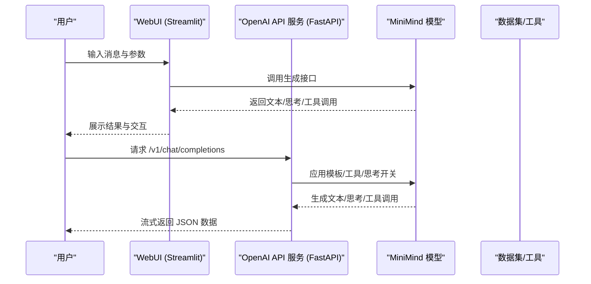
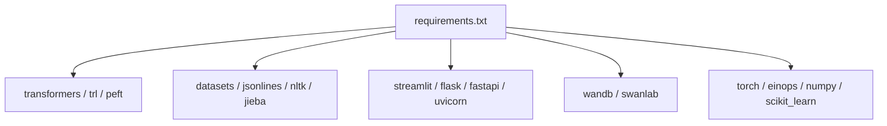

# 社区支持与资源

<cite>
**本文引用的文件**
- [README.md](file://README.md)
- [README_en.md](file://README_en.md)
- [CODE_OF_CONDUCT.md](file://CODE_OF_CONDUCT.md)
- [requirements.txt](file://requirements.txt)
- [scripts/web_demo.py](file://scripts/web_demo.py)
- [scripts/serve_openai_api.py](file://scripts/serve_openai_api.py)
- [trainer/train_pretrain.py](file://trainer/train_pretrain.py)
- [dataset/dataset.md](file://dataset/dataset.md)
</cite>

## 目录
1. [引言](#引言)
2. [项目结构](#项目结构)
3. [核心组件](#核心组件)
4. [架构总览](#架构总览)
5. [详细组件分析](#详细组件分析)
6. [依赖分析](#依赖分析)
7. [性能考量](#性能考量)
8. [故障排查指南](#故障排查指南)
9. [结论](#结论)
10. [附录](#附录)

## 引言
本指南面向 MiniMind 项目的使用者与贡献者，提供社区支持与资源获取的系统化指引。内容涵盖官方文档与教程视频入口、示例代码与工具使用、GitHub Issues 与 Discussions 的使用方法、贡献指南与行为准则、常见问题搜索与解决方案、提问与分享经验的建议，以及版本更新通知、功能特性介绍与最佳实践获取方式。目标是帮助用户高效获取所需资源、参与社区建设、获得技术支持并提升使用体验。

## 项目结构
MiniMind 项目采用清晰的功能模块划分：
- 根目录包含项目说明与许可证、依赖清单、数据集说明等
- model 子目录存放模型结构与分词器定义
- dataset 子目录存放数据集说明与数据文件
- scripts 子目录提供推理与服务示例（WebUI、OpenAI API 服务）
- trainer 子目录提供完整的训练脚本与工具
- README 与 README_en 提供中英文项目说明与使用指南

图表来源
- [README.md](file://README.md)
- [README_en.md](file://README_en.md)
- [requirements.txt](file://requirements.txt)
- [dataset/dataset.md](file://dataset/dataset.md)

章节来源
- [README.md](file://README.md)
- [README_en.md](file://README_en.md)
- [requirements.txt](file://requirements.txt)
- [dataset/dataset.md](file://dataset/dataset.md)

## 核心组件
- 官方文档与教程
  - 中文 README 与英文 README 提供项目介绍、快速开始、训练与推理流程、数据集说明、模型结构与配置等
  - README 中包含在线演示、视频介绍、HuggingFace 与 ModelScope 集合入口
- 社区与支持渠道
  - GitHub Discussions 用于技术交流与经验分享
  - Issues 用于报告问题与功能请求
- 示例与工具
  - WebUI：基于 Streamlit 的聊天界面，支持思考展示、工具选择与多轮 Tool Call
  - OpenAI API 服务：兼容 OpenAI 协议的服务端，支持 reasoning_content、tool_calls、open_thinking
  - 训练脚本：覆盖预训练、SFT、LoRA、蒸馏、RLHF/RLAIF 等全流程
- 行为准则
  - 采用 Contributor Covenant 行为准则，明确正向与负面行为标准、执行责任与处置流程

章节来源
- [README.md](file://README.md)
- [README_en.md](file://README_en.md)
- [CODE_OF_CONDUCT.md](file://CODE_OF_CONDUCT.md)
- [scripts/web_demo.py](file://scripts/web_demo.py)
- [scripts/serve_openai_api.py](file://scripts/serve_openai_api.py)
- [trainer/train_pretrain.py](file://trainer/train_pretrain.py)

## 架构总览
MiniMind 的社区支持与资源体系围绕“文档—示例—服务—训练—社区”闭环展开。用户通过官方文档与教程视频了解项目，借助示例脚本与服务工具快速上手，遇到问题通过 Issues 与 Discussions 寻求帮助，按贡献指南参与改进，通过更新日志与特性介绍获取最新动态。

图表来源
- [README.md](file://README.md)
- [README_en.md](file://README_en.md)
- [scripts/web_demo.py](file://scripts/web_demo.py)
- [scripts/serve_openai_api.py](file://scripts/serve_openai_api.py)
- [trainer/train_pretrain.py](file://trainer/train_pretrain.py)
- [CODE_OF_CONDUCT.md](file://CODE_OF_CONDUCT.md)

## 详细组件分析

### 官方文档与教程资源
- 获取途径
  - 中文 README 与英文 README 提供项目介绍、快速开始、训练与推理流程、数据集说明、模型结构与配置、更新日志与版本信息
  - 在 README 中包含在线演示入口与视频介绍链接，便于快速体验与学习
  - README 提供 HuggingFace 与 ModelScope 的集合入口，便于获取模型与数据
- 使用指南
  - 快速开始部分提供克隆仓库、安装依赖、模型下载、CLI 推理、WebUI 与第三方推理框架的使用步骤
  - 训练章节提供预训练、SFT、LoRA、蒸馏、RLHF/RLAIF 等全流程脚本与参数说明
  - 数据集章节提供数据下载链接、格式说明与推荐组合，降低复现门槛
- 版本更新与特性
  - 更新日志以折叠形式呈现，包含重大版本变更、新增算法、兼容性说明与迁移提示
  - 特性介绍涵盖结构对齐、Tokenizer 更新、推理接口增强、工具调用与思考能力集成等

章节来源
- [README.md](file://README.md)
- [README_en.md](file://README_en.md)

### 示例代码与工具
- WebUI（Streamlit）
  - 功能：多语言界面、历史轮次、最大生成长度、温度、思考与工具开关、工具选择与展示
  - 使用：需将 Transformers 格式模型复制到 scripts 目录，运行 streamlit 脚本启动
  - 适用场景：本地体验、快速验证与演示
- OpenAI API 服务（FastAPI）
  - 功能：兼容 OpenAI 协议，支持流式响应、reasoning_content、tool_calls、open_thinking
  - 使用：加载模型与分词器，启动服务后可对接第三方 Chat UI
  - 适用场景：集成到 FastGPT、Open-WebUI 等第三方 Chat UI
- 训练脚本（PyTorch 原生实现）
  - 功能：覆盖预训练、SFT、LoRA、蒸馏、RLHF/RLAIF 等全流程，支持多卡训练、断点续训、可视化记录
  - 使用：在 trainer 目录执行相应脚本，按需配置参数与数据路径
  - 适用场景：从零训练、微调、参数高效适配与强化学习

图表来源
- [scripts/web_demo.py](file://scripts/web_demo.py)
- [scripts/serve_openai_api.py](file://scripts/serve_openai_api.py)

章节来源
- [scripts/web_demo.py](file://scripts/web_demo.py)
- [scripts/serve_openai_api.py](file://scripts/serve_openai_api.py)
- [trainer/train_pretrain.py](file://trainer/train_pretrain.py)

### 社区支持与交流渠道
- GitHub Issues
  - 用途：报告问题、功能请求、兼容性问题与使用困惑
  - 建议：提供环境信息、复现步骤、期望与实际结果、相关日志片段
- GitHub Discussions
  - 用途：技术交流、经验分享、最佳实践讨论、扩展功能探讨
  - 建议：主题明确、提供背景与上下文、附带截图或日志
- 行为准则
  - 采用 Contributor Covenant，明确正向与负面行为标准、执行责任与处置流程
  - 遇到不当行为可按流程报告，社区领导将公正处理

章节来源
- [README.md](file://README.md)
- [CODE_OF_CONDUCT.md](file://CODE_OF_CONDUCT.md)

### 贡献指南与代码规范
- 贡献流程
  - Fork 仓库并创建功能分支
  - 提交代码与测试，编写清晰的提交信息
  - 提交 Pull Request，等待审查与反馈
- 代码规范
  - 项目采用 PyTorch 原生实现，遵循模块化与可读性原则
  - 训练脚本支持断点续训、分布式训练与可视化记录
  - 示例脚本提供一致的参数与接口风格
- 行为准则
  - 遵循 Contributor Covenant，营造开放、包容、健康的社区氛围

章节来源
- [README.md](file://README.md)
- [CODE_OF_CONDUCT.md](file://CODE_OF_CONDUCT.md)

### 常见问题搜索与解决方案
- 搜索方法
  - 在 Issues 中使用关键词过滤（如“安装”、“训练”、“推理”、“报错”等）
  - 在 Discussions 中浏览“经验分享”“最佳实践”等主题
  - 查阅 README 的更新日志与兼容性说明
- 解决方案获取
  - 依赖安装与环境配置：参考 requirements.txt 与 README 的环境说明
  - 训练与推理问题：参考训练脚本参数与日志输出，结合断点续训与可视化记录定位问题
  - 工具调用与思考能力：参考示例脚本中的模板与开关参数
- 有效提问建议
  - 明确问题描述与预期结果
  - 提供环境信息（Python、CUDA、PyTorch 版本）
  - 附带最小可复现步骤与关键日志
  - 选择合适的标签（bug、help wanted、question）

章节来源
- [README.md](file://README.md)
- [requirements.txt](file://requirements.txt)
- [trainer/train_pretrain.py](file://trainer/train_pretrain.py)
- [scripts/serve_openai_api.py](file://scripts/serve_openai_api.py)

### 版本更新通知与功能特性
- 更新通知
  - README 的更新日志以折叠形式呈现，包含版本号、变更摘要与迁移提示
  - 重要兼容性变更（如模型命名、分词器、推理接口）会在日志中明确说明
- 功能特性
  - 结构对齐：与 Qwen3/Qwen3-MoE 生态对齐，支持 MoE 前馈层
  - Tokenizer：BPE+ByteLevel，支持工具调用与思考标记
  - 推理接口：兼容 OpenAI API 协议，支持 reasoning_content、tool_calls、open_thinking
  - 训练流程：覆盖预训练、SFT、LoRA、蒸馏、RLHF/RLAIF，支持断点续训与可视化
- 最佳实践
  - 数据集下载与放置：按 README 指示将数据文件放入 dataset 目录
  - 训练参数：根据硬件与任务目标调整 batch size、学习率、序列长度等
  - 推理体验：通过 WebUI 或 OpenAI API 服务快速验证工具调用与思考能力

章节来源
- [README.md](file://README.md)
- [README_en.md](file://README_en.md)

## 依赖分析
- 主要依赖
  - transformers、trl、peft：用于模型加载与训练流程
  - datasets、jsonlines、nltk、jieba：用于数据处理与文本处理
  - flask、fastapi、uvicorn、streamlit：用于服务与 WebUI
  - wandb/swanlab：用于训练可视化与记录
  - torch、einops、numpy、scikit_learn：用于数值计算与模型训练
- 依赖管理
  - requirements.txt 提供明确版本，建议使用镜像源加速安装
  - 部分依赖（如 torch、torchvision）未在 requirements 中锁定版本，需按需安装

图表来源
- [requirements.txt](file://requirements.txt)

章节来源
- [requirements.txt](file://requirements.txt)

## 性能考量
- 训练性能
  - 支持多卡训练与分布式加速，断点续训与混合精度可提升效率
  - 可视化工具（SwanLab）替代 WandB，便于国内网络环境使用
- 推理性能
  - 支持多种推理框架（llama.cpp、vllm、ollama）与 OpenAI API 协议服务
  - YaRN 算法支持 RoPE 长文本外推，提升长序列处理能力
- 资源消耗
  - README 提供训练开销估算，便于快速感知门槛
  - 小模型参数量与 Tokenizer 精简有助于降低显存与存储压力

章节来源
- [README.md](file://README.md)
- [README_en.md](file://README_en.md)
- [trainer/train_pretrain.py](file://trainer/train_pretrain.py)
- [scripts/serve_openai_api.py](file://scripts/serve_openai_api.py)

## 故障排查指南
- 环境与依赖
  - 确认 PyTorch 可用性与 CUDA 版本匹配
  - 使用 requirements.txt 安装依赖，必要时使用镜像源
- 训练问题
  - 断点续训：使用 from_resume 参数自动检测并恢复训练进度
  - 可视化记录：启用 SwanLab/SwanLab 记录训练过程
  - 分布式训练：按需配置 torchrun 与分布式参数
- 推理问题
  - WebUI：确保模型文件复制到 scripts 目录，按需安装 streamlit
  - OpenAI API：检查服务启动与端口，确认模板与工具参数
- 数据问题
  - 数据集下载与放置：按 README 指示将数据文件放入 dataset 目录
  - 数据格式：遵循 README 中的 JSONL 格式与字段说明

章节来源
- [README.md](file://README.md)
- [requirements.txt](file://requirements.txt)
- [trainer/train_pretrain.py](file://trainer/train_pretrain.py)
- [scripts/web_demo.py](file://scripts/web_demo.py)
- [scripts/serve_openai_api.py](file://scripts/serve_openai_api.py)
- [dataset/dataset.md](file://dataset/dataset.md)

## 结论
MiniMind 项目通过完善的官方文档、示例脚本与服务工具、清晰的社区支持渠道与行为准则，为用户提供了从入门到进阶的完整支持体系。建议用户优先查阅 README 与更新日志，按需使用 WebUI 与 OpenAI API 服务进行快速体验，遇到问题通过 Issues 与 Discussions 寻求帮助，并遵循贡献指南与行为准则参与社区建设。通过版本更新通知与特性介绍，用户可及时掌握项目进展并采纳最佳实践，提升使用效率与体验。

## 附录
- 快速入口
  - 在线演示与视频介绍：README 中提供链接
  - HuggingFace 与 ModelScope 集合：README 中提供入口
  - Issues 与 Discussions：README 中提供链接
- 常用命令与路径
  - 训练脚本：在 trainer 目录执行
  - WebUI：在 scripts 目录运行 streamlit 脚本
  - OpenAI API 服务：在 scripts 目录运行服务脚本