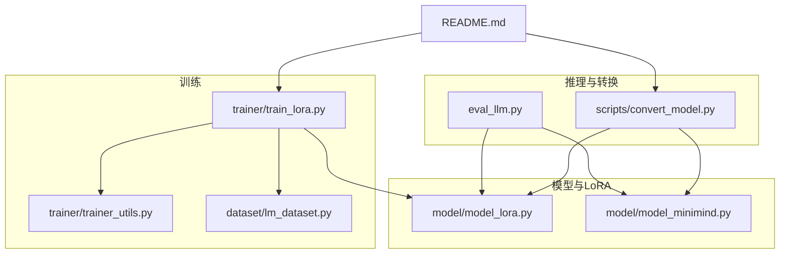
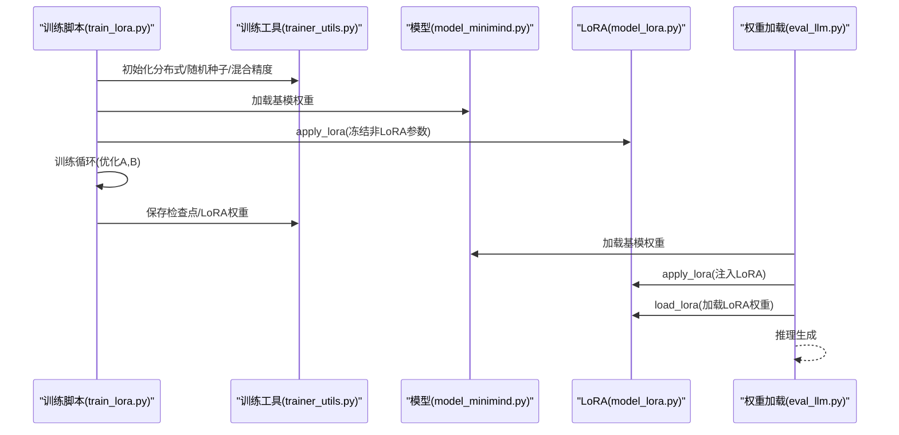
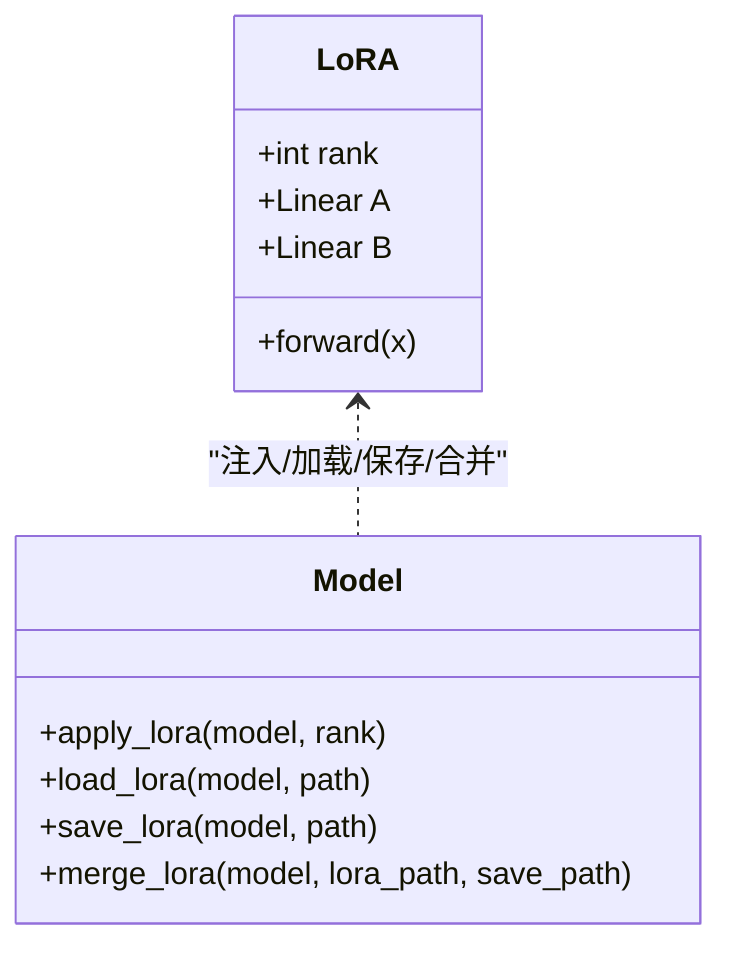
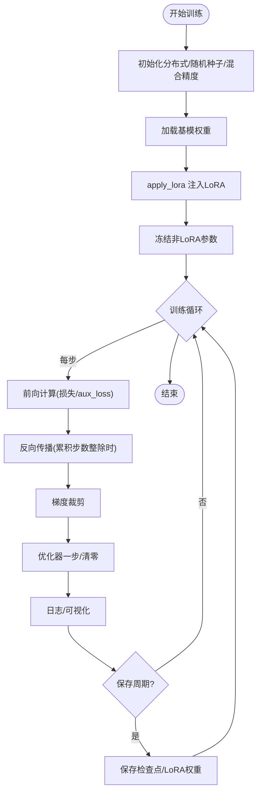
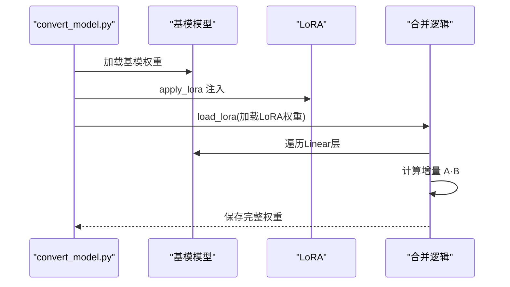
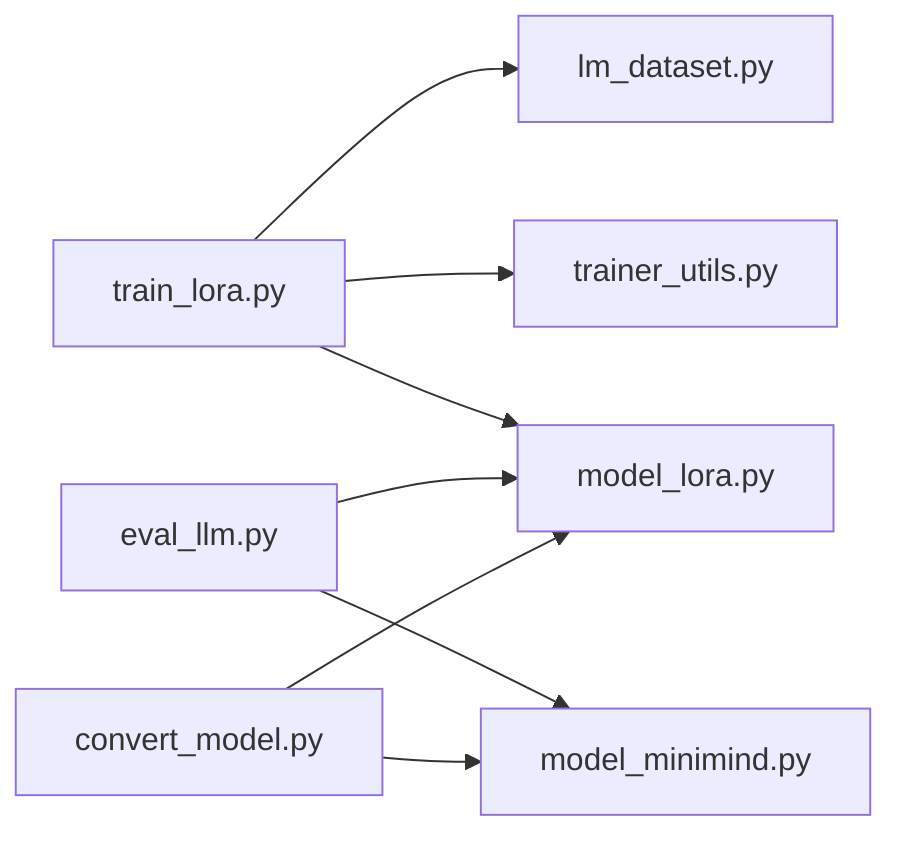

# LoRA 微调问题

<cite>
**本文引用的文件**
- [model_lora.py](file://model/model_lora.py)
- [train_lora.py](file://trainer/train_lora.py)
- [convert_model.py](file://scripts/convert_model.py)
- [eval_llm.py](file://eval_llm.py)
- [model_minimind.py](file://model/model_minimind.py)
- [trainer_utils.py](file://trainer/trainer_utils.py)
- [lm_dataset.py](file://dataset/lm_dataset.py)
- [README.md](file://README.md)
</cite>

## 目录
1. [引言](#引言)
2. [项目结构](#项目结构)
3. [核心组件](#核心组件)
4. [架构总览](#架构总览)
5. [详细组件分析](#详细组件分析)
6. [依赖分析](#依赖分析)
7. [性能考量](#性能考量)
8. [故障排查指南](#故障排查指南)
9. [结论](#结论)
10. [附录](#附录)

## 引言
本文件聚焦 MiniMind 项目中的 LoRA 微调实现与问题排查，围绕以下主题展开：
- 适配器初始化失败、秩分解矩阵配置错误、权重更新异常的诊断与修复
- LoRA 权重合并过程中的数值精度问题、权重文件格式兼容性、模型转换错误
- LoRA 训练的性能优化建议：适配器规模选择、训练稳定性提升、内存使用优化
- LoRA 与全参数微调的区别与适用场景，以及如何选择合适的 LoRA 参数配置

## 项目结构
MiniMind 的 LoRA 微调相关代码分布在以下模块：
- 模型与 LoRA 实现：model/model_lora.py
- LoRA 训练脚本：trainer/train_lora.py
- 权重合并与格式转换：scripts/convert_model.py
- 推理与 LoRA 应用：eval_llm.py
- 基础模型结构：model/model_minimind.py
- 训练工具与检查点：trainer/trainer_utils.py
- 数据集与 SFT 数据处理：dataset/lm_dataset.py
- 项目说明与 LoRA 使用说明：README.md

图表来源
- [model_lora.py:1-66](file://model/model_lora.py#L1-L66)
- [train_lora.py:1-184](file://trainer/train_lora.py#L1-L184)
- [convert_model.py:1-145](file://scripts/convert_model.py#L1-L145)
- [eval_llm.py:1-94](file://eval_llm.py#L1-L94)
- [model_minimind.py:1-280](file://model/model_minimind.py#L1-L280)
- [trainer_utils.py:1-177](file://trainer/trainer_utils.py#L1-L177)
- [lm_dataset.py:1-256](file://dataset/lm_dataset.py#L1-L256)
- [README.md:765-799](file://README.md#L765-L799)

章节来源
- [README.md:765-799](file://README.md#L765-L799)

## 核心组件
- LoRA 适配器与注入：在 Linear 层上插入低秩增量 A、B，并在 forward 中相加，实现参数高效微调
- LoRA 权重保存与加载：保存/加载仅包含 lora 子模块的状态字典，支持半精度存储
- LoRA 权重合并：将 LoRA 增量与原线性层权重相加，生成完整权重
- LoRA 训练流程：冻结非 LoRA 参数，仅训练 A、B；支持混合精度、梯度裁剪、断点续训
- 模型转换：支持将基模与 LoRA 合并为完整权重，或导出为 Transformers 格式

章节来源
- [model_lora.py:5-66](file://model/model_lora.py#L5-L66)
- [train_lora.py:24-184](file://trainer/train_lora.py#L24-L184)
- [convert_model.py:105-112](file://scripts/convert_model.py#L105-L112)

## 架构总览
LoRA 微调在 MiniMind 中的端到端流程如下：
- 训练阶段：加载基模权重，应用 LoRA 注入，冻结非 LoRA 参数，仅优化 A、B
- 推理阶段：加载基模权重，再次应用 LoRA 注入并加载 LoRA 权重，实现增量适配
- 合并阶段：将 LoRA 增量与原线性层权重相加，生成完整权重，便于部署

图表来源
- [train_lora.py:103-184](file://trainer/train_lora.py#L103-L184)
- [trainer_utils.py:119-131](file://trainer/trainer_utils.py#L119-L131)
- [model_minimind.py:229-280](file://model/model_minimind.py#L229-L280)
- [model_lora.py:21-43](file://model/model_lora.py#L21-L43)
- [eval_llm.py:12-30](file://eval_llm.py#L12-L30)

## 详细组件分析

### LoRA 适配器与注入
- 适配器结构：两个低秩线性层 A、B，分别控制输入维度到 rank、rank 到输出维度的映射
- 注入策略：遍历模型的 Linear 层，若权重形状满足方阵条件，则注入 LoRA，并重写 forward 为原 forward 与 LoRA 输出之和
- 初始化策略：A 使用高斯初始化，B 全零初始化，有助于稳定训练初期的梯度

图表来源
- [model_lora.py:6-33](file://model/model_lora.py#L6-L33)
- [model_lora.py:35-66](file://model/model_lora.py#L35-L66)

章节来源
- [model_lora.py:6-33](file://model/model_lora.py#L6-L33)

### LoRA 训练流程与参数冻结
- 冻结策略：遍历参数，仅对包含 "lora" 的参数设置 requires_grad=True，其余设为 False
- 优化器：仅传入 lora_params，避免更新基模权重
- 混合精度：支持 bfloat16/float16，配合 GradScaler 使用
- 梯度裁剪：在累积步数整除时进行裁剪，防止爆炸梯度
- 断点续训：保存模型、优化器、GradScaler、wandb/run 状态，支持跨 GPU 数量恢复

图表来源
- [train_lora.py:103-184](file://trainer/train_lora.py#L103-L184)
- [trainer_utils.py:63-117](file://trainer/trainer_utils.py#L63-L117)

章节来源
- [train_lora.py:127-184](file://trainer/train_lora.py#L127-L184)
- [trainer_utils.py:63-117](file://trainer/trainer_utils.py#L63-L117)

### 权重保存、加载与合并
- 保存：仅保存每个 Linear 层上 lora 子模块的状态字典，键名规范化为 clean_name.lora.key，值以半精度存储
- 加载：将权重字典键名前缀去除后，匹配到对应模块的 lora 子模块并加载
- 合并：加载 LoRA 权重，遍历 Linear 层，将原权重与 A·B 的增量相加，保存为完整权重

图表来源
- [convert_model.py:105-112](file://scripts/convert_model.py#L105-L112)
- [model_lora.py:35-66](file://model/model_lora.py#L35-L66)

章节来源
- [model_lora.py:44-66](file://model/model_lora.py#L44-L66)
- [convert_model.py:105-112](file://scripts/convert_model.py#L105-L112)

### 推理阶段的 LoRA 应用
- 推理时同样需要先 apply_lora 注入，再 load_lora 加载 LoRA 权重，随后进行生成
- 推理设备与 dtype 与训练保持一致，便于在不同环境下复现

章节来源
- [eval_llm.py:12-30](file://eval_llm.py#L12-L30)

## 依赖分析
- 训练脚本依赖训练工具模块进行分布式初始化、随机种子设置、检查点保存与恢复
- LoRA 注入依赖模型结构，仅对 Linear 层进行适配
- 权重合并依赖 LoRA 加载与模型结构，确保键名匹配与张量维度一致

图表来源
- [train_lora.py:1-184](file://trainer/train_lora.py#L1-L184)
- [trainer_utils.py:1-177](file://trainer/trainer_utils.py#L1-L177)
- [model_lora.py:1-66](file://model/model_lora.py#L1-L66)
- [eval_llm.py:1-94](file://eval_llm.py#L1-L94)
- [model_minimind.py:1-280](file://model/model_minimind.py#L1-L280)
- [convert_model.py:1-145](file://scripts/convert_model.py#L1-L145)

## 性能考量
- 适配器规模选择
  - rank 过小：表达能力受限，收敛困难
  - rank 过大：内存与计算开销上升，易过拟合
  - 建议：从 8/16/32 起步，结合下游任务复杂度与显存上限调整
- 训练稳定性
  - 混合精度：bfloat16/float16 可显著节省显存，注意数值范围与梯度缩放
  - 梯度裁剪：合理设置阈值，避免爆炸梯度
  - 学习率调度：余弦退火等策略有助于稳定收敛
- 内存优化
  - 仅训练 LoRA 参数，冻结基模权重，参数量占比极低
  - 推理时同样仅加载 LoRA 权重，部署成本低
  - 权重保存为半精度，减小存储与传输开销

章节来源
- [train_lora.py:85-90](file://trainer/train_lora.py#L85-L90)
- [train_lora.py:140-151](file://trainer/train_lora.py#L140-L151)
- [model_lora.py:44-53](file://model/model_lora.py#L44-L53)

## 故障排查指南

### 适配器初始化失败
- 症状
  - 注入后 forward 报错或输出异常
  - 模型参数未按预期变化
- 可能原因
  - Linear 层权重非方阵或形状不匹配
  - 设备不一致导致张量移动失败
  - 注入 forward 闭包捕获错误
- 排查步骤
  - 确认 Linear 层权重形状满足方阵条件
  - 检查模型与适配器在同一设备上
  - 验证 forward 闭包绑定的原 forward 是否存在
- 修复建议
  - 仅对满足条件的 Linear 层注入 LoRA
  - 显式将适配器移动到模型设备
  - 使用显式绑定避免闭包捕获问题

章节来源
- [model_lora.py:21-33](file://model/model_lora.py#L21-L33)

### 秩分解矩阵配置错误
- 症状
  - 训练不稳定、loss 波动大
  - 合并后权重异常或推理报错
- 可能原因
  - rank 设置不当（过大/过小）
  - A/B 初始化策略不一致
  - 键名不匹配导致加载失败
- 排查步骤
  - 检查保存的 lora 子模块键名与加载时的键名映射
  - 对比 A/B 的维度与 Linear 层输入/输出维度
  - 验证合并时 A·B 的维度一致性
- 修复建议
  - 从较小 rank 起步，逐步增大
  - 保持 A 高斯初始化、B 全零初始化策略
  - 确保键名前缀 clean_name 与模块路径一致

章节来源
- [model_lora.py:6-16](file://model/model_lora.py#L6-L16)
- [model_lora.py:35-53](file://model/model_lora.py#L35-L53)
- [model_lora.py:55-66](file://model/model_lora.py#L55-L66)

### 权重更新异常
- 症状
  - 优化器未更新基模参数（预期）
  - LoRA 参数未更新
- 可能原因
  - 参数冻结逻辑错误
  - 优化器未传入正确的参数集合
  - 混合精度缩放导致梯度未更新
- 排查步骤
  - 检查 requires_grad 标记
  - 确认优化器仅接收 lora_params
  - 检查 GradScaler 的 unscaling 与 step/update 顺序
- 修复建议
  - 严格区分 lora 与非 lora 参数
  - 在累积步数整除时执行裁剪与优化
  - 确保 scaler.update 在 step 后调用

章节来源
- [train_lora.py:138-151](file://trainer/train_lora.py#L138-L151)
- [train_lora.py:42-47](file://trainer/train_lora.py#L42-L47)
- [train_lora.py:70-76](file://trainer/train_lora.py#L70-L76)

### 数值精度问题
- 症状
  - 合并后权重数值溢出或精度丢失
  - 推理结果异常或 NaN
- 可能原因
  - 合并时 dtype 不一致
  - 半精度存储导致精度损失
- 排查步骤
  - 检查合并时张量的 dtype 与 device
  - 确认保存/加载时的半精度转换
- 修复建议
  - 合并时统一到合适 dtype（如 float32）
  - 保存时使用半精度，加载时根据需要转换

章节来源
- [model_lora.py:59-65](file://model/model_lora.py#L59-L65)
- [model_lora.py:51-52](file://model/model_lora.py#L51-L52)

### 权重文件格式兼容性
- 症状
  - 加载权重时报键名不匹配
  - 合并后权重无法保存或加载
- 可能原因
  - 模块路径前缀不一致
  - DDP 包装导致状态字典键名前缀变化
- 排查步骤
  - 检查保存与加载时的键名映射
  - 确认 DDP 包装后键名前缀处理
- 修复建议
  - 规范化键名前缀（如去除 module. 前缀）
  - 在保存/加载时统一键名处理逻辑

章节来源
- [model_lora.py:35-43](file://model/model_lora.py#L35-L43)
- [model_lora.py:44-53](file://model/model_lora.py#L44-L53)
- [trainer_utils.py:63-106](file://trainer/trainer_utils.py#L63-L106)

### 模型转换错误
- 症状
  - 转换后权重缺失或维度不匹配
  - 导出为 Transformers 格式时报错
- 可能原因
  - 基模与 LoRA 权重不匹配
  - 合并时未正确累加 A·B
- 排查步骤
  - 确认 apply_lora 注入成功
  - 检查合并逻辑中 A·B 的计算与累加
- 修复建议
  - 在合并前验证 A·B 的维度与原权重一致
  - 导出前统一 dtype 并清理无关键

章节来源
- [convert_model.py:105-112](file://scripts/convert_model.py#L105-L112)
- [model_lora.py:55-66](file://model/model_lora.py#L55-L66)

### LoRA 与全参数微调的区别与适用场景
- LoRA 优势
  - 参数量极少，训练与部署成本低
  - 易于在不同基模间迁移
- 全参数微调优势
  - 更高的表达能力，适合复杂任务
- 选择建议
  - 垂直领域微调、快速适配：优先 LoRA
  - 需要强表达能力的任务：考虑全参数微调

章节来源
- [README.md:765-799](file://README.md#L765-L799)

## 结论
MiniMind 的 LoRA 实现以纯原生 PyTorch 实现，具备良好的可控性与可移植性。通过严格的参数冻结、半精度存储与合并逻辑，能够在保证性能的同时显著降低训练与部署成本。针对常见问题，建议从适配器初始化、秩配置、权重键名映射与数值精度等方面入手排查，并结合训练稳定性与内存优化策略进行调优。

## 附录
- 训练参数建议
  - rank：8/16/32 起步，结合显存与任务复杂度调整
  - dtype：bfloat16/float16，注意缩放与裁剪
  - accumulation_steps：适当增大以提升吞吐
- 推理与部署
  - 推理时同样需要注入 LoRA 并加载权重
  - 合并为完整权重后可直接部署或转换为 Transformers 格式