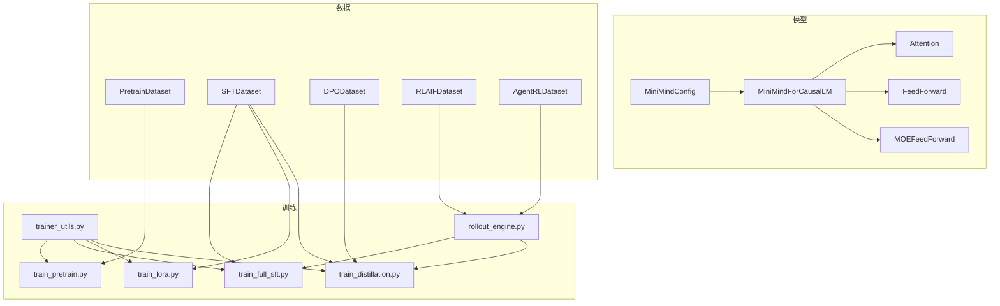
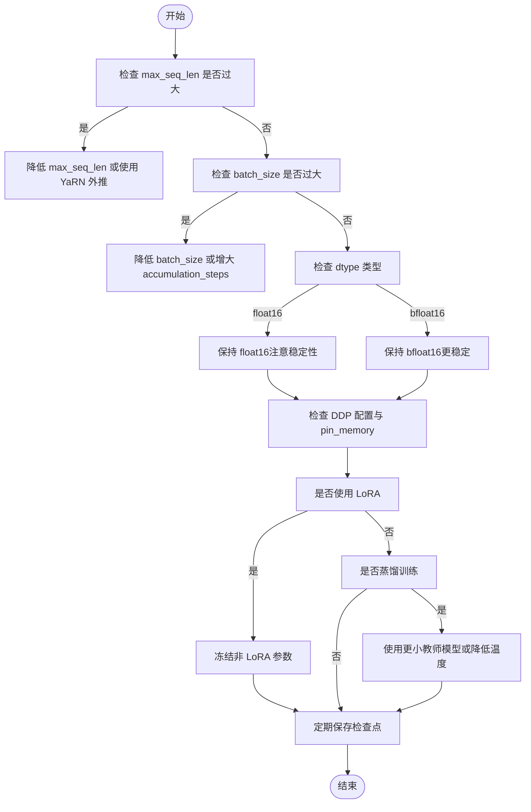
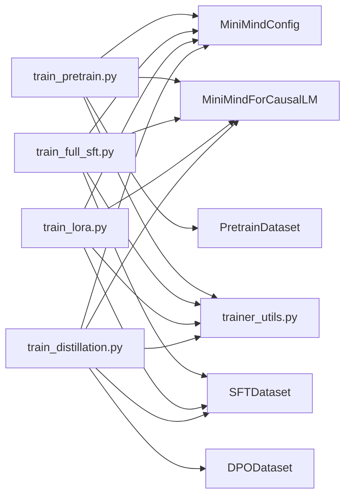

# 内存与性能问题

<cite>
**本文引用的文件**   
- [README.md](file://README.md)
- [requirements.txt](file://requirements.txt)
- [model_minimind.py](file://model/model_minimind.py)
- [model_lora.py](file://model/model_lora.py)
- [lm_dataset.py](file://dataset/lm_dataset.py)
- [trainer_utils.py](file://trainer/trainer_utils.py)
- [train_pretrain.py](file://trainer/train_pretrain.py)
- [train_full_sft.py](file://trainer/train_full_sft.py)
- [train_lora.py](file://trainer/train_lora.py)
- [train_distillation.py](file://trainer/train_distillation.py)
- [rollout_engine.py](file://trainer/rollout_engine.py)
</cite>

## 目录
1. [引言](#引言)
2. [项目结构](#项目结构)
3. [核心组件](#核心组件)
4. [架构总览](#架构总览)
5. [详细组件分析](#详细组件分析)
6. [依赖分析](#依赖分析)
7. [性能考量](#性能考量)
8. [故障排查指南](#故障排查指南)
9. [结论](#结论)
10. [附录](#附录)

## 引言
本文件聚焦 MiniMind 训练过程中的内存管理与性能优化，围绕显存溢出的常见诱因与对策展开，涵盖批量大小调整、梯度累积、混合精度、CPU 内存优化、数据加载性能、分布式训练内存分配策略、训练性能监控与硬件参数调优等主题。文档以训练脚本与核心模型/数据模块为依据，结合可视化图示，帮助读者在不同硬件条件下制定稳健的训练策略。

## 项目结构
- 模型与配置：model/model_minimind.py 定义 MiniMindConfig、MiniMindForCausalLM、Attention、FeedForward、MOEFeedForward 等核心结构；model/model_lora.py 提供 LoRA 注入与合并逻辑。
- 数据集：dataset/lm_dataset.py 提供 PretrainDataset、SFTDataset、DPODataset、RLAIFDataset、AgentRLDataset 等数据集实现。
- 训练脚本：trainer/train_pretrain.py、trainer/train_full_sft.py、trainer/train_lora.py、trainer/train_distillation.py 等，统一采用混合精度、梯度累积、DDP 分布式、断点续训等机制。
- 工具函数：trainer/trainer_utils.py 提供分布式初始化、随机种子、检查点保存/恢复、SkipBatchSampler 等。
- 推理与回放：trainer/rollout_engine.py 提供可插拔的回放引擎，支持外部推理服务（如 SGLang/vLLM/llama.cpp）。



**图表来源**
- [model_minimind.py:10-45](file://model/model_minimind.py#L10-L45)
- [model_minimind.py:195-246](file://model/model_minimind.py#L195-L246)
- [lm_dataset.py:37-120](file://dataset/lm_dataset.py#L37-L120)
- [lm_dataset.py:122-224](file://dataset/lm_dataset.py#L122-L224)
- [train_pretrain.py:82-106](file://trainer/train_pretrain.py#L82-L106)
- [train_full_sft.py:83-107](file://trainer/train_full_sft.py#L83-L107)
- [train_lora.py:77-101](file://trainer/train_lora.py#L77-L101)
- [train_distillation.py:145-176](file://trainer/train_distillation.py#L145-L176)
- [trainer_utils.py:44-62](file://trainer/trainer_utils.py#L44-L62)
- [rollout_engine.py:1-31](file://trainer/rollout_engine.py#L1-L31)

**章节来源**
- [README.md:216-367](file://README.md#L216-L367)
- [requirements.txt:1-32](file://requirements.txt#L1-L32)

## 核心组件
- 混合精度与自动混合精度（AMP）
  - 训练脚本通过 autocast_ctx 与 GradScaler 控制前向计算与反向传播的数值范围，dtype 支持 bfloat16/float16（CPU 模式降级为 nullcontext）。
  - AMP 在不牺牲精度的前提下显著降低显存占用与提升吞吐。
- 梯度累积
  - 通过 accumulation_steps 将小批量多次反向累积，模拟大 batch 效果，缓解显存压力。
- 分布式数据并行（DDP）
  - 使用 torch.distributed 初始化 NCCL 后端，配合 DistributedDataParallel 包装模型；忽略某些缓冲（如 freqs_cos/sin）以减少同步开销。
- 断点续训与检查点
  - lm_checkpoint 统一保存模型、优化器、scaler、wandb run id 与 step，支持跨 GPU 数量恢复与自动转换 step。
- 数据加载与采样
  - DataLoader 使用 pin_memory、num_workers；SkipBatchSampler 支持跳过已完成 step，实现断点续训。
- LoRA 参数高效微调
  - 仅训练低秩增量参数，冻结主干权重，显著降低显存与计算开销。
- 蒸馏训练
  - 支持 CE + KL 混合损失，温度缩放，支持 MoE 辅助损失。

**章节来源**
- [train_pretrain.py:118-121](file://trainer/train_pretrain.py#L118-L121)
- [train_full_sft.py:119-122](file://trainer/train_full_sft.py#L119-L122)
- [train_lora.py:113-116](file://trainer/train_lora.py#L113-L116)
- [train_distillation.py:24-36](file://trainer/train_distillation.py#L24-L36)
- [trainer_utils.py:63-106](file://trainer/trainer_utils.py#L63-L106)
- [trainer_utils.py:134-157](file://trainer/trainer_utils.py#L134-L157)
- [model_lora.py:21-33](file://model/model_lora.py#L21-L33)

## 架构总览
MiniMind 训练流水线以“数据 → 模型 → 优化器/梯度累积 → 混合精度 → 分布式 → 检查点/日志”为主线，贯穿预训练、SFT、LoRA、蒸馏等阶段。回放引擎可替换为外部推理服务，提升 RLHF/RLAIF 训练吞吐。

```mermaid
sequenceDiagram
participant U as "用户"
participant TP as "train_pretrain.py"
participant TU as "trainer_utils.py"
participant DS as "PretrainDataset"
participant DL as "DataLoader"
participant AMP as "Autocast/GradScaler"
participant M as "MiniMindForCausalLM"
participant OPT as "AdamW"
participant CKP as "lm_checkpoint"
U->>TP : 启动训练
TP->>TU : init_distributed_mode()/setup_seed()
TP->>DS : 初始化数据集
TP->>DL : 构造DataLoader(pin_memory,num_workers)
loop 每个epoch
DL-->>TP : (input_ids, labels)
TP->>AMP : autocast + scaler.scale(loss)
AMP->>M : 前向计算
M-->>AMP : loss/logits
AMP->>OPT : 反向与clip_grad
OPT-->>AMP : 更新参数
AMP-->>TP : scaler.step/update
TP->>CKP : 定期保存检查点
end
```

**图表来源**
- [train_pretrain.py:108-170](file://trainer/train_pretrain.py#L108-L170)
- [trainer_utils.py:44-62](file://trainer/trainer_utils.py#L44-L62)
- [lm_dataset.py:37-56](file://dataset/lm_dataset.py#L37-L56)

**章节来源**
- [train_pretrain.py:82-170](file://trainer/train_pretrain.py#L82-L170)
- [train_full_sft.py:83-171](file://trainer/train_full_sft.py#L83-L171)
- [train_lora.py:77-184](file://trainer/train_lora.py#L77-L184)
- [train_distillation.py:145-246](file://trainer/train_distillation.py#L145-L246)

## 详细组件分析

### 显存溢出的常见原因与对策
- 输入序列过长（max_seq_len）
  - 预训练默认 max_seq_len≈340，SFT 默认≈768；过长会导致注意力与KV缓存内存飙升。建议按硬件能力下调，或采用 YaRN 外推（推理阶段）。
- 批量大小过大（batch_size）
  - 预训练 batch_size=32，SFT/Lora/蒸馏默认 16/32/32；显存紧张时优先减小 batch_size，再配合梯度累积。
- 梯度累积步数不当
  - accumulation_steps 默认预训练=8，SFT/Lora/蒸馏=1；增大可降低峰值显存，但会增加步数与总时间。
- 混合精度类型
  - dtype=bfloat16/float16；float16 在部分硬件上更省显存，但需注意数值稳定性。
- 分布式同步与缓冲
  - DDP 会同步参数与缓冲，忽略 freqs_cos/sin 减少同步开销；确保 num_workers 与 pin_memory 合理配置。
- LoRA 参数高效微调
  - 仅训练低秩参数，显著降低显存与计算；注意冻结非 LoRA 参数，避免无效梯度。
- 蒸馏训练
  - 同时前向教师与学生模型，显存压力加倍；可降低 batch_size 或使用更小教师模型。



**图表来源**
- [train_pretrain.py:87-98](file://trainer/train_pretrain.py#L87-L98)
- [train_full_sft.py:88-99](file://trainer/train_full_sft.py#L88-L99)
- [train_lora.py:82-93](file://trainer/train_lora.py#L82-L93)
- [train_distillation.py:150-172](file://trainer/train_distillation.py#L150-L172)
- [trainer_utils.py:63-106](file://trainer/trainer_utils.py#L63-L106)

**章节来源**
- [train_pretrain.py:87-106](file://trainer/train_pretrain.py#L87-L106)
- [train_full_sft.py:88-107](file://trainer/train_full_sft.py#L88-L107)
- [train_lora.py:82-101](file://trainer/train_lora.py#L82-L101)
- [train_distillation.py:150-176](file://trainer/train_distillation.py#L150-L176)
- [model_lora.py:21-33](file://model/model_lora.py#L21-L33)

### CPU 内存使用优化
- 数据加载
  - 使用 pin_memory=True 与合理 num_workers，减少 CPU→GPU 传输阻塞；数据集类中已禁用 tokenizers 并行以避免额外内存碎片。
- 检查点保存
  - lm_checkpoint 在主进程中保存，使用 .tmp + os.replace 原子写入，降低磁盘 IO 抖动；保存时将权重转半精度（.half().cpu()）以节省磁盘与内存。
- 随机种子与确定性
  - setup_seed 固定随机源，避免重复计算与缓存抖动。

**章节来源**
- [lm_dataset.py](file://dataset/lm_dataset.py#L7)
- [trainer_utils.py:63-106](file://trainer/trainer_utils.py#L63-L106)
- [trainer_utils.py:54-61](file://trainer/trainer_utils.py#L54-L61)

### 数据加载性能提升
- DataLoader
  - pin_memory=True、num_workers>0；结合 SkipBatchSampler 跳过已完成 step，避免重复计算。
- 数据集预处理
  - SFTDataset 使用 apply_chat_template 与 loss mask 精准标注，减少无效 token 计算；预处理在 __getitem__ 中完成，避免额外中间变量。
- 推理回放
  - rollout_engine 支持外部推理服务（SGLang/vLLM/llama.cpp），通过 OpenAI 兼容 API 提升吞吐，降低训练时的推理开销。

**章节来源**
- [train_pretrain.py](file://trainer/train_pretrain.py#L162)
- [train_full_sft.py](file://trainer/train_full_sft.py#L163)
- [train_lora.py](file://trainer/train_lora.py#L176)
- [lm_dataset.py:106-119](file://dataset/lm_dataset.py#L106-L119)
- [rollout_engine.py:1-31](file://trainer/rollout_engine.py#L1-L31)

### 分布式训练的内存分配策略
- DDP 初始化与设备设置
  - NCCL 后端、本地 rank 设备绑定；忽略 freqs_cos/sin 缓冲参与同步，减少通信与内存压力。
- 梯度同步与裁剪
  - 每步 scaler.unscale_ 后 clip_grad_norm，避免异常梯度放大导致显存峰值过高。
- 检查点跨 GPU 恢复
  - lm_checkpoint 自动转换 step，适配不同 world_size，避免重复训练。

**章节来源**
- [trainer_utils.py:44-51](file://trainer/trainer_utils.py#L44-L51)
- [train_full_sft.py:153-155](file://trainer/train_full_sft.py#L153-L155)
- [trainer_utils.py:107-116](file://trainer/trainer_utils.py#L107-L116)

### 训练性能监控方法
- 日志与 ETA
  - 训练脚本每 log_interval 输出 loss、aux_loss、logits_loss、学习率与 ETA（分钟），便于评估收敛速度。
- 可视化
  - 默认使用 SwanLab（兼容 WandB）记录 loss、学习率、epoch_time 等指标；支持断点续训的 run 恢复。
- 混合精度与 torch.compile
  - AMP 降低显存与提升吞吐；部分脚本支持 torch.compile（LoRA 脚本中已提示与 monkey-patch 不兼容）。

**章节来源**
- [train_pretrain.py:50-58](file://trainer/train_pretrain.py#L50-L58)
- [train_full_sft.py:50-58](file://trainer/train_full_sft.py#L50-L58)
- [train_lora.py:163-166](file://trainer/train_lora.py#L163-L166)
- [README.md:360-367](file://README.md#L360-L367)

### 不同硬件配置下的最优训练参数设置
- 单卡（如 RTX 3090/4090）
  - 预训练：max_seq_len≈340，batch_size=32，accumulation_steps=8；dtype=bfloat16。
  - SFT：max_seq_len≈768，batch_size=16，accumulation_steps=1；dtype=bfloat16。
  - LoRA：max_seq_len≈340，batch_size=32，accumulation_steps=1；dtype=bfloat16。
  - 蒸馏：降低 batch_size 或使用更小教师模型，dtype=bfloat16。
- 多卡（DDP）
  - 保持全局 batch 一致，按 GPU 数量线性提升 batch_size；注意 num_workers 与 pin_memory；忽略 freqs_cos/sin 同步。
- CPU/GPU 混合
  - AMP 降级为 nullcontext；适当降低 num_workers 与 pin_memory；优先使用 LoRA 降低显存。

**章节来源**
- [train_pretrain.py:87-98](file://trainer/train_pretrain.py#L87-L98)
- [train_full_sft.py:88-99](file://trainer/train_full_sft.py#L88-L99)
- [train_lora.py:82-93](file://trainer/train_lora.py#L82-L93)
- [train_distillation.py:150-172](file://trainer/train_distillation.py#L150-L172)
- [trainer_utils.py:119-131](file://trainer/trainer_utils.py#L119-L131)

## 依赖分析
- 训练脚本依赖
  - 模型配置与模型：MiniMindConfig、MiniMindForCausalLM。
  - 数据集：PretrainDataset/SFTDataset/DPODataset/RLAIFDataset/AgentRLDataset。
  - 工具：init_distributed_mode、setup_seed、lm_checkpoint、SkipBatchSampler。
- 外部依赖
  - transformers、torch、datasets、swanlab/wandb、ujson、einops 等。



**图表来源**
- [train_pretrain.py:16-18](file://trainer/train_pretrain.py#L16-L18)
- [train_full_sft.py:16-18](file://trainer/train_full_sft.py#L16-L18)
- [train_lora.py:16-19](file://trainer/train_lora.py#L16-L19)
- [train_distillation.py:16-19](file://trainer/train_distillation.py#L16-L19)
- [model_minimind.py:10-45](file://model/model_minimind.py#L10-L45)
- [model_minimind.py:229-246](file://model/model_minimind.py#L229-L246)
- [lm_dataset.py:37-120](file://dataset/lm_dataset.py#L37-L120)
- [lm_dataset.py:122-174](file://dataset/lm_dataset.py#L122-L174)

**章节来源**
- [requirements.txt:1-32](file://requirements.txt#L1-L32)

## 性能考量
- 显存与吞吐权衡
  - AMP 与梯度累积是降低显存的关键手段；在允许的情况下提高 accumulation_steps 可换取更稳定的训练。
- 数据加载瓶颈
  - num_workers 与 pin_memory 需结合 CPU/IO 能力调优；数据集预处理尽量在 __getitem__ 中完成，避免额外拷贝。
- 分布式效率
  - NCCL 后端、忽略非必要缓冲同步、合理的 world_size 与 batch_size 分配，可显著提升多卡效率。
- 推理回放
  - 使用 SGLang/vLLM/llama.cpp 等高性能推理引擎，可降低 RLHF/RLAIF 训练时的回放延迟与显存占用。

[本节为通用指导，无需列出具体文件来源]

## 故障排查指南
- 显存不足（OOM）
  - 降低 max_seq_len、batch_size；增大 accumulation_steps；启用 AMP；使用 LoRA；减少 num_workers 或关闭 pin_memory。
- 学习率/梯度问题
  - 检查 get_lr 余弦退火调度是否合理；确保 clip_grad_norm 阈值合适；确认 scaler.unscale_ 与 step/update 顺序。
- 分布式异常
  - 确认 NCCL 环境变量与后端；检查 LOCAL_RANK 与设备绑定；忽略 freqs_cos/sin 同步；核对 world_size 与 step 恢复逻辑。
- 检查点恢复失败
  - 确认 resume 文件存在且与当前 world_size 匹配；必要时手动调整 step；确保权重键名与 state_dict 一致。

**章节来源**
- [trainer_utils.py:63-106](file://trainer/trainer_utils.py#L63-L106)
- [trainer_utils.py:107-116](file://trainer/trainer_utils.py#L107-L116)
- [train_full_sft.py:153-155](file://trainer/train_full_sft.py#L153-L155)

## 结论
MiniMind 在训练脚本中内置了混合精度、梯度累积、DDP 分布式、断点续训等成熟优化手段。针对显存溢出，建议优先从 max_seq_len 与 batch_size 入手，辅以 AMP、LoRA 与合理的 num_workers/pin_memory 配置。通过 SwanLab/W&B 可视化与 ETA 日志，可有效评估训练性能并及时调整策略。在不同硬件条件下，按上述参数建议进行迭代，可在保证稳定性的同时最大化训练效率。

## 附录
- 参考硬件与时间成本
  - README 提供单卡 3090 的预估训练时长与成本，可据此规划资源与参数。
- 推理与回放
  - rollout_engine 支持外部推理服务，便于在 RLHF/RLAIF 场景中提升吞吐与降低成本。

**章节来源**
- [README.md:618-647](file://README.md#L618-L647)
- [rollout_engine.py:1-31](file://trainer/rollout_engine.py#L1-L31)