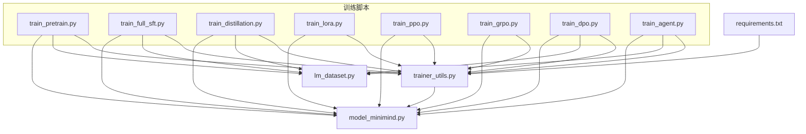
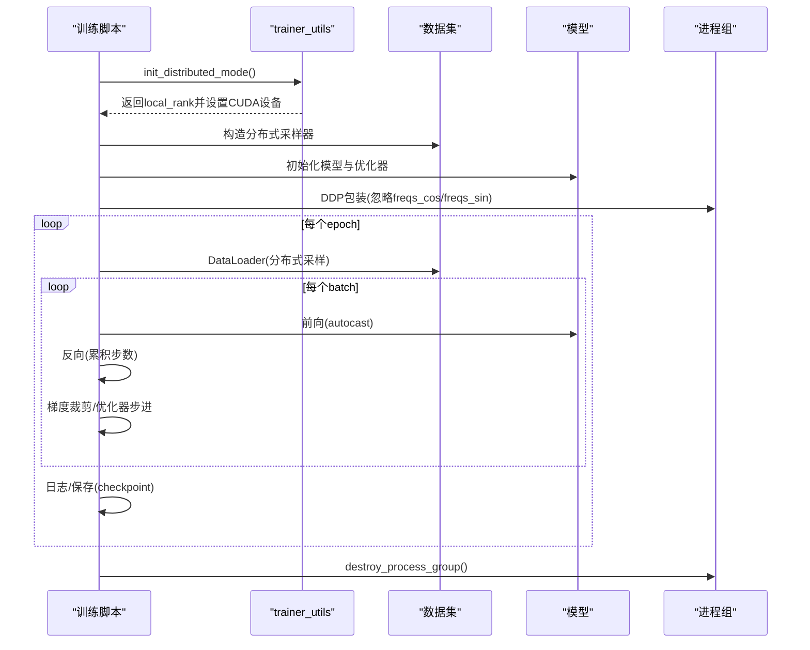
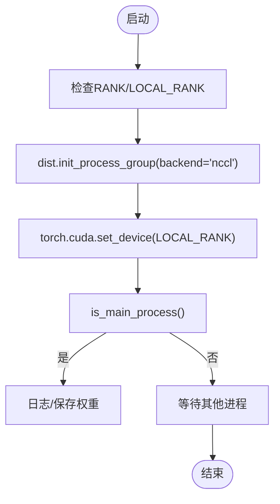
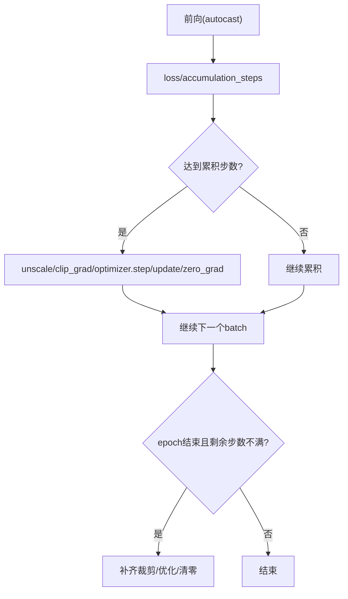
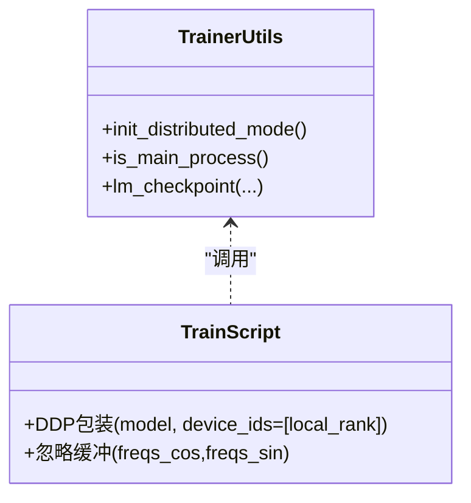
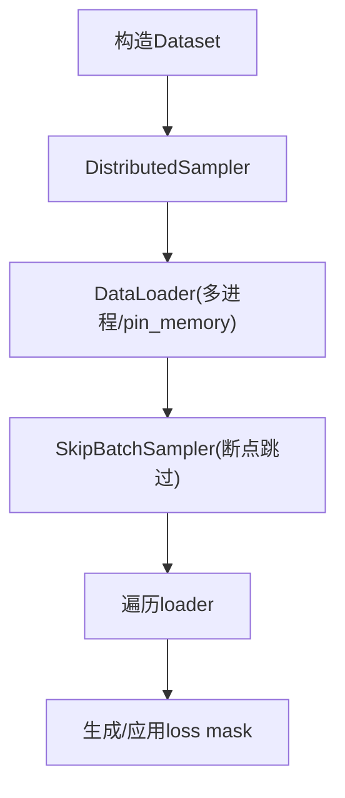
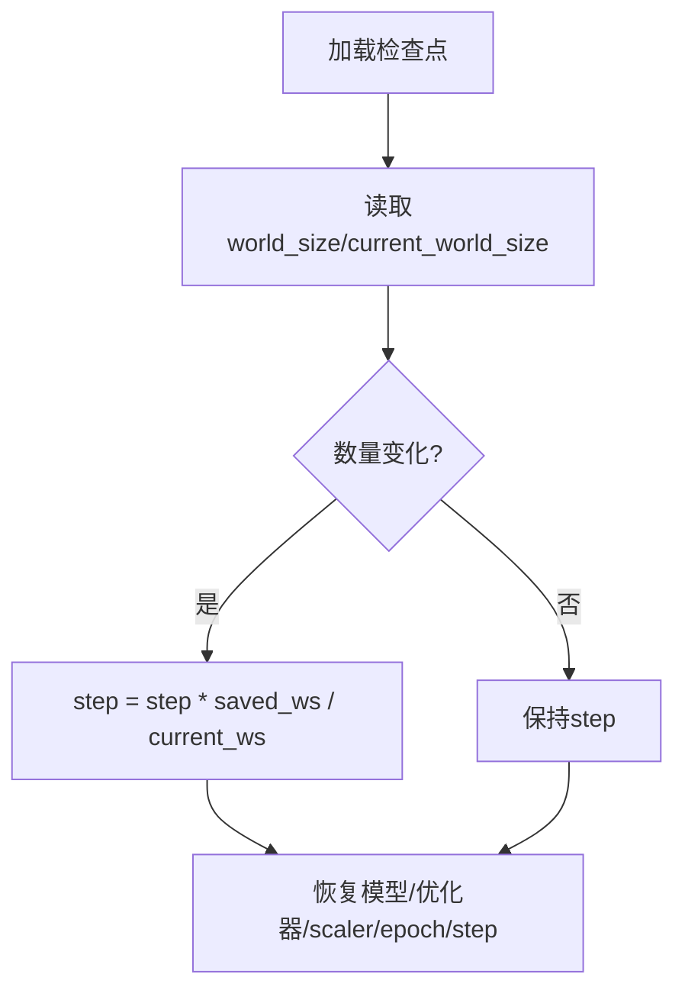
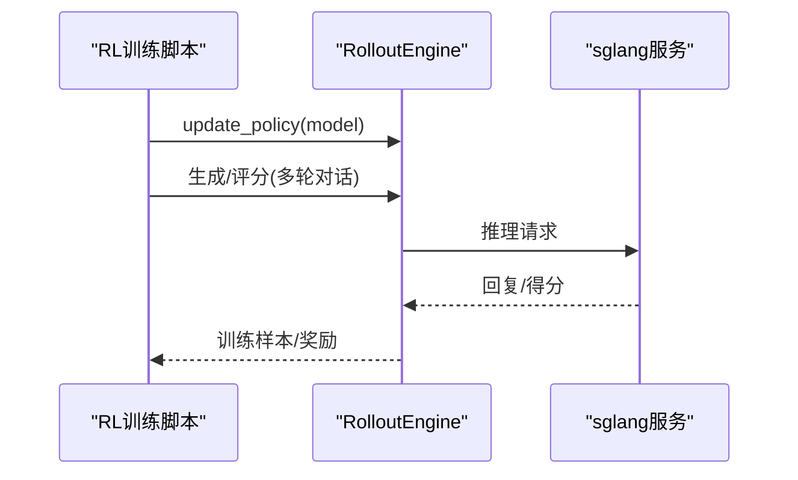
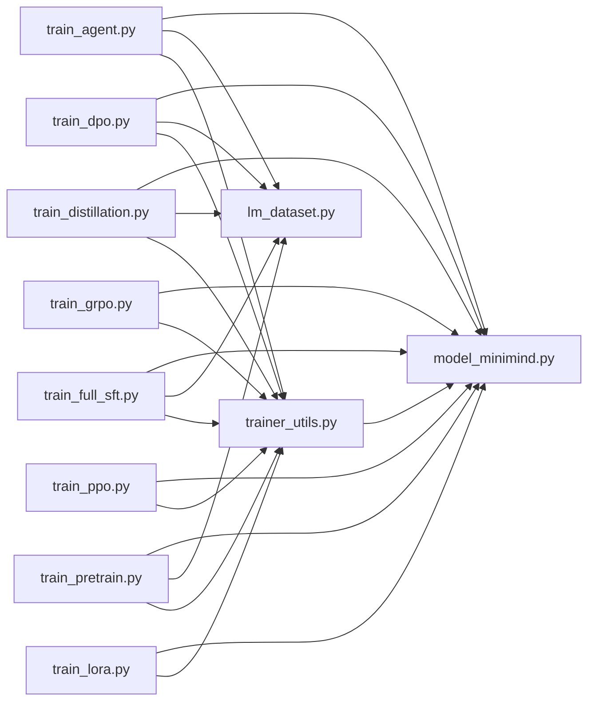

# 分布式训练问题

<cite>
**本文引用的文件**   
- [README.md](file://README.md)
- [requirements.txt](file://requirements.txt)
- [trainer/trainer_utils.py](file://trainer/trainer_utils.py)
- [trainer/train_pretrain.py](file://trainer/train_pretrain.py)
- [trainer/train_full_sft.py](file://trainer/train_full_sft.py)
- [trainer/train_distillation.py](file://trainer/train_distillation.py)
- [trainer/train_lora.py](file://trainer/train_lora.py)
- [trainer/train_ppo.py](file://trainer/train_ppo.py)
- [trainer/train_grpo.py](file://trainer/train_grpo.py)
- [trainer/train_dpo.py](file://trainer/train_dpo.py)
- [trainer/train_agent.py](file://trainer/train_agent.py)
- [trainer/rollout_engine.py](file://trainer/rollout_engine.py)
- [dataset/lm_dataset.py](file://dataset/lm_dataset.py)
- [model/model_minimind.py](file://model/model_minimind.py)
</cite>

## 目录
1. [引言](#引言)
2. [项目结构](#项目结构)
3. [核心组件](#核心组件)
4. [架构总览](#架构总览)
5. [详细组件分析](#详细组件分析)
6. [依赖分析](#依赖分析)
7. [性能考量](#性能考量)
8. [故障排查指南](#故障排查指南)
9. [结论](#结论)
10. [附录](#附录)

## 引言
本文件聚焦 MiniMind 项目的分布式训练（DDP）问题排查与配置实践，覆盖多 GPU 训练中的常见问题：进程同步失败、梯度通信异常、GPU 内存分配不均等；并提供 NCCL 后端设置、进程间通信优化、rank 0 日志分析、错误传播与负载均衡检查、不同集群环境适配与节点故障恢复等实操要点。内容基于仓库内训练脚本、工具函数与模型实现，确保读者可据此快速定位与解决分布式训练问题。

## 项目结构
- 训练入口集中在 trainer 目录，包含预训练、SFT、蒸馏、LoRA、PPO、GRPO、DPO、Agent RL 等脚本，统一采用 torchrun 启动，支持多卡（NVIDIA GPUs）DDP。
- 分布式训练通用逻辑集中在 trainer/trainer_utils.py，包括初始化 DDP、主进程判定、断点续训、混合精度与梯度累积等。
- 数据加载与预处理在 dataset/lm_dataset.py，SFT/预训练等数据格式与掩码策略影响分布式训练稳定性。
- 模型结构在 model/model_minimind.py，包含 RoPE、注意力与 MoE（可选）等，部分缓冲（如 freqs_cos/freqs_sin）在 DDP 中被显式忽略以避免通信开销。

**图表来源**
- [trainer/train_pretrain.py:1-170](file://trainer/train_pretrain.py#L1-L170)
- [trainer/train_full_sft.py:1-171](file://trainer/train_full_sft.py#L1-L171)
- [trainer/train_distillation.py:1-246](file://trainer/train_distillation.py#L1-L246)
- [trainer/train_lora.py:1-184](file://trainer/train_lora.py#L1-L184)
- [trainer/train_ppo.py:436-444](file://trainer/train_ppo.py#L436-L444)
- [trainer/train_grpo.py:319-332](file://trainer/train_grpo.py#L319-L332)
- [trainer/train_dpo.py:214-226](file://trainer/train_dpo.py#L214-L226)
- [trainer/train_agent.py:443-487](file://trainer/train_agent.py#L443-L487)
- [trainer/trainer_utils.py:1-177](file://trainer/trainer_utils.py#L1-L177)
- [dataset/lm_dataset.py:1-256](file://dataset/lm_dataset.py#L1-L256)
- [model/model_minimind.py:1-280](file://model/model_minimind.py#L1-L280)
- [requirements.txt:1-32](file://requirements.txt#L1-L32)

**章节来源**
- [README.md:350-370](file://README.md#L350-L370)
- [requirements.txt:1-32](file://requirements.txt#L1-L32)
- [trainer/trainer_utils.py:44-51](file://trainer/trainer_utils.py#L44-L51)

## 核心组件
- 分布式初始化与设备绑定
  - 通过环境变量 RANK/LOCAL_RANK 初始化进程组（NCCL 后端），并设置本地 GPU 设备。
  - 主进程判定：rank 为 0 或未初始化时视为主进程，仅主进程打印日志与保存模型。
- 断点续训与世界规模恢复
  - 检查点包含模型、优化器、标量状态与 world_size；当 GPU 数量变化时自动换算 step，保障跨 GPU 数恢复。
- 混合精度与梯度累积
  - 根据 dtype 选择 autocast 类型；通过 accumulation_steps 控制梯度累积步数，配合 GradScaler。
- DDP 包装与缓冲忽略
  - 对模型进行 DistributedDataParallel 包装；对 freqs_cos/freqs_sin 等缓冲显式忽略，避免不必要的通信。
- 数据加载与分布式采样
  - 使用 DistributedSampler 保证每卡数据不重复；结合 SkipBatchSampler 支持断点跳过前若干步。

**章节来源**
- [trainer/trainer_utils.py:31-51](file://trainer/trainer_utils.py#L31-L51)
- [trainer/trainer_utils.py:63-116](file://trainer/trainer_utils.py#L63-L116)
- [trainer/train_pretrain.py:148-154](file://trainer/train_pretrain.py#L148-L154)
- [trainer/train_full_sft.py:149-155](file://trainer/train_full_sft.py#L149-L155)
- [trainer/train_distillation.py:224-230](file://trainer/train_distillation.py#L224-L230)
- [trainer/train_lora.py:162-168](file://trainer/train_lora.py#L162-L168)
- [trainer/train_ppo.py:436-444](file://trainer/train_ppo.py#L436-L444)
- [trainer/train_grpo.py:319-332](file://trainer/train_grpo.py#L319-L332)
- [trainer/train_dpo.py:214-226](file://trainer/train_dpo.py#L214-L226)
- [trainer/train_agent.py:470-472](file://trainer/train_agent.py#L470-L472)

## 架构总览
下图展示典型训练脚本的 DDP 流程：初始化 DDP → 构造模型与优化器 → 包装 DDP → 分布式采样 → 前向/反向/优化 → 保存检查点 → 销毁进程组。

**图表来源**
- [trainer/trainer_utils.py:44-51](file://trainer/trainer_utils.py#L44-L51)
- [trainer/train_pretrain.py:132-154](file://trainer/train_pretrain.py#L132-L154)
- [trainer/train_full_sft.py:133-155](file://trainer/train_full_sft.py#L133-L155)
- [trainer/train_distillation.py:203-230](file://trainer/train_distillation.py#L203-L230)
- [trainer/train_lora.py:127-168](file://trainer/train_lora.py#L127-L168)

## 详细组件分析

### 分布式初始化与进程组
- 环境变量约定：RANK、LOCAL_RANK；NCCL 后端；CUDA 设备绑定。
- 主进程判定：仅 rank 0 输出日志与保存权重，避免重复写入。
- 世界规模与步数恢复：检查点记录 world_size，跨 GPU 数恢复时自动换算 step。

**图表来源**
- [trainer/trainer_utils.py:44-51](file://trainer/trainer_utils.py#L44-L51)
- [trainer/trainer_utils.py:31-37](file://trainer/trainer_utils.py#L31-L37)

**章节来源**
- [trainer/trainer_utils.py:44-51](file://trainer/trainer_utils.py#L44-L51)
- [trainer/trainer_utils.py:31-37](file://trainer/trainer_utils.py#L31-L37)

### 混合精度与梯度累积
- autocast 类型依据 dtype；GradScaler 在 FP16/BF16 下启用。
- accumulation_steps 控制反向累计次数，最后统一优化器步进与清零梯度。
- 未满累积步数时，训练末尾补齐一次裁剪与优化。

**图表来源**
- [trainer/train_pretrain.py:34-48](file://trainer/train_pretrain.py#L34-L48)
- [trainer/train_full_sft.py:34-48](file://trainer/train_full_sft.py#L34-L48)
- [trainer/train_distillation.py:94-101](file://trainer/train_distillation.py#L94-L101)

**章节来源**
- [trainer/train_pretrain.py:34-48](file://trainer/train_pretrain.py#L34-L48)
- [trainer/train_full_sft.py:34-48](file://trainer/train_full_sft.py#L34-L48)
- [trainer/train_distillation.py:94-101](file://trainer/train_distillation.py#L94-L101)

### DDP 包装与缓冲忽略
- 对模型进行 DistributedDataParallel 包装，device_ids 指定本地 GPU。
- 显式忽略 freqs_cos/freqs_sin 缓冲，避免参与通信，降低 NCCL 通信开销。

**图表来源**
- [trainer/trainer_utils.py:44-51](file://trainer/trainer_utils.py#L44-L51)
- [trainer/train_pretrain.py:153-154](file://trainer/train_pretrain.py#L153-L154)
- [trainer/train_full_sft.py:153-155](file://trainer/train_full_sft.py#L153-L155)
- [trainer/train_distillation.py:229-230](file://trainer/train_distillation.py#L229-L230)
- [trainer/train_lora.py:167-168](file://trainer/train_lora.py#L167-L168)

**章节来源**
- [trainer/train_pretrain.py:153-154](file://trainer/train_pretrain.py#L153-L154)
- [trainer/train_full_sft.py:153-155](file://trainer/train_full_sft.py#L153-L155)
- [trainer/train_distillation.py:229-230](file://trainer/train_distillation.py#L229-L230)
- [trainer/train_lora.py:167-168](file://trainer/train_lora.py#L167-L168)

### 数据加载与分布式采样
- 使用 DistributedSampler 保证每卡样本唯一；结合 SkipBatchSampler 支持断点跳过若干步。
- SFT 数据标签掩码策略：仅对 assistant 回复区域计算损失，避免对系统/用户消息的 token 参与损失。

**图表来源**
- [dataset/lm_dataset.py:58-119](file://dataset/lm_dataset.py#L58-L119)
- [trainer/train_full_sft.py:135-136](file://trainer/train_full_sft.py#L135-L136)
- [trainer/train_dpo.py:214-218](file://trainer/train_dpo.py#L214-L218)

**章节来源**
- [dataset/lm_dataset.py:58-119](file://dataset/lm_dataset.py#L58-L119)
- [trainer/train_full_sft.py:135-136](file://trainer/train_full_sft.py#L135-L136)
- [trainer/train_dpo.py:214-218](file://trainer/train_dpo.py#L214-L218)

### 断点续训与世界规模恢复
- 检查点包含模型、优化器、scaler、epoch、step、world_size 与 wandb_id；跨 GPU 数恢复时自动换算 step。
- 支持自动检测并恢复训练进度，适合长时间训练或不稳定环境。

**图表来源**
- [trainer/trainer_utils.py:107-116](file://trainer/trainer_utils.py#L107-L116)

**章节来源**
- [trainer/trainer_utils.py:63-116](file://trainer/trainer_utils.py#L63-L116)

### 强化学习与外部推理引擎
- PPO/GRPO/Agent RL 使用 rollout_engine，支持 sglang 推理后端；训练脚本中对 DDP 包装与主进程更新策略。
- 注意：SGLANG 服务需与训练节点网络互通，端口与主机需正确配置。

**图表来源**
- [trainer/train_ppo.py:436-444](file://trainer/train_ppo.py#L436-L444)
- [trainer/train_grpo.py:319-332](file://trainer/train_grpo.py#L319-L332)
- [trainer/train_agent.py:443-473](file://trainer/train_agent.py#L443-L473)
- [trainer/rollout_engine.py:1-31](file://trainer/rollout_engine.py#L1-L31)

**章节来源**
- [trainer/train_ppo.py:436-444](file://trainer/train_ppo.py#L436-L444)
- [trainer/train_grpo.py:319-332](file://trainer/train_grpo.py#L319-L332)
- [trainer/train_agent.py:443-473](file://trainer/train_agent.py#L443-L473)
- [trainer/rollout_engine.py:1-31](file://trainer/rollout_engine.py#L1-L31)

## 依赖分析
- 训练脚本统一依赖 trainer/trainer_utils.py 提供的分布式初始化、主进程判定、检查点与混合精度工具。
- 数据集模块提供 SFT/预训练等数据格式与掩码策略，影响分布式训练稳定性与收敛。
- 模型模块包含 RoPE、注意力与 MoE（可选），部分缓冲（freqs_cos/freqs_sin）在 DDP 中被忽略。

**图表来源**
- [trainer/train_pretrain.py:1-18](file://trainer/train_pretrain.py#L1-L18)
- [trainer/train_full_sft.py:1-18](file://trainer/train_full_sft.py#L1-L18)
- [trainer/train_distillation.py:1-19](file://trainer/train_distillation.py#L1-L19)
- [trainer/train_lora.py:1-19](file://trainer/train_lora.py#L1-L19)
- [trainer/train_ppo.py:436-444](file://trainer/train_ppo.py#L436-L444)
- [trainer/train_grpo.py:319-332](file://trainer/train_grpo.py#L319-L332)
- [trainer/train_dpo.py:214-226](file://trainer/train_dpo.py#L214-L226)
- [trainer/train_agent.py:443-487](file://trainer/train_agent.py#L443-L487)
- [trainer/trainer_utils.py:1-17](file://trainer/trainer_utils.py#L1-L17)
- [dataset/lm_dataset.py:1-7](file://dataset/lm_dataset.py#L1-L7)
- [model/model_minimind.py:1-9](file://model/model_minimind.py#L1-L9)

**章节来源**
- [trainer/train_pretrain.py:1-18](file://trainer/train_pretrain.py#L1-L18)
- [trainer/train_full_sft.py:1-18](file://trainer/train_full_sft.py#L1-L18)
- [trainer/train_distillation.py:1-19](file://trainer/train_distillation.py#L1-L19)
- [trainer/train_lora.py:1-19](file://trainer/train_lora.py#L1-L19)
- [trainer/train_ppo.py:436-444](file://trainer/train_ppo.py#L436-L444)
- [trainer/train_grpo.py:319-332](file://trainer/train_grpo.py#L319-L332)
- [trainer/train_dpo.py:214-226](file://trainer/train_dpo.py#L214-L226)
- [trainer/train_agent.py:443-487](file://trainer/train_agent.py#L443-L487)
- [trainer/trainer_utils.py:1-17](file://trainer/trainer_utils.py#L1-L17)
- [dataset/lm_dataset.py:1-7](file://dataset/lm_dataset.py#L1-L7)
- [model/model_minimind.py:1-9](file://model/model_minimind.py#L1-L9)

## 性能考量
- 混合精度与梯度累积：合理设置 dtype 与 accumulation_steps，可在显存与吞吐间取得平衡。
- NCCL 通信优化：忽略 freqs_cos/freqs_sin 缓冲、使用 pin_memory、合理 num_workers，有助于降低通信与数据搬运开销。
- 模型结构：RoPE 与注意力实现支持 Flash Attention 路径，注意在缓存/掩码条件下启用以提升效率。
- MoE：路由辅助损失与专家负载均衡需权衡，避免过度增加通信与调度开销。

[本节为通用指导，不直接分析具体文件]

## 故障排查指南

### 进程同步失败（Rank 0 与其他进程不同步）
- 现象
  - 部分进程提前退出或卡住；日志显示 rank 0 提前保存/销毁进程组。
- 排查要点
  - 确认所有进程均调用 init_distributed_mode 与 destroy_process_group。
  - 检查是否在非主进程执行了保存/日志操作（应仅主进程执行）。
  - 核对 LOCAL_RANK 与 CUDA 设备绑定是否一致。
- 处理建议
  - 在每个 epoch/step 后统一 barrier（如需）；确保所有进程走到相同点再继续。
  - 若使用外部推理引擎（如 sglang），确保服务端口与主机可达，避免阻塞。

**章节来源**
- [trainer/trainer_utils.py:31-37](file://trainer/trainer_utils.py#L31-L37)
- [trainer/trainer_utils.py:44-51](file://trainer/trainer_utils.py#L44-L51)
- [trainer/train_agent.py:470-473](file://trainer/train_agent.py#L470-L473)

### 梯度通信异常（NCCL 报错/死锁）
- 现象
  - NCCL 后端报错（如通信失败、死锁）；偶发性崩溃。
- 排查要点
  - 确保 backend 为 nccl；CUDA 设备与 LOCAL_RANK 正确绑定。
  - 检查是否对 freqs_cos/freqs_sin 等缓冲进行了 DDP 通信（应忽略）。
  - 混合精度与 GradScaler 使用是否一致；accumulation_steps 是否导致梯度累积不一致。
- 处理建议
  - 在 DDP 包装后显式忽略缓冲；核对 dtype 与 scaler 使用。
  - 减少 num_workers 或禁用 pin_memory，排查数据加载竞争。
  - 降低 batch size 或增大 accumulation_steps，缓解显存压力。

**章节来源**
- [trainer/train_pretrain.py:153-154](file://trainer/train_pretrain.py#L153-L154)
- [trainer/train_full_sft.py:153-155](file://trainer/train_full_sft.py#L153-L155)
- [trainer/train_distillation.py:229-230](file://trainer/train_distillation.py#L229-L230)
- [trainer/trainer_utils.py:44-51](file://trainer/trainer_utils.py#L44-L51)

### GPU 内存分配不均（部分 GPU OOM）
- 现象
  - 某些 GPU 显存占用远高于其他 GPU；训练中途 OOM。
- 排查要点
  - 检查 batch size 与 accumulation_steps 的乘积是否过大。
  - 分布式采样是否均匀；是否存在长序列导致显存差异。
  - 模型结构（MoE）与 RoPE 扩展是否导致显存膨胀。
- 处理建议
  - 降低 batch size 或启用梯度累积；控制 max_seq_len。
  - 使用 BF16（若硬件支持）或适当降低中间精度；减少 pin_memory 与 num_workers。
  - 对长序列数据进行截断或动态批处理。

**章节来源**
- [trainer/train_pretrain.py:87-98](file://trainer/train_pretrain.py#L87-L98)
- [trainer/train_full_sft.py:88-99](file://trainer/train_full_sft.py#L88-L99)
- [dataset/lm_dataset.py:37-55](file://dataset/lm_dataset.py#L37-L55)

### rank 0 日志分析与错误传播
- 日志策略
  - 仅主进程打印日志与保存权重；避免多进程并发写入。
  - 通过 is_main_process 判断，确保 rank 0 的输出具有代表性。
- 错误传播
  - 若某进程异常退出，其他进程可能卡住；建议在训练循环中加入超时/心跳机制（如需）。
  - 断点续训可自动恢复，减少因单点故障导致的进度丢失。

**章节来源**
- [trainer/trainer_utils.py:31-37](file://trainer/trainer_utils.py#L31-L37)
- [trainer/trainer_utils.py:63-116](file://trainer/trainer_utils.py#L63-L116)

### 负载均衡检查（MoE 与路由）
- 现象
  - 专家负载不均衡，部分专家显存/计算占用过高。
- 排查要点
  - 关注路由辅助损失与 top-k 专家选择；检查 num_experts_per_tok。
- 处理建议
  - 调整专家数量与路由策略；必要时降低 top-k 或专家容量。

**章节来源**
- [model/model_minimind.py:147-175](file://model/model_minimind.py#L147-L175)

### 不同集群环境适配与节点故障恢复
- 环境适配
  - 确认 NCCL 环境变量（如 MASTER_ADDR/PORT）与网络连通性。
  - 多机多卡时，确保每台机器的 LOCAL_RANK 与全局 rank 映射正确。
- 节点故障与恢复
  - 使用断点续训自动恢复；跨 GPU 数量恢复时 step 会自动换算。
  - 训练中断后重启，优先使用 from_resume 参数自动检测并恢复。

**章节来源**
- [trainer/trainer_utils.py:107-116](file://trainer/trainer_utils.py#L107-L116)
- [README.md:300-321](file://README.md#L300-L321)

## 结论
MiniMind 的分布式训练以 DDP 为核心，通过统一的工具函数实现初始化、主进程判定、断点续训与混合精度管理。针对多 GPU 训练中的常见问题，建议从进程同步、NCCL 通信、内存分配与负载均衡四个维度入手排查，并结合断点续训与日志策略提升稳定性与可恢复性。在不同集群环境下，重点保障 NCCL 环境与网络连通，配合合理的 batch size/accumulation_steps 与 max_seq_len，可有效降低异常发生概率。

[本节为总结性内容，不直接分析具体文件]

## 附录
- 启动方式与可视化
  - 使用 torchrun 启动多卡训练；支持 SwanLab/W&B 可视化（默认使用 SwanLab）。
- 训练脚本清单
  - 预训练、SFT、蒸馏、LoRA、PPO、GRPO、DPO、Agent RL 等脚本均支持 DDP 与断点续训。

**章节来源**
- [README.md:350-370](file://README.md#L350-L370)
- [requirements.txt:26-29](file://requirements.txt#L26-L29)