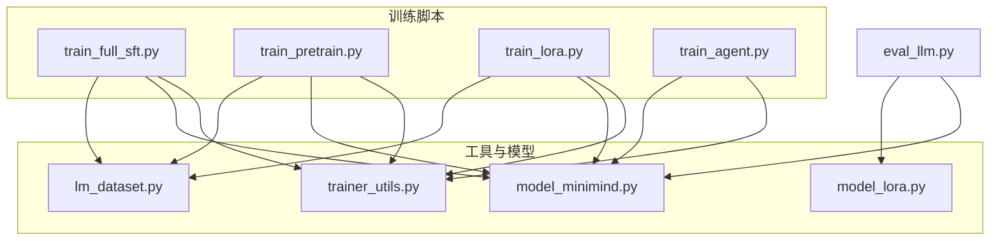
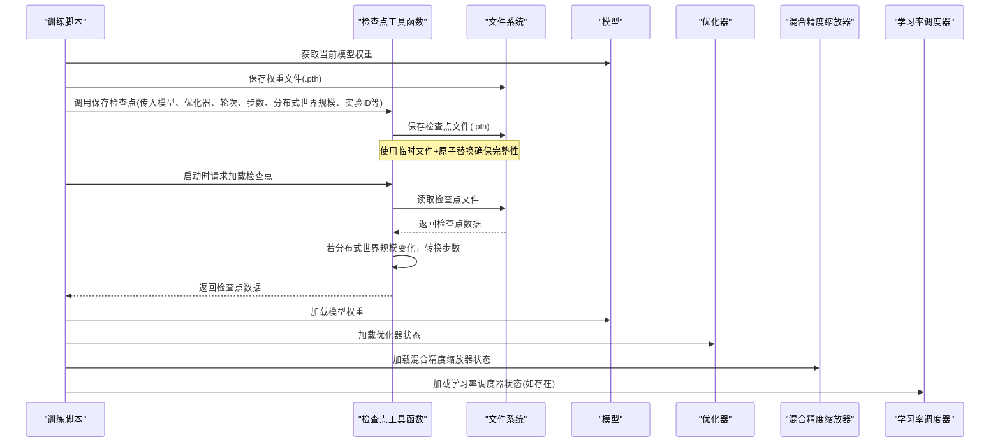
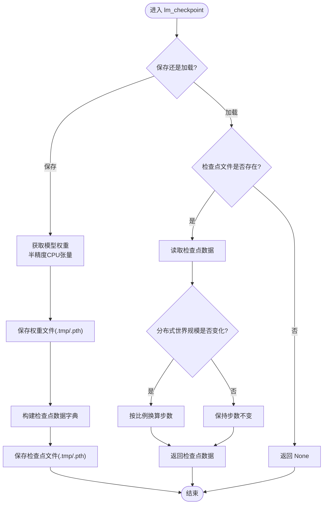
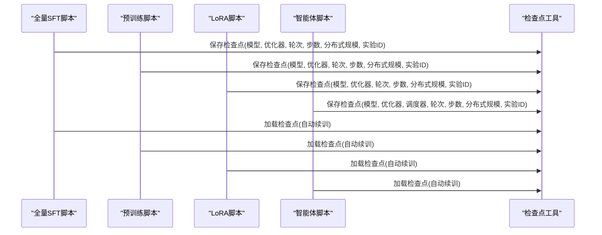
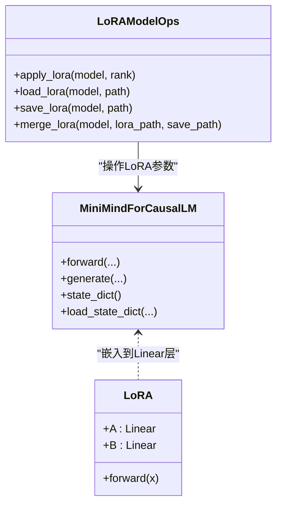
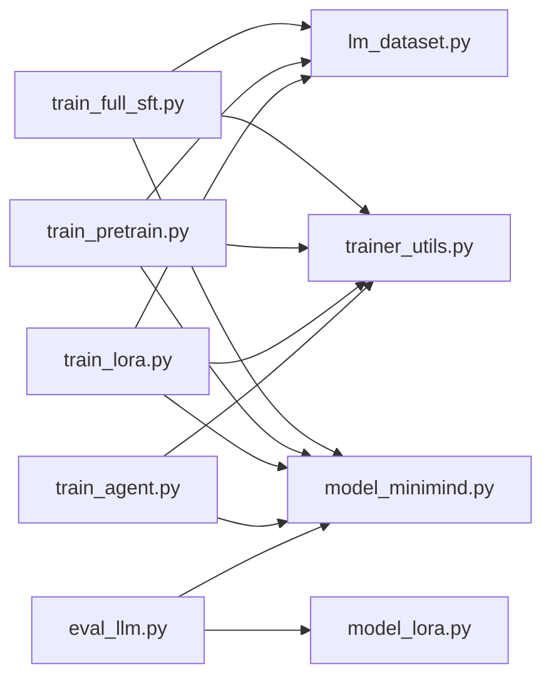

# 检查点保存与恢复

<cite>
**本文引用的文件**
- [trainer_utils.py](file://trainer/trainer_utils.py)
- [train_full_sft.py](file://trainer/train_full_sft.py)
- [train_pretrain.py](file://trainer/train_pretrain.py)
- [train_lora.py](file://trainer/train_lora.py)
- [train_agent.py](file://trainer/train_agent.py)
- [model_minimind.py](file://model/model_minimind.py)
- [model_lora.py](file://model/model_lora.py)
- [lm_dataset.py](file://dataset/lm_dataset.py)
- [eval_llm.py](file://eval_llm.py)
</cite>

## 目录
1. [简介](#简介)
2. [项目结构](#项目结构)
3. [核心组件](#核心组件)
4. [架构概览](#架构概览)
5. [详细组件分析](#详细组件分析)
6. [依赖分析](#依赖分析)
7. [性能考虑](#性能考虑)
8. [故障排查指南](#故障排查指南)
9. [结论](#结论)
10. [附录](#附录)

## 简介
本文件系统化阐述 MiniMind 的训练检查点保存与恢复机制，覆盖以下要点：
- 检查点文件结构与格式：模型权重、优化器状态、学习率调度器、混合精度缩放器、训练轮次与步数、分布式世界规模、实验跟踪标识等。
- 断点续训流程：自动检测检查点、状态加载顺序、分布式 GPU 数量变化的步数转换、兼容性验证。
- 损坏修复与手动恢复：检查点文件损坏的识别与修复方法，以及如何手动恢复训练状态。
- 不同训练阶段检查点差异与迁移：预训练、指令微调、LoRA 微调、智能体强化学习等阶段的差异与迁移策略。
- 版本管理与清理策略：检查点命名约定、版本标识、清理与归档建议。

## 项目结构
本项目采用“按功能模块组织”的结构，训练检查点相关逻辑主要集中在训练脚本与工具函数中：
- 训练脚本：负责在训练过程中定期保存权重与检查点，并在启动时尝试自动续训。
- 工具函数：封装统一的检查点保存与加载逻辑，支持分布式场景与扩展字段。
- 模型定义：提供模型权重的保存与加载接口，便于推理或合并 LoRA 权重。
- 数据集：提供训练数据加载，与检查点保存周期配合。

图表来源
- [train_full_sft.py:18](file://trainer/train_full_sft.py#L18)
- [train_pretrain.py:18](file://trainer/train_pretrain.py#L18)
- [train_lora.py:19](file://trainer/train_lora.py#L19)
- [train_agent.py:357](file://trainer/train_agent.py#L357)
- [trainer_utils.py:63](file://trainer/trainer_utils.py#L63)
- [model_minimind.py:229](file://model/model_minimind.py#L229)
- [model_lora.py:45](file://model/model_lora.py#L45)
- [lm_dataset.py:37](file://dataset/lm_dataset.py#L37)
- [eval_llm.py:12](file://eval_llm.py#L12)

章节来源
- [train_full_sft.py:18](file://trainer/train_full_sft.py#L18)
- [train_pretrain.py:18](file://trainer/train_pretrain.py#L18)
- [train_lora.py:19](file://trainer/train_lora.py#L19)
- [train_agent.py:357](file://trainer/train_agent.py#L357)
- [trainer_utils.py:63](file://trainer/trainer_utils.py#L63)
- [model_minimind.py:229](file://model/model_minimind.py#L229)
- [model_lora.py:45](file://model/model_lora.py#L45)
- [lm_dataset.py:37](file://dataset/lm_dataset.py#L37)
- [eval_llm.py:12](file://eval_llm.py#L12)

## 核心组件
- 统一检查点工具函数：提供检查点保存与加载的统一入口，支持模型权重、优化器、训练轮次、步数、分布式世界规模、实验跟踪 ID 等字段的打包与恢复。
- 训练脚本集成：在训练循环中按配置周期保存权重与检查点；启动时根据参数决定是否自动检测并加载检查点。
- 模型与 LoRA 权重：模型权重保存为半精度 CPU 张量，LoRA 权重单独保存与加载，支持合并到基础权重。
- 推理与评估：推理脚本支持直接加载检查点权重，或加载 LoRA 并与基础权重合并后进行推理。

章节来源
- [trainer_utils.py:63](file://trainer/trainer_utils.py#L63)
- [train_full_sft.py:60](file://trainer/train_full_sft.py#L60)
- [train_pretrain.py:60](file://trainer/train_pretrain.py#L60)
- [train_lora.py:59](file://trainer/train_lora.py#L59)
- [train_agent.py:350](file://trainer/train_agent.py#L350)
- [model_lora.py:45](file://model/model_lora.py#L45)
- [eval_llm.py:12](file://eval_llm.py#L12)

## 架构概览
检查点保存与恢复的整体流程如下：
- 训练阶段：每达到保存间隔，训练脚本先保存当前模型权重，再调用统一工具函数保存包含模型权重、优化器状态、训练轮次、步数、分布式世界规模、实验跟踪 ID 等的检查点。
- 启动阶段：若启用自动续训，训练脚本会调用工具函数检测并加载检查点，随后按检查点中的状态恢复模型权重、优化器状态、混合精度缩放器状态、训练轮次与步数等。
- 分布式兼容：当分布式世界规模发生变化时，工具函数会对步数进行比例换算，保证训练连续性。

图表来源
- [trainer_utils.py:63](file://trainer/trainer_utils.py#L63)
- [trainer_utils.py:107](file://trainer/trainer_utils.py#L107)
- [train_full_sft.py:60](file://trainer/train_full_sft.py#L60)
- [train_pretrain.py:60](file://trainer/train_pretrain.py#L60)
- [train_lora.py:59](file://trainer/train_lora.py#L59)
- [train_agent.py:350](file://trainer/train_agent.py#L350)

## 详细组件分析

### 统一检查点工具函数（lm_checkpoint）
该函数负责：
- 保存模型权重：将模型 state_dict 转为半精度 CPU 张量并保存为 .pth 文件，使用临时文件+原子替换避免部分写入导致的损坏。
- 保存检查点：将模型权重、优化器状态、训练轮次、步数、分布式世界规模、实验跟踪 ID 等打包保存为 .pth 文件，同样使用临时文件+原子替换。
- 加载检查点：在加载模式下，优先读取检查点文件，若分布式世界规模发生变化，会对步数进行比例换算，保证训练连续性。
- 扩展字段：支持传入额外对象（如学习率调度器、混合精度缩放器等），这些对象的状态也会被保存与加载。

图表来源
- [trainer_utils.py:63](file://trainer/trainer_utils.py#L63)
- [trainer_utils.py:107](file://trainer/trainer_utils.py#L107)

章节来源
- [trainer_utils.py:63](file://trainer/trainer_utils.py#L63)
- [trainer_utils.py:107](file://trainer/trainer_utils.py#L107)

### 训练脚本中的检查点集成
- 全量 SFT：在训练循环中按保存间隔保存权重与检查点；启动时根据参数决定是否自动续训；加载检查点后恢复模型权重、优化器状态、混合精度缩放器状态、训练轮次与步数。
- 预训练：与全量 SFT 类似，但默认从头开始训练，可通过参数选择从检查点续训。
- LoRA 微调：保存 LoRA 权重而非全量权重；加载检查点时模型权重严格匹配，LoRA 参数通过单独的 LoRA 加载函数恢复。
- 智能体强化学习：保存模型权重、优化器状态、学习率调度器状态、训练轮次与步数；启动时加载对应状态以实现断点续训。

图表来源
- [train_full_sft.py:60](file://trainer/train_full_sft.py#L60)
- [train_pretrain.py:60](file://trainer/train_pretrain.py#L60)
- [train_lora.py:59](file://trainer/train_lora.py#L59)
- [train_agent.py:350](file://trainer/train_agent.py#L350)
- [trainer_utils.py:63](file://trainer/trainer_utils.py#L63)

章节来源
- [train_full_sft.py:60](file://trainer/train_full_sft.py#L60)
- [train_pretrain.py:60](file://trainer/train_pretrain.py#L60)
- [train_lora.py:59](file://trainer/train_lora.py#L59)
- [train_agent.py:350](file://trainer/train_agent.py#L350)
- [trainer_utils.py:63](file://trainer/trainer_utils.py#L63)

### 模型与 LoRA 权重保存与加载
- 模型权重：模型类提供 state_dict/load_state_dict 接口，训练脚本在保存时将权重转为半精度 CPU 张量，减少内存占用并提升 IO 效率。
- LoRA 权重：LoRA 结构通过独立的保存与加载函数实现，仅保存 LoRA 参数，支持将 LoRA 合并到基础权重后保存为完整权重文件。

图表来源
- [model_minimind.py:229](file://model/model_minimind.py#L229)
- [model_lora.py:6](file://model/model_lora.py#L6)
- [model_lora.py:21](file://model/model_lora.py#L21)
- [model_lora.py:45](file://model/model_lora.py#L45)
- [model_lora.py:56](file://model/model_lora.py#L56)

章节来源
- [model_minimind.py:229](file://model/model_minimind.py#L229)
- [model_lora.py:6](file://model/model_lora.py#L6)
- [model_lora.py:21](file://model/model_lora.py#L21)
- [model_lora.py:45](file://model/model_lora.py#L45)
- [model_lora.py:56](file://model/model_lora.py#L56)

### 推理与评估中的检查点使用
- 推理脚本支持直接加载训练保存的权重文件，或加载 LoRA 并与基础权重合并后进行推理。
- 支持从本地 Torch 权重文件加载，也支持从 Transformers 格式模型加载。

章节来源
- [eval_llm.py:12](file://eval_llm.py#L12)
- [eval_llm.py:22](file://eval_llm.py#L22)
- [eval_llm.py:24](file://eval_llm.py#L24)

## 依赖分析
- 训练脚本依赖统一检查点工具函数，确保保存与加载行为一致。
- 训练脚本依赖模型定义与数据集，用于构建模型、准备数据与执行训练。
- 推理脚本依赖模型与 LoRA 操作，用于加载权重与执行推理。

图表来源
- [train_full_sft.py:18](file://trainer/train_full_sft.py#L18)
- [train_pretrain.py:18](file://trainer/train_pretrain.py#L18)
- [train_lora.py:19](file://trainer/train_lora.py#L19)
- [train_agent.py:357](file://trainer/train_agent.py#L357)
- [trainer_utils.py:63](file://trainer/trainer_utils.py#L63)
- [model_minimind.py:229](file://model/model_minimind.py#L229)
- [lm_dataset.py:37](file://dataset/lm_dataset.py#L37)
- [eval_llm.py:12](file://eval_llm.py#L12)
- [model_lora.py:45](file://model/model_lora.py#L45)

章节来源
- [train_full_sft.py:18](file://trainer/train_full_sft.py#L18)
- [train_pretrain.py:18](file://trainer/train_pretrain.py#L18)
- [train_lora.py:19](file://trainer/train_lora.py#L19)
- [train_agent.py:357](file://trainer/train_agent.py#L357)
- [trainer_utils.py:63](file://trainer/trainer_utils.py#L63)
- [model_minimind.py:229](file://model/model_minimind.py#L229)
- [lm_dataset.py:37](file://dataset/lm_dataset.py#L37)
- [eval_llm.py:12](file://eval_llm.py#L12)
- [model_lora.py:45](file://model/model_lora.py#L45)

## 性能考虑
- 原子写入：检查点保存采用“.tmp”临时文件+原子替换，避免部分写入导致的损坏，提高可靠性。
- 半精度保存：模型权重保存为半精度 CPU 张量，降低磁盘占用与 IO 压力。
- 分布式兼容：当分布式世界规模变化时，自动将步数按比例换算，避免重复训练或跳步。
- 混合精度：训练脚本使用混合精度缩放器，检查点中保存其状态，确保数值稳定性与一致性。

[本节为通用性能讨论，无需列出具体文件来源]

## 故障排查指南
- 检查点文件损坏
  - 症状：加载检查点时报错或数据不完整。
  - 处理：删除损坏的检查点文件，重新训练或从最近一次成功的检查点恢复。
  - 预防：确保保存期间磁盘空间充足，避免中断；使用原子替换机制减少损坏风险。
- 分布式世界规模变化
  - 症状：分布式 GPU 数量变化导致步数不一致。
  - 处理：工具函数会自动将步数按比例换算，确保训练连续性；若出现异常，检查分布式配置与 world_size。
- LoRA 权重不匹配
  - 症状：加载 LoRA 权重时报错或参数不匹配。
  - 处理：确认 LoRA 层结构与权重文件一致；使用提供的加载函数逐层匹配加载。
- 推理权重加载失败
  - 症状：推理脚本无法加载权重或输出异常。
  - 处理：确认权重文件路径正确，必要时合并 LoRA 到基础权重后再加载。

章节来源
- [trainer_utils.py:107](file://trainer/trainer_utils.py#L107)
- [trainer_utils.py:112](file://trainer/trainer_utils.py#L112)
- [model_lora.py:35](file://model/model_lora.py#L35)
- [eval_llm.py:22](file://eval_llm.py#L22)

## 结论
MiniMind 的检查点机制通过统一工具函数实现了跨训练阶段的一致性与可靠性，结合原子写入、半精度保存与分布式兼容策略，有效保障了断点续训的可用性与性能。建议在生产环境中遵循统一的命名规范与清理策略，确保检查点的可维护性与可追溯性。

[本节为总结性内容，无需列出具体文件来源]

## 附录

### 检查点文件结构与格式
- 模型权重文件（.pth）：保存模型 state_dict，键为参数名称，值为半精度 CPU 张量。
- 检查点文件（_resume.pth）：保存以下字段：
  - model：模型权重（半精度 CPU 张量）
  - optimizer：优化器状态
  - epoch：训练轮次
  - step：训练步数
  - world_size：分布式世界规模
  - wandb_id：实验跟踪 ID（如使用）
  - 其他扩展字段：如学习率调度器、混合精度缩放器等（由调用方传入）

章节来源
- [trainer_utils.py:63](file://trainer/trainer_utils.py#L63)
- [trainer_utils.py:85](file://trainer/trainer_utils.py#L85)

### 断点续训操作流程
- 启动参数：设置“自动续训”开关，训练脚本在启动时调用工具函数检测并加载检查点。
- 状态加载顺序：模型权重 → 优化器状态 → 混合精度缩放器状态 → 学习率调度器状态（如存在） → 训练轮次与步数。
- 分布式兼容：若分布式世界规模变化，步数按比例换算，确保训练连续性。

章节来源
- [train_full_sft.py:117](file://trainer/train_full_sft.py#L117)
- [train_pretrain.py:116](file://trainer/train_pretrain.py#L116)
- [train_lora.py:111](file://trainer/train_lora.py#L111)
- [train_agent.py:419](file://trainer/train_agent.py#L419)
- [trainer_utils.py:107](file://trainer/trainer_utils.py#L107)
- [trainer_utils.py:112](file://trainer/trainer_utils.py#L112)

### 不同训练阶段检查点差异与迁移
- 预训练：通常从头开始，权重文件与检查点文件分别保存；可从检查点续训。
- 全量 SFT：保存完整模型权重与优化器状态；可从检查点续训。
- LoRA 微调：保存 LoRA 权重；加载检查点时模型权重严格匹配，LoRA 参数单独加载；可合并 LoRA 到基础权重后保存。
- 智能体强化学习：保存模型权重、优化器状态与学习率调度器状态；可从检查点续训。

章节来源
- [train_pretrain.py:60](file://trainer/train_pretrain.py#L60)
- [train_full_sft.py:60](file://trainer/train_full_sft.py#L60)
- [train_lora.py:59](file://trainer/train_lora.py#L59)
- [train_agent.py:350](file://trainer/train_agent.py#L350)
- [model_lora.py:45](file://model/model_lora.py#L45)
- [model_lora.py:56](file://model/model_lora.py#L56)

### 版本管理与清理策略
- 命名约定：权重文件与检查点文件均包含权重前缀、隐藏层维度、MoE 标识等信息，便于区分不同配置。
- 清理策略：建议定期清理旧的检查点文件，仅保留最近几次的检查点与最终模型权重；对重要里程碑设置标记以便快速回溯。

章节来源
- [train_full_sft.py:63](file://trainer/train_full_sft.py#L63)
- [train_pretrain.py:63](file://trainer/train_pretrain.py#L63)
- [train_lora.py:62](file://trainer/train_lora.py#L62)
- [train_agent.py:352](file://trainer/train_agent.py#L352)