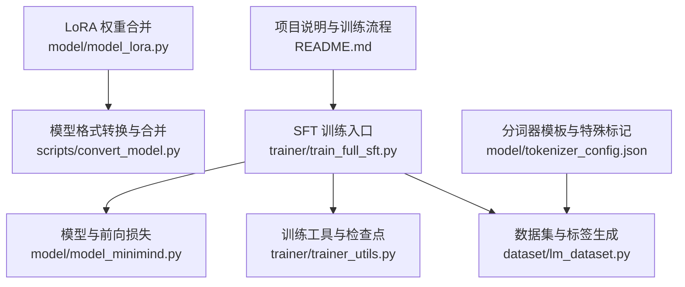
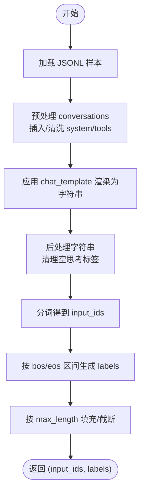
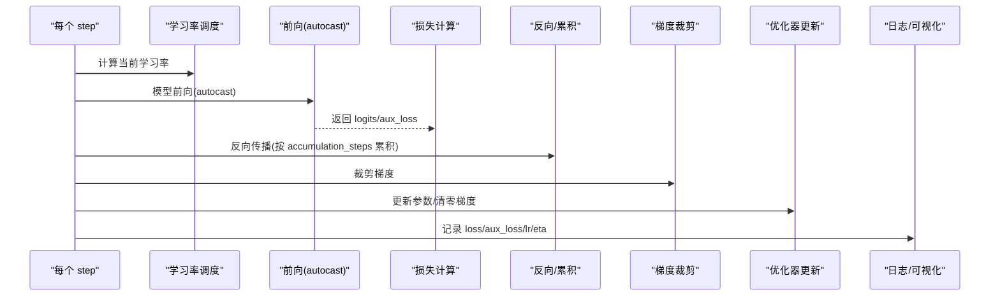
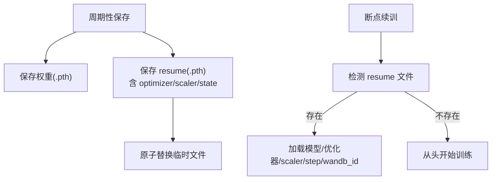
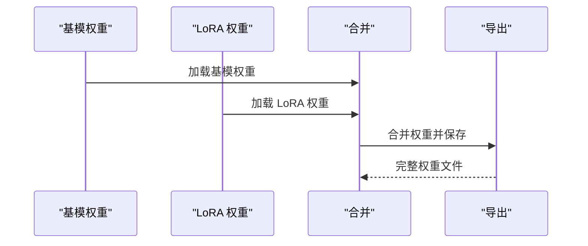
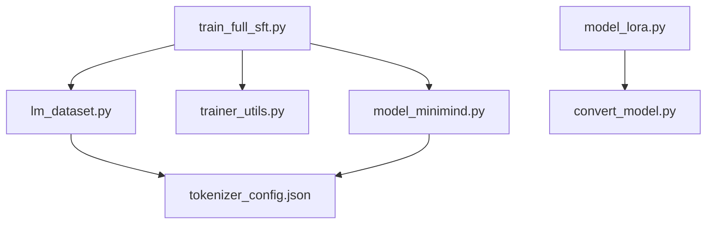

# 监督微调问题

<cite>
**本文引用的文件**
- [train_full_sft.py](file://trainer/train_full_sft.py)
- [lm_dataset.py](file://dataset/lm_dataset.py)
- [trainer_utils.py](file://trainer/trainer_utils.py)
- [model_minimind.py](file://model/model_minimind.py)
- [model_lora.py](file://model/model_lora.py)
- [convert_model.py](file://scripts/convert_model.py)
- [tokenizer_config.json](file://model/tokenizer_config.json)
- [README.md](file://README.md)
</cite>

## 目录
1. [引言](#引言)
2. [项目结构](#项目结构)
3. [核心组件](#核心组件)
4. [架构总览](#架构总览)
5. [详细组件分析](#详细组件分析)
6. [依赖分析](#依赖分析)
7. [性能考量](#性能考量)
8. [故障排查指南](#故障排查指南)
9. [结论](#结论)
10. [附录](#附录)

## 引言
本文件聚焦 MiniMind 监督微调（SFT）阶段的问题排查与最佳实践，覆盖数据格式错误、对话模板不匹配、标签编码问题等常见错误；同时提供全参数微调的内存占用优化、学习率调度策略调整、梯度裁剪参数设置等技术要点；并给出训练中断恢复的具体操作步骤，包括检查点保存格式、权重合并方法、训练状态记录等；最后说明如何处理微调数据不平衡、过拟合问题，以及不同任务类型的微调策略调整。

## 项目结构
- 训练入口与流程：trainer/train_full_sft.py
- 数据集与标签生成：dataset/lm_dataset.py
- 训练工具与检查点：trainer/trainer_utils.py
- 模型与前向损失：model/model_minimind.py
- LoRA 权重合并：model/model_lora.py
- 模型格式转换与合并：scripts/convert_model.py
- 分词器模板与特殊标记：model/tokenizer_config.json
- 项目说明与训练流程：README.md



图表来源
- [train_full_sft.py:1-171](file://trainer/train_full_sft.py#L1-L171)
- [lm_dataset.py:1-256](file://dataset/lm_dataset.py#L1-L256)
- [trainer_utils.py:1-177](file://trainer/trainer_utils.py#L1-L177)
- [model_minimind.py:1-280](file://model/model_minimind.py#L1-L280)
- [model_lora.py:1-66](file://model/model_lora.py#L1-L66)
- [convert_model.py:1-145](file://scripts/convert_model.py#L1-L145)
- [tokenizer_config.json:1-335](file://model/tokenizer_config.json#L1-L335)
- [README.md:1-800](file://README.md#L1-L800)

章节来源
- [train_full_sft.py:1-171](file://trainer/train_full_sft.py#L1-L171)
- [lm_dataset.py:1-256](file://dataset/lm_dataset.py#L1-L256)
- [trainer_utils.py:1-177](file://trainer/trainer_utils.py#L1-L177)
- [model_minimind.py:1-280](file://model/model_minimind.py#L1-L280)
- [model_lora.py:1-66](file://model/model_lora.py#L1-L66)
- [convert_model.py:1-145](file://scripts/convert_model.py#L1-L145)
- [tokenizer_config.json:1-335](file://model/tokenizer_config.json#L1-L335)
- [README.md:1-800](file://README.md#L1-L800)

## 核心组件
- 全参数 SFT 训练器：负责初始化分布式、混合精度、优化器、数据加载、训练循环、梯度累积与裁剪、日志与可视化、检查点保存与恢复。
- SFT 数据集：负责加载 JSONL 多轮对话数据，应用 chat_template，生成 input_ids 与 labels（仅对 assistant 回答部分进行监督）。
- 训练工具：提供学习率调度、分布式初始化、随机种子、检查点保存与恢复、跳过已消费 batch 的采样器等。
- 模型与损失：MiniMindForCausalLM 前向返回交叉熵损失，支持 aux_loss（MoE router loss）。
- LoRA 权重合并：提供 LoRA 应用与合并为基模权重的能力，便于导出完整模型。
- 模型格式转换：支持将 PyTorch 权重转换为 Transformers 格式，或合并 LoRA 后导出完整权重。

章节来源
- [train_full_sft.py:83-171](file://trainer/train_full_sft.py#L83-L171)
- [lm_dataset.py:58-119](file://dataset/lm_dataset.py#L58-L119)
- [trainer_utils.py:40-117](file://trainer/trainer_utils.py#L40-L117)
- [model_minimind.py:229-246](file://model/model_minimind.py#L229-L246)
- [model_lora.py:21-66](file://model/model_lora.py#L21-L66)
- [convert_model.py:16-113](file://scripts/convert_model.py#L16-L113)

## 架构总览
SFT 训练从命令行参数解析开始，初始化分布式与随机种子，加载分词器与模型，构建 SFT 数据集与 DataLoader，进入训练循环。每步计算损失并反向传播，按 accumulation_steps 累积梯度后裁剪与更新，周期性保存检查点与日志。支持断点续训，自动恢复模型、优化器、scaler、wandb run 等状态。

```mermaid
sequenceDiagram
participant CLI as "命令行参数"
participant Init as "初始化"
participant DS as "SFT 数据集"
participant Loader as "DataLoader"
participant Train as "训练循环"
participant Model as "MiniMindForCausalLM"
participant Opt as "优化器/Scalor"
participant CKP as "检查点/日志"
CLI->>Init : 解析参数/分布式/随机种子
Init->>DS : 加载 JSONL/apply_chat_template
Init->>Loader : 构建 DataLoader/Sampler
Init->>Train : 进入训练循环
loop 每个 step
Train->>Loader : 获取 batch(input_ids, labels)
Train->>Opt : 计算学习率(get_lr)
Train->>Model : 前向(autocast)
Model-->>Train : loss/logits/aux_loss
Train->>Opt : 反向/累积/裁剪/更新
Train->>CKP : 日志/周期性保存
end
Train->>CKP : 断点续训/恢复
```

图表来源
- [train_full_sft.py:23-81](file://trainer/train_full_sft.py#L23-L81)
- [lm_dataset.py:106-119](file://dataset/lm_dataset.py#L106-L119)
- [trainer_utils.py:40-42](file://trainer/trainer_utils.py#L40-L42)
- [trainer_utils.py:63-117](file://trainer/trainer_utils.py#L63-L117)

## 详细组件分析

### SFT 数据集与标签生成
- 数据格式要求：conversations 数组，每轮包含 role/content，支持 system/tools/tool_calls/reasoning_content 等字段。
- 模板应用：使用分词器的 chat_template 将多轮消息渲染为单一字符串，再分词得到 input_ids。
- 标签生成策略：仅对 assistant 回答片段（以特定 bos/eos 标记界定）对应的 token 位置设置为真实 token id，其余位置设为忽略索引，确保交叉熵仅对回答部分计算。
- 预处理与后处理：可插入 system 角色、清理空思考标签等，以提升数据质量与一致性。



图表来源
- [lm_dataset.py:9-35](file://dataset/lm_dataset.py#L9-L35)
- [lm_dataset.py:71-86](file://dataset/lm_dataset.py#L71-L86)
- [lm_dataset.py:88-104](file://dataset/lm_dataset.py#L88-L104)
- [lm_dataset.py:106-119](file://dataset/lm_dataset.py#L106-L119)

章节来源
- [lm_dataset.py:58-119](file://dataset/lm_dataset.py#L58-L119)
- [tokenizer_config.json:317-333](file://model/tokenizer_config.json#L317-L333)

### 训练循环与损失计算
- 学习率调度：余弦退火式调度，随总步数线性衰减。
- 混合精度与梯度累积：支持 bfloat16/float16，按 accumulation_steps 累积梯度后统一裁剪与更新。
- 梯度裁剪：clip_grad_norm，防止梯度爆炸。
- 损失构成：主损失为交叉熵，若模型启用 MoE，还会包含 router auxiliary loss。
- 日志与可视化：周期性打印 loss、aux_loss、学习率、剩余时间；可选记录到 SwanLab/W&B。



图表来源
- [train_full_sft.py:30-48](file://trainer/train_full_sft.py#L30-L48)
- [train_full_sft.py:50-58](file://trainer/train_full_sft.py#L50-L58)
- [model_minimind.py:238-246](file://model/model_minimind.py#L238-L246)
- [trainer_utils.py:40-42](file://trainer/trainer_utils.py#L40-L42)

章节来源
- [train_full_sft.py:23-81](file://trainer/train_full_sft.py#L23-L81)
- [model_minimind.py:229-246](file://model/model_minimind.py#L229-L246)
- [trainer_utils.py:40-42](file://trainer/trainer_utils.py#L40-L42)

### 检查点保存与断点续训
- 检查点内容：模型权重、优化器状态、scaler 状态、epoch/step、world_size、wandb run id 等。
- 恢复逻辑：自动检测并加载 resume 文件，支持 GPU 数量变化时 step 自动换算。
- 保存策略：周期性保存权重与 resume 文件，权重文件采用半精度存储，临时文件原子替换避免损坏。



图表来源
- [trainer_utils.py:63-117](file://trainer/trainer_utils.py#L63-L117)
- [train_full_sft.py:60-71](file://trainer/train_full_sft.py#L60-L71)

章节来源
- [trainer_utils.py:63-117](file://trainer/trainer_utils.py#L63-L117)
- [train_full_sft.py:140-148](file://trainer/train_full_sft.py#L140-L148)

### LoRA 权重合并与模型导出
- LoRA 应用：在指定线性层上注入低秩增量，前向时叠加。
- 权重合并：将 LoRA 增量加回到基模权重，导出完整 PyTorch 权重。
- 格式转换：支持将 PyTorch 权重转换为 Transformers 格式，便于生态兼容。



图表来源
- [model_lora.py:21-66](file://model/model_lora.py#L21-L66)
- [convert_model.py:105-113](file://scripts/convert_model.py#L105-L113)

章节来源
- [model_lora.py:21-66](file://model/model_lora.py#L21-L66)
- [convert_model.py:105-113](file://scripts/convert_model.py#L105-L113)

## 依赖分析
- 训练入口依赖：数据集、模型、训练工具、分布式与混合精度。
- 数据集依赖：分词器 chat_template、JSONL 数据格式。
- 模型依赖：MiniMindConfig、MiniMindForCausalLM、交叉熵损失。
- 工具依赖：学习率调度、分布式初始化、检查点保存/恢复、跳过采样器。



图表来源
- [train_full_sft.py:16-18](file://trainer/train_full_sft.py#L16-L18)
- [lm_dataset.py:63-66](file://dataset/lm_dataset.py#L63-L66)
- [trainer_utils.py:16](file://trainer/trainer_utils.py#L16)
- [model_minimind.py:10-45](file://model/model_minimind.py#L10-L45)
- [tokenizer_config.json:333](file://model/tokenizer_config.json#L333)
- [model_lora.py:12](file://model/model_lora.py#L12)
- [convert_model.py:10](file://scripts/convert_model.py#L10)

章节来源
- [train_full_sft.py:16-18](file://trainer/train_full_sft.py#L16-L18)
- [lm_dataset.py:63-66](file://dataset/lm_dataset.py#L63-L66)
- [trainer_utils.py:16](file://trainer/trainer_utils.py#L16)
- [model_minimind.py:10-45](file://model/model_minimind.py#L10-L45)
- [tokenizer_config.json:333](file://model/tokenizer_config.json#L333)
- [model_lora.py:12](file://model/model_lora.py#L12)
- [convert_model.py:10](file://scripts/convert_model.py#L10)

## 性能考量
- 混合精度：bfloat16/float16，减少显存占用与算力消耗；仅在 CUDA 可用时生效。
- 梯度累积：增大 accumulation_steps 可降低单步显存峰值，但会增加训练步数。
- 梯度裁剪：clip_grad_norm 控制梯度范数，避免爆炸；合理设置阈值。
- 分布式：DDP 训练时忽略某些缓冲参数参与同步，减少通信开销。
- 编译加速：可选启用 torch.compile，提升内核利用率。
- 数据加载：pin_memory、num_workers、SkipBatchSampler 跳过已消费 batch，提高吞吐。

章节来源
- [train_full_sft.py:119-122](file://trainer/train_full_sft.py#L119-L122)
- [train_full_sft.py:137-138](file://trainer/train_full_sft.py#L137-L138)
- [train_full_sft.py:42-48](file://trainer/train_full_sft.py#L42-L48)
- [train_full_sft.py:153-155](file://trainer/train_full_sft.py#L153-L155)
- [train_full_sft.py:150-152](file://trainer/train_full_sft.py#L150-L152)
- [trainer_utils.py:134-157](file://trainer/trainer_utils.py#L134-L157)

## 故障排查指南

### 数据格式错误
- 症状：训练报错或 loss 异常、标签与输入不一致。
- 排查要点：
  - 确认 JSONL 中 conversations 字段结构完整，包含 role/content；必要时包含 reasoning_content、tools、tool_calls。
  - 确保分词器 chat_template 与数据格式匹配，避免缺失特殊标记导致的 bos/eos 匹配失败。
  - 检查 max_seq_len 是否过小导致截断影响回答部分；适当增大以保留关键信息。
  - 若使用工具调用，确保 tools/tool_calls 字段格式正确且可被 JSON 解析。

章节来源
- [lm_dataset.py:58-119](file://dataset/lm_dataset.py#L58-L119)
- [tokenizer_config.json:317-333](file://model/tokenizer_config.json#L317-L333)
- [README.md:441-461](file://README.md#L441-L461)

### 对话模板不匹配
- 症状：assistant 回答未被正确标记为监督目标，或标签越界。
- 排查要点：
  - 检查 bos/eos 标记是否与分词器一致；generate_labels 依赖这些标记定位回答区间。
  - 确认 chat_template 输出包含 system/assistant/tool 等角色标记，避免标签生成逻辑误判。
  - 若数据中包含工具调用，确保 templates 正确渲染 tool_calls JSON。

章节来源
- [lm_dataset.py:88-104](file://dataset/lm_dataset.py#L88-L104)
- [tokenizer_config.json:333](file://model/tokenizer_config.json#L333)

### 标签编码问题
- 症状：loss 为 NaN、梯度异常、收敛异常。
- 排查要点：
  - 确认 labels 中非回答部分被设置为忽略索引；回答部分为真实 token id。
  - 检查 pad_token_id 与 ignore_index 的一致性，避免无效 token 影响损失。
  - 若使用 MoE，注意 aux_loss 的系数与数值范围，避免主导总损失。

章节来源
- [lm_dataset.py:88-104](file://dataset/lm_dataset.py#L88-L104)
- [model_minimind.py:238-246](file://model/model_minimind.py#L238-L246)

### 内存占用优化（全参数微调）
- 混合精度：优先使用 bfloat16，必要时 float16；仅在 CUDA 可用时启用。
- 梯度累积：增大 accumulation_steps 降低显存峰值，注意步数与学习率调度的配合。
- 梯度裁剪：合理设置阈值，避免无效更新浪费显存。
- 分布式：启用 DDP，忽略不参与同步的缓冲参数，减少通信与同步开销。
- 编译加速：启用 torch.compile 提升内核效率，注意兼容性。

章节来源
- [train_full_sft.py:119-122](file://trainer/train_full_sft.py#L119-L122)
- [train_full_sft.py:137-138](file://trainer/train_full_sft.py#L137-L138)
- [train_full_sft.py:42-48](file://trainer/train_full_sft.py#L42-L48)
- [train_full_sft.py:153-155](file://trainer/train_full_sft.py#L153-L155)
- [train_full_sft.py:150-152](file://trainer/train_full_sft.py#L150-L152)

### 学习率调度策略调整
- 现状：余弦退火式调度，随总步数线性衰减。
- 调整建议：
  - 若训练初期不稳定，可尝试 warmup 步数或阶梯式下降。
  - 若收敛过快导致欠拟合，可延长余弦周期或降低最小比例。
  - 多卡训练时，注意按 world_size 调整总步数与学习率缩放。

章节来源
- [trainer_utils.py:40-42](file://trainer/trainer_utils.py#L40-L42)

### 梯度裁剪参数设置
- 建议：
  - 初始设置为 1.0；若出现梯度爆炸，适度降低；若出现梯度消失，适度提高。
  - 结合学习率与 batch size 调整，避免过大或过小导致训练不稳定。

章节来源
- [train_full_sft.py:42-48](file://trainer/train_full_sft.py#L42-L48)

### 训练中断恢复
- 操作步骤：
  - 启动训练时添加自动续训参数，程序会自动检测并加载 resume 文件。
  - 恢复时会自动加载模型权重、优化器状态、scaler、epoch/step、wandb run id。
  - 若 GPU 数量发生变化，step 会按 world_size 自动换算，保证训练连续性。
- 注意事项：
  - 确保 checkpoints 目录存在且权限正确。
  - 恢复后可继续使用可视化工具记录同一 run，保持训练曲线连续。

章节来源
- [train_full_sft.py:117-148](file://trainer/train_full_sft.py#L117-L148)
- [trainer_utils.py:107-116](file://trainer/trainer_utils.py#L107-L116)
- [README.md:301-320](file://README.md#L301-L320)

### 数据不平衡与过拟合
- 数据不平衡：
  - 任务类型分布不均时，可调整采样策略或增加少数类样本比例。
  - 使用 SkipBatchSampler 跳过已消费 batch，提高数据利用效率。
- 过拟合：
  - 增大学习率衰减幅度或启用早停策略。
  - 减少模型复杂度或增加正则化（如 dropout）。
  - 增加数据多样性与噪声，避免记忆训练集。

章节来源
- [trainer_utils.py:134-157](file://trainer/trainer_utils.py#L134-L157)

### 不同任务类型的微调策略
- 对话/指令跟随：使用 SFT 数据集，确保 conversations 结构完整，标签仅对 assistant 回答部分。
- 工具调用：确保 tools/tool_calls 字段正确渲染，模板支持工具描述与调用 JSON。
- 思考链：通过 chat_template 控制思考标记的显示与隐藏，结合 reasoning_content 字段。
- 多轮对话：保持历史消息与最后一轮 assistant 的上下文连贯，避免截断破坏语义。

章节来源
- [lm_dataset.py:71-86](file://dataset/lm_dataset.py#L71-L86)
- [tokenizer_config.json:333](file://model/tokenizer_config.json#L333)
- [README.md:441-461](file://README.md#L441-L461)

## 结论
SFT 阶段的关键在于数据格式与模板匹配、标签编码正确性、学习率与梯度策略的协调，以及断点续训与权重导出的规范流程。通过合理的内存优化与策略调整，可在中小规模显存环境下稳定完成全参数微调，并为后续 LoRA 合并与生态兼容提供良好基础。

## 附录
- 检查点文件命名与保存位置：权重与 resume 文件保存在 checkpoints 目录，命名包含维度与 MoE 标识。
- 模型导出：支持将 PyTorch 权重转换为 Transformers 格式，或合并 LoRA 后导出完整权重。

章节来源
- [trainer_utils.py:63-117](file://trainer/trainer_utils.py#L63-L117)
- [convert_model.py:16-113](file://scripts/convert_model.py#L16-L113)