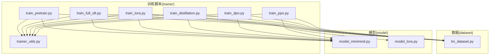
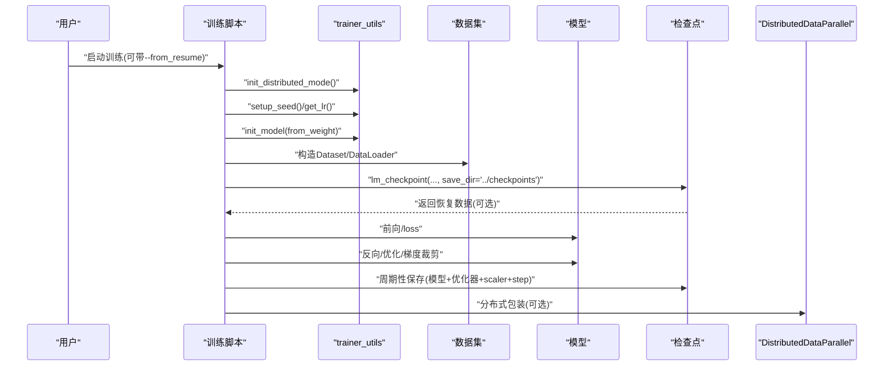
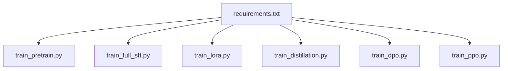

# 训练过程问题

<cite>
**本文引用的文件**
- [README.md](file://README.md)
- [requirements.txt](file://requirements.txt)
- [trainer/train_pretrain.py](file://trainer/train_pretrain.py)
- [trainer/train_full_sft.py](file://trainer/train_full_sft.py)
- [trainer/train_lora.py](file://trainer/train_lora.py)
- [trainer/train_distillation.py](file://trainer/train_distillation.py)
- [trainer/train_dpo.py](file://trainer/train_dpo.py)
- [trainer/train_ppo.py](file://trainer/train_ppo.py)
- [trainer/trainer_utils.py](file://trainer/trainer_utils.py)
- [dataset/lm_dataset.py](file://dataset/lm_dataset.py)
- [model/model_minimind.py](file://model/model_minimind.py)
- [model/model_lora.py](file://model/model_lora.py)
</cite>

## 目录
1. [引言](#引言)
2. [项目结构](#项目结构)
3. [核心组件](#核心组件)
4. [架构总览](#架构总览)
5. [详细组件分析](#详细组件分析)
6. [依赖分析](#依赖分析)
7. [性能考量](#性能考量)
8. [故障排查指南](#故障排查指南)
9. [结论](#结论)
10. [附录](#附录)

## 引言
本文件聚焦 MiniMind 训练过程中的常见问题与解决方案，覆盖训练脚本运行失败、内存不足、显存溢出、训练中断恢复、检查点保存与断点续训、不同训练阶段（预训练、SFT、LoRA）的特定问题排查、分布式训练（DDP）配置与多卡训练注意事项，以及性能优化与资源使用建议。内容基于仓库内训练脚本、工具函数与数据集实现，配合 README 的使用说明，帮助读者快速定位并解决问题。

## 项目结构
- 训练脚本集中于 trainer 目录，按阶段划分：预训练、SFT、LoRA、蒸馏、DPO、PPO 等。
- 数据加载与预处理位于 dataset 目录，提供预训练与 SFT 的 Dataset 实现。
- 模型结构与 LoRA 实现位于 model 目录，包含 MiniMind 主干网络与 LoRA 注入逻辑。
- README 提供训练流程、检查点续训、多卡训练与可视化工具的使用说明。

图表来源
- [trainer/train_pretrain.py](file://trainer/train_pretrain.py)
- [trainer/train_full_sft.py](file://trainer/train_full_sft.py)
- [trainer/train_lora.py](file://trainer/train_lora.py)
- [trainer/train_distillation.py](file://trainer/train_distillation.py)
- [trainer/train_dpo.py](file://trainer/train_dpo.py)
- [trainer/train_ppo.py](file://trainer/train_ppo.py)
- [trainer/trainer_utils.py](file://trainer/trainer_utils.py)
- [dataset/lm_dataset.py](file://dataset/lm_dataset.py)
- [model/model_minimind.py](file://model/model_minimind.py)
- [model/model_lora.py](file://model/model_lora.py)

章节来源
- [README.md](file://README.md)
- [requirements.txt](file://requirements.txt)

## 核心组件
- 训练工具与检查点
  - 分布式初始化、主进程判定、随机种子设置、学习率调度、SkipBatchSampler、模型/优化器/Scalr/可视化等统一入口。
  - 检查点保存与恢复：保存完整训练状态（模型、优化器、scaler、epoch、step、world_size、wandb run id），支持跨 GPU 数量恢复时自动调整 step。
- 数据集
  - 预训练：将文本转为 token 序列并构造 next-token 预测标签。
  - SFT：应用 chat 模板，生成 assistant 回复区域的标签掩码，支持工具调用与思考标签。
  - DPO：将 chosen/rejected 成对样本编码为输入/标签与损失掩码。
  - RLAIF：生成提示文本，供 rollout 生成响应。
- 模型
  - MiniMind 主干：RMSNorm、RoPE、注意力与 SwiGLU 前馈，支持 MoE。
  - LoRA：在方阵线性层上注入低秩增量，训练时仅更新低秩参数，推理时与原权重相加。

章节来源
- [trainer/trainer_utils.py](file://trainer/trainer_utils.py)
- [dataset/lm_dataset.py](file://dataset/lm_dataset.py)
- [model/model_minimind.py](file://model/model_minimind.py)
- [model/model_lora.py](file://model/model_lora.py)

## 架构总览
训练脚本遵循统一的训练循环：解析参数 → 初始化分布式 → 设置混合精度 → 构造模型/数据/优化器 → 从检查点恢复 → 训练循环（前向/反向/优化/日志/保存）→ 清理分布式。

图表来源
- [trainer/train_pretrain.py](file://trainer/train_pretrain.py)
- [trainer/train_full_sft.py](file://trainer/train_full_sft.py)
- [trainer/train_lora.py](file://trainer/train_lora.py)
- [trainer/train_distillation.py](file://trainer/train_distillation.py)
- [trainer/train_dpo.py](file://trainer/train_dpo.py)
- [trainer/train_ppo.py](file://trainer/train_ppo.py)
- [trainer/trainer_utils.py](file://trainer/trainer_utils.py)

## 详细组件分析

### 预训练（Pretrain）
- 关键点
  - 学习率余弦退火、混合精度、梯度累积、梯度裁剪。
  - 每 save_interval 保存权重与检查点，支持跨 GPU 数量恢复。
  - 支持 torch.compile（可选）。
- 常见问题与对策
  - 训练脚本运行失败：确认 torchrun 或 python 启动方式、CUDA 可用性、数据路径与 tokenizer 路径。
  - 显存溢出：降低 batch_size、增大 accumulation_steps、减小 max_seq_len、切换 dtype=float16。
  - 断点续训：添加 --from_resume 1，检查 checkpoints 目录是否存在 _resume.pth。
- 代码要点路径
  - [训练循环与保存](file://trainer/train_pretrain.py)
  - [检查点工具](file://trainer/trainer_utils.py)

章节来源
- [trainer/train_pretrain.py](file://trainer/train_pretrain.py)
- [trainer/trainer_utils.py](file://trainer/trainer_utils.py)

### 监督微调（Full SFT）
- 关键点
  - SFT 使用 chat 模板生成标签，仅对 assistant 区域计算损失。
  - 学习率通常较小，梯度累积步数默认 1。
- 常见问题与对策
  - 数据加载错误：确认 JSONL 格式、字段名（conversations、role/content/tool_calls 等）。
  - 模型权重不匹配：确保 from_weight 与已有权重前缀一致，且 hidden_size 与 use_moe 一致。
  - 学习率设置不当：SFT 学习率通常低于预训练，过大会导致性能退化。
- 代码要点路径
  - [SFT 训练循环](file://trainer/train_full_sft.py)
  - [SFT 数据集与标签生成](file://dataset/lm_dataset.py)

章节来源
- [trainer/train_full_sft.py](file://trainer/train_full_sft.py)
- [dataset/lm_dataset.py](file://dataset/lm_dataset.py)

### LoRA 微调
- 关键点
  - 仅训练低秩参数，冻结主干权重；训练结束后可合并 LoRA 与基础权重。
  - 不支持 torch.compile（脚本会自动关闭）。
- 常见问题与对策
  - 训练脚本运行失败：确认 from_weight 与基础权重一致，数据路径正确。
  - 显存不足：LoRA 本身显存占用低，若仍不足，检查 batch_size/max_seq_len。
  - 断点续训：与全参一致，--from_resume 1。
- 代码要点路径
  - [LoRA 训练循环与冻结参数](file://trainer/train_lora.py)
  - [LoRA 注入与保存/合并](file://model/model_lora.py)

章节来源
- [trainer/train_lora.py](file://trainer/train_lora.py)
- [model/model_lora.py](file://model/model_lora.py)

### 知识蒸馏（Distillation）
- 关键点
  - 混合损失：alpha*CE + (1-alpha)*KL，支持 MoE 辅助损失。
  - 支持教师/学生模型维度不同，蒸馏温度可调。
- 常见问题与对策
  - 词汇表不一致：蒸馏时对齐学生/教师词表大小。
  - 温度与 alpha 设置：温度过高易过拟合教师，alpha 过大忽略学生能力。
- 代码要点路径
  - [蒸馏损失与训练循环](file://trainer/train_distillation.py)

章节来源
- [trainer/train_distillation.py](file://trainer/train_distillation.py)

### DPO（Direct Preference Optimization）
- 关键点
  - 使用 chosen/rejected 成对样本，计算偏好 log-prob 差异，采用 logsigmoid 损失。
  - 学习率建议较低，避免遗忘。
- 常见问题与对策
  - 数据格式：确保 chosen/rejected 字段存在且格式正确。
  - beta 参数：过大可能导致策略退化。
- 代码要点路径
  - [DPO 损失与训练循环](file://trainer/train_dpo.py)

章节来源
- [trainer/train_dpo.py](file://trainer/train_dpo.py)

### PPO（Proximal Policy Optimization）
- 关键点
  - Actor-Critic 结构，Critic 价值头替换 LM Head；使用 rollout 引擎生成响应并计算奖励。
  - 支持 SGLang 与本地 Torch rollout；提供早停 KL 阈值。
- 常见问题与对策
  - 显存溢出：降低 batch_size、max_gen_len、mini_batch_size；使用 float16。
  - 早停：approx_kl 超过阈值会提前停止，避免 DDP 死锁。
- 代码要点路径
  - [PPO 训练循环与早停](file://trainer/train_ppo.py)
  - [Critic 模型与奖励计算](file://trainer/train_ppo.py)

章节来源
- [trainer/train_ppo.py](file://trainer/train_ppo.py)

### 检查点保存与断点续训
- 保存内容
  - 模型 state_dict（半精度）、优化器/Scalr 状态、epoch、step、world_size、wandb run id。
  - 同时保存完整权重文件与 _resume.pth。
- 恢复机制
  - 自动检测 _resume.pth，加载模型/优化器/scaler 状态。
  - 若 world_size 变化，自动按比例换算 step。
  - 支持跨 GPU 数量恢复与可视化 run 续传。
- 使用方法
  - 在任意训练脚本添加 --from_resume 1 即可自动恢复。
- 代码要点路径
  - [检查点工具与恢复逻辑](file://trainer/trainer_utils.py)

章节来源
- [trainer/trainer_utils.py](file://trainer/trainer_utils.py)

### 分布式训练（DDP）与多卡配置
- 启动方式
  - torchrun --nproc_per_node N train_xxx.py。
- 注意事项
  - NCCL 后端、CUDA 设备设置、混合精度 dtype。
  - DDP 包装时忽略频率缓存参数（freqs_cos/freqs_sin）。
  - 早停/梯度裁剪等需在 DDP 下保持同步。
- 代码要点路径
  - [分布式初始化与包装](file://trainer/train_pretrain.py)
  - [分布式初始化工具](file://trainer/trainer_utils.py)

章节来源
- [trainer/train_pretrain.py](file://trainer/train_pretrain.py)
- [trainer/trainer_utils.py](file://trainer/trainer_utils.py)

## 依赖分析
- 训练脚本依赖
  - torch、transformers、datasets、swanlab（wandb 替代）、cosine 学习率调度等。
- 数据依赖
  - JSONL 数据文件（预训练/ SFT/ DPO/ RLAIF），确保字段与模板一致。
- 模型依赖
  - MiniMindConfig/MiniMindForCausalLM、LoRA 注入与合并。

图表来源
- [requirements.txt](file://requirements.txt)
- [trainer/train_pretrain.py](file://trainer/train_pretrain.py)
- [trainer/train_full_sft.py](file://trainer/train_full_sft.py)
- [trainer/train_lora.py](file://trainer/train_lora.py)
- [trainer/train_distillation.py](file://trainer/train_distillation.py)
- [trainer/train_dpo.py](file://trainer/train_dpo.py)
- [trainer/train_ppo.py](file://trainer/train_ppo.py)

章节来源
- [requirements.txt](file://requirements.txt)

## 性能考量
- 混合精度与 dtype
  - bfloat16 或 float16，结合 GradScaler；CPU 上使用 nullcontext。
- 梯度累积与裁剪
  - 通过 accumulation_steps 与 grad_clip 控制显存与稳定性。
- 学习率调度
  - 余弦退火；PPO 使用 CosineAnnealingLR。
- 模型结构
  - MoE 可提升容量但训练开销更大；注意 router 辅助损失。
- 推理与生成
  - PPO 使用 Critic 价值头；支持 YaRN 外推（模型内实现）。

章节来源
- [trainer/train_pretrain.py](file://trainer/train_pretrain.py)
- [trainer/train_full_sft.py](file://trainer/train_full_sft.py)
- [trainer/train_distillation.py](file://trainer/train_distillation.py)
- [trainer/train_dpo.py](file://trainer/train_dpo.py)
- [trainer/train_ppo.py](file://trainer/train_ppo.py)
- [model/model_minimind.py](file://model/model_minimind.py)

## 故障排查指南

### 一、训练脚本运行失败
- 症状
  - 启动即报错、找不到模块、CUDA 不可用。
- 排查步骤
  - 确认 Python 与 PyTorch 版本、CUDA 可用性。
  - 使用 torchrun 启动多卡训练，或 python 单卡启动。
  - 检查数据路径与 tokenizer 路径是否正确。
- 参考路径
  - [README 多卡与可视化说明](file://README.md)
  - [训练脚本参数与设备选择](file://trainer/train_pretrain.py)

章节来源
- [README.md](file://README.md)
- [trainer/train_pretrain.py](file://trainer/train_pretrain.py)

### 二、内存不足/显存溢出
- 症状
  - OOM、训练中断、性能骤降。
- 排查与优化
  - 降低 batch_size，增大 accumulation_steps。
  - 减小 max_seq_len，清理不必要的日志与调试打印。
  - 切换 dtype=float16，确保 GradScaler 启用。
  - PPO：降低 mini_batch_size、max_gen_len。
- 参考路径
  - [训练脚本中的 dtype/accumulation/clip](file://trainer/train_full_sft.py)
  - [PPO 参数与早停](file://trainer/train_ppo.py)

章节来源
- [trainer/train_full_sft.py](file://trainer/train_full_sft.py)
- [trainer/train_ppo.py](file://trainer/train_ppo.py)

### 三、训练中断恢复
- 症状
  - 训练未完成、断电/OOM 导致中断。
- 处理方法
  - 添加 --from_resume 1，自动检测并恢复。
  - 检查 checkpoints 目录，确认 _resume.pth 是否存在。
  - 跨 GPU 数量恢复时，step 会自动按 world_size 比例换算。
- 参考路径
  - [README 检查点说明](file://README.md)
  - [检查点保存与恢复](file://trainer/trainer_utils.py)

章节来源
- [README.md](file://README.md)
- [trainer/trainer_utils.py](file://trainer/trainer_utils.py)

### 四、不同训练阶段特定问题

#### 预训练（Pretrain）
- 数据加载错误
  - 症状：JSONL 读取异常、字段缺失。
  - 处理：确认字段为 text，max_length 合理。
- 显存溢出
  - 处理：减小 batch_size/max_seq_len，增大 accumulation_steps。
- 参考路径
  - [预训练数据集实现](file://dataset/lm_dataset.py)
  - [预训练训练循环](file://trainer/train_pretrain.py)

章节来源
- [dataset/lm_dataset.py](file://dataset/lm_dataset.py)
- [trainer/train_pretrain.py](file://trainer/train_pretrain.py)

#### 监督微调（SFT）
- 数据加载错误
  - 症状：conversations 缺失或格式不规范。
  - 处理：确保字段齐全，assistant 区域会被正确标注。
- 模型权重不匹配
  - 症状：load_state_dict 报错。
  - 处理：from_weight 与已有权重前缀一致，hidden_size/use_moe 一致。
- 学习率设置不当
  - 症状：loss 波动大或不收敛。
  - 处理：适当降低学习率，使用余弦调度。
- 参考路径
  - [SFT 数据集与标签生成](file://dataset/lm_dataset.py)
  - [SFT 训练循环](file://trainer/train_full_sft.py)

章节来源
- [dataset/lm_dataset.py](file://dataset/lm_dataset.py)
- [trainer/train_full_sft.py](file://trainer/train_full_sft.py)

#### LoRA
- 训练脚本运行失败
  - 症状：from_weight 不匹配或数据路径错误。
  - 处理：确保基础权重存在，数据 JSONL 格式正确。
- 显存不足
  - 处理：LoRA 本身显存占用低，仍不足时检查 batch_size/max_seq_len。
- 断点续训
  - 处理：与全参一致，--from_resume 1。
- 参考路径
  - [LoRA 训练循环与冻结参数](file://trainer/train_lora.py)
  - [LoRA 注入与保存/合并](file://model/model_lora.py)

章节来源
- [trainer/train_lora.py](file://trainer/train_lora.py)
- [model/model_lora.py](file://model/model_lora.py)

#### 蒸馏（Distillation）
- 词汇表不一致
  - 处理：蒸馏时对齐学生/教师词表大小。
- 温度与 alpha 设置
  - 处理：温度过高易过拟合教师，alpha 过大忽略学生能力。
- 参考路径
  - [蒸馏损失与训练循环](file://trainer/train_distillation.py)

章节来源
- [trainer/train_distillation.py](file://trainer/train_distillation.py)

#### DPO
- 数据格式
  - 处理：确保 chosen/rejected 字段存在且格式正确。
- beta 参数
  - 处理：过大可能导致策略退化。
- 参考路径
  - [DPO 损失与训练循环](file://trainer/train_dpo.py)

章节来源
- [trainer/train_dpo.py](file://trainer/train_dpo.py)

#### PPO
- 显存溢出
  - 处理：降低 batch_size、max_gen_len、mini_batch_size。
- 早停
  - 处理：approx_kl 超过阈值会提前停止，避免 DDP 死锁。
- 参考路径
  - [PPO 训练循环与早停](file://trainer/train_ppo.py)

章节来源
- [trainer/train_ppo.py](file://trainer/train_ppo.py)

### 五、分布式训练（DDP）与多卡
- 启动失败
  - 症状：NCCL 初始化失败、CUDA 设备不匹配。
  - 处理：确保 torchrun --nproc_per_node N，设备号正确。
- 性能问题
  - 处理：检查 batch_size 是否随 GPU 数量线性增加；合理设置 accumulation_steps。
- 参考路径
  - [分布式初始化与包装](file://trainer/train_pretrain.py)
  - [分布式工具](file://trainer/trainer_utils.py)

章节来源
- [trainer/train_pretrain.py](file://trainer/train_pretrain.py)
- [trainer/trainer_utils.py](file://trainer/trainer_utils.py)

## 结论
MiniMind 的训练脚本提供了完善的检查点保存与断点续训能力，覆盖预训练、SFT、LoRA、蒸馏、DPO、PPO 等全流程。通过统一的工具函数与清晰的训练循环，用户可在单卡或多卡环境下稳定开展训练。针对常见问题（运行失败、显存溢出、权重不匹配、学习率不当、DDP 配置），本文提供了可操作的排查与优化建议，配合仓库内的 README 与脚本注释，可有效提升训练成功率与效率。

## 附录

### A. 常见命令与参数速查
- 启动预训练/全量 SFT/LoRA/蒸馏/DPO/PPO
  - torchrun --nproc_per_node N train_xxx.py
  - python train_xxx.py
- 断点续训
  - 在任意训练脚本添加 --from_resume 1
- 可视化
  - --use_wandb（默认使用 SwanLab，接口兼容）

章节来源
- [README.md](file://README.md)
- [trainer/train_pretrain.py](file://trainer/train_pretrain.py)
- [trainer/train_full_sft.py](file://trainer/train_full_sft.py)
- [trainer/train_lora.py](file://trainer/train_lora.py)
- [trainer/train_distillation.py](file://trainer/train_distillation.py)
- [trainer/train_dpo.py](file://trainer/train_dpo.py)
- [trainer/train_ppo.py](file://trainer/train_ppo.py)