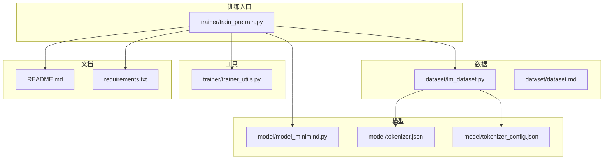
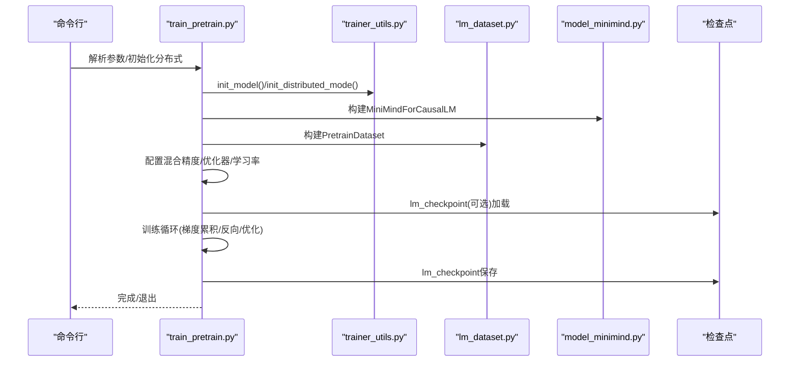

# 预训练问题

<cite>
**本文引用的文件**
- [train_pretrain.py](file://trainer/train_pretrain.py)
- [lm_dataset.py](file://dataset/lm_dataset.py)
- [model_minimind.py](file://model/model_minimind.py)
- [trainer_utils.py](file://trainer/trainer_utils.py)
- [README.md](file://README.md)
- [tokenizer.json](file://model/tokenizer.json)
- [tokenizer_config.json](file://model/tokenizer_config.json)
- [requirements.txt](file://requirements.txt)
</cite>

## 目录
1. [简介](#简介)
2. [项目结构](#项目结构)
3. [核心组件](#核心组件)
4. [架构总览](#架构总览)
5. [详细组件分析](#详细组件分析)
6. [依赖分析](#依赖分析)
7. [性能考量](#性能考量)
8. [故障排查指南](#故障排查指南)
9. [结论](#结论)
10. [附录](#附录)

## 简介
本文件聚焦 MiniMind 预训练阶段的常见问题排查与调试方法，覆盖数据加载错误、模型初始化失败、学习率设置不当、梯度累积配置问题、预训练数据格式要求、最大序列长度设置、混合精度训练配置、断点续训、内存与显存优化、大规模数据集训练等主题。文档以代码为依据，结合 README 的使用说明，提供可操作的定位与修复建议。

## 项目结构
- 预训练入口：trainer/train_pretrain.py
- 数据集与数据格式：dataset/lm_dataset.py、dataset/dataset.md
- 模型与配置：model/model_minimind.py、model/tokenizer.json、model/tokenizer_config.json
- 训练工具与断点续训：trainer/trainer_utils.py
- 使用说明与数据集规范：README.md
- 依赖清单：requirements.txt

图表来源
- [train_pretrain.py](file://trainer/train_pretrain.py)
- [lm_dataset.py](file://dataset/lm_dataset.py)
- [model_minimind.py](file://model/model_minimind.py)
- [trainer_utils.py](file://trainer/trainer_utils.py)
- [README.md](file://README.md)
- [requirements.txt](file://requirements.txt)

章节来源
- [train_pretrain.py](file://trainer/train_pretrain.py)
- [lm_dataset.py](file://dataset/lm_dataset.py)
- [model_minimind.py](file://model/model_minimind.py)
- [trainer_utils.py](file://trainer/trainer_utils.py)
- [README.md](file://README.md)
- [requirements.txt](file://requirements.txt)

## 核心组件
- 预训练训练循环与参数管理：train_pretrain.py
- 预训练数据集与数据格式：lm_dataset.py
- 模型结构与配置：model_minimind.py
- 断点续训与检查点：trainer_utils.py
- 数据格式与最大序列长度说明：README.md、lm_dataset.py
- 分词器与特殊 token：tokenizer.json、tokenizer_config.json
- 依赖版本：requirements.txt

章节来源
- [train_pretrain.py](file://trainer/train_pretrain.py)
- [lm_dataset.py](file://dataset/lm_dataset.py)
- [model_minimind.py](file://model/model_minimind.py)
- [trainer_utils.py](file://trainer/trainer_utils.py)
- [README.md](file://README.md)
- [tokenizer.json](file://model/tokenizer.json)
- [tokenizer_config.json](file://model/tokenizer_config.json)
- [requirements.txt](file://requirements.txt)

## 架构总览
预训练训练流程的关键路径：
- 参数解析与环境初始化
- 模型与分词器初始化
- 预训练数据集构建
- 混合精度与优化器配置
- 断点续训状态恢复
- 训练循环（学习率调度、梯度累积、反向传播、优化器更新）
- 检查点保存与日志

图表来源
- [train_pretrain.py](file://trainer/train_pretrain.py)
- [trainer_utils.py](file://trainer/trainer_utils.py)
- [lm_dataset.py](file://dataset/lm_dataset.py)
- [model_minimind.py](file://model/model_minimind.py)

## 详细组件分析

### 预训练训练循环与参数管理（train_pretrain.py）
- 关键参数
  - 学习率、批量大小、梯度累积步数、梯度裁剪阈值、日志/保存间隔、dtype（bfloat16/float16）、最大序列长度、是否使用 MoE、是否自动检测续训、是否使用可视化等
- 训练循环要点
  - 学习率按总步数余弦退火调度
  - 混合精度自动缩放（GradScaler）
  - 梯度累积：每 accumulation_steps 步执行一次优化器更新与梯度清零
  - 日志包含 loss、logits_loss、aux_loss、学习率、剩余时间等
  - 检查点保存：权重文件与 resume 检查点同时保存
- 断点续训
  - 自动检测 checkpoints 下的 resume 文件并恢复模型、优化器、scaler、epoch、step
  - 跨 GPU 数量时自动调整 step
  - 可选恢复可视化 run

章节来源
- [train_pretrain.py](file://trainer/train_pretrain.py)

### 预训练数据集与数据格式（lm_dataset.py）
- 数据来源与格式
  - 预训练数据为 JSONL，字段为 text（字符串）
  - 数据集加载使用 datasets.load_dataset
- 数据处理逻辑
  - 使用分词器将 text 编码为 token ids，追加 BOS/EOS，填充到 max_length
  - labels 为 input_ids 的右移版本，pad 位置设为忽略索引
  - max_length 传给分词器 truncation 时会预留 BOS/EOS 与 pad 空间
- 注意事项
  - 若 max_length 过小，会导致大量截断；过大则显存压力上升
  - pad_token_id 未设置时可能影响 labels 的 ignore 处理

章节来源
- [lm_dataset.py](file://dataset/lm_dataset.py)

### 模型结构与配置（model_minimind.py）
- 模型配置
  - MiniMindConfig：隐藏维度、层数、注意力头数、中间维度、RoPE 参数、MoE 参数等
  - 支持 MoE 前馈层与 router 辅助 loss
- 前向与损失
  - MiniMindForCausalLM 前向返回 logits、past_key_values、aux_loss
  - 损失计算使用交叉熵，忽略 labels 中的 -100
- 位置编码与注意力
  - YaRN 外推配置可选
  - Flash Attention 可用时优先使用

章节来源
- [model_minimind.py](file://model/model_minimind.py)

### 断点续训与检查点（trainer_utils.py）
- 检查点保存
  - 权重文件：按维度与 MoE 标识命名
  - resume 文件：包含模型、优化器、scaler、epoch、step、world_size、wandb_id 等
  - 保存采用临时文件 + 原子替换，避免部分写入
- 检查点加载
  - 自动检测 resume 文件并加载
  - 跨 GPU 数量时自动转换 step
  - 可选注入其他对象的状态字典
- 模型初始化
  - 从权重文件加载模型权重（非严格匹配）

章节来源
- [trainer_utils.py](file://trainer/trainer_utils.py)

### 数据格式与最大序列长度（README.md、lm_dataset.py）
- 数据格式
  - 预训练 JSONL：{"text": "..."}
- 最大序列长度
  - README 明确 tokens 为单位，中文约 1.5~1.7 字符/token，英文约 4~5 字符/token
  - 不同数据集推荐的 tokens 长度不同，需结合数据分布与显存预算选择

章节来源
- [README.md](file://README.md)
- [lm_dataset.py](file://dataset/lm_dataset.py)

### 分词器与特殊 token（tokenizer.json、tokenizer_config.json）
- 分词器配置
  - BPE + ByteLevel
  - 特殊 token 包含 BOS/EOS、工具/思考标记、音频/视频占位等
- 影响
  - 特殊 token 的存在会影响输入/标签构造与 pad 处理
  - chat_template 与 reasoning/tool 标记在后续阶段使用

章节来源
- [tokenizer.json](file://model/tokenizer.json)
- [tokenizer_config.json](file://model/tokenizer_config.json)

## 依赖分析
- 训练依赖
  - transformers、datasets、torch、torch.distributed、swanlab/wandb
- 版本建议
  - README 提示注意 CUDA 可用性与后端
  - requirements.txt 提供依赖版本清单

章节来源
- [requirements.txt](file://requirements.txt)
- [README.md](file://README.md)

## 性能考量
- 混合精度
  - dtype=bfloat16 或 float16；float16 需启用 GradScaler
- 梯度累积
  - 通过增大 accumulation_steps 减少显存峰值，提高有效 batch size
- 序列长度
  - max_seq_len 与 batch_size 共同决定显存占用
- 分布式训练
  - DDP 训练时注意跨 GPU 数量的 step 调整与同步
- 优化器与学习率
  - 余弦退火学习率，结合梯度裁剪避免爆炸

章节来源
- [train_pretrain.py](file://trainer/train_pretrain.py)
- [trainer_utils.py](file://trainer/trainer_utils.py)

## 故障排查指南

### 一、数据加载错误
- 症状
  - 训练开始即报错，或 DataLoader 无法产生 batch
- 常见原因与排查
  - 数据文件路径错误或权限不足
    - 确认 data_path 指向正确的 JSONL 文件
    - 确认文件存在且可读
  - 数据格式不符合预期
    - 预训练数据应为 JSONL，每行包含 text 字段
    - 参考 README 的数据格式说明
  - 分词器未正确初始化
    - 确保 tokenizer.json 与 tokenizer_config.json 存在于指定目录
    - 确保分词器加载成功（AutoTokenizer.from_pretrained）
  - max_length 设置过小导致大量截断
    - 结合 README 的推荐长度与数据分布调整 max_seq_len
  - pad_token_id 未设置
    - 导致 labels 的 ignore 处理异常，检查分词器配置与数据构造逻辑

章节来源
- [lm_dataset.py](file://dataset/lm_dataset.py)
- [README.md](file://README.md)
- [tokenizer.json](file://model/tokenizer.json)
- [tokenizer_config.json](file://model/tokenizer_config.json)

### 二、模型初始化失败
- 症状
  - 模型构建时报错或权重加载失败
- 常见原因与排查
  - 权重文件不存在或命名不匹配
    - 检查 save_dir 下是否存在 pretrain_*_*.pth
    - MoE 与非 MoE 的权重文件命名不同
  - 权重文件损坏或版本不兼容
    - 重新训练或使用官方权重
  - from_weight 参数与权重文件不一致
    - 确认 from_weight 与 save_weight 前缀一致
  - 设备不匹配
    - 确认 device 与权重 map_location 设置一致

章节来源
- [trainer_utils.py](file://trainer/trainer_utils.py)
- [model_minimind.py](file://model/model_minimind.py)

### 三、学习率设置不当
- 症状
  - 训练初期 loss 波动大、收敛缓慢或 NaN
- 常见原因与排查
  - 学习率过高或过低
    - 使用余弦退火调度，适当调整初始学习率
  - 未启用混合精度或 dtype 设置错误
    - float16 需启用 GradScaler；bfloat16 可直接 autocast
  - 梯度裁剪阈值不合适
    - 调整 grad_clip，避免梯度爆炸或消失

章节来源
- [train_pretrain.py](file://trainer/train_pretrain.py)

### 四、梯度累积配置问题
- 症状
  - 显存不足或训练速度过慢
- 常见原因与排查
  - accumulation_steps 设置不合理
    - 过小：显存压力大，更新频率高
    - 过大：收敛不稳定，有效 batch size 增长有限
  - 优化器更新时机错误
    - 确保每 accumulation_steps 步执行一次 step/update/zero_grad
  - 梯度累积与学习率的关系
    - 有效 batch size 与 accumulation_steps 成正比，必要时按比例调整学习率

章节来源
- [train_pretrain.py](file://trainer/train_pretrain.py)

### 五、预训练数据格式要求
- 必须字段
  - 预训练 JSONL：text（字符串）
- 建议
  - 使用 README 推荐的数据集与长度
  - 避免过长或过短样本集中出现，保持分布均衡

章节来源
- [README.md](file://README.md)
- [lm_dataset.py](file://dataset/lm_dataset.py)

### 六、最大序列长度设置
- 建议
  - 结合 README 的推荐长度与数据分布选择 max_seq_len
  - 中文约 1.5~1.7 字符/token，英文约 4~5 字符/token
  - 过大导致显存压力，过小导致截断

章节来源
- [README.md](file://README.md)
- [lm_dataset.py](file://dataset/lm_dataset.py)

### 七、混合精度训练配置
- 建议
  - dtype=bfloat16 或 float16
  - float16 需启用 GradScaler
  - CPU 训练时使用 autocast 上下文

章节来源
- [train_pretrain.py](file://trainer/train_pretrain.py)

### 八、断点续训操作指南
- 操作步骤
  - 启动时添加 --from_resume 1
  - 程序自动检测 checkpoints 下的 resume 文件并恢复
  - 跨 GPU 数量时自动调整 step
  - 可选恢复可视化 run
- 检查点文件格式
  - 权重文件：pretrain_*.pth
  - 恢复文件：pretrain_*.pth.tmp + .tmp 原子替换
- 权重加载顺序
  - 先加载模型权重，再加载优化器与 scaler 状态
- 优化器状态恢复
  - 保存与加载 optimizer.state_dict 与 scaler.state_dict

章节来源
- [train_pretrain.py](file://trainer/train_pretrain.py)
- [trainer_utils.py](file://trainer/trainer_utils.py)

### 九、内存与显存优化
- 显存优化
  - 降低 max_seq_len 或 batch_size
  - 合理设置 accumulation_steps
  - 使用混合精度（bfloat16/float16）
  - 分布式训练时注意 world_size 与 step 的一致性
- 内存管理
  - 训练循环中及时删除不必要的张量
  - 使用 set_to_none=True 清零梯度
  - 保存检查点时使用临时文件 + 原子替换

章节来源
- [train_pretrain.py](file://trainer/train_pretrain.py)
- [trainer_utils.py](file://trainer/trainer_utils.py)

### 十、大规模数据集训练问题
- 建议
  - 使用 DistributedSampler 与 DataLoader
  - 合理设置 num_workers 与 pin_memory
  - 预训练数据建议使用 README 推荐的 pretrain_t2t_mini.jsonl 或 pretrain_t2t.jsonl
  - 调整 max_seq_len 与 batch_size 以平衡吞吐与显存

章节来源
- [train_pretrain.py](file://trainer/train_pretrain.py)
- [README.md](file://README.md)

## 结论
本文件基于代码与文档梳理了 MiniMind 预训练阶段的常见问题与排查方法，重点覆盖数据格式、模型初始化、学习率与梯度累积、混合精度、断点续训、内存与显存优化以及大规模数据集训练。建议在调试时遵循“参数—数据—模型—训练循环—检查点”的顺序逐步定位问题，并结合 README 的数据与参数建议进行验证。

## 附录
- 关键参数一览
  - 学习率、批量大小、梯度累积步数、梯度裁剪阈值、日志/保存间隔、dtype、最大序列长度、MoE 开关、数据路径、权重路径、是否自动检测续训、是否使用可视化
- 参考文件
  - train_pretrain.py、lm_dataset.py、model_minimind.py、trainer_utils.py、README.md、tokenizer.json、tokenizer_config.json、requirements.txt