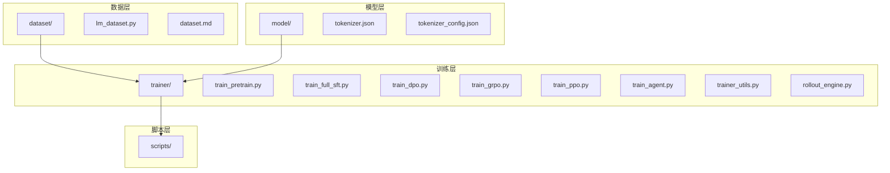
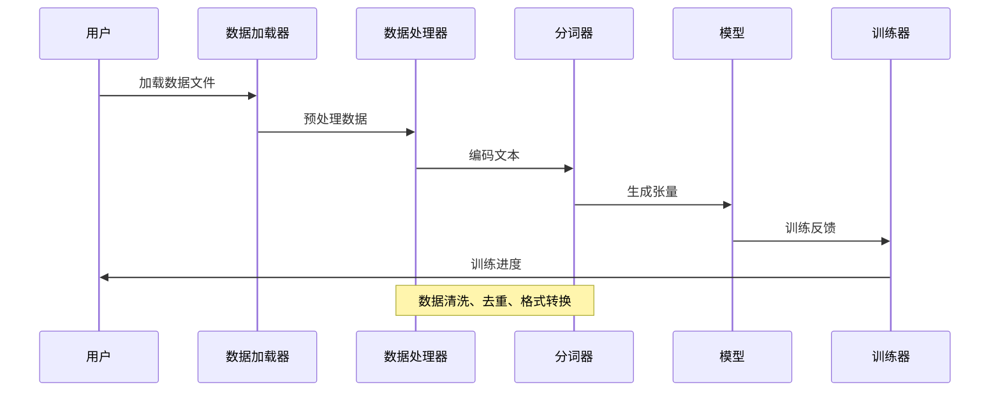
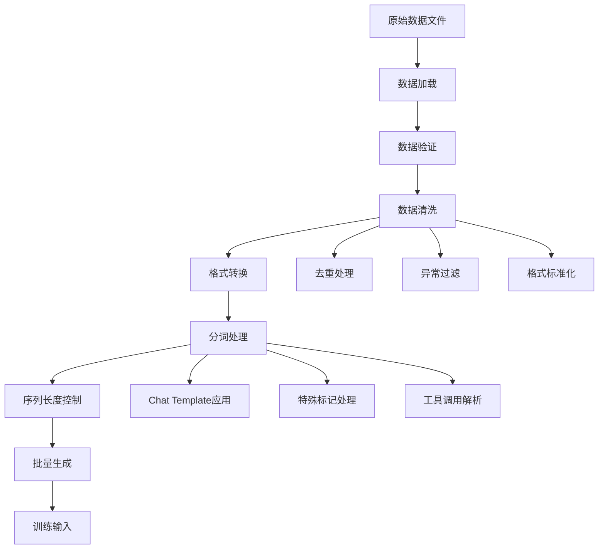
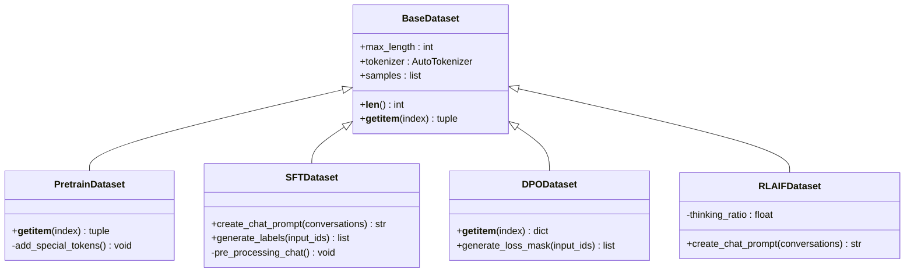
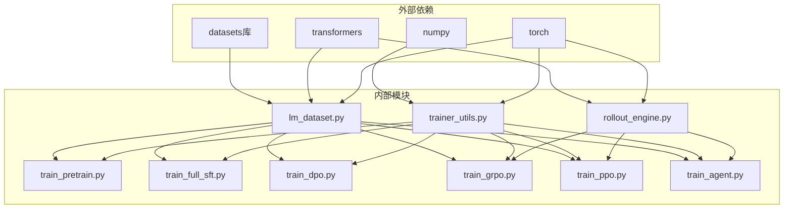

# 数据处理系统

<cite>
**本文档引用的文件**
- [dataset.md](file://dataset/dataset.md)
- [lm_dataset.py](file://dataset/lm_dataset.py)
- [tokenizer.json](file://model/tokenizer.json)
- [tokenizer_config.json](file://model/tokenizer_config.json)
- [train_pretrain.py](file://trainer/train_pretrain.py)
- [train_full_sft.py](file://trainer/train_full_sft.py)
- [train_dpo.py](file://trainer/train_dpo.py)
- [train_grpo.py](file://trainer/train_grpo.py)
- [train_ppo.py](file://trainer/train_ppo.py)
- [train_agent.py](file://trainer/train_agent.py)
- [trainer_utils.py](file://trainer/trainer_utils.py)
- [rollout_engine.py](file://trainer/rollout_engine.py)
- [README.md](file://README.md)
- [README_en.md](file://README_en.md)
</cite>

## 目录
1. [简介](#简介)
2. [项目结构](#项目结构)
3. [核心组件](#核心组件)
4. [架构概览](#架构概览)
5. [详细组件分析](#详细组件分析)
6. [依赖关系分析](#依赖关系分析)
7. [性能考虑](#性能考虑)
8. [故障排除指南](#故障排除指南)
9. [结论](#结论)
10. [附录](#附录)

## 简介

MiniMind 数据处理系统是一个完整的机器学习数据处理框架，专门设计用于训练和微调语言模型。该系统支持多种训练范式，包括预训练、监督微调、强化学习和指令跟随训练。

系统的核心特点：
- 支持多种数据格式（JSONL、Chat Template）
- 提供完整的数据清洗和去重流程
- 实现了从原始文本到训练张量的完整管道
- 包含多种训练算法的专用数据处理模块

## 项目结构

**图表来源**
- [dataset.md](file://dataset/dataset.md)
- [lm_dataset.py](file://dataset/lm_dataset.py)
- [tokenizer.json](file://model/tokenizer.json)
- [tokenizer_config.json](file://model/tokenizer_config.json)
- [train_pretrain.py](file://trainer/train_pretrain.py)

**章节来源**
- [dataset.md](file://dataset/dataset.md)
- [README.md](file://README.md)

## 核心组件

### 数据集处理模块

系统提供了专门的数据集处理类，支持不同类型的训练需求：

#### 预训练数据集 (PretrainDataset)
- 处理纯文本数据
- 自动添加特殊标记
- 支持最大长度控制

#### 监督微调数据集 (SFTDataset)
- 处理对话格式数据
- 支持工具调用
- 实现标签生成逻辑

#### 偏好优化数据集 (DPODataset)
- 处理偏好学习格式
- 支持正负样本对比
- 实现损失掩码生成

#### 强化学习数据集 (RLAIFDataset)
- 支持思维链生成
- 实现批量提示生成
- 支持推理奖励计算

**章节来源**
- [lm_dataset.py](file://dataset/lm_dataset.py)

### 分词器配置

系统使用自定义的分词器配置，支持：
- 特殊标记定义
- Chat Template 模板
- 多模态支持（文本、音频、图像）

**章节来源**
- [tokenizer.json](file://model/tokenizer.json)
- [tokenizer_config.json](file://model/tokenizer_config.json)

## 架构概览

**图表来源**
- [lm_dataset.py](file://dataset/lm_dataset.py)
- [trainer_utils.py](file://trainer/trainer_utils.py)

## 详细组件分析

### 数据预处理流水线

**图表来源**
- [lm_dataset.py](file://dataset/lm_dataset.py)
- [tokenizer_config.json](file://model/tokenizer_config.json)

#### 数据清洗和去重流程

系统实现了多层次的数据清洗机制：

1. **去重处理**：通过比较对话内容识别重复样本
2. **异常过滤**：过滤格式错误或异常的数据
3. **格式标准化**：统一数据格式标准

#### Chat Template 使用

系统支持复杂的对话模板：
- 支持系统消息
- 支持工具调用
- 支持思维链格式
- 支持多轮对话

**章节来源**
- [lm_dataset.py](file://dataset/lm_dataset.py)
- [tokenizer_config.json](file://model/tokenizer_config.json)

### 训练数据格式规范

#### 预训练数据格式 (pretrain_t2t)
- 单字段格式：`{"text": "..."}`

#### 监督微调数据格式 (sft_t2t)
- 对话格式：包含多个角色的消息
- 工具调用支持：通过 `tool_calls` 字段标识

#### 强化学习数据格式 (rlaif)
- 批量提示生成
- 支持思维链开启/关闭

#### 偏好优化数据格式 (dpo)
- 成对格式：`{"chosen": [...], "rejected": [...]}`

**章节来源**
- [README.md](file://README.md)
- [README_en.md](file://README_en.md)

### 数据处理算法

**图表来源**
- [lm_dataset.py](file://dataset/lm_dataset.py)

**章节来源**
- [lm_dataset.py](file://dataset/lm_dataset.py)

## 依赖关系分析

**图表来源**
- [lm_dataset.py](file://dataset/lm_dataset.py)
- [trainer_utils.py](file://trainer/trainer_utils.py)
- [rollout_engine.py](file://trainer/rollout_engine.py)

**章节来源**
- [lm_dataset.py](file://dataset/lm_dataset.py)
- [trainer_utils.py](file://trainer/trainer_utils.py)

## 性能考虑

### 内存优化策略

1. **批处理优化**：动态调整批大小以适应内存限制
2. **梯度累积**：减少内存占用同时保持有效批量
3. **半精度训练**：使用 bfloat16/float16 减少显存消耗
4. **分布式训练**：支持多GPU并行训练

### 训练效率优化

1. **混合精度训练**：自动混合精度减少训练时间
2. **梯度裁剪**：防止梯度爆炸提高稳定性
3. **学习率调度**：余弦退火优化收敛速度
4. **检查点机制**：支持断点续训

## 故障排除指南

### 常见问题及解决方案

#### 数据加载问题
- **问题**：JSONL 文件格式错误
- **解决方案**：检查文件编码和格式完整性

#### 内存不足问题
- **问题**：GPU 内存溢出
- **解决方案**：减小批大小或启用梯度累积

#### 训练不稳定问题
- **问题**：损失值异常波动
- **解决方案**：调整学习率或启用梯度裁剪

#### 推理性能问题
- **问题**：生成速度慢
- **解决方案**：使用 SGLang 推理引擎或优化批处理

**章节来源**
- [trainer_utils.py](file://trainer/trainer_utils.py)
- [rollout_engine.py](file://trainer/rollout_engine.py)

## 结论

MiniMind 数据处理系统提供了一个完整、高效且灵活的数据处理框架，支持从原始数据到训练完成的全流程。系统的主要优势包括：

1. **多功能性**：支持多种训练范式和数据格式
2. **可扩展性**：模块化设计便于功能扩展
3. **性能优化**：内置多种性能优化策略
4. **易用性**：提供清晰的接口和详细的文档

该系统为研究人员和开发者提供了一个强大的工具，可以高效地处理各种规模的机器学习数据集。

## 附录

### 数据质量控制最佳实践

1. **数据验证**：在加载前验证数据格式和完整性
2. **去重策略**：使用内容相似度检测避免重复样本
3. **平衡性检查**：确保各类别数据分布均衡
4. **边界测试**：验证极端情况下的系统行为

### 性能基准

- **预训练**：支持大规模文本数据处理
- **SFT**：优化对话数据处理效率
- **RL**：提供高效的强化学习数据生成
- **DPO**：实现快速偏好学习训练