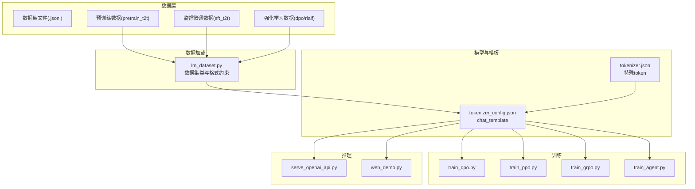
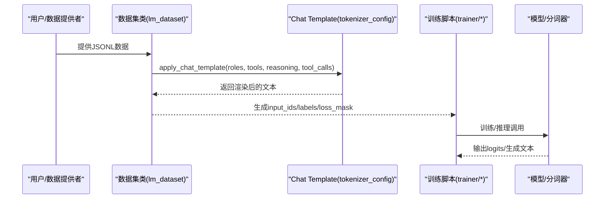
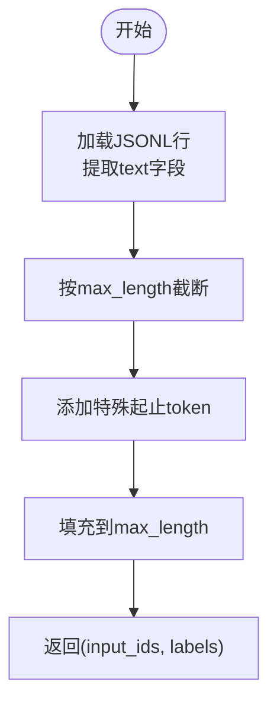
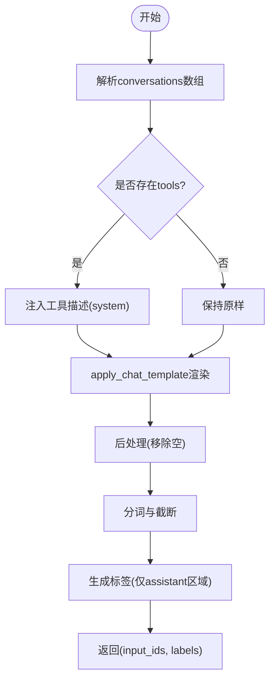
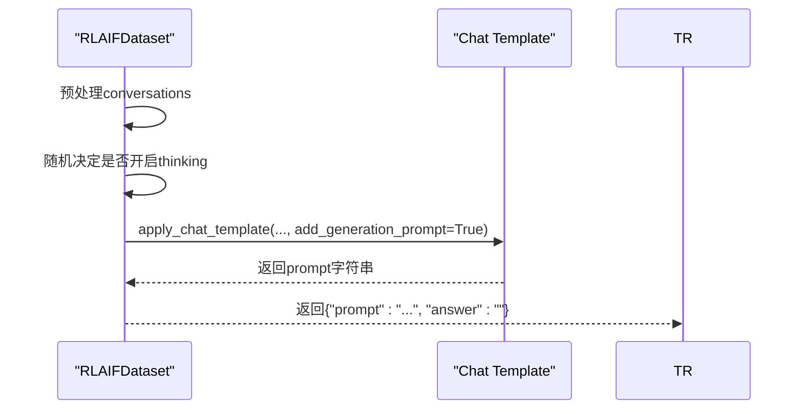
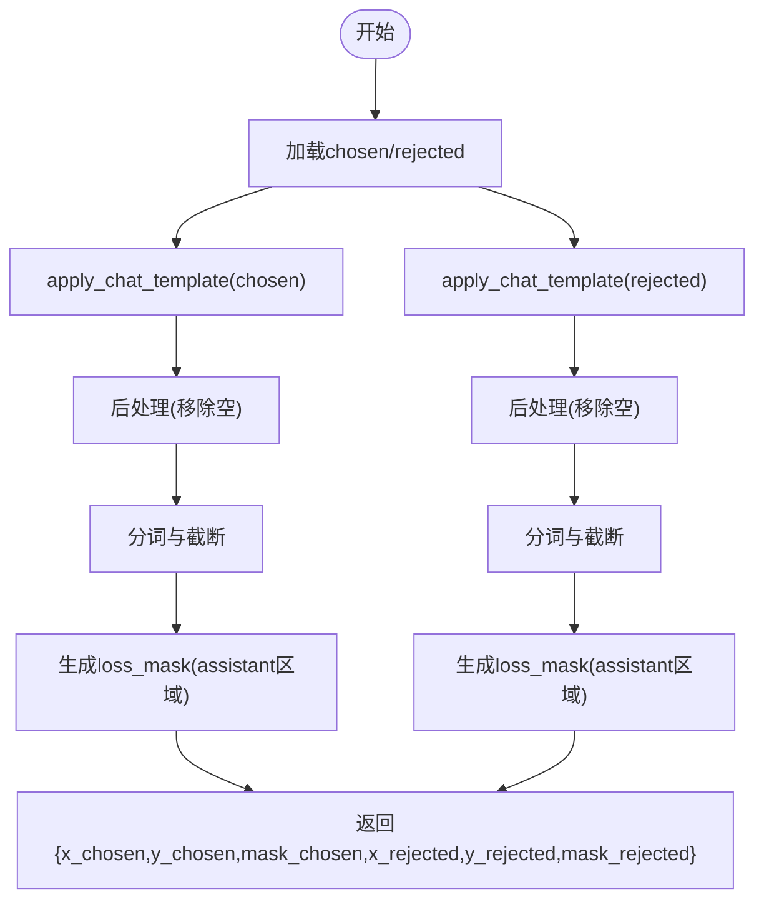
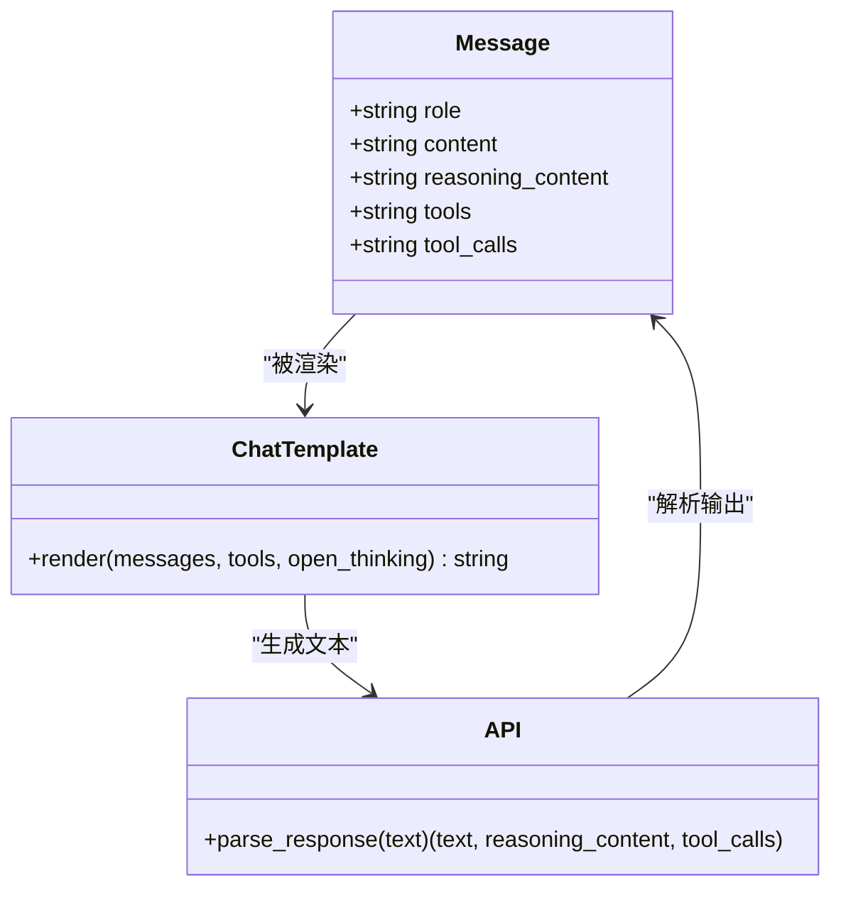
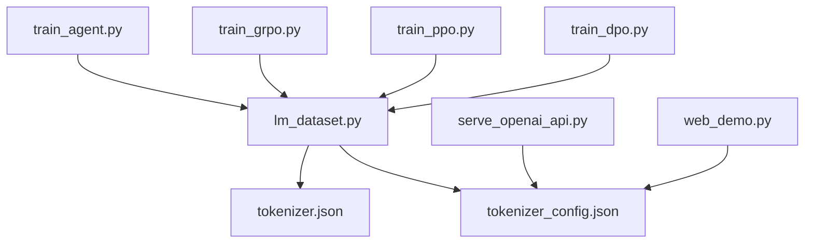

# 数据格式规范

<cite>
**本文引用的文件**
- [README.md](file://README.md)
- [lm_dataset.py](file://dataset/lm_dataset.py)
- [tokenizer.json](file://model/tokenizer.json)
- [tokenizer_config.json](file://model/tokenizer_config.json)
- [train_dpo.py](file://trainer/train_dpo.py)
- [train_ppo.py](file://trainer/train_ppo.py)
- [train_grpo.py](file://trainer/train_grpo.py)
- [train_agent.py](file://trainer/train_agent.py)
- [serve_openai_api.py](file://scripts/serve_openai_api.py)
- [web_demo.py](file://scripts/web_demo.py)
</cite>

## 目录
1. [简介](#简介)
2. [项目结构](#项目结构)
3. [核心组件](#核心组件)
4. [架构总览](#架构总览)
5. [详细组件分析](#详细组件分析)
6. [依赖分析](#依赖分析)
7. [性能考量](#性能考量)
8. [故障排查指南](#故障排查指南)
9. [结论](#结论)
10. [附录](#附录)

## 简介
本文件系统化梳理 MiniMind 的数据格式规范，覆盖预训练（pretrain_t2t）、监督微调（sft_t2t）、强化学习（RLAIF、DPO）三类训练阶段的数据格式，以及 Chat Template 规范、工具调用（tool_calls）与思考链（reasoning_content）格式。文档基于仓库内数据加载、训练脚本与推理接口的实现进行归纳，提供字段定义、示例与常见错误定位方法，帮助读者正确准备与验证数据。

## 项目结构
MiniMind 的数据格式与训练脚本紧密耦合，核心数据格式由以下模块共同定义与消费：
- 数据加载与格式约束：dataset/lm_dataset.py
- 分词器与 Chat Template：model/tokenizer.json、model/tokenizer_config.json
- 训练脚本：trainer/train_dpo.py、trainer/train_ppo.py、trainer/train_grpo.py、trainer/train_agent.py
- 推理接口：scripts/serve_openai_api.py、scripts/web_demo.py

**图表来源**
- [lm_dataset.py:37-253](file://dataset/lm_dataset.py#L37-L253)
- [tokenizer_config.json:333-335](file://model/tokenizer_config.json#L333-L335)
- [train_dpo.py:190-190](file://trainer/train_dpo.py#L190-L190)
- [train_ppo.py:396-396](file://trainer/train_ppo.py#L396-L396)
- [train_grpo.py:291-291](file://trainer/train_grpo.py#L291-L291)
- [train_agent.py:249-249](file://trainer/train_agent.py#L249-L249)
- [serve_openai_api.py:105-164](file://scripts/serve_openai_api.py#L105-L164)
- [web_demo.py:355-401](file://scripts/web_demo.py#L355-L401)

**章节来源**
- [README.md:400-555](file://README.md#L400-L555)
- [lm_dataset.py:37-253](file://dataset/lm_dataset.py#L37-L253)
- [tokenizer_config.json:333-335](file://model/tokenizer_config.json#L333-L335)

## 核心组件
- 数据集类与格式约束
  - PretrainDataset：加载纯文本字段 text，用于自回归预训练。
  - SFTDataset：加载 conversations 数组，支持 system、user、assistant、tool 角色，以及 reasoning_content、tools、tool_calls 字段。
  - DPODataset：加载 chosen/rejected 偏好对，每条样本为对话片段数组。
  - RLAIFDataset：加载 conversations 数组，构造带生成提示的对话模板。
  - AgentRLDataset：加载 conversations 数组与 ground-truth 标签，用于多轮工具使用强化学习。
- Chat Template 与特殊 token
  - tokenizer_config.json 中定义 chat_template，支持 tools、reasoning_content、tool_calls、open_thinking 等。
  - tokenizer.json 定义特殊 token，如 <|im_start|>、<|im_end|>、<think>、</think>、<tool_call>、</tool_call> 等。

**章节来源**
- [lm_dataset.py:37-253](file://dataset/lm_dataset.py#L37-L253)
- [tokenizer_config.json:333-335](file://model/tokenizer_config.json#L333-L335)
- [tokenizer.json:233-248](file://model/tokenizer.json#L233-L248)

## 架构总览
MiniMind 的数据格式贯穿“数据 → 数据集类 → 训练/推理模板 → 模型输入”的链路。不同训练阶段对 conversations 的结构与字段要求不同，但均通过 apply_chat_template 统一渲染为模型可接受的输入。

**图表来源**
- [lm_dataset.py:71-86](file://dataset/lm_dataset.py#L71-L86)
- [train_dpo.py:190-190](file://trainer/train_dpo.py#L190-L190)
- [train_ppo.py:396-396](file://trainer/train_ppo.py#L396-L396)
- [train_grpo.py:291-291](file://trainer/train_grpo.py#L291-L291)
- [train_agent.py:249-249](file://trainer/train_agent.py#L249-L249)

## 详细组件分析

### 预训练数据（pretrain_t2t）
- 数据来源与用途
  - 用于自回归预训练，目标是学习语言统计规律与知识表示。
- 数据格式
  - 单行 JSON 对象，包含 text 字段，值为纯文本字符串。
- 示例字段
  - text：训练样本的完整文本。
- 训练时序
  - 数据加载后，按最大长度截断并在首尾添加特殊 token，生成 input_ids 与 labels（pad 位置设为忽略标签）。
- 注意事项
  - 文本长度需结合 tokenizer 的字符/token 比例合理设置 max_seq_len，避免过长导致显存压力过大。

**图表来源**
- [lm_dataset.py:37-55](file://dataset/lm_dataset.py#L37-L55)

**章节来源**
- [README.md:400-424](file://README.md#L400-L424)
- [lm_dataset.py:37-55](file://dataset/lm_dataset.py#L37-L55)

### 监督微调数据（sft_t2t）
- 数据来源与用途
  - 用于指令跟随与对话能力对齐，支持思考链与工具调用。
- 数据格式
  - 单行 JSON 对象，包含 conversations 数组，数组元素为消息对象。
- conversations 消息对象字段
  - role：角色，可为 system、user、assistant、tool。
  - content：文本内容。
  - reasoning_content（可选）：思考链内容。
  - tools（可选）：系统工具描述（JSON 字符串或对象）。
  - tool_calls（可选）：工具调用列表（JSON 字符串或对象）。
- Chat Template 渲染要点
  - 若存在 tools，将在 system 角色中注入工具描述。
  - assistant 角色可包含 <think>...</think> 区块与工具调用标记。
  - 最终生成的 prompt 通过 tokenizer.apply_chat_template 渲染。
- 训练时序
  - 预处理 conversations（如概率插入 system），渲染 prompt，生成 labels（仅对 assistant 回答部分参与损失）。

**图表来源**
- [lm_dataset.py:58-119](file://dataset/lm_dataset.py#L58-L119)
- [tokenizer_config.json:333-335](file://model/tokenizer_config.json#L333-L335)

**章节来源**
- [README.md:425-462](file://README.md#L425-L462)
- [lm_dataset.py:58-119](file://dataset/lm_dataset.py#L58-L119)
- [tokenizer_config.json:333-335](file://model/tokenizer_config.json#L333-L335)

### 强化学习数据（RLAIF）
- 数据来源与用途
  - 用于 PPO/GRPO/CISPO 等强化学习算法，构造带生成提示的对话模板。
- 数据格式
  - 单行 JSON 对象，包含 conversations 数组。
- 训练时序
  - 预处理 conversations（如概率插入 system），根据 thinking_ratio 决定是否开启思考标签，生成带生成提示的模板字符串。

**图表来源**
- [lm_dataset.py:195-224](file://dataset/lm_dataset.py#L195-L224)

**章节来源**
- [lm_dataset.py:195-224](file://dataset/lm_dataset.py#L195-L224)
- [train_ppo.py:396-396](file://trainer/train_ppo.py#L396-L396)
- [train_grpo.py:291-291](file://trainer/train_grpo.py#L291-L291)

### 偏好优化数据（DPO）
- 数据来源与用途
  - 用于 DPO 偏好优化，比较“更好”与“较差”的回复。
- 数据格式
  - 单行 JSON 对象，包含 chosen 与 rejected 字段，二者均为对话片段数组（role/content）。
- 训练时序
  - 分别对 chosen/rejected 应用模板与后处理，分词并生成 loss mask（仅对 assistant 区域参与损失）。

**图表来源**
- [lm_dataset.py:122-174](file://dataset/lm_dataset.py#L122-L174)
- [train_dpo.py:190-190](file://trainer/train_dpo.py#L190-L190)

**章节来源**
- [README.md:463-482](file://README.md#L463-L482)
- [lm_dataset.py:122-174](file://dataset/lm_dataset.py#L122-L174)
- [train_dpo.py:190-190](file://trainer/train_dpo.py#L190-L190)

### 工具调用与思考链（tool_calls / reasoning_content）
- 字段说明
  - reasoning_content：assistant 回答中的思考内容，通常包裹在 <think>...</think> 中。
  - tool_calls：assistant 的工具调用列表，每个调用包含 name 与 arguments；在模板中以 <tool_call>...<tool_call> 包裹的 JSON 字符串呈现。
  - tools：系统工具描述，仅在 system 角色中出现，用于告知模型可用工具。
- Chat Template 行为
  - 若存在 tools，则在 system 角色中注入工具清单；assistant 角色可包含 reasoning_content 与 tool_calls。
  - 支持 open_thinking 参数以控制是否输出空思考标签。
- 推理接口处理
  - serve_openai_api.py 与 web_demo.py 均支持解析 <think> 与 <tool_call>...<tool_call> 标记，提取 reasoning_content 与 tool_calls 并在流式响应中返回。

**图表来源**
- [lm_dataset.py:71-86](file://dataset/lm_dataset.py#L71-L86)
- [tokenizer_config.json:333-335](file://model/tokenizer_config.json#L333-L335)
- [serve_openai_api.py:83-102](file://scripts/serve_openai_api.py#L83-L102)
- [web_demo.py:149-164](file://scripts/web_demo.py#L149-L164)

**章节来源**
- [README.md:425-462](file://README.md#L425-L462)
- [lm_dataset.py:71-86](file://dataset/lm_dataset.py#L71-L86)
- [tokenizer_config.json:333-335](file://model/tokenizer_config.json#L333-L335)
- [serve_openai_api.py:83-102](file://scripts/serve_openai_api.py#L83-L102)
- [web_demo.py:149-164](file://scripts/web_demo.py#L149-L164)

## 依赖分析
- 数据集类依赖
  - SFTDataset、DPODataset、RLAIFDataset、AgentRLDataset 均依赖 tokenizer_config.json 的 chat_template 与 tokenizer.json 的特殊 token。
- 训练脚本依赖
  - train_dpo.py、train_ppo.py、train_grpo.py、train_agent.py 通过数据集类加载数据，并在各自训练循环中消费 input_ids/labels/loss_mask 或模板字符串。
- 推理接口依赖
  - serve_openai_api.py、web_demo.py 依赖 chat_template 解析与渲染逻辑，以支持 reasoning_content 与 tool_calls 的流式输出。

**图表来源**
- [lm_dataset.py:37-253](file://dataset/lm_dataset.py#L37-L253)
- [tokenizer_config.json:333-335](file://model/tokenizer_config.json#L333-L335)
- [tokenizer.json:233-248](file://model/tokenizer.json#L233-L248)
- [train_dpo.py:190-190](file://trainer/train_dpo.py#L190-L190)
- [train_ppo.py:396-396](file://trainer/train_ppo.py#L396-L396)
- [train_grpo.py:291-291](file://trainer/train_grpo.py#L291-L291)
- [train_agent.py:249-249](file://trainer/train_agent.py#L249-L249)
- [serve_openai_api.py:105-164](file://scripts/serve_openai_api.py#L105-L164)
- [web_demo.py:355-401](file://scripts/web_demo.py#L355-L401)

**章节来源**
- [lm_dataset.py:37-253](file://dataset/lm_dataset.py#L37-L253)
- [tokenizer_config.json:333-335](file://model/tokenizer_config.json#L333-L335)
- [tokenizer.json:233-248](file://model/tokenizer.json#L233-L248)
- [train_dpo.py:190-190](file://trainer/train_dpo.py#L190-L190)
- [train_ppo.py:396-396](file://trainer/train_ppo.py#L396-L396)
- [train_grpo.py:291-291](file://trainer/train_grpo.py#L291-L291)
- [train_agent.py:249-249](file://trainer/train_agent.py#L249-L249)
- [serve_openai_api.py:105-164](file://scripts/serve_openai_api.py#L105-L164)
- [web_demo.py:355-401](file://scripts/web_demo.py#L355-L401)

## 性能考量
- 截断与填充
  - 预训练与 SFT 均对输入进行截断与填充，建议根据数据分布设置合理的 max_seq_len，避免过度 padding 导致算力浪费。
- 损失掩码
  - SFT 与 DPO 仅对 assistant 区域计算损失，提高训练效率并避免干扰 system/user 等角色。
- 推理时长
  - RLAIF/Agent RL 的 rollout 生成会增加推理时间，建议在训练时合理设置 num_generations 与 max_gen_len。

[本节为通用指导，无需引用具体文件]

## 故障排查指南
- conversations 结构错误
  - 症状：训练时报错或生成异常。
  - 排查：确认 conversations 中每个元素包含合法 role 与 content；若包含 tools/tool_calls，需确保 JSON 格式正确且与 chat_template 兼容。
- reasoning_content 与工具调用标记不匹配
  - 症状：<think> 未闭合或 <tool_call>...<tool_call> 标记缺失/错位。
  - 排查：检查模板渲染逻辑，确保 reasoning_content 与 tool_calls 的包裹与顺序正确；推理接口会尝试解析并清理多余标记。
- DPO chosen/rejected 不匹配
  - 症状：DPO 训练不稳定或 loss 异常。
  - 排查：确保 chosen/rejected 为同一问题的不同回答，assistant 区域长度与结构一致；必要时对齐对话轮次。
- RLAIF/Agent RL 生成质量差
  - 症状：回复过短/过长、无思考链或工具调用失败。
  - 排查：调整 thinking_ratio、max_gen_len 与 num_generations；检查 tools 定义与工具参数校验逻辑。

**章节来源**
- [lm_dataset.py:71-86](file://dataset/lm_dataset.py#L71-L86)
- [lm_dataset.py:122-174](file://dataset/lm_dataset.py#L122-L174)
- [lm_dataset.py:195-224](file://dataset/lm_dataset.py#L195-L224)
- [train_agent.py:182-238](file://trainer/train_agent.py#L182-L238)
- [serve_openai_api.py:83-102](file://scripts/serve_openai_api.py#L83-L102)
- [web_demo.py:149-164](file://scripts/web_demo.py#L149-L164)

## 结论
MiniMind 的数据格式以 conversations 为核心，通过统一的 Chat Template 实现预训练、监督微调、强化学习与推理的无缝衔接。遵循本文档的字段定义与验证规则，可有效提升数据质量与训练稳定性。建议在准备数据时：
- 明确训练阶段与数据格式要求；
- 严格遵循 role/content 与 tools/tool_calls 的结构；
- 使用 chat_template 进行一致性渲染；
- 在推理阶段正确解析 reasoning_content 与 tool_calls。

[本节为总结，无需引用具体文件]

## 附录
- 数据格式示例与字段说明
  - 预训练（pretrain_t2t）
    - 字段：text（字符串）
    - 示例：参见 README.md 中的 JSONL 示例
  - 监督微调（sft_t2t）
    - 字段：conversations（数组），元素包含 role、content、reasoning_content（可选）、tools（可选）、tool_calls（可选）
    - 示例：参见 README.md 中的 conversations 示例
  - 偏好优化（DPO）
    - 字段：chosen（数组，对话片段）、rejected（数组，对话片段）
    - 示例：参见 README.md 中的 DPO 示例
  - RLAIF
    - 字段：conversations（数组），训练时生成带生成提示的模板字符串
  - 工具调用与思考链
    - 字段：reasoning_content（包裹在 <think>...</think>）、tool_calls（包裹在 <tool_call>...</tool_call>）
    - 渲染与解析：参见 tokenizer_config.json 的 chat_template 与推理接口

**章节来源**
- [README.md:400-555](file://README.md#L400-L555)
- [tokenizer_config.json:333-335](file://model/tokenizer_config.json#L333-L335)
- [lm_dataset.py:58-119](file://dataset/lm_dataset.py#L58-L119)
- [lm_dataset.py:122-174](file://dataset/lm_dataset.py#L122-L174)
- [lm_dataset.py:195-224](file://dataset/lm_dataset.py#L195-L224)
- [serve_openai_api.py:83-102](file://scripts/serve_openai_api.py#L83-L102)
- [web_demo.py:149-164](file://scripts/web_demo.py#L149-L164)