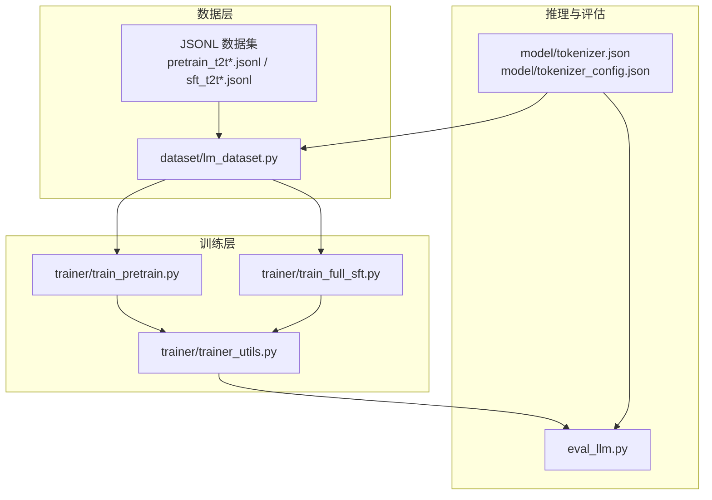
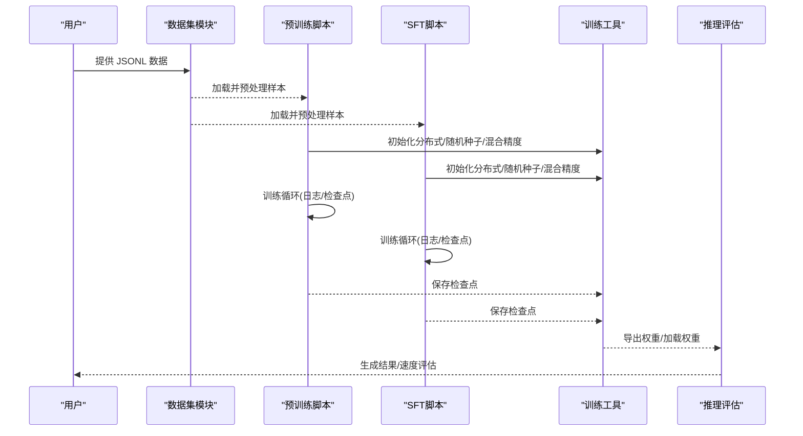
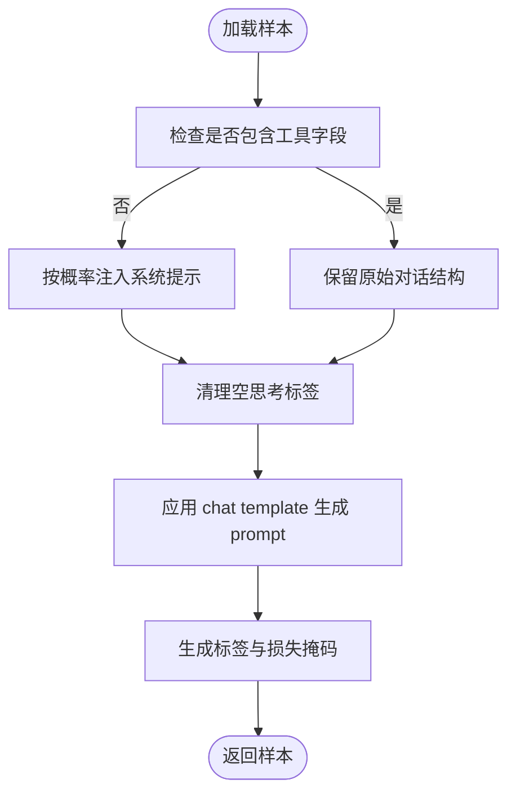
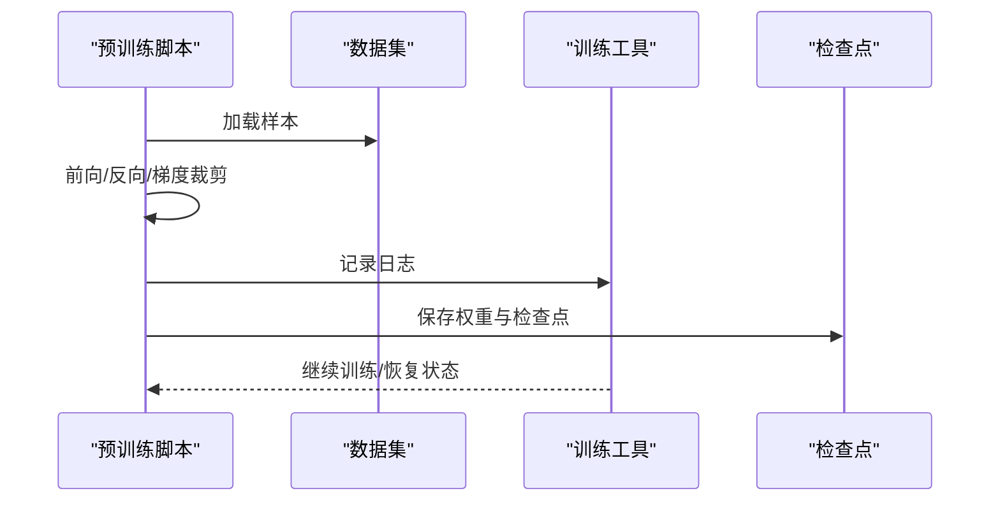
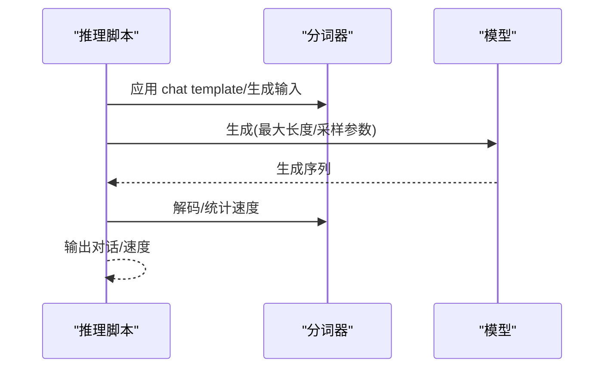
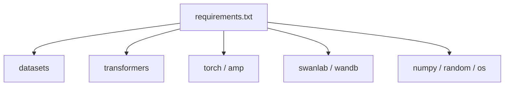

# 数据质量控制

<cite>
**本文引用的文件**
- [README.md](file://README.md)
- [dataset/lm_dataset.py](file://dataset/lm_dataset.py)
- [trainer/train_pretrain.py](file://trainer/train_pretrain.py)
- [trainer/train_full_sft.py](file://trainer/train_full_sft.py)
- [eval_llm.py](file://eval_llm.py)
- [trainer/trainer_utils.py](file://trainer/trainer_utils.py)
- [requirements.txt](file://requirements.txt)
- [model/tokenizer.json](file://model/tokenizer.json)
- [model/tokenizer_config.json](file://model/tokenizer_config.json)
</cite>

## 目录
1. [引言](#引言)
2. [项目结构](#项目结构)
3. [核心组件](#核心组件)
4. [架构总览](#架构总览)
5. [详细组件分析](#详细组件分析)
6. [依赖分析](#依赖分析)
7. [性能考量](#性能考量)
8. [故障排查指南](#故障排查指南)
9. [结论](#结论)
10. [附录](#附录)

## 引言
本指南面向 MiniMind 项目的数据质量控制，结合项目中已实现的数据加载、预处理与训练流程，系统阐述数据质量评估标准、清洗与去重策略、监控指标与工具、常见问题识别与修复方法，并提供可操作的报告模板与最佳实践建议。文档以仓库现有实现为依据，避免臆造，确保读者可在不改变现有代码结构的前提下建立稳健的数据质量保证体系。

## 项目结构
MiniMind 的数据管线主要由数据集加载与预处理、训练脚本、推理与评估工具构成。数据集模块负责对话数据的预处理与标签生成；训练脚本负责加载数据、执行训练并保存检查点；推理脚本负责对话生成与速度评估；工具模块提供断点续训、分布式训练与日志等支撑能力。

**图表来源**
- [dataset/lm_dataset.py:1-256](file://dataset/lm_dataset.py#L1-L256)
- [trainer/train_pretrain.py:1-170](file://trainer/train_pretrain.py#L1-L170)
- [trainer/train_full_sft.py:1-171](file://trainer/train_full_sft.py#L1-L171)
- [trainer/trainer_utils.py:1-177](file://trainer/trainer_utils.py#L1-L177)
- [eval_llm.py:1-94](file://eval_llm.py#L1-L94)
- [model/tokenizer.json:172-234](file://model/tokenizer.json#L172-L234)
- [model/tokenizer_config.json:90-182](file://model/tokenizer_config.json#L90-L182)

**章节来源**
- [README.md:371-555](file://README.md#L371-L555)
- [dataset/lm_dataset.py:1-256](file://dataset/lm_dataset.py#L1-L256)
- [trainer/train_pretrain.py:1-170](file://trainer/train_pretrain.py#L1-L170)
- [trainer/train_full_sft.py:1-171](file://trainer/train_full_sft.py#L1-L171)
- [trainer/trainer_utils.py:1-177](file://trainer/trainer_utils.py#L1-L177)
- [eval_llm.py:1-94](file://eval_llm.py#L1-L94)
- [model/tokenizer.json:172-234](file://model/tokenizer.json#L172-L234)
- [model/tokenizer_config.json:90-182](file://model/tokenizer_config.json#L90-L182)

## 核心组件
- 数据集与预处理
  - 对话数据预处理：系统提示注入、空思考标签清理、工具调用字段解析与安全保留。
  - 标签生成：基于 chat template 生成训练标签，限定损失掩码范围，避免对系统提示与用户输入区域计算损失。
  - 数据加载：统一 JSONL 格式，特征定义明确，便于扩展与一致性校验。
- 训练脚本
  - 预训练与 SFT 训练脚本均加载数据集并进行训练，支持断点续训、分布式训练与混合精度。
- 推理与评估
  - 推理脚本支持对话生成、历史轮次携带、生成速度统计，便于质量评估与回归测试。
- 工具与支撑
  - 断点续训、分布式初始化、随机种子设置、学习率调度、检查点保存等。

**章节来源**
- [dataset/lm_dataset.py:9-120](file://dataset/lm_dataset.py#L9-L120)
- [trainer/train_pretrain.py:108-170](file://trainer/train_pretrain.py#L108-L170)
- [trainer/train_full_sft.py:108-171](file://trainer/train_full_sft.py#L108-L171)
- [trainer/trainer_utils.py:44-117](file://trainer/trainer_utils.py#L44-L117)
- [eval_llm.py:32-94](file://eval_llm.py#L32-L94)

## 架构总览
数据质量控制贯穿“数据加载—预处理—训练—评估—报告”的闭环。训练脚本通过数据集模块加载 JSONL 数据，预处理模块完成对话结构规范化与标签生成；训练过程中通过日志与检查点记录质量指标；推理阶段用于生成质量评估与回归对比。

**图表来源**
- [dataset/lm_dataset.py:37-120](file://dataset/lm_dataset.py#L37-L120)
- [trainer/train_pretrain.py:108-170](file://trainer/train_pretrain.py#L108-L170)
- [trainer/train_full_sft.py:108-171](file://trainer/train_full_sft.py#L108-L171)
- [trainer/trainer_utils.py:63-117](file://trainer/trainer_utils.py#L63-L117)
- [eval_llm.py:32-94](file://eval_llm.py#L32-L94)

## 详细组件分析

### 数据加载与预处理（对话数据）
- 系统提示注入
  - 在对话首轮未包含 system 角色时，按概率注入系统提示，提升指令一致性与可控性。
- 工具调用保留
  - 若对话包含工具定义或调用字段，完整保留，不做结构化修改，确保工具能力训练不受影响。
- 空思考标签清理
  - 对空思考标签进行概率性清理，减少无效标记对训练与推理的干扰。
- 标签生成策略
  - 基于 chat template 生成输入序列，随后定位每个 assistant 回复区域，仅对该区域设置损失，避免对系统提示与用户输入计算损失。
- 数据格式与特征
  - 明确 conversations 字段的 role/content/reasoning_content/tools/tool_calls 等字段，便于后续校验与扩展。

**图表来源**
- [dataset/lm_dataset.py:9-120](file://dataset/lm_dataset.py#L9-L120)

**章节来源**
- [dataset/lm_dataset.py:9-120](file://dataset/lm_dataset.py#L9-L120)

### 训练脚本（预训练与 SFT）
- 训练流程
  - 初始化分布式、随机种子、混合精度；加载模型与数据集；训练循环中记录损失、学习率与耗时；周期性保存权重与检查点。
- 断点续训
  - 通过检查点文件保存模型、优化器、缩放器状态与训练进度，支持跨 GPU 数量恢复与 W&B 连续记录。
- 日志与指标
  - 记录总损失、logits 损失、辅助损失、学习率与剩余时间，便于质量监控与异常检测。

**图表来源**
- [trainer/train_pretrain.py:23-81](file://trainer/train_pretrain.py#L23-L81)
- [trainer/trainer_utils.py:63-117](file://trainer/trainer_utils.py#L63-L117)

**章节来源**
- [trainer/train_pretrain.py:23-81](file://trainer/train_pretrain.py#L23-L81)
- [trainer/train_full_sft.py:23-81](file://trainer/train_full_sft.py#L23-L81)
- [trainer/trainer_utils.py:63-117](file://trainer/trainer_utils.py#L63-L117)

### 推理与评估
- 推理流程
  - 支持携带历史轮次、开启自适应思考、生成速度统计；通过 chat template 生成输入，调用模型生成并解码。
- 评估用途
  - 用于生成质量评估、回归测试与性能基线对比。

**图表来源**
- [eval_llm.py:62-91](file://eval_llm.py#L62-L91)
- [model/tokenizer.json:172-234](file://model/tokenizer.json#L172-L234)
- [model/tokenizer_config.json:90-182](file://model/tokenizer_config.json#L90-L182)

**章节来源**
- [eval_llm.py:62-91](file://eval_llm.py#L62-L91)

## 依赖分析
- 数据与预处理
  - 依赖 datasets 加载 JSONL 数据，依赖 transformers 分词器进行 chat template 应用与编码。
- 训练与评估
  - 依赖 torch、torch.cuda.amp 进行混合精度训练；依赖 swanlab/wandb 进行可视化与断点续训记录。
- 工具与支撑
  - 依赖 numpy、random、os 等进行随机种子与路径管理；分布式训练依赖 torch.distributed。

**图表来源**
- [requirements.txt:1-32](file://requirements.txt#L1-L32)

**章节来源**
- [requirements.txt:1-32](file://requirements.txt#L1-L32)

## 性能考量
- 训练性能
  - 混合精度与梯度裁剪有助于稳定训练与节省显存；分布式训练可扩展至多卡；torch.compile 可选加速。
- 推理性能
  - 生成速度受采样参数、最大生成长度与设备性能影响；建议在回归测试中记录速度指标。
- 数据加载
  - JSONL 格式统一、特征明确，有利于并行加载与缓存；建议在大规模数据场景下启用 pin_memory 与合理 num_workers。

**章节来源**
- [trainer/train_pretrain.py:118-155](file://trainer/train_pretrain.py#L118-L155)
- [trainer/train_full_sft.py:118-155](file://trainer/train_full_sft.py#L118-L155)
- [eval_llm.py:42-48](file://eval_llm.py#L42-L48)

## 故障排查指南
- 数据加载异常
  - 确认 JSONL 文件格式与字段一致；检查 features 定义与 chat template 应用是否匹配。
- 训练中断与恢复
  - 使用断点续训功能，检查检查点文件是否存在与 GPU 数量变化是否自动转换 step。
- 推理异常
  - 检查分词器特殊 token 是否正确；确认 chat template 与推理参数一致。
- 可视化与日志
  - 若使用 W&B/SwanLab，确认项目名与 run 恢复 ID；若网络受限，优先使用 SwanLab。

**章节来源**
- [trainer/trainer_utils.py:63-117](file://trainer/trainer_utils.py#L63-L117)
- [README.md:365-366](file://README.md#L365-L366)

## 结论
MiniMind 的数据质量控制以“结构化预处理 + 明确标签生成 + 可观测训练与推理”为核心，结合断点续训与可视化工具，形成闭环的质量保障体系。通过统一 JSONL 格式与特征定义，项目在数据完整性、格式一致性与标签正确性方面具备良好基础。建议在现有实现基础上，补充自动化数据校验与异常报警机制，以进一步提升数据质量治理水平。

## 附录

### 数据质量评估标准
- 数据完整性
  - 字段齐全：conversations 中 role/content 必备；reasoning_content/tools/tool_calls 可选但需一致性。
  - 结构完整：每轮对话包含 user/assistant 至少一对；必要时注入 system 提示。
- 格式一致性
  - JSONL 行级解析成功；chat template 应用无异常；特殊 token（如思考标签、工具标记）正确。
- 标签正确性
  - 仅对 assistant 回复区域计算损失；系统提示与用户输入不参与损失计算。
- 训练稳定性
  - 日志指标（总损失、logits 损失、学习率）稳定；断点续训可恢复。

**章节来源**
- [dataset/lm_dataset.py:58-120](file://dataset/lm_dataset.py#L58-L120)
- [trainer/train_pretrain.py:50-58](file://trainer/train_pretrain.py#L50-L58)
- [trainer/train_full_sft.py:50-58](file://trainer/train_full_sft.py#L50-L58)

### 数据清洗与去重策略
- 文本清理
  - 清理空思考标签；保留工具调用字段；必要时统一编码与标点。
- 去重策略
  - 基于 SimHash/MinHash 的近似去重；基于内容哈希的精确去重；基于对话轮次与工具调用的结构化去重。
- 异常值处理
  - 基于长度阈值与 token 数上限的截断；对异常对话轮数与缺失字段进行剔除或修正。

**章节来源**
- [requirements.txt:2-2](file://requirements.txt#L2-L2)
- [dataset/lm_dataset.py:31-35](file://dataset/lm_dataset.py#L31-L35)

### 数据质量监控指标与工具
- 指标
  - 数据完整性率、格式错误率、标签正确率、训练损失曲线、生成速度、断点续训成功率。
- 工具
  - JSONL 校验器、chat template 应用测试、损失日志可视化、W&B/SwanLab 可视化。

**章节来源**
- [trainer/train_pretrain.py:50-58](file://trainer/train_pretrain.py#L50-L58)
- [trainer/train_full_sft.py:50-58](file://trainer/train_full_sft.py#L50-L58)
- [README.md:365-366](file://README.md#L365-L366)

### 常见问题识别与修复
- 格式错误
  - 症状：chat template 应用失败；字段缺失。
  - 修复：统一 conversations 字段；确保 role/content 存在。
- 编码问题
  - 症状：特殊 token 解码异常。
  - 修复：使用项目内置分词器；确保 tokenizers 并行设置关闭。
- 内容不相关
  - 症状：系统提示缺失；工具调用字段被误处理。
  - 修复：按概率注入系统提示；工具调用字段完整保留。

**章节来源**
- [dataset/lm_dataset.py:9-35](file://dataset/lm_dataset.py#L9-L35)
- [model/tokenizer.json:172-234](file://model/tokenizer.json#L172-L234)
- [model/tokenizer_config.json:90-182](file://model/tokenizer_config.json#L90-L182)

### 数据质量报告模板
- 报告标题：数据质量评估报告（YYYY-MM-DD）
- 评估范围：数据集名称、样本数量、字段覆盖率
- 评估指标：完整性、一致性、标签正确性、训练稳定性
- 问题清单：问题类型、样本数量、修复建议
- 改进建议：清洗策略、去重策略、监控指标与工具
- 附件：日志截图、可视化图表、检查点文件

**章节来源**
- [trainer/train_pretrain.py:50-58](file://trainer/train_pretrain.py#L50-L58)
- [trainer/train_full_sft.py:50-58](file://trainer/train_full_sft.py#L50-L58)

### 最佳实践建议
- 统一数据格式：始终使用 JSONL；明确字段定义与默认值。
- 预处理标准化：系统提示注入、空思考标签清理、工具调用保留。
- 标签生成规范：仅对 assistant 区域计算损失；避免对系统提示与用户输入计算损失。
- 可观测性：记录日志与可视化；启用断点续训；定期回归测试。
- 工具链完善：引入 SimHash/MinHash 去重；建立自动化校验与报警机制。

**章节来源**
- [dataset/lm_dataset.py:9-120](file://dataset/lm_dataset.py#L9-L120)
- [trainer/trainer_utils.py:63-117](file://trainer/trainer_utils.py#L63-L117)
- [requirements.txt:1-32](file://requirements.txt#L1-L32)