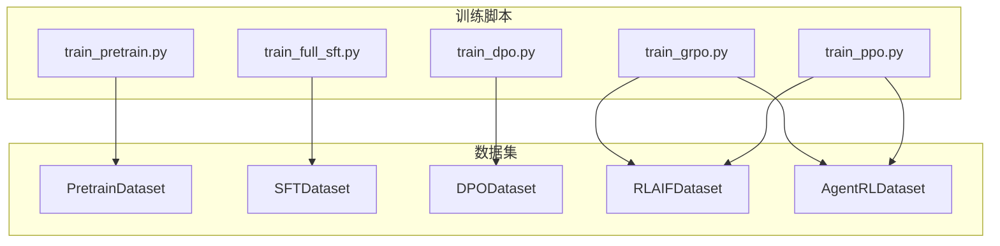
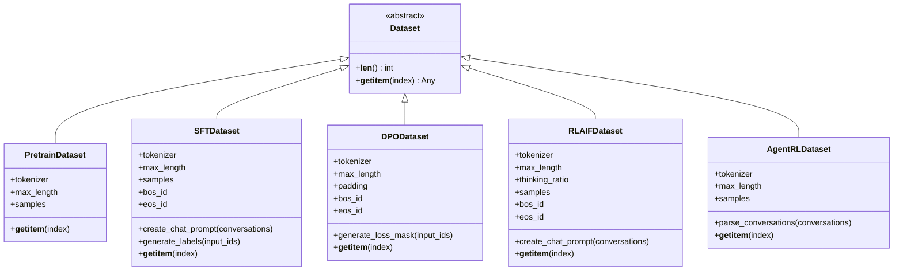
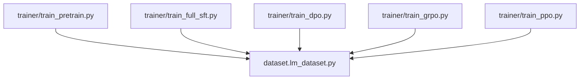

# 数据集实现详解

<cite>
**本文引用的文件**
- [dataset/lm_dataset.py](file://dataset/lm_dataset.py)
- [README.md](file://README.md)
- [trainer/train_pretrain.py](file://trainer/train_pretrain.py)
- [trainer/train_full_sft.py](file://trainer/train_full_sft.py)
- [trainer/train_dpo.py](file://trainer/train_dpo.py)
- [trainer/train_grpo.py](file://trainer/train_grpo.py)
- [trainer/train_ppo.py](file://trainer/train_ppo.py)
- [dataset/dataset.md](file://dataset/dataset.md)
</cite>

## 目录
1. [引言](#引言)
2. [项目结构](#项目结构)
3. [核心组件](#核心组件)
4. [架构总览](#架构总览)
5. [详细组件分析](#详细组件分析)
6. [依赖分析](#依赖分析)
7. [性能考量](#性能考量)
8. [故障排查指南](#故障排查指南)
9. [结论](#结论)
10. [附录](#附录)

## 引言
本文件聚焦 MiniMind 项目中的数据集实现，系统梳理并深入解析以下四类数据集类：
- PretrainDataset：文本到下一个 token 的预训练数据集，实现自回归语言建模的标签构造。
- SFTDataset：监督微调数据集，处理多轮对话格式，生成标签序列以实现监督学习。
- DPODataset：偏好对（DPO）数据集，针对偏好对样本生成损失掩码，支撑偏好优化训练。
- RLAIFDataset：强化学习数据集，基于思维链开关生成提示，用于 PPO/GRPO/CISPO 等算法。

文档将从初始化参数、核心方法、数据访问模式、使用场景、继承关系与扩展机制、调试技巧与性能优化等方面进行全面阐述，并提供可视化图示与来源标注，帮助读者快速理解与高效使用。

## 项目结构
数据集实现集中在 dataset/lm_dataset.py，训练脚本在 trainer 目录中，README 提供了数据集与训练流程的背景说明。下图展示数据集与训练脚本的关系概览。

图表来源
- [dataset/lm_dataset.py](file://dataset/lm_dataset.py)
- [trainer/train_pretrain.py](file://trainer/train_pretrain.py)
- [trainer/train_full_sft.py](file://trainer/train_full_sft.py)
- [trainer/train_dpo.py](file://trainer/train_dpo.py)
- [trainer/train_grpo.py](file://trainer/train_grpo.py)
- [trainer/train_ppo.py](file://trainer/train_ppo.py)

章节来源
- [dataset/lm_dataset.py](file://dataset/lm_dataset.py)
- [trainer/train_pretrain.py](file://trainer/train_pretrain.py)
- [trainer/train_full_sft.py](file://trainer/train_full_sft.py)
- [trainer/train_dpo.py](file://trainer/train_dpo.py)
- [trainer/train_grpo.py](file://trainer/train_grpo.py)
- [trainer/train_ppo.py](file://trainer/train_ppo.py)

## 核心组件
本节概述四个数据集类的关键职责与公共辅助函数：
- 预处理与后处理函数
  - pre_processing_chat：为对话数据添加可选的 system 角色，提高多样性与鲁棒性。
  - post_processing_chat：对包含空思考标签的提示进行概率性清理，减少无效 token。
- 数据集类
  - PretrainDataset：将单文本切分为 tokens，拼接 BOS/EOS，并将 pad 位置设为忽略标签。
  - SFTDataset：将多轮对话应用 chat template，生成 input_ids 与标签序列，标签仅对 assistant 回复部分生效。
  - DPODataset：对偏好对（chosen/rejected）分别生成 input_ids 与损失掩码，用于 DPO 损失计算。
  - RLAIFDataset：按概率开启思维链，生成带生成提示的对话提示，供强化学习 rollout 使用。

章节来源
- [dataset/lm_dataset.py](file://dataset/lm_dataset.py)

## 架构总览
下图展示数据集类的类层次关系与依赖关系，突出继承与组合关系。

图表来源
- [dataset/lm_dataset.py](file://dataset/lm_dataset.py)

## 详细组件分析

### PretrainDataset：文本到下一个 token 预测
- 初始化参数
  - data_path：JSON 数据文件路径
  - tokenizer：分词器实例
  - max_length：最大序列长度
- 核心方法
  - __len__：返回样本总数
  - __getitem__：读取样本文本，使用 tokenizer 编码，拼接 BOS/EOS，填充到 max_length；标签与 input_ids 相同，pad 位置设为忽略标签
- 数据访问模式
  - 通过 datasets.load_dataset 加载 JSON 文件，按索引顺序访问
- 使用场景
  - 用于预训练阶段的自回归语言建模，最大化困惑度与语言建模性能
- 复杂度与性能
  - 时间复杂度 O(N·T)，N 为样本数，T 为平均 token 数；内存占用与 max_length 成正比
- 调试技巧
  - 可打印 input_ids 与 labels 的对应关系，验证标签与输入对齐
  - 检查 pad 位置是否被正确忽略
- 代码示例路径
  - [dataset/lm_dataset.py](file://dataset/lm_dataset.py)
  - [trainer/train_pretrain.py](file://trainer/train_pretrain.py)

章节来源
- [dataset/lm_dataset.py](file://dataset/lm_dataset.py)
- [trainer/train_pretrain.py](file://trainer/train_pretrain.py)

### SFTDataset：对话格式处理与标签生成
- 初始化参数
  - jsonl_path：JSONL 数据文件路径
  - tokenizer：分词器实例
  - max_length：最大序列长度
- 核心方法
  - __len__：返回样本总数
  - create_chat_prompt：预处理对话（可选添加 system），应用 chat template，支持工具调用与思考标签
  - generate_labels：遍历 input_ids，仅对 assistant 回复片段设置标签，其余位置为忽略标签
  - __getitem__：生成 input_ids 与 labels
- 数据访问模式
  - 通过 datasets.load_dataset 加载 JSONL，features 明确 conversations 字段结构
- 使用场景
  - 监督微调阶段，对齐多轮对话与工具调用，提升指令遵循与对话质量
- 复杂度与性能
  - 时间复杂度 O(N·T)，标签生成为线性扫描；注意 bos_id/eos_id 的匹配边界
- 调试技巧
  - 可开启调试打印，逐 token 比对输入与标签，验证标签覆盖范围
  - 检查 tool_calls 是否被正确解析为 JSON
- 代码示例路径
  - [dataset/lm_dataset.py](file://dataset/lm_dataset.py)
  - [trainer/train_full_sft.py](file://trainer/train_full_sft.py)

章节来源
- [dataset/lm_dataset.py](file://dataset/lm_dataset.py)
- [trainer/train_full_sft.py](file://trainer/train_full_sft.py)

### DPODataset：偏好对损失掩码计算
- 初始化参数
  - file_path：JSON 数据文件路径
  - tokenizer：分词器实例
  - max_length：最大序列长度
- 核心方法
  - __len__：返回样本总数
  - __getitem__：读取 chosen 与 rejected 对话，应用 chat template，生成 input_ids 与标签（用于 log_prob 计算），并调用 generate_loss_mask 生成掩码
  - generate_loss_mask：与 SFT 类似，仅对 assistant 回复片段设置为 1，其余为 0
- 数据访问模式
  - 读取 JSON 文件，每个样本包含 chosen 与 rejected 两个偏好对
- 使用场景
  - 偏好优化（DPO）训练，直接最大化偏好对的 log-odds
- 复杂度与性能
  - 时间复杂度 O(N·T)，generate_loss_mask 为线性扫描；注意 chosen/rejected 的拼接与掩码对齐
- 调试技巧
  - 检查 chosen 与 rejected 的长度是否一致，掩码是否覆盖到回复结束
  - 验证 bos_id/eos_id 的匹配是否正确
- 代码示例路径
  - [dataset/lm_dataset.py](file://dataset/lm_dataset.py)
  - [trainer/train_dpo.py](file://trainer/train_dpo.py)

章节来源
- [dataset/lm_dataset.py](file://dataset/lm_dataset.py)
- [trainer/train_dpo.py](file://trainer/train_dpo.py)

### RLAIFDataset：思维链生成逻辑
- 初始化参数
  - jsonl_path：JSONL 数据文件路径
  - tokenizer：分词器实例
  - max_length：最大序列长度
  - thinking_ratio：开启思维链的概率
- 核心方法
  - __len__：返回样本总数
  - create_chat_prompt：预处理对话，按概率开启 open_thinking，生成带生成提示的对话提示
  - __getitem__：返回字典，包含 prompt 与空 answer（供后续 rollout 填充）
- 数据访问模式
  - 通过 datasets.load_dataset 加载 JSONL，按索引访问
- 使用场景
  - 强化学习（PPO/GRPO/CISPO）训练，结合 rollout_engine 生成响应并计算奖励
- 复杂度与性能
  - 时间复杂度 O(N·T)，思维链开关为随机采样；注意 max_length 与生成长度的协调
- 调试技巧
  - 检查思维链开关是否按比例生效
  - 验证生成提示是否正确附加
- 代码示例路径
  - [dataset/lm_dataset.py](file://dataset/lm_dataset.py)
  - [trainer/train_grpo.py](file://trainer/train_grpo.py)
  - [trainer/train_ppo.py](file://trainer/train_ppo.py)

章节来源
- [dataset/lm_dataset.py](file://dataset/lm_dataset.py)
- [trainer/train_grpo.py](file://trainer/train_grpo.py)
- [trainer/train_ppo.py](file://trainer/train_ppo.py)

### AgentRLDataset：多轮工具调用场景
- 初始化参数
  - jsonl_path：JSONL 数据文件路径
  - tokenizer：分词器实例
  - max_length：最大序列长度
- 核心方法
  - __len__：返回样本总数
  - parse_conversations：解析对话，提取 messages 与 tools，丢弃最后一轮 assistant
  - __getitem__：返回 messages、tools 与 ground truth
- 使用场景
  - 多轮工具调用与推理场景，支持 GRPO/CISPO 等算法
- 复杂度与性能
  - 时间复杂度 O(N·T)，解析为线性扫描
- 代码示例路径
  - [dataset/lm_dataset.py](file://dataset/lm_dataset.py)
  - [trainer/train_grpo.py](file://trainer/train_grpo.py)
  - [trainer/train_ppo.py](file://trainer/train_ppo.py)

章节来源
- [dataset/lm_dataset.py](file://dataset/lm_dataset.py)
- [trainer/train_grpo.py](file://trainer/train_grpo.py)
- [trainer/train_ppo.py](file://trainer/train_ppo.py)

## 依赖分析
- 内部依赖
  - dataset.lm_dataset 作为训练脚本的直接依赖，提供数据加载与预处理能力
  - 训练脚本通过 DataLoader 与 DistributedSampler 进行分布式训练
- 外部依赖
  - datasets：用于加载 JSON/JSONL 数据
  - transformers：用于 apply_chat_template 与 tokenizer
  - torch：用于张量操作与数据集实现
- 耦合与内聚
  - 数据集类与训练脚本通过明确的接口耦合，内聚性良好
  - RLAIFDataset 与 rollout_engine 存在运行时耦合，但接口清晰

图表来源
- [dataset/lm_dataset.py](file://dataset/lm_dataset.py)
- [trainer/train_pretrain.py](file://trainer/train_pretrain.py)
- [trainer/train_full_sft.py](file://trainer/train_full_sft.py)
- [trainer/train_dpo.py](file://trainer/train_dpo.py)
- [trainer/train_grpo.py](file://trainer/train_grpo.py)
- [trainer/train_ppo.py](file://trainer/train_ppo.py)

章节来源
- [dataset/lm_dataset.py](file://dataset/lm_dataset.py)
- [trainer/train_pretrain.py](file://trainer/train_pretrain.py)
- [trainer/train_full_sft.py](file://trainer/train_full_sft.py)
- [trainer/train_dpo.py](file://trainer/train_dpo.py)
- [trainer/train_grpo.py](file://trainer/train_grpo.py)
- [trainer/train_ppo.py](file://trainer/train_ppo.py)

## 性能考量
- 数据加载
  - 使用 datasets.load_dataset 加载 JSON/JSONL，注意磁盘 I/O 与内存占用
  - DataLoader 的 num_workers 与 pin_memory 可提升吞吐
- 序列长度与填充
  - max_length 控制训练效率与显存占用，需在语义完整性与资源消耗间权衡
  - pad 位置的忽略标签可减少无效梯度
- 标签生成
  - SFT 与 DPO 的标签/掩码生成为线性扫描，注意边界匹配（bos_id/eos_id）
- 思维链与工具调用
  - RLAIFDataset 的思维链开关为随机采样，注意与训练目标的匹配
  - 工具调用字段的 JSON 解析需在预处理阶段完成
- 训练脚本优化
  - 混合精度与梯度累积可显著节省显存
  - 分布式训练时注意 DDP 参数同步与忽略缓冲区

[本节为通用性能建议，不直接分析具体文件]

## 故障排查指南
- 标签与输入不一致
  - 检查 generate_labels 与 generate_loss_mask 的边界匹配，确保 bos_id/eos_id 与切片一致
  - 参考路径：[dataset/lm_dataset.py](file://dataset/lm_dataset.py)
- pad 位置未忽略
  - 确认标签中 pad 位置被设置为忽略值
  - 参考路径：[dataset/lm_dataset.py](file://dataset/lm_dataset.py)
- 思维链开关无效
  - 检查 thinking_ratio 与随机采样逻辑
  - 参考路径：[dataset/lm_dataset.py](file://dataset/lm_dataset.py)
- 工具调用解析失败
  - 确认 tool_calls 字段在预处理阶段被解析为 JSON
  - 参考路径：[dataset/lm_dataset.py](file://dataset/lm_dataset.py)
- 数据加载异常
  - 确认数据文件路径与格式正确，features 定义与数据一致
  - 参考路径：[dataset/lm_dataset.py](file://dataset/lm_dataset.py)

章节来源
- [dataset/lm_dataset.py](file://dataset/lm_dataset.py)

## 结论
MiniMind 的数据集实现以简洁、可扩展为核心设计原则，通过统一的 Dataset 抽象与明确的接口，支撑从预训练到强化学习的全链路训练。PretrainDataset、SFTDataset、DPODataset、RLAIFDataset 各司其职，配合训练脚本实现了高效的端到端训练流程。建议在实际使用中关注序列长度、标签边界与随机开关的配置，以获得最佳训练效果与稳定性。

[本节为总结性内容，不直接分析具体文件]

## 附录
- 数据集下载与放置
  - 数据集文件需放置于 dataset 目录，README 提供了数据集下载与推荐组合
  - 参考路径：[dataset/dataset.md](file://dataset/dataset.md)
- 训练脚本参数
  - 训练脚本提供丰富的参数选项，包括学习率、批次大小、混合精度、分布式训练等
  - 参考路径：[trainer/train_pretrain.py](file://trainer/train_pretrain.py)、[trainer/train_full_sft.py](file://trainer/train_full_sft.py)、[trainer/train_dpo.py](file://trainer/train_dpo.py)、[trainer/train_grpo.py](file://trainer/train_grpo.py)、[trainer/train_ppo.py](file://trainer/train_ppo.py)

章节来源
- [dataset/dataset.md](file://dataset/dataset.md)
- [trainer/train_pretrain.py](file://trainer/train_pretrain.py)
- [trainer/train_full_sft.py](file://trainer/train_full_sft.py)
- [trainer/train_dpo.py](file://trainer/train_dpo.py)
- [trainer/train_grpo.py](file://trainer/train_grpo.py)
- [trainer/train_ppo.py](file://trainer/train_ppo.py)