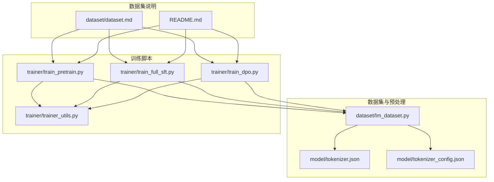
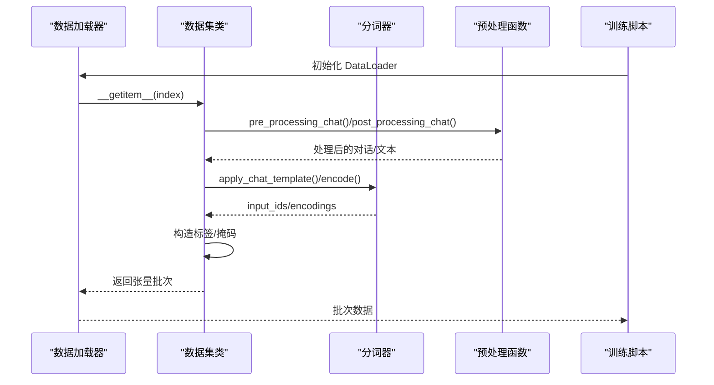
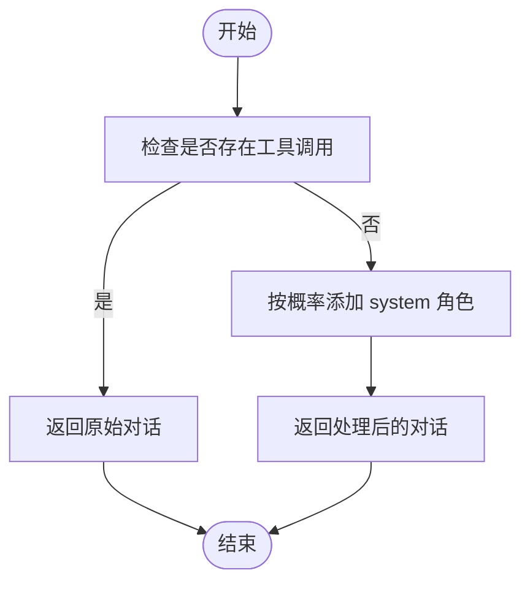
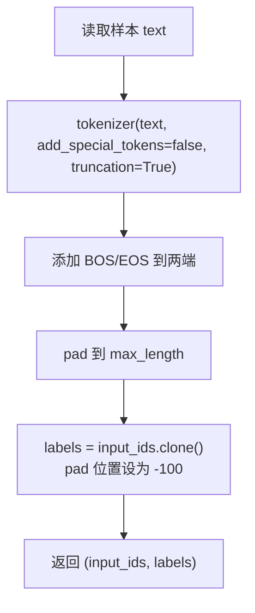
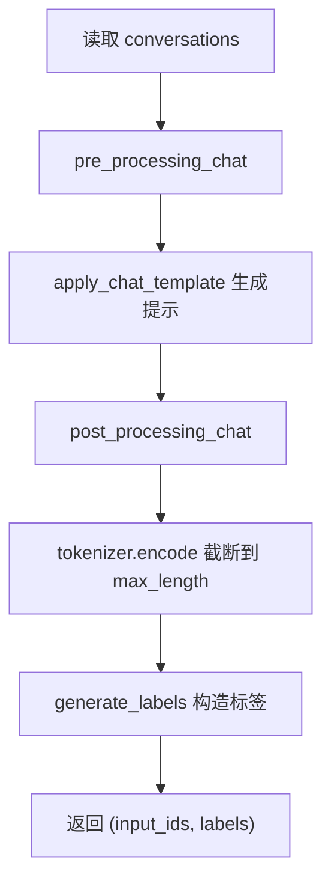
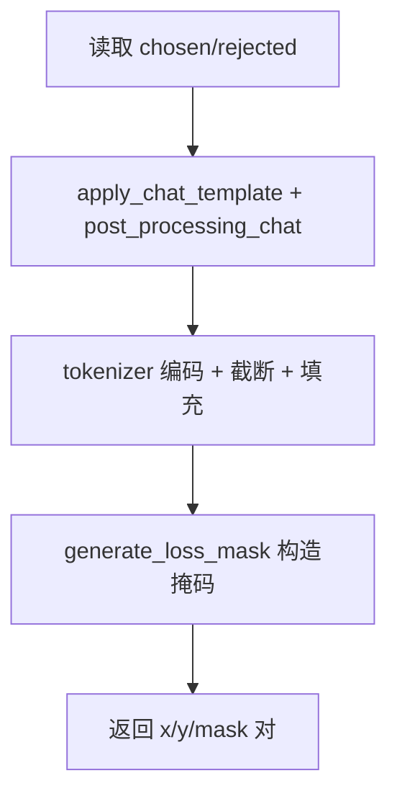
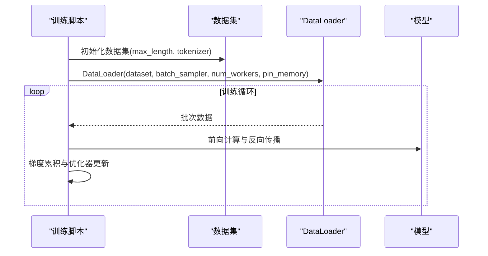
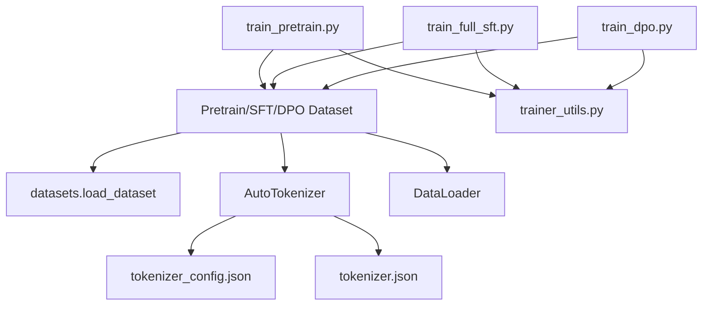

# 数据预处理流程

<cite>
**本文引用的文件**
- [lm_dataset.py](file://dataset/lm_dataset.py)
- [tokenizer.json](file://model/tokenizer.json)
- [tokenizer_config.json](file://model/tokenizer_config.json)
- [train_pretrain.py](file://trainer/train_pretrain.py)
- [train_full_sft.py](file://trainer/train_full_sft.py)
- [train_dpo.py](file://trainer/train_dpo.py)
- [trainer_utils.py](file://trainer/trainer_utils.py)
- [dataset.md](file://dataset/dataset.md)
- [README.md](file://README.md)
</cite>

## 目录
1. [引言](#引言)
2. [项目结构](#项目结构)
3. [核心组件](#核心组件)
4. [架构概览](#架构概览)
5. [详细组件分析](#详细组件分析)
6. [依赖分析](#依赖分析)
7. [性能考量](#性能考量)
8. [故障排查指南](#故障排查指南)
9. [结论](#结论)
10. [附录](#附录)

## 引言
本文件系统性梳理 MiniMind 的数据预处理流程，涵盖数据加载、格式转换、tokenization、序列长度控制等关键步骤，并针对不同数据集类型（PretrainDataset、SFTDataset、DPODataset）进行差异化说明。同时，详细解释预处理工具函数（如 pre_processing_chat、post_processing_chat）的作用与参数配置，以及批量数据处理、内存优化与并行处理等性能优化技巧。文档旨在帮助读者快速理解 MiniMind 的数据管线，为训练与推理提供可靠依据。

## 项目结构
MiniMind 的数据预处理主要集中在 dataset 模块，配合训练脚本与分词器配置共同完成端到端流程：
- 数据集定义与预处理逻辑：dataset/lm_dataset.py
- 分词器与配置：model/tokenizer.json、model/tokenizer_config.json
- 训练入口与数据加载：trainer/train_pretrain.py、trainer/train_full_sft.py、trainer/train_dpo.py
- 训练工具与分布式支持：trainer/trainer_utils.py
- 数据集说明与下载指引：dataset/dataset.md、README.md

图表来源
- [lm_dataset.py:1-256](file://dataset/lm_dataset.py#L1-L256)
- [tokenizer.json:1-800](file://model/tokenizer.json#L1-L800)
- [tokenizer_config.json:1-335](file://model/tokenizer_config.json#L1-L335)
- [train_pretrain.py:1-170](file://trainer/train_pretrain.py#L1-L170)
- [train_full_sft.py:1-171](file://trainer/train_full_sft.py#L1-L171)
- [train_dpo.py:1-226](file://trainer/train_dpo.py#L1-L226)
- [trainer_utils.py:1-177](file://trainer/trainer_utils.py#L1-L177)
- [dataset.md:1-5](file://dataset/dataset.md#L1-L5)
- [README.md:371-555](file://README.md#L371-L555)

章节来源
- [lm_dataset.py:1-256](file://dataset/lm_dataset.py#L1-L256)
- [tokenizer.json:1-800](file://model/tokenizer.json#L1-L800)
- [tokenizer_config.json:1-335](file://model/tokenizer_config.json#L1-L335)
- [train_pretrain.py:1-170](file://trainer/train_pretrain.py#L1-L170)
- [train_full_sft.py:1-171](file://trainer/train_full_sft.py#L1-L171)
- [train_dpo.py:1-226](file://trainer/train_dpo.py#L1-L226)
- [trainer_utils.py:1-177](file://trainer/trainer_utils.py#L1-L177)
- [dataset.md:1-5](file://dataset/dataset.md#L1-L5)
- [README.md:371-555](file://README.md#L371-L555)

## 核心组件
- 预处理工具函数
  - pre_processing_chat：对对话数据进行系统提示注入与工具调用数据解析，支持按概率添加 system 角色，保留工具使用数据的完整性。
  - post_processing_chat：对生成的对话提示进行后处理，支持移除空思考标签，提高数据质量与一致性。
- 数据集类
  - PretrainDataset：纯文本预训练数据集，负责将文本转为 token 序列并进行长度控制与标签构造。
  - SFTDataset：监督微调数据集，使用 chat_template 生成对话提示，构造标签掩码，支持工具调用与思考标签。
  - DPODataset：偏好优化数据集，处理偏好对（chosen/rejected），生成损失掩码，支持长序列截断与填充。
  - RLAIFDataset、AgentRLDataset：强化学习相关数据集，分别用于 RLAIF 与代理强化学习场景。
- 训练脚本与工具
  - 训练脚本：train_pretrain.py、train_full_sft.py、train_dpo.py 负责加载数据集、构建 DataLoader、执行训练循环。
  - 训练工具：trainer_utils.py 提供分布式初始化、检查点管理、学习率调度、SkipBatchSampler 等工具。

章节来源
- [lm_dataset.py:9-192](file://dataset/lm_dataset.py#L9-L192)
- [train_pretrain.py:134-162](file://trainer/train_pretrain.py#L134-L162)
- [train_full_sft.py:135-163](file://trainer/train_full_sft.py#L135-L163)
- [train_dpo.py:190-218](file://trainer/train_dpo.py#L190-L218)
- [trainer_utils.py:134-157](file://trainer/trainer_utils.py#L134-L157)

## 架构概览
MiniMind 的数据预处理架构遵循“数据加载 → 格式转换 → tokenization → 序列长度控制 → 标签构造”的流水线，不同数据集类型在预处理细节上有所差异，但共享统一的分词器与配置。

图表来源
- [lm_dataset.py:106-119](file://dataset/lm_dataset.py#L106-L119)
- [lm_dataset.py:135-174](file://dataset/lm_dataset.py#L135-L174)
- [lm_dataset.py:47-55](file://dataset/lm_dataset.py#L47-L55)
- [train_pretrain.py:162-162](file://trainer/train_pretrain.py#L162-L162)
- [train_full_sft.py:163-163](file://trainer/train_full_sft.py#L163-L163)
- [train_dpo.py:218-218](file://trainer/train_dpo.py#L218-L218)

## 详细组件分析

### 预处理工具函数
- pre_processing_chat
  - 功能：对 conversations 进行预处理，支持工具调用数据的完整保留；按概率在开头添加 system 角色，提升数据多样性与一致性。
  - 关键点：工具调用字段（如 tool_calls）会被解析为 JSON，确保后续 chat_template 正确渲染。
  - 参数：add_system_ratio 控制添加 system 的概率。
- post_processing_chat
  - 功能：对生成的对话提示进行后处理，支持移除空思考标签，减少噪声，提升训练稳定性。
  - 参数：empty_think_ratio 控制移除空思考标签的概率。

图表来源
- [lm_dataset.py:9-29](file://dataset/lm_dataset.py#L9-L29)

章节来源
- [lm_dataset.py:9-35](file://dataset/lm_dataset.py#L9-L35)

### PretrainDataset（纯文本预训练）
- 数据加载：使用 datasets.load_dataset 从 JSON 文件加载文本数据，split='train'。
- tokenization：将文本转为 token ids，禁用特殊 token，设置最大长度并截断。
- 序列构造：在首尾添加 BOS/EOS，剩余位置用 pad 填充至 max_length。
- 标签构造：复制 input_ids，将 pad 位置设为 -100，作为忽略位置的标签。
- 关键参数：max_length 控制序列长度，影响显存占用与训练效率。

图表来源
- [lm_dataset.py:37-55](file://dataset/lm_dataset.py#L37-L55)

章节来源
- [lm_dataset.py:37-55](file://dataset/lm_dataset.py#L37-L55)

### SFTDataset（对话格式监督微调）
- 数据加载：使用 datasets.load_dataset 加载 JSONL，特征定义 conversations 字段，支持 tools/tool_calls。
- 对话提示生成：调用 tokenizer.apply_chat_template，生成完整对话提示，支持工具调用与思考标签。
- 标签构造：通过 generate_labels 识别 assistant 回复区域，将该区域 token 的标签设为对应下一个 token 的 id，其余位置设为 -100。
- 关键参数：max_length 控制序列长度；bos_id/eos_id 用于定位 assistant 回复区域。
- 工具函数：pre_processing_chat/post_processing_chat 用于数据预处理与后处理。

图表来源
- [lm_dataset.py:58-119](file://dataset/lm_dataset.py#L58-L119)

章节来源
- [lm_dataset.py:58-119](file://dataset/lm_dataset.py#L58-L119)

### DPODataset（偏好优化）
- 数据加载：从 JSON 文件加载包含 chosen/rejected 的偏好对样本。
- 提示生成：分别对 chosen/rejected 调用 apply_chat_template，生成对话提示并进行后处理。
- 编码与截断：使用 tokenizer 对提示进行编码，设置 truncation 与 padding='max_length'。
- 损失掩码：generate_loss_mask 识别 assistant 回复区域，将该区域设为 1，其余为 0，用于计算偏好损失。
- 输出结构：返回 x_chosen/y_chosen/mask_chosen 与 x_rejected/y_rejected/mask_rejected，便于训练脚本拼接与计算。

图表来源
- [lm_dataset.py:122-174](file://dataset/lm_dataset.py#L122-L174)

章节来源
- [lm_dataset.py:122-192](file://dataset/lm_dataset.py#L122-L192)

### RLAIFDataset 与 AgentRLDataset
- RLAIFDataset：支持按概率开启思考（thinking），通过 open_thinking 参数控制，便于强化学习场景的思考链训练。
- AgentRLDataset：解析对话数据，提取 messages、tools 与 ground truth，用于代理强化学习场景。

章节来源
- [lm_dataset.py:195-252](file://dataset/lm_dataset.py#L195-L252)

### 训练脚本与数据加载
- 训练脚本：train_pretrain.py、train_full_sft.py、train_dpo.py 分别实例化对应数据集，使用 DistributedSampler 与 DataLoader 进行分布式训练与批处理。
- 工具函数：SkipBatchSampler 支持跳过已训练步数，实现断点续训；trainer_utils 提供分布式初始化、检查点保存与加载、学习率调度等。

图表来源
- [train_pretrain.py:134-162](file://trainer/train_pretrain.py#L134-L162)
- [train_full_sft.py:135-163](file://trainer/train_full_sft.py#L135-L163)
- [train_dpo.py:190-218](file://trainer/train_dpo.py#L190-L218)
- [trainer_utils.py:134-157](file://trainer/trainer_utils.py#L134-L157)

章节来源
- [train_pretrain.py:134-162](file://trainer/train_pretrain.py#L134-L162)
- [train_full_sft.py:135-163](file://trainer/train_full_sft.py#L135-L163)
- [train_dpo.py:190-218](file://trainer/train_dpo.py#L190-L218)
- [trainer_utils.py:134-157](file://trainer/trainer_utils.py#L134-L157)

## 依赖分析
- 数据集类依赖
  - datasets.load_dataset：用于加载 JSON/JSONL 数据文件。
  - transformers.AutoTokenizer：用于 chat_template 与编码。
  - torch.utils.data.Dataset/DataLoader：用于批处理与分布式采样。
- 分词器依赖
  - tokenizer.json 与 tokenizer_config.json：提供词汇表、特殊 token、chat_template 等配置。
- 训练脚本依赖
  - trainer_utils：分布式初始化、检查点管理、SkipBatchSampler 等工具。
  - torch.optim、torch.cuda.amp：优化器与混合精度训练。

图表来源
- [lm_dataset.py:1-7](file://dataset/lm_dataset.py#L1-L7)
- [tokenizer_config.json:1-335](file://model/tokenizer_config.json#L1-L335)
- [tokenizer.json:1-800](file://model/tokenizer.json#L1-L800)
- [train_pretrain.py:17-18](file://trainer/train_pretrain.py#L17-L18)
- [train_full_sft.py:17-18](file://trainer/train_full_sft.py#L17-L18)
- [train_dpo.py:18-19](file://trainer/train_dpo.py#L18-L19)
- [trainer_utils.py:14-16](file://trainer/trainer_utils.py#L14-L16)

章节来源
- [lm_dataset.py:1-7](file://dataset/lm_dataset.py#L1-L7)
- [tokenizer_config.json:1-335](file://model/tokenizer_config.json#L1-L335)
- [tokenizer.json:1-800](file://model/tokenizer.json#L1-L800)
- [train_pretrain.py:17-18](file://trainer/train_pretrain.py#L17-L18)
- [train_full_sft.py:17-18](file://trainer/train_full_sft.py#L17-L18)
- [train_dpo.py:18-19](file://trainer/train_dpo.py#L18-L19)
- [trainer_utils.py:14-16](file://trainer/trainer_utils.py#L14-L16)

## 性能考量
- 批量数据处理
  - DataLoader 的 num_workers 与 pin_memory 参数用于加速数据传输与解码，建议根据硬件配置合理设置。
  - SkipBatchSampler 支持断点续训，避免重复训练已完成的批次。
- 内存优化
  - max_length 控制序列长度，过长会显著增加显存占用；建议结合数据分布与硬件能力进行权衡。
  - 预训练与 SFT 的标签构造采用 -100 忽略 pad 位置，减少无效计算。
- 并行处理
  - DistributedSampler 与 torch.distributed 提供多卡分布式训练，提升吞吐量。
  - 混合精度训练（bfloat16/float16）与梯度累积（accumulation_steps）可在保证稳定性的同时提升训练效率。
- I/O 与数据加载
  - datasets.load_dataset 从 JSON/JSONL 加载数据，建议将数据文件放置在本地磁盘以减少网络延迟。
  - tokenizer.apply_chat_template 在对话数据较多时可能成为瓶颈，建议在预处理阶段进行必要的清洗与格式统一。

章节来源
- [train_pretrain.py:91-92](file://trainer/train_pretrain.py#L91-L92)
- [train_full_sft.py:92-93](file://trainer/train_full_sft.py#L92-L93)
- [train_dpo.py:139-140](file://trainer/train_dpo.py#L139-L140)
- [trainer_utils.py:134-157](file://trainer/trainer_utils.py#L134-L157)
- [lm_dataset.py:47-55](file://dataset/lm_dataset.py#L47-L55)
- [lm_dataset.py:88-104](file://dataset/lm_dataset.py#L88-L104)
- [lm_dataset.py:176-192](file://dataset/lm_dataset.py#L176-L192)

## 故障排查指南
- 数据格式错误
  - SFT 数据缺少 conversations 字段或格式不规范会导致 apply_chat_template 报错。请确保 conversations 中每个消息包含 role 与 content，并在需要时提供 reasoning_content、tools、tool_calls。
- 分词器配置不匹配
  - 若 tokenizer_config.json 或 tokenizer.json 与模型不一致，可能导致 chat_template 渲染异常。请核对 chat_template 与特殊 token 配置。
- 序列长度溢出
  - 当 max_length 设置过小导致截断过多，可能影响语义完整性；过大则导致显存不足。建议根据数据分布与硬件能力调整。
- 断点续训问题
  - 检查 checkpoints 目录下的 resume 文件是否存在且与当前分布式设置匹配；必要时调整 world_size 以自动转换 step。
- 分布式训练异常
  - 确认 NCCL 后端可用与 CUDA 设备正确初始化；在多机多卡场景下注意网络与环境变量配置。

章节来源
- [lm_dataset.py:63-64](file://dataset/lm_dataset.py#L63-L64)
- [lm_dataset.py:81-86](file://dataset/lm_dataset.py#L81-L86)
- [trainer_utils.py:63-117](file://trainer/trainer_utils.py#L63-L117)
- [README.md:371-555](file://README.md#L371-L555)

## 结论
MiniMind 的数据预处理流程以统一的分词器与配置为核心，通过预处理工具函数与多类数据集实现对纯文本、对话格式与偏好对的高效处理。训练脚本与工具函数提供了完善的分布式支持、断点续训与性能优化能力。理解并正确配置预处理参数（如 max_length、add_system_ratio、empty_think_ratio）对于获得高质量训练效果至关重要。

## 附录
- 数据集下载与放置
  - 将下载的数据集文件放入 dataset 目录，训练脚本默认从该目录加载数据。
- 数据格式参考
  - 预训练数据：包含 text 字段的 JSONL。
  - 监督微调数据：包含 conversations 字段的 JSONL，支持 system/tools/tool_calls。
  - 偏好优化数据：包含 chosen/rejected 字段的 JSON。

章节来源
- [dataset.md:1-5](file://dataset/dataset.md#L1-L5)
- [README.md:400-482](file://README.md#L400-L482)