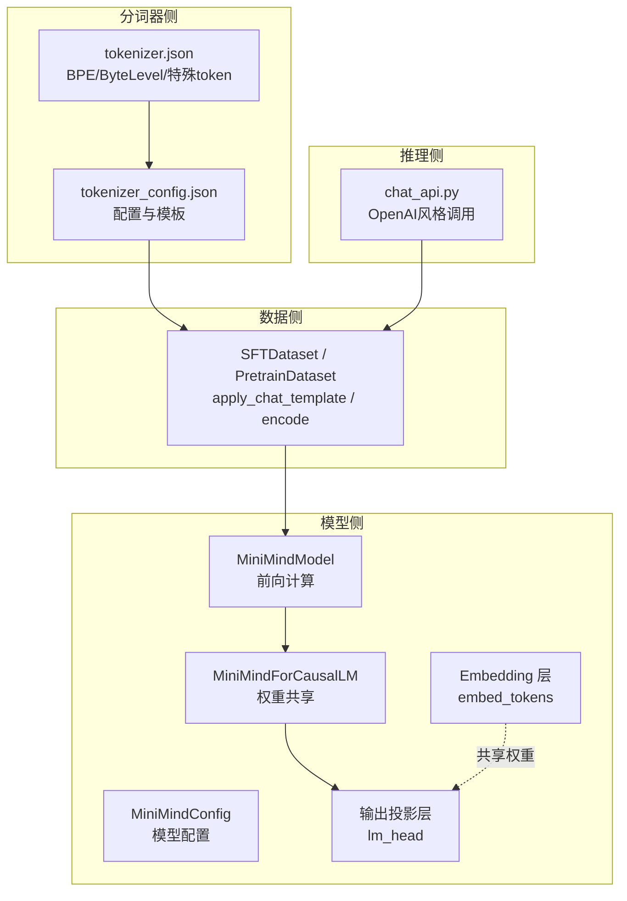
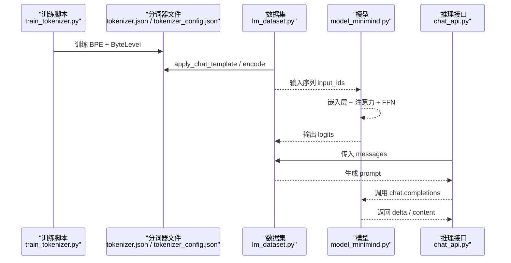
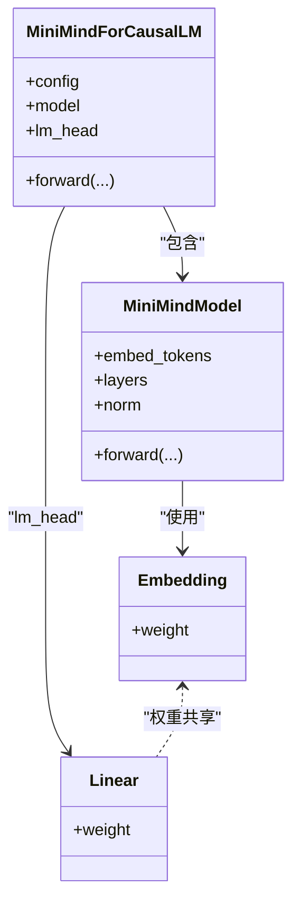
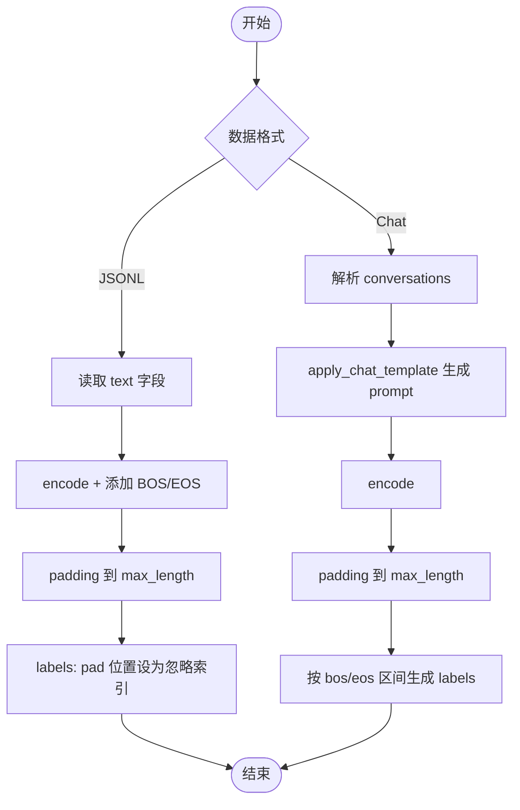
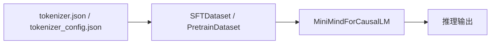

# 分词器集成

<cite>
**本文引用的文件**
- [tokenizer.json](file://model/tokenizer.json)
- [tokenizer_config.json](file://model/tokenizer_config.json)
- [model_minimind.py](file://model/model_minimind.py)
- [train_tokenizer.py](file://trainer/train_tokenizer.py)
- [lm_dataset.py](file://dataset/lm_dataset.py)
- [chat_api.py](file://scripts/chat_api.py)
- [README.md](file://README.md)
</cite>

## 目录
1. [引言](#引言)
2. [项目结构](#项目结构)
3. [核心组件](#核心组件)
4. [架构总览](#架构总览)
5. [详细组件分析](#详细组件分析)
6. [依赖关系分析](#依赖关系分析)
7. [性能考量](#性能考量)
8. [故障排查指南](#故障排查指南)
9. [结论](#结论)
10. [附录](#附录)

## 引言
本文件面向 MiniMind 分词器系统的使用者与维护者，系统化阐述分词器的配置文件结构、参数含义、编码规则、与模型的集成方式（含权重共享与嵌入层初始化）、不同数据格式（JSONL、Chat 格式）下的分词处理差异，并提供使用示例与最佳实践，帮助开发者正确处理文本数据并规避常见问题。

## 项目结构
围绕分词器的关键文件与模块如下：
- 配置与词表：model/tokenizer.json、model/tokenizer_config.json
- 模型与权重共享：model/model_minimind.py
- 数据加载与格式处理：dataset/lm_dataset.py
- 分词器训练与评估：trainer/train_tokenizer.py
- 推理与对话接口：scripts/chat_api.py
- 项目说明与数据格式：README.md

图表来源
- [model_minimind.py:195-246](file://model/model_minimind.py#L195-L246)
- [tokenizer.json:1-800](file://model/tokenizer.json#L1-L800)
- [tokenizer_config.json:1-335](file://model/tokenizer_config.json#L1-L335)
- [lm_dataset.py:71-119](file://dataset/lm_dataset.py#L71-L119)
- [chat_api.py:14-38](file://scripts/chat_api.py#L14-L38)

章节来源
- [model_minimind.py:195-246](file://model/model_minimind.py#L195-L246)
- [tokenizer.json:1-800](file://model/tokenizer.json#L1-L800)
- [tokenizer_config.json:1-335](file://model/tokenizer_config.json#L1-L335)
- [lm_dataset.py:71-119](file://dataset/lm_dataset.py#L71-L119)
- [chat_api.py:14-38](file://scripts/chat_api.py#L14-L38)

## 核心组件
- 分词器配置与词表
  - tokenizer.json：定义 BPE 模型、ByteLevel 预分词器、解码器、特殊 token 列表与词表映射。
  - tokenizer_config.json：定义特殊 token、最大长度、chat_template、以及与模型交互的元信息。
- 模型侧集成
  - MiniMindForCausalLM 将嵌入层 embed_tokens 与输出层 lm_head 的权重共享，提升参数效率与一致性。
- 数据侧处理
  - SFTDataset 使用 tokenizer.apply_chat_template 生成 Chat 格式提示，PretrainDataset 使用纯文本并手动拼接 BOS/EOS。
- 训练与评估
  - trainer/train_tokenizer.py 提供 BPE + ByteLevel 的训练流程与评估方法，便于理解与扩展。

章节来源
- [model_minimind.py:229-246](file://model/model_minimind.py#L229-L246)
- [tokenizer.json:345-390](file://model/tokenizer.json#L345-L390)
- [tokenizer_config.json:295-333](file://model/tokenizer_config.json#L295-L333)
- [lm_dataset.py:71-119](file://dataset/lm_dataset.py#L71-L119)
- [train_tokenizer.py:24-106](file://trainer/train_tokenizer.py#L24-L106)

## 架构总览
分词器与模型的集成路径如下：
- 训练阶段：trainer/train_tokenizer.py 使用 BPE + ByteLevel 训练 tokenizer.json 与 tokenizer_config.json。
- 预训练/微调阶段：dataset/lm_dataset.py 通过 tokenizer.apply_chat_template 或直接 encode，将 Chat/JSONL 文本转为 token 序列。
- 推理阶段：model/model_minimind.py 中 MiniMindForCausalLM 将 embed_tokens 与 lm_head 权重共享，保证编码与解码一致性。

图表来源
- [train_tokenizer.py:24-106](file://trainer/train_tokenizer.py#L24-L106)
- [lm_dataset.py:71-119](file://dataset/lm_dataset.py#L71-L119)
- [model_minimind.py:229-246](file://model/model_minimind.py#L229-L246)
- [chat_api.py:14-38](file://scripts/chat_api.py#L14-L38)

## 详细组件分析

### 分词器配置与参数详解
- tokenizer.json
  - 模型类型：BPE
  - 预分词器：ByteLevel，add_prefix_space=false，use_regex=true
  - 解码器：ByteLevel，add_prefix_space=true，use_regex=true
  - 特殊 token：包含多个占位与音频/文本标记，如 <|audio_start|>、<|audio_end|>、<|audio_pad|>、<tts_pad>、<tts_text_bos>、<tts_text_eod>、<tts_text_bos_single> 等。
  - 词表规模：包含大量符号与字符，覆盖中英文及特殊标记。
- tokenizer_config.json
  - 特殊 token：additional_special_tokens、bos_token、eos_token、pad_token、unk_token 等。
  - 最大长度：model_max_length=131072
  - 图像/音频/视频 token：image_token、audio_token、video_token、vision_bos/eos、audio_bos/eos
  - chat_template：Jinja 模板，支持 tools、reasoning_content、tool_calls、open_thinking 等字段。
  - tokenizer_class：PreTrainedTokenizerFast

章节来源
- [tokenizer.json:332-344](file://model/tokenizer.json#L332-L344)
- [tokenizer.json:345-390](file://model/tokenizer.json#L345-L390)
- [tokenizer_config.json:295-333](file://model/tokenizer_config.json#L295-L333)

### 分词器与模型的集成与权重共享
- 嵌入层与输出层权重共享
  - MiniMindForCausalLM 初始化时将 lm_head.weight 指向 embed_tokens.weight，从而实现解码一致性与参数共享。
- 嵌入层初始化
  - MiniMindModel 中 embed_tokens 初始化为 [vocab_size, hidden_size]，随后在权重共享后保持一致。
- 位置编码与缓存
  - 模型注册了 freqs_cos/freqs_sin 缓冲，用于 RoPE 旋转位置编码，推理时结合 past_key_values 实现增量解码。

图表来源
- [model_minimind.py:229-246](file://model/model_minimind.py#L229-L246)
- [model_minimind.py:195-227](file://model/model_minimind.py#L195-L227)

章节来源
- [model_minimind.py:229-246](file://model/model_minimind.py#L229-L246)
- [model_minimind.py:195-227](file://model/model_minimind.py#L195-L227)

### 不同数据格式下的分词处理差异
- JSONL（预训练）
  - 使用纯文本字段 text，先进行 encode，再手动拼接 bos_token_id 与 eos_token_id，最后 pad 到 max_length。
  - 标签构造：将 pad_token_id 对应位置设为忽略索引，其余位置与右移一位对齐。
- Chat 格式（SFT/RL）
  - 使用 conversations 数组，通过 tokenizer.apply_chat_template 生成统一模板字符串，再进行 encode。
  - 支持 tools、tool_calls、reasoning_content、open_thinking 等字段，模板中对这些字段有专门处理逻辑。
  - 标签构造：根据 bos/eos 标记区间，将目标位置设为真实 token，其余设为忽略索引。

图表来源
- [lm_dataset.py:37-55](file://dataset/lm_dataset.py#L37-L55)
- [lm_dataset.py:58-119](file://dataset/lm_dataset.py#L58-L119)

章节来源
- [lm_dataset.py:37-55](file://dataset/lm_dataset.py#L37-L55)
- [lm_dataset.py:58-119](file://dataset/lm_dataset.py#L58-L119)

### 分词器训练与评估流程
- 训练流程
  - 使用 BPE 模型与 ByteLevel 预分词器，指定 special_tokens 列表与 additional_tokens 列表，trainer 从迭代器训练词表。
  - 保存 tokenizer.json 与 tokenizer_config.json，并修正 added_tokens 的 special 标记。
- 评估流程
  - 加载 AutoTokenizer，应用 apply_chat_template 生成 prompt，验证编码长度与解码一致性。
  - 计算不同文本的压缩率（Char/Token），并演示流式解码（字节缓冲）过程。

章节来源
- [train_tokenizer.py:24-106](file://trainer/train_tokenizer.py#L24-L106)
- [train_tokenizer.py:108-165](file://trainer/train_tokenizer.py#L108-L165)

### 推理与对话接口中的分词器使用
- chat_api.py
  - 通过 OpenAI 风格 API 调用，传入 messages，支持 stream 模式，delta 中包含 reasoning_content 与 content。
  - 支持 extra_body 中的 chat_template_kwargs（如 open_thinking）与 reasoning_effort 参数。

章节来源
- [chat_api.py:14-38](file://scripts/chat_api.py#L14-L38)

## 依赖关系分析
- 分词器配置依赖
  - tokenizer.json 决定 BPE/ByteLevel 的编码规则与特殊 token 映射。
  - tokenizer_config.json 决定最大长度、特殊 token、chat_template 等运行期行为。
- 模型依赖
  - MiniMindForCausalLM 依赖 tokenizer 的 vocab_size、pad/bos/eos/unk 等 token id，以及 chat_template 生成的 prompt。
- 数据依赖
  - SFTDataset 依赖 tokenizer.apply_chat_template 的模板渲染结果，PretrainDataset 依赖 tokenizer.encode 的基本能力。

图表来源
- [tokenizer.json:1-800](file://model/tokenizer.json#L1-L800)
- [tokenizer_config.json:1-335](file://model/tokenizer_config.json#L1-L335)
- [lm_dataset.py:71-119](file://dataset/lm_dataset.py#L71-L119)
- [model_minimind.py:229-246](file://model/model_minimind.py#L229-L246)

章节来源
- [tokenizer.json:1-800](file://model/tokenizer.json#L1-L800)
- [tokenizer_config.json:1-335](file://model/tokenizer_config.json#L1-L335)
- [lm_dataset.py:71-119](file://dataset/lm_dataset.py#L71-L119)
- [model_minimind.py:229-246](file://model/model_minimind.py#L229-L246)

## 性能考量
- 词表大小与参数占比
  - MiniMind 使用 6400 词表，显著降低 embedding 与输出层参数占比，适合小模型体积约束。
- 编解码效率
  - BPE + ByteLevel 在中文文本上约 1.5~1.7 字符/token，英文约 4~5 字符/token，需结合数据分布选择合适 max_seq_len。
- 推理性能
  - 使用 RoPE YaRN 外推与 Flash Attention（若可用）提升长序列推理效率；权重共享减少参数与内存占用。

章节来源
- [README.md:375-396](file://README.md#L375-L396)
- [model_minimind.py:61-77](file://model/model_minimind.py#L61-L77)
- [model_minimind.py:108-133](file://model/model_minimind.py#L108-L133)

## 故障排查指南
- 解码不一致或出现替换字符
  - 检查 tokenizer_config.json 中 clean_up_tokenization_spaces、add_prefix_space 等设置是否与训练一致。
  - 确认 tokenizer.json 的 decoder 类型与预分词器一致（ByteLevel）。
- Chat 模板渲染异常
  - 确认 messages 中 role/content/tool_calls/reasoning_content 字段齐全且格式正确。
  - 若使用 tools，需确保 system 中包含 tools 字段。
- 标签构造错误导致损失异常
  - 检查 bos/eos 标记是否与 tokenizer 的 bos_token_id/eos_token_id 一致。
  - 确保标签生成逻辑与模板渲染一致，避免越界或错位。
- 推理流式输出异常
  - 检查推理接口是否正确处理 reasoning_content 与 content 的 delta 分发。
  - 确认推理时 past_key_values 的缓存与 attention_mask 的更新。

章节来源
- [lm_dataset.py:88-104](file://dataset/lm_dataset.py#L88-L104)
- [lm_dataset.py:176-192](file://dataset/lm_dataset.py#L176-L192)
- [tokenizer_config.json:317-333](file://model/tokenizer_config.json#L317-L333)
- [chat_api.py:29-37](file://scripts/chat_api.py#L29-L37)

## 结论
MiniMind 的分词器采用 BPE + ByteLevel，配合丰富的特殊 token 与 Jinja chat_template，实现了对 Chat/JSONL 等多格式的良好适配。模型侧通过嵌入层与输出层权重共享，确保编码与解码一致性，并在小模型体积约束下取得良好性能。遵循本文的最佳实践与排障建议，可有效避免常见问题并提升开发效率。

## 附录

### 使用示例与最佳实践
- 预训练（JSONL）
  - 使用 PretrainDataset，先 encode 再拼接 BOS/EOS，padding 到 max_length，pad 位置设为忽略索引。
- 微调（Chat）
  - 使用 SFTDataset，先解析 conversations，再 apply_chat_template 生成 prompt，encode 后 padding，按 bos/eos 区间生成 labels。
- 推理
  - 使用 OpenAI 风格 API，传入 messages，必要时启用 reasoning_content/open_thinking，注意 stream 模式下 delta 的处理。
- 分词器训练
  - 使用 trainer/train_tokenizer.py 的流程，确保 special_tokens 与 additional_tokens 列表完整，保存后修正 added_tokens 的 special 标记。

章节来源
- [lm_dataset.py:37-55](file://dataset/lm_dataset.py#L37-L55)
- [lm_dataset.py:58-119](file://dataset/lm_dataset.py#L58-L119)
- [chat_api.py:14-38](file://scripts/chat_api.py#L14-L38)
- [train_tokenizer.py:24-106](file://trainer/train_tokenizer.py#L24-L106)