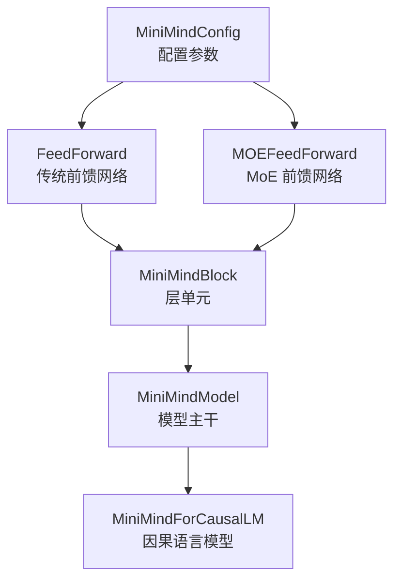
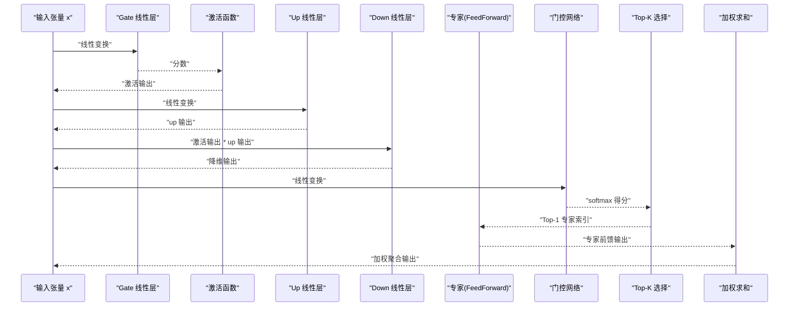
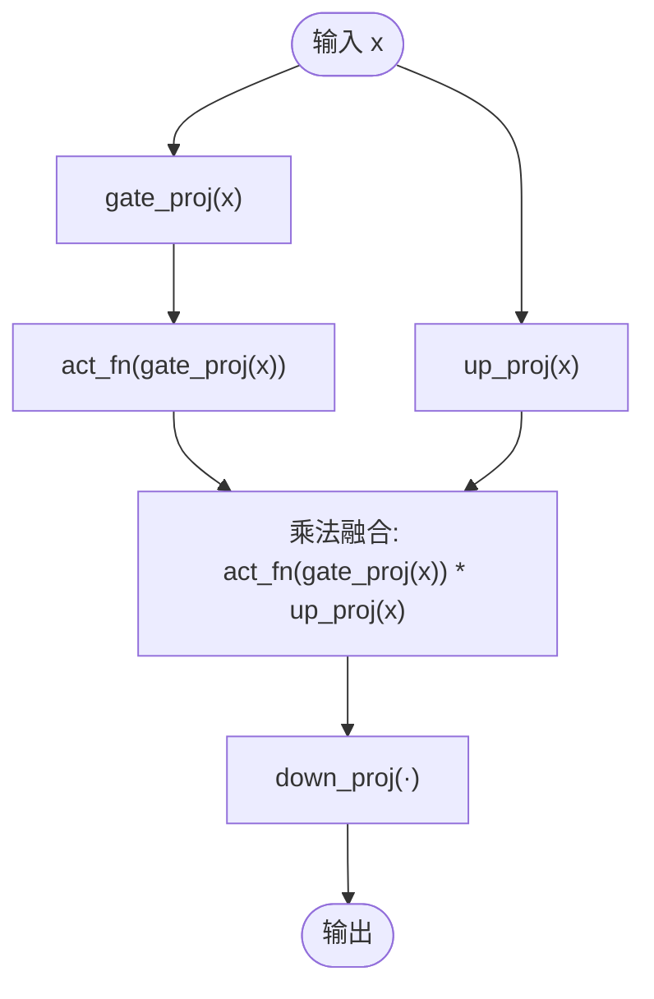
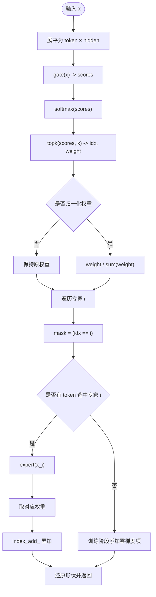
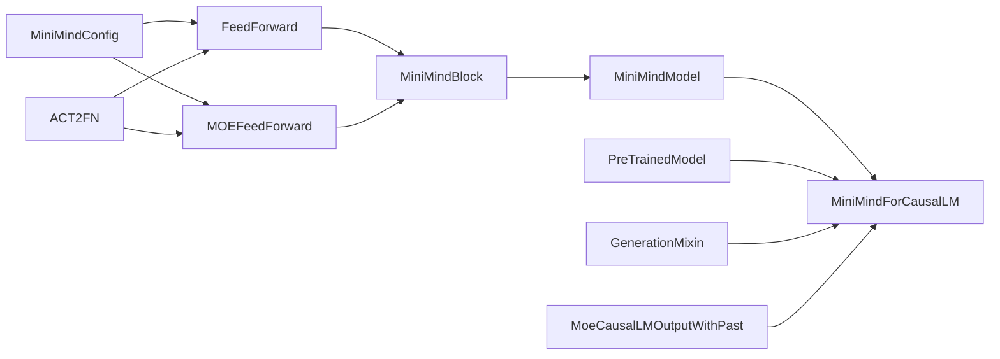

# 前馈网络设计

<cite>
**本文引用的文件**
- [model_minimind.py](file://model/model_minimind.py)
- [README.md](file://README.md)
</cite>

## 目录
1. [引言](#引言)
2. [项目结构](#项目结构)
3. [核心组件](#核心组件)
4. [架构概览](#架构概览)
5. [详细组件分析](#详细组件分析)
6. [依赖分析](#依赖分析)
7. [性能考量](#性能考量)
8. [故障排查指南](#故障排查指南)
9. [结论](#结论)
10. [附录](#附录)

## 引言
本文件聚焦 MiniMind 前馈网络系统，系统性阐述 SwiGLU 激活函数的数学原理与实现细节，对比传统前馈网络（FeedForward）与 MoE 前馈网络（MOEFeedForward）的差异与适用场景，深入解析专家混合机制中的门控网络、Top-1 选择策略与路由辅助损失等关键组件，并提供不同激活函数的性能对比与选择建议，帮助开发者依据任务特性优化网络结构。

## 项目结构
本项目围绕模型定义与训练展开，前馈网络相关逻辑集中在模型文件中，结合 README 的结构说明与配置参数，形成从配置到前馈实现再到推理输出的完整路径。

图表来源
- [model_minimind.py:10-45](file://model/model_minimind.py#L10-L45)
- [model_minimind.py:135-146](file://model/model_minimind.py#L135-L146)
- [model_minimind.py:147-176](file://model/model_minimind.py#L147-L176)
- [model_minimind.py:177-193](file://model/model_minimind.py#L177-L193)
- [model_minimind.py:195-227](file://model/model_minimind.py#L195-L227)
- [model_minimind.py:229-246](file://model/model_minimind.py#L229-L246)

章节来源
- [model_minimind.py:10-45](file://model/model_minimind.py#L10-L45)
- [README.md:556-585](file://README.md#L556-L585)

## 核心组件
- MiniMindConfig：集中管理模型配置，包括隐藏维度、中间维度、激活函数类型、是否使用 MoE、MoE 专家数量与路由参数等。
- FeedForward：实现 SwiGLU 类激活的前馈网络，包含 gate 通道与 up 通道，通过激活函数与乘法融合实现门控。
- MOEFeedForward：实现专家混合的前馈网络，包含门控网络、Top-1 选择策略与路由辅助损失。
- MiniMindBlock：将注意力与前馈网络组合为 Transformer 层单元。
- MiniMindModel：堆叠多层 Block，串联嵌入、位置编码与归一化，输出隐藏状态与路由辅助损失。
- MiniMindForCausalLM：在模型基础上添加语言模型头，提供训练与推理接口。

章节来源
- [model_minimind.py:10-45](file://model/model_minimind.py#L10-L45)
- [model_minimind.py:135-146](file://model/model_minimind.py#L135-L146)
- [model_minimind.py:147-176](file://model/model_minimind.py#L147-L176)
- [model_minimind.py:177-193](file://model/model_minimind.py#L177-L193)
- [model_minimind.py:195-227](file://model/model_minimind.py#L195-L227)
- [model_minimind.py:229-246](file://model/model_minimind.py#L229-L246)

## 架构概览
前馈网络在 MiniMind 中以两种形态存在：传统前馈网络与 MoE 前馈网络。前者通过 SwiGLU 激活函数实现门控，后者通过门控网络选择专家并加权聚合，二者在 MiniMindBlock 中按配置切换。

图表来源
- [model_minimind.py:135-146](file://model/model_minimind.py#L135-L146)
- [model_minimind.py:147-176](file://model/model_minimind.py#L147-L176)

## 详细组件分析

### SwiGLU 激活函数与门控通道设计
- 数学原理
  - SwiGLU 将输入通过 gate 通道进行门控，同时将输入通过 up 通道映射到中间维度，再与门控输出相乘，最后经 down 通道降维。
  - 该设计通过激活函数与乘法融合，实现对输入特征的选择性放大与抑制，提升非线性表达能力。
- 实现细节
  - gate_proj：将隐藏维度映射到中间维度，作为门控信号。
  - up_proj：将隐藏维度映射到中间维度，作为上行信号。
  - act_fn：由配置决定，支持多种激活函数（如 SiLU）。
  - down_proj：将中间维度映射回隐藏维度，完成降维。
  - 前馈输出为 act_fn(gate_proj(x)) * up_proj(x) 再经 down_proj。

图表来源
- [model_minimind.py:135-146](file://model/model_minimind.py#L135-L146)

章节来源
- [model_minimind.py:135-146](file://model/model_minimind.py#L135-L146)
- [README.md:563](file://README.md#L563)

### 传统前馈网络（FeedForward）
- 组件构成
  - gate_proj、up_proj、down_proj 三线性层，配合激活函数实现门控融合。
- 计算流程
  - 对输入 x 进行 gate 投影与激活，同时进行 up 投影，两者相乘后经 down 投影。
- 适用场景
  - 参数规模可控、计算效率优先的任务；适合中小规模模型与资源受限场景。

章节来源
- [model_minimind.py:135-146](file://model/model_minimind.py#L135-L146)

### MoE 前馈网络（MOEFeedForward）
- 门控网络
  - gate：将隐藏维度映射到专家数量，输出每个专家的路由得分。
  - softmax：将得分转换为概率分布，作为专家选择依据。
- Top-1 选择策略
  - topk_weight, topk_idx：从 softmax 概率中选择 Top-1 专家索引与权重。
  - norm_topk_prob：可选对 Top-K 权重进行归一化，避免权重和不为 1。
- 专家聚合
  - index_add_：按专家索引将专家输出加权累加，实现稀疏激活。
  - 若某专家无 token 被选中且处于训练阶段，会添加零梯度项以维持参数参与。
- 路由辅助损失
  - load：统计每专家平均负载（one-hot 平均）。
  - scores.mean(0)：专家得分的全局平均。
  - router_aux_loss_coef：辅助损失系数，用于平衡专家负载均衡与主损失。
  - 训练阶段计算 aux_loss，推理阶段返回零张量。

图表来源
- [model_minimind.py:147-176](file://model/model_minimind.py#L147-L176)

章节来源
- [model_minimind.py:147-176](file://model/model_minimind.py#L147-L176)
- [README.md:567-570](file://README.md#L567-L570)

### 专家混合机制的关键组件
- 门控网络
  - 通过 gate 线性层输出专家得分，softmax 归一化后作为路由概率。
- Top-1 选择策略
  - 选择概率最高的专家，实现稀疏激活，降低计算与内存开销。
- 路由辅助损失
  - 通过负载均衡项鼓励专家均匀使用，缓解专家倾斜问题，提升训练稳定性。
- 中间维度与专家规模
  - moe_intermediate_size 控制专家内部前馈规模，与 dense 前馈的 intermediate_size 相比可按需调整。

章节来源
- [model_minimind.py:147-176](file://model/model_minimind.py#L147-L176)
- [model_minimind.py:40-44](file://model/model_minimind.py#L40-L44)
- [README.md:567-570](file://README.md#L567-L570)

### 传统前馈网络 vs MoE 前馈网络
- 参数与容量
  - 传统前馈网络参数集中在 gate、up、down 三个投影层。
  - MoE 前馈网络在专家数量增加时，参数总量显著上升，但通过稀疏激活实现更高容量。
- 计算与内存
  - MoE 在推理时仅激活少量专家，理论上可降低计算与内存压力；但在原生 PyTorch 实现下，训练时的 kernel 启停与调度开销会增加。
- 训练稳定性
  - MoE 引入路由辅助损失以促进负载均衡，有助于提升训练稳定性。
- 适用场景
  - 传统前馈网络适合中小规模与资源受限场景。
  - MoE 前馈网络适合需要更大容量与更高参数效率的任务，但需考虑训练开销与优化策略。

章节来源
- [README.md:567-570](file://README.md#L567-L570)
- [model_minimind.py:135-146](file://model/model_minimind.py#L135-L146)
- [model_minimind.py:147-176](file://model/model_minimind.py#L147-L176)

### 激活函数性能对比与选择建议
- 激活函数类型
  - 项目默认使用 SiLU（即 Swish），由配置 hidden_act 指定，通过 transformers 的 ACT2FN 映射。
- 性能考量
  - SiLU 在 MiniMind 中作为 SwiGLU 的激活函数，兼顾非线性表达与计算效率。
  - 不同激活函数的性能差异受实现细节与硬件影响，建议在相同任务与数据上进行 A/B 测试。
- 选择建议
  - 小模型与资源受限场景：优先选择计算开销较低的激活函数（如 SiLU）。
  - 大模型与高容量场景：可尝试更复杂的非线性激活，但需评估训练稳定性与收敛速度。
  - MoE 场景：激活函数的选择对专家内部前馈影响较大，建议结合路由策略与负载均衡进行综合评估。

章节来源
- [model_minimind.py:24](file://model/model_minimind.py#L24)
- [model_minimind.py:141](file://model/model_minimind.py#L141)
- [model_minimind.py:152](file://model/model_minimind.py#L152)
- [README.md:563](file://README.md#L563)

## 依赖分析
- 模块内依赖
  - FeedForward 与 MOEFeedForward 均依赖 ACT2FN 激活函数映射与配置参数。
  - MOEFeedForward 依赖 FeedForward 作为专家实现。
  - MiniMindBlock 将注意力与前馈网络组合，按配置选择 dense 或 MoE 前馈。
  - MiniMindModel 聚合多层 Block，并在推理时汇总各层的路由辅助损失。
- 外部依赖
  - transformers.activations 提供激活函数映射。
  - transformers.PreTrainedModel、GenerationMixin 提供模型基类与推理接口。
  - transformers.modeling_outputs.MoeCausalLMOutputWithPast 提供 MoE 语言模型输出结构。

图表来源
- [model_minimind.py:10-45](file://model/model_minimind.py#L10-L45)
- [model_minimind.py:135-146](file://model/model_minimind.py#L135-L146)
- [model_minimind.py:147-176](file://model/model_minimind.py#L147-L176)
- [model_minimind.py:229-246](file://model/model_minimind.py#L229-L246)

章节来源
- [model_minimind.py:10-45](file://model/model_minimind.py#L10-L45)
- [model_minimind.py:135-146](file://model/model_minimind.py#L135-L146)
- [model_minimind.py:147-176](file://model/model_minimind.py#L147-L176)
- [model_minimind.py:229-246](file://model/model_minimind.py#L229-L246)

## 性能考量
- 训练与推理开销
  - README 指出在当前实现下，MoE（4 experts / top-1）与 dense 模型相比约慢 50% 左右，主要源于训练时的 kernel 启停与调度开销。
- 专家数量与中间维度
  - 增加专家数量可提升容量，但会显著增加参数与计算开销；需结合任务复杂度与资源预算进行权衡。
- 激活函数与路由策略
  - 激活函数的选择影响非线性表达与计算效率；Top-1 路由策略在稀疏激活与负载均衡之间寻求平衡。
- 内存与显存
  - MoE 的稀疏激活在推理时可降低显存占用，但训练时的专家参数与路由状态会增加内存压力。

章节来源
- [README.md:567-570](file://README.md#L567-L570)
- [model_minimind.py:40-44](file://model/model_minimind.py#L40-L44)

## 故障排查指南
- 路由辅助损失异常
  - 确认 router_aux_loss_coef 是否大于 0，训练阶段才会计算 aux_loss；推理阶段返回零张量。
  - 检查 num_experts_per_tok 与 norm_topk_prob 设置，确保权重归一化与选择策略符合预期。
- 专家未被激活
  - 在训练阶段，若某专家无 token 被选中，会添加零梯度项以维持参数参与；检查门控得分与 softmax 是否正常。
- 激活函数不匹配
  - 确认 hidden_act 配置与 ACT2FN 映射一致；若使用自定义激活函数，需确保映射正确。
- 形状与维度错误
  - 确保 gate_proj、up_proj、down_proj 的中间维度与配置一致；展平与还原形状时注意 batch、seq_len 维度。

章节来源
- [model_minimind.py:147-176](file://model/model_minimind.py#L147-L176)
- [model_minimind.py:40-44](file://model/model_minimind.py#L40-L44)
- [model_minimind.py:24](file://model/model_minimind.py#L24)

## 结论
MiniMind 的前馈网络设计以 SwiGLU 为核心，通过门控通道与上行通道的融合实现高效的非线性变换；MoE 前馈网络在专家混合与路由策略的基础上，提供更高的参数效率与容量，但需关注训练开销与负载均衡。开发者应根据任务复杂度、资源预算与稳定性需求，合理选择激活函数与 MoE 参数，并结合路由辅助损失与 Top-1 选择策略，实现性能与效果的平衡。

## 附录
- 模型配置要点
  - hidden_act：默认 SiLU，支持多种激活函数映射。
  - use_moe：是否启用 MoE 前馈网络。
  - num_experts / num_experts_per_tok / moe_intermediate_size：MoE 专家数量、每 token 专家数与专家内部中间维度。
  - norm_topk_prob：是否对 Top-K 权重进行归一化。
  - router_aux_loss_coef：路由辅助损失系数。

章节来源
- [model_minimind.py:10-45](file://model/model_minimind.py#L10-L45)
- [model_minimind.py:24](file://model/model_minimind.py#L24)
- [model_minimind.py:40-44](file://model/model_minimind.py#L40-L44)