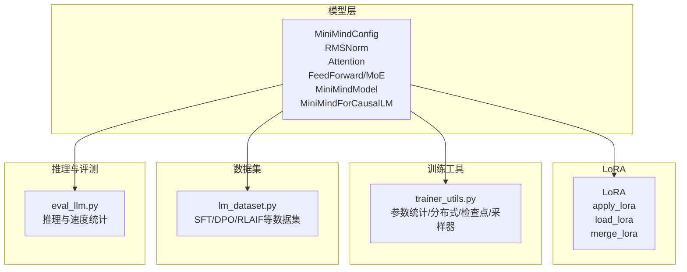
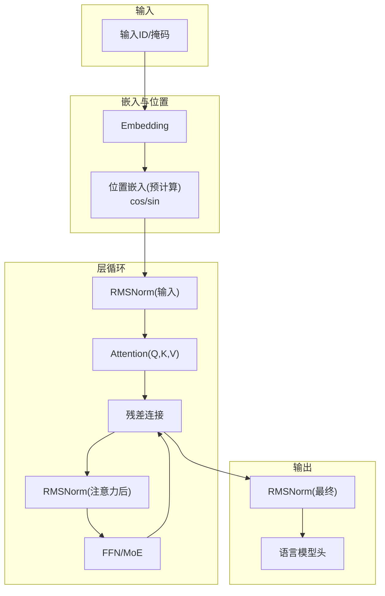
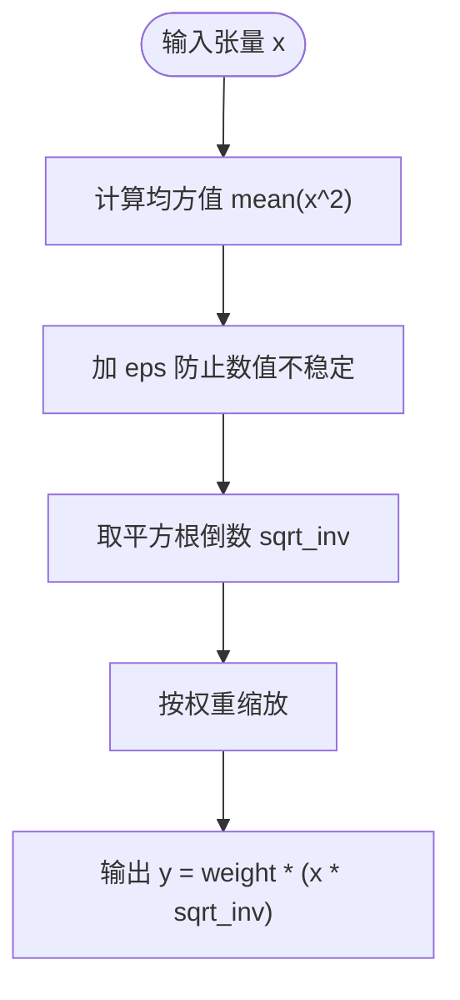
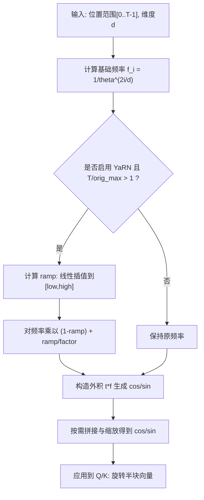
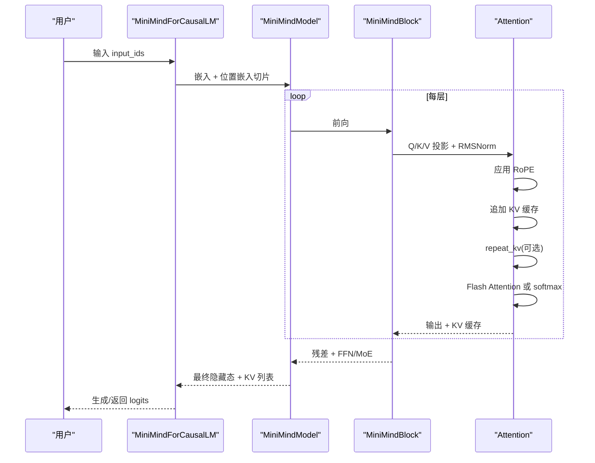
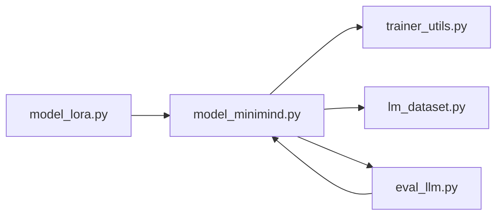

# 核心组件实现

<cite>
**本文引用的文件**
- [model_minimind.py](file://model/model_minimind.py)
- [model_lora.py](file://model/model_lora.py)
- [trainer_utils.py](file://trainer/trainer_utils.py)
- [lm_dataset.py](file://dataset/lm_dataset.py)
- [eval_llm.py](file://eval_llm.py)
- [README.md](file://README.md)
</cite>

## 目录
1. [引言](#引言)
2. [项目结构](#项目结构)
3. [核心组件](#核心组件)
4. [架构总览](#架构总览)
5. [详细组件分析](#详细组件分析)
6. [依赖分析](#依赖分析)
7. [性能考量](#性能考量)
8. [故障排查指南](#故障排查指南)
9. [结论](#结论)
10. [附录](#附录)

## 引言
本文件聚焦 MiniMind 的核心组件实现，围绕以下主题展开：
- RMSNorm 的数学原理、数值稳定性与梯度传播特性
- RoPE 旋转位置编码的预计算机制与 YaRN 动态缩放策略
- KV 缓存的实现原理与内存优化技术
- 位置嵌入的生成过程与长序列处理能力
- 性能基准测试与优化建议，帮助开发者在不同硬件环境下进行参数调优

## 项目结构
本项目采用按功能分层的组织方式，核心模型与训练工具分布在 model、trainer、dataset 等目录中。与本文主题直接相关的文件包括：
- 模型定义与核心组件：model/model_minimind.py
- LoRA 参数高效微调：model/model_lora.py
- 训练工具与检查点管理：trainer/trainer_utils.py
- 数据集与训练数据处理：dataset/lm_dataset.py
- 推理入口与性能评估：eval_llm.py
- 项目总体说明与配置要点：README.md

图表来源
- [model_minimind.py](file://model/model_minimind.py)
- [model_lora.py](file://model/model_lora.py)
- [trainer_utils.py](file://trainer/trainer_utils.py)
- [lm_dataset.py](file://dataset/lm_dataset.py)
- [eval_llm.py](file://eval_llm.py)

章节来源
- [model_minimind.py](file://model/model_minimind.py)
- [model_lora.py](file://model/model_lora.py)
- [trainer_utils.py](file://trainer/trainer_utils.py)
- [lm_dataset.py](file://dataset/lm_dataset.py)
- [eval_llm.py](file://eval_llm.py)
- [README.md](file://README.md)

## 核心组件
本节概述 MiniMind 的关键组件及其职责：
- RMSNorm：预标准化 + RMS 归一化，提供数值稳定与梯度可控性
- RoPE 与 YaRN：旋转位置编码与动态缩放，支持长序列外推
- Attention：多查询注意力，支持 Flash Attention 与 KV 缓存
- FFN/MoE：SwiGLU 前馈与 MoE 路由，支持专家并行与辅助损失
- MiniMindModel/MiniMindForCausalLM：模型主干与生成管线

章节来源
- [model_minimind.py](file://model/model_minimind.py)

## 架构总览
MiniMind 的推理与训练架构围绕“预标准化 + RMSNorm + RoPE + 多查询注意力 + SwiGLU 前馈/ MoE”展开。KV 缓存贯穿推理阶段，配合 YaRN 外推提升长序列处理能力。

图表来源
- [model_minimind.py](file://model/model_minimind.py)

## 详细组件分析

### RMSNorm 数学原理与实现细节
RMSNorm 的核心思想是对通道维度进行均方根归一化，并乘以可学习缩放参数。在 MiniMind 中：
- 数值稳定性：通过 eps 防止除零与数值溢出
- 类型一致性：norm 返回浮点类型，再按输入 dtype 转回，避免精度损失
- 梯度传播：RMSNorm 在反向传播中对均方根与缩放参数求导，有助于稳定训练

图表来源
- [model_minimind.py](file://model/model_minimind.py)

章节来源
- [model_minimind.py](file://model/model_minimind.py)

### RoPE 旋转位置编码与 YaRN 动态缩放
RoPE 通过复数旋转将位置信息融入 Q/K 向量的二维子空间。MiniMind 的实现包含：
- 预计算频率：按维度生成频率，支持 YaRN 动态缩放
- YaRN 缩放：当序列长度超过原始最大长度时，对高频分量施加线性衰减，提升外推能力
- 应用方式：将 cos/sin 按需广播，与旋转操作结合应用于 Q/K

图表来源
- [model_minimind.py](file://model/model_minimind.py)

章节来源
- [model_minimind.py](file://model/model_minimind.py)

### KV 缓存实现与内存优化
MiniMind 的 KV 缓存通过以下机制实现：
- 位置嵌入切片：在推理时仅取当前位置到序列末尾的 cos/sin
- 追加 K/V：将新步的 K/V 与历史缓存沿序列维拼接
- 重复 KV：当 kv_heads < q_heads 时，对 KV 进行重复以匹配 Q 的头数
- Flash Attention：在满足条件时使用原生 scaled_dot_product_attention，提高吞吐

图表来源
- [model_minimind.py](file://model/model_minimind.py)

章节来源
- [model_minimind.py](file://model/model_minimind.py)

### 位置嵌入生成与长序列处理
- 位置嵌入在模型初始化时一次性预计算，注册为非持久缓冲区，避免参与训练参数
- 推理时按起始位置切片，避免重复计算
- YaRN 外推通过动态缩放频率，使 RoPE 在超出训练长度时仍具外推能力

章节来源
- [model_minimind.py](file://model/model_minimind.py)

### LoRA 参数高效微调
- LoRA 通过低秩矩阵 A/B 对线性层进行增量修正
- 在推理时将 LoRA 输出与原线性层输出相加
- 支持加载/保存/合并 LoRA 权重，便于部署

章节来源
- [model_lora.py](file://model/model_lora.py)

## 依赖分析
- 模型层依赖：torch.nn.functional、transformers 激活函数、GenerationMixin
- 训练工具：分布式训练、检查点保存/恢复、采样器
- 数据集：datasets 加载、chat template 应用、标签生成
- 推理入口：AutoTokenizer/AutoModelForCausalLM、TextStreamer

图表来源
- [model_minimind.py](file://model/model_minimind.py)
- [trainer_utils.py](file://trainer/trainer_utils.py)
- [lm_dataset.py](file://dataset/lm_dataset.py)
- [eval_llm.py](file://eval_llm.py)
- [model_lora.py](file://model/model_lora.py)

章节来源
- [model_minimind.py](file://model/model_minimind.py)
- [trainer_utils.py](file://trainer/trainer_utils.py)
- [lm_dataset.py](file://dataset/lm_dataset.py)
- [eval_llm.py](file://eval_llm.py)
- [model_lora.py](file://model/model_lora.py)

## 性能考量
- Flash Attention：在满足因果掩码、无自定义 attention_mask、序列长度>1 时优先使用原生 scaled_dot_product_attention，显著提升吞吐
- KV 缓存：推理阶段避免重复计算 K/V，减少显存与算力消耗
- YaRN 外推：在不重新训练的情况下扩展有效上下文长度，缓解长序列性能退化
- LoRA：参数高效微调，降低显存占用与训练成本
- 训练工具：分布式训练、断点续训、检查点管理，提升训练稳定性与可恢复性

章节来源
- [model_minimind.py](file://model/model_minimind.py)
- [trainer_utils.py](file://trainer/trainer_utils.py)
- [README.md](file://README.md)

## 故障排查指南
- 推理速度异常
  - 检查是否启用 Flash Attention 条件（因果掩码、无 attention_mask、序列长度>1）
  - 确认 KV 缓存是否正确传入 past_key_values
- 生成质量不佳
  - 调整 temperature、top_p、repetition_penalty
  - 检查是否启用 YaRN 外推（仅在推理时生效）
- 显存不足
  - 使用 LoRA 进行参数高效微调
  - 合理设置 max_new_tokens 与 batch size
- 检查点恢复问题
  - 确认 world_size 与当前环境一致，必要时进行 step 调整

章节来源
- [model_minimind.py](file://model/model_minimind.py)
- [trainer_utils.py](file://trainer/trainer_utils.py)
- [eval_llm.py](file://eval_llm.py)

## 结论
MiniMind 的核心组件在实现上注重简洁与可复现性，RMSNorm 提供稳定的归一化，RoPE 与 YaRN 支持长序列外推，Attention 与 KV 缓存共同实现高效的推理。通过 LoRA 与分布式训练工具，项目在参数效率与训练稳定性方面取得良好平衡。开发者可在不同硬件环境下依据本文建议进行参数调优与性能优化。

## 附录
- 配置要点
  - hidden_size、num_hidden_layers、num_attention_heads、num_key_value_heads、head_dim、intermediate_size、max_position_embeddings、rms_norm_eps、rope_theta、inference_rope_scaling
- 推理参数
  - max_new_tokens、temperature、top_p、open_thinking、historys、show_speed
- 训练工具
  - 断点续训、分布式训练、检查点保存/恢复、采样器跳过

章节来源
- [model_minimind.py](file://model/model_minimind.py)
- [trainer_utils.py](file://trainer/trainer_utils.py)
- [eval_llm.py](file://eval_llm.py)
- [README.md](file://README.md)