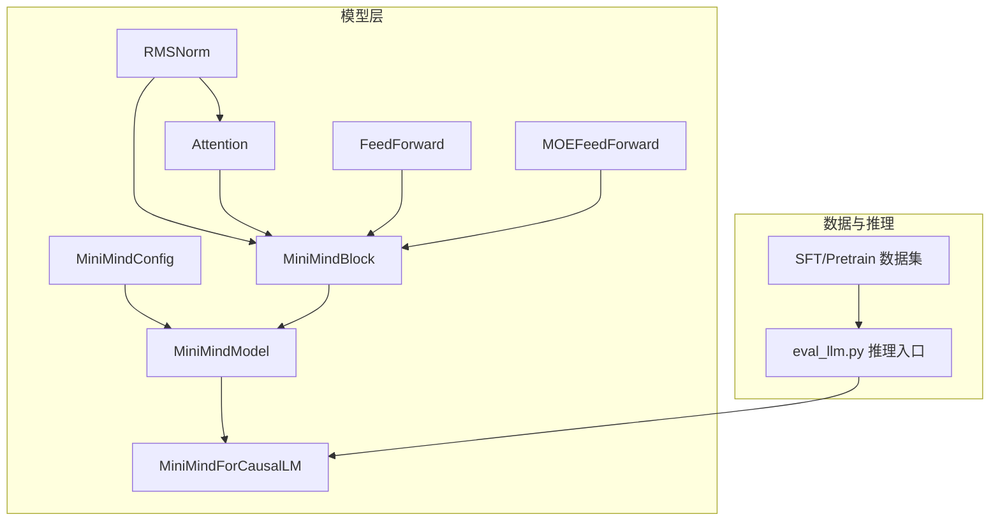
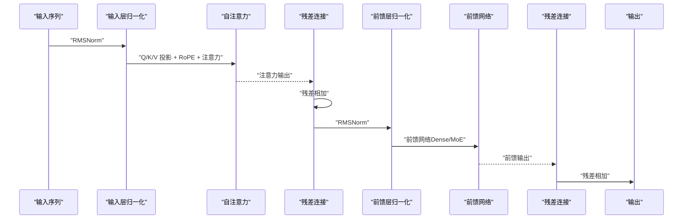
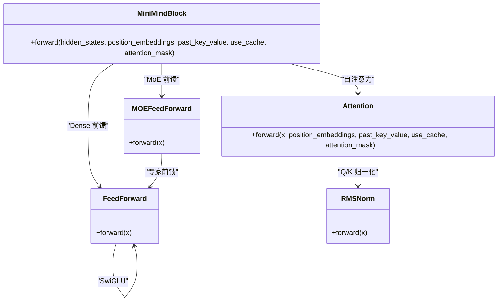
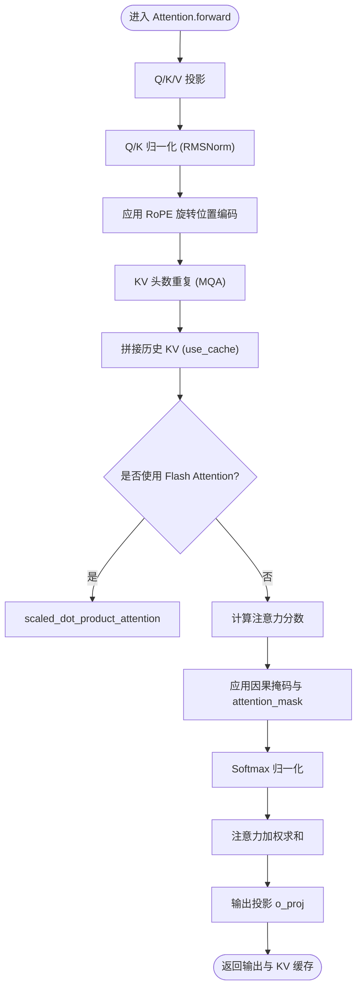
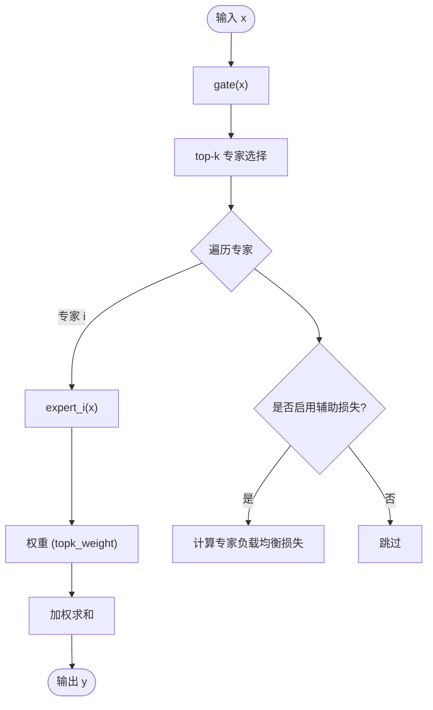
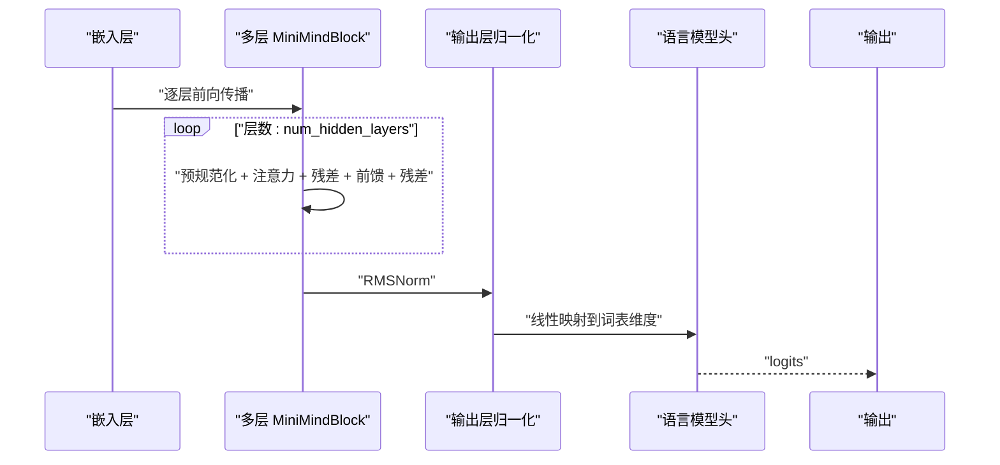
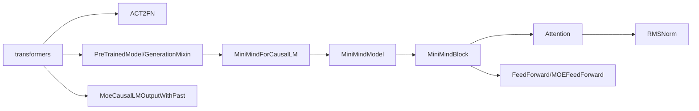

# 模型层结构

<cite>
**本文引用的文件**
- [model_minimind.py](file://model/model_minimind.py)
- [model_lora.py](file://model/model_lora.py)
- [README.md](file://README.md)
- [requirements.txt](file://requirements.txt)
- [lm_dataset.py](file://dataset/lm_dataset.py)
- [eval_llm.py](file://eval_llm.py)
</cite>

## 目录
1. [引言](#引言)
2. [项目结构](#项目结构)
3. [核心组件](#核心组件)
4. [架构总览](#架构总览)
5. [详细组件分析](#详细组件分析)
6. [依赖关系分析](#依赖关系分析)
7. [性能考量](#性能考量)
8. [故障排查指南](#故障排查指南)
9. [结论](#结论)
10. [附录](#附录)

## 引言
本文件聚焦 MiniMind 的模型层结构，系统阐述 MiniMindBlock 的设计理念与实现细节，包括：
- 预规范化 + RMSNorm 的设计优势与残差连接的实现方式
- Decoder-only Transformer 中自注意力与前馈网络的组合与顺序
- 层归一化的落位选择及其对训练稳定性的影响
- 模型层的前向传播流程（注意力计算、前馈网络处理、残差连接）
- 可视化图解与内存占用分析，帮助开发者理解计算复杂度与内存需求

## 项目结构
本项目采用“按功能域分层”的组织方式，模型层位于 model 子目录，训练与推理脚本位于 trainer 与 scripts 子目录，数据集处理位于 dataset 子目录。与模型层结构直接相关的关键文件如下：
- model/model_minimind.py：定义配置、RMSNorm、Attention、FeedForward、MOEFeedForward、MiniMindBlock、MiniMindModel、MiniMindForCausalLM 等核心模块
- model/model_lora.py：LoRA 参数高效微调的实现（与模型层结构兼容）
- dataset/lm_dataset.py：训练数据集的构造与标签生成逻辑（影响前向传播中的损失与掩码）
- eval_llm.py：推理入口，演示如何加载模型、调用 generate 与前向传播
- README.md：项目背景、结构说明与配置参数说明
- requirements.txt：依赖声明（transformers、torch 等）

图表来源
- [model_minimind.py:10-280](file://model/model_minimind.py#L10-L280)
- [eval_llm.py:12-31](file://eval_llm.py#L12-L31)

章节来源
- [model_minimind.py:10-280](file://model/model_minimind.py#L10-L280)
- [README.md:556-586](file://README.md#L556-L586)

## 核心组件
- MiniMindConfig：模型配置，包含隐藏维度、层数、注意力头数、中间维度、激活函数、RoPE 参数、MoE 参数等
- RMSNorm：基于方差的归一化，提供数值稳定性和梯度可控性
- Attention：多头注意力，支持 KV 重复、RoPE 旋转位置编码、Flash Attention 与自回归掩码
- FeedForward：SwiGLU 类前馈网络（由 ACT2FN 激活函数驱动）
- MOEFeedForward：MoE 前馈网络，Top-1 路由与专家聚合
- MiniMindBlock：单层 Transformer Block，采用预规范化 + 残差连接
- MiniMindModel：嵌入层 + 多层 MiniMindBlock + 输出归一化
- MiniMindForCausalLM：在 MiniMindModel 基础上附加语言模型头

章节来源
- [model_minimind.py:10-280](file://model/model_minimind.py#L10-L280)

## 架构总览
MiniMind 采用 Decoder-only 架构，遵循“预规范化 + RMSNorm + 残差连接”的设计。每层由以下部分组成：
- 输入归一化（RMSNorm）与残差连接
- 自注意力（Attention）：Q/K/V 投影、RMSNorm 归一化、RoPE 旋转位置编码、KV 缓存与 Flash Attention
- 前馈网络（FeedForward 或 MOEFeedForward）
- 输出归一化（RMSNorm）与残差连接

图表来源
- [model_minimind.py:177-193](file://model/model_minimind.py#L177-L193)
- [model_minimind.py:90-133](file://model/model_minimind.py#L90-L133)
- [model_minimind.py:135-145](file://model/model_minimind.py#L135-L145)
- [model_minimind.py:147-175](file://model/model_minimind.py#L147-L175)

## 详细组件分析

### MiniMindBlock：预规范化 + RMSNorm + 残差连接
- 设计理念
  - 预规范化（Pre-Norm）：在子层之前进行归一化，有助于缓解梯度爆炸与梯度消失，提升训练稳定性
  - RMSNorm：相比 LayerNorm，RMSNorm 不使用偏移参数，计算更轻量且在实践中具有良好的数值特性
  - 残差连接：将子层输出与输入相加，有利于信息流动与深层网络训练
- 实现要点
  - 输入归一化：hidden_states -> input_layernorm -> Attention
  - 注意力输出与残差：hidden_states + self_attn(...)
  - 前馈层归一化：post_attention_layernorm -> MLP
  - 前馈输出与残差：hidden_states + mlp(...)

图表来源
- [model_minimind.py:177-193](file://model/model_minimind.py#L177-L193)
- [model_minimind.py:90-133](file://model/model_minimind.py#L90-L133)
- [model_minimind.py:135-145](file://model/model_minimind.py#L135-L145)
- [model_minimind.py:147-175](file://model/model_minimind.py#L147-L175)
- [model_minimind.py:49-59](file://model/model_minimind.py#L49-L59)

章节来源
- [model_minimind.py:177-193](file://model/model_minimind.py#L177-L193)

### Attention：自注意力与 RoPE
- 多头注意力
  - Q/K/V 投影：线性层将隐藏状态映射到多头空间
  - Q/K 归一化：RMSNorm 归一化 Q/K，提升注意力稳定性
  - RoPE 旋转位置编码：apply_rotary_pos_emb 应用旋转位置编码，支持 YaRN 外推
  - KV 重复：repeat_kv 将 KV 头数扩展到与 Q 对齐（支持 MQA）
  - 注意力计算：优先使用 Flash Attention（scaled_dot_product_attention），否则使用常规 softmax
  - 掩码：自回归因果掩码与 attention_mask
  - 输出投影：o_proj 将多头拼接后的输出映射回隐藏维度
- KV 缓存：past_key_value 支持增量解码，use_cache 控制是否返回缓存

图表来源
- [model_minimind.py:90-133](file://model/model_minimind.py#L90-L133)
- [model_minimind.py:61-77](file://model/model_minimind.py#L61-L77)
- [model_minimind.py:79-83](file://model/model_minimind.py#L79-L83)
- [model_minimind.py:85-88](file://model/model_minimind.py#L85-L88)

章节来源
- [model_minimind.py:90-133](file://model/model_minimind.py#L90-L133)

### FeedForward 与 MOEFeedForward：前馈网络
- FeedForward（Dense）
  - 采用 SwiGLU 激活（由 ACT2FN 提供），包含 gate/up/down 三线性层
  - 前向：act(gate_proj(x)) * up_proj(x) -> down_proj
- MOEFeedForward（MoE）
  - 专家路由：gate(x) -> top-k 专家选择
  - 专家聚合：按权重对专家输出进行加权求和
  - 辅助损失：router_aux_loss_coef 控制专家负载均衡辅助损失

图表来源
- [model_minimind.py:147-175](file://model/model_minimind.py#L147-L175)
- [model_minimind.py:135-145](file://model/model_minimind.py#L135-L145)

章节来源
- [model_minimind.py:135-175](file://model/model_minimind.py#L135-L175)

### 前向传播流程：MiniMindModel 与 MiniMindForCausalLM
- MiniMindModel
  - 嵌入层 + Dropout
  - 逐层 MiniMindBlock：每层执行预规范化 + 注意力 + 残差 + 前馈 + 残差
  - 最终输出层归一化
  - 返回 hidden_states、past_key_values、MoE 辅助损失
- MiniMindForCausalLM
  - 在 MiniMindModel 基础上附加语言模型头（与嵌入权重共享）
  - 前向返回损失（交叉熵）、aux_loss、logits、past_key_values、hidden_states

图表来源
- [model_minimind.py:195-227](file://model/model_minimind.py#L195-L227)
- [model_minimind.py:229-246](file://model/model_minimind.py#L229-L246)

章节来源
- [model_minimind.py:195-246](file://model/model_minimind.py#L195-L246)

### 层归一化位置与训练稳定性
- 预规范化（Pre-Norm）的优势
  - 在子层之前进行归一化，避免激活分布随深度变化过大
  - 减少梯度爆炸/消失风险，提升深层网络训练稳定性
- RMSNorm 的选择
  - 无偏移参数，计算更轻量，数值上更稳定
  - 在实践中对收敛速度与最终精度均有积极影响
- 残差连接
  - 保证梯度与信息的顺畅流动，缓解深层网络退化问题

章节来源
- [model_minimind.py:177-193](file://model/model_minimind.py#L177-L193)
- [README.md:562](file://README.md#L562)

### 内存占用与计算复杂度分析
- 计算复杂度
  - 自注意力：O(B*H*S^2*D/H)（S 为序列长度，H 为头数，D 为隐藏维度）
  - 前馈网络：O(B*S*N*D)（N 为中间维度）
  - KV 缓存：每层每步 O(B*H*S*D/H)，增量解码时线性增长
- 内存占用
  - 主要来自激活张量与梯度，以及 KV 缓存
  - Flash Attention 可显著降低内存峰值，提高吞吐
  - MoE 前馈在训练时引入额外的专家调度与辅助损失开销
- 参数规模
  - Dense 模型：约 64M
  - MoE 模型：约 198M / A64M（取决于专家数量与路由策略）

章节来源
- [README.md:562-571](file://README.md#L562-L571)
- [README.md:579-586](file://README.md#L579-L586)

## 依赖关系分析
- 外部依赖
  - transformers：提供 ACT2FN 激活函数、PreTrainedModel、GenerationMixin、MoeCausalLMOutputWithPast 等
  - torch：核心张量运算与神经网络模块
- 内部依赖
  - MiniMindBlock 依赖 Attention、RMSNorm、FeedForward/MOEFeedForward
  - MiniMindModel 依赖 MiniMindBlock、RMSNorm、嵌入层
  - MiniMindForCausalLM 依赖 MiniMindModel、线性层作为语言模型头

图表来源
- [model_minimind.py:1-6](file://model/model_minimind.py#L1-L6)
- [requirements.txt:1-32](file://requirements.txt#L1-L32)

章节来源
- [model_minimind.py:1-6](file://model/model_minimind.py#L1-L6)
- [requirements.txt:1-32](file://requirements.txt#L1-L32)

## 性能考量
- Flash Attention
  - 在满足条件时使用 scaled_dot_product_attention，显著降低内存峰值与提升吞吐
- KV 缓存
  - 增量解码时复用历史 KV，避免重复计算，降低推理延迟
- RoPE 与 YaRN
  - 支持长序列外推，提升长上下文场景下的稳定性与泛化能力
- MoE
  - 训练时调度与辅助损失带来额外开销；推理时可受益于稀疏激活

章节来源
- [model_minimind.py:124-133](file://model/model_minimind.py#L124-L133)
- [model_minimind.py:61-77](file://model/model_minimind.py#L61-L77)
- [README.md:564-571](file://README.md#L564-L571)

## 故障排查指南
- 推理与生成
  - 确认 tokenizer 与模型权重匹配，必要时使用 transformers 格式或原生权重
  - 使用 eval_llm.py 的 generate 接口，合理设置 temperature、top_p、repetition_penalty
- 训练数据
  - SFT 数据集标签生成逻辑：仅对 assistant 回复区域计算损失，避免对系统提示与用户输入计算损失
- LoRA 微调
  - apply_lora 仅对满足条件的线性层注入低秩增量，注意合并 LoRA 权重时的保存与加载流程

章节来源
- [eval_llm.py:12-31](file://eval_llm.py#L12-L31)
- [lm_dataset.py:88-104](file://dataset/lm_dataset.py#L88-L104)
- [model_lora.py:21-66](file://model/model_lora.py#L21-L66)

## 结论
MiniMind 的模型层结构以“预规范化 + RMSNorm + 残差连接”为核心，结合自注意力与前馈网络（Dense 或 MoE），在保证训练稳定性的同时实现了高效的前向传播与推理。通过 Flash Attention、RoPE/YaRN、KV 缓存与 LoRA 等技术，项目在小参数规模下实现了较好的性能与可扩展性。开发者可据此理解模型层的计算流程与内存占用，为训练与推理优化提供依据。

## 附录
- 配置参数参考
  - 隐藏维度、层数、注意力头数、中间维度、激活函数、RoPE 参数、MoE 参数等
- 推理与训练脚本
  - eval_llm.py：推理入口
  - dataset/lm_dataset.py：数据集构造与标签生成
  - model/model_lora.py：LoRA 微调与合并

章节来源
- [README.md:558-586](file://README.md#L558-L586)
- [eval_llm.py:32-94](file://eval_llm.py#L32-L94)
- [lm_dataset.py:37-120](file://dataset/lm_dataset.py#L37-L120)
- [model_lora.py:1-66](file://model/model_lora.py#L1-L66)