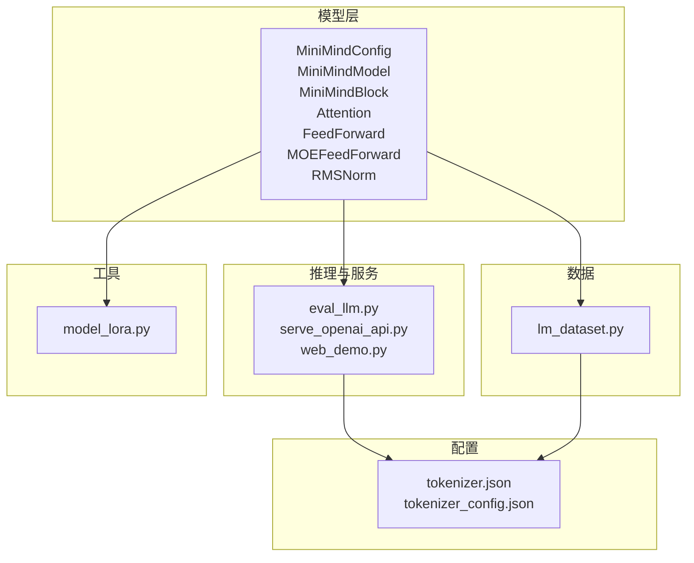
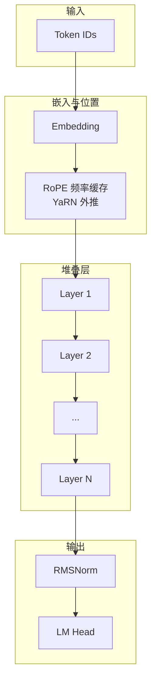
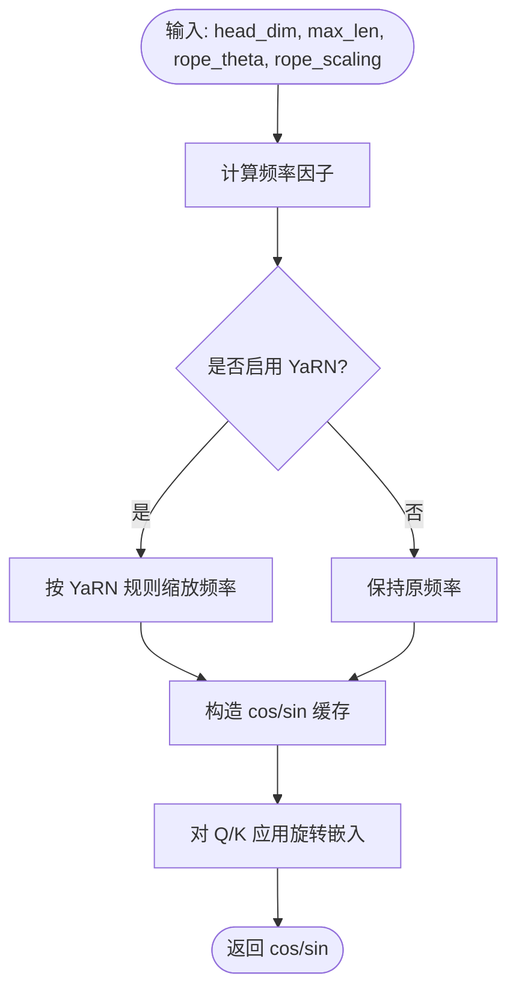
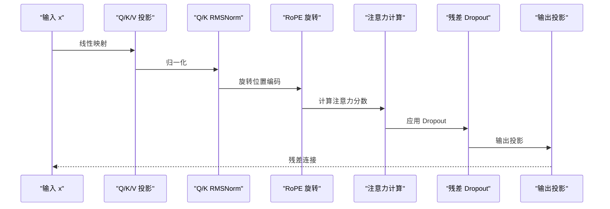
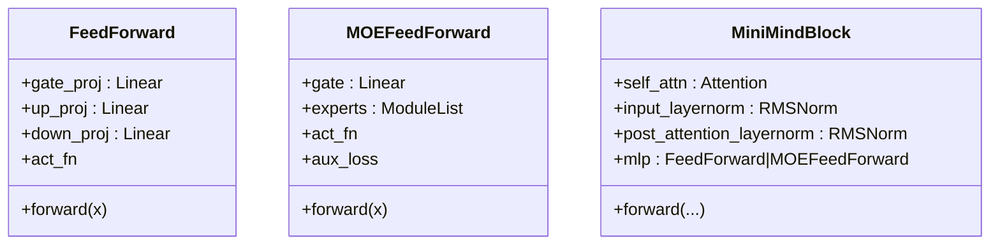
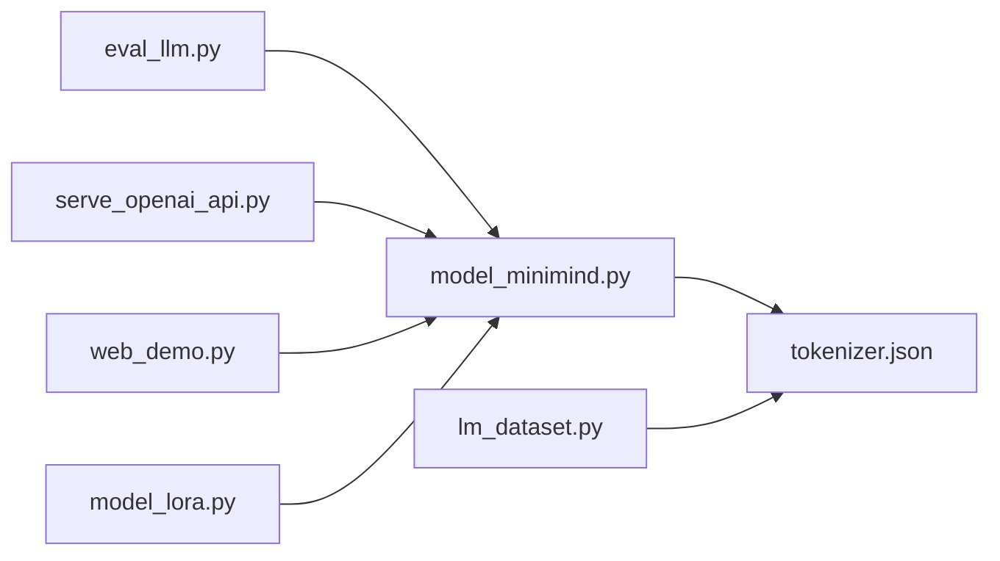

# 模型架构设计

<cite>
**本文引用的文件**
- [model_minimind.py](file://model/model_minimind.py)
- [model_lora.py](file://model/model_lora.py)
- [README.md](file://README.md)
- [eval_llm.py](file://eval_llm.py)
- [serve_openai_api.py](file://scripts/serve_openai_api.py)
- [web_demo.py](file://scripts/web_demo.py)
- [lm_dataset.py](file://dataset/lm_dataset.py)
- [requirements.txt](file://requirements.txt)
- [tokenizer.json](file://model/tokenizer.json)
- [tokenizer_config.json](file://model/tokenizer_config.json)
</cite>

## 目录
1. [引言](#引言)
2. [项目结构](#项目结构)
3. [核心组件](#核心组件)
4. [架构总览](#架构总览)
5. [详细组件分析](#详细组件分析)
6. [依赖分析](#依赖分析)
7. [性能考量](#性能考量)
8. [故障排查指南](#故障排查指南)
9. [结论](#结论)
10. [附录](#附录)

## 引言
本文件面向开发者与研究者，系统化阐述 MiniMind 模型架构，重点覆盖 MiniMind-3 Dense 与 MiniMind-3-MoE 的完整实现。内容涵盖：
- Transformer Decoder-only 结构、预标准化 + RMSNorm、SwiGLU 激活函数、RoPE 旋转位置编码与 YaRN 外推
- 注意力机制实现（含 KV 重复、掩码、Flash Attention 路径）
- 前馈网络设计（Dense 与 MoE 专家混合）
- 模型配置参数的意义与影响（层数、维度、头数等）
- 结构图解与代码实现细节，帮助从零实现完整架构

## 项目结构
项目采用按功能域划分的模块化组织，核心模型与推理、训练、脚本分离清晰：
- model：模型定义与 LoRA 实现
- dataset：数据集加载与预处理
- scripts：推理服务与 Web Demo
- trainer：训练脚本（未在本文展开）
- 顶层 README、requirements 等



图表来源
- [model_minimind.py:10-280](file://model/model_minimind.py#L10-L280)
- [eval_llm.py:12-31](file://eval_llm.py#L12-L31)
- [serve_openai_api.py:28-47](file://scripts/serve_openai_api.py#L28-L47)
- [web_demo.py:198-209](file://scripts/web_demo.py#L198-L209)
- [lm_dataset.py:37-120](file://dataset/lm_dataset.py#L37-L120)
- [model_lora.py:6-66](file://model/model_lora.py#L6-L66)
- [tokenizer.json:1-800](file://model/tokenizer.json#L1-L800)

章节来源
- [README.md:556-586](file://README.md#L556-L586)
- [requirements.txt:1-32](file://requirements.txt#L1-L32)

## 核心组件
- MiniMindConfig：集中管理模型超参数，包括隐藏维度、层数、注意力头数、KV 头数、中间维度、RoPE theta、YaRN 缩放配置、MoE 专家数与路由策略等
- RMSNorm：预标准化 + RMS 归一化，稳定训练与推理
- RoPE 与 YaRN：旋转位置编码及其外推机制
- Attention：多查询注意力，支持 KV 重复、掩码、Flash Attention
- FeedForward：SwiGLU 前馈网络
- MOEFeedForward：Top-1 路由的 MoE 前馈
- MiniMindBlock：自注意力 + 前馈的层单元，采用预标准化
- MiniMindModel：嵌入层、若干 MiniMindBlock、最终归一化
- MiniMindForCausalLM：LM 头与生成逻辑

章节来源
- [model_minimind.py:10-45](file://model/model_minimind.py#L10-L45)
- [model_minimind.py:49-280](file://model/model_minimind.py#L49-L280)

## 架构总览
MiniMind-3 Dense 与 MiniMind-3-MoE 均采用 Decoder-only Transformer，遵循“预标准化 + RMSNorm + SwiGLU + RoPE + 注意力”的主干路径。MoE 在前馈部分替换为专家混合，路由采用 Top-1，专家数与每 token 专家数可配置。



图表来源
- [model_minimind.py:195-227](file://model/model_minimind.py#L195-L227)
- [model_minimind.py:177-193](file://model/model_minimind.py#L177-L193)
- [model_minimind.py:61-77](file://model/model_minimind.py#L61-L77)

## 详细组件分析

### 配置与参数体系（MiniMindConfig）
- 关键参数
  - hidden_size：隐藏维度
  - num_hidden_layers：层数
  - use_moe：是否启用 MoE
  - dropout：Dropout 比例
  - vocab_size、bos_token_id、eos_token_id：词表与特殊 token
  - flash_attn：是否启用 Flash Attention
  - num_attention_heads、num_key_value_heads、head_dim：注意力头配置
  - hidden_act：激活函数（默认 SiLU/Swish）
  - intermediate_size：前馈中间维度（基于 π 的圆周率估算并按 64 对齐）
  - max_position_embeddings、rope_theta：RoPE 基础参数
  - inference_rope_scaling：是否启用 YaRN 外推
  - MoE 参数：num_experts、num_experts_per_tok、moe_intermediate_size、norm_topk_prob、router_aux_loss_coef
- 选择依据
  - d_model 与 n_layers 的权衡：在小模型区间，更深的网络通常更利于抽象学习，但 head_dim 不能过小
  - 中间维度按 π 估算并 64 对齐，兼顾算力与容量
  - RoPE theta 与 YaRN 外推用于长序列扩展

章节来源
- [model_minimind.py:10-45](file://model/model_minimind.py#L10-L45)
- [README.md:588-612](file://README.md#L588-L612)

### RMSNorm 与预标准化
- RMSNorm：对最后一维做 RMS 归一化，配合可学习缩放参数
- 预标准化：在注意力与前馈之前进行归一化，有助于稳定梯度与训练收敛

章节来源
- [model_minimind.py:49-59](file://model/model_minimind.py#L49-L59)
- [model_minimind.py:177-183](file://model/model_minimind.py#L177-L183)

### RoPE 旋转位置编码与 YaRN 外推
- 频率预计算：根据 head_dim、最大长度、rope_theta 生成 cos/sin 缓存
- YaRN：当启用推理时，对高频分量施加线性插值缩放，实现长序列外推
- 应用：在注意力前对 Q/K 做旋转嵌入



图表来源
- [model_minimind.py:61-77](file://model/model_minimind.py#L61-L77)
- [model_minimind.py:79-83](file://model/model_minimind.py#L79-L83)

章节来源
- [model_minimind.py:61-83](file://model/model_minimind.py#L61-L83)

### 注意力机制（Attention）
- 多查询注意力：q_heads 与 kv_heads 可分离，通过 KV 重复扩大到 q_heads
- 预标准化：Q/K 分别经 RMSNorm
- 掩码：因果掩码与 attention_mask 叠加
- Flash Attention：在满足条件时走 scaled_dot_product_attention
- 输出投影：残差 Dropout + 输出投影



图表来源
- [model_minimind.py:90-133](file://model/model_minimind.py#L90-L133)

章节来源
- [model_minimind.py:90-133](file://model/model_minimind.py#L90-L133)

### 前馈网络（Dense 与 SwiGLU）
- Dense：Gate/Up 双线性投影 + 激活函数，Down 投影输出
- 激活：ACT2FN[config.hidden_act]，默认 SiLU
- 结构：SwiGLU = act(Gate·X) ⊙ Up·X



图表来源
- [model_minimind.py:135-145](file://model/model_minimind.py#L135-L145)
- [model_minimind.py:147-175](file://model/model_minimind.py#L147-L175)
- [model_minimind.py:177-193](file://model/model_minimind.py#L177-L193)

章节来源
- [model_minimind.py:135-145](file://model/model_minimind.py#L135-L145)
- [model_minimind.py:147-175](file://model/model_minimind.py#L147-L175)

### MoE 专家混合系统
- 路由：Gate 线性层输出每个专家的概率，Top-K（默认 K=1）选择专家
- 归一化：可选对 top-k 权重做归一化
- 前向：对选中专家执行前馈并按权重累加
- 辅助损失：router_aux_loss_coef 控制专家负载均衡损失

```mermaid
flowchart TD
In(["x: BxSxD"]) --> Gate["Gate(x) -> P(专家)"]
Gate --> TopK["Top-1 选择专家索引"]
TopK --> Loop{"遍历专家"}
Loop --> |专家 i| Expert[i]["专家前馈"]
Expert[i] --> Weight["取对应权重"]
Weight --> Sum["按权重累加"]
Sum --> Out(["y: BxSxD"])
Loop --> |训练| Aux["计算专家负载均衡损失"]
```

图表来源
- [model_minimind.py:147-175](file://model/model_minimind.py#L147-L175)

章节来源
- [model_minimind.py:147-175](file://model/model_minimind.py#L147-L175)

### MiniMindBlock 与 MiniMindModel
- Block：预标准化 + 自注意力 + 残差 + 预标准化 + 前馈 + 残差
- Model：嵌入层 + 若干 Block + 最终 RMSNorm；注册 RoPE 频率缓存

章节来源
- [model_minimind.py:177-193](file://model/model_minimind.py#L177-L193)
- [model_minimind.py:195-227](file://model/model_minimind.py#L195-L227)

### MiniMindForCausalLM 与生成
- LM 头：与词嵌入共享权重
- 前向：返回 logits、past_key_values、aux_loss
- 生成：温度、Top-p、Top-k、重复惩罚、流式输出等

章节来源
- [model_minimind.py:229-280](file://model/model_minimind.py#L229-L280)
- [eval_llm.py:32-94](file://eval_llm.py#L32-L94)
- [serve_openai_api.py:105-169](file://scripts/serve_openai_api.py#L105-L169)

## 依赖分析
- 运行时依赖：PyTorch、Transformers、TRFLib（trl）、Streamlit、FastAPI、uvicorn 等
- 模块间关系：推理脚本依赖模型定义；数据集模块依赖分词器；LoRA 模块与模型线性层融合



图表来源
- [eval_llm.py:6-30](file://eval_llm.py#L6-L30)
- [serve_openai_api.py:19-47](file://scripts/serve_openai_api.py#L19-L47)
- [web_demo.py:9-209](file://scripts/web_demo.py#L9-L209)
- [lm_dataset.py:1-256](file://dataset/lm_dataset.py#L1-L256)
- [model_lora.py:6-66](file://model/model_lora.py#L6-L66)
- [requirements.txt:1-32](file://requirements.txt#L1-L32)

章节来源
- [requirements.txt:1-32](file://requirements.txt#L1-L32)

## 性能考量
- Flash Attention：在满足条件时使用原生 SDPA，显著提升注意力计算效率
- KV 重复：将 KV 头扩展到 Q 头数，避免重复计算
- RoPE 外推：YaRN 在推理时对高频分量进行缩放，缓解长序列位置偏差
- MoE 训练开销：专家数增加会带来 kernel 启停与调度开销，当前实现下 4 专家/Top-1 大约比 Dense 慢 50%
- 参数规模：MiniMind-3 Dense 约 64M，MoE 约 198M / A64M（按 README）

章节来源
- [model_minimind.py:124-130](file://model/model_minimind.py#L124-L130)
- [model_minimind.py:85-88](file://model/model_minimind.py#L85-L88)
- [README.md:567-571](file://README.md#L567-L571)
- [README.md:579-582](file://README.md#L579-L582)

## 故障排查指南
- 推理时 RoPE 位置偏差
  - 现象：长序列生成质量下降
  - 处理：启用推理时的 YaRN 外推（inference_rope_scaling）
- 生成不稳定或工具调用异常
  - 现象：思考标签与工具调用共存时不稳定
  - 处理：适当降低温度、Top-p，或关闭自适应思考
- 生成速度慢
  - 现象：MoE 训练阶段速度较慢
  - 处理：减少专家数或使用 Dense；确保 Flash Attention 条件满足
- 分词器不兼容
  - 现象：第三方推理框架加载权重失败
  - 处理：使用 transformers 格式模型或按 README 兼容说明迁移

章节来源
- [serve_openai_api.py:105-169](file://scripts/serve_openai_api.py#L105-L169)
- [README.md:160-166](file://README.md#L160-L166)

## 结论
MiniMind 以简洁的 Decoder-only 架构为核心，结合预标准化 + RMSNorm、SwiGLU、RoPE 与 YaRN 外推，实现了在小参数规模下的高效训练与推理。MoE 在容量与开销之间提供折中，适合在资源受限场景下扩展前馈容量。通过模块化的实现与完善的推理服务，开发者可从零复现并扩展该架构。

## 附录
- 模型配置参数对照（来自 README）
  - minimind-3：64M，词表 6400，max_pos 32768，rope_theta 1e6，n_layers 8，d_model 768，kv_heads 4，q_heads 8
  - minimind-3-moe：198M / A64M，4 experts / top-1

章节来源
- [README.md:579-582](file://README.md#L579-L582)