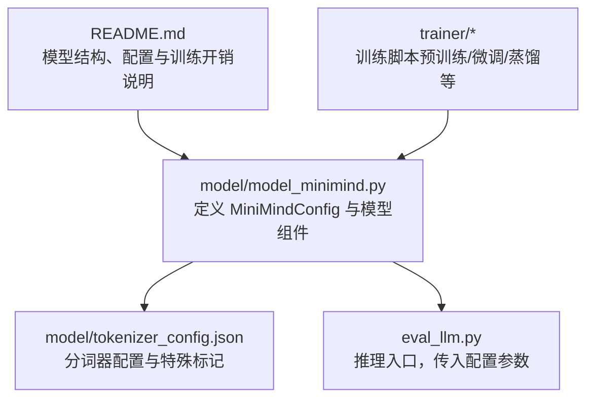
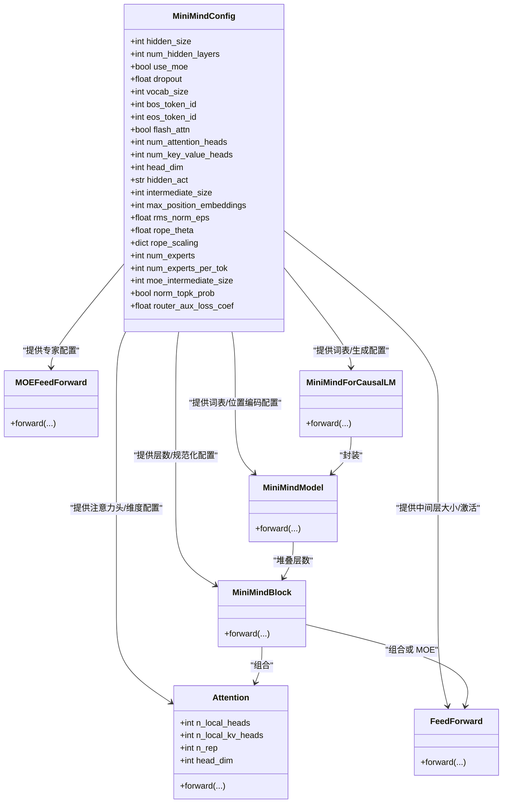
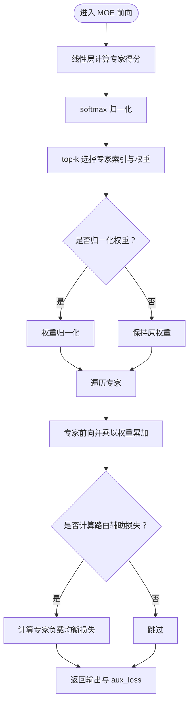
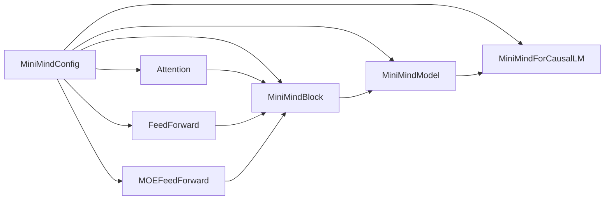

# 模型配置与参数

<cite>
**本文引用的文件**
- [model_minimind.py](file://model/model_minimind.py)
- [README.md](file://README.md)
- [eval_llm.py](file://eval_llm.py)
- [tokenizer_config.json](file://model/tokenizer_config.json)
</cite>

## 目录
1. [引言](#引言)
2. [项目结构](#项目结构)
3. [核心组件](#核心组件)
4. [架构总览](#架构总览)
5. [详细组件分析](#详细组件分析)
6. [依赖关系分析](#依赖关系分析)
7. [性能考量](#性能考量)
8. [故障排查指南](#故障排查指南)
9. [结论](#结论)
10. [附录](#附录)

## 引言
本文件聚焦 MiniMind 模型配置系统，围绕 MiniMindConfig 类的设计理念与参数含义展开，系统阐述隐藏层大小、层数、注意力头数、中间层大小等核心超参数的选择依据；详解 MoE 专家配置参数（num_experts、num_experts_per_tok、moe_intermediate_size）的作用机制；解释 RoPE 旋转位置编码配置、RMSNorm 规范化参数、Flash Attention 开关等高级配置选项；并提供不同规模模型的配置对比与性能影响分析，帮助开发者根据任务需求选择合适的配置参数。

## 项目结构
本项目围绕模型配置与实现集中在 model 目录，训练与推理脚本位于 trainer 与 scripts 目录，README 提供了模型结构、配置与训练开销等背景信息。

图表来源
- [model_minimind.py:10-45](file://model/model_minimind.py#L10-L45)
- [eval_llm.py:14-21](file://eval_llm.py#L14-L21)
- [README.md:557-585](file://README.md#L557-L585)

章节来源
- [model_minimind.py:10-45](file://model/model_minimind.py#L10-L45)
- [README.md:557-585](file://README.md#L557-L585)

## 核心组件
本节聚焦 MiniMindConfig 类及其关键参数，解释每个参数的含义、默认值、计算逻辑与影响范围。

- 基础维度与层数
  - hidden_size：隐藏层维度，默认 768。影响注意力头维度 head_dim 与 FFN 中间层大小 intermediate_size 的计算与整体参数规模。
  - num_hidden_layers：隐藏层数，默认 8。MiniMind-3 主线选择 8 层，兼顾训练效率、稳定性与最终效果。
  - intermediate_size：中间层大小，采用 ceil(hidden_size * π / 64) * 64 的规则计算，确保中间层通道对齐，有利于张量核优化与内存访问效率。
  - dropout：丢弃率，默认 0.0。用于正则化，缓解过拟合。
  - vocab_size：词表大小，默认 6400。词表越小，embedding 与输出投影层参数越少，利于小模型体积控制。
  - bos_token_id/eos_token_id：句子起止标记 ID，默认 1/2。与 tokenizer 配置配合使用。
  - max_position_embeddings：最大位置长度，默认 32768，结合 RoPE/YaRN 支持长上下文。
  - rope_theta：RoPE 基础频率参数，默认 1e6。
  - inference_rope_scaling：是否启用 YaRN 推理外推配置。启用后会注入 rope_scaling 字典，包含 beta_fast、beta_slow、factor、original_max_position_embeddings、attention_factor、type 等字段。
  - rms_norm_eps：RMSNorm 的数值稳定小常数，默认 1e-6。
  - flash_attn：是否启用 Flash Attention（若后端支持），默认 True。在满足条件时走 scaled_dot_product_attention，否则回退到常规注意力实现。

- 注意力头配置
  - num_attention_heads：查询头数，默认 8。
  - num_key_value_heads：键值头数，默认 4。MiniMind 支持分组查询注意力（GQA），n_rep = num_attention_heads / num_key_value_heads。
  - head_dim：每头维度，由 hidden_size / num_attention_heads 计算得到。注意：head_dim 也可显式传入覆盖默认值。

- 激活函数与位置编码
  - hidden_act：FFN 激活函数，默认 'silu'（SwiGLU）。
  - rope_scaling：当 inference_rope_scaling 为 True 时，构造 YaRN 外推参数字典，用于 precompute_freqs_cis 计算频率。

- MoE 专家配置（仅当 use_moe=True 时生效）
  - use_moe：是否启用 MoE，默认 False。
  - num_experts：专家数量，默认 4。
  - num_experts_per_tok：每 token 选择的专家数，默认 1（top-1）。
  - moe_intermediate_size：专家内部 FFN 中间层大小，默认与 dense 相同。
  - norm_topk_prob：是否对 top-k 权重进行归一化，默认 True。
  - router_aux_loss_coef：路由辅助损失系数，默认 5e-4。用于专家负载均衡，缓解“专家饥饿”。

章节来源
- [model_minimind.py:10-45](file://model/model_minimind.py#L10-L45)
- [README.md:557-585](file://README.md#L557-L585)

## 架构总览
MiniMind 的配置与实现遵循“配置驱动 + 模块化组件”的设计。MiniMindConfig 作为统一配置中心，驱动 Attention、FeedForward/MOEFeedForward、MiniMindBlock、MiniMindModel 与 MiniMindForCausalLM 等组件的行为与参数。

图表来源
- [model_minimind.py:10-45](file://model/model_minimind.py#L10-L45)
- [model_minimind.py:90-133](file://model/model_minimind.py#L90-L133)
- [model_minimind.py:135-145](file://model/model_minimind.py#L135-L145)
- [model_minimind.py:147-175](file://model/model_minimind.py#L147-L175)
- [model_minimind.py:177-193](file://model/model_minimind.py#L177-L193)
- [model_minimind.py:195-227](file://model/model_minimind.py#L195-L227)
- [model_minimind.py:229-246](file://model/model_minimind.py#L229-L246)

## 详细组件分析

### MiniMindConfig 参数解析与选择依据
- 隐藏层维度 hidden_size
  - 默认 768，兼顾训练效率与稳定性；在小模型区间，深度往往比宽度更重要，更深的网络能更好学习抽象概念。
  - head_dim = hidden_size / num_attention_heads，确保每头维度合理。
- 层数 num_hidden_layers
  - 默认 8，主线选择 8 层，兼顾训练稳定性与最终效果；MobileLLM 观察显示在固定参数量下，深度通常比宽度更重要。
- 中间层大小 intermediate_size
  - 采用 ceil(hidden_size * π / 64) * 64 的规则，保证通道对齐，有利于张量核优化与内存访问效率。
- 注意力头配置
  - num_attention_heads=8，num_key_value_heads=4，n_rep=2，支持 GQA；在保持计算量可控的同时提升 KV 缓存效率。
  - head_dim 由 hidden_size 与 num_attention_heads 决定，也可显式传入覆盖。
- RoPE 与 YaRN
  - rope_theta=1e6，max_position_embeddings=32768；inference_rope_scaling 控制是否启用 YaRN 外推配置，支持长上下文推理。
- RMSNorm 与 Dropout
  - rms_norm_eps=1e-6，dropout=0.0（默认），用于数值稳定与正则化。
- Flash Attention
  - flash_attn=True，若后端支持 scaled_dot_product_attention，则优先使用，否则回退常规实现。

章节来源
- [model_minimind.py:10-45](file://model/model_minimind.py#L10-L45)
- [README.md:588-612](file://README.md#L588-L612)

### MoE 专家配置机制
- num_experts：专家数量，默认 4。专家越多，模型容量越大，但训练时的 kernel 启停与调度开销显著上升。
- num_experts_per_tok：每 token 选择的专家数，默认 1（top-1）。top-1 路由简单高效，适合小模型与资源受限场景。
- moe_intermediate_size：专家内部 FFN 中间层大小，默认与 dense 相同。可按需增大以提升专家容量。
- norm_topk_prob：是否对 top-k 权重进行归一化，默认 True，保证概率和为 1。
- router_aux_loss_coef：路由辅助损失系数，默认 5e-4，用于专家负载均衡，缓解“专家饥饿”现象。
- 前向流程要点
  - gate 线性层输出专家得分，softmax 后 top-k 选择专家索引与权重；
  - 若 norm_topk_prob=True，则对权重做归一化；
  - 逐个专家前向，按权重累加到输出；
  - 训练时若 router_aux_loss_coef>0，计算专家负载均衡损失并累加到 aux_loss。

图表来源
- [model_minimind.py:147-175](file://model/model_minimind.py#L147-L175)

章节来源
- [model_minimind.py:147-175](file://model/model_minimind.py#L147-L175)
- [README.md:567-570](file://README.md#L567-L570)

### RoPE 旋转位置编码与 YaRN 外推
- 频率计算与 YaRN 外推
  - precompute_freqs_cis 根据 head_dim、max_position_embeddings、rope_theta 与 rope_scaling 计算 cos/sin 频率表；
  - 当 rope_scaling 存在时，按 YaRN 公式对高频部分进行缩放，实现长上下文外推；
  - attention_factor 可调节注意力强度，factor 控制缩放因子，beta_fast/beta_slow 控制线性 ramp 区间。
- 推理时启用 YaRN
  - inference_rope_scaling=True 时，rope_scaling 注入到配置，MiniMindModel 在初始化时注册 freqs_cos/freqs_sin 缓冲区，支持长序列外推。

章节来源
- [model_minimind.py:61-77](file://model/model_minimind.py#L61-L77)
- [model_minimind.py:195-206](file://model/model_minimind.py#L195-L206)

### RMSNorm 规范化参数
- RMSNorm 在注意力与 FFN 前后使用，eps=1e-6，对每个头或通道做归一化，提升训练稳定性与收敛速度。
- Attention 中 q_norm/k_norm 分别对 Q/K 做 RMSNorm，避免数值不稳定。

章节来源
- [model_minimind.py:49-59](file://model/model_minimind.py#L49-L59)
- [model_minimind.py:90-108](file://model/model_minimind.py#L90-L108)

### Flash Attention 开关
- Attention 中通过 flash 标志位判断是否使用 torch.nn.functional.scaled_dot_product_attention；
- 仅在满足 seq_len>1、非因果掩码或无 past_key_value、无 attention_mask 或全 1 时启用，否则回退到常规注意力实现；
- flash_attn 默认 True，可在硬件/后端支持时显著提升吞吐。

章节来源
- [model_minimind.py:108-130](file://model/model_minimind.py#L108-L130)

### 推理入口与配置传入
- eval_llm.py 通过命令行参数传入 hidden_size、num_hidden_layers 等，构造 MiniMindConfig 并加载模型；
- 该入口可用于验证不同配置组合的推理行为与性能。

章节来源
- [eval_llm.py:14-21](file://eval_llm.py#L14-L21)

## 依赖关系分析
MiniMindConfig 作为配置中心，驱动以下组件：
- Attention：依赖 num_attention_heads、num_key_value_heads、head_dim、rms_norm_eps、flash_attn；
- FeedForward/MOEFeedForward：依赖 hidden_size、intermediate_size、hidden_act、use_moe、num_experts、num_experts_per_tok、moe_intermediate_size；
- MiniMindBlock：依赖 hidden_size、rms_norm_eps、use_moe；
- MiniMindModel：依赖 vocab_size、num_hidden_layers、dropout、rms_norm_eps、max_position_embeddings、rope_theta、rope_scaling；
- MiniMindForCausalLM：依赖 vocab_size、hidden_size。

图表来源
- [model_minimind.py:90-133](file://model/model_minimind.py#L90-L133)
- [model_minimind.py:135-145](file://model/model_minimind.py#L135-L145)
- [model_minimind.py:147-175](file://model/model_minimind.py#L147-L175)
- [model_minimind.py:177-193](file://model/model_minimind.py#L177-L193)
- [model_minimind.py:195-227](file://model/model_minimind.py#L195-L227)
- [model_minimind.py:229-246](file://model/model_minimind.py#L229-L246)

章节来源
- [model_minimind.py:90-133](file://model/model_minimind.py#L90-L133)
- [model_minimind.py:135-145](file://model/model_minimind.py#L135-L145)
- [model_minimind.py:147-175](file://model/model_minimind.py#L147-L175)
- [model_minimind.py:177-193](file://model/model_minimind.py#L177-L193)
- [model_minimind.py:195-227](file://model/model_minimind.py#L195-L227)
- [model_minimind.py:229-246](file://model/model_minimind.py#L229-L246)

## 性能考量
- 训练开销与时间估算
  - 单卡 3090 下，minimind-3 与 minimind-3-moe 的预训练与 SFT 时间估算见 README，便于快速感知训练门槛。
- MoE 训练与推理开销
  - README 指出，MoE 训练时 token 先按专家分桶、再分别前向，原生训练时 kernel 启停与调度开销显著上升；当前实现下，4 experts/top-1 的配置约比 dense 慢 50% 左右。
- Flash Attention
  - 在满足条件时可显著提升吞吐；若硬件/后端不支持或掩码复杂，会回退常规实现。
- 词表大小与内存
  - 词表大小 vocab_size=6400，有助于减小 embedding 与输出层参数，适合小模型体积控制。

章节来源
- [README.md:618-647](file://README.md#L618-L647)
- [README.md:567-570](file://README.md#L567-L570)
- [model_minimind.py:108-130](file://model/model_minimind.py#L108-L130)
- [README.md:374-396](file://README.md#L374-L396)

## 故障排查指南
- 推理时长异常
  - 检查 flash_attn 是否为 True 且后端支持；若掩码或 past_key_value 导致回退，可能影响吞吐。
- 长上下文效果不佳
  - 确认 inference_rope_scaling 是否启用；若未启用，YaRN 外推不会生效。
- MoE 训练不稳定或显存占用异常
  - 调整 num_experts、num_experts_per_tok；适当降低 router_aux_loss_coef；确保中间层大小与 head_dim 合理。
- 词表不匹配导致解码异常
  - tokenizer_config.json 中的特殊标记与 bos/eos 设置需与模型配置一致，避免解码错误。

章节来源
- [model_minimind.py:108-130](file://model/model_minimind.py#L108-L130)
- [model_minimind.py:31-38](file://model/model_minimind.py#L31-L38)
- [tokenizer_config.json:1-335](file://model/tokenizer_config.json#L1-L335)

## 结论
MiniMindConfig 以“工程取舍”为核心设计理念：在小模型区间，深度往往比宽度更重要，因此主线选择 8 层与 768 维；通过 GQA、RMSNorm、RoPE/YaRN、Flash Attention 等技术手段在稳定性、效率与长上下文能力之间取得平衡；MoE 专家配置提供容量扩展路径，但需权衡训练开销与路由策略。开发者可据此根据任务需求与资源约束，灵活调整配置参数。

## 附录

### 不同规模模型配置对比与性能影响
- minimind-3（Dense）
  - 参数量：约 64M；层数：8；维度：768；KV 头：4；Q 头：8；最大位置：32768；RoPE theta：1e6。
  - 适合快速复现与入门，训练开销低，推理稳定。
- minimind-3-moe（MoE）
  - 参数量：约 198M / A64M；专家：4；路由：top-1；中间层：与 dense 相同或可调。
  - 容量更大，但训练开销更高；当前实现下约比 dense 慢 50% 左右。
- 历史版本（minimind2 系列）
  - minimind2-small：26M，768 维，8 层，KV 头 2，Q 头 8；
  - minimind2：104M，768 维，16 层，KV 头 2，Q 头 8；
  - minimind2-moe：145M，640 维，8 层，KV 头 2，Q 头 8。

章节来源
- [README.md:577-585](file://README.md#L577-L585)
- [README.md:567-570](file://README.md#L567-L570)