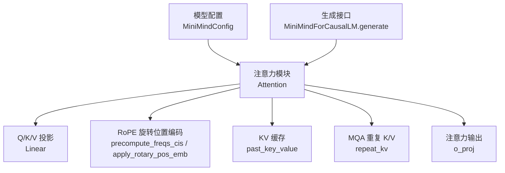
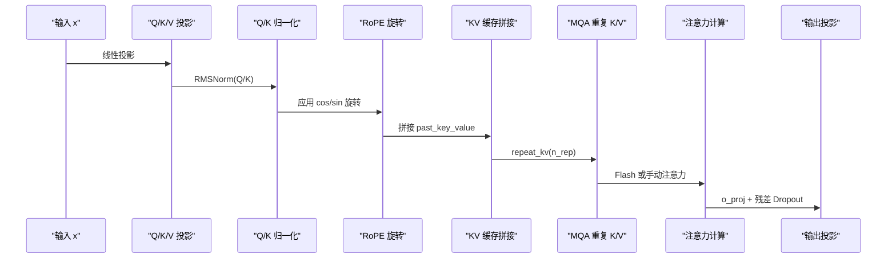
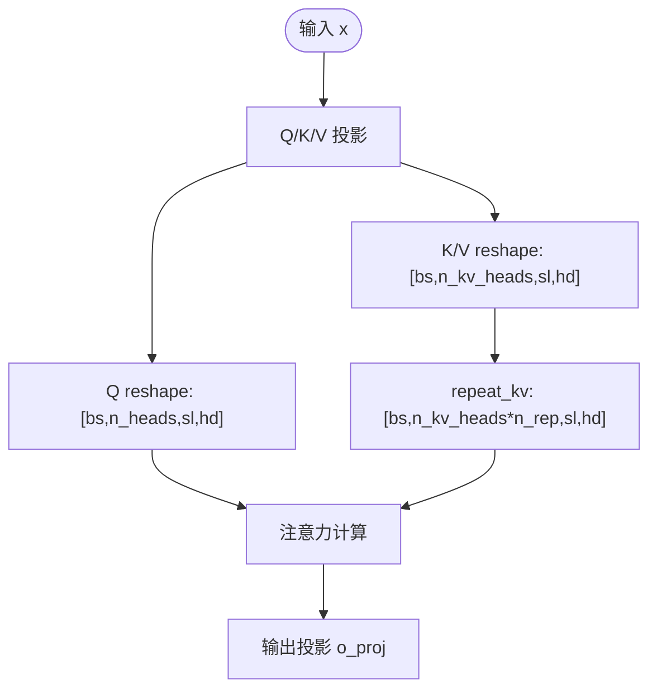
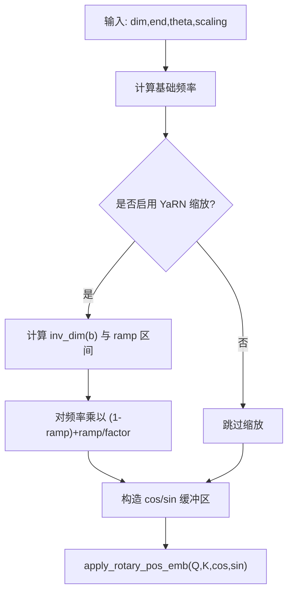
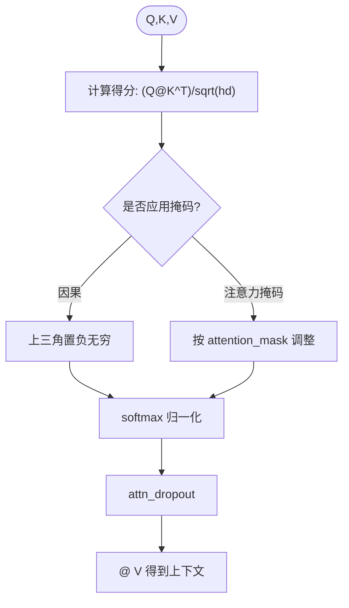
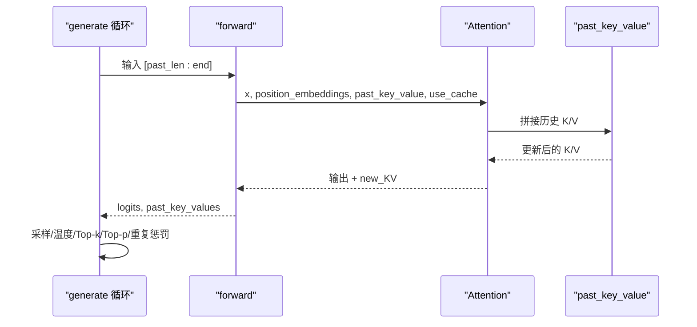
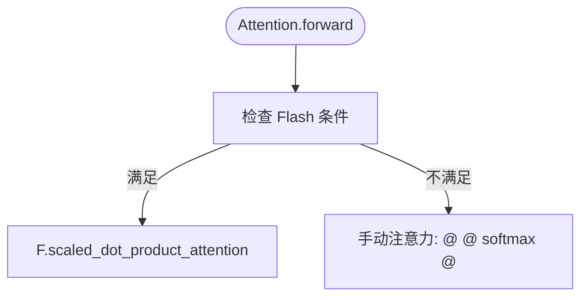
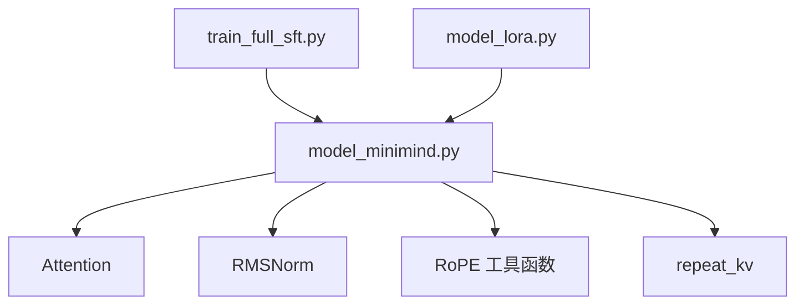

# 注意力机制实现

<cite>
**本文引用的文件**
- [model_minimind.py](file://model/model_minimind.py)
- [README.md](file://README.md)
- [model_lora.py](file://model/model_lora.py)
- [train_full_sft.py](file://trainer/train_full_sft.py)
</cite>

## 目录
1. [引言](#引言)
2. [项目结构](#项目结构)
3. [核心组件](#核心组件)
4. [架构总览](#架构总览)
5. [详细组件分析](#详细组件分析)
6. [依赖分析](#依赖分析)
7. [性能考量](#性能考量)
8. [故障排查指南](#故障排查指南)
9. [结论](#结论)
10. [附录](#附录)

## 引言
本技术文档聚焦 MiniMind 的注意力机制实现，系统阐述 Multi-Query Attention (MQA) 的结构与 KV 缓存策略、RoPE 旋转位置编码及其 YaRN 缩放外推机制、注意力分数计算与 softmax 归一化、dropout 正则化，以及 Flash Attention 优化在推理阶段的应用与性能提升。同时提供注意力权重的可视化与调试建议，帮助开发者理解长序列处理中的注意力表现。

## 项目结构
MiniMind 的注意力实现集中在模型模块中，核心文件为 model/model_minimind.py，配套的 README.md 提供了模型配置、结构与 YaRN 外推等背景信息；LoRA 模块位于 model/model_lora.py，训练脚本位于 trainer/train_full_sft.py，用于验证注意力与位置编码在训练中的协同工作。

图表来源
- [model_minimind.py:90-133](file://model/model_minimind.py#L90-L133)
- [model_minimind.py:61-83](file://model/model_minimind.py#L61-L83)
- [model_minimind.py:85-88](file://model/model_minimind.py#L85-L88)
- [model_minimind.py:249-279](file://model/model_minimind.py#L249-L279)

章节来源
- [model_minimind.py:10-45](file://model/model_minimind.py#L10-L45)
- [README.md:556-570](file://README.md#L556-L570)

## 核心组件
- Multi-Query Attention (MQA)：通过减少 KV 头数，将 Q 头数与 KV 头数解耦，降低 KV 计算与缓存开销。
- RoPE 旋转位置编码：在 Q/K 头内进行旋转，结合 YaRN 缩放策略实现长上下文外推。
- KV 缓存：在自回归生成中复用历史 K/V，避免重复计算。
- Flash Attention：在满足条件时使用 PyTorch 内置 scaled_dot_product_attention，提升吞吐与显存效率。
- Dropout 正则化：在注意力与残差投影阶段应用，缓解过拟合。

章节来源
- [model_minimind.py:90-133](file://model/model_minimind.py#L90-L133)
- [model_minimind.py:61-83](file://model/model_minimind.py#L61-L83)
- [model_minimind.py:85-88](file://model/model_minimind.py#L85-L88)

## 架构总览
注意力模块在前向传播中完成以下关键步骤：
1) 线性投影得到 Q/K/V；
2) RMS 归一化；
3) 应用 RoPE 旋转；
4) 若启用缓存，则拼接历史 K/V；
5) MQA 重复 K/V 头；
6) 选择 Flash Attention 或手动实现注意力；
7) 输出投影与残差 Dropout。

图表来源
- [model_minimind.py:110-133](file://model/model_minimind.py#L110-L133)

## 详细组件分析

### Multi-Query Attention (MQA) 与 Q/K/V 投影
- Q 投影：输出形状为 [bs, seq_len, n_heads * head_dim]，随后 reshape 为 [bs, n_heads, seq_len, head_dim]。
- K/V 投影：输出形状为 [bs, seq_len, n_kv_heads * head_dim]，随后 reshape 为 [bs, n_kv_heads, seq_len, head_dim]。
- MQA 重复：通过 repeat_kv 将 K/V 头重复 n_rep = n_heads / n_kv_heads 次，使 K/V 头数与 Q 对齐，便于注意力计算。

图表来源
- [model_minimind.py:99-102](file://model/model_minimind.py#L99-L102)
- [model_minimind.py:112-115](file://model/model_minimind.py#L112-L115)
- [model_minimind.py:85-88](file://model/model_minimind.py#L85-L88)

章节来源
- [model_minimind.py:90-108](file://model/model_minimind.py#L90-L108)
- [model_minimind.py:112-123](file://model/model_minimind.py#L112-L123)

### RoPE 旋转位置编码与 YaRN 缩放
- 预计算频率：根据维度与 theta 计算频率，若启用 YaRN 缩放，依据 beta_fast/beta_slow/factor/original_max_position_embeddings 计算线性 ramp，对高频维度进行缩放。
- 旋转公式：对 Q/K 的后半通道与前半通道进行旋转，使用 cos/sin 缓冲区。
- YaRN 缩放策略：当上下文长度超出原始最大长度时，对频率进行插值缩放，使高频维度的周期随长度线性变化，提升长序列外推能力。

图表来源
- [model_minimind.py:61-77](file://model/model_minimind.py#L61-L77)
- [model_minimind.py:79-83](file://model/model_minimind.py#L79-L83)

章节来源
- [model_minimind.py:61-77](file://model/model_minimind.py#L61-L77)
- [model_minimind.py:79-83](file://model/model_minimind.py#L79-L83)
- [README.md:140](file://README.md#L140)

### 注意力分数计算、softmax 归一化与掩码
- 分数计算：Q 与 K 的转置相乘，除以 sqrt(head_dim)。
- 掩码：可选因果掩码与 attention_mask，分别对上三角与无效位置施加极大负值。
- 归一化：softmax 归一化，随后乘以 V 得到上下文向量。
- Dropout：在注意力权重上应用，训练时生效。

图表来源
- [model_minimind.py:127-130](file://model/model_minimind.py#L127-L130)

章节来源
- [model_minimind.py:127-130](file://model/model_minimind.py#L127-L130)

### KV 缓存机制与自回归生成
- 缓存拼接：在 past_key_value 存在时，将当前 K/V 与历史 K/V 沿序列维拼接。
- 生成循环：generate 中按步取最后一步 logits，应用温度、top-k/top-p、重复惩罚等采样策略，动态扩展 attention_mask，并可返回 past_key_values 以便继续生成。

图表来源
- [model_minimind.py:119-122](file://model/model_minimind.py#L119-L122)
- [model_minimind.py:249-279](file://model/model_minimind.py#L249-L279)

章节来源
- [model_minimind.py:119-122](file://model/model_minimind.py#L119-L122)
- [model_minimind.py:249-279](file://model/model_minimind.py#L249-L279)

### Flash Attention 优化
- 条件触发：当 seq_len > 1 且未启用因果或 past_key_value 为空，且 attention_mask 全为 1 时，使用 F.scaled_dot_product_attention。
- 性能优势：在满足条件时，显著降低内存峰值与提升吞吐，尤其在长序列与批量推理中。

图表来源
- [model_minimind.py:124-125](file://model/model_minimind.py#L124-L125)

章节来源
- [model_minimind.py:124-125](file://model/model_minimind.py#L124-L125)

### 注意力权重可视化与调试技巧
- 可视化建议：
  - 在 Attention.forward 中临时返回注意力权重（softmax 后）以观察分布。
  - 对不同层、不同头绘制热力图，观察长距离依赖与局部聚焦。
  - 使用 generate 时打印 past_len 与 attention_mask 变化，确认缓存拼接正确。
- 调试要点：
  - 确认 RoPE 缓冲区与 position_embeddings 切片范围匹配 start_pos。
  - 检查 n_rep 与 n_heads/n_kv_heads 的整除关系，避免形状不匹配。
  - 在长序列外推时，验证 YaRN 缩放参数与 original_max_position_embeddings 的一致性。

章节来源
- [model_minimind.py:204-206](file://model/model_minimind.py#L204-L206)
- [model_minimind.py:214](file://model/model_minimind.py#L214)

## 依赖分析
- 模块内依赖：Attention 依赖 RMSNorm、RoPE 辅助函数、repeat_kv 与 torch.nn.functional。
- 训练与推理：训练脚本 train_full_sft.py 使用 MiniMindConfig 初始化模型，验证注意力与位置编码在训练中的协同；LoRA 模块提供参数高效微调能力，不影响注意力核心逻辑。

图表来源
- [model_minimind.py:90-133](file://model/model_minimind.py#L90-L133)
- [train_full_sft.py:116](file://trainer/train_full_sft.py#L116)
- [model_lora.py:21-33](file://model/model_lora.py#L21-L33)

章节来源
- [train_full_sft.py:116](file://trainer/train_full_sft.py#L116)
- [model_lora.py:21-33](file://model/model_lora.py#L21-L33)

## 性能考量
- MQA 降低 KV 计算与缓存开销，适合长序列与多头场景。
- RoPE + YaRN 在不训练的情况下扩展上下文长度，减少外推误差。
- Flash Attention 在满足条件时显著提升吞吐与显存效率。
- 训练脚本支持混合精度与分布式训练，进一步提升吞吐与稳定性。

章节来源
- [README.md:556-570](file://README.md#L556-L570)
- [train_full_sft.py:119-122](file://trainer/train_full_sft.py#L119-L122)

## 故障排查指南
- 形状不匹配：检查 n_rep 是否为整数，确保 n_heads 能被 n_kv_heads 整除。
- RoPE 缓冲区越界：确认 position_embeddings 的切片范围与 start_pos 一致。
- Flash 条件不满足：检查 attention_mask 是否全为 1、past_key_value 是否为空、是否启用因果掩码。
- 生成异常：核对 generate 循环中 past_len 与 attention_mask 的拼接逻辑，确保 past_key_values 返回正确。

章节来源
- [model_minimind.py:96](file://model/model_minimind.py#L96)
- [model_minimind.py:211-214](file://model/model_minimind.py#L211-L214)
- [model_minimind.py:124-125](file://model/model_minimind.py#L124-L125)
- [model_minimind.py:256-259](file://model/model_minimind.py#L256-L259)

## 结论
MiniMind 的注意力实现以 MQA 为核心，结合 RoPE 与 YaRN 缩放策略，有效支撑长序列与自回归生成；在满足条件时启用 Flash Attention，显著提升性能。通过 KV 缓存与生成循环的配合，系统在推理阶段实现了高效、稳定的长文本生成能力。建议在调试与可视化中重点关注 RoPE 缓冲区切片、MQA 重复与 Flash 条件，以确保注意力机制在长序列场景中的稳定与正确性。

## 附录
- 配置要点：hidden_size、num_attention_heads、num_key_value_heads、head_dim、max_position_embeddings、rope_theta、inference_rope_scaling、flash_attn 等。
- 训练与推理：训练脚本支持混合精度、分布式与断点续训；推理接口 generate 支持温度、top-k/top-p、重复惩罚等采样策略。

章节来源
- [model_minimind.py:10-45](file://model/model_minimind.py#L10-L45)
- [train_full_sft.py:83-107](file://trainer/train_full_sft.py#L83-L107)
- [model_minimind.py:249-279](file://model/model_minimind.py#L249-L279)