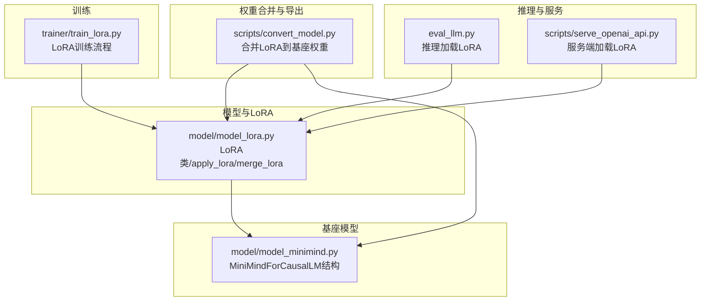
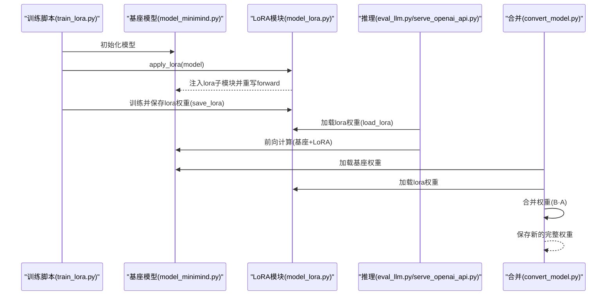
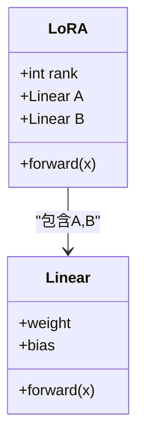
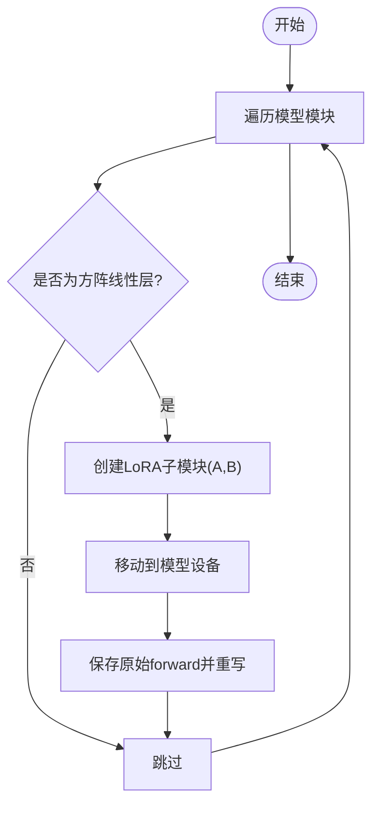
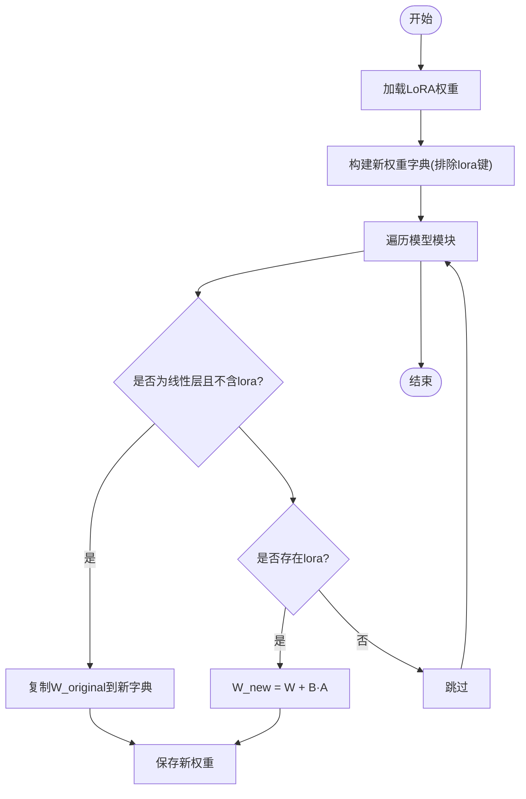
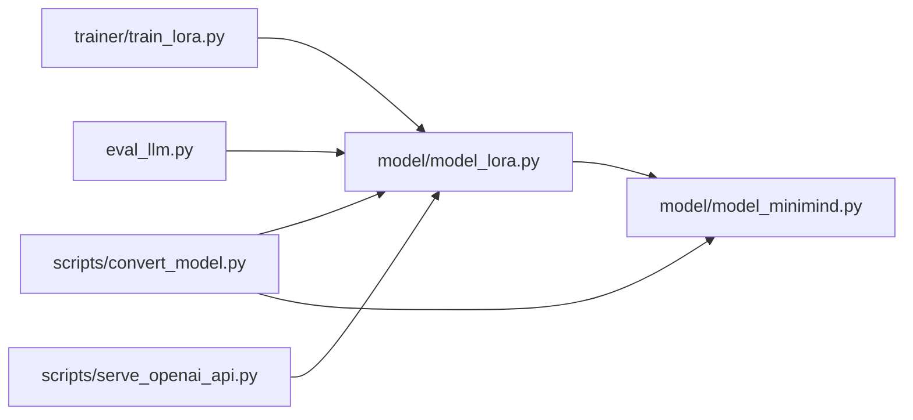

# LoRA 权重合并

<cite>
**本文引用的文件**
- [model_lora.py](file://model/model_lora.py)
- [train_lora.py](file://trainer/train_lora.py)
- [convert_model.py](file://scripts/convert_model.py)
- [eval_llm.py](file://eval_llm.py)
- [serve_openai_api.py](file://scripts/serve_openai_api.py)
- [model_minimind.py](file://model/model_minimind.py)
</cite>

## 目录
1. [引言](#引言)
2. [项目结构](#项目结构)
3. [核心组件](#核心组件)
4. [架构总览](#架构总览)
5. [详细组件分析](#详细组件分析)
6. [依赖关系分析](#依赖关系分析)
7. [性能考量](#性能考量)
8. [故障排查指南](#故障排查指南)
9. [结论](#结论)
10. [附录](#附录)

## 引言
本技术文档聚焦于 LoRA（低秩适配）权重合并的完整实现与原理，围绕以下目标展开：
- 深入解释 LoRA 的数学原理与低秩矩阵初始化策略
- 详述 apply_lora 的工作机制：如何在原线性层上注入 LoRA 子模块并绑定前向函数
- 详述 merge_lora 的核心逻辑：如何将 LoRA 偏移量与基座模型权重相加，得到新的完整权重
- 分析张量操作、设备管理与内存优化策略
- 说明合并后模型结构变化与性能影响
- 提供实际使用示例与常见问题解决方案

## 项目结构
本项目与 LoRA 权重合并相关的代码主要分布在以下模块：
- 模型与 LoRA 实现：model/model_lora.py
- 训练 LoRA：trainer/train_lora.py
- 推理与服务：eval_llm.py、scripts/serve_openai_api.py
- 权重合并与导出：scripts/convert_model.py
- 基座模型结构：model/model_minimind.py

图表来源
- [model_lora.py:1-66](file://model/model_lora.py#L1-L66)
- [train_lora.py:1-184](file://trainer/train_lora.py#L1-L184)
- [eval_llm.py:1-94](file://eval_llm.py#L1-L94)
- [serve_openai_api.py:1-246](file://scripts/serve_openai_api.py#L1-L246)
- [convert_model.py:1-145](file://scripts/convert_model.py#L1-L145)
- [model_minimind.py:1-280](file://model/model_minimind.py#L1-L280)

章节来源
- [model_lora.py:1-66](file://model/model_lora.py#L1-L66)
- [train_lora.py:1-184](file://trainer/train_lora.py#L1-L184)
- [eval_llm.py:1-94](file://eval_llm.py#L1-L94)
- [serve_openai_api.py:1-246](file://scripts/serve_openai_api.py#L1-L246)
- [convert_model.py:1-145](file://scripts/convert_model.py#L1-L145)
- [model_minimind.py:1-280](file://model/model_minimind.py#L1-L280)

## 核心组件
- LoRA 类：定义低秩子模块，包含两个线性层 A 和 B，并提供前向函数
- apply_lora：遍历模型中的线性层，对满足条件的层注入 LoRA 子模块，并重写其前向函数
- load_lora/save_lora：加载/保存 LoRA 权重，支持设备映射与半精度存储
- merge_lora：将 LoRA 偏移量与基座权重合并，生成新的完整权重字典并保存

章节来源
- [model_lora.py:5-18](file://model/model_lora.py#L5-L18)
- [model_lora.py:21-33](file://model/model_lora.py#L21-L33)
- [model_lora.py:35-53](file://model/model_lora.py#L35-L53)
- [model_lora.py:56-65](file://model/model_lora.py#L56-L65)

## 架构总览
LoRA 权重合并的端到端流程如下：
- 训练阶段：在基座模型上应用 LoRA，仅训练新增的低秩参数
- 推理阶段：加载 LoRA 权重并与基座权重共同参与前向计算
- 合并阶段：将 LoRA 偏移量加回到基座权重，得到新的完整权重，便于部署

图表来源
- [train_lora.py:127-130](file://trainer/train_lora.py#L127-L130)
- [model_lora.py:21-33](file://model/model_lora.py#L21-L33)
- [model_lora.py:35-43](file://model/model_lora.py#L35-L43)
- [eval_llm.py:24-26](file://eval_llm.py#L24-L26)
- [serve_openai_api.py:41-43](file://scripts/serve_openai_api.py#L41-L43)
- [convert_model.py:105-112](file://scripts/convert_model.py#L105-L112)

## 详细组件分析

### LoRA 数学原理与初始化
- 低秩矩阵分解：将线性层权重 W 的增量近似为两个低秩矩阵的乘积 ΔW ≈ B·A，其中 A ∈ R^{d×r}，B ∈ R^{r×d}，r ≪ d
- 初始化策略：
  - A：高斯初始化，均值为 0，标准差为 0.02
  - B：全零初始化
- 前向计算：x → W·x + ΔW·x = (W + B·A)·x

图表来源
- [model_lora.py:6-18](file://model/model_lora.py#L6-L18)

章节来源
- [model_lora.py:6-18](file://model/model_lora.py#L6-L18)

### apply_lora 的工作机制
- 遍历模型的所有模块，筛选满足条件的线性层（权重为方阵）
- 为每个符合条件的线性层创建 LoRA 子模块，并将其移动到与模型相同的设备
- 保存原始前向函数，构造新的前向函数：f(x) = original(x) + lora(x)
- 将新前向函数赋给该线性层，实现“参数高效”的叠加

图表来源
- [model_lora.py:21-33](file://model/model_lora.py#L21-L33)

章节来源
- [model_lora.py:21-33](file://model/model_lora.py#L21-L33)

### merge_lora 的核心逻辑
- 加载 LoRA 权重到模型
- 生成新的权重字典：保留非 LoRA 的原始权重
- 对每个线性层：
  - 若存在 LoRA，则将权重更新为：W_new = W_original + B·A
  - 否则保留 W_original
- 保存新的完整权重字典（半精度）

图表来源
- [model_lora.py:56-65](file://model/model_lora.py#L56-L65)

章节来源
- [model_lora.py:56-65](file://model/model_lora.py#L56-L65)

### 推理与服务中的 LoRA 使用
- 推理脚本与服务端脚本在加载基座权重后，调用 apply_lora 注入 LoRA 子模块，再通过 load_lora 加载 LoRA 权重
- 推理时，线性层的前向函数已重写，会自动叠加 LoRA 偏移

章节来源
- [eval_llm.py:24-26](file://eval_llm.py#L24-L26)
- [serve_openai_api.py:41-43](file://scripts/serve_openai_api.py#L41-L43)

### 训练流程中的 LoRA 应用与参数冻结
- 训练脚本在初始化模型后调用 apply_lora
- 统计参数总量与 LoRA 参数占比
- 冻结非 LoRA 参数，仅优化 LoRA 参数

章节来源
- [train_lora.py:127-146](file://trainer/train_lora.py#L127-L146)

## 依赖关系分析
- 训练脚本依赖 model/model_lora.py 的 apply_lora 与 save_lora
- 推理与服务脚本依赖 model/model_lora.py 的 apply_lora 与 load_lora
- 权重合并脚本依赖 model/model_lora.py 的 apply_lora 与 merge_lora，并依赖 model/model_minimind.py 的模型结构

图表来源
- [train_lora.py:18-18](file://trainer/train_lora.py#L18-L18)
- [eval_llm.py:8-8](file://eval_llm.py#L8-L8)
- [serve_openai_api.py:21-21](file://scripts/serve_openai_api.py#L21-L21)
- [convert_model.py:12-12](file://scripts/convert_model.py#L12-L12)
- [model_lora.py:1-66](file://model/model_lora.py#L1-L66)
- [model_minimind.py:229-246](file://model/model_minimind.py#L229-L246)

章节来源
- [train_lora.py:18-18](file://trainer/train_lora.py#L18-L18)
- [eval_llm.py:8-8](file://eval_llm.py#L8-L8)
- [serve_openai_api.py:21-21](file://scripts/serve_openai_api.py#L21-L21)
- [convert_model.py:12-12](file://scripts/convert_model.py#L12-L12)
- [model_lora.py:1-66](file://model/model_lora.py#L1-L66)
- [model_minimind.py:229-246](file://model/model_minimind.py#L229-L246)

## 性能考量
- 计算复杂度
  - 前向阶段：新增一次低秩矩阵乘法 B·A，计算量约为 O(d·r)，r ≪ d
  - 合并阶段：对每个线性层执行一次矩阵乘法并加到原权重，整体复杂度与原模型一致
- 内存优化
  - LoRA 权重以半精度保存，显著降低存储与传输开销
  - 合并后的新权重同样以半精度保存，便于部署
- 设备管理
  - LoRA 子模块与模型在同一设备上，避免设备间拷贝
  - 推理时通过 apply_lora 动态绑定前向函数，无需额外显存
- 训练效率
  - 仅训练少量新增参数，显著降低显存占用与训练时间
  - 训练脚本中冻结非 LoRA 参数，进一步减少优化器状态与反向传播开销

章节来源
- [model_lora.py:45-53](file://model/model_lora.py#L45-L53)
- [model_lora.py:56-65](file://model/model_lora.py#L56-L65)
- [train_lora.py:131-146](file://trainer/train_lora.py#L131-L146)

## 故障排查指南
- 合并后权重无法加载
  - 检查合并脚本是否正确加载 LoRA 权重与基座权重
  - 确认合并逻辑中对线性层的筛选条件与权重键名匹配
- 推理时 LoRA 未生效
  - 确认推理脚本已调用 apply_lora 注入 LoRA 子模块
  - 确认已通过 load_lora 加载正确的 LoRA 权重文件
- 设备不匹配
  - 合并与加载时使用 map_location 指定设备
  - 确保 LoRA 子模块与模型在同一设备上
- 权重形状不匹配
  - 合并时仅对满足“权重为方阵”的线性层进行合并
  - 确认基座模型与 LoRA 权重的键名前缀一致

章节来源
- [model_lora.py:35-43](file://model/model_lora.py#L35-L43)
- [model_lora.py:56-65](file://model/model_lora.py#L56-L65)
- [eval_llm.py:24-26](file://eval_llm.py#L24-L26)
- [serve_openai_api.py:41-43](file://scripts/serve_openai_api.py#L41-L43)

## 结论
本项目实现了从零开始的 LoRA 参数高效微调与权重合并流程。通过低秩矩阵分解与动态前向绑定，实现了在不改变基座模型结构的前提下，以极小的参数量与显存开销完成领域适配。合并流程将 LoRA 偏移量直接加回到基座权重，生成新的完整权重，便于部署与迁移。该实现具有良好的可移植性与可扩展性，适用于多种下游任务与推理场景。

## 附录
- 实际使用示例
  - 训练 LoRA：在训练脚本中调用 apply_lora 注入 LoRA 子模块，仅训练新增参数
  - 推理加载 LoRA：在推理脚本中先 apply_lora，再 load_lora 加载权重
  - 合并 LoRA：在合并脚本中加载基座权重与 LoRA 权重，执行 merge_lora 生成新的完整权重
- 常见问题
  - 合并后权重无法加载：检查键名与设备映射
  - 推理时 LoRA 未生效：确认 apply_lora 与 load_lora 的调用顺序
  - 显存不足：使用半精度保存与推理，或减小 rank 以降低参数量