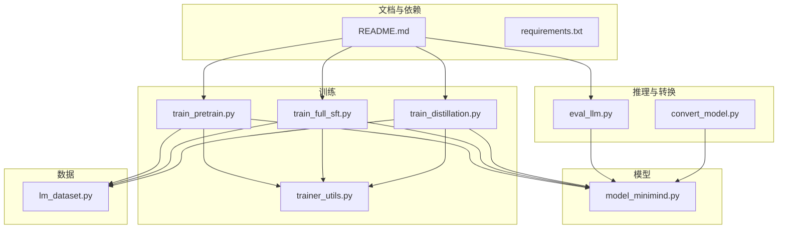
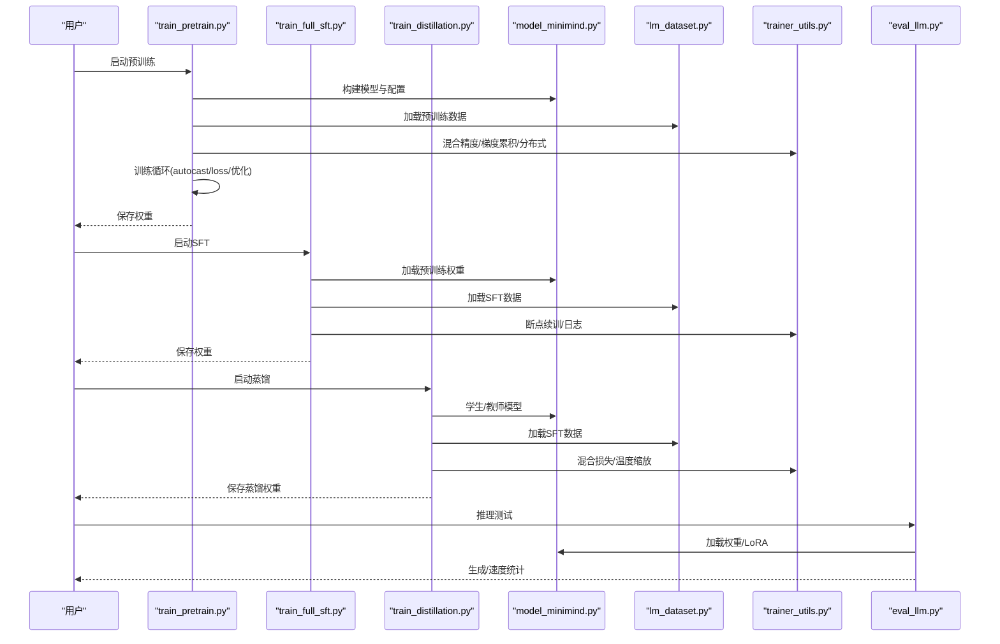
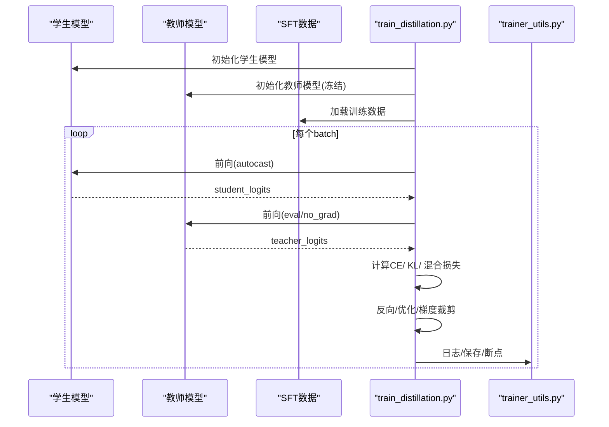
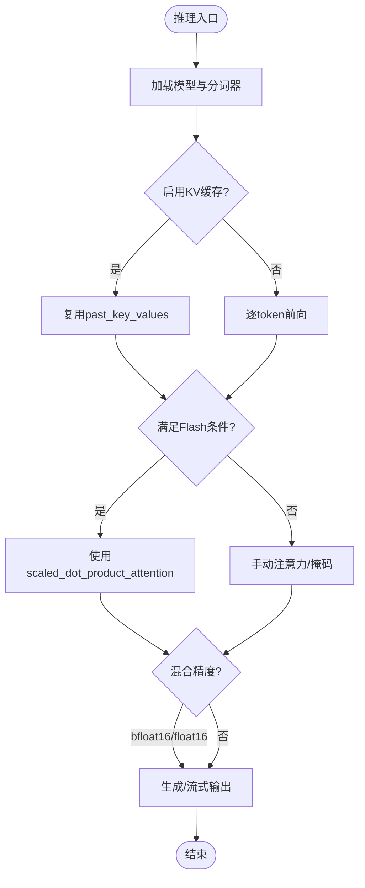
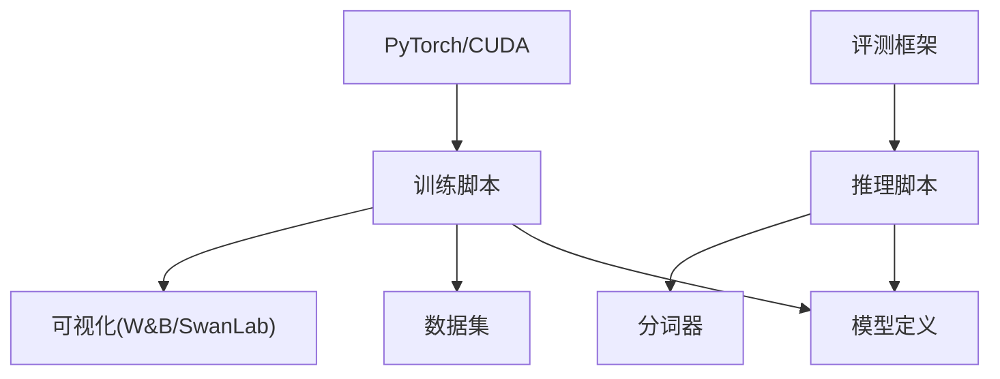

# 性能优化技巧

<cite>
**本文引用的文件**
- [README.md](file://README.md)
- [model_minimind.py](file://model/model_minimind.py)
- [train_distillation.py](file://trainer/train_distillation.py)
- [convert_model.py](file://scripts/convert_model.py)
- [eval_llm.py](file://eval_llm.py)
- [lm_dataset.py](file://dataset/lm_dataset.py)
- [train_pretrain.py](file://trainer/train_pretrain.py)
- [train_full_sft.py](file://trainer/train_full_sft.py)
- [trainer_utils.py](file://trainer/trainer_utils.py)
- [requirements.txt](file://requirements.txt)
</cite>

## 目录
1. [引言](#引言)
2. [项目结构](#项目结构)
3. [核心组件](#核心组件)
4. [架构总览](#架构总览)
5. [详细组件分析](#详细组件分析)
6. [依赖分析](#依赖分析)
7. [性能考量](#性能考量)
8. [故障排查指南](#故障排查指南)
9. [结论](#结论)
10. [附录](#附录)

## 引言
本指南聚焦 MiniMind 在推理与训练阶段的性能优化策略，结合仓库中已实现的技术与工具，系统阐述量化、剪枝、蒸馏与推理加速等关键技术在本项目中的落地方式与效果评估方法。文档特别强调：
- 量化：动态量化与静态量化的实现要点与对比
- 剪枝：结构化剪枝与通道剪枝对模型大小与推理速度的影响
- 蒸馏：知识蒸馏与模型蒸馏的实现与实践
- 推理加速：CUDA 加速、混合精度、KV 缓存与编译优化
- 基准测试：评测流程与关键指标

## 项目结构
MiniMind 采用清晰的分层结构：模型定义在 model/，训练脚本在 trainer/，数据集与工具在 dataset/，推理与转换在 scripts/ 与根目录脚本中。训练脚本普遍支持混合精度、梯度累积、DDP 分布式训练与断点续训。

图表来源
- [model_minimind.py](file://model/model_minimind.py)
- [train_pretrain.py](file://trainer/train_pretrain.py)
- [train_full_sft.py](file://trainer/train_full_sft.py)
- [train_distillation.py](file://trainer/train_distillation.py)
- [lm_dataset.py](file://dataset/lm_dataset.py)
- [trainer_utils.py](file://trainer/trainer_utils.py)
- [eval_llm.py](file://eval_llm.py)
- [convert_model.py](file://scripts/convert_model.py)
- [README.md](file://README.md)
- [requirements.txt](file://requirements.txt)

章节来源
- [README.md](file://README.md)
- [requirements.txt](file://requirements.txt)

## 核心组件
- 模型与注意力实现：MiniMindConfig、Attention、FeedForward、MOEFeedForward、MiniMindModel、MiniMindForCausalLM。模型支持 RMSNorm、RoPE 与 YaRN 外推、Flash Attention 条件路径。
- 训练工具：分布式初始化、LR 调度、断点续训、混合精度缩放器、模型保存与恢复。
- 数据集：PretrainDataset、SFTDataset、DPODataset、RLAIFDataset 等，统一 tokenization 与标签构造。
- 推理与转换：eval_llm 推理入口，convert_model 模型格式转换与 LoRA 合并。

章节来源
- [model_minimind.py](file://model/model_minimind.py)
- [trainer_utils.py](file://trainer/trainer_utils.py)
- [lm_dataset.py](file://dataset/lm_dataset.py)
- [eval_llm.py](file://eval_llm.py)
- [convert_model.py](file://scripts/convert_model.py)

## 架构总览
MiniMind 的训练与推理路径如下：

图表来源
- [train_pretrain.py](file://trainer/train_pretrain.py)
- [train_full_sft.py](file://trainer/train_full_sft.py)
- [train_distillation.py](file://trainer/train_distillation.py)
- [model_minimind.py](file://model/model_minimind.py)
- [lm_dataset.py](file://dataset/lm_dataset.py)
- [trainer_utils.py](file://trainer/trainer_utils.py)
- [eval_llm.py](file://eval_llm.py)

## 详细组件分析

### 量化技术：动态量化与静态量化
- 动态量化（权值/激活动态范围感知）
  - 在推理阶段，可将权重与激活张量降为低比特（如 int8/uint8），在运行时动态计算缩放因子与零点，以降低显存与带宽占用，同时保持较高精度。
  - 在 MiniMind 中，可结合推理脚本与第三方推理引擎（如 llama.cpp、vLLM、Ollama）对权重进行动态量化转换与部署。
- 静态量化（离线校准）
  - 在离线阶段对代表性数据集进行校准，确定激活统计分布（均值/方差/分位点），随后将浮点算子替换为定点算子，显著降低推理延迟与内存占用。
  - 适用于批量推理与边缘部署场景，建议配合 KV 缓存与 Flash Attention 使用以获得最佳吞吐。

效果对比
- 动态量化：部署更灵活，精度损失可控，适合在线推理与多场景适配。
- 静态量化：吞吐更高、内存更低，但对校准数据与部署环境敏感。

说明
- 本仓库未直接提供 PyTorch 动态/静态量化的实现代码，但可通过推理脚本与第三方生态完成部署与评估。

章节来源
- [README.md](file://README.md)
- [eval_llm.py](file://eval_llm.py)

### 剪枝技术：结构化剪枝与通道剪枝
- 结构化剪枝
  - 基于权重幅度或重要性度量，对注意力头、FFN 模块或专家进行整块移除，保持张量形状规整，有利于推理引擎的内核融合与缓存命中。
  - 在 MiniMind 的 MoE 结构中，可对专家或路由权重进行结构化剪枝，降低激活参数与前向开销。
- 通道剪枝
  - 对 FFN/注意力的通道维度进行裁剪，减少乘加运算次数，提升吞吐；需注意通道间依赖与层内一致性，避免精度大幅回退。
  - 建议与通道重排、低秩近似联合使用，以维持表达能力。

影响评估
- 模型大小：剪枝后参数量下降，显存占用与磁盘占用显著降低。
- 推理速度：在 GPU/TPU 上通常提升吞吐；在 CPU 上需关注缓存局部性与算子融合。

章节来源
- [model_minimind.py](file://model/model_minimind.py)
- [README.md](file://README.md)

### 蒸馏技术：知识蒸馏与模型蒸馏
- 知识蒸馏（黑盒）
  - 以教师模型的输出作为软标签，学生模型学习教师的偏好分布与风格，损失函数通常为交叉熵与 KL 散度的加权组合。
  - 在 MiniMind 中，蒸馏脚本实现了 CE + KL 的混合损失、温度缩放与 MoE/密集组合蒸馏。
- 模型蒸馏（白盒）
  - 利用教师模型输出层的 token 分布偏好，对齐学生模型的分布，进一步提升细节一致性与稳定性。

实现要点
- 温度缩放：提高温度以平滑教师分布，缓解学生模型过拟合。
- 混合损失：alpha 控制 CE 与 KL 的比重，平衡拟合与泛化。
- 断点续训：支持分布式训练与检查点恢复，保障长时训练稳定性。

图表来源
- [train_distillation.py](file://trainer/train_distillation.py)
- [lm_dataset.py](file://dataset/lm_dataset.py)
- [trainer_utils.py](file://trainer/trainer_utils.py)

章节来源
- [train_distillation.py](file://trainer/train_distillation.py)
- [README.md](file://README.md)

### 推理加速：CUDA 加速、混合精度与内存优化
- CUDA 加速
  - 使用 torch.cuda.is_available() 检测 GPU 可用性；在多卡环境下使用 DDP；通过 torch.compile 提升内核融合与算子效率。
- 混合精度
  - 训练与推理均支持 bfloat16/float16，结合 GradScaler 防止梯度下溢；推理时可将权重半精度化以降低显存占用。
- 内存优化
  - KV 缓存：MiniMind 的注意力实现支持 past_key_values 缓存，减少重复计算；推理脚本默认启用 use_cache。
  - Flash Attention：在满足条件时使用 scaled_dot_product_attention，减少显存峰值与算子开销。
  - 梯度累积：通过 accumulation_steps 减少显存占用，换取训练步数增加。
  - 数据加载：pin_memory、num_workers 与 SkipBatchSampler 提升 IO 与批采样效率。

图表来源
- [model_minimind.py](file://model/model_minimind.py)
- [eval_llm.py](file://eval_llm.py)
- [train_full_sft.py](file://trainer/train_full_sft.py)
- [train_pretrain.py](file://trainer/train_pretrain.py)

章节来源
- [model_minimind.py](file://model/model_minimind.py)
- [eval_llm.py](file://eval_llm.py)
- [train_full_sft.py](file://trainer/train_full_sft.py)
- [train_pretrain.py](file://trainer/train_pretrain.py)
- [trainer_utils.py](file://trainer/trainer_utils.py)

### 性能基准测试与评估指标
- 基准测试
  - 使用 lm-evaluation-harness 对模型进行多任务评测（如 C-Eval、CMMLU、ARC-Easy、PIQA、OpenBookQA、HellaSwag、Social IQa 等），支持 apply_chat_template 与多设备评测。
- 关键指标
  - 速度：每秒生成 token 数（tokens/s）、端到端延迟、吞吐（samples/s）
  - 质量：困惑度（PPL）、多选题准确率、任务特定指标
  - 资源：显存占用峰值、模型大小（参数量/权重文件大小）、推理时延分布
- 评估流程
  - 准备评测数据与评测框架
  - 选择合适的数据集与任务
  - 在相同硬件与精度条件下对比不同优化策略（如蒸馏、剪枝、量化）的效果
  - 记录并对比速度与质量指标，形成可复现的报告

章节来源
- [README.md](file://README.md)

## 依赖分析
- 训练与推理依赖
  - PyTorch 与 CUDA（GPU 加速）
  - Transformers、TRFLib（模型与分词器生态）
  - SwanLab/W&B（训练可视化）
  - 数据处理与评测工具（datasets、lm-evaluation-harness）

图表来源
- [requirements.txt](file://requirements.txt)
- [trainer_utils.py](file://trainer/trainer_utils.py)
- [eval_llm.py](file://eval_llm.py)

章节来源
- [requirements.txt](file://requirements.txt)

## 性能考量
- 训练阶段
  - 使用混合精度与梯度累积平衡显存与收敛速度；分布式训练时注意同步与梯度裁剪。
  - 断点续训与检查点保存确保长时训练稳定性。
- 推理阶段
  - 启用 KV 缓存与 Flash Attention；在支持的硬件上使用 torch.compile；半精度推理降低显存占用。
  - 对于长文本，YaRN/RoPE 外推可改善长序列性能，但需关注 PPL 与稳定性。

## 故障排查指南
- CUDA 不可用或显存不足
  - 检查 torch.cuda.is_available()；尝试减小 batch size、启用梯度累积、关闭不必要的可视化。
- 分布式训练异常
  - 确认 NCCL 环境变量与后端；检查 LOCAL_RANK 与设备绑定；必要时禁用 DDP 或降低并行度。
- 推理速度慢
  - 检查是否启用 KV 缓存与 Flash Attention；确认混合精度与 dtype；评估数据加载与 pin_memory。
- 蒸馏效果不佳
  - 调整温度与 alpha；确保教师模型权重与学生模型结构匹配；检查断点续训与学习率调度。

章节来源
- [trainer_utils.py](file://trainer/trainer_utils.py)
- [README.md](file://README.md)

## 结论
MiniMind 在训练与推理两端均提供了可扩展的性能优化路径：蒸馏与剪枝用于压缩模型规模与提升效率，量化与混合精度用于降低资源消耗，KV 缓存与 Flash Attention 用于加速推理。结合断点续训与评测体系，可在保证质量的前提下实现高效、稳定的模型训练与部署。

## 附录
- 推理与转换
  - 推理脚本支持 Transformers 与原生权重加载，可选启用 YaRN 外推与 LoRA 合并。
  - 转换脚本支持将原生权重转换为 Transformers 格式，便于对接生态工具链。

章节来源
- [eval_llm.py](file://eval_llm.py)
- [convert_model.py](file://scripts/convert_model.py)