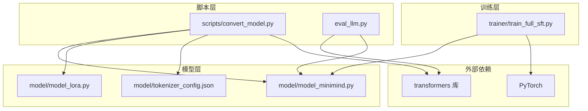
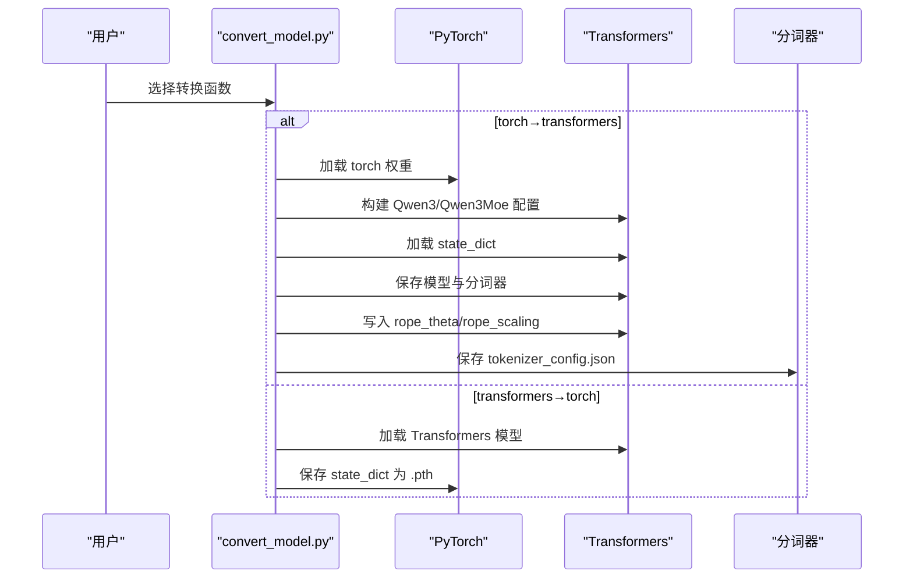
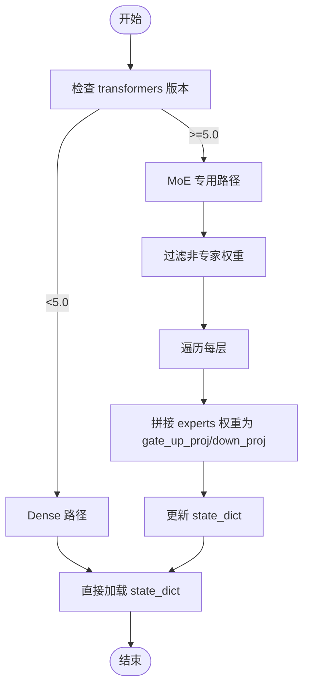
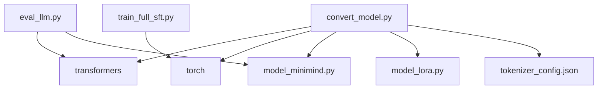

# 模型格式转换

<cite>
**本文引用的文件**
- [convert_model.py](file://scripts/convert_model.py)
- [model_minimind.py](file://model/model_minimind.py)
- [model_lora.py](file://model/model_lora.py)
- [tokenizer_config.json](file://model/tokenizer_config.json)
- [README.md](file://README.md)
- [requirements.txt](file://requirements.txt)
- [eval_llm.py](file://eval_llm.py)
- [train_full_sft.py](file://trainer/train_full_sft.py)
</cite>

## 目录
1. [简介](#简介)
2. [项目结构](#项目结构)
3. [核心组件](#核心组件)
4. [架构概览](#架构概览)
5. [详细组件分析](#详细组件分析)
6. [依赖分析](#依赖分析)
7. [性能考量](#性能考量)
8. [故障排查指南](#故障排查指南)
9. [结论](#结论)
10. [附录](#附录)

## 简介
本指南聚焦于 MiniMind 模型格式转换，涵盖从 PyTorch 原生权重到 Transformers 格式的双向转换，重点说明：
- 配置文件映射与兼容性处理（rope_theta、rope_scaling、tokenizer_class）
- 权重对齐与 MoE 架构的特殊处理
- 不同模型架构（Dense 与 MoE）的转换差异
- 完整转换命令与参数说明（dtype、设备选择）
- 转换后模型验证与性能测试方法

## 项目结构
与模型转换相关的文件与职责：
- scripts/convert_model.py：提供 torch ↔ transformers 双向转换、LoRA 合并、模板转换等工具函数
- model/model_minimind.py：MiniMindConfig、MiniMindForCausalLM、Attention、FeedForward、MOEFeedForward 等核心实现
- model/model_lora.py：LoRA 结构、apply_lora、merge_lora 等 LoRA 相关工具
- model/tokenizer_config.json：分词器配置（包含 chat_template、特殊 token 等）
- trainer/train_full_sft.py：训练脚本，展示权重保存与 dtype 使用
- eval_llm.py：推理脚本，演示如何加载转换后的模型
- README.md：项目说明与模型转换相关说明

图表来源
- [convert_model.py:1-145](file://scripts/convert_model.py#L1-L145)
- [model_minimind.py:1-280](file://model/model_minimind.py#L1-L280)
- [model_lora.py:1-66](file://model/model_lora.py#L1-L66)
- [tokenizer_config.json:1-335](file://model/tokenizer_config.json#L1-L335)
- [eval_llm.py:1-94](file://eval_llm.py#L1-L94)
- [train_full_sft.py:1-171](file://trainer/train_full_sft.py#L1-L171)

章节来源
- [convert_model.py:1-145](file://scripts/convert_model.py#L1-L145)
- [model_minimind.py:1-280](file://model/model_minimind.py#L1-L280)
- [model_lora.py:1-66](file://model/model_lora.py#L1-L66)
- [tokenizer_config.json:1-335](file://model/tokenizer_config.json#L1-L335)
- [eval_llm.py:1-94](file://eval_llm.py#L1-L94)
- [train_full_sft.py:1-171](file://trainer/train_full_sft.py#L1-L171)

## 核心组件
- 转换脚本 convert_model.py
  - 提供 torch2transformers、torch2transformers_minimind、transformers2torch、merge_lora、模板转换等函数
  - 自动处理 rope_theta、rope_scaling、tokenizer_class 等配置兼容
- MiniMind 模型与配置 model_minimind.py
  - MiniMindConfig：定义模型超参（hidden_size、num_hidden_layers、use_moe、rope_theta、rope_scaling 等）
  - MiniMindForCausalLM：基于 MiniMindConfig 的因果语言模型
  - Attention、FeedForward、MOEFeedForward：注意力、FFN、MoE FFN 实现
- LoRA 工具 model_lora.py
  - LoRA 模块、apply_lora、merge_lora：LoRA 权重注入与合并
- 分词器配置 tokenizer_config.json
  - chat_template、special tokens、tokenizer_class 等
- 训练与推理脚本
  - train_full_sft.py：展示权重保存与 dtype 使用
  - eval_llm.py：演示加载转换后模型进行推理

章节来源
- [convert_model.py:16-96](file://scripts/convert_model.py#L16-L96)
- [model_minimind.py:10-45](file://model/model_minimind.py#L10-L45)
- [model_lora.py:5-66](file://model/model_lora.py#L5-L66)
- [tokenizer_config.json:1-335](file://model/tokenizer_config.json#L1-L335)
- [train_full_sft.py:83-107](file://trainer/train_full_sft.py#L83-L107)
- [eval_llm.py:12-31](file://eval_llm.py#L12-L31)

## 架构概览
转换流程分为两条主线：
- 原生 PyTorch 权重 → Transformers 格式
  - 通过 convert_torch2transformers 或 convert_torch2transformers_minimind
  - 自动注册 AutoClass，加载 state_dict，保存为 Transformers 格式
  - 写入 rope_theta，删除 rope_parameters，修正 tokenizer_class
- Transformers 格式 → 原生 PyTorch 权重
  - 通过 convert_transformers2torch
  - 从 pretrained 模型加载 state_dict，保存为 .pth

图表来源
- [convert_model.py:16-96](file://scripts/convert_model.py#L16-L96)

章节来源
- [convert_model.py:16-96](file://scripts/convert_model.py#L16-L96)

## 详细组件分析

### 配置映射与兼容性处理
- rope_theta 与 rope_scaling
  - 转换后 config.json 中设置 rope_theta = lm_config.rope_theta，rope_scaling = None，并删除 rope_parameters
  - 适用于 YaRN 外推配置的清理与标准化
- tokenizer_class
  - 写入 tokenizer_config.json，确保使用 PreTrainedTokenizerFast
- 分词器模板
  - 保存 tokenizer 与 chat_template，支持 jinja 与 JSON 互转

章节来源
- [convert_model.py:29-36](file://scripts/convert_model.py#L29-L36)
- [convert_model.py:89-96](file://scripts/convert_model.py#L89-L96)
- [tokenizer_config.json:317-335](file://model/tokenizer_config.json#L317-L335)

### 权重对齐与加载
- torch→transformers
  - 读取 torch.load，按配置构建 Qwen3/Qwen3Moe 模型，load_state_dict(strict=True/False)
  - 保存为 Transformers 格式，包含 config.json、tokenizer_config.json、vocab 等
- transformers→torch
  - 从 AutoModelForCausalLM.from_pretrained 加载，保存为 .pth（半精度）

章节来源
- [convert_model.py:20-26](file://scripts/convert_model.py#L20-L26)
- [convert_model.py:81-87](file://scripts/convert_model.py#L81-L87)
- [convert_model.py:99-102](file://scripts/convert_model.py#L99-L102)

### 不同模型架构（Dense 与 MoE）的转换差异
- Dense 架构
  - 使用 Qwen3Config/Qwen3ForCausalLM
  - 保持 state_dict 结构不变
- MoE 架构
  - 使用 Qwen3MoeConfig/Qwen3MoeForCausalLM
  - 在 transformers>=5.0 时，对 experts 权重进行重排：将每个层的 experts 拼接为 gate_up_proj/down_proj/down_proj 的堆叠
  - 仅保留 gate.weight，过滤掉专家层中的非 gate 权重

图表来源
- [convert_model.py:72-79](file://scripts/convert_model.py#L72-L79)

章节来源
- [convert_model.py:56-71](file://scripts/convert_model.py#L56-L71)
- [convert_model.py:72-79](file://scripts/convert_model.py#L72-L79)

### MiniMind 特定格式到标准格式的转换
- rope_theta 参数调整
  - 将 rope_theta 写入 config.json，确保与 MiniMindConfig.rope_theta 一致
- rope_scaling 处理
  - 将 rope_scaling 设置为 None，删除 rope_parameters，避免与标准格式冲突
- tokenizer_class 修正
  - 写入 tokenizer_config.json，确保 tokenizer_class 为 PreTrainedTokenizerFast

章节来源
- [convert_model.py:30-35](file://scripts/convert_model.py#L30-L35)
- [convert_model.py:89-95](file://scripts/convert_model.py#L89-L95)

### LoRA 合并与基模权重导出
- apply_lora：在原有权重矩阵上注入低秩增量
- merge_lora：将 LoRA 增量合并到线性层权重中，保存为新的 .pth 文件
- 适用于将 LoRA 权重合并到基模，导出为标准 PyTorch 格式

章节来源
- [model_lora.py:21-33](file://model/model_lora.py#L21-L33)
- [model_lora.py:56-66](file://model/model_lora.py#L56-L66)
- [convert_model.py:105-112](file://scripts/convert_model.py#L105-L112)

### 转换命令与参数说明
- 基本命令
  - torch→transformers：调用 convert_torch2transformers 或 convert_torch2transformers_minimind
  - transformers→torch：调用 convert_transformers2torch
  - 合并 LoRA：调用 convert_merge_base_lora
  - 模板转换：convert_jinja_to_json / convert_json_to_jinja
- 关键参数
  - dtype：支持 torch.float16、torch.bfloat16（在训练脚本中使用）
  - 设备：自动选择 cuda 或 cpu
  - rope_theta：来自 MiniMindConfig
  - rope_scaling：转换后设为 None，删除 rope_parameters
- 示例路径
  - torch→transformers：[convert_torch2transformers:40-96](file://scripts/convert_model.py#L40-L96)
  - transformers→torch：[convert_transformers2torch:99-102](file://scripts/convert_model.py#L99-L102)
  - 合并 LoRA：[convert_merge_base_lora:105-112](file://scripts/convert_model.py#L105-L112)

章节来源
- [convert_model.py:16-145](file://scripts/convert_model.py#L16-L145)
- [train_full_sft.py:91-92](file://trainer/train_full_sft.py#L91-L92)

### 转换后模型验证与性能测试
- 验证方法
  - 使用 eval_llm.py 加载转换后的模型，进行推理测试
  - 支持加载 Transformers 格式模型（trust_remote_code=True）
- 性能测试
  - 通过 eval_llm.py 的生成速度统计 tokens/s
  - 可调整 temperature、top_p、max_new_tokens 等参数评估不同设置下的性能

章节来源
- [eval_llm.py:12-31](file://eval_llm.py#L12-L31)
- [eval_llm.py:80-91](file://eval_llm.py#L80-L91)

## 依赖分析
- 外部依赖
  - transformers：提供 AutoTokenizer、AutoModelForCausalLM、Qwen3Config/Qwen3MoeConfig 等
  - torch：权重加载、保存、dtype 转换
- 内部依赖
  - model_minimind：MiniMindConfig、MiniMindForCausalLM
  - model_lora：LoRA 注入与合并
  - tokenizer_config.json：分词器配置与模板

图表来源
- [convert_model.py:1-14](file://scripts/convert_model.py#L1-L14)
- [model_minimind.py:1-6](file://model/model_minimind.py#L1-L6)
- [model_lora.py:1-3](file://model/model_lora.py#L1-L3)
- [tokenizer_config.json:1-5](file://model/tokenizer_config.json#L1-L5)
- [eval_llm.py:1-10](file://eval_llm.py#L1-L10)
- [train_full_sft.py:1-18](file://trainer/train_full_sft.py#L1-L18)

章节来源
- [requirements.txt:1-32](file://requirements.txt#L1-L32)

## 性能考量
- dtype 选择
  - float16/bfloat16 可显著降低显存占用，提升吞吐
  - 训练脚本中 dtype 与 autocast 配合使用，推理脚本中使用 half()
- 设备选择
  - 自动优先使用 cuda，否则回退到 cpu
- MoE 权重拼接
  - transformers>=5.0 时对 experts 权重进行拼接，避免逐层专家展开导致的性能下降
- 推理速度
  - 通过 eval_llm.py 的生成速度统计 tokens/s，便于对比不同设置的性能

章节来源
- [train_full_sft.py:119-122](file://trainer/train_full_sft.py#L119-L122)
- [eval_llm.py:30-31](file://eval_llm.py#L30-L31)
- [convert_model.py:72-79](file://scripts/convert_model.py#L72-L79)

## 故障排查指南
- 权重加载失败
  - 检查 state_dict 键名是否与目标模型匹配（MoE 时需注意 experts 权重拼接）
  - 确认 use_moe 与模型配置一致
- rope_scaling 异常
  - 转换后 config.json 中 rope_scaling 应为 None，rope_parameters 已删除
- 分词器不兼容
  - 确保 tokenizer_config.json 中 tokenizer_class 为 PreTrainedTokenizerFast
- 推理报错
  - 使用 trust_remote_code=True 加载 Transformers 格式模型
  - 检查设备与 dtype 设置是否一致

章节来源
- [convert_model.py:30-35](file://scripts/convert_model.py#L30-L35)
- [convert_model.py:89-95](file://scripts/convert_model.py#L89-L95)
- [eval_llm.py:28-29](file://eval_llm.py#L28-L29)

## 结论
本指南系统梳理了 MiniMind 从 PyTorch 原生权重到 Transformers 格式的转换流程，重点覆盖配置映射、权重对齐、MoE 特殊处理、rope_theta/rope_scaling 兼容性、LoRA 合并与模板转换，并提供了验证与性能测试方法。遵循本文档的步骤与参数说明，可稳定完成格式转换并在主流生态中使用转换后的模型。

## 附录
- 相关文件与路径
  - 转换脚本：[convert_model.py:1-145](file://scripts/convert_model.py#L1-L145)
  - 模型实现：[model_minimind.py:1-280](file://model/model_minimind.py#L1-L280)
  - LoRA 工具：[model_lora.py:1-66](file://model/model_lora.py#L1-L66)
  - 分词器配置：[tokenizer_config.json:1-335](file://model/tokenizer_config.json#L1-L335)
  - 训练脚本：[train_full_sft.py:1-171](file://trainer/train_full_sft.py#L1-L171)
  - 推理脚本：[eval_llm.py:1-94](file://eval_llm.py#L1-L94)
  - 项目说明：[README.md:1608-1613](file://README.md#L1608-L1613)