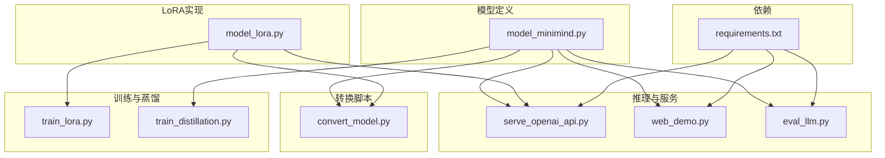
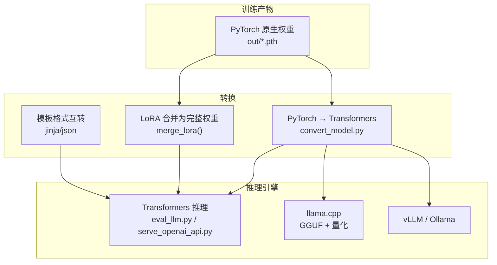
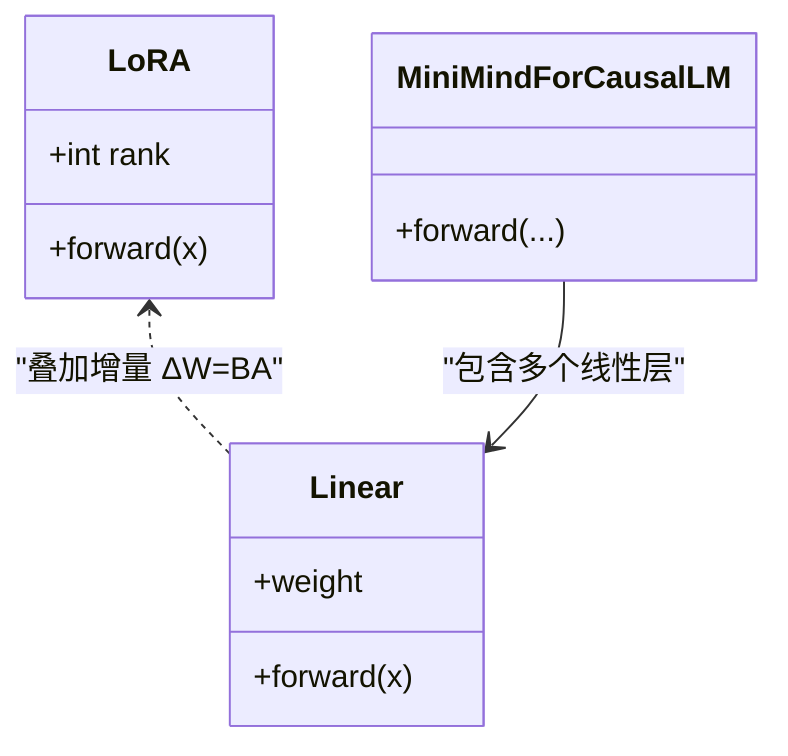
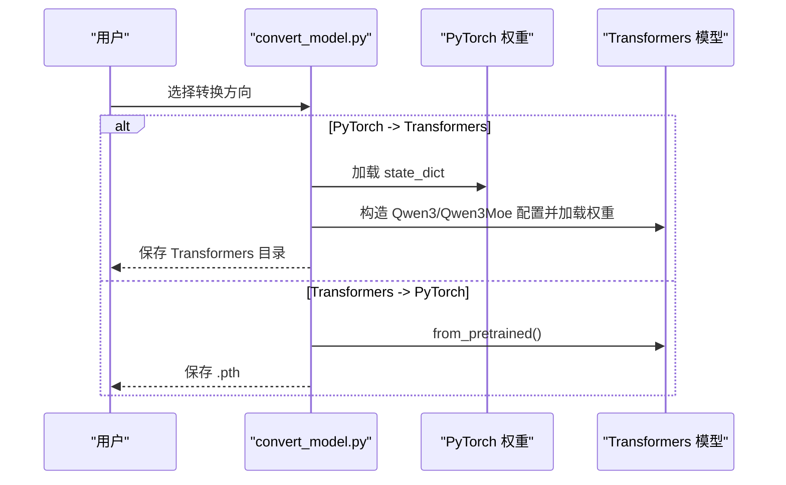
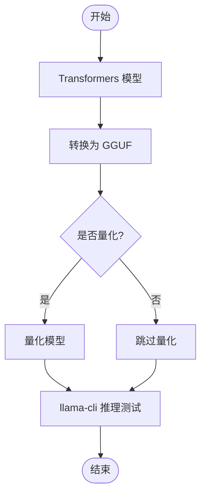
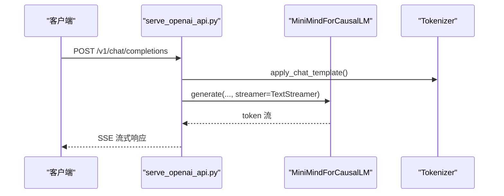
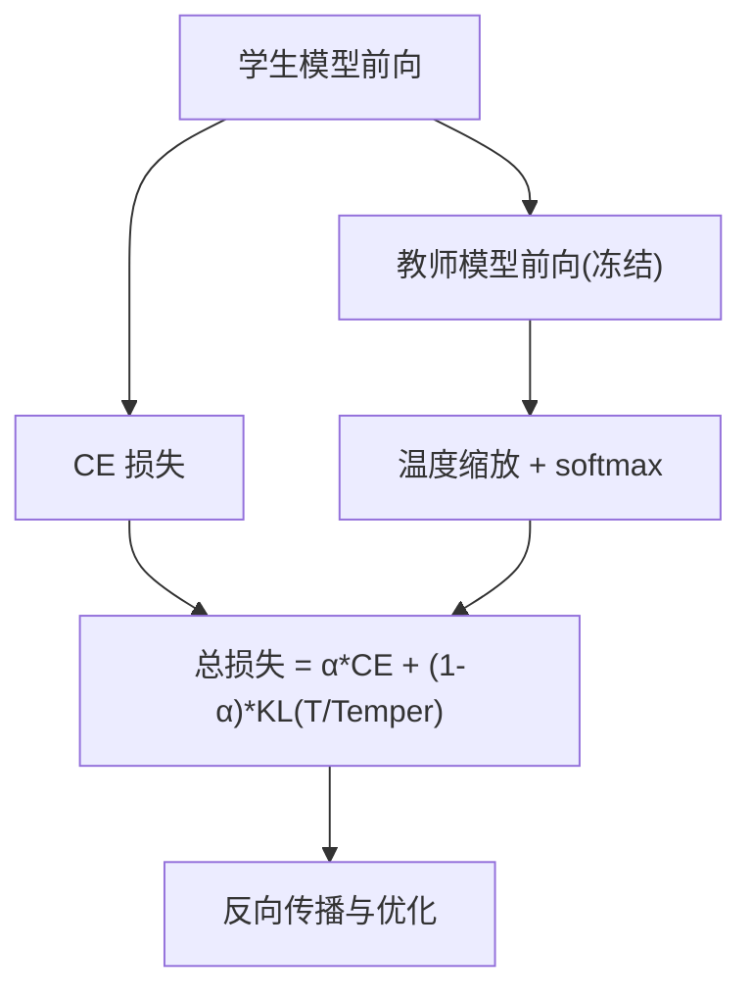
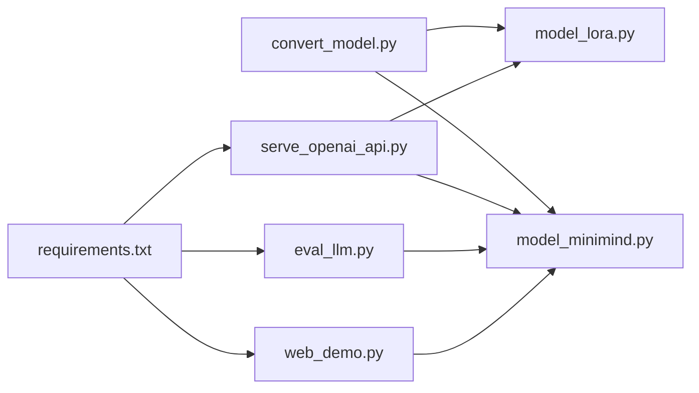

# 模型转换与部署

<cite>
**本文引用的文件**
- [README.md](file://README.md)
- [README_en.md](file://README_en.md)
- [requirements.txt](file://requirements.txt)
- [model/model_minimind.py](file://model/model_minimind.py)
- [model/model_lora.py](file://model/model_lora.py)
- [model/tokenizer_config.json](file://model/tokenizer_config.json)
- [scripts/convert_model.py](file://scripts/convert_model.py)
- [scripts/serve_openai_api.py](file://scripts/serve_openai_api.py)
- [scripts/web_demo.py](file://scripts/web_demo.py)
- [eval_llm.py](file://eval_llm.py)
- [trainer/train_lora.py](file://trainer/train_lora.py)
- [trainer/train_distillation.py](file://trainer/train_distillation.py)
</cite>

## 目录
1. [引言](#引言)
2. [项目结构](#项目结构)
3. [核心组件](#核心组件)
4. [架构总览](#架构总览)
5. [详细组件分析](#详细组件分析)
6. [依赖关系分析](#依赖关系分析)
7. [性能考量](#性能考量)
8. [故障排查指南](#故障排查指南)
9. [结论](#结论)
10. [附录](#附录)

## 引言
本指南聚焦 MiniMind 的模型转换与部署，涵盖 LoRA 权重合并的数学原理与实现、PyTorch 原生权重与 Transformers 格式互转、以及与 llama.cpp、vLLM、Ollama 等推理生态的对接方法。同时提供部署最佳实践、性能优化建议（量化、剪枝、蒸馏）与生产环境监控要点，帮助读者从训练产物到生产推理的全链路落地。

## 项目结构
- 模型定义与结构：model/model_minimind.py 提供 MiniMindConfig、MiniMindForCausalLM 与注意力/FFN/MoE 组件。
- LoRA 实现：model/model_lora.py 提供 LoRA 模块、apply_lora、load_lora、merge_lora。
- 转换脚本：scripts/convert_model.py 提供 PyTorch ↔ Transformers、LoRA 合并、模板转换等。
- 推理与服务：scripts/serve_openai_api.py 提供 OpenAI 兼容 API；scripts/web_demo.py 提供 Streamlit Web UI；eval_llm.py 提供 CLI 推理。
- 训练与蒸馏：trainer/train_lora.py 与 trainer/train_distillation.py 展示 LoRA 与知识蒸馏的训练流程。
- 依赖：requirements.txt 列出关键依赖（transformers、torch、streamlit、uvicorn 等）。

**图表来源**
- [model/model_minimind.py](file://model/model_minimind.py)
- [model/model_lora.py](file://model/model_lora.py)
- [scripts/convert_model.py](file://scripts/convert_model.py)
- [scripts/serve_openai_api.py](file://scripts/serve_openai_api.py)
- [scripts/web_demo.py](file://scripts/web_demo.py)
- [eval_llm.py](file://eval_llm.py)
- [trainer/train_lora.py](file://trainer/train_lora.py)
- [trainer/train_distillation.py](file://trainer/train_distillation.py)
- [requirements.txt](file://requirements.txt)

**章节来源**
- [README.md](file://README.md)
- [requirements.txt](file://requirements.txt)

## 核心组件
- MiniMindConfig/MiniMindForCausalLM：定义模型结构、RMSNorm、RoPE、注意力与 FFN/MoE 前馈层，支持 YaRN 外推。
- LoRA 模块：低秩增量模块 A/B，通过 apply_lora 注入到线性层，merge_lora 将 LoRA 增量合并回权重矩阵。
- 转换工具：PyTorch 原生权重 → Transformers 格式；Transformers → PyTorch；LoRA 合并为完整权重；模板格式互转。
- 推理服务：OpenAI 兼容 API、Streamlit Web UI、CLI 推理；支持工具调用与思考标签解析。
- 训练与蒸馏：LoRA 训练（冻结非 LoRA 参数）、白盒蒸馏（CE + KL）。

**章节来源**
- [model/model_minimind.py](file://model/model_minimind.py)
- [model/model_lora.py](file://model/model_lora.py)
- [scripts/convert_model.py](file://scripts/convert_model.py)
- [scripts/serve_openai_api.py](file://scripts/serve_openai_api.py)
- [scripts/web_demo.py](file://scripts/web_demo.py)
- [eval_llm.py](file://eval_llm.py)
- [trainer/train_lora.py](file://trainer/train_lora.py)
- [trainer/train_distillation.py](file://trainer/train_distillation.py)

## 架构总览
MiniMind 的转换与部署链路从训练产物出发，支持多格式与多推理引擎：

**图表来源**
- [scripts/convert_model.py](file://scripts/convert_model.py)
- [model/model_lora.py](file://model/model_lora.py)
- [eval_llm.py](file://eval_llm.py)
- [scripts/serve_openai_api.py](file://scripts/serve_openai_api.py)
- [README_en.md](file://README_en.md)

## 详细组件分析

### LoRA 权重合并：数学原理与实现
- 数学原理
  - LoRA 在原线性层权重 W₀ 上叠加低秩增量 ΔW = BA，其中 A ∈ R^{d×r}、B ∈ R^{r×d}，r ≪ min(d)。
  - 合并后的新权重为 W = W₀ + ΔW。
- 代码实现要点
  - apply_lora：遍历模型中的线性层，为每个线性层注入 LoRA 模块，并重写 forward 为原前向 + LoRA 前向。
  - merge_lora：加载 LoRA 权重，遍历模块，将 W₀ 与 BA 合并写回权重字典，保存为完整 PyTorch 权重。
- 关键路径
  - [model/model_lora.py](file://model/model_lora.py)
  - [trainer/train_lora.py](file://trainer/train_lora.py)
  - [scripts/convert_model.py](file://scripts/convert_model.py)

**图表来源**
- [model/model_lora.py](file://model/model_lora.py)
- [model/model_minimind.py](file://model/model_minimind.py)

**章节来源**
- [model/model_lora.py](file://model/model_lora.py)
- [trainer/train_lora.py](file://trainer/train_lora.py)
- [scripts/convert_model.py](file://scripts/convert_model.py)

### 模型格式转换：PyTorch ↔ Transformers
- PyTorch → Transformers
  - 通过注册 AutoClass 与 Qwen3/Qwen3Moe 配置，加载 state_dict 并保存为 Transformers 格式，同时写入 tokenizer 与 config。
  - 注意：MoE 模型需对 experts 权重进行重排以适配 Transformers 结构。
- Transformers → PyTorch
  - 直接从 Transformers 模型提取 state_dict 并保存为 .pth。
- 关键路径
  - [scripts/convert_model.py](file://scripts/convert_model.py)
  - [model/model_minimind.py](file://model/model_minimind.py)

**图表来源**
- [scripts/convert_model.py](file://scripts/convert_model.py)

**章节来源**
- [scripts/convert_model.py](file://scripts/convert_model.py)
- [model/model_minimind.py](file://model/model_minimind.py)

### llama.cpp 格式转换与量化
- 步骤
  - 将 Transformers 格式模型转换为 GGUF（在 convert_hf_to_gguf.py 中为 qwen2 词汇表提供兼容项）。
  - 可选量化（如 Q8_0）。
  - 使用 llama-cli 进行本地推理验证。
- 关键路径
  - [README_en.md](file://README_en.md)

**图表来源**
- [README_en.md](file://README_en.md)

**章节来源**
- [README_en.md](file://README_en.md)

### 推理服务与部署最佳实践
- OpenAI 兼容 API
  - serve_openai_api.py 提供 /v1/chat/completions，支持流式与非流式响应、工具调用、思考标签解析。
  - 支持从 Transformers 或原生 PyTorch 权重加载，并可选加载 LoRA。
- Web UI
  - web_demo.py 基于 Streamlit，支持工具选择、思考开关、历史轮次与多轮对话。
- CLI 推理
  - eval_llm.py 支持从 Transformers 或原生权重加载，可选 LoRA，支持思考与工具调用解析。
- 部署建议
  - 优先使用 Transformers 格式以兼容 vLLM/Ollama；如需本地极简部署，可使用 CLI 或 OpenAI 兼容 API。
  - 生产环境建议使用 uvicorn/Gunicorn 管理服务，结合 Nginx 做反向代理与限流。
  - 使用 Docker 封装依赖与模型，确保环境一致性。

**图表来源**
- [scripts/serve_openai_api.py](file://scripts/serve_openai_api.py)
- [model/model_minimind.py](file://model/model_minimind.py)

**章节来源**
- [scripts/serve_openai_api.py](file://scripts/serve_openai_api.py)
- [scripts/web_demo.py](file://scripts/web_demo.py)
- [eval_llm.py](file://eval_llm.py)

### 知识蒸馏：白盒蒸馏流程
- 目标：在 CE 损失基础上加入教师分布 KL 教导，提高学生模型的分布一致性与泛化能力。
- 关键点：温度缩放、损失插值 α、MoE 辅助损失、分布式与断点续训。
- 关键路径
  - [trainer/train_distillation.py](file://trainer/train_distillation.py)

**图表来源**
- [trainer/train_distillation.py](file://trainer/train_distillation.py)

**章节来源**
- [trainer/train_distillation.py](file://trainer/train_distillation.py)

## 依赖关系分析
- 运行时依赖
  - transformers、torch、streamlit、uvicorn、fastapi 等。
  - llama.cpp、vLLM、Ollama 作为推理后端，需按各自生态安装与配置。
- 组件耦合
  - convert_model.py 依赖 model_minimind.py 与 model_lora.py，用于格式转换与 LoRA 合并。
  - serve_openai_api.py 依赖 model_minimind.py 与 model_lora.py，用于推理与工具/思考解析。
  - eval_llm.py 与 web_demo.py 依赖 transformers 与 tokenizer 配置。

**图表来源**
- [scripts/convert_model.py](file://scripts/convert_model.py)
- [model/model_minimind.py](file://model/model_minimind.py)
- [model/model_lora.py](file://model/model_lora.py)
- [scripts/serve_openai_api.py](file://scripts/serve_openai_api.py)
- [eval_llm.py](file://eval_llm.py)
- [scripts/web_demo.py](file://scripts/web_demo.py)
- [requirements.txt](file://requirements.txt)

**章节来源**
- [requirements.txt](file://requirements.txt)
- [scripts/convert_model.py](file://scripts/convert_model.py)
- [scripts/serve_openai_api.py](file://scripts/serve_openai_api.py)
- [eval_llm.py](file://eval_llm.py)
- [scripts/web_demo.py](file://scripts/web_demo.py)

## 性能考量
- 推理性能
  - Transformers 格式可直接对接 vLLM/Ollama；llama.cpp 适合本地极简部署。
  - 使用半精度（bfloat16/float16）与 KV 缓存可显著降低显存与延迟。
- 训练与蒸馏
  - LoRA 仅训练少量参数，适合快速领域适配；蒸馏可提升学生模型稳定性与分布一致性。
  - MoE 在训练时开销较大，推理时可受益于路由稀疏性；需结合专用 kernel 优化。
- 量化与压缩
  - llama.cpp 支持 GGUF 与量化（如 Q8_0），显著降低内存占用与推理延迟。
  - 剪枝与蒸馏可作为进一步压缩手段，需权衡精度与速度。
- 端到端优化
  - 服务端：使用异步/并发（uvicorn/Gunicorn）与连接池；缓存热点提示与工具调用结果。
  - 客户端：合理设置 max_tokens、top_p、temperature，避免过度生成。

[本节为通用指导，不直接分析具体文件]

## 故障排查指南
- 权重加载失败
  - 确认权重文件路径与前缀一致；Transformers 与原生 PyTorch 权重加载逻辑不同。
  - 若使用 LoRA，需先 apply_lora 再 load_lora。
- 推理异常
  - 检查 tokenizer 配置（chat_template、特殊 token）与推理参数（max_new_tokens、eos_token_id）。
  - 流式输出问题：确认 TextStreamer 与 SSE 序列化正确。
- 转换错误
  - MoE 权重重排：确保 experts 权重按 Transformers 结构拼接。
  - llama.cpp 转换：在 convert_hf_to_gguf.py 中为 MiniMind tokenizer 提供兼容项。
- 训练问题
  - LoRA 冻结参数：确认非 LoRA 参数 requires_grad=False。
  - 蒸馏温度与 α：过小温度或 α 会导致分布过尖锐或 CE 主导。

**章节来源**
- [scripts/serve_openai_api.py](file://scripts/serve_openai_api.py)
- [scripts/convert_model.py](file://scripts/convert_model.py)
- [model/tokenizer_config.json](file://model/tokenizer_config.json)
- [trainer/train_lora.py](file://trainer/train_lora.py)
- [trainer/train_distillation.py](file://trainer/train_distillation.py)

## 结论
MiniMind 提供从训练到部署的完整闭环：原生 PyTorch 权重可便捷转换为 Transformers 与 GGUF 格式；LoRA 合并与知识蒸馏为模型定制与压缩提供高效路径；OpenAI 兼容 API、Web UI 与 CLI 适配多场景部署。结合量化与推理引擎优化，可在资源受限与高性能需求间取得平衡。

[本节为总结性内容，不直接分析具体文件]

## 附录
- 常用命令与路径
  - CLI 推理：eval_llm.py
  - OpenAI 兼容 API：serve_openai_api.py
  - Web UI：web_demo.py
  - 转换脚本：scripts/convert_model.py
  - 训练 LoRA：trainer/train_lora.py
  - 蒸馏：trainer/train_distillation.py
- 依赖安装：requirements.txt

**章节来源**
- [README.md](file://README.md)
- [requirements.txt](file://requirements.txt)
- [eval_llm.py](file://eval_llm.py)
- [scripts/serve_openai_api.py](file://scripts/serve_openai_api.py)
- [scripts/web_demo.py](file://scripts/web_demo.py)
- [scripts/convert_model.py](file://scripts/convert_model.py)
- [trainer/train_lora.py](file://trainer/train_lora.py)
- [trainer/train_distillation.py](file://trainer/train_distillation.py)