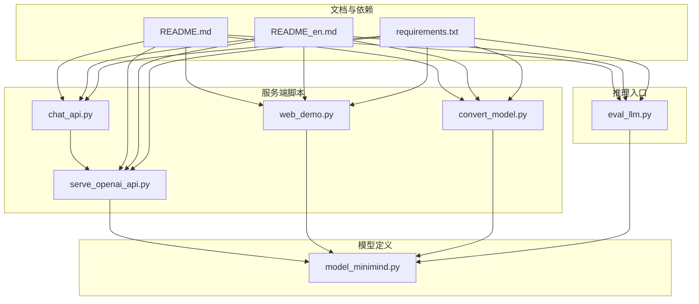
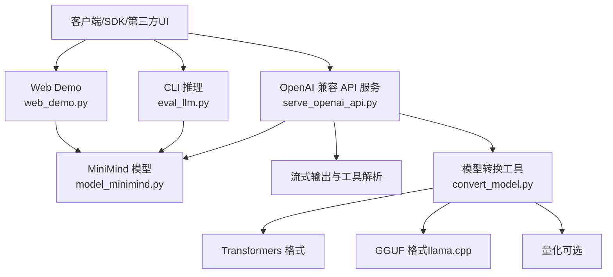
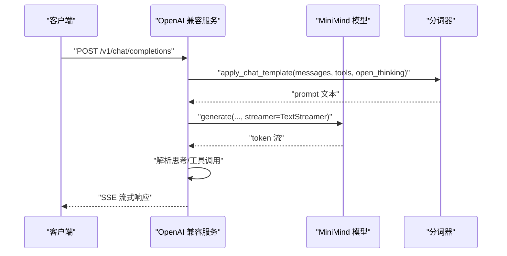
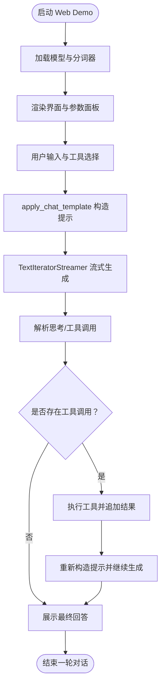
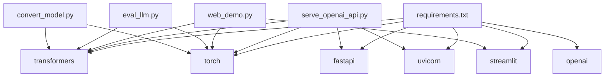

# 部署最佳实践

<cite>
**本文引用的文件**
- [README.md](file://README.md)
- [README_en.md](file://README_en.md)
- [requirements.txt](file://requirements.txt)
- [model_minimind.py](file://model/model_minimind.py)
- [serve_openai_api.py](file://scripts/serve_openai_api.py)
- [web_demo.py](file://scripts/web_demo.py)
- [chat_api.py](file://scripts/chat_api.py)
- [convert_model.py](file://scripts/convert_model.py)
- [eval_llm.py](file://eval_llm.py)
</cite>

## 目录
1. [引言](#引言)
2. [项目结构](#项目结构)
3. [核心组件](#核心组件)
4. [架构总览](#架构总览)
5. [详细组件分析](#详细组件分析)
6. [依赖分析](#依赖分析)
7. [性能考量](#性能考量)
8. [故障排查指南](#故障排查指南)
9. [结论](#结论)
10. [附录](#附录)

## 引言
本指南聚焦 MiniMind 模型在不同推理引擎与生产环境中的部署最佳实践，涵盖 Transformers、llama.cpp、vLLM、SGLang、Ollama 等引擎的选型与配置要点，结合模型服务的性能优化、容器化与 Kubernetes 部署策略、安全与监控建议，帮助读者在不同规模与预算下实现稳定高效的模型服务。

## 项目结构
- 模型定义与推理核心位于 model/，包含 MiniMindConfig、MiniMindForCausalLM、Attention、FeedForward 等关键模块，支持 MoE 与 YaRN 外推配置。
- 服务端脚本位于 scripts/，提供 OpenAI 兼容 API 服务、Web Demo、CLI 推理与模型格式转换工具。
- 顶层 README 提供了多引擎部署与 API 使用示例，便于快速落地。

**图表来源**
- [model_minimind.py](file://model/model_minimind.py)
- [serve_openai_api.py](file://scripts/serve_openai_api.py)
- [web_demo.py](file://scripts/web_demo.py)
- [chat_api.py](file://scripts/chat_api.py)
- [convert_model.py](file://scripts/convert_model.py)
- [eval_llm.py](file://eval_llm.py)
- [README.md](file://README.md)
- [README_en.md](file://README_en.md)
- [requirements.txt](file://requirements.txt)

**章节来源**
- [README.md](file://README.md)
- [README_en.md](file://README_en.md)
- [requirements.txt](file://requirements.txt)

## 核心组件
- 模型配置与结构：MiniMindConfig 提供隐藏维度、层数、注意力头数、MoE 专家数等参数；MiniMindForCausalLM 继承 PreTrainedModel 与 GenerationMixin，内置 generate 方法，支持流式输出与 KV 缓存。
- 服务端 API：OpenAI 兼容接口，支持流式 SSE、工具调用、思考标记解析与自定义 chat_template 参数。
- Web Demo：Streamlit 应用，支持工具调用、思考展示、多轮对话与参数调节。
- CLI 推理：eval_llm.py 提供命令行推理入口，支持 Transformers 与原生权重加载、LoRA 合并与推理速度统计。
- 模型转换：convert_model.py 支持 torch 与 transformers 格式互转、LoRA 合并、模板导出与 Jinja/JSON 互转。

**章节来源**
- [model_minimind.py](file://model/model_minimind.py)
- [serve_openai_api.py](file://scripts/serve_openai_api.py)
- [web_demo.py](file://scripts/web_demo.py)
- [eval_llm.py](file://eval_llm.py)
- [convert_model.py](file://scripts/convert_model.py)

## 架构总览
MiniMind 的推理与服务架构围绕“模型定义 + 服务端 API + 多引擎适配”展开。服务端通过 OpenAI 兼容接口暴露推理能力，支持流式响应与工具调用；CLI 与 Web Demo 提供本地验证与演示；模型转换工具打通不同生态格式，便于在 llama.cpp、vLLM、SGLang、Ollama 等引擎间迁移。

**图表来源**
- [serve_openai_api.py](file://scripts/serve_openai_api.py)
- [model_minimind.py](file://model/model_minimind.py)
- [web_demo.py](file://scripts/web_demo.py)
- [eval_llm.py](file://eval_llm.py)
- [convert_model.py](file://scripts/convert_model.py)

## 详细组件分析

### 推理引擎选择与配置
- Transformers（推荐）
  - 适用场景：通用部署、生态兼容、可直接加载 HuggingFace 格式权重。
  - 配置要点：确保 tokenizer 与 config.json 一致；必要时通过 convert_model.py 将原生权重转换为 Transformers 格式。
  - 参考：README 提供 OpenAI 兼容 API 启动与测试示例。
- llama.cpp
  - 适用场景：本地轻量部署、命令行推理、部分 GPU 加速。
  - 配置要点：将 HuggingFace 模型转换为 GGUF，必要时进行量化；通过 Ollama Modelfile 定义系统提示、模板与停止词。
  - 参考：README_en.md 提供 convert_hf_to_gguf.patch、量化与 CLI 推理步骤。
- vLLM
  - 适用场景：高吞吐、低延迟、CUDA 环境。
  - 配置要点：使用 --model-impl transformers 指定实现；绑定端口对外提供 OpenAI 兼容服务。
  - 参考：README_en.md 提供 vLLM 启动命令。
- SGLang
  - 适用场景：RadixAttention、连续批处理优化，适合高并发与长上下文。
  - 配置要点：CUDA 环境；可作为 RL 训练中的 rollout/inference 引擎。
  - 参考：README_en.md 提供启动命令与注意事项。
- Ollama
  - 适用场景：本地一键运行、工具调用与思考展示。
  - 配置要点：编写 Modelfile，定义 SYSTEM、TEMPLATE、STOP、温度与上下文长度等参数。
  - 参考：README_en.md 提供完整 Modelfile 模板与创建/运行流程。

**章节来源**
- [README_en.md](file://README_en.md)
- [README.md](file://README.md)
- [convert_model.py](file://scripts/convert_model.py)

### OpenAI 兼容 API 服务（serve_openai_api.py）
- 功能特性
  - 支持流式 SSE 输出，解析思考标记与工具调用 JSON。
  - 支持 chat_template_kwargs 与 open_thinking 开关。
  - 支持 LoRA 权重加载与合并（通过 convert_model.py）。
- 关键流程
  - 初始化模型与分词器（支持原生 torch 与 Transformers）。
  - 接收 /v1/chat/completions 请求，应用 chat_template 生成提示。
  - 使用 TextStreamer 与队列实现流式输出，解析最终文本中的思考与工具调用。
  - 返回 JSON 字符串流，兼容 OpenAI 客户端。

**图表来源**
- [serve_openai_api.py](file://scripts/serve_openai_api.py)
- [model_minimind.py](file://model/model_minimind.py)

**章节来源**
- [serve_openai_api.py](file://scripts/serve_openai_api.py)

### Web Demo（web_demo.py）
- 功能特性
  - Streamlit 界面，支持工具调用、思考展示、多轮对话与参数调节。
  - 自动扫描 scripts/ 下的模型目录，动态加载 Transformers 格式模型。
  - 使用 TextIteratorStreamer 实现流式生成与工具调用二次生成。
- 关键流程
  - 加载模型与分词器（trust_remote_code）。
  - 构造 chat_template，应用温度、top_p、最大生成长度等参数。
  - 多轮对话与工具调用结果拼接，再次生成最终回答。

**图表来源**
- [web_demo.py](file://scripts/web_demo.py)

**章节来源**
- [web_demo.py](file://scripts/web_demo.py)

### CLI 推理（eval_llm.py）
- 功能特性
  - 支持 Transformers 与原生 torch 权重加载。
  - 支持 LoRA 权重加载与合并（通过 convert_model.py）。
  - 支持 open_thinking、历史对话轮数、最大生成长度、采样参数等。
- 关键流程
  - 解析命令行参数，初始化模型与分词器。
  - 构造对话历史或纯提示，调用 model.generate 生成文本。
  - 流式输出并统计 tokens/s。

**章节来源**
- [eval_llm.py](file://eval_llm.py)

### 模型转换（convert_model.py）
- 功能特性
  - torch 与 transformers 格式互转。
  - LoRA 合并为基模权重。
  - chat_template 的 Jinja/JSON 互转。
- 关键流程
  - 读取原生权重，注册 AutoClass，保存为 Transformers 格式。
  - 根据 use_moe 决定 Qwen3 或 Qwen3Moe 配置。
  - LoRA 合并后保存为 PyTorch 格式，便于 CLI/服务端加载。

**章节来源**
- [convert_model.py](file://scripts/convert_model.py)

## 依赖分析
- 运行时依赖
  - transformers、torch、fastapi、uvicorn、pydantic、streamlit 等。
  - 推理引擎依赖：vLLM、SGLang、llama.cpp、Ollama。
- 组件耦合
  - 服务端 API 依赖模型定义与分词器；Web Demo 与 CLI 依赖模型定义与分词器；转换工具贯穿多格式互转。
- 外部集成
  - OpenAI 兼容 API 便于接入 FastGPT、OpenWebUI、Dify 等第三方 UI。

**图表来源**
- [requirements.txt](file://requirements.txt)
- [serve_openai_api.py](file://scripts/serve_openai_api.py)
- [web_demo.py](file://scripts/web_demo.py)
- [eval_llm.py](file://eval_llm.py)
- [convert_model.py](file://scripts/convert_model.py)

**章节来源**
- [requirements.txt](file://requirements.txt)

## 性能考量
- 硬件与显存
  - 推荐使用具备充足 VRAM 的 GPU（如 3090/4090/H100），以便在高上下文与批量场景下保持稳定吞吐。
  - llama.cpp 与量化可降低显存占用，适合本地部署与边缘设备。
- 采样与生成
  - 控制 temperature、top_p、max_tokens 与 repetition_penalty，平衡多样性与稳定性。
  - 使用流式输出（SSE）降低首 token 延迟，改善用户体验。
- 批处理与缓存
  - 在服务端聚合请求、启用 KV 缓存与 past_key_values，减少重复计算。
  - 对热点提示进行缓存（需注意隐私与一致性）。
- 引擎选择
  - vLLM/SGLang 适合高吞吐与低延迟；llama.cpp/Ollama 适合本地与边缘部署。
- 上下文外推
  - 使用 YaRN 外推配置扩展有效上下文长度，避免截断影响生成质量。

[本节为通用指导，无需引用具体文件]

## 故障排查指南
- 服务端启动失败
  - 检查端口占用与权限；确认模型路径与权重文件存在；核对 chat_template 与工具定义。
  - 参考：OpenAI 兼容 API 的启动与测试命令。
- 推理异常或报错
  - 确认分词器与模型配置一致；检查 tokenizer_config.json 与 config.json 是否正确。
  - 若使用原生 torch 权重，先转换为 Transformers 格式。
- 工具调用未生效
  - 确认 messages 中包含 tools 字段与正确的 JSON 结构；检查服务端解析逻辑。
- 思考标记显示异常
  - 确保 open_thinking 开关开启；检查 chat_template 中的思考标签占位。
- 本地部署问题（llama.cpp/Ollama）
  - 按 README_en.md 的 patch 与 Modelfile 模板进行配置；确保 GGUF 转换与量化步骤正确。

**章节来源**
- [README_en.md](file://README_en.md)
- [README.md](file://README.md)
- [serve_openai_api.py](file://scripts/serve_openai_api.py)
- [convert_model.py](file://scripts/convert_model.py)

## 结论
MiniMind 提供从模型定义到服务端 API 的完整链路，配合多引擎适配与转换工具，可在不同场景下实现稳定高效的部署。生产环境建议优先考虑 vLLM/SGLang 的高吞吐能力，结合流式输出、KV 缓存与工具调用解析；本地与边缘场景可选用 llama.cpp/Ollama，通过量化与模板优化降低成本与延迟。通过规范的容器化与 Kubernetes 策略、安全与监控配置，可进一步提升系统的可靠性与可观测性。

[本节为总结，无需引用具体文件]

## 附录

### 生产环境部署关键考虑
- 硬件要求
  - 推荐 GPU 显存 ≥ 24GB（依据模型规模与上下文长度），CPU ≥ 16 核，内存 ≥ 64GB。
- 内存管理
  - 启用半精度（.half()）与 KV 缓存；限制最大上下文与 batch size；对长序列使用 YaRN 外推。
- 并发与资源监控
  - 使用 uvicorn 多进程/多核；Prometheus/Grafana 监控 GPU 利用率、延迟与吞吐；结合日志聚合（如 Loki/ELK）。
- 安全与访问控制
  - 限制 API 端口访问范围；启用鉴权（如 JWT/Token）与速率限制；对敏感工具调用进行白名单与审计。
- 日志与可观测性
  - 记录请求/响应、工具调用结果与错误堆栈；采集关键指标（P95/P99 延迟、错误率、缓存命中率）。

[本节为通用指导，无需引用具体文件]

### Docker 容器化与 Kubernetes 部署策略
- 容器镜像
  - 基于 CUDA 镜像（如 nvidia/cuda:12.2.2-devel-ubuntu20.04）安装 Python 与依赖；将模型权重与脚本打包进镜像。
  - 暴露服务端口（如 8998），挂载模型卷以支持热更新。
- Kubernetes 部署
  - 使用 Deployment 管理副本数；通过 Service 暴露服务；使用 HPA 根据 CPU/内存或自定义指标扩缩容。
  - 为 GPU 节点配置 nvidia-device-plugin；使用 Pod 的 resources.limits.nvidia.com/gpu 指定显存配额。
  - 通过 ConfigMap/Secret 管理模型路径、API 密钥与日志级别。

[本节为通用指导，无需引用具体文件]