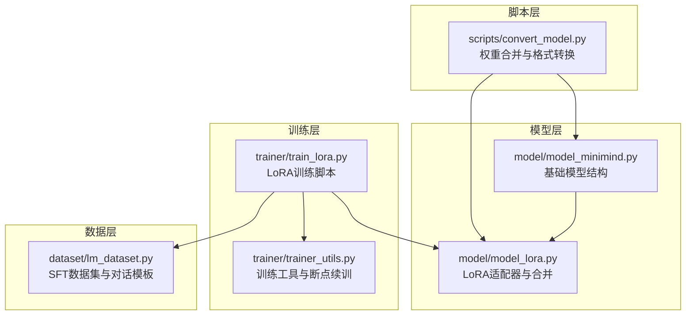
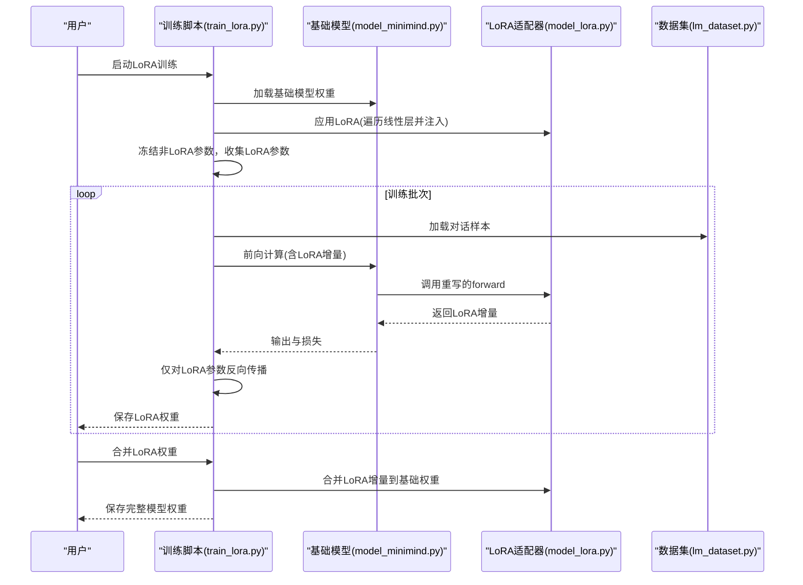
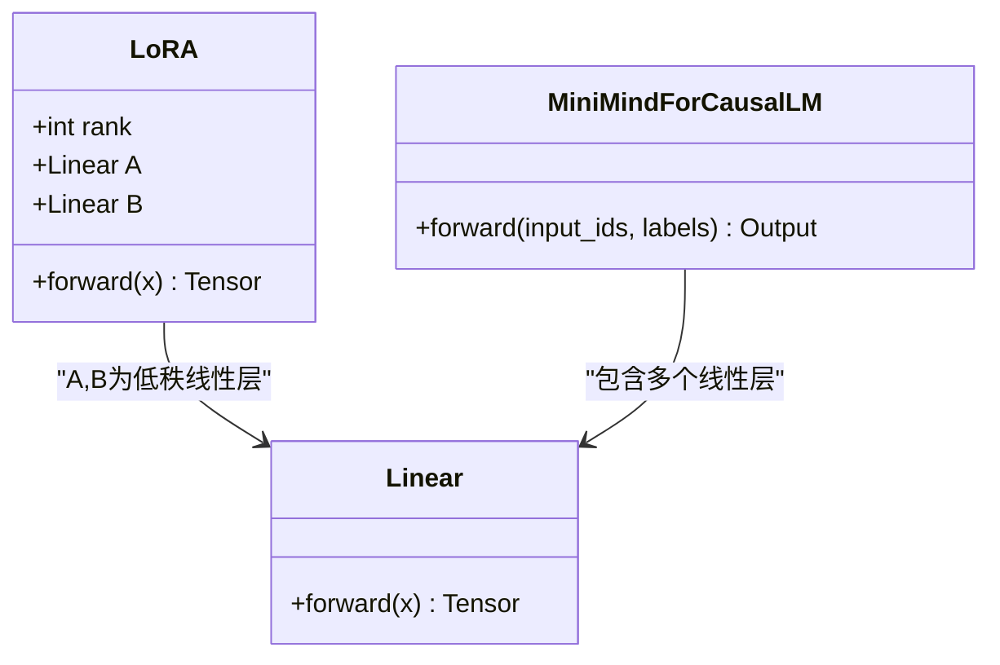
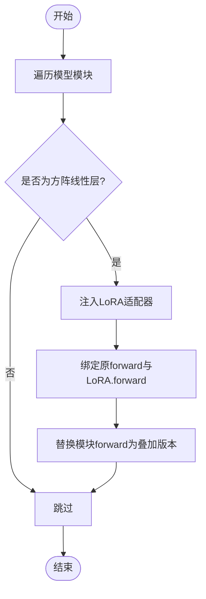
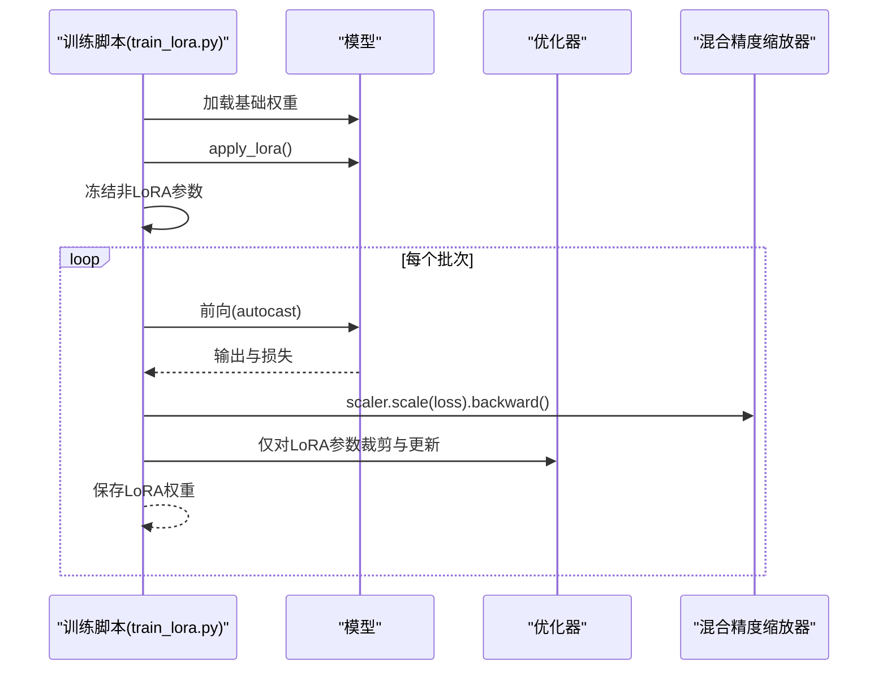
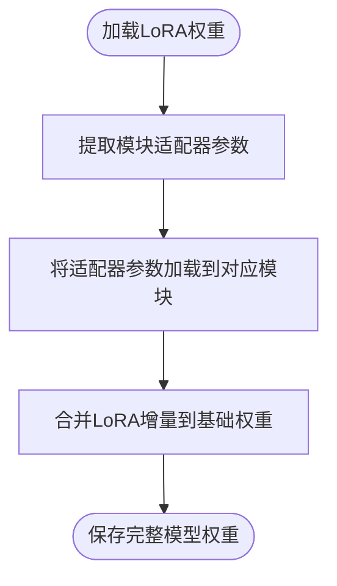
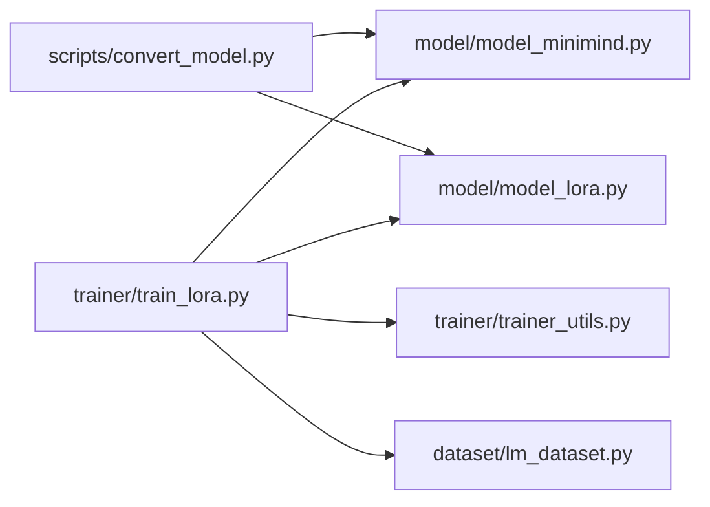

# LoRA 微调算法

<cite>
**本文引用的文件**
- [model_lora.py](file://model/model_lora.py)
- [train_lora.py](file://trainer/train_lora.py)
- [convert_model.py](file://scripts/convert_model.py)
- [model_minimind.py](file://model/model_minimind.py)
- [lm_dataset.py](file://dataset/lm_dataset.py)
- [trainer_utils.py](file://trainer/trainer_utils.py)
- [README.md](file://README.md)
</cite>

## 更新摘要
**变更内容**
- 更新了 LoRA 维度检测逻辑部分，反映了从权重矩阵形状比较到属性比较的改进
- 增强了线性层识别准确性的技术说明
- 完善了 LoRA 层插入条件的技术细节

## 目录
1. [引言](#引言)
2. [项目结构](#项目结构)
3. [核心组件](#核心组件)
4. [架构总览](#架构总览)
5. [详细组件分析](#详细组件分析)
6. [依赖关系分析](#依赖关系分析)
7. [性能考量](#性能考量)
8. [故障排查指南](#故障排查指南)
9. [结论](#结论)
10. [附录](#附录)

## 引言
本文件面向 MiniMind LoRA 微调算法的技术文档，系统阐述低秩适应（Low-Rank Adaptation, LoRA）的理论基础与实现原理，涵盖矩阵分解、参数高效微调的核心思想；详细说明 LoRA 层的插入位置、秩大小的选择与适配器权重的初始化策略；解释 LoRA 微调的训练流程（冻结基础模型参数、仅训练适配器参数的优化策略）；提供 LoRA 配置参数的详细说明与调优方法；并包含 LoRA 权重合并、模型部署与性能对比分析。

**更新** 本版本反映了 LoRA 维度检测逻辑的重要改进，从权重矩阵形状比较升级为属性比较，显著提高了线性层识别的准确性。

## 项目结构
本项目围绕"从零实现"的理念，将 LoRA 微调贯穿于完整的训练链路中：
- 模型层：定义基础模型结构与 LoRA 适配器的注入逻辑
- 训练层：提供 LoRA 微调脚本，冻结非 LoRA 参数，仅优化适配器
- 数据层：提供 SFT 数据集与对话模板处理
- 脚本层：提供权重合并与模型格式转换工具
- 工具层：提供分布式、断点续训、混合精度等训练辅助

**图表来源**
- [model_minimind.py:1-280](file://model/model_minimind.py#L1-L280)
- [model_lora.py:1-66](file://model/model_lora.py#L1-L66)
- [train_lora.py:1-184](file://trainer/train_lora.py#L1-L184)
- [trainer_utils.py:1-177](file://trainer/trainer_utils.py#L1-L177)
- [lm_dataset.py:1-256](file://dataset/lm_dataset.py#L1-L256)
- [convert_model.py:1-145](file://scripts/convert_model.py#L1-L145)

## 核心组件
- LoRA 适配器模块：定义低秩矩阵 A、B 及初始化策略，提供 forward 增量叠加
- LoRA 应用与合并：遍历模型中的线性层，注入 LoRA 适配器并重写 forward；提供 LoRA 权重加载与合并为完整权重的能力
- LoRA 训练脚本：加载基础模型权重，应用 LoRA，冻结非 LoRA 参数，仅优化适配器，支持分布式、混合精度与断点续训
- 数据集与对话模板：提供 SFT 数据集，处理多轮对话、工具调用与思考标签
- 转换与合并脚本：将基础模型与 LoRA 权重合并为新的完整模型权重，便于部署

**章节来源**
- [model_lora.py:6-33](file://model/model_lora.py#L6-L33)
- [model_lora.py:35-66](file://model/model_lora.py#L35-L66)
- [train_lora.py:127-151](file://trainer/train_lora.py#L127-L151)
- [lm_dataset.py:58-119](file://dataset/lm_dataset.py#L58-L119)
- [convert_model.py:105-112](file://scripts/convert_model.py#L105-L112)

## 架构总览
LoRA 微调的整体流程如下：
- 准备基础模型权重（全参数微调或预训练权重）
- 应用 LoRA：在匹配的线性层上注入低秩适配器，并重写 forward，使输出为原线性层输出与 LoRA 增量之和
- 冻结基础模型参数，仅训练 LoRA 适配器参数
- 训练循环：前向计算损失，反向传播仅更新 LoRA 参数，周期性保存 LoRA 权重
- 权重合并：将 LoRA 增量合并到基础权重，生成完整模型权重，便于部署

**图表来源**
- [train_lora.py:127-151](file://trainer/train_lora.py#L127-L151)
- [model_minimind.py:229-246](file://model/model_minimind.py#L229-L246)
- [model_lora.py:21-33](file://model/model_lora.py#L21-L33)
- [lm_dataset.py:58-119](file://dataset/lm_dataset.py#L58-L119)
- [convert_model.py:105-112](file://scripts/convert_model.py#L105-L112)

## 详细组件分析

### LoRA 适配器与初始化策略
- 低秩分解：将线性层的权重增量近似为两个低秩矩阵 A ∈ R^{d×r}、B ∈ R^{r×d} 的乘积，其中 r << d 为秩
- 初始化策略：
  - 矩阵 A：高斯初始化（均值 0，标准差 0.02）
  - 矩阵 B：全零初始化
- 前向叠加：在原线性层 forward 的基础上加上 LoRA 增量，实现参数高效微调

**图表来源**
- [model_lora.py:6-18](file://model/model_lora.py#L6-L18)
- [model_minimind.py:229-246](file://model/model_minimind.py#L229-L246)

**章节来源**
- [model_lora.py:6-18](file://model/model_lora.py#L6-L18)

### LoRA 层插入与 forward 重写
- **更新** 维度检测逻辑改进：遍历模型的所有模块，使用 `module.in_features == module.out_features` 属性比较来识别方阵线性层，替代之前的权重矩阵形状比较
- 重写策略：显式绑定原 forward 与 LoRA 的 forward，使最终输出为"原输出 + LoRA 增量"
- 设计要点：通过 setattr 动态替换模块的 forward，实现对原模型无侵入的增量适配

**图表来源**
- [model_lora.py:21-33](file://model/model_lora.py#L21-L33)

**章节来源**
- [model_lora.py:21-33](file://model/model_lora.py#L21-L33)

### LoRA 训练流程与参数冻结
- 加载基础模型权重（来自全参数微调或预训练）
- 应用 LoRA 并统计参数量，验证 LoRA 参数占比
- 冻结非 LoRA 参数，仅收集 LoRA 参数参与优化
- 训练循环：混合精度前向、损失归一化、梯度裁剪、优化器更新、周期性保存 LoRA 权重
- 断点续训：支持自动检测与恢复训练进度

**图表来源**
- [train_lora.py:127-151](file://trainer/train_lora.py#L127-L151)
- [trainer_utils.py:63-116](file://trainer/trainer_utils.py#L63-L116)

**章节来源**
- [train_lora.py:127-151](file://trainer/train_lora.py#L127-L151)
- [trainer_utils.py:63-116](file://trainer/trainer_utils.py#L63-L116)

### LoRA 权重加载与合并
- 加载：从保存的 LoRA 权重中提取对应模块的适配器参数并加载到模型
- 合并：将 LoRA 增量（B·A）加回到基础线性层权重，生成完整权重，便于部署与推理

**图表来源**
- [model_lora.py:35-66](file://model/model_lora.py#L35-L66)
- [convert_model.py:105-112](file://scripts/convert_model.py#L105-L112)

**章节来源**
- [model_lora.py:35-66](file://model/model_lora.py#L35-L66)
- [convert_model.py:105-112](file://scripts/convert_model.py#L105-L112)

### 数据与对话模板
- SFT 数据集：支持多轮对话、工具调用与思考标签，提供 chat_template 应用与标签处理
- 标签处理：对空思考标签按概率移除，提高训练稳定性
- 模板生成：将对话历史与当前问题拼接为模型输入，生成标签序列

**章节来源**
- [lm_dataset.py:58-119](file://dataset/lm_dataset.py#L58-L119)

## 依赖关系分析
- 训练脚本依赖：
  - 基础模型配置与模型类：MiniMindConfig、MiniMindForCausalLM
  - LoRA 适配器与合并：apply_lora、merge_lora
  - 训练工具：分布式、断点续训、混合精度、学习率调度
  - 数据集：SFT 数据集与对话模板
- 转换脚本依赖：
  - 基础模型与 LoRA 合并：用于将 LoRA 与基础权重合并为完整模型权重

**图表来源**
- [train_lora.py:16-19](file://trainer/train_lora.py#L16-L19)
- [convert_model.py:10-12](file://scripts/convert_model.py#L10-L12)
- [model_minimind.py:10-45](file://model/model_minimind.py#L10-L45)
- [model_lora.py:1-66](file://model/model_lora.py#L1-L66)
- [trainer_utils.py:1-17](file://trainer/trainer_utils.py#L1-L17)
- [lm_dataset.py:1-10](file://dataset/lm_dataset.py#L1-L10)

**章节来源**
- [train_lora.py:16-19](file://trainer/train_lora.py#L16-L19)
- [convert_model.py:10-12](file://scripts/convert_model.py#L10-L12)

## 性能考量
- 训练成本：LoRA 仅更新少量适配器参数，显著降低显存与计算开销，适合垂直领域快速适配
- 参数占比：训练脚本会统计 LoRA 参数占总参数的比例，便于评估适配器规模
- 混合精度：支持 bfloat16/float16 混合精度，提升吞吐与显存利用率
- 分布式与断点续训：支持多卡训练与自动恢复，提升训练稳定性与效率
- 推理部署：通过权重合并生成完整模型权重，便于在多种推理引擎中部署

**章节来源**
- [train_lora.py:131-136](file://trainer/train_lora.py#L131-L136)
- [train_lora.py:113-116](file://trainer/train_lora.py#L113-L116)
- [README.md:765-781](file://README.md#L765-L781)

## 故障排查指南
- LoRA 参数未更新
  - 检查是否正确冻结非 LoRA 参数，仅收集 LoRA 参数参与优化
  - 确认 apply_lora 是否在加载基础权重之后执行
- 权重加载失败
  - 确认保存的 LoRA 权重键名与模块名匹配，必要时去除前缀
- 合并后性能异常
  - 检查合并时是否正确将 LoRA 增量加回到基础权重
  - 确认合并后的权重保存路径与加载路径一致
- 分布式训练问题
  - 检查本地 rank 与设备设置，确保 CUDA 可用
  - 断点续训时注意 GPU 数量变化导致的 step 转换

**章节来源**
- [train_lora.py:138-146](file://trainer/train_lora.py#L138-L146)
- [model_lora.py:35-53](file://model/model_lora.py#L35-L53)
- [trainer_utils.py:107-116](file://trainer/trainer_utils.py#L107-L116)

## 结论
MiniMind 的 LoRA 微调实现遵循"参数高效微调"的核心思想，通过低秩分解与适配器初始化策略，仅训练少量参数即可完成领域适配。训练脚本提供完整的冻结参数、混合精度、分布式与断点续训能力；转换脚本支持 LoRA 权重合并与模型格式转换，便于部署与推理。该实现为理解 LoRA 的理论与实践提供了清晰、可复现的参考路径。

**更新** 最新的维度检测逻辑改进进一步提升了线性层识别的准确性，确保 LoRA 适配器仅被正确地注入到合适的线性层中，提高了整个微调流程的可靠性。

## 附录

### LoRA 配置参数与调优建议
- 秩大小（rank）
  - 影响适配器容量与训练稳定性：较大秩可拟合复杂变化，但增加显存与计算；较小秩更节省资源，但可能欠拟合
  - 建议范围：8–64，结合任务复杂度与显存上限选择
- 学习率（learning_rate）
  - LoRA 通常使用较高学习率以快速收敛，但需避免过大导致震荡
  - 建议范围：1e-4 至 1e-3，结合批量大小与梯度累积步数调整
- 梯度裁剪（grad_clip）
  - 控制 LoRA 参数梯度范数，防止爆炸
  - 建议范围：0.1–1.0，按任务稳定性调整
- 梯度累积（accumulation_steps）
  - 在显存受限时扩大有效批大小，提升稳定性
  - 建议范围：1–8，结合硬件与任务复杂度
- 混合精度（dtype）
  - bfloat16/float16 提升吞吐与显存利用率
  - 建议：优先 bfloat16，若显存紧张可尝试 float16
- 保存与日志（save_interval/log_interval）
  - 控制权重保存频率与日志输出频率，便于监控与恢复
  - 建议：按训练时长与显存压力合理设置

**章节来源**
- [train_lora.py:77-101](file://trainer/train_lora.py#L77-L101)
- [train_lora.py:113-116](file://trainer/train_lora.py#L113-L116)