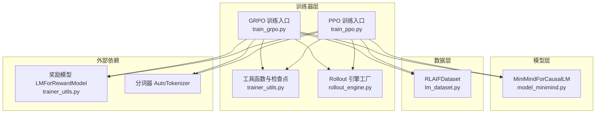
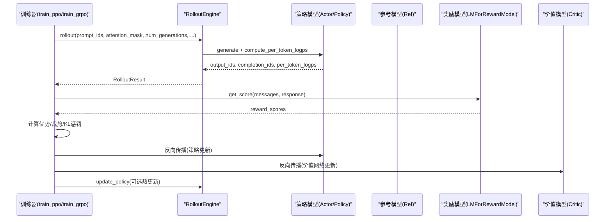
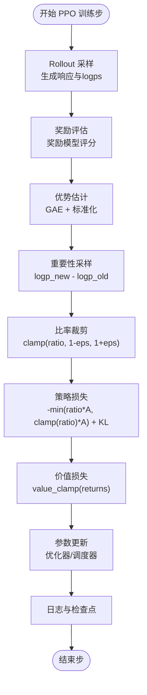
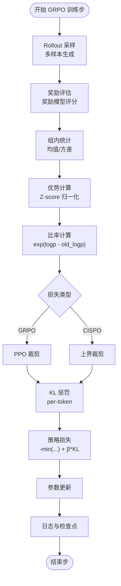
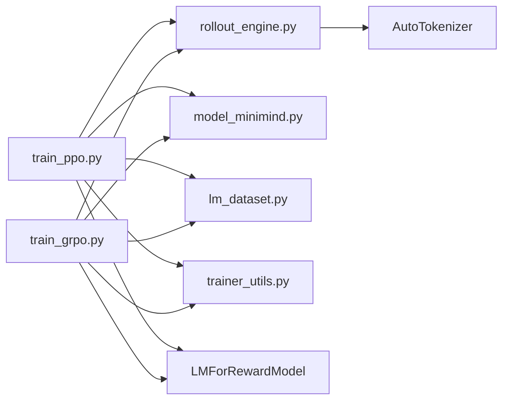

# PPO 与 GRPO 算法

<cite>
**本文引用的文件**
- [train_ppo.py](file://trainer/train_ppo.py)
- [train_grpo.py](file://trainer/train_grpo.py)
- [rollout_engine.py](file://trainer/rollout_engine.py)
- [trainer_utils.py](file://trainer/trainer_utils.py)
- [model_minimind.py](file://model/model_minimind.py)
- [lm_dataset.py](file://dataset/lm_dataset.py)
- [README.md](file://README.md)
</cite>

## 目录
1. [引言](#引言)
2. [项目结构](#项目结构)
3. [核心组件](#核心组件)
4. [架构总览](#架构总览)
5. [详细组件分析](#详细组件分析)
6. [依赖关系分析](#依赖关系分析)
7. [性能考量](#性能考量)
8. [故障排查指南](#故障排查指南)
9. [结论](#结论)
10. [附录](#附录)

## 引言
本文件面向 MiniMind 项目中的 PPO 与 GRPO 强化学习算法，系统阐述其理论基础与实现细节，包括：
- PPO 的优势估计、重要性采样与裁剪机制
- GRPO 的改进点（优势函数重定义、优化目标调整）
- 强化学习训练流程（策略采样、奖励模型评估、策略更新）
- 关键超参数配置与设置原则
- 稳定性保障、收敛性分析与性能监控方法

## 项目结构
本项目围绕“模型-数据-训练器-推理引擎”四层组织，PPO/GRPO 位于训练器层，依赖模型与推理引擎完成 rollout 与策略更新。

图表来源
- [train_ppo.py:1-444](file://trainer/train_ppo.py#L1-L444)
- [train_grpo.py:1-332](file://trainer/train_grpo.py#L1-L332)
- [rollout_engine.py:1-213](file://trainer/rollout_engine.py#L1-L213)
- [trainer_utils.py:1-177](file://trainer/trainer_utils.py#L1-L177)
- [model_minimind.py:1-280](file://model/model_minimind.py#L1-L280)
- [lm_dataset.py:195-225](file://dataset/lm_dataset.py#L195-L225)

章节来源
- [README.md:134-147](file://README.md#L134-L147)
- [train_ppo.py:303-444](file://trainer/train_ppo.py#L303-L444)
- [train_grpo.py:205-332](file://trainer/train_grpo.py#L205-L332)

## 核心组件
- PPO 训练器：实现优势估计、重要性采样、裁剪更新、价值网络训练与早停机制
- GRPO 训练器：实现组内优势归一化、KL 惩罚、PPO/GRPO/CISPO 三种损失族
- Rollout 引擎：提供 PyTorch 原生与 SGLang 两种生成后端，支持权重热更新
- 奖励模型：封装第三方奖励模型，提供评分接口
- 数据集：RLAIF 数据集，支持思考标签与工具调用模板

章节来源
- [train_ppo.py:78-301](file://trainer/train_ppo.py#L78-L301)
- [train_grpo.py:70-203](file://trainer/train_grpo.py#L70-L203)
- [rollout_engine.py:46-213](file://trainer/rollout_engine.py#L46-L213)
- [trainer_utils.py:160-177](file://trainer/trainer_utils.py#L160-L177)
- [lm_dataset.py:195-225](file://dataset/lm_dataset.py#L195-L225)

## 架构总览
PPO/GRPO 的训练流程由“rollout 采样—奖励评估—策略更新”三阶段构成，二者在优势估计与损失设计上存在差异。

图表来源
- [train_ppo.py:78-301](file://trainer/train_ppo.py#L78-L301)
- [train_grpo.py:70-203](file://trainer/train_grpo.py#L70-L203)
- [rollout_engine.py:66-90](file://trainer/rollout_engine.py#L66-L90)
- [trainer_utils.py:160-177](file://trainer/trainer_utils.py#L160-L177)

## 详细组件分析

### PPO 组件分析
- 优势估计与价值网络
  - 使用时序递归计算 GAE（广义优势估计），并进行标准化
  - 价值网络输出序列级价值，配合裁剪范围进行价值损失更新
- 重要性采样与裁剪
  - 通过旧策略与新策略的对数概率比进行重要性采样
  - 使用裁剪比率限制更新幅度，防止策略漂移过大
- KL 惩罚与早停
  - 通过参考模型 KL 惩罚抑制策略退化
  - 当 KL 超阈值时触发早停，避免 DDP 死锁
- 训练循环与日志
  - 支持 mini-batch 与多更新轮次，梯度累积与梯度裁剪
  - 记录奖励、KL、裁剪比例、价值损失等指标

图表来源
- [train_ppo.py:146-229](file://trainer/train_ppo.py#L146-L229)
- [train_ppo.py:233-251](file://trainer/train_ppo.py#L233-L251)

章节来源
- [train_ppo.py:36-49](file://trainer/train_ppo.py#L36-L49)
- [train_ppo.py:51-76](file://trainer/train_ppo.py#L51-L76)
- [train_ppo.py:78-301](file://trainer/train_ppo.py#L78-L301)
- [train_ppo.py:303-444](file://trainer/train_ppo.py#L303-L444)

### GRPO 组件分析
- 优势函数重定义
  - 对每条 prompt 的多个生成样本，计算组内奖励均值与方差，使用 Z-score 归一化得到优势
- 优化目标调整
  - 支持 GRPO 与 CISPO 两种损失族：前者使用 PPO 裁剪，后者使用上界裁剪
  - 引入 per-token KL 惩罚，抑制 token 级别的策略漂移
- 训练流程
  - 与 PPO 类似，但优势估计与损失设计不同，更适合多样本组内比较

图表来源
- [train_grpo.py:121-143](file://trainer/train_grpo.py#L121-L143)
- [train_grpo.py:134-142](file://trainer/train_grpo.py#L134-L142)

章节来源
- [train_grpo.py:36-68](file://trainer/train_grpo.py#L36-L68)
- [train_grpo.py:70-203](file://trainer/train_grpo.py#L70-L203)
- [train_grpo.py:205-332](file://trainer/train_grpo.py#L205-L332)

### Rollout 引擎与奖励模型
- Rollout 引擎
  - 提供抽象接口与两种实现：PyTorch 原生生成与 SGLang HTTP API
  - 支持 per-token logp 计算与权重热更新（SGLang）
- 奖励模型
  - 封装第三方奖励模型，提供评分接口，限制评分范围

章节来源
- [rollout_engine.py:46-213](file://trainer/rollout_engine.py#L46-L213)
- [trainer_utils.py:160-177](file://trainer/trainer_utils.py#L160-L177)

### 模型与数据
- 模型
  - MiniMindForCausalLM 提供生成接口与辅助损失（MoE）
- 数据
  - RLAIFDataset 为 PPO/GRPO 提供 prompt 输入，支持思考标签与工具调用模板

章节来源
- [model_minimind.py:229-280](file://model/model_minimind.py#L229-L280)
- [lm_dataset.py:195-225](file://dataset/lm_dataset.py#L195-L225)

## 依赖关系分析
- PPO/GRPO 依赖
  - 模型：MiniMindForCausalLM（策略/价值/参考）
  - 推理：RolloutEngine（生成与 logp）
  - 奖励：LMForRewardModel（评分）
  - 数据：RLAIFDataset（prompt）
  - 工具：trainer_utils（分布式、检查点、日志）

图表来源
- [train_ppo.py:21-24](file://trainer/train_ppo.py#L21-L24)
- [train_grpo.py:22-25](file://trainer/train_grpo.py#L22-L25)
- [rollout_engine.py:10-17](file://trainer/rollout_engine.py#L10-L17)
- [trainer_utils.py:15-16](file://trainer/trainer_utils.py#L15-L16)

章节来源
- [train_ppo.py:21-24](file://trainer/train_ppo.py#L21-L24)
- [train_grpo.py:22-25](file://trainer/train_grpo.py#L22-L25)
- [rollout_engine.py:10-17](file://trainer/rollout_engine.py#L10-L17)
- [trainer_utils.py:15-16](file://trainer/trainer_utils.py#L15-L16)

## 性能考量
- 计算与内存
  - rollout 生成与 per-token logp 计算为 O(T) 且涉及多次 softmax，注意显存峰值
  - 混合精度与 torch.compile 可显著降低显存与加速
- 分布式与早停
  - DDP 下同步 approx_kl 防止死锁；早停阈值需结合任务稳定性调优
- 生成与奖励
  - SGLang 可提升吞吐，但需注意权重热更新与缓存刷新
- 学习率与调度
  - Cosine 调度与梯度裁剪有助于稳定收敛

[本节为通用指导，不直接分析具体文件]

## 故障排查指南
- rollout 失败或返回空
  - 检查 SGLang 服务健康状态与权重更新接口
  - 确认分词器 pad/eos token 设置与 attention_mask
- 训练不稳定或 NaN
  - 降低学习率、增大 KL 惩罚系数、启用梯度裁剪
  - 检查奖励评分范围与数值稳定性
- 内存不足
  - 减小 batch/mini-batch、关闭混合精度、使用更短 max_seq_len
- DDP 死锁
  - 确保早停时仍执行 backward 与优化器步进，避免通信阻塞

章节来源
- [rollout_engine.py:184-194](file://trainer/rollout_engine.py#L184-L194)
- [train_ppo.py:190-197](file://trainer/train_ppo.py#L190-L197)
- [trainer_utils.py:44-51](file://trainer/trainer_utils.py#L44-L51)

## 结论
- PPO 通过 GAE 优势估计与比率裁剪实现稳定的策略更新，适合单样本优势估计与价值网络训练
- GRPO 通过组内优势归一化与 KL 惩罚，更适合多样本组内比较与更稳健的策略优化
- 两者均依赖高质量的 rollout 与奖励模型，结合分布式与早停机制可提升稳定性与收敛性

[本节为总结性内容，不直接分析具体文件]

## 附录

### PPO 与 GRPO 配置参数说明
- PPO 关键参数
  - 裁剪参数：clip_epsilon（策略裁剪范围）
  - 价值函数系数：vf_coef（价值损失权重）
  - KL 惩罚系数：kl_coef（参考模型 KL 惩罚）
  - 折扣因子：gamma（回报折扣）
  - GAE lambda：lam（优势估计偏差-方差权衡）
  - 价值裁剪范围：cliprange_value（价值损失裁剪）
  - 更新轮次：ppo_update_iters（同一批 rollout 重复更新次数）
  - 早停阈值：early_stop_kl（KL 早停阈值）
  - mini-batch：mini_batch_size（每步更新的样本分块大小）
- GRPO 关键参数
  - 生成数量：num_generations（每条 prompt 的样本数）
  - KL 惩罚系数：beta（per-token KL 惩罚）
  - 损失类型：loss_type（grpo/cispo）
  - PPO 裁剪：epsilon（GRPO 使用的 PPO 裁剪范围）
  - 上界裁剪：epsilon_high（CISPO 使用的上界）
- 通用参数
  - learning_rate、critic_learning_rate（策略/价值学习率）
  - accumulation_steps（梯度累积步数）
  - grad_clip（梯度裁剪阈值）
  - dtype（混合精度类型）
  - rollout_engine（rollout 引擎类型）
  - sglang_*（SGLang 服务器与共享路径）

章节来源
- [train_ppo.py:324-332](file://trainer/train_ppo.py#L324-L332)
- [train_grpo.py:225-242](file://trainer/train_grpo.py#L225-L242)

### 训练流程与监控
- 日志字段（PPO）
  - reward、kl_ref、approx_kl、clipfrac、critic_loss、avg_response_len、actor_lr、critic_lr
- 日志字段（GRPO）
  - reward、kl_ref、advantages_std、advantages_mean、policy_loss、avg_response_len、learning_rate
- 可视化
  - 支持 SwanLab（原 WandB）记录训练曲线

章节来源
- [train_ppo.py:264-274](file://trainer/train_ppo.py#L264-L274)
- [train_grpo.py:169-178](file://trainer/train_grpo.py#L169-L178)