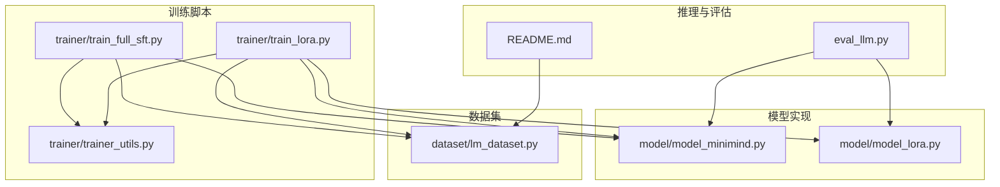
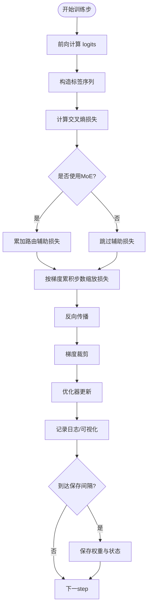
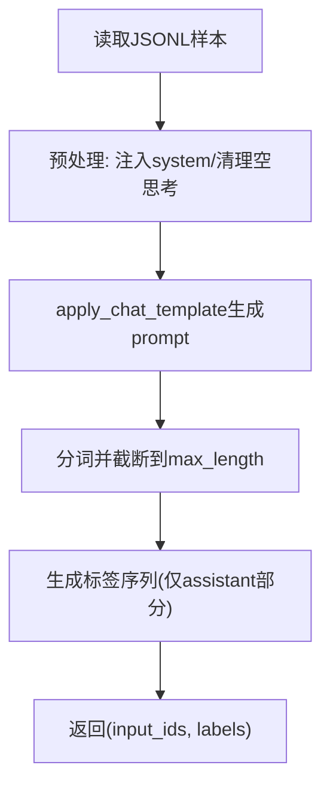
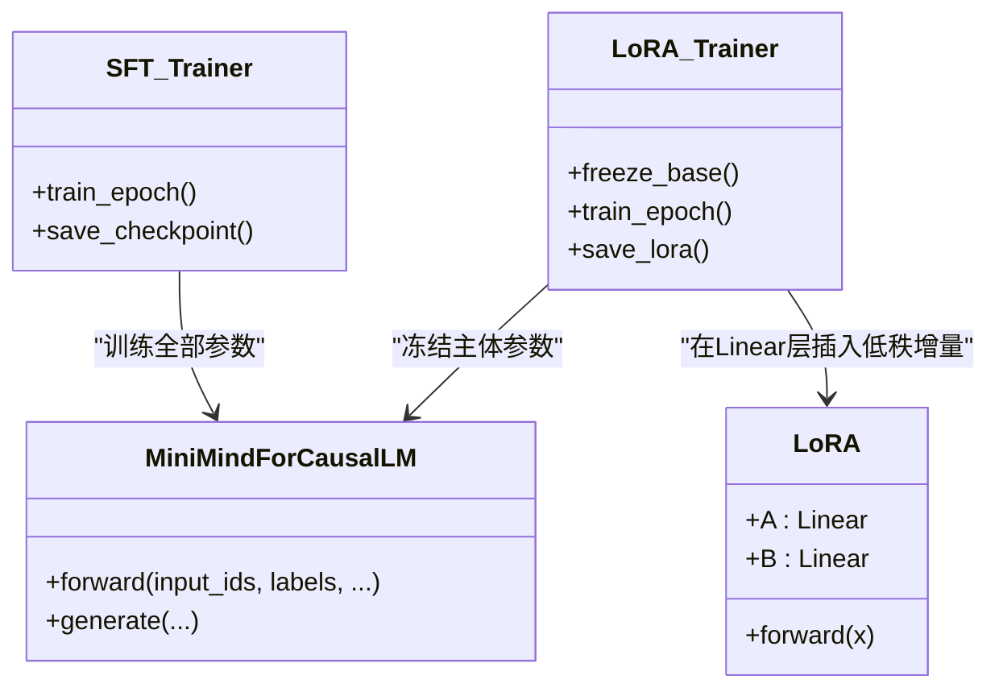
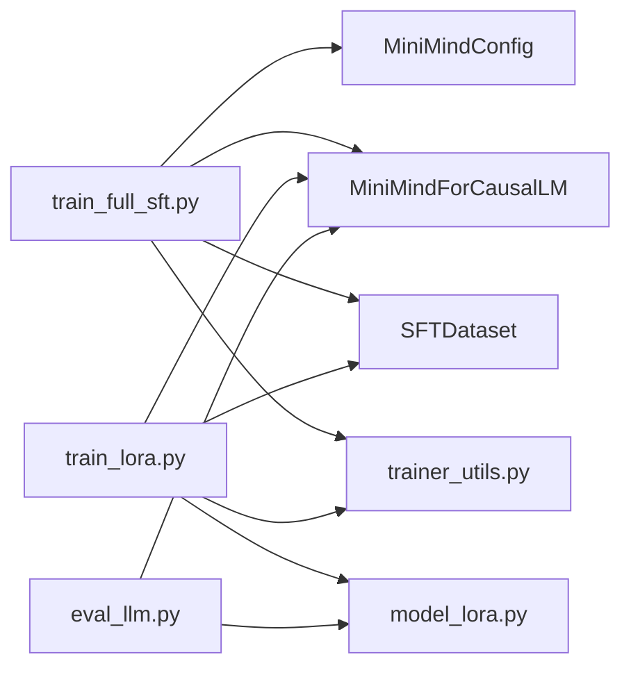

# 监督微调算法

<cite>
**本文引用的文件**
- [train_full_sft.py](file://trainer/train_full_sft.py)
- [train_lora.py](file://trainer/train_lora.py)
- [model_minimind.py](file://model/model_minimind.py)
- [model_lora.py](file://model/model_lora.py)
- [lm_dataset.py](file://dataset/lm_dataset.py)
- [trainer_utils.py](file://trainer/trainer_utils.py)
- [README.md](file://README.md)
- [eval_llm.py](file://eval_llm.py)
</cite>

## 目录
1. [引言](#引言)
2. [项目结构](#项目结构)
3. [核心组件](#核心组件)
4. [架构总览](#架构总览)
5. [详细组件分析](#详细组件分析)
6. [依赖关系分析](#依赖关系分析)
7. [性能考量](#性能考量)
8. [故障排查指南](#故障排查指南)
9. [结论](#结论)
10. [附录](#附录)

## 引言
本文件面向 MiniMind 的监督微调（Supervised Fine-Tuning, SFT）算法，系统阐述目标函数与损失计算、指令跟随数据格式与预处理流程、全参数微调与 LoRA 微调的差异与适用场景，并提供配置参数建议、数据质量控制、过拟合预防与性能评估方法。文档基于仓库中的训练脚本、模型实现与数据集模块进行深入解析，帮助读者从原理到实践全面掌握 SFT 的实现与优化策略。

## 项目结构
MiniMind 的监督微调训练脚本位于 trainer 目录，模型与 LoRA 实现位于 model 目录，数据集处理位于 dataset 目录，训练工具函数位于 trainer/trainer_utils.py，推理与评估入口位于 eval_llm.py。README.md 提供了数据格式规范、训练流程与推荐组合等背景信息。



图表来源
- [train_full_sft.py:134-155](file://trainer/train_full_sft.py#L134-L155)
- [train_lora.py:127-151](file://trainer/train_lora.py#L127-L151)
- [model_minimind.py:229-246](file://model/model_minimind.py#L229-L246)
- [model_lora.py:21-32](file://model/model_lora.py#L21-L32)
- [lm_dataset.py:58-119](file://dataset/lm_dataset.py#L58-L119)
- [trainer_utils.py:63-131](file://trainer/trainer_utils.py#L63-L131)
- [eval_llm.py:12-30](file://eval_llm.py#L12-L30)

章节来源
- [README.md:425-461](file://README.md#L425-L461)
- [lm_dataset.py:58-119](file://dataset/lm_dataset.py#L58-L119)
- [model_minimind.py:229-246](file://model/model_minimind.py#L229-L246)
- [train_full_sft.py:134-155](file://trainer/train_full_sft.py#L134-L155)
- [train_lora.py:127-151](file://trainer/train_lora.py#L127-L151)

## 核心组件
- 监督微调训练器（全参数）
  - 训练循环、学习率调度、混合精度、梯度累积、梯度裁剪、断点续训、分布式训练、日志与可视化。
- 监督微调训练器（LoRA）
  - 在全参数训练器基础上，冻结非 LoRA 参数，仅训练低秩增量，节省显存与计算。
- 模型与损失
  - MiniMindForCausalLM 的 forward 返回交叉熵损失与辅助损失（MoE 路由辅助项）。
- 数据集与预处理
  - SFTDataset 支持多轮对话格式，应用 chat template，生成标签序列，处理 system、tool、reasoning 等模板标记。
- 训练工具
  - 断点续训、分布式初始化、随机种子设置、SkipBatchSampler、模型参数统计等。

章节来源
- [train_full_sft.py:23-81](file://trainer/train_full_sft.py#L23-L81)
- [train_lora.py:24-76](file://trainer/train_lora.py#L24-L76)
- [model_minimind.py:229-246](file://model/model_minimind.py#L229-L246)
- [lm_dataset.py:58-119](file://dataset/lm_dataset.py#L58-L119)
- [trainer_utils.py:63-131](file://trainer/trainer_utils.py#L63-L131)

## 架构总览
监督微调的整体流程：加载配置与模型，初始化分词器，构建 SFTDataset，按分布式采样器与批采样器组织 DataLoader，训练循环中前向计算损失并反向传播，周期性保存权重与日志，支持断点续训与分布式同步。

```mermaid
sequenceDiagram
participant CLI as "命令行"
participant SFT as "train_full_sft.py"
participant DS as "SFTDataset"
participant MM as "MiniMindForCausalLM"
participant OPT as "AdamW优化器"
participant CKPT as "lm_checkpoint"
CLI->>SFT : 解析参数与设备
SFT->>SFT : 初始化分布式/随机种子
SFT->>MM : 初始化模型与分词器
SFT->>DS : 构建SFT数据集
loop 每个epoch
SFT->>DS : DataLoader批采样
loop 每个step
SFT->>MM : 前向(input_ids, labels)
MM-->>SFT : loss, aux_loss, logits
SFT->>OPT : 反向传播与梯度裁剪
OPT-->>SFT : 更新参数
SFT->>CKPT : 周期性保存权重与状态
end
end
```

图表来源
- [train_full_sft.py:134-168](file://trainer/train_full_sft.py#L134-L168)
- [lm_dataset.py:106-119](file://dataset/lm_dataset.py#L106-L119)
- [model_minimind.py:238-246](file://model/model_minimind.py#L238-L246)
- [trainer_utils.py:63-106](file://trainer/trainer_utils.py#L63-L106)

## 详细组件分析

### 目标函数与损失计算
- 交叉熵损失
  - 模型返回的 logits 与 labels 在时间维上错位对齐，忽略填充索引，计算交叉熵损失。
- 辅助损失（MoE）
  - 若使用 MoE，模型会返回 router auxiliary loss，训练时与主损失相加。
- 梯度累积与混合精度
  - 损失按累积步数平均，AMP 自动混合精度，GradScaler 控制数值稳定性。
- 学习率调度
  - 余弦退火式学习率随总步数衰减，保证训练后期稳定收敛。



图表来源
- [model_minimind.py:238-246](file://model/model_minimind.py#L238-L246)
- [train_full_sft.py:34-48](file://trainer/train_full_sft.py#L34-L48)
- [trainer_utils.py:40-41](file://trainer/trainer_utils.py#L40-L41)

章节来源
- [model_minimind.py:238-246](file://model/model_minimind.py#L238-L246)
- [train_full_sft.py:30-58](file://trainer/train_full_sft.py#L30-L58)

### 指令跟随数据格式与预处理
- 数据格式
  - JSONL，每条样本包含 conversations 数组，元素为 role/content/tool_calls/tools 等字段。
- 预处理流程
  - 预处理：为无 system 的对话随机注入 system 提示；清理空思考标签。
  - 应用 chat template：将多轮消息转换为模型可接受的输入序列。
  - 标签生成：仅对 assistant 回复部分的 token 进行监督，其余位置设为忽略索引。
- 最大长度与截断
  - 依据 tokens 长度控制，中文约 1.5~1.7 字符/token，英文约 4~5 字符/token。



图表来源
- [lm_dataset.py:9-119](file://dataset/lm_dataset.py#L9-L119)
- [README.md:441-461](file://README.md#L441-L461)

章节来源
- [lm_dataset.py:58-119](file://dataset/lm_dataset.py#L58-L119)
- [README.md:425-461](file://README.md#L425-L461)

### 全参数微调 vs LoRA 微调
- 全参数微调（SFT）
  - 更新模型全部参数，适合通用指令跟随与对话能力提升，显存与计算开销较大。
- LoRA 微调
  - 在线性层权重旁引入低秩增量，仅训练新增参数，冻结主体权重，显著降低显存与计算成本，适合垂直场景快速适配。
- 参数统计与占比
  - 训练脚本会统计总参数与 LoRA 参数量及其占比，便于评估适配成本。



图表来源
- [model_minimind.py:229-246](file://model/model_minimind.py#L229-L246)
- [model_lora.py:6-32](file://model/model_lora.py#L6-L32)
- [train_full_sft.py:134-155](file://trainer/train_full_sft.py#L134-L155)
- [train_lora.py:127-151](file://trainer/train_lora.py#L127-L151)

章节来源
- [train_full_sft.py:134-155](file://trainer/train_full_sft.py#L134-L155)
- [train_lora.py:127-151](file://trainer/train_lora.py#L127-L151)
- [model_lora.py:21-32](file://model/model_lora.py#L21-L32)

### 训练配置参数与设置建议
- 关键超参数
  - epochs、batch_size、learning_rate、accumulation_steps、grad_clip、max_seq_len、dtype、device、use_wandb、use_compile、from_weight、from_resume。
- 学习率与调度
  - 余弦退火式学习率，随总步数递减，有助于稳定收敛。
- 混合精度与梯度累积
  - AMP 自动混合精度，配合 GradScaler；梯度累积减少显存占用。
- 断点续训
  - 自动保存模型、优化器、scaler 与训练进度，支持跨 GPU 数量恢复。
- 分布式训练
  - DDP 支持，自动忽略某些缓冲参数，保证分布式一致性。

章节来源
- [train_full_sft.py:83-107](file://trainer/train_full_sft.py#L83-L107)
- [train_full_sft.py:109-155](file://trainer/train_full_sft.py#L109-L155)
- [train_lora.py:77-101](file://trainer/train_lora.py#L77-L101)
- [train_lora.py:103-168](file://trainer/train_lora.py#L103-L168)
- [trainer_utils.py:40-41](file://trainer/trainer_utils.py#L40-L41)
- [trainer_utils.py:63-106](file://trainer/trainer_utils.py#L63-L106)

### 数据质量控制、过拟合预防与性能评估
- 数据质量控制
  - 预处理阶段随机注入 system 提示，清理空思考标签，确保对话结构与模板一致性。
  - chat template 统一多轮格式，避免不同数据分支导致的格式漂移。
- 过拟合预防
  - 学习率余弦退火、梯度裁剪、混合精度、断点续训与分布式训练，有助于稳定训练。
  - 建议在验证集上监控 loss 与困惑度，必要时引入早停或学习率调度策略。
- 性能评估
  - 推理脚本支持多轮对话、温度与 top-p 控制、流式输出与生成速度统计。
  - 可结合下游评测集（如 README 中提及的评测）进行定量评估。

章节来源
- [lm_dataset.py:9-35](file://dataset/lm_dataset.py#L9-L35)
- [eval_llm.py:32-94](file://eval_llm.py#L32-L94)
- [README.md:705-734](file://README.md#L705-L734)

## 依赖关系分析
- 训练脚本依赖
  - 训练脚本依赖模型配置与模型实现、数据集模块、训练工具函数与分词器。
- 模块间耦合
  - 训练器与模型通过 forward 返回的损失与辅助损失耦合；数据集与模型通过 tokenizer 与 chat template 耦合。
- 外部依赖
  - 分布式训练依赖 torch.distributed；可视化依赖 swanlab/wandb；推理依赖 transformers。



图表来源
- [train_full_sft.py:16-18](file://trainer/train_full_sft.py#L16-L18)
- [train_lora.py:16-19](file://trainer/train_lora.py#L16-L19)
- [model_minimind.py:10-45](file://model/model_minimind.py#L10-L45)
- [model_lora.py:1-3](file://model/model_lora.py#L1-L3)
- [lm_dataset.py:1-7](file://dataset/lm_dataset.py#L1-L7)
- [trainer_utils.py:15-16](file://trainer/trainer_utils.py#L15-L16)
- [eval_llm.py:6-9](file://eval_llm.py#L6-L9)

章节来源
- [train_full_sft.py:16-18](file://trainer/train_full_sft.py#L16-L18)
- [train_lora.py:16-19](file://trainer/train_lora.py#L16-L19)
- [model_minimind.py:10-45](file://model/model_minimind.py#L10-L45)
- [model_lora.py:1-3](file://model/model_lora.py#L1-L3)
- [lm_dataset.py:1-7](file://dataset/lm_dataset.py#L1-L7)
- [trainer_utils.py:15-16](file://trainer/trainer_utils.py#L15-L16)
- [eval_llm.py:6-9](file://eval_llm.py#L6-L9)

## 性能考量
- 训练效率
  - 混合精度与梯度累积显著降低显存占用；分布式训练可扩展到多卡。
  - torch.compile 可在全参数训练中启用，LoRA 训练中为兼容性自动禁用。
- 推理效率
  - 推理脚本支持温度、top-p、重复惩罚等采样策略，可权衡生成质量与速度。
- 长序列处理
  - YaRN RoPE 外推可在推理时扩展上下文长度，缓解长文本截断影响。

章节来源
- [train_full_sft.py:150-151](file://trainer/train_full_sft.py#L150-L151)
- [train_lora.py:163-165](file://trainer/train_lora.py#L163-L165)
- [eval_llm.py:82-87](file://eval_llm.py#L82-L87)
- [README.md:95-96](file://README.md#L95-L96)

## 故障排查指南
- 断点续训
  - 检查 checkpoints 目录是否存在 resume 文件，确认 world_size 与当前 GPU 数量匹配，必要时自动转换 step。
- 分布式训练
  - 确认 NCCL 后端可用，本地 rank 与设备设置正确；忽略特定缓冲参数以避免 DDP 不一致。
- 混合精度与梯度裁剪
  - AMP 混合精度开启条件与 dtype 一致；梯度裁剪阈值过大可能导致梯度爆炸，过小可能导致收敛缓慢。
- LoRA 兼容性
  - LoRA 与 torch.compile 不兼容，训练脚本会自动禁用 compile 并提示。

章节来源
- [trainer_utils.py:63-106](file://trainer/trainer_utils.py#L63-L106)
- [trainer_utils.py:44-51](file://trainer/trainer_utils.py#L44-L51)
- [train_lora.py:163-165](file://trainer/train_lora.py#L163-L165)

## 结论
MiniMind 的监督微调实现以纯 PyTorch 原生代码为基础，覆盖全参数 SFT 与 LoRA 两种高效微调路径。通过统一的多轮对话数据格式、稳定的损失计算与学习率调度、完善的断点续训与分布式训练支持，能够在小模型规模下实现高质量的指令跟随与对话能力提升。结合数据质量控制、过拟合预防与性能评估方法，可有效保障训练稳定性与效果。

## 附录
- 数据格式参考
  - SFT 数据为 JSONL，包含 conversations 数组，支持 system、tool、reasoning 等模板标记。
- 推荐训练流程
  - 预训练 → 监督微调（SFT）→ 可选：LoRA 微调（垂直场景）→ 推理与评估。
- 模型与权重
  - 训练输出权重文件命名遵循统一前缀与维度后缀，支持自动检测与加载。

章节来源
- [README.md:425-461](file://README.md#L425-L461)
- [README.md:705-734](file://README.md#L705-L734)
- [trainer_utils.py:63-106](file://trainer/trainer_utils.py#L63-L106)