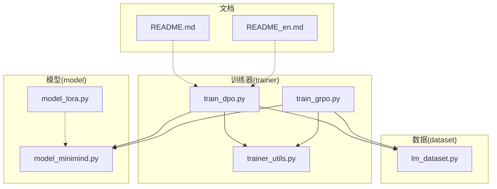
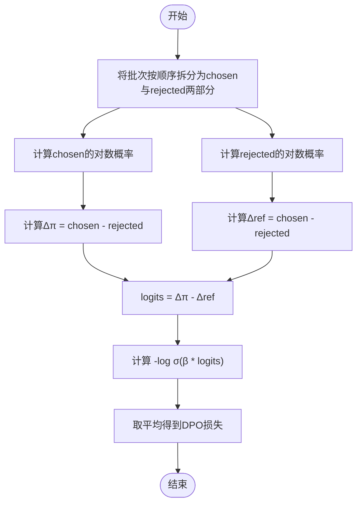
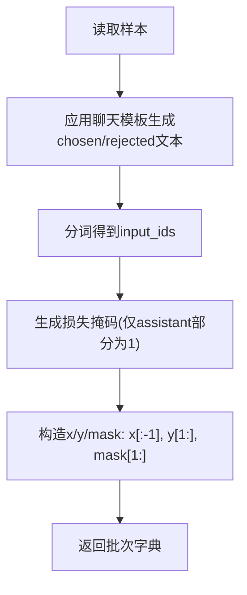
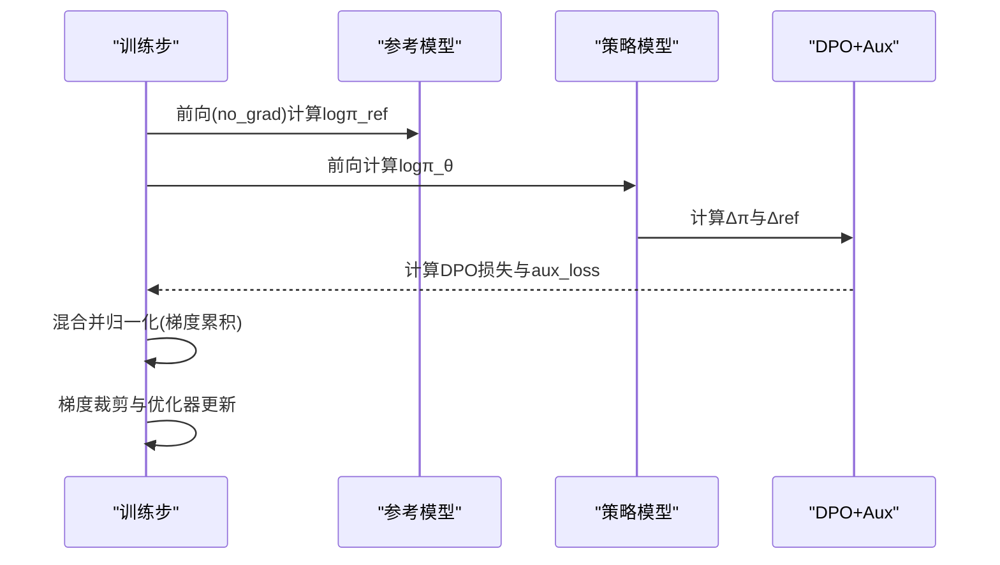
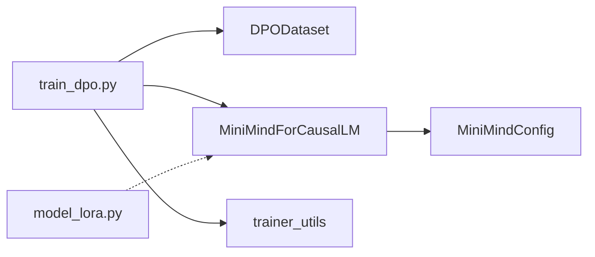

# 直接偏好优化算法

<cite>
**本文引用的文件**
- [train_dpo.py](file://trainer/train_dpo.py)
- [lm_dataset.py](file://dataset/lm_dataset.py)
- [model_minimind.py](file://model/model_minimind.py)
- [model_lora.py](file://model/model_lora.py)
- [trainer_utils.py](file://trainer/trainer_utils.py)
- [README.md](file://README.md)
- [README_en.md](file://README_en.md)
- [train_grpo.py](file://trainer/train_grpo.py)
</cite>

## 目录
1. [引言](#引言)
2. [项目结构](#项目结构)
3. [核心组件](#核心组件)
4. [架构总览](#架构总览)
5. [详细组件分析](#详细组件分析)
6. [依赖关系分析](#依赖关系分析)
7. [性能考量](#性能考量)
8. [故障排查指南](#故障排查指南)
9. [结论](#结论)
10. [附录](#附录)

## 引言
本文件面向 MiniMind 的直接偏好优化（DPO）算法，提供从理论到实现的完整技术文档。内容涵盖：
- DPO 算法的理论基础与损失函数设计，包括偏好建模、似然比估计与优化目标的数学推导
- 偏好数据格式规范与处理流程，包括正样本与负样本的配对策略与数据平衡性考虑
- DPO 训练流程与优化策略，包括参考模型使用、KL 散度约束与正则化项的作用
- DPO 配置参数详解与超参数设置建议
- DPO 与其他 RLHF 方法（如 GRPO）的对比分析与适用场景

## 项目结构
本节聚焦与 DPO 相关的文件与模块，展示其在训练流水线中的位置与职责。



图表来源
- [train_dpo.py:1-226](file://trainer/train_dpo.py#L1-L226)
- [lm_dataset.py:1-256](file://dataset/lm_dataset.py#L1-L256)
- [model_minimind.py:1-280](file://model/model_minimind.py#L1-L280)
- [model_lora.py:1-66](file://model/model_lora.py#L1-L66)
- [trainer_utils.py:1-177](file://trainer/trainer_utils.py#L1-L177)
- [README.md:463-482](file://README.md#L463-L482)
- [README_en.md:462-481](file://README_en.md#L462-L481)

章节来源
- [train_dpo.py:130-226](file://trainer/train_dpo.py#L130-L226)
- [lm_dataset.py:122-193](file://dataset/lm_dataset.py#L122-L193)
- [model_minimind.py:195-280](file://model/model_minimind.py#L195-L280)
- [trainer_utils.py:119-132](file://trainer/trainer_utils.py#L119-L132)

## 核心组件
- DPO 训练脚本：负责加载数据、构建参考模型与策略模型、计算 DPO 损失、执行反向传播与优化、保存检查点与可视化。
- DPO 数据集：负责将偏好对（chosen/rejected）转换为模型可训练的输入/标签与掩码。
- MiniMind 模型：提供前向推理、损失计算与辅助损失（MoE router loss）。
- 训练工具：提供分布式初始化、学习率调度、断点续训、模型加载/保存等通用能力。
- LoRA 模块：提供低秩适配能力，便于参数高效微调（与 DPO 可结合使用）。

章节来源
- [train_dpo.py:24-128](file://trainer/train_dpo.py#L24-L128)
- [lm_dataset.py:122-193](file://dataset/lm_dataset.py#L122-L193)
- [model_minimind.py:229-246](file://model/model_minimind.py#L229-L246)
- [trainer_utils.py:119-132](file://trainer/trainer_utils.py#L119-L132)
- [model_lora.py:21-66](file://model/model_lora.py#L21-L66)

## 架构总览
DPO 的训练流程采用 off-policy 的静态偏好数据集，通过“策略模型 + 参考模型”的双模型结构，直接优化偏好对的对数几率，避免显式的奖励/价值模型训练。训练过程的关键节点如下：

```mermaid
sequenceDiagram
participant Loader as "数据加载器"
participant Ref as "参考模型"
participant Policy as "策略模型"
participant Loss as "DPO损失"
participant Opt as "优化器"
participant CKPT as "检查点/可视化"
Loader->>Policy : 输入x_chosen,x_rejected
Policy-->>Policy : 前向推理得到logits
Policy->>Loss : 计算策略对数概率logπ(y|x)
Loader->>Ref : 输入x_chosen,x_rejected
Ref-->>Ref : 前向推理得到logits
Ref->>Loss : 计算参考对数概率logπ_ref(y|x)
Loss-->>Opt : 计算DPO损失并反向传播
Opt-->>Policy : 更新策略参数
Opt-->>CKPT : 保存权重/记录日志
```

图表来源
- [train_dpo.py:52-128](file://trainer/train_dpo.py#L52-L128)
- [model_minimind.py:229-246](file://model/model_minimind.py#L229-L246)

## 详细组件分析

### DPO 损失函数与数学推导
- 偏好建模：给定输入 x，对每个样本计算“chosen”与“rejected”的对数似然，分别记为 log πθ(y_chosen|x) 与 log πθ(y_rejected|x)。
- 似然比估计：定义策略对数比 Δπ = log πθ(y_chosen|x) − log πθ(y_rejected|x)。
- 参考模型对数比：Δref = log πref(y_chosen|x) − log πref(y_rejected|x)。
- 优化目标：最大化偏好对的对数几率，即最大化 log σ(β · (Δπ − Δref))，其中 β 控制偏离参考模型的程度。
- 损失函数：DPO 损失为 −log σ(β · (Δπ − Δref)) 的期望，通过平均池化与 sigmoid 交叉熵实现。



图表来源
- [train_dpo.py:33-49](file://trainer/train_dpo.py#L33-L49)

章节来源
- [train_dpo.py:24-49](file://trainer/train_dpo.py#L24-L49)
- [README.md:954-966](file://README.md#L954-L966)
- [README_en.md:962-966](file://README_en.md#L962-L966)

### 偏好数据格式与处理流程
- 数据格式：每条样本包含两个对话片段，分别标记为 chosen 与 rejected。chosen 表示更符合偏好的回复，rejected 表示相对较差的回复。
- 数据处理：使用聊天模板将对话片段编码为 input_ids，并生成损失掩码（仅对 assistant 回复部分生效）。随后构造 x/y/mask 的四元组，分别对应输入序列、标签序列与掩码。
- 掩码策略：通过匹配特殊标记 bos_id/eos_id，仅对 assistant 回复部分计算损失，避免对系统提示或用户输入部分产生梯度。



图表来源
- [lm_dataset.py:135-174](file://dataset/lm_dataset.py#L135-L174)

章节来源
- [lm_dataset.py:122-193](file://dataset/lm_dataset.py#L122-L193)
- [README.md:469-482](file://README.md#L469-L482)
- [README_en.md:468-481](file://README_en.md#L468-L481)

### 训练流程与优化策略
- 参考模型：在每个训练步中，参考模型以 no_grad 前向，得到参考对数概率，用于计算 Δref。
- 策略模型：策略模型前向得到策略对数概率，计算 Δπ。
- 损失计算：将 chosen 与 rejected 的对数概率分别求和并按顺序拆分，计算 Δπ − Δref，代入 DPO 损失。
- 正则化项：策略模型的辅助损失（如 MoE router loss）与 DPO 损失相加，作为最终损失。
- 优化：使用 AdamW 优化器，支持梯度累积、梯度裁剪与混合精度；学习率采用余弦退火调度。



图表来源
- [train_dpo.py:52-128](file://trainer/train_dpo.py#L52-L128)
- [model_minimind.py:229-246](file://model/model_minimind.py#L229-L246)

章节来源
- [train_dpo.py:52-128](file://trainer/train_dpo.py#L52-L128)
- [trainer_utils.py:40-42](file://trainer/trainer_utils.py#L40-L42)

### 配置参数与超参数建议
- 学习率：建议 ≤ 5e-8，避免过度扰动参考模型与策略模型的对数概率比。
- 批次大小：根据显存与数据规模选择，注意 chosen/rejected 成对输入会加倍有效样本数。
- beta：控制 DPO 对参考模型偏离的正则化强度，典型范围 0.05–0.3，需结合数据质量与稳定性调优。
- 梯度累积：在显存受限时提高数值稳定性与有效批量。
- 梯度裁剪：建议 1.0，防止异常梯度导致训练发散。
- 混合精度：bfloat16 或 float16，提升吞吐与显存效率。
- 断点续训：支持自动检测与恢复，便于长时间训练与跨 GPU 数量恢复。

章节来源
- [train_dpo.py:130-155](file://trainer/train_dpo.py#L130-L155)
- [trainer_utils.py:63-117](file://trainer/trainer_utils.py#L63-L117)

### 与其他 RLHF 方法的对比
- DPO vs GRPO：DPO 为 off-policy、静态偏好数据，无需奖励/价值模型，实现简单且收敛稳定；GRPO 为 on-policy、在线生成与奖励评分，具有更强的探索能力，但实现复杂度更高。
- 适用场景：DPO 更适合“偏好/安全”对齐与价值对齐；GRPO 更适合需要在线探索与更复杂策略优化的任务。

章节来源
- [README.md:947-966](file://README.md#L947-L966)
- [README_en.md:962-966](file://README_en.md#L962-L966)
- [train_grpo.py:70-200](file://trainer/train_grpo.py#L70-L200)

## 依赖关系分析
- DPO 训练脚本依赖：
  - 数据集：DPODataset 提供 chosen/rejected 的输入/标签/掩码。
  - 模型：MiniMindForCausalLM 提供前向与辅助损失。
  - 工具：分布式初始化、学习率调度、断点续训、模型加载/保存。
- 参考模型与策略模型共享相同的配置与权重加载逻辑，参考模型在训练中冻结梯度。



图表来源
- [train_dpo.py:17-20](file://trainer/train_dpo.py#L17-L20)
- [lm_dataset.py:122-130](file://dataset/lm_dataset.py#L122-L130)
- [model_minimind.py:10-45](file://model/model_minimind.py#L10-L45)
- [trainer_utils.py:119-132](file://trainer/trainer_utils.py#L119-L132)
- [model_lora.py:21-33](file://model/model_lora.py#L21-L33)

章节来源
- [train_dpo.py:17-20](file://trainer/train_dpo.py#L17-L20)
- [lm_dataset.py:122-130](file://dataset/lm_dataset.py#L122-L130)
- [model_minimind.py:10-45](file://model/model_minimind.py#L10-L45)
- [trainer_utils.py:119-132](file://trainer/trainer_utils.py#L119-L132)
- [model_lora.py:21-33](file://model/model_lora.py#L21-L33)

## 性能考量
- 混合精度：在 GPU 上启用 autocast 可显著降低显存占用并提升吞吐。
- 梯度累积：在小批次时提升有效批量，改善稳定性。
- 梯度裁剪：防止异常梯度导致训练发散。
- 分布式训练：支持 DDP，可在多卡环境下扩展训练规模。
- 模型编译：可选启用 torch.compile 以加速推理与训练（需谨慎评估兼容性）。

章节来源
- [train_dpo.py:168-170](file://trainer/train_dpo.py#L168-L170)
- [train_dpo.py:204-210](file://trainer/train_dpo.py#L204-L210)
- [trainer_utils.py:44-51](file://trainer/trainer_utils.py#L44-L51)

## 故障排查指南
- 学习率过高：可能导致策略模型过度偏离参考模型，造成困惑或发散。建议降低学习率并观察 DPO 损失与 aux_loss 的变化。
- 掩码错误：若损失掩码未正确覆盖 assistant 部分，可能导致系统提示或用户输入部分产生梯度，影响收敛。检查 generate_loss_mask 的实现与 bos_id/eos_id 的匹配。
- 参考模型未冻结：参考模型应在训练中禁用梯度，否则会导致训练不稳定。确认 ref_model.eval() 与 requires_grad_(False) 的设置。
- 断点续训异常：检查 checkpoints 目录下 resume 文件是否存在与 world_size 是否匹配，必要时手动调整 step 以适配 GPU 数量变化。
- 混合精度与 dtype：在 CPU 或不支持 bfloat16 的设备上，dtype 应设为 float16 或关闭混合精度。

章节来源
- [train_dpo.py:184-188](file://trainer/train_dpo.py#L184-L188)
- [lm_dataset.py:176-192](file://dataset/lm_dataset.py#L176-L192)
- [trainer_utils.py:63-117](file://trainer/trainer_utils.py#L63-L117)

## 结论
DPO 通过直接优化偏好对的对数几率，实现了无需奖励/价值模型的高效对齐训练。在 MiniMind 的实现中，参考模型与策略模型共享配置与权重加载逻辑，训练流程简洁稳定，适合“偏好/安全”对齐任务。配合合理的超参数与训练策略，DPO 能在小模型上取得良好的效果，并与 LoRA 等参数高效微调方法结合，进一步降低训练成本。

## 附录
- 训练命令与参数示例可参考训练脚本中的参数定义与 README 中的说明。
- 若需与其他 RLHF 方法（如 GRPO）进行对比，可参考对应的训练脚本与 README 描述。

章节来源
- [train_dpo.py:130-155](file://trainer/train_dpo.py#L130-L155)
- [README.md:947-966](file://README.md#L947-L966)
- [README_en.md:962-966](file://README_en.md#L962-L966)