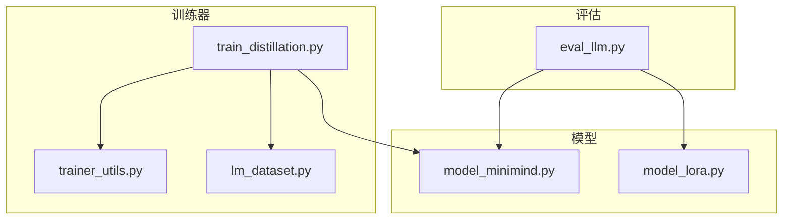
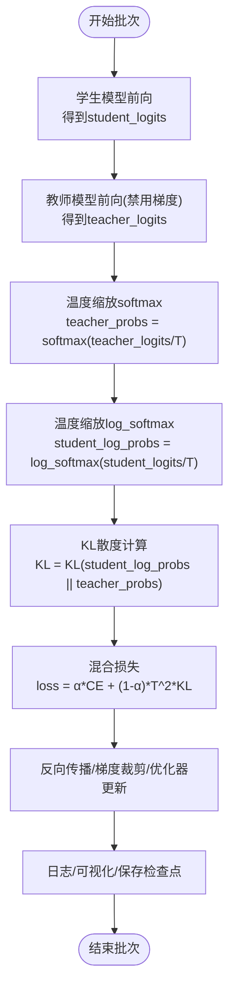
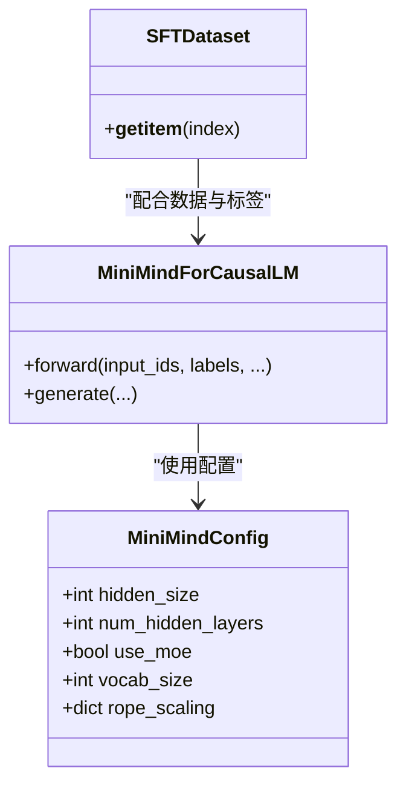
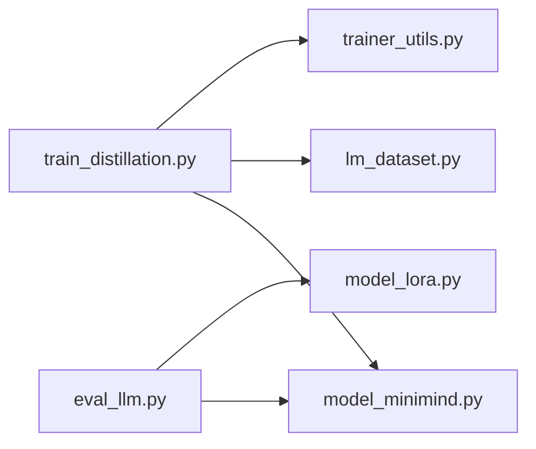

# 知识蒸馏算法

<cite>
**本文引用的文件**
- [train_distillation.py](file://trainer/train_distillation.py)
- [model_minimind.py](file://model/model_minimind.py)
- [model_lora.py](file://model/model_lora.py)
- [trainer_utils.py](file://trainer/trainer_utils.py)
- [lm_dataset.py](file://dataset/lm_dataset.py)
- [README.md](file://README.md)
- [eval_llm.py](file://eval_llm.py)
</cite>

## 目录
1. [引言](#引言)
2. [项目结构](#项目结构)
3. [核心组件](#核心组件)
4. [架构总览](#架构总览)
5. [详细组件分析](#详细组件分析)
6. [依赖关系分析](#依赖关系分析)
7. [性能考量](#性能考量)
8. [故障排查指南](#故障排查指南)
9. [结论](#结论)
10. [附录](#附录)

## 引言
本文件针对 MiniMind 项目中的知识蒸馏（Knowledge Distillation, KD）实现进行全面技术文档化，涵盖理论基础、实现原理、训练流程、参数配置、评估与压缩效率分析等内容。蒸馏在本项目中采用白盒蒸馏思路，即在交叉熵监督损失之外，额外使用教师模型输出的软标签分布进行 KL 散度蒸馏，结合温度参数与混合损失，实现学生模型对教师模型“分布偏好”的学习。文档同时解释教师-学生模型关系、软标签生成、损失函数设计、温度调节、MoE 与 Dense 组合蒸馏、渐进式蒸馏策略，以及蒸馏配置参数的设置建议与评估方法。

## 项目结构
MiniMind 的蒸馏训练入口位于训练器目录，核心文件包括蒸馏训练脚本、模型定义、数据集封装、训练工具与评估脚本等。蒸馏训练脚本负责加载教师/学生模型、构造混合损失、执行训练循环与断点续训；模型定义提供 MiniMind 的 Dense 与 MoE 架构；数据集封装提供 SFT 数据读取与标签掩码；训练工具提供分布式、混合精度、学习率调度、检查点管理等通用能力；评估脚本提供推理与对话能力。



图表来源
- [train_distillation.py:145-246](file://trainer/train_distillation.py#L145-L246)
- [model_minimind.py:195-280](file://model/model_minimind.py#L195-L280)
- [lm_dataset.py:58-120](file://dataset/lm_dataset.py#L58-L120)
- [trainer_utils.py:119-131](file://trainer/trainer_utils.py#L119-L131)
- [eval_llm.py:12-31](file://eval_llm.py#L12-L31)

章节来源
- [train_distillation.py:145-246](file://trainer/train_distillation.py#L145-L246)
- [model_minimind.py:195-280](file://model/model_minimind.py#L195-L280)
- [lm_dataset.py:58-120](file://dataset/lm_dataset.py#L58-L120)
- [trainer_utils.py:119-131](file://trainer/trainer_utils.py#L119-L131)
- [eval_llm.py:12-31](file://eval_llm.py#L12-L31)

## 核心组件
- 蒸馏损失函数：基于温度缩放的 KL 散度，结合交叉熵监督损失，形成混合损失。
- 教师-学生模型：教师模型在蒸馏阶段仅前向且禁用梯度，学生模型参与反向更新。
- 数据集与标签：SFT 数据集提供输入与标签，蒸馏阶段使用教师模型输出的软标签。
- 训练工具：分布式、混合精度、学习率调度、断点续训、检查点保存。
- 评估与推理：提供推理脚本与对话接口，支持生成参数与流式输出。

章节来源
- [train_distillation.py:24-36](file://trainer/train_distillation.py#L24-L36)
- [train_distillation.py:38-143](file://trainer/train_distillation.py#L38-L143)
- [lm_dataset.py:58-120](file://dataset/lm_dataset.py#L58-L120)
- [trainer_utils.py:40-42](file://trainer/trainer_utils.py#L40-L42)
- [trainer_utils.py:63-117](file://trainer/trainer_utils.py#L63-L117)
- [eval_llm.py:32-94](file://eval_llm.py#L32-L94)

## 架构总览
蒸馏训练的整体流程如下：解析命令行参数，初始化分布式与随机种子，构建学生/教师模型配置与实例，加载 SFT 数据集，定义优化器与混合精度上下文，进入训练循环。每个批次中，学生模型前向得到 logits，教师模型在禁用梯度下前向得到 logits，二者共同参与混合损失计算，随后进行反向与优化器更新。训练期间定期记录日志与可视化指标，并按间隔保存检查点与权重。

```mermaid
sequenceDiagram
participant CLI as "命令行参数"
participant Init as "初始化"
participant Loader as "数据加载器"
participant Student as "学生模型"
participant Teacher as "教师模型"
participant Loss as "混合损失"
participant Opt as "优化器"
participant CKP as "检查点"
CLI->>Init : 解析参数/分布式/随机种子
Init->>Student : 构建学生模型配置与实例
Init->>Teacher : 构建教师模型配置与实例
Init->>Loader : 构建SFT数据加载器
loop 训练批次
Loader->>Student : 输入ids/labels
Student->>Student : 前向得到student_logits
Teacher->>Teacher : 前向得到teacher_logits(禁用梯度)
Student->>Loss : 计算CE损失
Teacher->>Loss : 计算软标签(温度缩放)
Loss->>Loss : KL蒸馏损失(T^2·KL)
Loss->>Opt : 反向与梯度裁剪
Opt->>Student : 更新参数
Student->>CKP : 定期保存权重与检查点
end
```

图表来源
- [train_distillation.py:178-243](file://trainer/train_distillation.py#L178-L243)
- [lm_dataset.py:58-120](file://dataset/lm_dataset.py#L58-L120)
- [trainer_utils.py:63-117](file://trainer/trainer_utils.py#L63-L117)

## 详细组件分析

### 蒸馏损失与软标签生成
- 软标签生成：教师模型在禁用梯度下前向，输出 logits，按温度参数进行 softmax 归一化，得到教师软标签分布。学生模型前向得到 logits，按相同温度参数进行 log_softmax，用于 KL 散度计算。
- 混合损失：总损失为 α·CE + (1-α)·T²·KL，其中 α 控制监督损失与蒸馏损失的比重，T 为温度参数，T² 用于放大 KL 散度的梯度影响。
- 损失掩码：仅对有效 token（非填充）参与损失计算，提高训练稳定性与效率。



图表来源
- [train_distillation.py:24-36](file://trainer/train_distillation.py#L24-L36)
- [train_distillation.py:68-92](file://trainer/train_distillation.py#L68-L92)

章节来源
- [train_distillation.py:24-36](file://trainer/train_distillation.py#L24-L36)
- [train_distillation.py:68-92](file://trainer/train_distillation.py#L68-L92)

### 教师-学生模型关系与配置
- 学生模型：基于 MiniMindConfig 构建，可配置隐藏维度、层数、是否使用 MoE；训练时参与参数更新与反向。
- 教师模型：同样基于 MiniMindConfig 构建，但在蒸馏阶段禁用梯度与训练模式，仅用于生成软标签。
- 维度与 MoE：支持不同隐藏维度与层数组合，可实现 Dense→Dense、Dense→MoE、MoE→Dense、MoE→MoE 等组合蒸馏；蒸馏时会将教师 logits 截断到学生词表维度以匹配输出层。



图表来源
- [model_minimind.py:10-45](file://model/model_minimind.py#L10-L45)
- [model_minimind.py:229-246](file://model/model_minimind.py#L229-L246)
- [lm_dataset.py:58-120](file://dataset/lm_dataset.py#L58-L120)

章节来源
- [model_minimind.py:10-45](file://model/model_minimind.py#L10-L45)
- [model_minimind.py:229-246](file://model/model_minimind.py#L229-L246)
- [train_distillation.py:184-209](file://trainer/train_distillation.py#L184-L209)

### 渐进式蒸馏策略
- 阶段化训练：先完成预训练与 SFT，再进行蒸馏，确保学生模型具备基础语言能力与指令跟随能力，再通过教师软标签进一步提升生成质量与风格一致性。
- 渐进式温度：温度参数可在训练初期较大以增强软标签引导，后期可适当降低以稳定收敛。
- 渐进式权重：蒸馏可叠加在已有 SFT 权重之上，形成“SFT→蒸馏”的渐进式能力提升路径。

章节来源
- [README.md:740-763](file://README.md#L740-L763)

### 不同蒸馏方法与应用场景
- 白盒蒸馏（本实现）：使用教师模型输出的软标签分布进行 KL 蒸馏，适合提升学生模型对候选 token 的相对偏好学习，改善生成稳定性与风格一致性。
- 黑盒蒸馏：以教师生成的答案作为监督信号进行 SFT，适合快速利用强教师模型的高质量回答进行能力迁移。
- 双向蒸馏：在本实现中未直接体现，但可扩展为互为教师/学生交替蒸馏，以增强双方的互补性。

章节来源
- [README.md:740-763](file://README.md#L740-L763)

### 蒸馏配置参数详解
- 温度参数（temperature）：控制软标签分布的平滑程度，推荐范围 1.0–2.0；数值越高，软标签越平滑，蒸馏引导越强。
- 蒸馏系数（alpha）：控制 CE 损失与 KL 损失的比重，典型取值 0.3–0.7；α 越大，监督信号越强，α 越小，软标签引导越强。
- 学习率（learning_rate）：建议与 SFT 阶段相近，可按经验从 5e-6 开始尝试；若蒸馏不稳定，可适当降低。
- 梯度累积（accumulation_steps）：在显存受限时增大累积步数，有助于稳定训练。
- 梯度裁剪（grad_clip）：防止梯度爆炸，建议 0.5–1.0。
- 混合精度（dtype）：bfloat16 或 float16，结合 GradScaler 使用。
- 断点续训（from_resume）：支持自动检测与恢复训练进度，便于长时间训练。
- 分布式训练（DDP）：支持多卡训练，自动设置本地设备与同步参数。

章节来源
- [train_distillation.py:147-176](file://trainer/train_distillation.py#L147-L176)
- [trainer_utils.py:40-42](file://trainer/trainer_utils.py#L40-L42)
- [trainer_utils.py:63-117](file://trainer/trainer_utils.py#L63-L117)

### 蒸馏效果评估与性能保持度验证
- 评估指标：可使用困惑度（Perplexity）、BLEU、ROUGE、人工评分等；对事实性与逻辑性可采用专门的评测任务。
- 模型压缩效率：通过对比蒸馏前后参数量、推理速度、显存占用等指标衡量压缩效率。
- 性能保持度：对比蒸馏前后的生成质量、指令跟随能力、工具调用能力等，确保蒸馏后性能不显著下降。

章节来源
- [README.md:1574-1582](file://README.md#L1574-L1582)

## 依赖关系分析
蒸馏训练脚本依赖模型定义、数据集封装与训练工具模块；模型定义提供 MiniMind 的 Dense 与 MoE 架构；数据集封装提供 SFT 数据读取与标签掩码；训练工具提供分布式、混合精度、学习率调度、断点续训等能力。



图表来源
- [train_distillation.py:17-19](file://trainer/train_distillation.py#L17-L19)
- [model_minimind.py:1-6](file://model/model_minimind.py#L1-L6)
- [lm_dataset.py:1-7](file://dataset/lm_dataset.py#L1-L7)
- [trainer_utils.py:15-16](file://trainer/trainer_utils.py#L15-L16)
- [eval_llm.py:6-8](file://eval_llm.py#L6-L8)

章节来源
- [train_distillation.py:17-19](file://trainer/train_distillation.py#L17-L19)
- [model_minimind.py:1-6](file://model/model_minimind.py#L1-L6)
- [lm_dataset.py:1-7](file://dataset/lm_dataset.py#L1-L7)
- [trainer_utils.py:15-16](file://trainer/trainer_utils.py#L15-L16)
- [eval_llm.py:6-8](file://eval_llm.py#L6-L8)

## 性能考量
- 温度与混合损失：温度过高可能导致软标签过于平滑，影响学生模型的判别能力；α 过小可能导致蒸馏主导而忽略监督信号。
- 梯度累积与混合精度：在显存受限时合理设置累积步数与 dtype，可提升训练稳定性与吞吐。
- 分布式与断点续训：多卡训练与检查点恢复可显著缩短训练周期，提升资源利用率。
- 数据质量与掩码：SFT 数据的质量与标签掩码对蒸馏效果至关重要，需确保有效 token 的比例与分布合理。

## 故障排查指南
- 学习率过高导致震荡：适当降低学习率或启用学习率调度。
- 显存不足：减小 batch size、增大 accumulation_steps、使用混合精度。
- 温度过高/过低：根据蒸馏稳定性调整温度，初期可较高，后期逐步降低。
- 分布式环境异常：检查 NCCL 环境变量与本地设备号设置。
- 断点续训不生效：确认检查点文件存在且与当前 GPU 数量兼容，必要时手动调整 step。

章节来源
- [trainer_utils.py:40-42](file://trainer/trainer_utils.py#L40-L42)
- [trainer_utils.py:63-117](file://trainer/trainer_utils.py#L63-L117)
- [train_distillation.py:178-181](file://trainer/train_distillation.py#L178-L181)

## 结论
MiniMind 的知识蒸馏实现采用白盒蒸馏思路，通过温度缩放的软标签与混合损失，使学生模型在保留监督信号的同时学习教师模型的分布偏好，从而提升生成质量与风格一致性。结合渐进式训练策略、分布式与断点续训能力，可在有限资源下高效完成蒸馏训练。建议在实践中根据任务需求与资源状况，合理设置温度、蒸馏系数与学习率等超参数，并通过多维度评估指标验证蒸馏效果与压缩效率。

## 附录
- 推理与对话：提供推理脚本与对话接口，支持生成参数与流式输出，便于蒸馏后模型的快速验证与演示。
- LoRA 扩展：可结合 LoRA 进行参数高效微调，进一步降低训练成本与部署复杂度。

章节来源
- [eval_llm.py:32-94](file://eval_llm.py#L32-L94)
- [model_lora.py:21-66](file://model/model_lora.py#L21-L66)