# 训练工具与实用程序

<cite>
**本文引用的文件**
- [trainer/trainer_utils.py](file://trainer/trainer_utils.py)
- [trainer/train_full_sft.py](file://trainer/train_full_sft.py)
- [trainer/train_lora.py](file://trainer/train_lora.py)
- [trainer/train_dpo.py](file://trainer/train_dpo.py)
- [trainer/train_ppo.py](file://trainer/train_ppo.py)
- [trainer/train_grpo.py](file://trainer/train_grpo.py)
- [trainer/train_distillation.py](file://trainer/train_distillation.py)
- [trainer/train_pretrain.py](file://trainer/train_pretrain.py)
- [trainer/rollout_engine.py](file://trainer/rollout_engine.py)
- [model/model_minimind.py](file://model/model_minimind.py)
- [model/model_lora.py](file://model/model_lora.py)
- [dataset/lm_dataset.py](file://dataset/lm_dataset.py)
- [README.md](file://README.md)
</cite>

## 目录
1. [引言](#引言)
2. [项目结构](#项目结构)
3. [核心组件](#核心组件)
4. [架构总览](#架构总览)
5. [详细组件分析](#详细组件分析)
6. [依赖关系分析](#依赖关系分析)
7. [性能考量](#性能考量)
8. [故障排除指南](#故障排除指南)
9. [结论](#结论)
10. [附录](#附录)

## 引言
本文件面向 MiniMind 训练工具与实用程序，系统梳理分布式训练初始化、随机种子设置、混合精度训练、检查点管理、学习率调度、日志与可视化、性能监控、内存与 GPU 优化、训练可视化、调试工具与故障排除等主题。文档以训练脚本与工具函数为线索，结合模型与数据集实现，提供从代码级到系统级的全景式说明，既适合初学者循序渐进理解，也便于有经验的工程师快速定位实现细节。

## 项目结构
项目采用“按功能域划分”的模块化组织：
- trainer：训练脚本与通用训练工具
- model：模型定义与 LoRA 实现
- dataset：数据集加载与预处理
- scripts：推理与服务端脚本
- 根目录 README：训练流程、数据集与使用说明

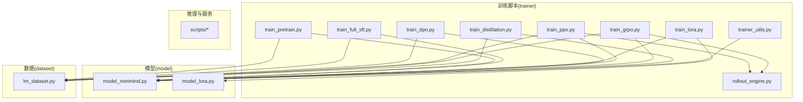

图表来源
- [trainer/train_pretrain.py:1-170](file://trainer/train_pretrain.py#L1-170)
- [trainer/train_full_sft.py:1-171](file://trainer/train_full_sft.py#L1-171)
- [trainer/train_lora.py:1-184](file://trainer/train_lora.py#L1-184)
- [trainer/train_dpo.py:1-226](file://trainer/train_dpo.py#L1-226)
- [trainer/train_ppo.py:1-444](file://trainer/train_ppo.py#L1-444)
- [trainer/train_grpo.py:1-332](file://trainer/train_grpo.py#L1-332)
- [trainer/train_distillation.py:1-246](file://trainer/train_distillation.py#L1-246)
- [trainer/trainer_utils.py:1-177](file://trainer/trainer_utils.py#L1-177)
- [trainer/rollout_engine.py:1-213](file://trainer/rollout_engine.py#L1-213)
- [model/model_minimind.py:1-280](file://model/model_minimind.py#L1-280)
- [model/model_lora.py:1-66](file://model/model_lora.py#L1-66)
- [dataset/lm_dataset.py:1-256](file://dataset/lm_dataset.py#L1-256)

章节来源
- [README.md:320-370](file://README.md#L320-L370)

## 核心组件
- 分布式训练初始化与设备选择：通过环境变量检测 DDP，初始化进程组并设置本地 GPU 设备。
- 随机种子设置：统一设置 Python、NumPy、PyTorch 及 cudnn，保证可复现性。
- 混合精度训练：根据设备类型选择 autocast 类型（bfloat16/float16），配合 GradScaler。
- 检查点管理：保存模型权重、优化器状态、训练进度、可选扩展字段（如 scheduler、critic 等），并支持跨 GPU 数量恢复。
- 学习率调度：余弦退火（CosineAnnealingLR）与自定义余弦退火学习率函数。
- 日志与可视化：统一 Logger 输出，训练指标通过 SwanLab（兼容 W&B）记录。
- 数据与采样：SkipBatchSampler 跳过前若干 batch，支持分布式采样与随机打乱。
- 推理引擎：Torch 原生与 SGLang HTTP 两种 rollout 引擎，支持热更新权重。

章节来源
- [trainer/trainer_utils.py:44-117](file://trainer/trainer_utils.py#L44-L117)
- [trainer/train_full_sft.py:109-171](file://trainer/train_full_sft.py#L109-L171)
- [trainer/train_lora.py:103-184](file://trainer/train_lora.py#L103-L184)
- [trainer/train_dpo.py:157-226](file://trainer/train_dpo.py#L157-L226)
- [trainer/train_ppo.py:348-444](file://trainer/train_ppo.py#L348-L444)
- [trainer/train_grpo.py:245-332](file://trainer/train_grpo.py#L245-L332)
- [trainer/train_distillation.py:178-246](file://trainer/train_distillation.py#L178-L246)
- [trainer/rollout_engine.py:196-213](file://trainer/rollout_engine.py#L196-L213)

## 架构总览
训练流程以“脚本驱动 + 工具函数 + 模型/数据集”为核心，统一通过分布式初始化、混合精度、GradScaler、学习率调度与检查点管理串联起各阶段训练。

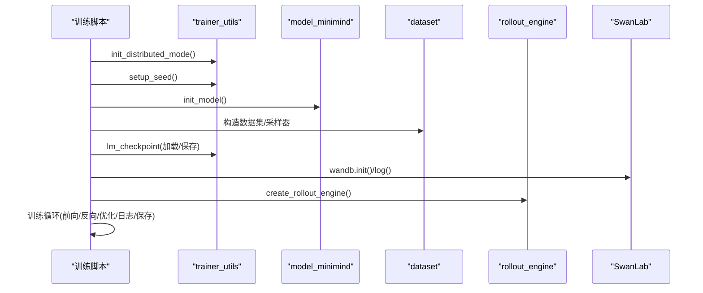

图表来源
- [trainer/train_full_sft.py:109-171](file://trainer/train_full_sft.py#L109-L171)
- [trainer/trainer_utils.py:44-117](file://trainer/trainer_utils.py#L44-L117)
- [trainer/rollout_engine.py:196-213](file://trainer/rollout_engine.py#L196-L213)

## 详细组件分析

### 分布式训练初始化与设备选择
- 通过环境变量判断是否启用 DDP，初始化进程组并设置本地 GPU 设备。
- 在多卡场景下，设备字符串自动修正为“cuda:local_rank”。

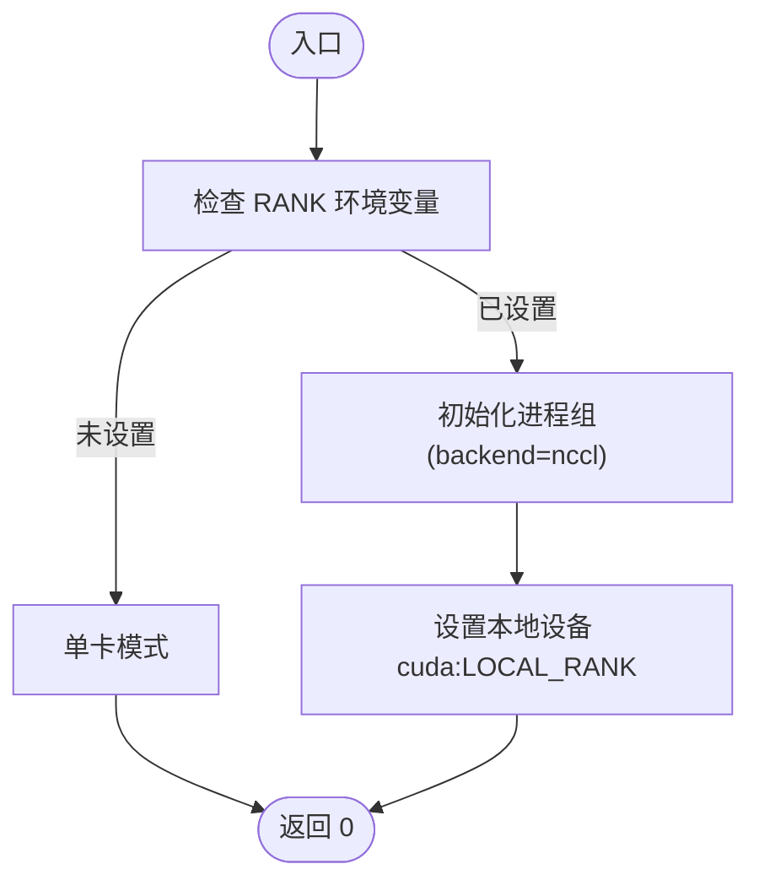

图表来源
- [trainer/trainer_utils.py:44-51](file://trainer/trainer_utils.py#L44-L51)
- [trainer/train_full_sft.py:110-112](file://trainer/train_full_sft.py#L110-L112)

章节来源
- [trainer/trainer_utils.py:44-51](file://trainer/trainer_utils.py#L44-L51)
- [trainer/train_full_sft.py:109-112](file://trainer/train_full_sft.py#L109-L112)

### 随机种子设置
- 统一设置 Python、NumPy、PyTorch、CUDA、cuDNN 的随机种子，保证可复现性。
- DDP 场景下，种子在 rank 基础上加偏移，避免同种随机数序列。

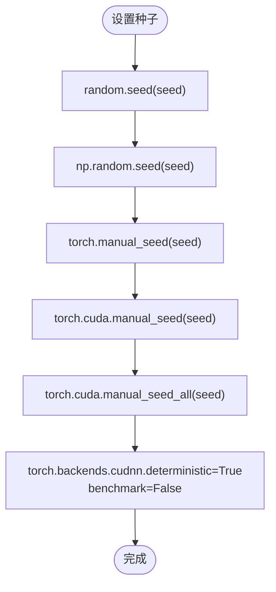

图表来源
- [trainer/trainer_utils.py:54-62](file://trainer/trainer_utils.py#L54-L62)

章节来源
- [trainer/trainer_utils.py:54-62](file://trainer/trainer_utils.py#L54-L62)
- [trainer/train_full_sft.py:111-112](file://trainer/train_full_sft.py#L111-L112)

### 混合精度训练与 GradScaler
- 根据设备类型选择 autocast dtype（bfloat16/float16），CPU 直接使用上下文。
- 使用 GradScaler 管理 loss 缩放与梯度更新，支持梯度裁剪。

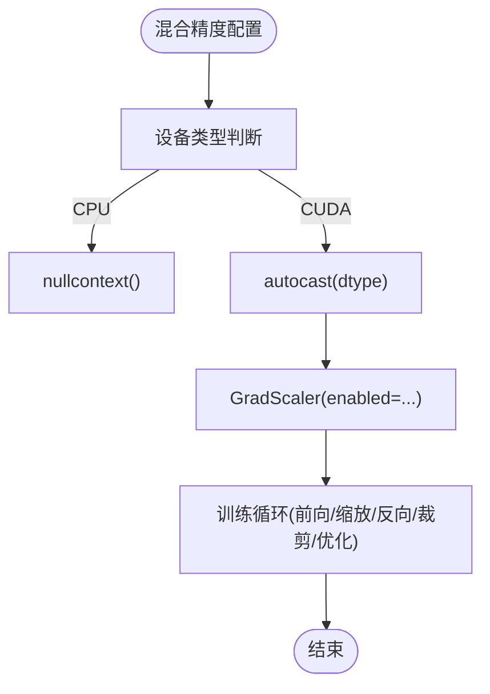

图表来源
- [trainer/train_full_sft.py:119-138](file://trainer/train_full_sft.py#L119-L138)
- [trainer/train_lora.py:113-151](file://trainer/train_lora.py#L113-L151)
- [trainer/train_dpo.py:167-193](file://trainer/train_dpo.py#L167-L193)
- [trainer/train_ppo.py:358-405](file://trainer/train_ppo.py#L358-L405)
- [trainer/train_grpo.py:256-297](file://trainer/train_grpo.py#L256-L297)
- [trainer/train_distillation.py:189-213](file://trainer/train_distillation.py#L189-L213)

章节来源
- [trainer/train_full_sft.py:119-138](file://trainer/train_full_sft.py#L119-L138)
- [trainer/train_lora.py:113-151](file://trainer/train_lora.py#L113-L151)
- [trainer/train_dpo.py:167-193](file://trainer/train_dpo.py#L167-L193)
- [trainer/train_ppo.py:358-405](file://trainer/train_ppo.py#L358-L405)
- [trainer/train_grpo.py:256-297](file://trainer/train_grpo.py#L256-L297)
- [trainer/train_distillation.py:189-213](file://trainer/train_distillation.py#L189-L213)

### 检查点管理系统
- 保存模型权重：将 state_dict 转半精度并持久化，使用临时文件原子替换。
- 保存完整状态：包含模型、优化器、可选 scaler、epoch、step、world_size、wandb_id，以及任意扩展字段。
- 加载模式：自动检测并加载最近检查点，支持跨 GPU 数量 step 调整。
- 释放显存：保存后主动清理中间张量并触发缓存回收。

```mermaid
sequenceDiagram
participant CKP as "lm_checkpoint"
participant FS as "文件系统"
participant GPU as "GPU显存"
CKP->>CKP : 序列化模型权重(半精度)
CKP->>FS : 写入临时文件(.tmp)
FS-->>CKP : 原子替换为正式文件
CKP->>CKP : 组装resume数据(模型/优化器/scaler/epoch/step/wandb_id/扩展字段)
CKP->>FS : 写入resume临时文件
FS-->>CKP : 原子替换为正式resume文件
CKP->>GPU : del state_dict/resume_data; torch.cuda.empty_cache()
```

图表来源
- [trainer/trainer_utils.py:63-117](file://trainer/trainer_utils.py#L63-L117)

章节来源
- [trainer/trainer_utils.py:63-117](file://trainer/trainer_utils.py#L63-L117)

### 学习率调度器与余弦退火
- 自定义余弦退火学习率函数：随训练步数线性衰减，结合余弦曲线实现平滑下降。
- PPO/GRPO/蒸馏等脚本使用 CosineAnnealingLR，按总优化步数设置 T_max，支持 eta_min。

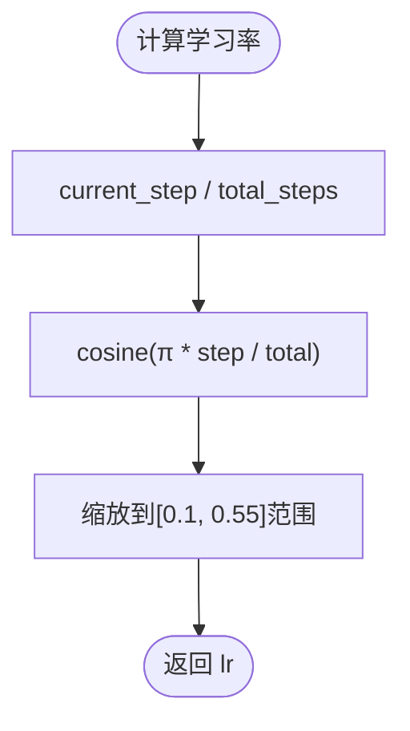

图表来源
- [trainer/trainer_utils.py:40-42](file://trainer/trainer_utils.py#L40-L42)
- [trainer/train_ppo.py:404-405](file://trainer/train_ppo.py#L404-L405)
- [trainer/train_grpo.py:296-297](file://trainer/train_grpo.py#L296-L297)
- [trainer/train_distillation.py:212-213](file://trainer/train_distillation.py#L212-L213)

章节来源
- [trainer/trainer_utils.py:40-42](file://trainer/trainer_utils.py#L40-L42)
- [trainer/train_ppo.py:404-405](file://trainer/train_ppo.py#L404-L405)
- [trainer/train_grpo.py:296-297](file://trainer/train_grpo.py#L296-L297)
- [trainer/train_distillation.py:212-213](file://trainer/train_distillation.py#L212-L213)

### 日志记录与可视化
- 统一 Logger：仅主进程打印，避免重复日志。
- SwanLab 可视化：训练指标（loss、lr、epoch_time 等）自动记录，支持断点续训恢复同一 run。

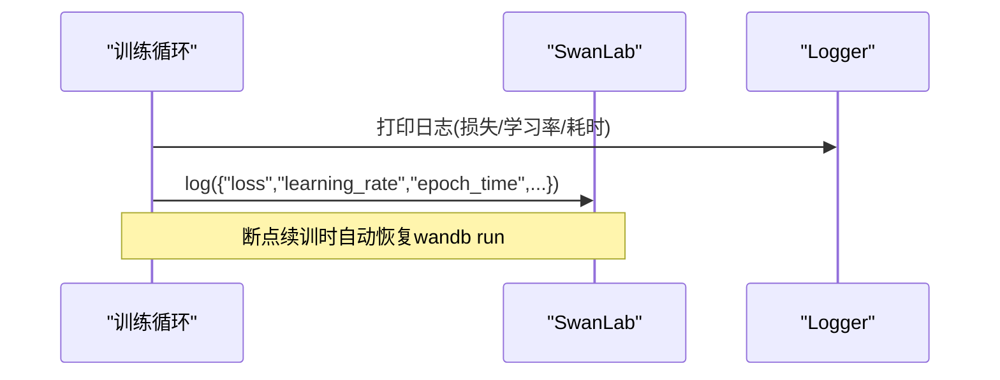

图表来源
- [trainer/train_full_sft.py:50-58](file://trainer/train_full_sft.py#L50-L58)
- [trainer/train_dpo.py:95-105](file://trainer/train_dpo.py#L95-L105)
- [trainer/train_ppo.py:264-274](file://trainer/train_ppo.py#L264-L274)
- [trainer/train_grpo.py:169-178](file://trainer/train_grpo.py#L169-L178)

章节来源
- [trainer/train_full_sft.py:50-58](file://trainer/train_full_sft.py#L50-L58)
- [trainer/train_dpo.py:95-105](file://trainer/train_dpo.py#L95-L105)
- [trainer/train_ppo.py:264-274](file://trainer/train_ppo.py#L264-L274)
- [trainer/train_grpo.py:169-178](file://trainer/train_grpo.py#L169-L178)

### 数据采样与 SkipBatchSampler
- SkipBatchSampler：跳过前若干 batch，支持分布式采样器与随机打乱索引。
- 训练脚本在恢复时根据 start_step 计算 skip，确保从正确 step 继续。

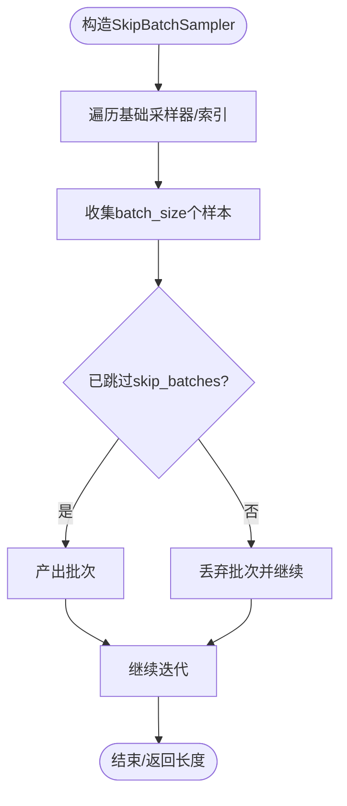

图表来源
- [trainer/trainer_utils.py:134-158](file://trainer/trainer_utils.py#L134-L158)
- [trainer/train_full_sft.py:160-168](file://trainer/train_full_sft.py#L160-L168)
- [trainer/train_lora.py:171-181](file://trainer/train_lora.py#L171-L181)
- [trainer/train_dpo.py:213-223](file://trainer/train_dpo.py#L213-L223)
- [trainer/train_ppo.py:431-441](file://trainer/train_ppo.py#L431-L441)
- [trainer/train_grpo.py:318-329](file://trainer/train_grpo.py#L318-L329)
- [trainer/train_distillation.py:234-243](file://trainer/train_distillation.py#L234-L243)

章节来源
- [trainer/trainer_utils.py:134-158](file://trainer/trainer_utils.py#L134-L158)
- [trainer/train_full_sft.py:160-168](file://trainer/train_full_sft.py#L160-L168)
- [trainer/train_lora.py:171-181](file://trainer/train_lora.py#L171-L181)
- [trainer/train_dpo.py:213-223](file://trainer/train_dpo.py#L213-L223)
- [trainer/train_ppo.py:431-441](file://trainer/train_ppo.py#L431-L441)
- [trainer/train_grpo.py:318-329](file://trainer/train_grpo.py#L318-L329)
- [trainer/train_distillation.py:234-243](file://trainer/train_distillation.py#L234-L243)

### 推理引擎与 rollout
- RolloutEngine 抽象：定义 rollout 与 update_policy 接口。
- TorchRolloutEngine：使用模型 generate 获取输出，计算每 token 对数概率。
- SGLangRolloutEngine：通过 HTTP API 与 SGLang 服务通信，支持权重热更新与缓存刷新。
- 工厂函数 create_rollout_engine：按类型创建引擎实例。

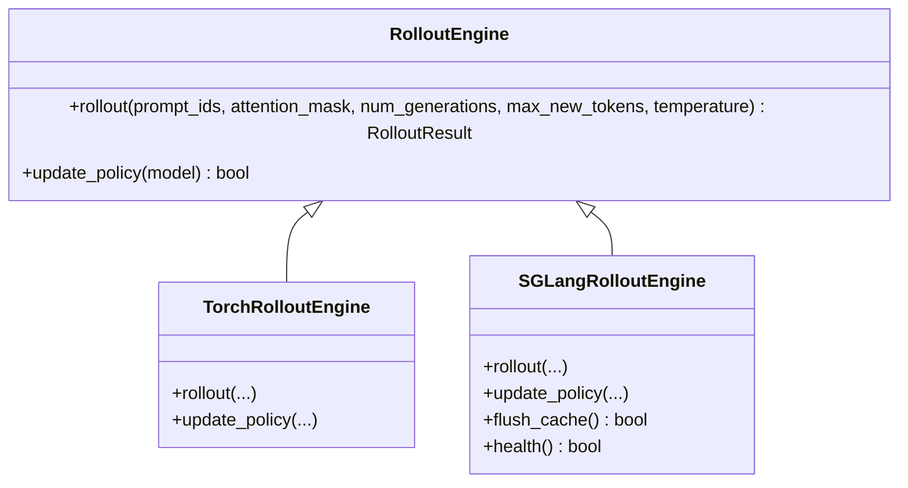

图表来源
- [trainer/rollout_engine.py:46-94](file://trainer/rollout_engine.py#L46-L94)
- [trainer/rollout_engine.py:96-182](file://trainer/rollout_engine.py#L96-L182)
- [trainer/rollout_engine.py:196-213](file://trainer/rollout_engine.py#L196-L213)

章节来源
- [trainer/rollout_engine.py:1-213](file://trainer/rollout_engine.py#L1-L213)

### LoRA 参数高效微调
- apply_lora：在线性层上注入 LoRA 模块，修改 forward 实现残差叠加。
- save_lora/load_lora：保存/加载 LoRA 权重，支持合并到基础权重。
- 训练脚本冻结非 LoRA 参数，仅优化 LoRA 参数，显著降低显存与计算开销。

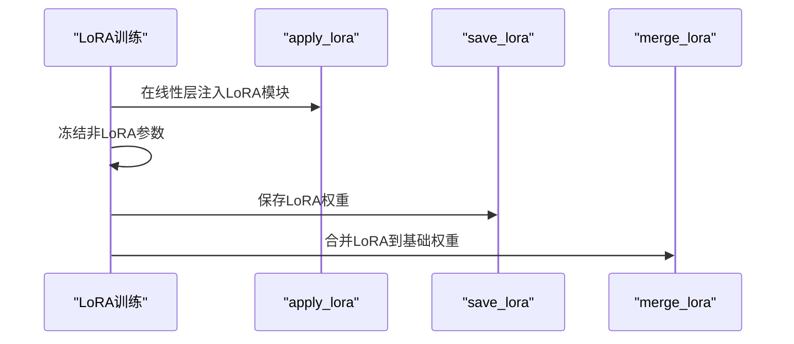

图表来源
- [model/model_lora.py:21-33](file://model/model_lora.py#L21-L33)
- [model/model_lora.py:45-53](file://model/model_lora.py#L45-L53)
- [model/model_lora.py:56-66](file://model/model_lora.py#L56-L66)
- [trainer/train_lora.py:127-146](file://trainer/train_lora.py#L127-L146)

章节来源
- [model/model_lora.py:1-66](file://model/model_lora.py#L1-L66)
- [trainer/train_lora.py:127-146](file://trainer/train_lora.py#L127-L146)

### 数据集与预处理
- PretrainDataset/SFTDataset/DPODataset/RLAIFDataset：统一 tokenization、截断、padding、标签生成。
- SFT 标签生成：依据 chat_template 生成的 prompt 中，仅对 assistant 回答部分保留标签。
- DPO 数据：将 chosen/rejected 成对样本拼接为模型输入，生成 loss mask。

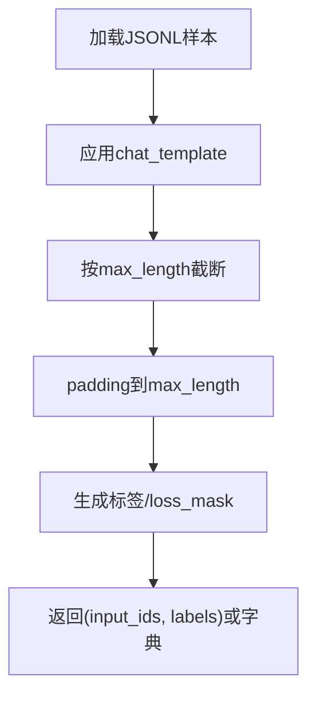

图表来源
- [dataset/lm_dataset.py:37-55](file://dataset/lm_dataset.py#L37-L55)
- [dataset/lm_dataset.py:58-119](file://dataset/lm_dataset.py#L58-L119)
- [dataset/lm_dataset.py:122-193](file://dataset/lm_dataset.py#L122-L193)
- [dataset/lm_dataset.py:195-224](file://dataset/lm_dataset.py#L195-L224)

章节来源
- [dataset/lm_dataset.py:1-256](file://dataset/lm_dataset.py#L1-L256)

### 模型结构与 MoE
- MiniMindConfig：定义模型超参，支持 MoE 相关配置。
- MiniMindModel：嵌入层、多层 Block、RMSNorm、RoPE、注意力与 FFN。
- MOEFeedForward：Top-1 路由专家前馈，训练时计算 router auxiliary loss。
- MiniMindForCausalLM：LM 头与 generate 推理逻辑。

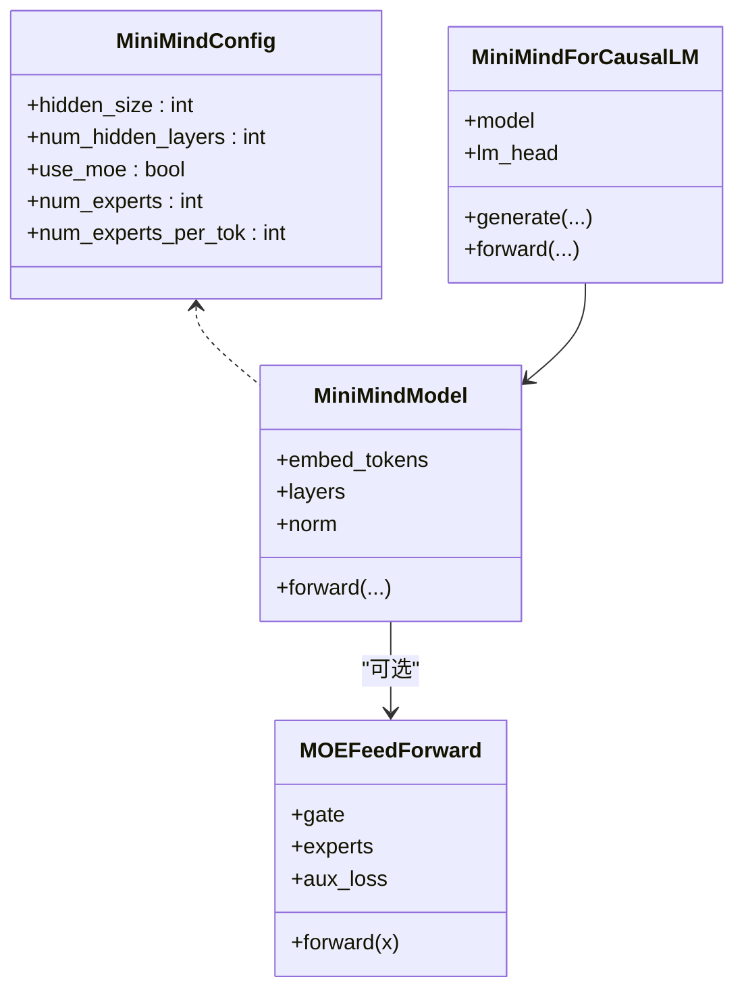

图表来源
- [model/model_minimind.py:10-45](file://model/model_minimind.py#L10-L45)
- [model/model_minimind.py:195-227](file://model/model_minimind.py#L195-L227)
- [model/model_minimind.py:147-176](file://model/model_minimind.py#L147-L176)
- [model/model_minimind.py:229-280](file://model/model_minimind.py#L229-L280)

章节来源
- [model/model_minimind.py:1-280](file://model/model_minimind.py#L1-L280)

## 依赖关系分析
- 训练脚本依赖 trainer_utils 提供的分布式初始化、随机种子、学习率、检查点、模型初始化、采样器等工具。
- PPO/GRPO 依赖 rollout_engine 提供的推理后端（Torch 或 SGLang）。
- LoRA 训练依赖 model_lora 的 apply/save/load/merge 实现。
- 数据加载依赖 dataset/lm_dataset 的 Dataset 实现。

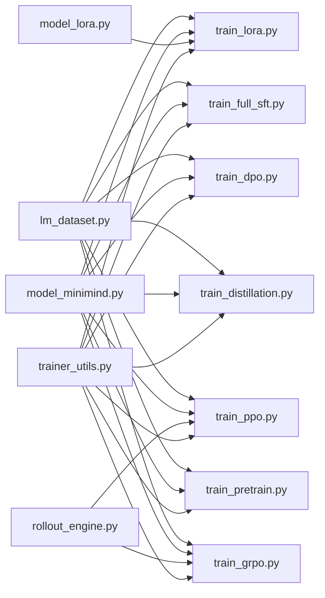

图表来源
- [trainer/train_full_sft.py:18-18](file://trainer/train_full_sft.py#L18-L18)
- [trainer/train_lora.py:18-19](file://trainer/train_lora.py#L18-L19)
- [trainer/train_dpo.py:18-19](file://trainer/train_dpo.py#L18-L19)
- [trainer/train_ppo.py:23-24](file://trainer/train_ppo.py#L23-L24)
- [trainer/train_grpo.py:24-25](file://trainer/train_grpo.py#L24-L25)
- [trainer/train_distillation.py:18-19](file://trainer/train_distillation.py#L18-L19)
- [trainer/train_pretrain.py:18-18](file://trainer/train_pretrain.py#L18-L18)
- [trainer/rollout_engine.py:1-213](file://trainer/rollout_engine.py#L1-L213)
- [model/model_lora.py:1-66](file://model/model_lora.py#L1-L66)
- [model/model_minimind.py:1-280](file://model/model_minimind.py#L1-L280)
- [dataset/lm_dataset.py:1-256](file://dataset/lm_dataset.py#L1-L256)

章节来源
- [trainer/train_full_sft.py:1-171](file://trainer/train_full_sft.py#L1-L171)
- [trainer/train_lora.py:1-184](file://trainer/train_lora.py#L1-L184)
- [trainer/train_dpo.py:1-226](file://trainer/train_dpo.py#L1-L226)
- [trainer/train_ppo.py:1-444](file://trainer/train_ppo.py#L1-L444)
- [trainer/train_grpo.py:1-332](file://trainer/train_grpo.py#L1-L332)
- [trainer/train_distillation.py:1-246](file://trainer/train_distillation.py#L1-L246)
- [trainer/train_pretrain.py:1-170](file://trainer/train_pretrain.py#L1-L170)
- [trainer/rollout_engine.py:1-213](file://trainer/rollout_engine.py#L1-L213)
- [model/model_lora.py:1-66](file://model/model_lora.py#L1-L66)
- [model/model_minimind.py:1-280](file://model/model_minimind.py#L1-L280)
- [dataset/lm_dataset.py:1-256](file://dataset/lm_dataset.py#L1-L256)

## 性能考量
- 混合精度：bfloat16/float16 降低显存占用与算力消耗，GradScaler 避免数值不稳定。
- 梯度累积：通过 accumulation_steps 减少显存峰值，提高有效 batch size。
- 梯度裁剪：clip_grad_norm 防止梯度爆炸，提升训练稳定性。
- 分布式训练：DDP 并行，忽略特定缓冲以减少同步开销。
- 推理后端：SGLang 可显著降低推理延迟，支持权重热更新与缓存刷新。
- 模型结构：MoE 在训练时开销较大，需注意 kernel 启停与调度开销；推理时可获更优吞吐。

章节来源
- [trainer/train_full_sft.py:93-94](file://trainer/train_full_sft.py#L93-L94)
- [trainer/train_ppo.py:315-332](file://trainer/train_ppo.py#L315-L332)
- [trainer/train_grpo.py:225-238](file://trainer/train_grpo.py#L225-L238)
- [trainer/train_distillation.py:156-157](file://trainer/train_distillation.py#L156-L157)
- [trainer/rollout_engine.py:176-182](file://trainer/rollout_engine.py#L176-L182)
- [model/model_minimind.py:147-176](file://model/model_minimind.py#L147-L176)

## 故障排除指南
- 分布式初始化失败
  - 确认环境变量 RANK/LOCAL_RANK 设置正确，NCCL 后端可用。
  - 检查 GPU 设备号与 CUDA 可用性。
- 检查点恢复异常
  - 确认 checkpoints 目录存在且权限可写。
  - 跨 GPU 数量恢复时，step 会按 world_size 自动换算，避免重复训练。
- 混合精度报错
  - CPU 环境下使用 nullcontext，CUDA 环境下选择 bfloat16/float16。
  - GradScaler 与 unscale/unlock 步骤需严格匹配。
- 推理后端问题
  - SGLang 服务健康检查失败时，优先检查端口与网络连通性。
  - 权重热更新失败时，检查共享存储路径与权限。
- 内存不足
  - 降低 batch size 或增大 accumulation_steps。
  - 启用梯度裁剪，避免无效梯度放大。
  - 使用 LoRA 或蒸馏降低参数规模。

章节来源
- [trainer/trainer_utils.py:44-51](file://trainer/trainer_utils.py#L44-L51)
- [trainer/trainer_utils.py:107-116](file://trainer/trainer_utils.py#L107-L116)
- [trainer/train_full_sft.py:119-138](file://trainer/train_full_sft.py#L119-L138)
- [trainer/rollout_engine.py:188-193](file://trainer/rollout_engine.py#L188-L193)
- [trainer/train_lora.py:163-168](file://trainer/train_lora.py#L163-L168)

## 结论
MiniMind 的训练工具与实用程序以“可复现、可扩展、可移植”为目标，通过统一的分布式初始化、随机种子、混合精度、检查点管理与学习率调度，支撑从预训练到指令微调、LoRA、DPO、PPO/GRPO、蒸馏等全链路训练。配套的 rollout 引擎与数据集实现进一步提升了训练灵活性与效率。建议在生产环境中结合 SwanLab 可视化、分布式训练与检查点恢复机制，确保训练稳定性与可追溯性。

## 附录
- 训练命令与参数说明可参考 README 的“快速开始”与“主要训练”章节。
- 各训练脚本均支持 --from_resume 自动检测与恢复训练进度。
- 可视化工具默认使用 SwanLab（兼容 W&B），便于国内网络环境使用。

章节来源
- [README.md:300-370](file://README.md#L300-L370)
- [README.md:670-735](file://README.md#L670-L735)