# 训练算法实现

<cite>
**本文档引用的文件**
- [train_pretrain.py](file://trainer/train_pretrain.py)
- [train_full_sft.py](file://trainer/train_full_sft.py)
- [train_lora.py](file://trainer/train_lora.py)
- [train_dpo.py](file://trainer/train_dpo.py)
- [train_ppo.py](file://trainer/train_ppo.py)
- [train_grpo.py](file://trainer/train_grpo.py)
- [train_distillation.py](file://trainer/train_distillation.py)
- [trainer_utils.py](file://trainer/trainer_utils.py)
- [rollout_engine.py](file://trainer/rollout_engine.py)
- [model_minimind.py](file://model/model_minimind.py)
- [model_lora.py](file://model/model_lora.py)
- [lm_dataset.py](file://dataset/lm_dataset.py)
- [README.md](file://README.md)
</cite>

## 目录
1. [简介](#简介)
2. [项目结构](#项目结构)
3. [核心组件](#核心组件)
4. [架构概览](#架构概览)
5. [详细组件分析](#详细组件分析)
6. [依赖分析](#依赖分析)
7. [性能考虑](#性能考虑)
8. [故障排除指南](#故障排除指南)
9. [结论](#结论)

## 简介

MiniMind 是一个从零开始训练的小型语言模型项目，提供了完整的训练算法实现。本文档详细分析了各种训练算法的实现原理和代码细节，包括预训练、监督微调、LoRA 微调、DPO、PPO、GRPO、知识蒸馏等。

该项目的核心特点是：
- 完全从零实现的训练算法
- 支持多种训练范式（监督学习、强化学习、知识蒸馏）
- 兼容分布式训练和检查点保存
- 提供详细的训练配置参数说明

## 项目结构

项目采用模块化设计，主要包含以下核心目录：

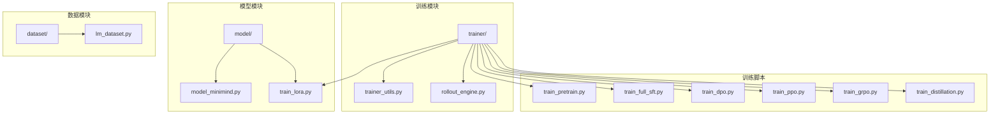

**图表来源**
- [trainer/train_pretrain.py:1-170](file://trainer/train_pretrain.py#L1-L170)
- [trainer/train_full_sft.py:1-171](file://trainer/train_full_sft.py#L1-L171)
- [trainer/train_lora.py:1-184](file://trainer/train_lora.py#L1-L184)
- [trainer/train_dpo.py:1-226](file://trainer/train_dpo.py#L1-L226)
- [trainer/train_ppo.py:1-444](file://trainer/train_ppo.py#L1-L444)
- [trainer/train_grpo.py:1-332](file://trainer/train_grpo.py#L1-L332)
- [trainer/train_distillation.py:1-246](file://trainer/train_distillation.py#L1-L246)

**章节来源**
- [README.md:1-100](file://README.md#L1-L100)

## 核心组件

### 训练工具函数

训练工具模块提供了核心的训练基础设施：

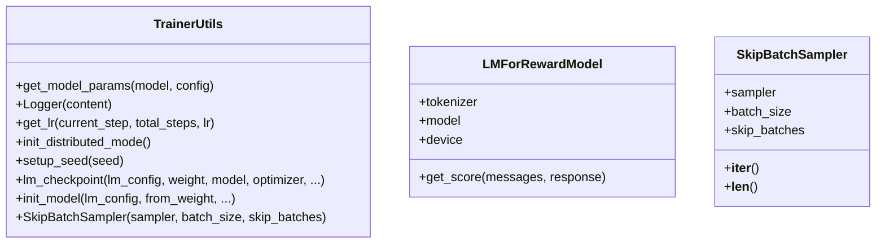

**图表来源**
- [trainer_utils.py:1-177](file://trainer/trainer_utils.py#L1-L177)

### 模型架构

MiniMind 模型采用 Transformer Decoder-only 架构：

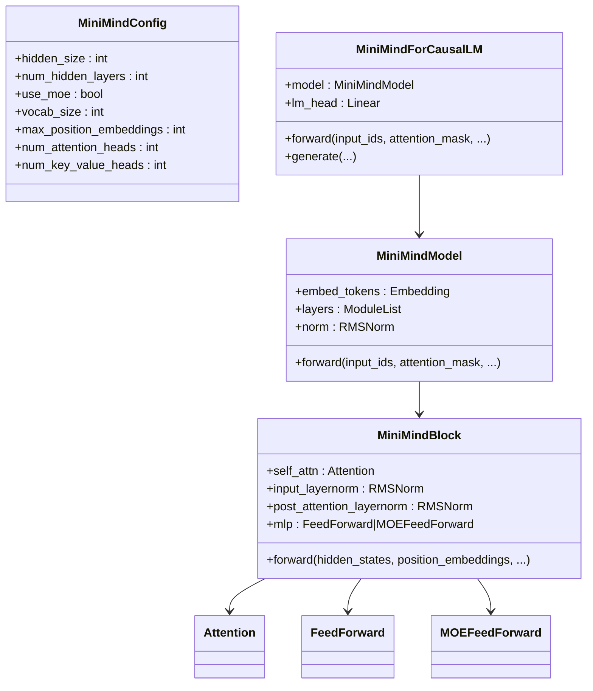

**图表来源**
- [model/model_minimind.py:10-280](file://model/model_minimind.py#L10-L280)

**章节来源**
- [trainer/trainer_utils.py:1-177](file://trainer/trainer_utils.py#L1-L177)
- [model/model_minimind.py:1-280](file://model/model_minimind.py#L1-L280)

## 架构概览

MiniMind 的训练架构采用了统一的训练框架，支持多种训练范式：

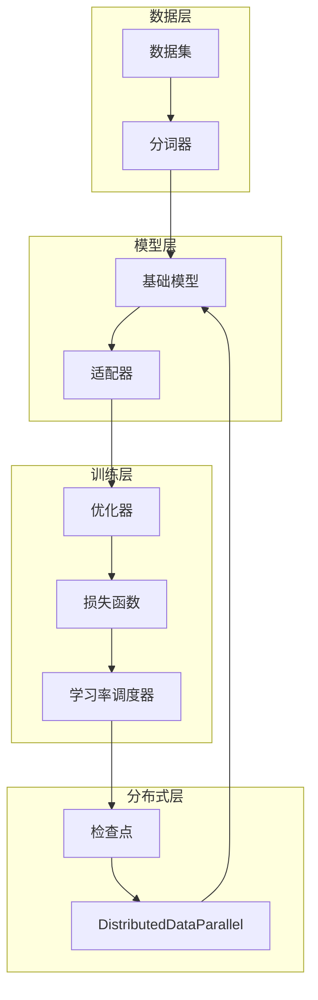

**图表来源**
- [trainer/train_pretrain.py:132-170](file://trainer/train_pretrain.py#L132-L170)
- [trainer/train_full_sft.py:133-171](file://trainer/train_full_sft.py#L133-L171)
- [trainer/train_lora.py:127-184](file://trainer/train_lora.py#L127-L184)

## 详细组件分析

### 预训练算法 (Pretrain)

预训练是语言模型训练的第一阶段，目标是让模型学会语言的基本规律和知识。

#### 目标函数和损失计算

预训练使用标准的自回归语言模型损失：

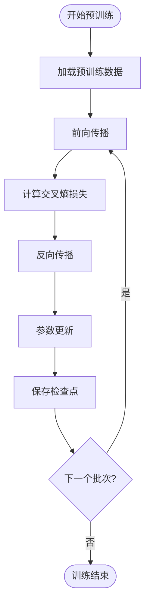

**图表来源**
- [train_pretrain.py:23-81](file://trainer/train_pretrain.py#L23-L81)

#### 训练流程

预训练采用标准的监督学习范式：

1. **数据准备**: 使用文本到下一个 token 预测格式
2. **模型初始化**: 从随机权重开始或从之前的检查点恢复
3. **训练循环**: 
   - 前向传播计算损失
   - 反向传播计算梯度
   - 梯度裁剪防止爆炸
   - 参数更新
4. **检查点保存**: 定期保存模型权重和优化器状态

**章节来源**
- [train_pretrain.py:1-170](file://trainer/train_pretrain.py#L1-L170)
- [dataset/lm_dataset.py:37-56](file://dataset/lm_dataset.py#L37-L56)

### 监督微调 (Full SFT)

监督微调阶段让模型适应特定的任务和对话格式。

#### 目标函数

SFT 使用标准的交叉熵损失，但针对对话格式进行了优化：

```mermaid
sequenceDiagram
participant Data as 数据加载器
participant Model as 模型
participant Loss as 损失函数
participant Opt as 优化器
Data->>Model : 输入对话序列
Model->>Model : 生成下一个token
Model->>Loss : 计算交叉熵损失
Loss->>Opt : 反向传播梯度
Opt->>Model : 更新参数
Model->>Data : 下一批次
```

**图表来源**
- [train_full_sft.py:23-82](file://trainer/train_full_sft.py#L23-L82)

**章节来源**
- [train_full_sft.py:1-171](file://trainer/train_full_sft.py#L1-L171)
- [dataset/lm_dataset.py:58-119](file://dataset/lm_dataset.py#L58-L119)

### LoRA 微调

LoRA (Low-Rank Adaptation) 是一种参数高效微调方法。

#### LoRA 实现原理

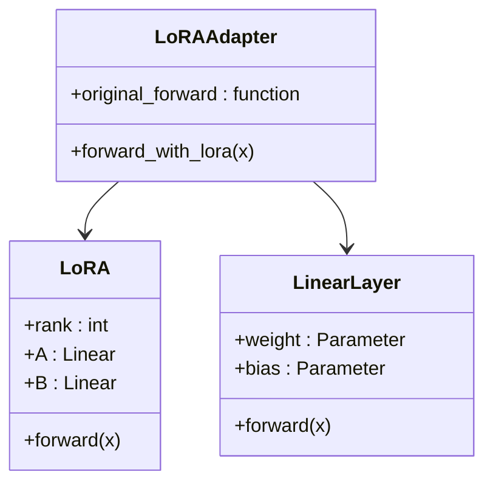

**图表来源**
- [model/model_lora.py:5-66](file://model/model_lora.py#L5-L66)

#### 训练策略

LoRA 的训练策略包括：

1. **参数冻结**: 冻结基础模型的所有参数
2. **适配器初始化**: 仅初始化 LoRA 适配器参数
3. **优化器配置**: 仅优化 LoRA 参数
4. **权重合并**: 训练完成后可将 LoRA 权重合并到基础模型

**章节来源**
- [train_lora.py:1-184](file://trainer/train_lora.py#L1-L184)
- [model/model_lora.py:1-66](file://model/model_lora.py#L1-L66)

### DPO 算法 (Direct Preference Optimization)

DPO 是一种直接偏好优化算法，无需训练奖励模型。

#### 损失函数

DPO 的损失函数基于偏好对的对数几率：

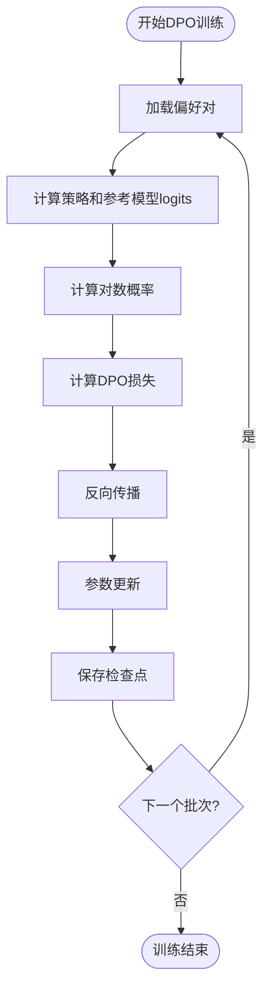

**图表来源**
- [train_dpo.py:52-128](file://trainer/train_dpo.py#L52-L128)

#### 训练流程

DPO 的训练流程具有以下特点：

1. **参考模型**: 使用固定的参考模型（通常是预训练模型）
2. **偏好对**: 使用人类标注的偏好对数据
3. **单模型训练**: 只训练策略模型，无需奖励模型
4. **稳定性**: 相比 PPO 更稳定，收敛更快

**章节来源**
- [train_dpo.py:1-226](file://trainer/train_dpo.py#L1-L226)

### PPO 算法 (Proximal Policy Optimization)

PPO 是一种经典的强化学习算法，使用 Actor-Critic 架构。

#### Actor-Critic 架构

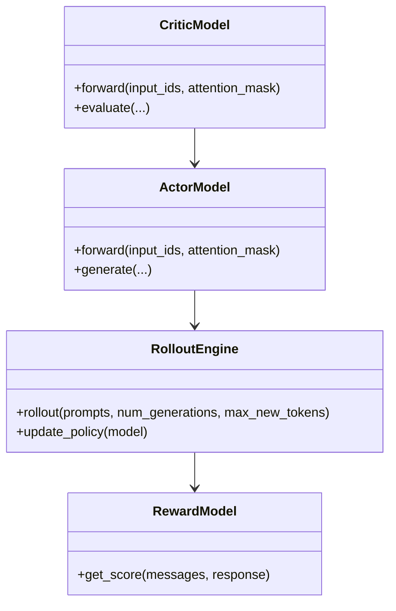

**图表来源**
- [trainer/train_ppo.py:35-76](file://trainer/train_ppo.py#L35-L76)
- [trainer/rollout_engine.py:45-94](file://trainer/rollout_engine.py#L45-L94)

#### PPO 损失函数

PPO 使用裁剪的概率比损失：

```
L_PPO = -E[min(r_t * A_t, clip(r_t, 1-ε, 1+ε) * A_t)]
```

其中：
- r_t 是新旧策略的概率比
- A_t 是优势函数
- ε 是裁剪参数

**章节来源**
- [train_ppo.py:1-444](file://trainer/train_ppo.py#L1-L444)
- [trainer/rollout_engine.py:1-213](file://trainer/rollout_engine.py#L1-L213)

### GRPO 算法 (Group Relative Policy Optimization)

GRPO 是一种相对价值估计的强化学习算法。

#### 优势估计

GRPO 使用组内相对优势估计：

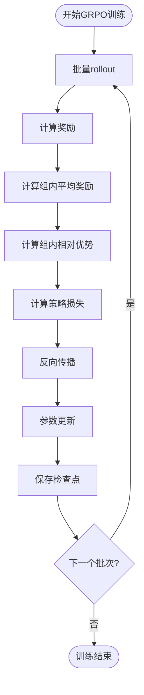

**图表来源**
- [train_grpo.py:70-200](file://trainer/train_grpo.py#L70-L200)

#### 训练特点

GRPO 的主要特点是：
1. **组内优势**: 使用组内平均奖励作为基线
2. **单网络架构**: 无需训练 Critic 网络
3. **稳定性**: 相比 PPO 更稳定，收敛更快
4. **CISPO 变体**: 支持裁剪重要性采样策略优化

**章节来源**
- [train_grpo.py:1-332](file://trainer/train_grpo.py#L1-L332)

### 知识蒸馏

知识蒸馏通过教师模型指导学生模型的训练。

#### 损失函数

知识蒸馏使用混合损失函数：

```
L_total = α * L_CE + (1-α) * T² * KL(P_teacher || P_student)
```

其中：
- L_CE 是交叉熵损失
- KL 是 KL 散度
- T 是温度参数
- α 是权重系数

#### 训练策略

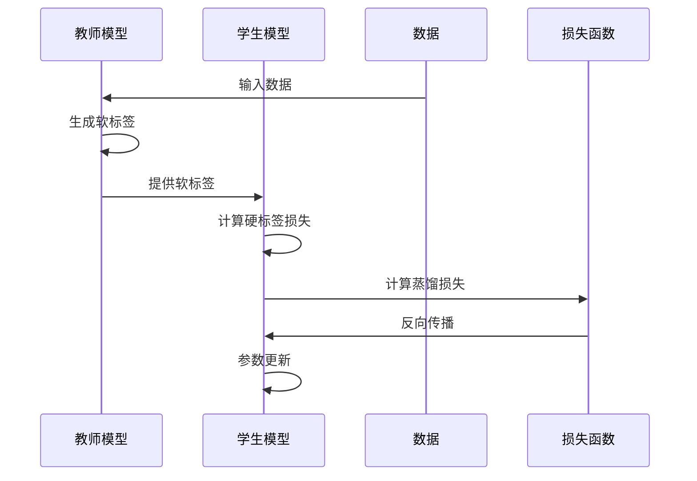

**图表来源**
- [train_distillation.py:24-143](file://trainer/train_distillation.py#L24-L143)

**章节来源**
- [train_distillation.py:1-246](file://trainer/train_distillation.py#L1-L246)

## 依赖分析

### 训练脚本依赖关系

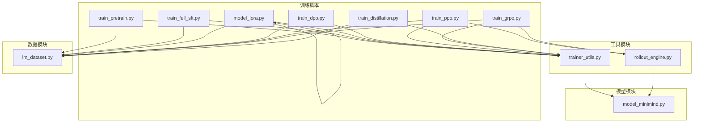

**图表来源**
- [trainer/train_pretrain.py:1-20](file://trainer/train_pretrain.py#L1-L20)
- [trainer/train_full_sft.py:1-20](file://trainer/train_full_sft.py#L1-L20)
- [trainer/train_lora.py:1-20](file://trainer/train_lora.py#L1-L20)
- [trainer/train_dpo.py:1-20](file://trainer/train_dpo.py#L1-L20)
- [trainer/train_ppo.py:1-25](file://trainer/train_ppo.py#L1-L25)
- [trainer/train_grpo.py:1-26](file://trainer/train_grpo.py#L1-L26)
- [trainer/train_distillation.py:1-20](file://trainer/train_distillation.py#L1-L20)

### 关键依赖关系

1. **分布式训练**: 所有训练脚本都依赖 `trainer_utils.py` 的分布式训练功能
2. **模型加载**: 训练脚本通过 `init_model` 函数加载模型权重
3. **数据处理**: 所有训练脚本使用 `lm_dataset.py` 提供的数据集
4. **检查点**: `lm_checkpoint` 函数提供统一的检查点保存机制
5. **推理引擎**: PPO 和 GRPO 使用 `rollout_engine.py` 提供的推理引擎

**章节来源**
- [trainer/trainer_utils.py:63-116](file://trainer/trainer_utils.py#L63-L116)
- [trainer/rollout_engine.py:196-213](file://trainer/rollout_engine.py#L196-L213)

## 性能考虑

### 训练配置参数

| 参数类别 | 关键参数 | 默认值 | 说明 |
|---------|---------|--------|------|
| 基础配置 | epochs, batch_size, learning_rate | 2, 32, 5e-4 | 基础训练参数 |
| 混合精度 | dtype, accumulation_steps | bfloat16, 8 | 混合精度训练 |
| 梯度控制 | grad_clip, log_interval | 1.0, 100 | 梯度裁剪和日志间隔 |
| 分布式 | num_workers, device | 8, cuda:0 | 分布式训练配置 |
| 模型架构 | hidden_size, num_hidden_layers | 768, 8 | 模型规模配置 |

### 性能优化策略

1. **混合精度训练**: 使用 bfloat16 或 float16 减少内存占用
2. **梯度累积**: 通过 `accumulation_steps` 模拟大批次训练
3. **分布式训练**: 使用 DDP 加速多 GPU 训练
4. **检查点保存**: 定期保存检查点避免训练中断损失
5. **学习率调度**: 使用余弦退火调度器优化收敛

### 内存优化

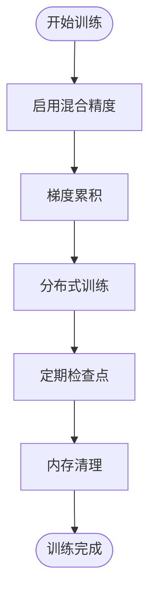

**图表来源**
- [trainer/train_pretrain.py:118-121](file://trainer/train_pretrain.py#L118-L121)
- [trainer/train_full_sft.py:119-122](file://trainer/train_full_sft.py#L119-L122)

## 故障排除指南

### 常见问题和解决方案

#### 分布式训练问题

**问题**: NCCL 初始化失败
**解决方案**: 
1. 检查 `RANK` 和 `LOCAL_RANK` 环境变量
2. 确认 CUDA 设备可用性
3. 使用 `torchrun` 启动分布式训练

**问题**: 梯度不同步
**解决方案**:
1. 检查 `DistributedDataParallel` 配置
2. 确认忽略参数列表正确设置
3. 验证所有 GPU 设备同步

#### 内存问题

**问题**: 显存不足
**解决方案**:
1. 减小 `batch_size`
2. 增加 `accumulation_steps`
3. 使用混合精度训练 (`bfloat16`)
4. 减少 `max_seq_len`

#### 训练稳定性问题

**问题**: 训练不收敛
**解决方案**:
1. 检查学习率设置
2. 调整 `grad_clip` 参数
3. 验证数据质量
4. 检查梯度累积设置

**章节来源**
- [trainer/trainer_utils.py:44-62](file://trainer/trainer_utils.py#L44-L62)
- [trainer/train_pretrain.py:108-111](file://trainer/train_pretrain.py#L108-L111)

### 调试技巧

1. **日志监控**: 使用 `log_interval` 参数监控训练进度
2. **检查点恢复**: 利用 `from_resume` 参数自动恢复训练
3. **参数统计**: 使用 `get_model_params` 函数监控模型参数量
4. **分布式调试**: 使用 `is_main_process` 函数隔离主进程日志

## 结论

MiniMind 项目提供了完整的训练算法实现，涵盖了从零开始训练语言模型的各种方法。通过统一的训练框架和模块化设计，项目实现了：

1. **多样化的训练范式**: 支持监督学习、强化学习、知识蒸馏等多种训练方法
2. **高效的实现**: 所有算法都从零实现，便于理解和优化
3. **完整的工具链**: 提供数据处理、模型加载、分布式训练、检查点保存等完整工具
4. **良好的可扩展性**: 模块化设计便于添加新的训练算法和功能

这些特性使得 MiniMind 成为学习和研究语言模型训练算法的理想平台，为研究人员和开发者提供了深入了解 LLM 训练过程的机会。