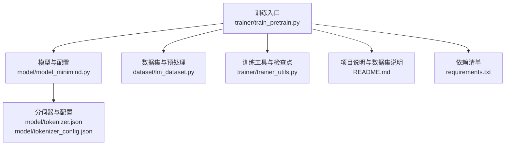
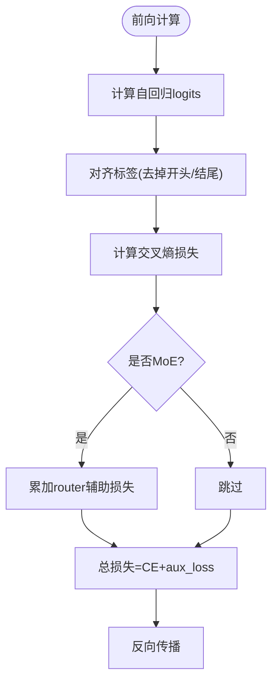
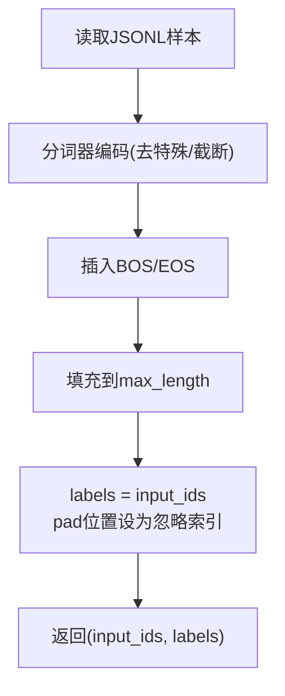
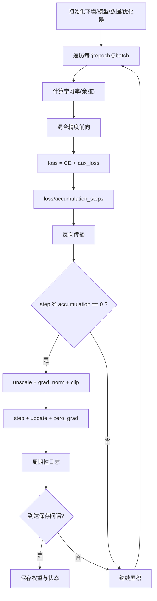
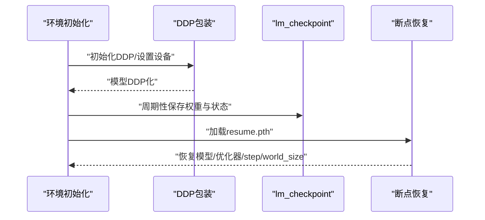
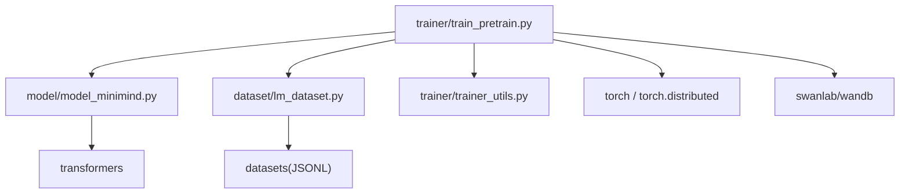

# 预训练算法

<cite>
**本文引用的文件**
- [train_pretrain.py](file://trainer/train_pretrain.py)
- [model_minimind.py](file://model/model_minimind.py)
- [lm_dataset.py](file://dataset/lm_dataset.py)
- [trainer_utils.py](file://trainer/trainer_utils.py)
- [README.md](file://README.md)
- [tokenizer.json](file://model/tokenizer.json)
- [tokenizer_config.json](file://model/tokenizer_config.json)
- [requirements.txt](file://requirements.txt)
</cite>

## 目录
1. [引言](#引言)
2. [项目结构](#项目结构)
3. [核心组件](#核心组件)
4. [架构总览](#架构总览)
5. [详细组件分析](#详细组件分析)
6. [依赖分析](#依赖分析)
7. [性能考量](#性能考量)
8. [故障排查指南](#故障排查指南)
9. [结论](#结论)
10. [附录](#附录)

## 引言
本文件面向 MiniMind 预训练算法的技术文档，聚焦自回归语言模型的目标函数与损失计算、训练流程、数据集构建与预处理、混合精度与梯度累积、学习率调度、分布式训练与断点续训等关键主题。文档以代码为依据，结合 README 的背景说明，帮助读者从实现细节到工程实践全面理解 MiniMind 的预训练链路。

## 项目结构
- 训练入口与流程：trainer/train_pretrain.py
- 模型与配置：model/model_minimind.py
- 数据集与预处理：dataset/lm_dataset.py
- 训练工具与检查点：trainer/trainer_utils.py
- 项目说明与数据集说明：README.md
- 分词器与配置：model/tokenizer.json、model/tokenizer_config.json
- 依赖清单：requirements.txt



图表来源
- [train_pretrain.py:1-170](file://trainer/train_pretrain.py#L1-L170)
- [model_minimind.py:1-280](file://model/model_minimind.py#L1-L280)
- [lm_dataset.py:1-256](file://dataset/lm_dataset.py#L1-L256)
- [trainer_utils.py:1-177](file://trainer/trainer_utils.py#L1-L177)
- [README.md:1-800](file://README.md#L1-L800)
- [requirements.txt:1-32](file://requirements.txt#L1-L32)

章节来源
- [train_pretrain.py:1-170](file://trainer/train_pretrain.py#L1-L170)
- [model_minimind.py:1-280](file://model/model_minimind.py#L1-L280)
- [lm_dataset.py:1-256](file://dataset/lm_dataset.py#L1-L256)
- [trainer_utils.py:1-177](file://trainer/trainer_utils.py#L1-L177)
- [README.md:1-800](file://README.md#L1-L800)
- [requirements.txt:1-32](file://requirements.txt#L1-L32)

## 核心组件
- 预训练模型与配置：MiniMindConfig、MiniMindForCausalLM、MiniMindModel、Attention、FeedForward/MOEFeedForward、RMSNorm、RoPE/YaRN 位置编码等。
- 预训练数据集：PretrainDataset，负责将 JSONL 文本转为自回归样本（input_ids/labels）。
- 训练流程：train_epoch 循环，包含学习率调度、混合精度、梯度累积、梯度裁剪、日志与检查点保存。
- 训练工具：分布式初始化、随机种子设置、断点续训、SkipBatchSampler、模型参数统计等。

章节来源
- [model_minimind.py:10-45](file://model/model_minimind.py#L10-L45)
- [model_minimind.py:229-246](file://model/model_minimind.py#L229-L246)
- [lm_dataset.py:37-55](file://dataset/lm_dataset.py#L37-L55)
- [train_pretrain.py:23-81](file://trainer/train_pretrain.py#L23-L81)
- [trainer_utils.py:44-62](file://trainer/trainer_utils.py#L44-L62)
- [trainer_utils.py:63-117](file://trainer/trainer_utils.py#L63-L117)
- [trainer_utils.py:134-158](file://trainer/trainer_utils.py#L134-L158)

## 架构总览
预训练训练循环围绕“数据加载 → 前向计算 → 损失与辅助损失 → 反向传播 → 梯度累积与优化器更新 → 日志与检查点保存”的主干展开。模型采用 Decoder-only 架构，自回归目标通过交叉熵损失实现，同时在 MoE 模式下引入 router 辅助损失。

```mermaid
sequenceDiagram
participant CLI as "命令行"
participant Train as "train_epoch"
participant Loader as "DataLoader"
participant Model as "MiniMindForCausalLM"
participant Opt as "AdamW + GradScaler"
participant CKP as "lm_checkpoint"
CLI->>Train : "开始训练"
Train->>Loader : "批量加载样本"
Loader-->>Train : "(input_ids, labels)"
Train->>Opt : "设置学习率"
Train->>Model : "前向计算(含labels)"
Model-->>Train : "loss + aux_loss"
Train->>Opt : "scale(loss/accum_steps).backward()"
alt "累积步数整除"
Train->>Opt : "unscale_ + clip_grad + step + update"
Opt-->>Train : "优化器更新"
Train->>CKP : "周期性保存权重与状态"
end
Train-->>CLI : "日志与ETA"
```

图表来源
- [train_pretrain.py:23-81](file://trainer/train_pretrain.py#L23-L81)
- [model_minimind.py:229-246](file://model/model_minimind.py#L229-L246)
- [trainer_utils.py:63-117](file://trainer/trainer_utils.py#L63-L117)

## 详细组件分析

### 自回归语言模型与目标函数
- 模型结构：Decoder-only，预规范化 + RMSNorm，注意力采用 RoPE 与可选 YaRN 外推，FFN 支持 MoE。
- 自回归目标：MiniMindForCausalLM 的 forward 在提供 labels 时返回交叉熵损失；同时返回 aux_loss（MoE router 辅助损失）。
- 损失构成：总损失 = 交叉熵损失 + MoE 辅助损失；训练中二者相加参与反向传播。



图表来源
- [model_minimind.py:229-246](file://model/model_minimind.py#L229-L246)
- [model_minimind.py:147-175](file://model/model_minimind.py#L147-L175)

章节来源
- [model_minimind.py:229-246](file://model/model_minimind.py#L229-L246)
- [model_minimind.py:147-175](file://model/model_minimind.py#L147-L175)

### 预训练数据集构建与预处理
- 数据格式：JSONL，每行包含字段 text，表示待训练的文本。
- 预处理流程：
  - 使用分词器将文本编码为 token ids，限制最大长度（max_length - 2），并追加 BOS/EOS。
  - 构造 input_ids 与 labels：labels 与 input_ids 相同，pad 位置设为忽略索引。
- 序列截断策略：以 max_length 为上限，不足部分 pad 填充；超过部分按 truncation 截断。



图表来源
- [lm_dataset.py:37-55](file://dataset/lm_dataset.py#L37-L55)

章节来源
- [lm_dataset.py:37-55](file://dataset/lm_dataset.py#L37-L55)
- [README.md:400-424](file://README.md#L400-L424)

### 训练流程与关键实现
- 学习率调度：余弦退火，随总步数线性递减。
- 混合精度：bfloat16 或 float16（CPU禁用），配合 GradScaler 动态缩放。
- 梯度累积：按 accumulation_steps 累积，整除步数时执行 unscale、裁剪、优化器更新与清零。
- 日志与 ETA：周期性打印 loss、aux_loss、lr、剩余时间。
- 检查点保存：周期性保存权重与优化器状态，支持断点续训。



图表来源
- [train_pretrain.py:23-81](file://trainer/train_pretrain.py#L23-L81)
- [trainer_utils.py:40-42](file://trainer/trainer_utils.py#L40-L42)

章节来源
- [train_pretrain.py:23-81](file://trainer/train_pretrain.py#L23-L81)
- [trainer_utils.py:40-42](file://trainer/trainer_utils.py#L40-L42)

### 分布式训练与断点续训
- 分布式初始化：NCCL 后端，本地 rank 设置设备；DDP 包装模型（忽略特定缓冲）。
- 断点续训：lm_checkpoint 保存完整 resume 状态（模型、优化器、epoch、step、world_size、wandb_id），支持跨 GPU 数量恢复与 wandb 连续性。
- SkipBatchSampler：支持跳过已训练过的前若干 batch，实现“从断点继续”。



图表来源
- [train_pretrain.py:148-154](file://trainer/train_pretrain.py#L148-L154)
- [trainer_utils.py:63-117](file://trainer/trainer_utils.py#L63-L117)
- [trainer_utils.py:134-158](file://trainer/trainer_utils.py#L134-L158)

章节来源
- [train_pretrain.py:148-154](file://trainer/train_pretrain.py#L148-L154)
- [trainer_utils.py:63-117](file://trainer/trainer_utils.py#L63-L117)
- [trainer_utils.py:134-158](file://trainer/trainer_utils.py#L134-L158)

### 预训练配置参数详解
- 关键超参数（来自训练入口参数解析）：
  - 保存目录、权重前缀、训练轮数、批次大小、初始学习率、设备、混合精度类型、数据加载线程数、梯度累积步数、梯度裁剪阈值、日志间隔、保存间隔、隐藏层维度、层数、最大序列长度、是否使用MoE、数据路径、从权重继续训练、自动检测续训、wandb开关、项目名、是否使用 torch.compile、是否使用 swanlab。
- 模型配置（来自 MiniMindConfig）：
  - 隐藏维度、层数、是否使用MoE、dropout、词表大小、注意力头数、KV头数、头维、激活函数、中间维、最大位置、RMSNorm eps、RoPE theta、YaRN 缩放参数、MoE 专家数/每token专家数、router辅助损失系数等。
- 选择原则与经验：
  - 隐藏维度与层数：在小模型区间，深度往往比宽度更重要；MiniMind-3 采用 768/8 的工程取舍，兼顾训练稳定性与效率。
  - 最大序列长度：README 提供字符与 tokens 的换算经验，建议在“短样本浪费算力 vs 长样本截断语义”间权衡。
  - 批大小与累积步数：在显存受限时通过累积步数扩大有效批大小，同时注意学习率与步数的对应关系。
  - 混合精度：bfloat16 在大多数 GPU 上更稳定；float16 需谨慎使用，配合 GradScaler。
  - 学习率调度：余弦退火在长程训练中更平滑，有助于收敛稳定性。

章节来源
- [train_pretrain.py:82-106](file://trainer/train_pretrain.py#L82-L106)
- [model_minimind.py:10-45](file://model/model_minimind.py#L10-L45)
- [README.md:588-612](file://README.md#L588-L612)
- [README.md:522-535](file://README.md#L522-L535)

## 依赖分析
- 训练脚本依赖：
  - torch、torch.distributed、DistributedDataParallel、DataLoader、DistributedSampler、AdamW、GradScaler、autocast、cosine 学习率。
  - 自定义模块：MiniMindConfig、MiniMindForCausalLM、PretrainDataset、get_lr、Logger、is_main_process、lm_checkpoint、init_distributed_mode、setup_seed、init_model、SkipBatchSampler。
- 模型与数据依赖：
  - transformers 的 PreTrainedModel、GenerationMixin、MoeCausalLMOutputWithPast。
  - datasets 加载 JSONL 数据集。
  - 分词器配置与 fast tokenizer。
- 可视化与生态：
  - README 提到 swanlab（替代 wandb）与第三方推理生态（llama.cpp、vllm、ollama）。



图表来源
- [train_pretrain.py:16-18](file://trainer/train_pretrain.py#L16-L18)
- [model_minimind.py:3-6](file://model/model_minimind.py#L3-L6)
- [lm_dataset.py:1-7](file://dataset/lm_dataset.py#L1-L7)
- [requirements.txt:1-32](file://requirements.txt#L1-L32)

章节来源
- [train_pretrain.py:16-18](file://trainer/train_pretrain.py#L16-L18)
- [model_minimind.py:3-6](file://model/model_minimind.py#L3-L6)
- [lm_dataset.py:1-7](file://dataset/lm_dataset.py#L1-L7)
- [requirements.txt:1-32](file://requirements.txt#L1-L32)

## 性能考量
- 混合精度与动态缩放：在 GPU 上启用 autocast 与 GradScaler，bfloat16 通常更稳定；float16 需配合裁剪与合理的学习率。
- 梯度累积：在显存受限时扩大有效批大小，注意与学习率/步数的匹配。
- 梯度裁剪：clip_grad_norm 防止梯度爆炸，提高训练稳定性。
- torch.compile：可选加速，需评估兼容性与收益。
- 分布式训练：DDP 包装模型并忽略特定缓冲，减少通信开销。
- 数据加载：pin_memory、num_workers、SkipBatchSampler 减少等待与重复训练。

章节来源
- [train_pretrain.py:118-121](file://trainer/train_pretrain.py#L118-L121)
- [train_pretrain.py:148-154](file://trainer/train_pretrain.py#L148-L154)
- [trainer_utils.py:134-158](file://trainer/trainer_utils.py#L134-L158)

## 故障排查指南
- 训练中断后续训：
  - 确认 checkpoints 目录存在 resume 文件；使用 --from_resume 1 自动检测并恢复。
  - 跨 GPU 数量恢复时，step 会自动按 world_size 转换。
- 检查点保存异常：
  - 临时文件 .tmp 成功替换后才生效；若失败，检查磁盘空间与权限。
- 分布式训练问题：
  - 确认 NCCL 环境变量与后端；确保 LOCAL_RANK 与 CUDA 设备一致。
- 学习率与损失异常：
  - 检查余弦调度的总步数与 epochs*iters 是否一致；确认 accumulation_steps 与 log_interval 的倍数关系。
- 混合精度与梯度问题：
  - float16 需配合 GradScaler；若出现 NaN/Inf，尝试降低学习率或增大裁剪阈值。

章节来源
- [trainer_utils.py:63-117](file://trainer/trainer_utils.py#L63-L117)
- [train_pretrain.py:108-111](file://trainer/train_pretrain.py#L108-L111)
- [train_pretrain.py:148-154](file://trainer/train_pretrain.py#L148-L154)

## 结论
MiniMind 的预训练算法以纯 PyTorch 实现，围绕自回归语言模型目标函数与损失计算，结合混合精度、梯度累积、余弦学习率调度、分布式训练与断点续训，形成一套可复现、可扩展的训练链路。通过合理的超参数选择与工程实践，可在单卡或多卡环境下高效完成预训练任务，并为后续 SFT/RLHF 等阶段奠定基础。

## 附录
- 数据集下载与格式：README 提供数据集下载链接与格式说明，预训练数据为 JSONL，字段为 text。
- 分词器：tokenizer.json 与 tokenizer_config.json 描述了特殊 token、chat_template、最大长度等配置。
- 依赖：requirements.txt 列出了训练与推理所需的第三方库版本。

章节来源
- [README.md:400-424](file://README.md#L400-L424)
- [README.md:497-507](file://README.md#L497-L507)
- [tokenizer.json:1-200](file://model/tokenizer.json#L1-L200)
- [tokenizer_config.json:1-335](file://model/tokenizer_config.json#L1-L335)
- [requirements.txt:1-32](file://requirements.txt#L1-L32)